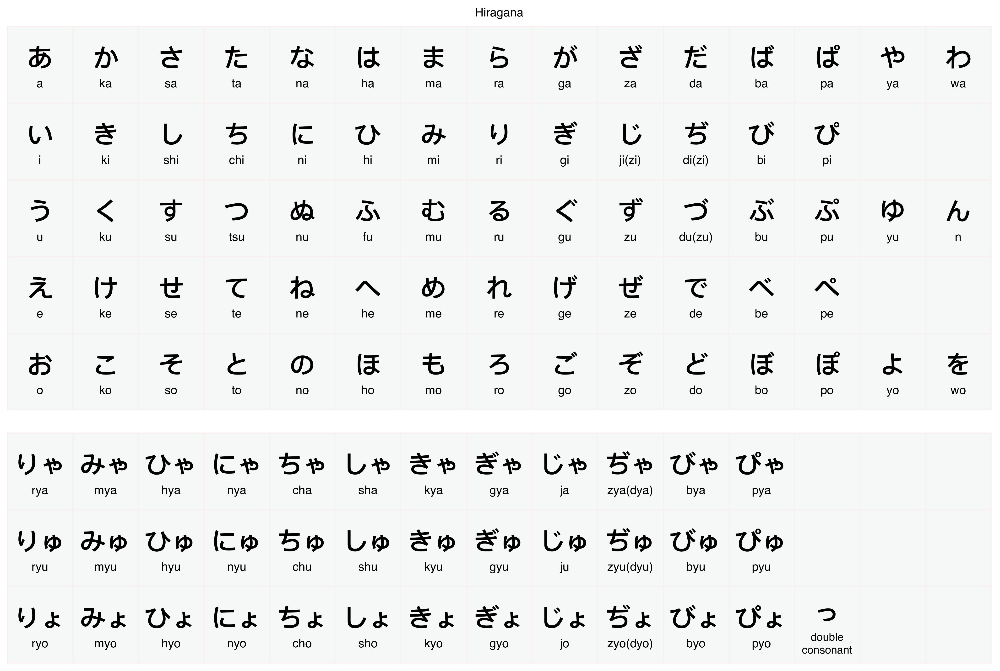
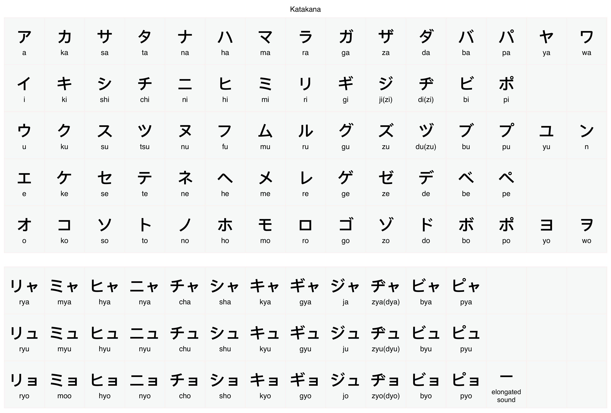
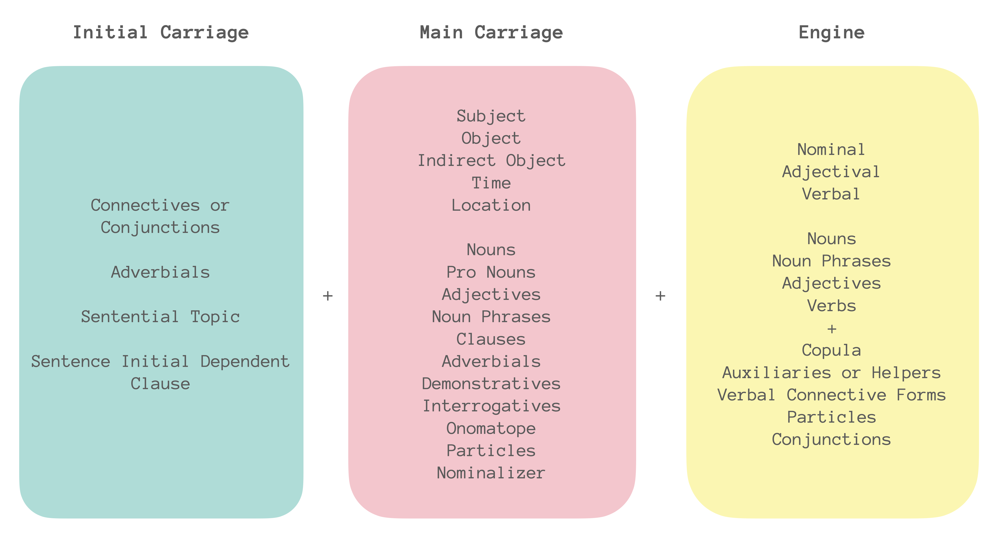
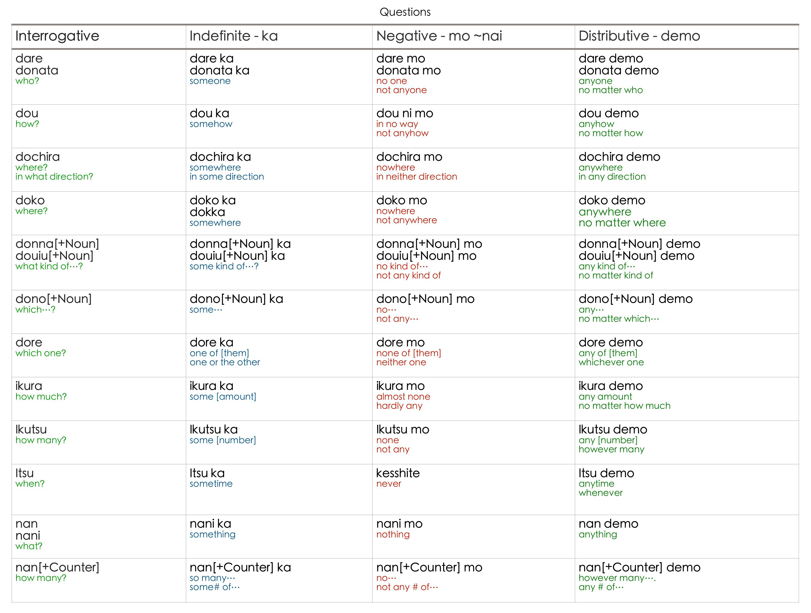
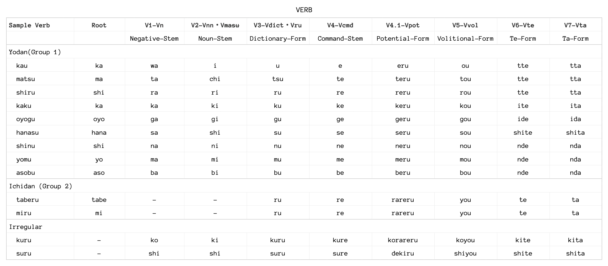

```{=html}
<style type="text/css">

body{
      font-size: 13px;
      font-family: "Anonymous Pro", "Roboto", "Helvetica Neue";
  }
</style>
```


<link rel="preconnect" href="https://fonts.gstatic.com"> 
<link href="https://fonts.googleapis.com/css2?family=M+PLUS+Rounded+1c:wght@100;300;400;500;700&display=swap" rel="stylesheet">
<link rel="preconnect" href="https://fonts.gstatic.com"> <link href="https://fonts.googleapis.com/css2?family=Anonymous+Pro&display=swap" rel="stylesheet"> <link href="https://fonts.googleapis.com/css2?family=Anonymous+Pro:ital,wght@0,400;1,700&display=swap" rel="stylesheet"> <link href="https://fonts.googleapis.com/css2?family=Anonymous+Pro:ital,wght@0,400;0,700;1,700&display=swap" rel="stylesheet">

```{css, echo=FALSE}
.my-tbl {
  border: 1px solid rgba(0, 0, 0, 0.1);
}

.my-header {
  border-width: 1px;
}

.my-col {
  border-right: 1px solid rgba(0, 0, 0, 0.05);
}

.my-row:hover {
  background-color: #f5f8ff;
}
```

```{r setup, include=FALSE}
knitr::opts_chunk$set(echo = TRUE)
```

```{css, echo=FALSE}
@media(prefers-color-scheme: light) {
  body {
    background-color: black;
    filter: invert(1);
  }
}
```

```{r, echo=FALSE, message=FALSE}
library(tidyverse)
library(reactable)
library(htmltools)
library(bslib)
library(dplyr)
library(purrr)
#library(shiny)
```

```{r, echo=FALSE, message=FALSE, error=FALSE}
da <- read_csv("rdata/Sheet 1-ADJ1.csv")
db <- read_csv("rdata/Sheet 2-EXP1.csv")
kn <- read_csv("rdata/Sheet 3-KNJL1.csv")
jl <- read_csv("rdata/Sheet 4-jlpt.csv")
wd <- read_csv("rdata/Sheet 6-WRD.csv")
k1 <- read_csv("rdata/Sheet 7-KNJ1K.csv")
k2 <- read_csv("rdata/Sheet 8-INTK.csv")
k3 <- read_csv("rdata/Sheet 9-SPTK.csv")
v1 <- read_csv("rdata/Sheet 10-VC1.csv")
v2 <- read_csv("rdata/Sheet 86-VC2.csv")
v3 <- read_csv("rdata/Sheet 87-VC3.csv")
v4 <- read_csv("rdata/Sheet 88-VC4.csv")
v5 <- read_csv("rdata/Sheet 89-VC5.csv")
s1 <- read_csv("rdata/Sheet 11-SS1.csv")
m1 <- read_csv("rdata/Sheet 12-KMM1.csv")
j1 <- read_csv("rdata/Sheet 13-MJ1.csv")
s2 <- read_csv("rdata/Sheet 14-SS2.csv")
j2 <- read_csv("rdata/Sheet 15-MJ2.csv")
z1 <- read_csv("rdata/Sheet 16-TZI1.csv")
z2 <- read_csv("rdata/Sheet 17-TZI2.csv")
n1 <- read_csv("rdata/Sheet 18-NMM1.csv")
sws1 <- read_csv("rdata/Sheet 19-NSW1.csv")
nwr1 <- read_csv("rdata/Sheet 20-WNS1.csv")
cnv1 <- read_csv("rdata/Sheet 21-CNV1.csv")
knjd1 <- read_csv("rdata/Sheet 22-KNJD1.csv")
knjd2 <- read_csv("rdata/Sheet 23-KNJD2.csv")
evdd1 <- read_csv("rdata/Sheet 24-EVD1.csv")
knjd3 <- read_csv("rdata/Sheet 26-KNJD3.csv")
knjd4 <- read_csv("rdata/Sheet 27-KNJD4.csv")
knjd5 <- read_csv("rdata/Sheet 28-KNJD5.csv")
intw <- read_csv("rdata/Sheet 30-INTJF1.csv")
vcb1 <- read_csv("rdata/Sheet 38-NSWS1.csv")
srvb1 <- read_csv("rdata/Sheet 39-SRVB1.csv")
srvb2 <- read_csv("rdata/Sheet 41-VRBS1.csv")
srvb3 <- read_csv("rdata/Sheet 42-VRB6S.csv")
advb1 <- read_csv("rdata/Sheet 43-ADVB1.csv")
nadj1 <- read_csv("rdata/Sheet 44-NAADJ1.csv")
srvb4 <- read_csv("rdata/Sheet 45-VRB7.csv")
v1hme <- read_csv("rdata/Sheet 49-VCBT1.csv")
pct1 <- read_csv("rdata/Sheet 51-PCT1.csv")
qsn5 <- read_csv("rdata/Sheet 53-QSNT1.csv")
vrbexp1 <- read_csv("rdata/Sheet 55-VRBXP1.csv")
vnnexp1 <- read_csv("rdata/Sheet 56-NNXP1.csv")
adjexp1 <- read_csv("rdata/Sheet 57-ADJXP1.csv")
tchnl <- read_csv("rdata/Sheet 58-TCHN1.csv")
trvy <- read_csv("rdata/Sheet 60-TRSTVY1.csv")
phvrb <- read_csv("rdata/Sheet 59-PVRB1.csv")
vrben <- read_csv("rdata/Sheet 65-VRBCN.csv")
knjdu <- read_csv("rdata/Sheet 66-KNJDU.csv")
smexp <- read_csv("rdata/Sheet 69-EXPPH.csv")
kndsh <- read_csv("rdata/Sheet 70-KNDSH.csv")
rdngr <- read_csv("rdata/Sheet 72-RDNG1.csv")
extexp <- read_csv("rdata/Sheet 76-EXTEXP.csv")
esnexp <- read_csv("rdata/Sheet 77-ESNEXP.csv")
cstexp <- read_csv("rdata/Sheet 78-CSTEXP.csv")
knjcmm <- read_csv("rdata/Sheet 81-KNJCMM.csv")
vbphr <- read_csv("rdata/Sheet 83-VBPH.csv")
snvbp <- read_csv("rdata/Sheet 95-SNTA1.csv")
msntc <- read_csv("rdata/Sheet 91-MSNTC.csv")
snpts <- read_csv("rdata/Sheet 98-MSNTC.csv")
snptr <- read_csv("rdata/Sheet 99-MASNTC.csv")
knjwb <- read_csv("rdata/Sheet 100-KNJWB.csv")
knjrn <- read_csv("rdata/Sheet 97-RNDMWV.csv")
vrn3 <- read_csv("rdata/Sheet 101-VRN3.csv")
vrn4 <- read_csv("rdata/Sheet 102-VRN4.csv")
vrn2 <- read_csv("rdata/Sheet 103-VRN2.csv")
vrn1 <- read_csv("rdata/Sheet 104-VRN1.csv")
vrn5 <- read_csv("rdata/Sheet 105-VRN5.csv")
yrmp <- read_csv("rdata/Sheet 106-YRCMP.csv")
vrnm <- read_csv("rdata/Sheet 107-MMWRD.csv")
wvbrb <- read_csv("rdata/Sheet 108-WRDSVRB.csv")
vbwbrb <- read_csv("rdata/Sheet 110-WBVRBX.csv")
knjra <- read_csv("rdata/Sheet 111-KNJDUA.csv")
knj1wb <- read_csv("rdata/Sheet 113-WBKNJ1.csv")
knj2wb <- read_csv("rdata/Sheet 114-WBKNJ2.csv")
knj3wb <- read_csv("rdata/Sheet 115-WBKNJ3.csv")
knj4wb <- read_csv("rdata/Sheet 116-WBKNJ4.csv")
knj5wb <- read_csv("rdata/Sheet 117-WBKNJ5.csv")
knvlwb <- read_csv("rdata/Sheet 118-WBLVB.csv")
wlbvl <- read_csv("rdata/Sheet 119-WBLWW.csv")
izkyb <- read_csv("rdata/Sheet 120-BTKRI.csv")
atlr <- read_csv("rdata/Sheet 121-ATLR.csv")
dvrbs <- read_csv("rdata/Sheet 125-VBHS.csv")
knjtb <- read_csv("rdata/Sheet 126-KNJTB.csv")
vbphg <- read_csv("rdata/Sheet 128-VBPRHS.csv")
wbfg <- read_csv("rdata/Sheet 132-WBKNJN.csv")
knj1wbx <- read_csv("rdata/Sheet 133-WBKNJ1X.csv")
knj2wbx <- read_csv("rdata/Sheet 134-WBKNJ2X.csv")
wlbvlx <- read_csv("rdata/Sheet 135-WBLWWX.csv")
mxknj <- read_csv("rdata/Sheet 136-NAKNJS.csv")
knj3wbx <- read_csv("rdata/Sheet 137-WBKNJ3X.csv")
kj1w <- read_csv("rdata/Sheet 138-KJW1.csv")
ktbjn <- read_csv("rdata/Sheet 140-KNJRNMX.csv")
ktlmn <- read_csv("rdata/Sheet 141-KNJRNMX.csv")

```

------------------------------------------------------------------------

# Introduction {.tabset}

## Foreword

This is a collection of notes taken from different books and online reference materials related to Japanese learning. The aim of this collection is to give an idea on how start learning the language and to be able to progress at some level.

------------------------------------------------------------------------

## Disclaimer

In any doubts please do a cross-reference from other resources.

------------------------------------------------------------------------

## Version

Version 🆅.1

------------------------------------------------------------------------

# Scripts {.tabset}

There are 3 writing system used in Japanese namely the **Kanji**, **Hiragana** and the **Katakana** scripts.

## Hiragana {.tabset}

**Hiragana** is a phonetic script used to represent Japanese sound.



------------------------------------------------------------------------

## Katakana

**Katakana** is a phonetic script used to represent Foreign loan words.



------------------------------------------------------------------------

## Kanji {.tabset}

**Kanji** was based on Chinese characters which represents a word and a meaning.

### Level {.tabset}

#### L1 {.tabset}

```{r, echo=FALSE, message=FALSE}

ff1 <- as_tibble(knjd1)
ff1 <- ff1 %>%  group_by(Kanji)

reactable(
  ff1,
  columns = list(
    Kanji = colDef(
      style = JS("function(rowInfo, colInfo, state) {
        var firstSorted = state.sorted[0]
        if (!firstSorted || firstSorted.id === 'Kanji') {
          var prevRow = state.pageRows[rowInfo.viewIndex - 1]
          if (prevRow && rowInfo.row['Kanji'] === prevRow['Kanji']) {
            return { visibility: 'hidden' }
          }
        }
      }"),
      cell = function(value, index) {
        Core <- ff1$Core[index]
        Core <- if (!is.na(Core)) Core else "Unknown"
        tagList(
          div(style = list(fontSize = 50, fontWeight = 700), value),
          div(style = list(fontSize = 11), Core)
        )
      },
      align = "center"
    ),
    # Meaning = colDef(minWidth = 180, align = "center"),
    # Hiragana = colDef(style = list(fontSize = "13px"), align = "center"),
    Meaning = colDef(show = FALSE),
    Hiragana = colDef(show = FALSE),
    Core = colDef(show = FALSE),
    
    Words = colDef(
      minWidth = 280,
      style = list(fontSize = "25px", fontWeight = 700), align = "center",
       cell = function(value, index) {
          Hiragana <- ff1$Hiragana[index]
          Hiragana <- if (!is.na(Hiragana)) Hiragana else "Unknown"
          Meaning <- ff1$Meaning[index]
          Meaning <- if (!is.na(Meaning)) Meaning else "Unknown"
          tagList(
             div(style = list(fontSize = 30, fontWeight = 800), value),
             div(style = list(fontSize = 13, fontWeight = 200), Hiragana),
             div(style = list(fontSize = 11, fontWeight = 200), Meaning)
         )
       }
    )
  ),
  outlined = TRUE, defaultPageSize = 1, compact = FALSE, highlight = TRUE,
  showPageInfo = FALSE, bordered = TRUE, searchable = TRUE, sortable = FALSE, paginationType = "numbers",
  style = list(fontFamily = "Hiragino Maru Gothic ProN, Anonymous Pro , monospace, Helvetica Neue", fontSize = "11px"),
    theme = reactableTheme(
    # Vertically center cells
    cellStyle = list(display = "flex", flexDirection = "column", justifyContent = "center", height = 300),
    searchInputStyle = list(
      paddingLeft = "8px",
      paddingTop = "8px",
      paddingBottom = "8px",
      width = "100%"
    ),
    headerStyle = list(
      # "&:hover[aria-sort]" = list(background = "hsl(0, 0%, 96%)"),
      # "&[aria-sort='ascending'], &[aria-sort='descending']" = list(background = "hsl(0, 0%, 96%)"),
      # borderColor = "#555", 
      height = 30, fontSize = "11px"
    )
  )
)

```

------------------------------------------------------------------------

#### L2 {.tabset}

```{r, echo=FALSE, message=FALSE}

ff2 <- as_tibble(knjd2)
ff2 <- ff2 %>%  group_by(Kanji)

reactable(
  ff2,
  columns = list(
    Kanji = colDef(
      style = JS("function(rowInfo, colInfo, state) {
        var firstSorted = state.sorted[0]
        if (!firstSorted || firstSorted.id === 'Kanji') {
          var prevRow = state.pageRows[rowInfo.viewIndex - 1]
          if (prevRow && rowInfo.row['Kanji'] === prevRow['Kanji']) {
            return { visibility: 'hidden' }
          }
        }
      }"),
      cell = function(value, index) {
        Core <- ff2$Core[index]
        Core <- if (!is.na(Core)) Core else "Unknown"
        tagList(
          div(style = list(fontSize = 50, fontWeight = 800), value),
          div(style = list(fontSize = 11), Core)
        )
      },
      align = "center"
    ),
    # Meaning = colDef(minWidth = 180, align = "center"),
    # Words = colDef(style = list(fontSize = "25px", fontWeight = 700), align = "center"),
    # Hiragana = colDef(style = list(fontSize = "13px"), align = "center"),
    Meaning = colDef(show = FALSE),
    Hiragana = colDef(show = FALSE),
    Core = colDef(show = FALSE),
    Words = colDef(
      minWidth = 280,
      style = list(fontSize = "25px", fontWeight = 700), align = "center",
       cell = function(value, index) {
          Hiragana <- ff2$Hiragana[index]
          Hiragana <- if (!is.na(Hiragana)) Hiragana else "Unknown"
          Meaning <- ff2$Meaning[index]
          Meaning <- if (!is.na(Meaning)) Meaning else "Unknown"
          tagList(
             div(style = list(fontSize = 30, fontWeight = 700), value),
             div(style = list(fontSize = 13, fontWeight = 200), Hiragana),
             div(style = list(fontSize = 11, fontWeight = 200), Meaning)
         )
       }
    )
  ),
  outlined = TRUE, defaultPageSize = 1, compact = FALSE, highlight = TRUE,
  showPageInfo = FALSE, bordered = TRUE, searchable = TRUE, sortable = FALSE, paginationType = "numbers",
  style = list(fontFamily = "Hiragino Maru Gothic ProN, Anonymous Pro , monospace, Helvetica Neue", fontSize = "11px"),
    theme = reactableTheme(
    # Vertically center cells
    cellStyle = list(display = "flex", flexDirection = "column", justifyContent = "center", height = 300),
    searchInputStyle = list(
      paddingLeft = "8px",
      paddingTop = "8px",
      paddingBottom = "8px",
      width = "100%"
    ),
    headerStyle = list(
      # "&:hover[aria-sort]" = list(background = "hsl(0, 0%, 96%)"),
      # "&[aria-sort='ascending'], &[aria-sort='descending']" = list(background = "hsl(0, 0%, 96%)"),
      # borderColor = "#555", 
      height = 30, fontSize = "11px"
    )
  )
)

```

------------------------------------------------------------------------

#### L3 {.tabset}

```{r, echo=FALSE, message=FALSE}

ff3 <- as_tibble(knjd3)
ff3 <- ff3 %>%  group_by(Kanji)

reactable(
  ff3,
  columns = list(
    Kanji = colDef(
      style = JS("function(rowInfo, colInfo, state) {
        var firstSorted = state.sorted[0]
        if (!firstSorted || firstSorted.id === 'Kanji') {
          var prevRow = state.pageRows[rowInfo.viewIndex - 1]
          if (prevRow && rowInfo.row['Kanji'] === prevRow['Kanji']) {
            return { visibility: 'hidden' }
          }
        }
      }"),
      cell = function(value, index) {
        Core <- ff3$Core[index]
        Core <- if (!is.na(Core)) Core else "Unknown"
        tagList(
          div(style = list(fontSize = 50, fontWeight = 800), value),
          div(style = list(fontSize = 11), Core)
        )
      },
      align = "center"
    ),
    # Meaning = colDef(minWidth = 180, align = "center"),
    # Words = colDef(style = list(fontSize = "25px", fontWeight = 700), align = "center"),
    # Hiragana = colDef(style = list(fontSize = "13px"), align = "center"),
    Meaning = colDef(show = FALSE),
    Hiragana = colDef(show = FALSE),
    Core = colDef(show = FALSE),
    Words = colDef(
      minWidth = 280,
      style = list(fontSize = "25px", fontWeight = 700), align = "center",
       cell = function(value, index) {
          Hiragana <- ff3$Hiragana[index]
          Hiragana <- if (!is.na(Hiragana)) Hiragana else "Unknown"
          Meaning <- ff3$Meaning[index]
          Meaning <- if (!is.na(Meaning)) Meaning else "Unknown"
          tagList(
             div(style = list(fontSize = 30, fontWeight = 700), value),
             div(style = list(fontSize = 13, fontWeight = 200), Hiragana),
             div(style = list(fontSize = 11, fontWeight = 200), Meaning)
         )
       }
    )
  ),
  outlined = TRUE, defaultPageSize = 1, compact = FALSE, highlight = TRUE,
  showPageInfo = FALSE, bordered = TRUE, searchable = TRUE, sortable = FALSE, paginationType = "numbers",
  style = list(fontFamily = "Hiragino Maru Gothic ProN, Anonymous Pro , monospace, Helvetica Neue", fontSize = "11px"),
    theme = reactableTheme(
    # Vertically center cells
    cellStyle = list(display = "flex", flexDirection = "column", justifyContent = "center", height = 300),
    searchInputStyle = list(
      paddingLeft = "8px",
      paddingTop = "8px",
      paddingBottom = "8px",
      width = "100%"
    ),
    headerStyle = list(
      # "&:hover[aria-sort]" = list(background = "hsl(0, 0%, 96%)"),
      # "&[aria-sort='ascending'], &[aria-sort='descending']" = list(background = "hsl(0, 0%, 96%)"),
      # borderColor = "#555",
      height = 30, fontSize = "11px"
    )
  )
)

```

------------------------------------------------------------------------

#### L4 {.tabset}

```{r, echo=FALSE, message=FALSE}

ff4 <- as_tibble(knjd4)
ff4 <- ff4 %>%  group_by(Kanji)

reactable(
  ff4,
  columns = list(
    Kanji = colDef(
      style = JS("function(rowInfo, colInfo, state) {
        var firstSorted = state.sorted[0]
        if (!firstSorted || firstSorted.id === 'Kanji') {
          var prevRow = state.pageRows[rowInfo.viewIndex - 1]
          if (prevRow && rowInfo.row['Kanji'] === prevRow['Kanji']) {
            return { visibility: 'hidden' }
          }
        }
      }"),
      cell = function(value, index) {
        Core <- ff4$Core[index]
        Core <- if (!is.na(Core)) Core else "Unknown"
        tagList(
          div(style = list(fontSize = 50, fontWeight = 800), value),
          div(style = list(fontSize = 11), Core)
        )
      },
      align = "center"
    ),
    # Meaning = colDef(minWidth = 180, align = "center"),
    # Words = colDef(style = list(fontSize = "25px", fontWeight = 700), align = "center"),
    # Hiragana = colDef(style = list(fontSize = "13px"), align = "center"),
    Meaning = colDef(show = FALSE),
    Hiragana = colDef(show = FALSE),
    Core = colDef(show = FALSE),
    Words = colDef(
      minWidth = 280,
      style = list(fontSize = "25px", fontWeight = 700), align = "center",
       cell = function(value, index) {
          Hiragana <- ff4$Hiragana[index]
          Hiragana <- if (!is.na(Hiragana)) Hiragana else "Unknown"
          Meaning <- ff4$Meaning[index]
          Meaning <- if (!is.na(Meaning)) Meaning else "Unknown"
          tagList(
             div(style = list(fontSize = 30, fontWeight = 700), value),
             div(style = list(fontSize = 13, fontWeight = 200), Hiragana),
             div(style = list(fontSize = 11, fontWeight = 200), Meaning)
         )
       }
    )
  ),
  outlined = TRUE, defaultPageSize = 1, compact = FALSE, highlight = TRUE,
  showPageInfo = FALSE, bordered = TRUE, searchable = TRUE, sortable = FALSE, paginationType = "numbers",
  style = list(fontFamily = "Hiragino Maru Gothic ProN, Anonymous Pro , monospace, Helvetica Neue", fontSize = "11px"),
    theme = reactableTheme(
    # Vertically center cells
    cellStyle = list(display = "flex", flexDirection = "column", justifyContent = "center", height = 300),
    searchInputStyle = list(
      paddingLeft = "8px",
      paddingTop = "8px",
      paddingBottom = "8px",
      width = "100%"
    ),
    headerStyle = list(
      # "&:hover[aria-sort]" = list(background = "hsl(0, 0%, 96%)"),
      # "&[aria-sort='ascending'], &[aria-sort='descending']" = list(background = "hsl(0, 0%, 96%)"),
      # borderColor = "#555",
      height = 30, fontSize = "11px"
    )
  )
)

```

------------------------------------------------------------------------

#### L5 {.tabset}

```{r, echo=FALSE, message=FALSE}

ff5 <- as_tibble(knjd5)
ff5 <- ff5 %>%  group_by(Kanji)

reactable(
  ff5,
  columns = list(
    Kanji = colDef(
      style = JS("function(rowInfo, colInfo, state) {
        var firstSorted = state.sorted[0]
        if (!firstSorted || firstSorted.id === 'Kanji') {
          var prevRow = state.pageRows[rowInfo.viewIndex - 1]
          if (prevRow && rowInfo.row['Kanji'] === prevRow['Kanji']) {
            return { visibility: 'hidden' }
          }
        }
      }"),
      cell = function(value, index) {
        Core <- ff5$Core[index]
        Core <- if (!is.na(Core)) Core else "Unknown"
        tagList(
          div(style = list(fontSize = 50, fontWeight = 800), value),
          div(style = list(fontSize = 11), Core)
        )
      },
      align = "center"
    ),
    # Meaning = colDef(minWidth = 180, align = "center"),
    # Words = colDef(style = list(fontSize = "25px", fontWeight = 700), align = "center"),
    # Hiragana = colDef(style = list(fontSize = "13px"), align = "center"),
    Meaning = colDef(show = FALSE),
    Hiragana = colDef(show = FALSE),
    Core = colDef(show = FALSE),
    Words = colDef(
      minWidth = 280,
      style = list(fontSize = "25px", fontWeight = 700), align = "center",
       cell = function(value, index) {
          Hiragana <- ff5$Hiragana[index]
          Hiragana <- if (!is.na(Hiragana)) Hiragana else "Unknown"
          Meaning <- ff5$Meaning[index]
          Meaning <- if (!is.na(Meaning)) Meaning else "Unknown"
          tagList(
             div(style = list(fontSize = 30, fontWeight = 700), value),
             div(style = list(fontSize = 13, fontWeight = 200), Hiragana),
             div(style = list(fontSize = 11, fontWeight = 200), Meaning)
         )
       }
    )
  ),
  outlined = TRUE, defaultPageSize = 1, compact = FALSE, highlight = TRUE,
  showPageInfo = FALSE, bordered = TRUE, searchable = TRUE, sortable = FALSE, paginationType = "numbers",
  style = list(fontFamily = "Hiragino Maru Gothic ProN, Anonymous Pro , monospace, Helvetica Neue", fontSize = "11px"),
    theme = reactableTheme(
    # Vertically center cells
    cellStyle = list(display = "flex", flexDirection = "column", justifyContent = "center", height = 300),
    searchInputStyle = list(
      paddingLeft = "8px",
      paddingTop = "8px",
      paddingBottom = "8px",
      width = "100%"
    ),
    headerStyle = list(
      # "&:hover[aria-sort]" = list(background = "hsl(0, 0%, 96%)"),
      # "&[aria-sort='ascending'], &[aria-sort='descending']" = list(background = "hsl(0, 0%, 96%)"),
      # borderColor = "#555",
      height = 30, fontSize = "11px"
    )
  )
)

```

------------------------------------------------------------------------

#### ET {.tabset}

##### LR {.tabset}

###### R1

```{r, echo=FALSE, message=FALSE}

ff1 <- ff1[sample(1:nrow(ff1)),]

reactable(
  ff1,
  columns = list(
    # Kanji = colDef(
    #   style = JS("function(rowInfo, colInfo, state) {
    #     var firstSorted = state.sorted[0]
    #     if (!firstSorted || firstSorted.id === 'Kanji') {
    #       var prevRow = state.pageRows[rowInfo.viewIndex - 1]
    #       if (prevRow && rowInfo.row['Kanji'] === prevRow['Kanji']) {
    #         return { visibility: 'hidden' }
    #       }
    #     }
    #   }"),
    #   cell = function(value, index) {
    #     Core <- ff1$Core[index]
    #     Core <- if (!is.na(Core)) Core else "Unknown"
    #     tagList(
    #       # div(style = list(fontSize = 50, fontWeight = 700), value),
    #       # div(style = list(fontSize = 11), Core)
    #     )
    #   },
    #   align = "center"
    # ),
    # Meaning = colDef(minWidth = 180, align = "center"),
    # Hiragana = colDef(style = list(fontSize = "13px"), align = "center"),
    Kanji = colDef(show = FALSE),
    Meaning = colDef(show = FALSE),
    Hiragana = colDef(show = FALSE),
    Core = colDef(show = FALSE),
    
    Words = colDef(
      minWidth = 280,
      style = list(fontSize = "25px", fontWeight = 700), align = "center",
       cell = function(value, index) {
          Hiragana <- ff1$Hiragana[index]
          Hiragana <- if (!is.na(Hiragana)) Hiragana else "Unknown"
          Meaning <- ff1$Meaning[index]
          Meaning <- if (!is.na(Meaning)) Meaning else "Unknown"
          tagList(
             div(style = list(fontSize = 30, fontWeight = 800), value),
             div(style = list(fontSize = 13, fontWeight = 200), Hiragana),
             div(style = list(fontSize = 11, fontWeight = 200), Meaning)
         )
       }
    )
  ),
  outlined = TRUE, defaultPageSize = 1, compact = FALSE, highlight = TRUE,
  showPageInfo = FALSE, bordered = TRUE, searchable = TRUE, sortable = FALSE, paginationType = "numbers",
  style = list(fontFamily = "Hiragino Maru Gothic ProN, Anonymous Pro , monospace, Helvetica Neue", fontSize = "11px"),
    theme = reactableTheme(
    # Vertically center cells
    cellStyle = list(display = "flex", flexDirection = "column", justifyContent = "center", height = 300),
    searchInputStyle = list(
      paddingLeft = "8px",
      paddingTop = "8px",
      paddingBottom = "8px",
      width = "100%"
    ),
    headerStyle = list(
      # "&:hover[aria-sort]" = list(background = "hsl(0, 0%, 96%)"),
      # "&[aria-sort='ascending'], &[aria-sort='descending']" = list(background = "hsl(0, 0%, 96%)"),
      # borderColor = "#555", 
      height = 30, fontSize = "11px"
    )
  )
)

```

------------------------------------------------------------------------

###### R2

```{r, echo=FALSE, message=FALSE}

ff2 <- ff2[sample(1:nrow(ff2)),]

reactable(
  ff2,
  columns = list(
    # Kanji = colDef(
    #   style = JS("function(rowInfo, colInfo, state) {
    #     var firstSorted = state.sorted[0]
    #     if (!firstSorted || firstSorted.id === 'Kanji') {
    #       var prevRow = state.pageRows[rowInfo.viewIndex - 1]
    #       if (prevRow && rowInfo.row['Kanji'] === prevRow['Kanji']) {
    #         return { visibility: 'hidden' }
    #       }
    #     }
    #   }"),
    #   cell = function(value, index) {
    #     Core <- ff2$Core[index]
    #     Core <- if (!is.na(Core)) Core else "Unknown"
    #     tagList(
    #       div(style = list(fontSize = 50, fontWeight = 800), value),
    #       div(style = list(fontSize = 11), Core)
    #     )
    #   },
    #   align = "center"
    # ),
    # Meaning = colDef(minWidth = 180, align = "center"),
    # Words = colDef(style = list(fontSize = "25px", fontWeight = 700), align = "center"),
    # Hiragana = colDef(style = list(fontSize = "13px"), align = "center"),
    Kanji = colDef(show = FALSE),
    Meaning = colDef(show = FALSE),
    Hiragana = colDef(show = FALSE),
    Core = colDef(show = FALSE),
    Words = colDef(
      minWidth = 280,
      style = list(fontSize = "25px", fontWeight = 700), align = "center",
       cell = function(value, index) {
          Hiragana <- ff2$Hiragana[index]
          Hiragana <- if (!is.na(Hiragana)) Hiragana else "Unknown"
          Meaning <- ff2$Meaning[index]
          Meaning <- if (!is.na(Meaning)) Meaning else "Unknown"
          tagList(
             div(style = list(fontSize = 30, fontWeight = 700), value),
             div(style = list(fontSize = 13, fontWeight = 200), Hiragana),
             div(style = list(fontSize = 11, fontWeight = 200), Meaning)
         )
       }
    )
  ),
  outlined = TRUE, defaultPageSize = 1, compact = FALSE, highlight = TRUE,
  showPageInfo = FALSE, bordered = TRUE, searchable = TRUE, sortable = FALSE, paginationType = "numbers",
  style = list(fontFamily = "Hiragino Maru Gothic ProN, Anonymous Pro , monospace, Helvetica Neue", fontSize = "11px"),
    theme = reactableTheme(
    # Vertically center cells
    cellStyle = list(display = "flex", flexDirection = "column", justifyContent = "center", height = 300),
    searchInputStyle = list(
      paddingLeft = "8px",
      paddingTop = "8px",
      paddingBottom = "8px",
      width = "100%"
    ),
    headerStyle = list(
      # "&:hover[aria-sort]" = list(background = "hsl(0, 0%, 96%)"),
      # "&[aria-sort='ascending'], &[aria-sort='descending']" = list(background = "hsl(0, 0%, 96%)"),
      # borderColor = "#555", 
      height = 30, fontSize = "11px"
    )
  )
)

```

------------------------------------------------------------------------

###### R3

```{r, echo=FALSE, message=FALSE}

ff3 <- ff3[sample(1:nrow(ff3)),]

reactable(
  ff3,
  columns = list(
    # Kanji = colDef(
    #   style = JS("function(rowInfo, colInfo, state) {
    #     var firstSorted = state.sorted[0]
    #     if (!firstSorted || firstSorted.id === 'Kanji') {
    #       var prevRow = state.pageRows[rowInfo.viewIndex - 1]
    #       if (prevRow && rowInfo.row['Kanji'] === prevRow['Kanji']) {
    #         return { visibility: 'hidden' }
    #       }
    #     }
    #   }"),
    #   cell = function(value, index) {
    #     Core <- ff3$Core[index]
    #     Core <- if (!is.na(Core)) Core else "Unknown"
    #     tagList(
    #       div(style = list(fontSize = 50, fontWeight = 800), value),
    #       div(style = list(fontSize = 11), Core)
    #     )
    #   },
    #   align = "center"
    # ),
    # Meaning = colDef(minWidth = 180, align = "center"),
    # Words = colDef(style = list(fontSize = "25px", fontWeight = 700), align = "center"),
    # Hiragana = colDef(style = list(fontSize = "13px"), align = "center"),
    Kanji = colDef(show = FALSE),
    Meaning = colDef(show = FALSE),
    Hiragana = colDef(show = FALSE),
    Core = colDef(show = FALSE),
    Words = colDef(
      minWidth = 280,
      style = list(fontSize = "25px", fontWeight = 700), align = "center",
       cell = function(value, index) {
          Hiragana <- ff3$Hiragana[index]
          Hiragana <- if (!is.na(Hiragana)) Hiragana else "Unknown"
          Meaning <- ff3$Meaning[index]
          Meaning <- if (!is.na(Meaning)) Meaning else "Unknown"
          tagList(
             div(style = list(fontSize = 30, fontWeight = 700), value),
             div(style = list(fontSize = 13, fontWeight = 200), Hiragana),
             div(style = list(fontSize = 11, fontWeight = 200), Meaning)
         )
       }
    )
  ),
  outlined = TRUE, defaultPageSize = 1, compact = FALSE, highlight = TRUE,
  showPageInfo = FALSE, bordered = TRUE, searchable = TRUE, sortable = FALSE, paginationType = "numbers",
  style = list(fontFamily = "Hiragino Maru Gothic ProN, Anonymous Pro , monospace, Helvetica Neue", fontSize = "11px"),
    theme = reactableTheme(
    # Vertically center cells
    cellStyle = list(display = "flex", flexDirection = "column", justifyContent = "center", height = 300),
    searchInputStyle = list(
      paddingLeft = "8px",
      paddingTop = "8px",
      paddingBottom = "8px",
      width = "100%"
    ),
    headerStyle = list(
      # "&:hover[aria-sort]" = list(background = "hsl(0, 0%, 96%)"),
      # "&[aria-sort='ascending'], &[aria-sort='descending']" = list(background = "hsl(0, 0%, 96%)"),
      # borderColor = "#555",
      height = 30, fontSize = "11px"
    )
  )
)

```

------------------------------------------------------------------------

###### R4

```{r, echo=FALSE, message=FALSE}

ff4 <- ff4[sample(1:nrow(ff4)),]

reactable(
  ff4,
  columns = list(
    # Kanji = colDef(
    #   style = JS("function(rowInfo, colInfo, state) {
    #     var firstSorted = state.sorted[0]
    #     if (!firstSorted || firstSorted.id === 'Kanji') {
    #       var prevRow = state.pageRows[rowInfo.viewIndex - 1]
    #       if (prevRow && rowInfo.row['Kanji'] === prevRow['Kanji']) {
    #         return { visibility: 'hidden' }
    #       }
    #     }
    #   }"),
    #   cell = function(value, index) {
    #     Core <- ff4$Core[index]
    #     Core <- if (!is.na(Core)) Core else "Unknown"
    #     tagList(
    #       div(style = list(fontSize = 50, fontWeight = 800), value),
    #       div(style = list(fontSize = 11), Core)
    #     )
    #   },
    #   align = "center"
    # ),
    # Meaning = colDef(minWidth = 180, align = "center"),
    # Words = colDef(style = list(fontSize = "25px", fontWeight = 700), align = "center"),
    # Hiragana = colDef(style = list(fontSize = "13px"), align = "center"),
    Kanji = colDef(show = FALSE),
    Meaning = colDef(show = FALSE),
    Hiragana = colDef(show = FALSE),
    Core = colDef(show = FALSE),
    Words = colDef(
      minWidth = 280,
      style = list(fontSize = "25px", fontWeight = 700), align = "center",
       cell = function(value, index) {
          Hiragana <- ff4$Hiragana[index]
          Hiragana <- if (!is.na(Hiragana)) Hiragana else "Unknown"
          Meaning <- ff4$Meaning[index]
          Meaning <- if (!is.na(Meaning)) Meaning else "Unknown"
          tagList(
             div(style = list(fontSize = 30, fontWeight = 700), value),
             div(style = list(fontSize = 13, fontWeight = 200), Hiragana),
             div(style = list(fontSize = 11, fontWeight = 200), Meaning)
         )
       }
    )
  ),
  outlined = TRUE, defaultPageSize = 1, compact = FALSE, highlight = TRUE,
  showPageInfo = FALSE, bordered = TRUE, searchable = TRUE, sortable = FALSE, paginationType = "numbers",
  style = list(fontFamily = "Hiragino Maru Gothic ProN, Anonymous Pro , monospace, Helvetica Neue", fontSize = "11px"),
    theme = reactableTheme(
    # Vertically center cells
    cellStyle = list(display = "flex", flexDirection = "column", justifyContent = "center", height = 300),
    searchInputStyle = list(
      paddingLeft = "8px",
      paddingTop = "8px",
      paddingBottom = "8px",
      width = "100%"
    ),
    headerStyle = list(
      # "&:hover[aria-sort]" = list(background = "hsl(0, 0%, 96%)"),
      # "&[aria-sort='ascending'], &[aria-sort='descending']" = list(background = "hsl(0, 0%, 96%)"),
      # borderColor = "#555",
      height = 30, fontSize = "11px"
    )
  )
)

```

------------------------------------------------------------------------

###### R5

```{r, echo=FALSE, message=FALSE}

ff5 <- ff5[sample(1:nrow(ff5)),]

reactable(
  ff5,
  columns = list(
    # Kanji = colDef(
    #   style = JS("function(rowInfo, colInfo, state) {
    #     var firstSorted = state.sorted[0]
    #     if (!firstSorted || firstSorted.id === 'Kanji') {
    #       var prevRow = state.pageRows[rowInfo.viewIndex - 1]
    #       if (prevRow && rowInfo.row['Kanji'] === prevRow['Kanji']) {
    #         return { visibility: 'hidden' }
    #       }
    #     }
    #   }"),
    #   cell = function(value, index) {
    #     Core <- ff5$Core[index]
    #     Core <- if (!is.na(Core)) Core else "Unknown"
    #     tagList(
    #       div(style = list(fontSize = 50, fontWeight = 800), value),
    #       div(style = list(fontSize = 11), Core)
    #     )
    #   },
    #   align = "center"
    # ),
    # Meaning = colDef(minWidth = 180, align = "center"),
    # Words = colDef(style = list(fontSize = "25px", fontWeight = 700), align = "center"),
    # Hiragana = colDef(style = list(fontSize = "13px"), align = "center"),
    Kanji = colDef(show = FALSE),
    Meaning = colDef(show = FALSE),
    Hiragana = colDef(show = FALSE),
    Core = colDef(show = FALSE),
    Words = colDef(
      minWidth = 280,
      style = list(fontSize = "25px", fontWeight = 700), align = "center",
       cell = function(value, index) {
          Hiragana <- ff5$Hiragana[index]
          Hiragana <- if (!is.na(Hiragana)) Hiragana else "Unknown"
          Meaning <- ff5$Meaning[index]
          Meaning <- if (!is.na(Meaning)) Meaning else "Unknown"
          tagList(
             div(style = list(fontSize = 30, fontWeight = 700), value),
             div(style = list(fontSize = 13, fontWeight = 200), Hiragana),
             div(style = list(fontSize = 11, fontWeight = 200), Meaning)
         )
       }
    )
  ),
  outlined = TRUE, defaultPageSize = 1, compact = FALSE, highlight = TRUE,
  showPageInfo = FALSE, bordered = TRUE, searchable = TRUE, sortable = FALSE, paginationType = "numbers",
  style = list(fontFamily = "Hiragino Maru Gothic ProN, Anonymous Pro , monospace, Helvetica Neue", fontSize = "11px"),
    theme = reactableTheme(
    # Vertically center cells
    cellStyle = list(display = "flex", flexDirection = "column", justifyContent = "center", height = 300),
    searchInputStyle = list(
      paddingLeft = "8px",
      paddingTop = "8px",
      paddingBottom = "8px",
      width = "100%"
    ),
    headerStyle = list(
      # "&:hover[aria-sort]" = list(background = "hsl(0, 0%, 96%)"),
      # "&[aria-sort='ascending'], &[aria-sort='descending']" = list(background = "hsl(0, 0%, 96%)"),
      # borderColor = "#555",
      height = 30, fontSize = "11px"
    )
  )
)

```

------------------------------------------------------------------------

##### LF {.tabset}

###### F1

```{r, echo=FALSE, message=FALSE}

alv <- bind_rows(knjd1, knjd2)
alv <- bind_rows(alv, knjd3)
alv <- bind_rows(alv, knjd4)
alv <- bind_rows(alv, knjd4)
set.seed(3856)
alv <- alv[sample(1:nrow(alv)),]

ff1 <- ff1[sample(1:nrow(ff1)),]

reactable(
  ff1,
  columns = list(
    # Kanji = colDef(
    #   style = JS("function(rowInfo, colInfo, state) {
    #     var firstSorted = state.sorted[0]
    #     if (!firstSorted || firstSorted.id === 'Kanji') {
    #       var prevRow = state.pageRows[rowInfo.viewIndex - 1]
    #       if (prevRow && rowInfo.row['Kanji'] === prevRow['Kanji']) {
    #         return { visibility: 'hidden' }
    #       }
    #     }
    #   }"),
    #   cell = function(value, index) {
    #     Core <- ff1$Core[index]
    #     Core <- if (!is.na(Core)) Core else "Unknown"
    #     tagList(
    #       # div(style = list(fontSize = 50, fontWeight = 700), value),
    #       # div(style = list(fontSize = 11), Core)
    #     )
    #   },
    #   align = "center"
    # ),
    # Meaning = colDef(minWidth = 180, align = "center"),
    # Hiragana = colDef(style = list(fontSize = "13px"), align = "center"),
    Kanji = colDef(show = FALSE),
    Meaning = colDef(show = FALSE),
    Hiragana = colDef(show = FALSE),
    Core = colDef(show = FALSE),
    
    Words = colDef(
      minWidth = 280,
      style = list(fontSize = "25px", fontWeight = 700), align = "center",
       cell = function(value, index) {
          Hiragana <- ff1$Hiragana[index]
          Hiragana <- if (!is.na(Hiragana)) Hiragana else "Unknown"
          Meaning <- ff1$Meaning[index]
          Meaning <- if (!is.na(Meaning)) Meaning else "Unknown"
          tagList(
             div(style = list(fontSize = 30, fontWeight = 800), value)
             # div(style = list(fontSize = 13, fontWeight = 200), Hiragana),
             # div(style = list(fontSize = 11, fontWeight = 200), Meaning)
         )
       }
    )
  ),
  outlined = TRUE, defaultPageSize = 1, compact = FALSE, highlight = TRUE,
  showPageInfo = FALSE, bordered = TRUE, searchable = TRUE, sortable = FALSE, paginationType = "numbers",
  style = list(fontFamily = "Hiragino Maru Gothic ProN, Anonymous Pro , monospace, Helvetica Neue", fontSize = "11px"),
    theme = reactableTheme(
    # Vertically center cells
    cellStyle = list(display = "flex", flexDirection = "column", justifyContent = "center", height = 300),
    searchInputStyle = list(
      paddingLeft = "8px",
      paddingTop = "8px",
      paddingBottom = "8px",
      width = "100%"
    ),
    headerStyle = list(
      # "&:hover[aria-sort]" = list(background = "hsl(0, 0%, 96%)"),
      # "&[aria-sort='ascending'], &[aria-sort='descending']" = list(background = "hsl(0, 0%, 96%)"),
      # borderColor = "#555", 
      height = 30, fontSize = "11px"
    )
  )
)

```

------------------------------------------------------------------------

###### F2

```{r, echo=FALSE, message=FALSE}

ff2 <- ff2[sample(1:nrow(ff2)),]

reactable(
  ff2,
  columns = list(
    # Kanji = colDef(
    #   style = JS("function(rowInfo, colInfo, state) {
    #     var firstSorted = state.sorted[0]
    #     if (!firstSorted || firstSorted.id === 'Kanji') {
    #       var prevRow = state.pageRows[rowInfo.viewIndex - 1]
    #       if (prevRow && rowInfo.row['Kanji'] === prevRow['Kanji']) {
    #         return { visibility: 'hidden' }
    #       }
    #     }
    #   }"),
    #   cell = function(value, index) {
    #     Core <- ff2$Core[index]
    #     Core <- if (!is.na(Core)) Core else "Unknown"
    #     tagList(
    #       div(style = list(fontSize = 50, fontWeight = 800), value),
    #       div(style = list(fontSize = 11), Core)
    #     )
    #   },
    #   align = "center"
    # ),
    # Meaning = colDef(minWidth = 180, align = "center"),
    # Words = colDef(style = list(fontSize = "25px", fontWeight = 700), align = "center"),
    # Hiragana = colDef(style = list(fontSize = "13px"), align = "center"),
    Kanji = colDef(show = FALSE),
    Meaning = colDef(show = FALSE),
    Hiragana = colDef(show = FALSE),
    Core = colDef(show = FALSE),
    Words = colDef(
      minWidth = 280,
      style = list(fontSize = "25px", fontWeight = 700), align = "center",
       cell = function(value, index) {
          Hiragana <- ff2$Hiragana[index]
          Hiragana <- if (!is.na(Hiragana)) Hiragana else "Unknown"
          Meaning <- ff2$Meaning[index]
          Meaning <- if (!is.na(Meaning)) Meaning else "Unknown"
          tagList(
             div(style = list(fontSize = 30, fontWeight = 700), value)
             # div(style = list(fontSize = 13, fontWeight = 200), Hiragana),
             # div(style = list(fontSize = 11, fontWeight = 200), Meaning)
         )
       }
    )
  ),
  outlined = TRUE, defaultPageSize = 1, compact = FALSE, highlight = TRUE,
  showPageInfo = FALSE, bordered = TRUE, searchable = TRUE, sortable = FALSE, paginationType = "numbers",
  style = list(fontFamily = "Hiragino Maru Gothic ProN, Anonymous Pro , monospace, Helvetica Neue", fontSize = "11px"),
    theme = reactableTheme(
    # Vertically center cells
    cellStyle = list(display = "flex", flexDirection = "column", justifyContent = "center", height = 300),
    searchInputStyle = list(
      paddingLeft = "8px",
      paddingTop = "8px",
      paddingBottom = "8px",
      width = "100%"
    ),
    headerStyle = list(
      # "&:hover[aria-sort]" = list(background = "hsl(0, 0%, 96%)"),
      # "&[aria-sort='ascending'], &[aria-sort='descending']" = list(background = "hsl(0, 0%, 96%)"),
      # borderColor = "#555", 
      height = 30, fontSize = "11px"
    )
  )
)

```

------------------------------------------------------------------------

###### F3

```{r, echo=FALSE, message=FALSE}

ff3 <- ff3[sample(1:nrow(ff3)),]

reactable(
  ff3,
  columns = list(
    # Kanji = colDef(
    #   style = JS("function(rowInfo, colInfo, state) {
    #     var firstSorted = state.sorted[0]
    #     if (!firstSorted || firstSorted.id === 'Kanji') {
    #       var prevRow = state.pageRows[rowInfo.viewIndex - 1]
    #       if (prevRow && rowInfo.row['Kanji'] === prevRow['Kanji']) {
    #         return { visibility: 'hidden' }
    #       }
    #     }
    #   }"),
    #   cell = function(value, index) {
    #     Core <- ff3$Core[index]
    #     Core <- if (!is.na(Core)) Core else "Unknown"
    #     tagList(
    #       div(style = list(fontSize = 50, fontWeight = 800), value),
    #       div(style = list(fontSize = 11), Core)
    #     )
    #   },
    #   align = "center"
    # ),
    # Meaning = colDef(minWidth = 180, align = "center"),
    # Words = colDef(style = list(fontSize = "25px", fontWeight = 700), align = "center"),
    # Hiragana = colDef(style = list(fontSize = "13px"), align = "center"),
    Kanji = colDef(show = FALSE),
    Meaning = colDef(show = FALSE),
    Hiragana = colDef(show = FALSE),
    Core = colDef(show = FALSE),
    Words = colDef(
      minWidth = 280,
      style = list(fontSize = "25px", fontWeight = 700), align = "center",
       cell = function(value, index) {
          Hiragana <- ff3$Hiragana[index]
          Hiragana <- if (!is.na(Hiragana)) Hiragana else "Unknown"
          Meaning <- ff3$Meaning[index]
          Meaning <- if (!is.na(Meaning)) Meaning else "Unknown"
          tagList(
             div(style = list(fontSize = 30, fontWeight = 700), value)
             # div(style = list(fontSize = 13, fontWeight = 200), Hiragana),
             # div(style = list(fontSize = 11, fontWeight = 200), Meaning)
         )
       }
    )
  ),
  outlined = TRUE, defaultPageSize = 1, compact = FALSE, highlight = TRUE,
  showPageInfo = FALSE, bordered = TRUE, searchable = TRUE, sortable = FALSE, paginationType = "numbers",
  style = list(fontFamily = "Hiragino Maru Gothic ProN, Anonymous Pro , monospace, Helvetica Neue", fontSize = "11px"),
    theme = reactableTheme(
    # Vertically center cells
    cellStyle = list(display = "flex", flexDirection = "column", justifyContent = "center", height = 300),
    searchInputStyle = list(
      paddingLeft = "8px",
      paddingTop = "8px",
      paddingBottom = "8px",
      width = "100%"
    ),
    headerStyle = list(
      # "&:hover[aria-sort]" = list(background = "hsl(0, 0%, 96%)"),
      # "&[aria-sort='ascending'], &[aria-sort='descending']" = list(background = "hsl(0, 0%, 96%)"),
      # borderColor = "#555",
      height = 30, fontSize = "11px"
    )
  )
)

```

------------------------------------------------------------------------

###### F4

```{r, echo=FALSE, message=FALSE}

ff4 <- ff4[sample(1:nrow(ff4)),]

reactable(
  ff4,
  columns = list(
    # Kanji = colDef(
    #   style = JS("function(rowInfo, colInfo, state) {
    #     var firstSorted = state.sorted[0]
    #     if (!firstSorted || firstSorted.id === 'Kanji') {
    #       var prevRow = state.pageRows[rowInfo.viewIndex - 1]
    #       if (prevRow && rowInfo.row['Kanji'] === prevRow['Kanji']) {
    #         return { visibility: 'hidden' }
    #       }
    #     }
    #   }"),
    #   cell = function(value, index) {
    #     Core <- ff4$Core[index]
    #     Core <- if (!is.na(Core)) Core else "Unknown"
    #     tagList(
    #       div(style = list(fontSize = 50, fontWeight = 800), value),
    #       div(style = list(fontSize = 11), Core)
    #     )
    #   },
    #   align = "center"
    # ),
    # Meaning = colDef(minWidth = 180, align = "center"),
    # Words = colDef(style = list(fontSize = "25px", fontWeight = 700), align = "center"),
    # Hiragana = colDef(style = list(fontSize = "13px"), align = "center"),
    Kanji = colDef(show = FALSE),
    Meaning = colDef(show = FALSE),
    Hiragana = colDef(show = FALSE),
    Core = colDef(show = FALSE),
    Words = colDef(
      minWidth = 280,
      style = list(fontSize = "25px", fontWeight = 700), align = "center",
       cell = function(value, index) {
          Hiragana <- ff4$Hiragana[index]
          Hiragana <- if (!is.na(Hiragana)) Hiragana else "Unknown"
          Meaning <- ff4$Meaning[index]
          Meaning <- if (!is.na(Meaning)) Meaning else "Unknown"
          tagList(
             div(style = list(fontSize = 30, fontWeight = 700), value)
             # div(style = list(fontSize = 13, fontWeight = 200), Hiragana),
             # div(style = list(fontSize = 11, fontWeight = 200), Meaning)
         )
       }
    )
  ),
  outlined = TRUE, defaultPageSize = 1, compact = FALSE, highlight = TRUE,
  showPageInfo = FALSE, bordered = TRUE, searchable = TRUE, sortable = FALSE, paginationType = "numbers",
  style = list(fontFamily = "Hiragino Maru Gothic ProN, Anonymous Pro , monospace, Helvetica Neue", fontSize = "11px"),
    theme = reactableTheme(
    # Vertically center cells
    cellStyle = list(display = "flex", flexDirection = "column", justifyContent = "center", height = 300),
    searchInputStyle = list(
      paddingLeft = "8px",
      paddingTop = "8px",
      paddingBottom = "8px",
      width = "100%"
    ),
    headerStyle = list(
      # "&:hover[aria-sort]" = list(background = "hsl(0, 0%, 96%)"),
      # "&[aria-sort='ascending'], &[aria-sort='descending']" = list(background = "hsl(0, 0%, 96%)"),
      # borderColor = "#555",
      height = 30, fontSize = "11px"
    )
  )
)

```

------------------------------------------------------------------------

###### F5

```{r, echo=FALSE, message=FALSE}

ff5 <- ff5[sample(1:nrow(ff5)),]

reactable(
  ff5,
  columns = list(
    # Kanji = colDef(
    #   style = JS("function(rowInfo, colInfo, state) {
    #     var firstSorted = state.sorted[0]
    #     if (!firstSorted || firstSorted.id === 'Kanji') {
    #       var prevRow = state.pageRows[rowInfo.viewIndex - 1]
    #       if (prevRow && rowInfo.row['Kanji'] === prevRow['Kanji']) {
    #         return { visibility: 'hidden' }
    #       }
    #     }
    #   }"),
    #   cell = function(value, index) {
    #     Core <- ff5$Core[index]
    #     Core <- if (!is.na(Core)) Core else "Unknown"
    #     tagList(
    #       div(style = list(fontSize = 50, fontWeight = 800), value),
    #       div(style = list(fontSize = 11), Core)
    #     )
    #   },
    #   align = "center"
    # ),
    # Meaning = colDef(minWidth = 180, align = "center"),
    # Words = colDef(style = list(fontSize = "25px", fontWeight = 700), align = "center"),
    # Hiragana = colDef(style = list(fontSize = "13px"), align = "center"),
    Kanji = colDef(show = FALSE),
    Meaning = colDef(show = FALSE),
    Hiragana = colDef(show = FALSE),
    Core = colDef(show = FALSE),
    Words = colDef(
      minWidth = 280,
      style = list(fontSize = "25px", fontWeight = 700), align = "center",
       cell = function(value, index) {
          Hiragana <- ff5$Hiragana[index]
          Hiragana <- if (!is.na(Hiragana)) Hiragana else "Unknown"
          Meaning <- ff5$Meaning[index]
          Meaning <- if (!is.na(Meaning)) Meaning else "Unknown"
          tagList(
             div(style = list(fontSize = 30, fontWeight = 700), value)
             # div(style = list(fontSize = 13, fontWeight = 200), Hiragana),
             # div(style = list(fontSize = 11, fontWeight = 200), Meaning)
         )
       }
    )
  ),
  outlined = TRUE, defaultPageSize = 1, compact = FALSE, highlight = TRUE,
  showPageInfo = FALSE, bordered = TRUE, searchable = TRUE, sortable = FALSE, paginationType = "numbers",
  style = list(fontFamily = "Hiragino Maru Gothic ProN, Anonymous Pro , monospace, Helvetica Neue", fontSize = "11px"),
    theme = reactableTheme(
    # Vertically center cells
    cellStyle = list(display = "flex", flexDirection = "column", justifyContent = "center", height = 300),
    searchInputStyle = list(
      paddingLeft = "8px",
      paddingTop = "8px",
      paddingBottom = "8px",
      width = "100%"
    ),
    headerStyle = list(
      # "&:hover[aria-sort]" = list(background = "hsl(0, 0%, 96%)"),
      # "&[aria-sort='ascending'], &[aria-sort='descending']" = list(background = "hsl(0, 0%, 96%)"),
      # borderColor = "#555",
      height = 30, fontSize = "11px"
    )
  )
)

```

<!-- ------------------------------------------------------------------------ -->

<!-- #### L1-5 -->

<!-- ```{r, echo=FALSE, message=FALSE} -->
<!-- alv <- bind_rows(knjd1, knjd2) -->
<!-- alv <- bind_rows(alv, knjd3) -->
<!-- alv <- bind_rows(alv, knjd4) -->
<!-- alv <- bind_rows(alv, knjd4) -->
<!-- set.seed(3856) -->
<!-- alv <- alv[sample(1:nrow(alv)),] -->

<!-- reactable( -->
<!--   alv, -->
<!--   columns = list( -->
<!--         Kanji = colDef( -->
<!--       style = JS("function(rowInfo, colInfo, state) { -->
<!--         var firstSorted = state.sorted[0] -->
<!--         if (!firstSorted || firstSorted.id === 'Kanji') { -->
<!--           var prevRow = state.pageRows[rowInfo.viewIndex - 1] -->
<!--           if (prevRow && rowInfo.row['Kanji'] === prevRow['Kanji']) { -->
<!--             return { visibility: 'hidden' } -->
<!--           } -->
<!--         } -->
<!--       }"), -->
<!--       cell = function(value, index) { -->
<!--         Core <- alv$Core[index] -->
<!--         Core <- if (!is.na(Core)) Core else "Unknown" -->
<!--         tagList( -->
<!--           div(style = list(fontSize = 50, fontWeight = 800), value), -->
<!--           div(style = list(fontSize = 11), Core) -->
<!--         ) -->
<!--       }, -->
<!--       align = "center" -->
<!--     ), -->
<!--     Meaning = colDef(minWidth = 180, align = "center"), -->
<!--     Words = colDef(style = list(fontSize = "30px", fontWeight = 700), align = "center"), -->
<!--     Hiragana = colDef(style = list(fontSize = "13px"), align = "center"), -->
<!--     Core = colDef(show = FALSE) -->
<!--   ), -->
<!--     outlined = TRUE, defaultPageSize = 1, compact = FALSE, highlight = TRUE, -->
<!--   showPageInfo = FALSE, bordered = TRUE, searchable = TRUE, sortable = FALSE, paginationType = "numbers", -->
<!--   style = list(fontFamily = "Hiragino Maru Gothic ProN, Anonymous Pro , monospace, Helvetica Neue", fontSize = "11px"), -->
<!--     theme = reactableTheme( -->
<!--     # Vertically center cells -->
<!--     cellStyle = list(display = "flex", flexDirection = "column", justifyContent = "center", height = 300), -->
<!--     searchInputStyle = list( -->
<!--       paddingLeft = "8px", -->
<!--       paddingTop = "8px", -->
<!--       paddingBottom = "8px", -->
<!--       width = "100%" -->
<!--     ), -->
<!--     headerStyle = list( -->
<!--       # "&:hover[aria-sort]" = list(background = "hsl(0, 0%, 96%)"), -->
<!--       # "&[aria-sort='ascending'], &[aria-sort='descending']" = list(background = "hsl(0, 0%, 96%)"), -->
<!--       # borderColor = "#555",  -->
<!--       height = 30, fontSize = "11px" -->
<!--     ) -->
<!--   ) -->
<!-- ) -->

<!-- ``` -->

------------------------------------------------------------------------

##### RN {.tabset}

###### Words

```{r, echo=FALSE, message=FALSE}

ggg <- bind_rows(knjd1, knjd2)
ggg <- bind_rows(ggg, knjd3)
ggg <- bind_rows(ggg, knjd4)
ggg <- bind_rows(ggg, knjd4)
ggg <- ggg %>% select(Words, Meaning, Hiragana)
set.seed(3261)
ggg <- ggg[sample(1:nrow(ggg)),]
reactable(
  ggg,
  columns = list(
       Words = colDef(
         #style = list(fontSize = "50px", fontWeight = 700), align = "center"
         
        style = JS("function(rowInfo, colInfo, state) {
        var firstSorted = state.sorted[0]
        if (!firstSorted || firstSorted.id === 'Words') {
          var prevRow = state.pageRows[rowInfo.viewIndex - 1]
          if (prevRow && rowInfo.row['Words'] === prevRow['Words']) {
            return { visibility: 'hidden' }
          }
        }
      }"),
      cell = function(value, index) {
       # Hiragana <- ggg$Hiragana[index]
       # Hiragana <- if (!is.na(Hiragana)) Hiragana else "Unknown"
        tagList(
          div(style = list(fontSize = 30, fontWeight = 800), value),
         # div(style = list(fontSize = 10), Hiragana)
        )
      },
      align = "center", minWidth = 400
      ),
      Meaning = colDef(show = FALSE),
      Hiragana = colDef(show = FALSE)
  ),
    outlined = TRUE, defaultPageSize = 1, compact = FALSE, highlight = TRUE, fullWidth = TRUE,
  showPageInfo = FALSE, bordered = TRUE, searchable = TRUE, sortable = FALSE, paginationType = "numbers",
  style = list(fontFamily = "Hiragino Maru Gothic ProN, Anonymous Pro , monospace, Helvetica Neue", fontSize = "11px"),
    theme = reactableTheme(
    # Vertically center cells
    cellStyle = list(display = "flex", flexDirection = "column", justifyContent = "center", height = 300),
    searchInputStyle = list(
      paddingLeft = "8px",
      paddingTop = "8px",
      paddingBottom = "8px",
      width = "100%"
    ),
    headerStyle = list(
      # "&:hover[aria-sort]" = list(background = "hsl(0, 0%, 96%)"),
      # "&[aria-sort='ascending'], &[aria-sort='descending']" = list(background = "hsl(0, 0%, 96%)"),
      # borderColor = "#555", 
      height = 30, fontSize = "11px"
    )
  )
)

```

------------------------------------------------------------------------

###### Meaning

```{r echo=FALSE, message=FALSE}

reactable(
  ggg,
  columns = list(
       Meaning = colDef(
         #style = list(fontSize = "50px", fontWeight = 700), align = "center"
         
        style = JS("function(rowInfo, colInfo, state) {
        var firstSorted = state.sorted[0]
        if (!firstSorted || firstSorted.id === 'Meaning') {
          var prevRow = state.pageRows[rowInfo.viewIndex - 1]
          if (prevRow && rowInfo.row['Meaning'] === prevRow['Meaning']) {
            return { visibility: 'hidden' }
          }
        }
      }"),
      cell = function(value, index) {
        tagList(
          div(style = list(fontSize = 20, fontWeight = 800), value)
        )
      },
      align = "center", minWidth = 400
      ),
      Words = colDef(show = FALSE),
      Hiragana = colDef(show = FALSE)
  ),
    outlined = TRUE, defaultPageSize = 1, compact = FALSE, highlight = TRUE, fullWidth = TRUE,
  showPageInfo = FALSE, bordered = TRUE, searchable = TRUE, sortable = FALSE, paginationType = "numbers",
  style = list(fontFamily = "Hiragino Maru Gothic ProN, Anonymous Pro , monospace, Helvetica Neue", fontSize = "11px"),
    theme = reactableTheme(
    # Vertically center cells
    cellStyle = list(display = "flex", flexDirection = "column", justifyContent = "center", height = 300),
    searchInputStyle = list(
      paddingLeft = "8px",
      paddingTop = "8px",
      paddingBottom = "8px",
      width = "100%"
    ),
    headerStyle = list(
      # "&:hover[aria-sort]" = list(background = "hsl(0, 0%, 96%)"),
      # "&[aria-sort='ascending'], &[aria-sort='descending']" = list(background = "hsl(0, 0%, 96%)"),
      # borderColor = "#555", 
      height = 30, fontSize = "11px"
    )
  )
)

```

------------------------------------------------------------------------

###### Reading

```{r echo=FALSE, message=FALSE}

reactable(
  ggg,
  columns = list(
       Hiragana = colDef(
         #style = list(fontSize = "50px", fontWeight = 700), align = "center"
         
        style = JS("function(rowInfo, colInfo, state) {
        var firstSorted = state.sorted[0]
        if (!firstSorted || firstSorted.id === 'Hiragana') {
          var prevRow = state.pageRows[rowInfo.viewIndex - 1]
          if (prevRow && rowInfo.row['Hiragana'] === prevRow['Hiragana']) {
            return { visibility: 'hidden' }
          }
        }
      }"),
      cell = function(value, index) {
        tagList(
          div(style = list(fontSize = 25, fontWeight = 800), value)
        )
      },
      align = "center", minWidth = 400
      ),
      Words = colDef(show = FALSE),
      Meaning = colDef(show = FALSE)
  ),
    outlined = TRUE, defaultPageSize = 1, compact = FALSE, highlight = TRUE, fullWidth = TRUE,
  showPageInfo = FALSE, bordered = TRUE, searchable = TRUE, sortable = FALSE, paginationType = "numbers",
  style = list(fontFamily = "Hiragino Maru Gothic ProN, Anonymous Pro , monospace, Helvetica Neue", fontSize = "11px"),
    theme = reactableTheme(
    # Vertically center cells
    cellStyle = list(display = "flex", flexDirection = "column", justifyContent = "center", height = 300),
    searchInputStyle = list(
      paddingLeft = "8px",
      paddingTop = "8px",
      paddingBottom = "8px",
      width = "100%"
    ),
    headerStyle = list(
      # "&:hover[aria-sort]" = list(background = "hsl(0, 0%, 96%)"),
      # "&[aria-sort='ascending'], &[aria-sort='descending']" = list(background = "hsl(0, 0%, 96%)"),
      # borderColor = "#555", 
      height = 30, fontSize = "11px"
    )
  )
)

```

------------------------------------------------------------------------

###### W/Meaning

```{r, echo=FALSE, message=FALSE}


reactable(
  ggg,
  columns = list(
       Words = colDef(
         #style = list(fontSize = "50px", fontWeight = 700), align = "center"
         
        style = JS("function(rowInfo, colInfo, state) {
        var firstSorted = state.sorted[0]
        if (!firstSorted || firstSorted.id === 'Words') {
          var prevRow = state.pageRows[rowInfo.viewIndex - 1]
          if (prevRow && rowInfo.row['Words'] === prevRow['Words']) {
            return { visibility: 'hidden' }
          }
        }
      }"),
      cell = function(value, index) {
        Meaning <- ggg$Meaning[index]
        Meaning <- if (!is.na(Meaning)) Meaning else "Unknown"
        tagList(
          div(style = list(fontSize = 30, fontWeight = 800), value),
          div(style = list(fontSize = 11), Meaning)
        )
      },
      align = "center", minWidth = 400
      ),
      Meaning = colDef(show = FALSE),
      Hiragana = colDef(show = FALSE)
  ),
    outlined = TRUE, defaultPageSize = 1, compact = FALSE, highlight = TRUE, fullWidth = TRUE,
  showPageInfo = FALSE, bordered = TRUE, searchable = TRUE, sortable = FALSE, paginationType = "numbers",
  style = list(fontFamily = "Hiragino Maru Gothic ProN, Anonymous Pro , monospace, Helvetica Neue", fontSize = "11px"),
    theme = reactableTheme(
    # Vertically center cells
    cellStyle = list(display = "flex", flexDirection = "column", justifyContent = "center", height = 300),
    searchInputStyle = list(
      paddingLeft = "8px",
      paddingTop = "8px",
      paddingBottom = "8px",
      width = "100%"
    ),
    headerStyle = list(
      # "&:hover[aria-sort]" = list(background = "hsl(0, 0%, 96%)"),
      # "&[aria-sort='ascending'], &[aria-sort='descending']" = list(background = "hsl(0, 0%, 96%)"),
      # borderColor = "#555", 
      height = 30, fontSize = "11px"
    )
  )
)

```

------------------------------------------------------------------------

###### W/Reading

```{r, echo=FALSE, message=FALSE}

reactable(
  ggg,
  columns = list(
       Words = colDef(
         #style = list(fontSize = "50px", fontWeight = 700), align = "center"
         
        style = JS("function(rowInfo, colInfo, state) {
        var firstSorted = state.sorted[0]
        if (!firstSorted || firstSorted.id === 'Words') {
          var prevRow = state.pageRows[rowInfo.viewIndex - 1]
          if (prevRow && rowInfo.row['Words'] === prevRow['Words']) {
            return { visibility: 'hidden' }
          }
        }
      }"),
      cell = function(value, index) {
        Hiragana <- ggg$Hiragana[index]
        Hiragana <- if (!is.na(Hiragana)) Hiragana else "Unknown"
        tagList(
          div(style = list(fontSize = 30, fontWeight = 800), value),
          div(style = list(fontSize = 11), Hiragana)
        )
      },
      align = "center", minWidth = 400
      ),
      Meaning = colDef(show = FALSE),
      Hiragana = colDef(show = FALSE)
  ),
    outlined = TRUE, defaultPageSize = 1, compact = FALSE, highlight = TRUE, fullWidth = TRUE,
  showPageInfo = FALSE, bordered = TRUE, searchable = TRUE, sortable = FALSE, paginationType = "numbers",
  style = list(fontFamily = "Hiragino Maru Gothic ProN, Anonymous Pro , monospace, Helvetica Neue", fontSize = "11px"),
    theme = reactableTheme(
    # Vertically center cells
    cellStyle = list(display = "flex", flexDirection = "column", justifyContent = "center", height = 300),
    searchInputStyle = list(
      paddingLeft = "8px",
      paddingTop = "8px",
      paddingBottom = "8px",
      width = "100%"
    ),
    headerStyle = list(
      # "&:hover[aria-sort]" = list(background = "hsl(0, 0%, 96%)"),
      # "&[aria-sort='ascending'], &[aria-sort='descending']" = list(background = "hsl(0, 0%, 96%)"),
      # borderColor = "#555", 
      height = 30, fontSize = "11px"
    )
  )
)

```

------------------------------------------------------------------------

###### W/Reading&Meaning

```{r echo=FALSE, message=FALSE}

reactable(
  ggg,
  columns = list(
       Words = colDef(
         #style = list(fontSize = "50px", fontWeight = 700), align = "center"
         
        style = JS("function(rowInfo, colInfo, state) {
        var firstSorted = state.sorted[0]
        if (!firstSorted || firstSorted.id === 'Words') {
          var prevRow = state.pageRows[rowInfo.viewIndex - 1]
          if (prevRow && rowInfo.row['Words'] === prevRow['Words']) {
            return { visibility: 'hidden' }
          }
        }
      }"),
      cell = function(value, index) {
        Hiragana <- ggg$Hiragana[index]
        Hiragana <- if (!is.na(Hiragana)) Hiragana else "Unknown"
        Meaning <- ggg$Meaning[index]
        Meaning <- if (!is.na(Meaning)) Meaning else "Unknown"
        tagList(
          div(style = list(fontSize = 30, fontWeight = 800), value),
          div(style = list(fontSize = 13, fontWeight = 200), Hiragana),
          div(style = list(fontSize = 11, fontWeight = 200), Meaning)
        )
      },
      align = "center", minWidth = 400
      ),
      Meaning = colDef(show = FALSE),
      Hiragana = colDef(show = FALSE)
  ),
    outlined = TRUE, defaultPageSize = 1, compact = FALSE, highlight = TRUE, fullWidth = TRUE,
  showPageInfo = FALSE, bordered = TRUE, searchable = TRUE, sortable = FALSE, paginationType = "numbers",
  style = list(fontFamily = "Hiragino Maru Gothic ProN, Anonymous Pro , monospace, Helvetica Neue", fontSize = "11px"),
    theme = reactableTheme(
    # Vertically center cells
    cellStyle = list(display = "flex", flexDirection = "column", justifyContent = "center", height = 300),
    searchInputStyle = list(
      paddingLeft = "8px",
      paddingTop = "8px",
      paddingBottom = "8px",
      width = "100%"
    ),
    headerStyle = list(
      # "&:hover[aria-sort]" = list(background = "hsl(0, 0%, 96%)"),
      # "&[aria-sort='ascending'], &[aria-sort='descending']" = list(background = "hsl(0, 0%, 96%)"),
      # borderColor = "#555", 
      height = 30, fontSize = "11px"
    )
  )
)

```

------------------------------------------------------------------------

##### SN {.tabset}

<!-- ###### S1 -->

```{r, echo=FALSE, message=FALSE}

cnx1 <- cnv1 %>% select(Script)
cnx1 <- cnx1 %>% slice(1:559)
cnx1 <- cnx1 %>% 
  separate(Script, into = c('Script','Transcript'), sep = '\\#') %>%
  select(Script,Transcript)
cnx1 <- cnx1[sample(1:nrow(cnx1)),]

reactable(
  cnx1,
  columns = list(
    Script = colDef(
      # Show species under character names
      cell = function(value, index) {
        Transcript <- cnx1$Transcript[index]
        Transcript <- if (!is.na(Transcript)) Transcript else "Unknown"
        tagList(
          div(style = list(fontSize = 19, fontWeight = 500), value),
          div(style = list(fontSize = 11), Transcript)
        )
      },
      align = "center"
    ),
    Transcript = colDef(show = FALSE)

  ),
  defaultPageSize = 5,
  theme = reactableTheme(
    # Vertically center cells
    cellStyle = list(display = "flex", flexDirection = "column", justifyContent = "center"),
    searchInputStyle = list(
      paddingLeft = "8px",
      paddingTop = "8px",
      paddingBottom = "8px",
      width = "100%"
    )
  ),
  showPageInfo = FALSE, bordered = TRUE, searchable = TRUE, sortable = FALSE, paginationType = "numbers",

  style = list(fontFamily = "Hiragino Maru Gothic ProN, Anonymous Pro , monospace, Helvetica Neue", fontSize = "11px")
)

```

------------------------------------------------------------------------

##### SS

```{r, echo=FALSE, message=FALSE}

cnxa <- cnv1 %>% select(Script)
cnxa <- cnxa %>% 
  separate(Script, into = c('Script','Transcript'), sep = '\\#') %>%
  select(Script,Transcript)
cnxa <- cnxa[sample(1:nrow(cnxa)),]

reactable(
  cnxa,
  columns = list(
    Script = colDef(
      # Show species under character names
      cell = function(value, index) {
        Transcript <- cnxa$Transcript[index]
        Transcript <- if (!is.na(Transcript)) Transcript else "Unknown"
        tagList(
          div(style = list(fontSize = 19, fontWeight = 500), value),
          div(style = list(fontSize = 11), Transcript)
        )
      },
      align = "center"
    ),
    Transcript = colDef(show = FALSE)

  ),
  defaultPageSize = 5,
  theme = reactableTheme(
    # Vertically center cells
    cellStyle = list(display = "flex", flexDirection = "column", justifyContent = "center"),
    searchInputStyle = list(
      paddingLeft = "8px",
      paddingTop = "8px",
      paddingBottom = "8px",
      width = "100%"
    )
  ),
  showPageInfo = FALSE, bordered = TRUE, searchable = TRUE, sortable = FALSE, paginationType = "numbers",

  style = list(fontFamily = "Hiragino Maru Gothic ProN, Anonymous Pro , monospace, Helvetica Neue", fontSize = "11px")
)

```

<!-- ------------------------------------------------------------------------ -->

<!-- ##### SW {.tabset} -->

<!-- ###### S1 -->

<!-- ```{r, echo=FALSE, message=FALSE} -->

<!-- # cnx1 <- cnv1 %>% select(Script) -->
<!-- # cnx1 <- cnx1 %>%  -->
<!-- #   separate(Script, into = c('Script','Transcript'), sep = '\\#') %>% -->
<!-- #   select(Script,Transcript) -->
<!-- cnx1 <- cnx1[sample(1:nrow(cnx1)),] -->

<!-- reactable( -->
<!--   cnx1, -->
<!--   columns = list( -->
<!--     Script = colDef( -->
<!--       # Show species under character names -->
<!--       cell = function(value, index) { -->
<!--         Transcript <- cnx1$Transcript[index] -->
<!--         Transcript <- if (!is.na(Transcript)) Transcript else "Unknown" -->
<!--         tagList( -->
<!--           div(style = list(fontSize = 22, fontWeight = 600), value) -->
<!--           # div(style = list(fontSize = 11), Transcript) -->
<!--         ) -->
<!--       }, -->
<!--       align = "center" -->
<!--     ), -->
<!--     Transcript = colDef(show = FALSE) -->

<!--   ), -->
<!--   defaultPageSize = 5, -->
<!--   theme = reactableTheme( -->
<!--     # Vertically center cells -->
<!--     cellStyle = list(display = "flex", flexDirection = "column", justifyContent = "center"), -->
<!--     searchInputStyle = list( -->
<!--       paddingLeft = "8px", -->
<!--       paddingTop = "8px", -->
<!--       paddingBottom = "8px", -->
<!--       width = "100%" -->
<!--     ) -->
<!--   ), -->
<!--   showPageInfo = FALSE, bordered = TRUE, searchable = TRUE, sortable = FALSE, paginationType = "numbers", -->

<!--   style = list(fontFamily = "Hiragino Maru Gothic ProN, Anonymous Pro , monospace, Helvetica Neue", fontSize = "11px") -->
<!-- ) -->

<!-- ``` -->

<!-- ------------------------------------------------------------------------ -->

<!-- ###### SS -->

<!-- ```{r, echo=FALSE, message=FALSE} -->

<!-- # cnxa <- cnv1 %>% select(Script) -->
<!-- # cnxa <- cnxa %>%  -->
<!-- #   separate(Script, into = c('Script','Transcript'), sep = '\\#') %>% -->
<!-- #   select(Script,Transcript) -->
<!-- cnxa <- cnxa[sample(1:nrow(cnxa)),] -->

<!-- reactable( -->
<!--   cnxa, -->
<!--   columns = list( -->
<!--     Script = colDef( -->
<!--       # Show species under character names -->
<!--       cell = function(value, index) { -->
<!--         Transcript <- cnxa$Transcript[index] -->
<!--         Transcript <- if (!is.na(Transcript)) Transcript else "Unknown" -->
<!--         tagList( -->
<!--           div(style = list(fontSize = 22, fontWeight = 600), value) -->
<!--           # div(style = list(fontSize = 11), Transcript) -->
<!--         ) -->
<!--       }, -->
<!--       align = "center" -->
<!--     ), -->
<!--     Transcript = colDef(show = FALSE) -->

<!--   ), -->
<!--   defaultPageSize = 5, -->
<!--   theme = reactableTheme( -->
<!--     # Vertically center cells -->
<!--     cellStyle = list(display = "flex", flexDirection = "column", justifyContent = "center"), -->
<!--     searchInputStyle = list( -->
<!--       paddingLeft = "8px", -->
<!--       paddingTop = "8px", -->
<!--       paddingBottom = "8px", -->
<!--       width = "100%" -->
<!--     ) -->
<!--   ), -->
<!--   showPageInfo = FALSE, bordered = TRUE, searchable = TRUE, sortable = FALSE, paginationType = "numbers", -->

<!--   style = list(fontFamily = "Hiragino Maru Gothic ProN, Anonymous Pro , monospace, Helvetica Neue", fontSize = "11px") -->
<!-- ) -->

<!-- ``` -->

------------------------------------------------------------------------

##### M3

```{r, echo=FALSE, message=FALSE}

reactable(
  mxknj,
  columns = list(
    Words = colDef(
      # Show species under character names
      cell = function(value, index) {
        Translation <- mxknj$Translation[index]
        Translation <- if (!is.na(Translation)) Translation else "Unknown"
        tagList(
          div(style = list(fontSize = 19, fontWeight = 500), value),
          div(style = list(fontSize = 11), Translation)
        )
      },
      align = "center"
    ),
    Translation = colDef(show = FALSE)

  ),
  defaultPageSize = 5,
  theme = reactableTheme(
    # Vertically center cells
    cellStyle = list(display = "flex", flexDirection = "column", justifyContent = "center"),
    searchInputStyle = list(
      paddingLeft = "8px",
      paddingTop = "8px",
      paddingBottom = "8px",
      width = "100%"
    )
  ),
  showPageInfo = FALSE, bordered = TRUE, searchable = TRUE, sortable = FALSE, paginationType = "numbers",
  
  style = list(fontFamily = "Hiragino Maru Gothic ProN, Anonymous Pro , monospace, Helvetica Neue", fontSize = "11px")
)

```

------------------------------------------------------------------------

#### M1

```{r, echo=FALSE, message=FALSE}
kj1w <- kj1w[sample(1:nrow(kj1w)),]
reactable(
  kj1w,
  columns = list(
    Words = colDef(
      # Show species under character names
      cell = function(value, index) {
        Translation <- kj1w$Translation[index]
        Translation <- if (!is.na(Translation)) Translation else "Unknown"
        tagList(
          div(style = list(fontSize = 19, fontWeight = 500), value),
          div(style = list(fontSize = 11), Translation)
        )
      },
      align = "center"
    ),
    Translation = colDef(show = FALSE)

  ),
  defaultPageSize = 5,
  theme = reactableTheme(
    # Vertically center cells
    cellStyle = list(display = "flex", flexDirection = "column", justifyContent = "center"),
    searchInputStyle = list(
      paddingLeft = "8px",
      paddingTop = "8px",
      paddingBottom = "8px",
      width = "100%"
    )
  ),
  showPageInfo = FALSE, bordered = TRUE, searchable = TRUE, sortable = FALSE, paginationType = "numbers",
  
  style = list(fontFamily = "Hiragino Maru Gothic ProN, Anonymous Pro , monospace, Helvetica Neue", fontSize = "11px")
)

```


------------------------------------------------------------------------

### Cat {.tabset}

#### Movement

```{r echo=FALSE, message=FALSE}

knjdu1 <- knjdu  %>% slice(1:184)

reactable(
  knjdu1,
  columns = list(
       Kanji = colDef(
         #style = list(fontSize = "50px", fontWeight = 700), align = "center"
         
        style = JS("function(rowInfo, colInfo, state) {
        var firstSorted = state.sorted[0]
        if (!firstSorted || firstSorted.id === 'Kanji') {
          var prevRow = state.pageRows[rowInfo.viewIndex - 1]
          if (prevRow && rowInfo.row['Kanji'] === prevRow['Kanji']) {
            return { visibility: 'hidden' }
          }
        }
      }"),
      cell = function(value, index) {
        Reading <- knjdu1$Reading[index]
        Reading <- if (!is.na(Reading)) Reading else "Unknown"
        Script <- knjdu1$Script[index]
        Script <- if (!is.na(Script)) Script else "Unknown"
        tagList(
          div(style = list(fontSize = 35, fontWeight = 800), value),
          div(style = list(fontSize = 13, fontWeight = 200), Reading),
          div(style = list(fontSize = 22, fontWeight = 800), Script)
        )
      },
      align = "center", minWidth = 400
      ),
      Reading = colDef(show = FALSE),
      Script = colDef(show = FALSE)
  ),
    outlined = TRUE, defaultPageSize = 1, compact = FALSE, highlight = TRUE, fullWidth = TRUE,
  showPageInfo = FALSE, bordered = TRUE, searchable = TRUE, sortable = FALSE, paginationType = "numbers",
  style = list(fontFamily = "Hiragino Maru Gothic ProN, Anonymous Pro , monospace, Helvetica Neue", fontSize = "11px"),
    theme = reactableTheme(
    # Vertically center cells
    cellStyle = list(display = "flex", flexDirection = "column", justifyContent = "center", height = 300),
    searchInputStyle = list(
      paddingLeft = "8px",
      paddingTop = "8px",
      paddingBottom = "8px",
      width = "100%"
    ),
    headerStyle = list(
      # "&:hover[aria-sort]" = list(background = "hsl(0, 0%, 96%)"),
      # "&[aria-sort='ascending'], &[aria-sort='descending']" = list(background = "hsl(0, 0%, 96%)"),
      # borderColor = "#555", 
      height = 30, fontSize = "11px"
    )
  )
)

```

------------------------------------------------------------------------

#### Sense

```{r echo=FALSE, message=FALSE}

knjdu2 <-  knjdu  %>% slice(185:481)

reactable(
  knjdu2,
  columns = list(
       Kanji = colDef(
         #style = list(fontSize = "50px", fontWeight = 700), align = "center"
         
        style = JS("function(rowInfo, colInfo, state) {
        var firstSorted = state.sorted[0]
        if (!firstSorted || firstSorted.id === 'Kanji') {
          var prevRow = state.pageRows[rowInfo.viewIndex - 1]
          if (prevRow && rowInfo.row['Kanji'] === prevRow['Kanji']) {
            return { visibility: 'hidden' }
          }
        }
      }"),
      cell = function(value, index) {
        Reading <- knjdu2$Reading[index]
        Reading <- if (!is.na(Reading)) Reading else "Unknown"
        Script <- knjdu2$Script[index]
        Script <- if (!is.na(Script)) Script else "Unknown"
        tagList(
          div(style = list(fontSize = 35, fontWeight = 800), value),
          div(style = list(fontSize = 13, fontWeight = 200), Reading),
          div(style = list(fontSize = 22, fontWeight = 800), Script)
        )
      },
      align = "center", minWidth = 400
      ),
      Reading = colDef(show = FALSE),
      Script = colDef(show = FALSE)
  ),
    outlined = TRUE, defaultPageSize = 1, compact = FALSE, highlight = TRUE, fullWidth = TRUE,
  showPageInfo = FALSE, bordered = TRUE, searchable = TRUE, sortable = FALSE, paginationType = "numbers",
  style = list(fontFamily = "Hiragino Maru Gothic ProN, Anonymous Pro , monospace, Helvetica Neue", fontSize = "11px"),
    theme = reactableTheme(
    # Vertically center cells
    cellStyle = list(display = "flex", flexDirection = "column", justifyContent = "center", height = 300),
    searchInputStyle = list(
      paddingLeft = "8px",
      paddingTop = "8px",
      paddingBottom = "8px",
      width = "100%"
    ),
    headerStyle = list(
      # "&:hover[aria-sort]" = list(background = "hsl(0, 0%, 96%)"),
      # "&[aria-sort='ascending'], &[aria-sort='descending']" = list(background = "hsl(0, 0%, 96%)"),
      # borderColor = "#555", 
      height = 30, fontSize = "11px"
    )
  )
)

```

------------------------------------------------------------------------

#### Relation

```{r echo=FALSE, message=FALSE}

knjdu2 <-  knjdu  %>% slice(482:513)

reactable(
  knjdu2,
  columns = list(
       Kanji = colDef(
         #style = list(fontSize = "50px", fontWeight = 700), align = "center"
         
        style = JS("function(rowInfo, colInfo, state) {
        var firstSorted = state.sorted[0]
        if (!firstSorted || firstSorted.id === 'Kanji') {
          var prevRow = state.pageRows[rowInfo.viewIndex - 1]
          if (prevRow && rowInfo.row['Kanji'] === prevRow['Kanji']) {
            return { visibility: 'hidden' }
          }
        }
      }"),
      cell = function(value, index) {
        Reading <- knjdu2$Reading[index]
        Reading <- if (!is.na(Reading)) Reading else "Unknown"
        Script <- knjdu2$Script[index]
        Script <- if (!is.na(Script)) Script else "Unknown"
        tagList(
          div(style = list(fontSize = 35, fontWeight = 800), value),
          div(style = list(fontSize = 13, fontWeight = 200), Reading),
          div(style = list(fontSize = 22, fontWeight = 800), Script)
        )
      },
      align = "center", minWidth = 400
      ),
      Reading = colDef(show = FALSE),
      Script = colDef(show = FALSE)
  ),
    outlined = TRUE, defaultPageSize = 1, compact = FALSE, highlight = TRUE, fullWidth = TRUE,
  showPageInfo = FALSE, bordered = TRUE, searchable = TRUE, sortable = FALSE, paginationType = "numbers",
  style = list(fontFamily = "Hiragino Maru Gothic ProN, Anonymous Pro , monospace, Helvetica Neue", fontSize = "11px"),
    theme = reactableTheme(
    # Vertically center cells
    cellStyle = list(display = "flex", flexDirection = "column", justifyContent = "center", height = 300),
    searchInputStyle = list(
      paddingLeft = "8px",
      paddingTop = "8px",
      paddingBottom = "8px",
      width = "100%"
    ),
    headerStyle = list(
      # "&:hover[aria-sort]" = list(background = "hsl(0, 0%, 96%)"),
      # "&[aria-sort='ascending'], &[aria-sort='descending']" = list(background = "hsl(0, 0%, 96%)"),
      # borderColor = "#555", 
      height = 30, fontSize = "11px"
    )
  )
)

```

------------------------------------------------------------------------

#### Health

```{r echo=FALSE, message=FALSE}

knjdu2 <-  knjdu  %>% slice(612:631)

reactable(
  knjdu2,
  columns = list(
       Kanji = colDef(
         #style = list(fontSize = "50px", fontWeight = 700), align = "center"
         
        style = JS("function(rowInfo, colInfo, state) {
        var firstSorted = state.sorted[0]
        if (!firstSorted || firstSorted.id === 'Kanji') {
          var prevRow = state.pageRows[rowInfo.viewIndex - 1]
          if (prevRow && rowInfo.row['Kanji'] === prevRow['Kanji']) {
            return { visibility: 'hidden' }
          }
        }
      }"),
      cell = function(value, index) {
        Reading <- knjdu2$Reading[index]
        Reading <- if (!is.na(Reading)) Reading else "Unknown"
        Script <- knjdu2$Script[index]
        Script <- if (!is.na(Script)) Script else "Unknown"
        tagList(
          div(style = list(fontSize = 35, fontWeight = 800), value),
          div(style = list(fontSize = 13, fontWeight = 200), Reading),
          div(style = list(fontSize = 22, fontWeight = 800), Script)
        )
      },
      align = "center", minWidth = 400
      ),
      Reading = colDef(show = FALSE),
      Script = colDef(show = FALSE)
  ),
    outlined = TRUE, defaultPageSize = 1, compact = FALSE, highlight = TRUE, fullWidth = TRUE,
  showPageInfo = FALSE, bordered = TRUE, searchable = TRUE, sortable = FALSE, paginationType = "numbers",
  style = list(fontFamily = "Hiragino Maru Gothic ProN, Anonymous Pro , monospace, Helvetica Neue", fontSize = "11px"),
    theme = reactableTheme(
    # Vertically center cells
    cellStyle = list(display = "flex", flexDirection = "column", justifyContent = "center", height = 300),
    searchInputStyle = list(
      paddingLeft = "8px",
      paddingTop = "8px",
      paddingBottom = "8px",
      width = "100%"
    ),
    headerStyle = list(
      # "&:hover[aria-sort]" = list(background = "hsl(0, 0%, 96%)"),
      # "&[aria-sort='ascending'], &[aria-sort='descending']" = list(background = "hsl(0, 0%, 96%)"),
      # borderColor = "#555", 
      height = 30, fontSize = "11px"
    )
  )
)

```

------------------------------------------------------------------------

#### Deed

```{r echo=FALSE, message=FALSE}

knjdu2 <-  knjdu  %>% slice(840:894)

reactable(
  knjdu2,
  columns = list(
       Kanji = colDef(
         #style = list(fontSize = "50px", fontWeight = 700), align = "center"
         
        style = JS("function(rowInfo, colInfo, state) {
        var firstSorted = state.sorted[0]
        if (!firstSorted || firstSorted.id === 'Kanji') {
          var prevRow = state.pageRows[rowInfo.viewIndex - 1]
          if (prevRow && rowInfo.row['Kanji'] === prevRow['Kanji']) {
            return { visibility: 'hidden' }
          }
        }
      }"),
      cell = function(value, index) {
        Reading <- knjdu2$Reading[index]
        Reading <- if (!is.na(Reading)) Reading else "Unknown"
        Script <- knjdu2$Script[index]
        Script <- if (!is.na(Script)) Script else "Unknown"
        tagList(
          div(style = list(fontSize = 35, fontWeight = 800), value),
          div(style = list(fontSize = 13, fontWeight = 200), Reading),
          div(style = list(fontSize = 22, fontWeight = 800), Script)
        )
      },
      align = "center", minWidth = 400
      ),
      Reading = colDef(show = FALSE),
      Script = colDef(show = FALSE)
  ),
    outlined = TRUE, defaultPageSize = 1, compact = FALSE, highlight = TRUE, fullWidth = TRUE,
  showPageInfo = FALSE, bordered = TRUE, searchable = TRUE, sortable = FALSE, paginationType = "numbers",
  style = list(fontFamily = "Hiragino Maru Gothic ProN, Anonymous Pro , monospace, Helvetica Neue", fontSize = "11px"),
    theme = reactableTheme(
    # Vertically center cells
    cellStyle = list(display = "flex", flexDirection = "column", justifyContent = "center", height = 300),
    searchInputStyle = list(
      paddingLeft = "8px",
      paddingTop = "8px",
      paddingBottom = "8px",
      width = "100%"
    ),
    headerStyle = list(
      # "&:hover[aria-sort]" = list(background = "hsl(0, 0%, 96%)"),
      # "&[aria-sort='ascending'], &[aria-sort='descending']" = list(background = "hsl(0, 0%, 96%)"),
      # borderColor = "#555", 
      height = 30, fontSize = "11px"
    )
  )
)

```

------------------------------------------------------------------------

#### Culture

```{r echo=FALSE, message=FALSE}

knjdu2 <-  knjdu  %>% slice(3710:3722)

reactable(
  knjdu2,
  columns = list(
       Kanji = colDef(
         #style = list(fontSize = "50px", fontWeight = 700), align = "center"
         
        style = JS("function(rowInfo, colInfo, state) {
        var firstSorted = state.sorted[0]
        if (!firstSorted || firstSorted.id === 'Kanji') {
          var prevRow = state.pageRows[rowInfo.viewIndex - 1]
          if (prevRow && rowInfo.row['Kanji'] === prevRow['Kanji']) {
            return { visibility: 'hidden' }
          }
        }
      }"),
      cell = function(value, index) {
        Reading <- knjdu2$Reading[index]
        Reading <- if (!is.na(Reading)) Reading else "Unknown"
        Script <- knjdu2$Script[index]
        Script <- if (!is.na(Script)) Script else "Unknown"
        tagList(
          div(style = list(fontSize = 35, fontWeight = 800), value),
          div(style = list(fontSize = 13, fontWeight = 200), Reading),
          div(style = list(fontSize = 22, fontWeight = 800), Script)
        )
      },
      align = "center", minWidth = 400
      ),
      Reading = colDef(show = FALSE),
      Script = colDef(show = FALSE)
  ),
    outlined = TRUE, defaultPageSize = 1, compact = FALSE, highlight = TRUE, fullWidth = TRUE,
  showPageInfo = FALSE, bordered = TRUE, searchable = TRUE, sortable = FALSE, paginationType = "numbers",
  style = list(fontFamily = "Hiragino Maru Gothic ProN, Anonymous Pro , monospace, Helvetica Neue", fontSize = "11px"),
    theme = reactableTheme(
    # Vertically center cells
    cellStyle = list(display = "flex", flexDirection = "column", justifyContent = "center", height = 300),
    searchInputStyle = list(
      paddingLeft = "8px",
      paddingTop = "8px",
      paddingBottom = "8px",
      width = "100%"
    ),
    headerStyle = list(
      # "&:hover[aria-sort]" = list(background = "hsl(0, 0%, 96%)"),
      # "&[aria-sort='ascending'], &[aria-sort='descending']" = list(background = "hsl(0, 0%, 96%)"),
      # borderColor = "#555", 
      height = 30, fontSize = "11px"
    )
  )
)

```

------------------------------------------------------------------------

#### Edu

```{r echo=FALSE, message=FALSE}

knjdu2 <-  knjdu  %>% slice(3840:3845)

reactable(
  knjdu2,
  columns = list(
       Kanji = colDef(
         #style = list(fontSize = "50px", fontWeight = 700), align = "center"
         
        style = JS("function(rowInfo, colInfo, state) {
        var firstSorted = state.sorted[0]
        if (!firstSorted || firstSorted.id === 'Kanji') {
          var prevRow = state.pageRows[rowInfo.viewIndex - 1]
          if (prevRow && rowInfo.row['Kanji'] === prevRow['Kanji']) {
            return { visibility: 'hidden' }
          }
        }
      }"),
      cell = function(value, index) {
        Reading <- knjdu2$Reading[index]
        Reading <- if (!is.na(Reading)) Reading else "Unknown"
        Script <- knjdu2$Script[index]
        Script <- if (!is.na(Script)) Script else "Unknown"
        tagList(
          div(style = list(fontSize = 35, fontWeight = 800), value),
          div(style = list(fontSize = 13, fontWeight = 200), Reading),
          div(style = list(fontSize = 22, fontWeight = 800), Script)
        )
      },
      align = "center", minWidth = 400
      ),
      Reading = colDef(show = FALSE),
      Script = colDef(show = FALSE)
  ),
    outlined = TRUE, defaultPageSize = 1, compact = FALSE, highlight = TRUE, fullWidth = TRUE,
  showPageInfo = FALSE, bordered = TRUE, searchable = TRUE, sortable = FALSE, paginationType = "numbers",
  style = list(fontFamily = "Hiragino Maru Gothic ProN, Anonymous Pro , monospace, Helvetica Neue", fontSize = "11px"),
    theme = reactableTheme(
    # Vertically center cells
    cellStyle = list(display = "flex", flexDirection = "column", justifyContent = "center", height = 300),
    searchInputStyle = list(
      paddingLeft = "8px",
      paddingTop = "8px",
      paddingBottom = "8px",
      width = "100%"
    ),
    headerStyle = list(
      # "&:hover[aria-sort]" = list(background = "hsl(0, 0%, 96%)"),
      # "&[aria-sort='ascending'], &[aria-sort='descending']" = list(background = "hsl(0, 0%, 96%)"),
      # borderColor = "#555", 
      height = 30, fontSize = "11px"
    )
  )
)

```

------------------------------------------------------------------------

#### Random

```{r echo=FALSE, message=FALSE}

knjdr <- knjdu[sample(1:nrow(knjdu)),]

reactable(
  na.omit(knjdr),
  columns = list(
       Kanji = colDef(
         #style = list(fontSize = "50px", fontWeight = 700), align = "center"
         
        style = JS("function(rowInfo, colInfo, state) {
        var firstSorted = state.sorted[0]
        if (!firstSorted || firstSorted.id === 'Kanji') {
          var prevRow = state.pageRows[rowInfo.viewIndex - 1]
          if (prevRow && rowInfo.row['Kanji'] === prevRow['Kanji']) {
            return { visibility: 'hidden' }
          }
        }
      }"),
      cell = function(value, index) {
        Reading <- na.omit(knjdr)$Reading[index]
        Reading <- if (!is.na(Reading)) Reading else "Unknown"
        Script <- na.omit(knjdr)$Script[index]
        Script <- if (!is.na(Script)) Script else "Unknown"
        tagList(
          div(style = list(fontSize = 35, fontWeight = 800), value),
          div(style = list(fontSize = 13, fontWeight = 200), Reading),
          div(style = list(fontSize = 22, fontWeight = 800), Script)
        )
      },
      align = "center", minWidth = 400
      ),
      Reading = colDef(show = FALSE),
      Script = colDef(show = FALSE)
  ),
    outlined = TRUE, defaultPageSize = 1, compact = FALSE, highlight = TRUE, fullWidth = TRUE,
  showPageInfo = FALSE, bordered = TRUE, searchable = TRUE, sortable = FALSE, paginationType = "numbers",
  style = list(fontFamily = "Hiragino Maru Gothic ProN, Anonymous Pro , monospace, Helvetica Neue", fontSize = "11px"),
    theme = reactableTheme(
    # Vertically center cells
    cellStyle = list(display = "flex", flexDirection = "column", justifyContent = "center", height = 300),
    searchInputStyle = list(
      paddingLeft = "8px",
      paddingTop = "8px",
      paddingBottom = "8px",
      width = "100%"
    ),
    headerStyle = list(
      # "&:hover[aria-sort]" = list(background = "hsl(0, 0%, 96%)"),
      # "&[aria-sort='ascending'], &[aria-sort='descending']" = list(background = "hsl(0, 0%, 96%)"),
      # borderColor = "#555", 
      height = 30, fontSize = "11px"
    )
  )
)

```

------------------------------------------------------------------------

#### MWord

```{r echo=FALSE, message=FALSE}

knjra <- knjra[sample(1:nrow(knjra)),]

reactable(
  na.omit(knjra),
  columns = list(
       Script = colDef(
         #style = list(fontSize = "50px", fontWeight = 700), align = "center"
         
        style = JS("function(rowInfo, colInfo, state) {
        var firstSorted = state.sorted[0]
        if (!firstSorted || firstSorted.id === 'Script') {
          var prevRow = state.pageRows[rowInfo.viewIndex - 1]
          if (prevRow && rowInfo.row['Script'] === prevRow['Script']) {
            return { visibility: 'hidden' }
          }
        }
      }"),
      cell = function(value, index) {
        Meaning <- na.omit(knjra)$Meaning[index]
        Meaning <- if (!is.na(Meaning)) Meaning else "Unknown"
        tagList(
          div(style = list(fontSize = 22, fontWeight = 800), value),
          div(style = list(fontSize = 11, fontWeight = 200), Meaning)
        )
      },
      align = "center", minWidth = 400
      ),
      Meaning = colDef(show = FALSE)
  ),
    outlined = TRUE, defaultPageSize = 5, compact = FALSE, highlight = TRUE, fullWidth = TRUE,
  showPageInfo = FALSE, bordered = TRUE, searchable = TRUE, sortable = FALSE, paginationType = "numbers",
  style = list(fontFamily = "Hiragino Maru Gothic ProN, Anonymous Pro , monospace, Helvetica Neue", fontSize = "11px"),
    theme = reactableTheme(
    # Vertically center cells
    cellStyle = list(display = "flex", flexDirection = "column", justifyContent = "center"),
    searchInputStyle = list(
      paddingLeft = "8px",
      paddingTop = "8px",
      paddingBottom = "8px",
      width = "100%"
    ),
    headerStyle = list(
      # "&:hover[aria-sort]" = list(background = "hsl(0, 0%, 96%)"),
      # "&[aria-sort='ascending'], &[aria-sort='descending']" = list(background = "hsl(0, 0%, 96%)"),
      # borderColor = "#555", 
      height = 30, fontSize = "11px"
    )
  )
)

```

------------------------------------------------------------------------

#### NWord

```{r echo=FALSE, message=FALSE}

knjra <- knjra[sample(1:nrow(knjra)),]

reactable(
  na.omit(knjra),
  columns = list(
       Script = colDef(
         #style = list(fontSize = "50px", fontWeight = 700), align = "center"
         
        style = JS("function(rowInfo, colInfo, state) {
        var firstSorted = state.sorted[0]
        if (!firstSorted || firstSorted.id === 'Script') {
          var prevRow = state.pageRows[rowInfo.viewIndex - 1]
          if (prevRow && rowInfo.row['Script'] === prevRow['Script']) {
            return { visibility: 'hidden' }
          }
        }
      }"),
      cell = function(value, index) {
        Meaning <- na.omit(knjra)$Meaning[index]
        Meaning <- if (!is.na(Meaning)) Meaning else "Unknown"
        tagList(
          div(style = list(fontSize = 22, fontWeight = 600), value),
          div(style = list(fontSize = 11, fontWeight = 200), Meaning)
        )
      },
      align = "center", minWidth = 400
      ),
      Meaning = colDef(show = FALSE)
  ),
    outlined = TRUE, defaultPageSize = 5, compact = FALSE, highlight = TRUE, fullWidth = TRUE,
  showPageInfo = FALSE, bordered = TRUE, searchable = TRUE, sortable = FALSE, paginationType = "numbers",
  style = list(fontFamily = "Hiragino Maru Gothic ProN, Anonymous Pro , monospace, Helvetica Neue", fontSize = "11px"),
    theme = reactableTheme(
    # Vertically center cells
    cellStyle = list(display = "flex", flexDirection = "column", justifyContent = "center"),
    searchInputStyle = list(
      paddingLeft = "8px",
      paddingTop = "8px",
      paddingBottom = "8px",
      width = "100%"
    ),
    headerStyle = list(
      # "&:hover[aria-sort]" = list(background = "hsl(0, 0%, 96%)"),
      # "&[aria-sort='ascending'], &[aria-sort='descending']" = list(background = "hsl(0, 0%, 96%)"),
      # borderColor = "#555", 
      height = 30, fontSize = "11px"
    )
  )
)

```

------------------------------------------------------------------------

### Usage {.tabset}


#### RVerbs

```{r, echo=FALSE, message=FALSE}

srvb2a <- srvb2 %>% slice(65:1300)
srvb2a <- na.omit(srvb2a)
set.seed(2463)
srvb2a <- srvb2a[sample(1:nrow(srvb2a)),]

reactable(
  srvb2a,
  columns = list(
    Verbs = colDef(
      # Show species under character names
      cell = function(value, index) {
        Meaning <- srvb2a$Meaning[index]
        Meaning <- if (!is.na(Meaning)) Meaning else "Unknown"
        Reading <- srvb2a$Reading[index]
        Reading <- if (!is.na(Reading)) Reading else "Unknown"
        tagList(
          div(style = list(fontSize = 30, fontWeight = 700), value),
          div(style = list(fontSize = 11), Reading),
          div(style = list(fontSize = 11), Meaning)
        )
      },
      align = "center"
    ),
    Reading = colDef(show = FALSE),
    Meaning = colDef(show = FALSE),
    Orig = colDef(show = FALSE)
  ),
  defaultPageSize = 1,
  theme = reactableTheme(
    # Vertically center cells
    cellStyle = list(display = "flex", flexDirection = "column", justifyContent = "center", height = 300),
    searchInputStyle = list(
      paddingLeft = "8px",
      paddingTop = "8px",
      paddingBottom = "8px",
      width = "100%"
    )
  ),
  showPageInfo = FALSE, bordered = TRUE, searchable = TRUE, sortable = FALSE, paginationType = "numbers",
  
  style = list(fontFamily = "Hiragino Maru Gothic ProN, Anonymous Pro , monospace, Helvetica Neue", fontSize = "11px")
)

```

------------------------------------------------------------------------

#### Nverbs

```{r, echo=FALSE, message=FALSE}

srvb2a <- srvb2 %>% slice(65:1300)
srvb2a <- na.omit(srvb2a)
set.seed(4126)
srvb2a <- srvb2a[sample(1:nrow(srvb2a)),]

reactable(
  srvb2a,
  columns = list(
    Verbs = colDef(
      # Show species under character names
      cell = function(value, index) {
        Meaning <- srvb2a$Meaning[index]
        Meaning <- if (!is.na(Meaning)) Meaning else "Unknown"
        Reading <- srvb2a$Reading[index]
        Reading <- if (!is.na(Reading)) Reading else "Unknown"
        tagList(
          div(style = list(fontSize = 30, fontWeight = 700), value)
          # div(style = list(fontSize = 11), Reading),
          # div(style = list(fontSize = 11), Meaning)
        )
      },
      align = "center"
    ),
    Reading = colDef(show = FALSE),
    Meaning = colDef(show = FALSE),
    Orig = colDef(show = FALSE)
  ),
  defaultPageSize = 1,
  theme = reactableTheme(
    # Vertically center cells
    cellStyle = list(display = "flex", flexDirection = "column", justifyContent = "center", height = 300),
    searchInputStyle = list(
      paddingLeft = "8px",
      paddingTop = "8px",
      paddingBottom = "8px",
      width = "100%"
    )
  ),
  showPageInfo = FALSE, bordered = TRUE, searchable = TRUE, sortable = FALSE, paginationType = "numbers",
  
  style = list(fontFamily = "Hiragino Maru Gothic ProN, Anonymous Pro , monospace, Helvetica Neue", fontSize = "11px")
)

```

------------------------------------------------------------------------

#### WVerbs

```{r, echo=FALSE, message=FALSE}

reactable(
  wvbrb,
  columns = list(
    Kanji = colDef(
      cell = function(value, index) {
        Meaning <- wvbrb$Meaning[index]
        Meaning <- if (!is.na(Meaning)) Meaning else "Unknown"
        Reading <- wvbrb$Reading[index]
        Reading <- if (!is.na(Reading)) Reading else "Unknown"
        tagList(
          div(style = list(fontSize = 25, fontWeight = 700), value),
          div(style = list(fontSize = 11), Reading),
          div(style = list(fontSize = 11), Meaning),
        )
      },
      align = "center",
      minWidth = 40,
    ),

    Words = colDef(
      cell = function(value, index) {
        Translation <- wvbrb$Translation[index]
        Translation <- if (!is.na(Translation)) Translation else "Unknown"
        tagList(
          div(style = list(fontSize = 22, fontWeight = 600), value),
          div(style = list(fontSize = 11, fontWeight = 200), Translation),
        )
      },
      align = "center"
    ),

    Reading = colDef(show = FALSE),
    Meaning = colDef(show = FALSE),
    Translation = colDef(show = FALSE)

  ),
  defaultPageSize = 1,
  theme = reactableTheme(
    # Vertically center cells
    cellStyle = list(display = "flex", flexDirection = "column", justifyContent = "center", height = 300),
    searchInputStyle = list(
      paddingLeft = "8px",
      paddingTop = "8px",
      paddingBottom = "8px",
      width = "100%"
    )
  ),
  showPageInfo = FALSE, bordered = TRUE, searchable = TRUE, sortable = FALSE, paginationType = "numbers",

  style = list(fontFamily = "Hiragino Maru Gothic ProN, Anonymous Pro , monospace, Helvetica Neue", fontSize = "11px")
)

```

------------------------------------------------------------------------

#### DVerbs

```{r, echo=FALSE, message=FALSE}

dvrbs <- dvrbs[sample(1:nrow(dvrbs)),]

reactable(
  dvrbs,
  columns = list(
    Script = colDef(
      # Show species under character names
      cell = function(value, index) {
        Translation <- dvrbs$Translation[index]
        Translation <- if (!is.na(Translation)) Translation else "Unknown"
        tagList(
          div(style = list(fontSize = 22, fontWeight = 600), value),
          div(style = list(fontSize = 11), Translation)
        )
      },
      align = "center"
    ),
    Translation = colDef(show = FALSE)

  ),
  defaultPageSize = 5,
  theme = reactableTheme(
    # Vertically center cells
    cellStyle = list(display = "flex", flexDirection = "column", justifyContent = "center", fontSize = "11px"),
    searchInputStyle = list(
      paddingLeft = "8px",
      paddingTop = "8px",
      paddingBottom = "8px",
      width = "100%"
    )
  ),
  showPageInfo = FALSE, bordered = TRUE, searchable = TRUE, paginationType = "numbers",
  
  #style = list(fontFamily = "Anonymous Pro , Helvetica Neue")
  style = list(fontFamily = "Hiragino Maru Gothic ProN, Anonymous Pro , Helvetica Neue", fontSize = "11px")
)
```


------------------------------------------------------------------------

### Chars {.tabset}

#### Learn

```{r, echo=FALSE, message=FALSE}

knjcmm <- knjcmm[sample(1:nrow(na.omit(knjcmm))),]

reactable(
  knjcmm,
  columns = list(
    Kanji = colDef(
      # Show species under character names
      cell = function(value, index) {
        Meaning <- knjcmm$Meaning[index]
        Meaning <- if (!is.na(Meaning)) Meaning else "Unknown"
        Reading <- knjcmm$Reading[index]
        Reading <- if (!is.na(Reading)) Reading else "Unknown"
        Knj1 <- knjcmm$Knj1[index]
        Knj1 <- if (!is.na(Knj1)) Knj1 else "Unknown"
        Knj2 <- knjcmm$Knj2[index]
        Knj2 <- if (!is.na(Knj2)) Knj2 else "Unknown"
        tagList(
          div(style = list(fontSize = 13), Knj1, "・", Knj2),
          div(style = list(fontSize = 30, fontWeight = 700), value),
          div(style = list(fontSize = 11), Reading),
          div(style = list(fontSize = 12), Meaning)
        )
      },
      align = "center"
    ),
    Meaning = colDef(show = FALSE),
    Reading = colDef(show = FALSE),
    Knj1 = colDef(show = FALSE),
    Knj2 = colDef(show = FALSE)
  ),
  defaultPageSize = 1,
  theme = reactableTheme(
    # Vertically center cells
    cellStyle = list(display = "flex", flexDirection = "column", justifyContent = "center", height = 300),
    searchInputStyle = list(
      paddingLeft = "8px",
      paddingTop = "8px",
      paddingBottom = "8px",
      width = "100%"
    )
  ),
  showPageInfo = FALSE, bordered = TRUE, searchable = TRUE, sortable = FALSE, paginationType = "numbers",

  style = list(fontFamily = "Hiragino Maru Gothic ProN, Anonymous Pro , monospace, Helvetica Neue", fontSize = "11px")
)

```

------------------------------------------------------------------------

#### Recall

```{r, echo=FALSE, message=FALSE}

knjcmm <- knjcmm[sample(1:nrow(na.omit(knjcmm))),]

reactable(
  knjcmm,
  columns = list(
    Kanji = colDef(
      # Show species under character names
      cell = function(value, index) {
        Meaning <- knjcmm$Meaning[index]
        Meaning <- if (!is.na(Meaning)) Meaning else "Unknown"
        Reading <- knjcmm$Reading[index]
        Reading <- if (!is.na(Reading)) Reading else "Unknown"
        Knj1 <- knjcmm$Knj1[index]
        Knj1 <- if (!is.na(Knj1)) Knj1 else "Unknown"
        Knj2 <- knjcmm$Knj2[index]
        Knj2 <- if (!is.na(Knj2)) Knj2 else "Unknown"
        tagList(
          div(style = list(fontSize = 13), Knj1, "・", Knj2),
          div(style = list(fontSize = 30, fontWeight = 700), value)
          # div(style = list(fontSize = 11), Reading),
          # div(style = list(fontSize = 11), Meaning)
        )
      },
      align = "center"
    ),
    Meaning = colDef(show = FALSE),
    Reading = colDef(show = FALSE),
    Knj1 = colDef(show = FALSE),
    Knj2 = colDef(show = FALSE)
  ),
  defaultPageSize = 1,
  theme = reactableTheme(
    # Vertically center cells
    cellStyle = list(display = "flex", flexDirection = "column", justifyContent = "center", height = 300),
    searchInputStyle = list(
      paddingLeft = "8px",
      paddingTop = "8px",
      paddingBottom = "8px",
      width = "100%"
    )
  ),
  showPageInfo = FALSE, bordered = TRUE, searchable = TRUE, sortable = FALSE, paginationType = "numbers",

  style = list(fontFamily = "Hiragino Maru Gothic ProN, Anonymous Pro , monospace, Helvetica Neue", fontSize = "11px")
)

```

------------------------------------------------------------------------

### Web {.tabset}

#### TB {.tabset}

##### L1

```{r, echo=FALSE, message=FALSE}

# knjtb <- knjtb[sample(1:nrow(na.omit(knjtb))),]

knjtb1 <- knjtb %>% slice(1:8)

reactable(
  knjtb1,
  columns = list(
    Kanji = colDef(
      cell = function(value, index) {
        w1 <- knjtb1$w1[index]
        w1 <- if (!is.na(w1)) w1 else "Unknown"
        w2 <- knjtb1$w2[index]
        w2 <- if (!is.na(w2)) w2 else "Unknown"
        w3 <- knjtb1$w3[index]
        w3 <- if (!is.na(w3)) w3 else "Unknown"
        w4 <- knjtb1$w4[index]
        w4 <- if (!is.na(w4)) w4 else "Unknown"
        w5 <- knjtb1$w5[index]
        w5 <- if (!is.na(w5)) w5 else "Unknown"
        w6 <- knjtb1$w6[index]
        w6 <- if (!is.na(w6)) w6 else "Unknown"
        w7 <- knjtb1$w7[index]
        w7 <- if (!is.na(w7)) w7 else "Unknown"
        w8 <- knjtb1$w8[index]
        w8 <- if (!is.na(w8)) w8 else "Unknown"
        w9 <- knjtb1$w9[index]
        w9 <- if (!is.na(w9)) w9 else "Unknown"
        tagList(
          # div(style = list(fontSize = 35, fontWeight = 700), value),
          div(style = list(fontSize = 19, fontWeight = 500), value, "・", w1, "・", w2, "・", w3, "・", w4, "・", w5, "・", w6, "・", w7, "・", w8, "・", w9)
        )
      },
      align = "center"
    ),
    w1 = colDef(show = FALSE),
    w2 = colDef(show = FALSE),
    w3 = colDef(show = FALSE),
    w4 = colDef(show = FALSE),
    w5 = colDef(show = FALSE),
    w6 = colDef(show = FALSE),
    w7 = colDef(show = FALSE),
    w8 = colDef(show = FALSE),
    w9 = colDef(show = FALSE)
  ),
  defaultPageSize = 10,
  theme = reactableTheme(
    # Vertically center cells
    cellStyle = list(display = "flex", flexDirection = "column", justifyContent = "center"),
    searchInputStyle = list(
      paddingLeft = "8px",
      paddingTop = "8px",
      paddingBottom = "8px",
      width = "100%"
    )
  ),
  showPageInfo = FALSE, bordered = TRUE, searchable = TRUE, sortable = FALSE, paginationType = "numbers",

  style = list(fontFamily = "Hiragino Maru Gothic ProN, Anonymous Pro , monospace, Helvetica Neue", fontSize = "11px")
)

```

------------------------------------------------------------------------

##### L2

```{r, echo=FALSE, message=FALSE}

# knjtb <- knjtb[sample(1:nrow(na.omit(knjtb))),]

knjtb1 <- knjtb %>% slice(9:25)

reactable(
  knjtb1,
  columns = list(
    Kanji = colDef(
      cell = function(value, index) {
        w1 <- knjtb1$w1[index]
        w1 <- if (!is.na(w1)) w1 else "Unknown"
        w2 <- knjtb1$w2[index]
        w2 <- if (!is.na(w2)) w2 else "Unknown"
        w3 <- knjtb1$w3[index]
        w3 <- if (!is.na(w3)) w3 else "Unknown"
        w4 <- knjtb1$w4[index]
        w4 <- if (!is.na(w4)) w4 else "Unknown"
        w5 <- knjtb1$w5[index]
        w5 <- if (!is.na(w5)) w5 else "Unknown"
        w6 <- knjtb1$w6[index]
        w6 <- if (!is.na(w6)) w6 else "Unknown"
        w7 <- knjtb1$w7[index]
        w7 <- if (!is.na(w7)) w7 else "Unknown"
        w8 <- knjtb1$w8[index]
        w8 <- if (!is.na(w8)) w8 else "Unknown"
        w9 <- knjtb1$w9[index]
        w9 <- if (!is.na(w9)) w9 else "Unknown"
        tagList(
          # div(style = list(fontSize = 35, fontWeight = 700), value),
          div(style = list(fontSize = 19, fontWeight = 500), value, "・", w1, "・", w2, "・", w3, "・", w4, "・", w5, "・", w6, "・", w7, "・", w8, "・", w9)
        )
      },
      align = "center"
    ),
    w1 = colDef(show = FALSE),
    w2 = colDef(show = FALSE),
    w3 = colDef(show = FALSE),
    w4 = colDef(show = FALSE),
    w5 = colDef(show = FALSE),
    w6 = colDef(show = FALSE),
    w7 = colDef(show = FALSE),
    w8 = colDef(show = FALSE),
    w9 = colDef(show = FALSE)
  ),
  defaultPageSize = 10,
  theme = reactableTheme(
    # Vertically center cells
    cellStyle = list(display = "flex", flexDirection = "column", justifyContent = "center"),
    searchInputStyle = list(
      paddingLeft = "8px",
      paddingTop = "8px",
      paddingBottom = "8px",
      width = "100%"
    )
  ),
  showPageInfo = FALSE, bordered = TRUE, searchable = TRUE, sortable = FALSE, paginationType = "numbers",

  style = list(fontFamily = "Hiragino Maru Gothic ProN, Anonymous Pro , monospace, Helvetica Neue", fontSize = "11px")
)

```

------------------------------------------------------------------------

##### L3

```{r, echo=FALSE, message=FALSE}

# knjtb <- knjtb[sample(1:nrow(na.omit(knjtb))),]

knjtb1 <- knjtb %>% slice(26:55)

reactable(
  knjtb1,
  columns = list(
    Kanji = colDef(
      cell = function(value, index) {
        w1 <- knjtb1$w1[index]
        w1 <- if (!is.na(w1)) w1 else "Unknown"
        w2 <- knjtb1$w2[index]
        w2 <- if (!is.na(w2)) w2 else "Unknown"
        w3 <- knjtb1$w3[index]
        w3 <- if (!is.na(w3)) w3 else "Unknown"
        w4 <- knjtb1$w4[index]
        w4 <- if (!is.na(w4)) w4 else "Unknown"
        w5 <- knjtb1$w5[index]
        w5 <- if (!is.na(w5)) w5 else "Unknown"
        w6 <- knjtb1$w6[index]
        w6 <- if (!is.na(w6)) w6 else "Unknown"
        w7 <- knjtb1$w7[index]
        w7 <- if (!is.na(w7)) w7 else "Unknown"
        w8 <- knjtb1$w8[index]
        w8 <- if (!is.na(w8)) w8 else "Unknown"
        w9 <- knjtb1$w9[index]
        w9 <- if (!is.na(w9)) w9 else "Unknown"
        tagList(
          # div(style = list(fontSize = 35, fontWeight = 700), value),
          div(style = list(fontSize = 19, fontWeight = 500), value, "・", w1, "・", w2, "・", w3, "・", w4, "・", w5, "・", w6, "・", w7, "・", w8, "・", w9)
        )
      },
      align = "center"
    ),
    w1 = colDef(show = FALSE),
    w2 = colDef(show = FALSE),
    w3 = colDef(show = FALSE),
    w4 = colDef(show = FALSE),
    w5 = colDef(show = FALSE),
    w6 = colDef(show = FALSE),
    w7 = colDef(show = FALSE),
    w8 = colDef(show = FALSE),
    w9 = colDef(show = FALSE)
  ),
  defaultPageSize = 10,
  theme = reactableTheme(
    # Vertically center cells
    cellStyle = list(display = "flex", flexDirection = "column", justifyContent = "center"),
    searchInputStyle = list(
      paddingLeft = "8px",
      paddingTop = "8px",
      paddingBottom = "8px",
      width = "100%"
    )
  ),
  showPageInfo = FALSE, bordered = TRUE, searchable = TRUE, sortable = FALSE, paginationType = "numbers",

  style = list(fontFamily = "Hiragino Maru Gothic ProN, Anonymous Pro , monospace, Helvetica Neue", fontSize = "11px")
)

```

------------------------------------------------------------------------

##### L4

```{r, echo=FALSE, message=FALSE}

# knjtb <- knjtb[sample(1:nrow(na.omit(knjtb))),]

knjtb1 <- knjtb %>% slice(63:72)

reactable(
  knjtb1,
  columns = list(
    Kanji = colDef(
      cell = function(value, index) {
        w1 <- knjtb1$w1[index]
        w1 <- if (!is.na(w1)) w1 else "Unknown"
        w2 <- knjtb1$w2[index]
        w2 <- if (!is.na(w2)) w2 else "Unknown"
        w3 <- knjtb1$w3[index]
        w3 <- if (!is.na(w3)) w3 else "Unknown"
        w4 <- knjtb1$w4[index]
        w4 <- if (!is.na(w4)) w4 else "Unknown"
        w5 <- knjtb1$w5[index]
        w5 <- if (!is.na(w5)) w5 else "Unknown"
        w6 <- knjtb1$w6[index]
        w6 <- if (!is.na(w6)) w6 else "Unknown"
        w7 <- knjtb1$w7[index]
        w7 <- if (!is.na(w7)) w7 else "Unknown"
        w8 <- knjtb1$w8[index]
        w8 <- if (!is.na(w8)) w8 else "Unknown"
        w9 <- knjtb1$w9[index]
        w9 <- if (!is.na(w9)) w9 else "Unknown"
        tagList(
          # div(style = list(fontSize = 35, fontWeight = 700), value),
          div(style = list(fontSize = 19, fontWeight = 500), value, "・", w1, "・", w2, "・", w3, "・", w4, "・", w5, "・", w6, "・", w7, "・", w8, "・", w9)
        )
      },
      align = "center"
    ),
    w1 = colDef(show = FALSE),
    w2 = colDef(show = FALSE),
    w3 = colDef(show = FALSE),
    w4 = colDef(show = FALSE),
    w5 = colDef(show = FALSE),
    w6 = colDef(show = FALSE),
    w7 = colDef(show = FALSE),
    w8 = colDef(show = FALSE),
    w9 = colDef(show = FALSE)
  ),
  defaultPageSize = 10,
  theme = reactableTheme(
    # Vertically center cells
    cellStyle = list(display = "flex", flexDirection = "column", justifyContent = "center"),
    searchInputStyle = list(
      paddingLeft = "8px",
      paddingTop = "8px",
      paddingBottom = "8px",
      width = "100%"
    )
  ),
  showPageInfo = FALSE, bordered = TRUE, searchable = TRUE, sortable = FALSE, paginationType = "numbers",

  style = list(fontFamily = "Hiragino Maru Gothic ProN, Anonymous Pro , monospace, Helvetica Neue", fontSize = "11px")
)

```

------------------------------------------------------------------------

##### M1

```{r, echo=FALSE, message=FALSE}

reactable(
  na.omit(ktbjn),
  columns = list(
    Kanji = colDef(
      cell = function(value, index) {
        w1 <- ktbjn$w1[index]
        w1 <- if (!is.na(w1)) w1 else "."
        w2 <- ktbjn$w2[index]
        w2 <- if (!is.na(w2)) w2 else "."
        w3 <- ktbjn$w3[index]
        w3 <- if (!is.na(w3)) w3 else "."
        w4 <- ktbjn$w4[index]
        w4 <- if (!is.na(w4)) w4 else "."
        w5 <- ktbjn$w5[index]
        w5 <- if (!is.na(w5)) w5 else "."
        Base.Meaning <- ktbjn$Base.Meaning[index]
        Base.Meaning <- if (!is.na(Base.Meaning)) Base.Meaning else "."
        tagList(
          div(style = list(fontSize = 19, fontWeight = 500), value),
          div(style = list(fontSize = 11, fontWeight = 500), Base.Meaning),
          div(style = list(fontSize = 13, fontWeight = 500), w1, "・", w2, "・", w3, "・", w4, "・", w5)
        )
      },
      align = "center"
    ),
    w1 = colDef(show = FALSE),
    w2 = colDef(show = FALSE),
    w3 = colDef(show = FALSE),
    w4 = colDef(show = FALSE),
    w5 = colDef(show = FALSE),
    Base.Meaning = colDef(show = FALSE)
  ),
  defaultPageSize = 3,
  theme = reactableTheme(
    # Vertically center cells
    cellStyle = list(display = "flex", flexDirection = "column", justifyContent = "center"),
    searchInputStyle = list(
      paddingLeft = "8px",
      paddingTop = "8px",
      paddingBottom = "8px",
      width = "100%"
    )
  ),
  showPageInfo = FALSE, bordered = TRUE, searchable = TRUE, sortable = FALSE, paginationType = "numbers",

  style = list(fontFamily = "Hiragino Maru Gothic ProN, Anonymous Pro , monospace, Helvetica Neue", fontSize = "11px")
)

```


------------------------------------------------------------------------

##### T1

```{r, echo=FALSE, message=FALSE}

reactable(
  na.omit(ktlmn),
  columns = list(
    # Kanji = colDef(
    #   cell = function(value, index) {
    #     Base.Meaning <- ktlmn$Base.Meaning[index]
    #     Base.Meaning <- if (!is.na(Base.Meaning)) Base.Meaning else "."
    #     tagList(
    #       # div(style = list(fontSize = 19, fontWeight = 500), value),
    #       # div(style = list(fontSize = 11, fontWeight = 500), Base.Meaning),
    #     )
    #   },
    #   align = "center"
    # ),
    Sentences = colDef(
      minWidth = 280,
      cell = function(value, index) {
        w2 <- ktlmn$w2[index]
        w2 <- if (!is.na(w2)) w2 else "."
        w3 <- ktlmn$w3[index]
        w3 <- if (!is.na(w3)) w3 else "."
        w4 <- ktlmn$w4[index]
        w4 <- if (!is.na(w4)) w4 else "."
        w5 <- ktlmn$w5[index]
        w5 <- if (!is.na(w5)) w5 else "."
        t1 <- ktlmn$t1[index]
        t1 <- if (!is.na(t1)) t1 else "."
        t2 <- ktlmn$t2[index]
        t2 <- if (!is.na(t2)) t2 else "."
        t3 <- ktlmn$t3[index]
        t3 <- if (!is.na(t3)) t3 else "."
        t4 <- ktlmn$t4[index]
        t4 <- if (!is.na(t4)) t4 else "."
        t5 <- ktlmn$t5[index]
        t5 <- if (!is.na(t5)) t5 else "."
        tagList(
          div(style = list(fontSize = 18, fontWeight = 500), value),
          div(style = list(fontSize = 11, fontWeight = 500), t1),
          div(style = list(fontSize = 3, fontWeight = 500), "."),
          div(style = list(fontSize = 18, fontWeight = 500), w2),
          div(style = list(fontSize = 11, fontWeight = 500), t2),
          div(style = list(fontSize = 3, fontWeight = 500), "."),
          div(style = list(fontSize = 18, fontWeight = 500), w3),
          div(style = list(fontSize = 11, fontWeight = 500), t3),
          div(style = list(fontSize = 3, fontWeight = 500), "."),
          div(style = list(fontSize = 18, fontWeight = 500), w4),
          div(style = list(fontSize = 11, fontWeight = 500), t4),
          div(style = list(fontSize = 3, fontWeight = 500), "."),
          div(style = list(fontSize = 18, fontWeight = 500), w5),
          div(style = list(fontSize = 11, fontWeight = 500), t5),
        )
      },
      align = "center"
    ),    
    Kanji = colDef(show = FALSE),
    w2 = colDef(show = FALSE),
    w3 = colDef(show = FALSE),
    w4 = colDef(show = FALSE),
    w5 = colDef(show = FALSE),
    t1 = colDef(show = FALSE),
    t2 = colDef(show = FALSE),
    t3 = colDef(show = FALSE),
    t4 = colDef(show = FALSE),
    t5 = colDef(show = FALSE),
    Base.Meaning = colDef(show = FALSE)
  ),
  defaultPageSize = 1,
  theme = reactableTheme(
    # Vertically center cells
    cellStyle = list(display = "flex", flexDirection = "column", justifyContent = "center"),
    searchInputStyle = list(
      paddingLeft = "8px",
      paddingTop = "8px",
      paddingBottom = "8px",
      width = "100%"
    )
  ),
  showPageInfo = FALSE, bordered = TRUE, searchable = TRUE, sortable = FALSE, paginationType = "numbers",

  style = list(fontFamily = "Hiragino Maru Gothic ProN, Anonymous Pro , monospace, Helvetica Neue", fontSize = "11px")
)

```


------------------------------------------------------------------------

#### WB {.tabset}

##### L1

```{r, echo=FALSE, message=FALSE}

set.seed(1274)
knj1wb <- knj1wb[sample(1:nrow(na.omit(knj1wb))),]

reactable(
  knj1wb,
  columns = list(
    Word = colDef(
      cell = function(value, index) {

        w2 <- knj1wb$w2[index]
        w2 <- if (!is.na(w2)) w2 else "Unknown"
        w3 <- knj1wb$w3[index]
        w3 <- if (!is.na(w3)) w3 else "Unknown"
        w4 <- knj1wb$w4[index]
        w4 <- if (!is.na(w4)) w4 else "Unknown"
        w5 <- knj1wb$w5[index]
        w5 <- if (!is.na(w5)) w5 else "Unknown"
        w6 <- knj1wb$w6[index]
        w6 <- if (!is.na(w6)) w6 else "Unknown"
        w7 <- knj1wb$w7[index]
        w7 <- if (!is.na(w7)) w7 else "Unknown"
        w8 <- knj1wb$w8[index]
        w8 <- if (!is.na(w8)) w8 else "Unknown"
        w9 <- knj1wb$w9[index]
        w9 <- if (!is.na(w9)) w9 else "Unknown"
        w10 <- knj1wb$w10[index]
        w10 <- if (!is.na(w10)) w10 else "Unknown"
        w11 <- knj1wb$w11[index]
        w11 <- if (!is.na(w11)) w11 else "Unknown"
        w12 <- knj1wb$w12[index]
        w12 <- if (!is.na(w12)) w12 else "Unknown"
        w13 <- knj1wb$w13[index]
        w13 <- if (!is.na(w13)) w13 else "Unknown"
        w14 <- knj1wb$w14[index]
        w14 <- if (!is.na(w14)) w14 else "Unknown"
        w15 <- knj1wb$w15[index]
        w15 <- if (!is.na(w15)) w15 else "Unknown"
        w16 <- knj1wb$w16[index]
        w16 <- if (!is.na(w16)) w16 else "Unknown"
        tagList(
          div(style = list(fontSize = 19, fontWeight = 500), value, "・", w2, "・", w3, "・", w4),
          div(style = list(fontSize = 19, fontWeight = 500), w5, "・", w6, "・", w7, "・", w8),
          div(style = list(fontSize = 19, fontWeight = 500), w9, "・", w10, "・", w11, "・", w12),
          div(style = list(fontSize = 19, fontWeight = 500), w13, "・", w14, "・", w15, "・", w16),
        )
      },
      align = "center"
    ),

    w2 = colDef(show = FALSE),
    w3 = colDef(show = FALSE),
    w4 = colDef(show = FALSE),
    w5 = colDef(show = FALSE),
    w6 = colDef(show = FALSE),
    w7 = colDef(show = FALSE),
    w8 = colDef(show = FALSE),
    w9 = colDef(show = FALSE),
    w10 = colDef(show = FALSE),
    w11 = colDef(show = FALSE),
    w12 = colDef(show = FALSE),
    w13 = colDef(show = FALSE),
    w14 = colDef(show = FALSE),
    w15 = colDef(show = FALSE),
    w16 = colDef(show = FALSE)
  ),
  defaultPageSize = 1,
  theme = reactableTheme(
    # Vertically center cells
    cellStyle = list(display = "flex", flexDirection = "column", justifyContent = "center", height = 300),
    searchInputStyle = list(
      paddingLeft = "8px",
      paddingTop = "8px",
      paddingBottom = "8px",
      width = "100%"
    )
  ),
  showPageInfo = FALSE, bordered = TRUE, searchable = TRUE, sortable = FALSE, paginationType = "numbers",

  style = list(fontFamily = "Hiragino Maru Gothic ProN, Anonymous Pro , monospace, Helvetica Neue", fontSize = "11px")
)

```

------------------------------------------------------------------------

##### L2

```{r, echo=FALSE, message=FALSE}

set.seed(1274)
knj2wb <- knj2wb[sample(1:nrow(na.omit(knj2wb))),]

reactable(
  knj2wb,
  columns = list(
    Word = colDef(
      cell = function(value, index) {

        w2 <- knj2wb$w2[index]
        w2 <- if (!is.na(w2)) w2 else "Unknown"
        w3 <- knj2wb$w3[index]
        w3 <- if (!is.na(w3)) w3 else "Unknown"
        w4 <- knj2wb$w4[index]
        w4 <- if (!is.na(w4)) w4 else "Unknown"
        w5 <- knj2wb$w5[index]
        w5 <- if (!is.na(w5)) w5 else "Unknown"
        w6 <- knj2wb$w6[index]
        w6 <- if (!is.na(w6)) w6 else "Unknown"
        w7 <- knj2wb$w7[index]
        w7 <- if (!is.na(w7)) w7 else "Unknown"
        w8 <- knj2wb$w8[index]
        w8 <- if (!is.na(w8)) w8 else "Unknown"
        w9 <- knj2wb$w9[index]
        w9 <- if (!is.na(w9)) w9 else "Unknown"
        w10 <- knj2wb$w10[index]
        w10 <- if (!is.na(w10)) w10 else "Unknown"
        w11 <- knj2wb$w11[index]
        w11 <- if (!is.na(w11)) w11 else "Unknown"
        w12 <- knj2wb$w12[index]
        w12 <- if (!is.na(w12)) w12 else "Unknown"
        w13 <- knj2wb$w13[index]
        w13 <- if (!is.na(w13)) w13 else "Unknown"
        w14 <- knj2wb$w14[index]
        w14 <- if (!is.na(w14)) w14 else "Unknown"
        w15 <- knj2wb$w15[index]
        w15 <- if (!is.na(w15)) w15 else "Unknown"
        w16 <- knj2wb$w16[index]
        w16 <- if (!is.na(w16)) w16 else "Unknown"
        tagList(
          div(style = list(fontSize = 19, fontWeight = 500), value, "・", w2, "・", w3, "・", w4),
          div(style = list(fontSize = 19, fontWeight = 500), w5, "・", w6, "・", w7, "・", w8),
          div(style = list(fontSize = 19, fontWeight = 500), w9, "・", w10, "・", w11, "・", w12),
          div(style = list(fontSize = 19, fontWeight = 500), w13, "・", w14, "・", w15, "・", w16),
        )
      },
      align = "center"
    ),

    w2 = colDef(show = FALSE),
    w3 = colDef(show = FALSE),
    w4 = colDef(show = FALSE),
    w5 = colDef(show = FALSE),
    w6 = colDef(show = FALSE),
    w7 = colDef(show = FALSE),
    w8 = colDef(show = FALSE),
    w9 = colDef(show = FALSE),
    w10 = colDef(show = FALSE),
    w11 = colDef(show = FALSE),
    w12 = colDef(show = FALSE),
    w13 = colDef(show = FALSE),
    w14 = colDef(show = FALSE),
    w15 = colDef(show = FALSE),
    w16 = colDef(show = FALSE)
  ),
  defaultPageSize = 1,
  theme = reactableTheme(
    # Vertically center cells
    cellStyle = list(display = "flex", flexDirection = "column", justifyContent = "center", height = 300),
    searchInputStyle = list(
      paddingLeft = "8px",
      paddingTop = "8px",
      paddingBottom = "8px",
      width = "100%"
    )
  ),
  showPageInfo = FALSE, bordered = TRUE, searchable = TRUE, sortable = FALSE, paginationType = "numbers",

  style = list(fontFamily = "Hiragino Maru Gothic ProN, Anonymous Pro , monospace, Helvetica Neue", fontSize = "11px")
)

```

------------------------------------------------------------------------

##### L3

```{r, echo=FALSE, message=FALSE}

set.seed(1274)
knj3wb <- knj3wb[sample(1:nrow(na.omit(knj3wb))),]

reactable(
  knj3wb,
  columns = list(
    Word = colDef(
      cell = function(value, index) {

        w2 <- knj3wb$w2[index]
        w2 <- if (!is.na(w2)) w2 else "Unknown"
        w3 <- knj3wb$w3[index]
        w3 <- if (!is.na(w3)) w3 else "Unknown"
        w4 <- knj3wb$w4[index]
        w4 <- if (!is.na(w4)) w4 else "Unknown"
        w5 <- knj3wb$w5[index]
        w5 <- if (!is.na(w5)) w5 else "Unknown"
        w6 <- knj3wb$w6[index]
        w6 <- if (!is.na(w6)) w6 else "Unknown"
        w7 <- knj3wb$w7[index]
        w7 <- if (!is.na(w7)) w7 else "Unknown"
        w8 <- knj3wb$w8[index]
        w8 <- if (!is.na(w8)) w8 else "Unknown"
        w9 <- knj3wb$w9[index]
        w9 <- if (!is.na(w9)) w9 else "Unknown"
        w10 <- knj3wb$w10[index]
        w10 <- if (!is.na(w10)) w10 else "Unknown"
        w11 <- knj3wb$w11[index]
        w11 <- if (!is.na(w11)) w11 else "Unknown"
        w12 <- knj3wb$w12[index]
        w12 <- if (!is.na(w12)) w12 else "Unknown"
        w13 <- knj3wb$w13[index]
        w13 <- if (!is.na(w13)) w13 else "Unknown"
        w14 <- knj3wb$w14[index]
        w14 <- if (!is.na(w14)) w14 else "Unknown"
        w15 <- knj3wb$w15[index]
        w15 <- if (!is.na(w15)) w15 else "Unknown"
        w16 <- knj3wb$w16[index]
        w16 <- if (!is.na(w16)) w16 else "Unknown"
        tagList(
          div(style = list(fontSize = 19, fontWeight = 500), value, "・", w2, "・", w3, "・", w4),
          div(style = list(fontSize = 19, fontWeight = 500), w5, "・", w6, "・", w7, "・", w8),
          div(style = list(fontSize = 19, fontWeight = 500), w9, "・", w10, "・", w11, "・", w12),
          div(style = list(fontSize = 19, fontWeight = 500), w13, "・", w14, "・", w15, "・", w16),
        )
      },
      align = "center"
    ),

    w2 = colDef(show = FALSE),
    w3 = colDef(show = FALSE),
    w4 = colDef(show = FALSE),
    w5 = colDef(show = FALSE),
    w6 = colDef(show = FALSE),
    w7 = colDef(show = FALSE),
    w8 = colDef(show = FALSE),
    w9 = colDef(show = FALSE),
    w10 = colDef(show = FALSE),
    w11 = colDef(show = FALSE),
    w12 = colDef(show = FALSE),
    w13 = colDef(show = FALSE),
    w14 = colDef(show = FALSE),
    w15 = colDef(show = FALSE),
    w16 = colDef(show = FALSE)
  ),
  defaultPageSize = 1,
  theme = reactableTheme(
    # Vertically center cells
    cellStyle = list(display = "flex", flexDirection = "column", justifyContent = "center", height = 300),
    searchInputStyle = list(
      paddingLeft = "8px",
      paddingTop = "8px",
      paddingBottom = "8px",
      width = "100%"
    )
  ),
  showPageInfo = FALSE, bordered = TRUE, searchable = TRUE, sortable = FALSE, paginationType = "numbers",

  style = list(fontFamily = "Hiragino Maru Gothic ProN, Anonymous Pro , monospace, Helvetica Neue", fontSize = "11px")
)

```

------------------------------------------------------------------------

##### L4

```{r, echo=FALSE, message=FALSE}

set.seed(1274)
knj4wb <- knj4wb[sample(1:nrow(na.omit(knj4wb))),]

reactable(
  knj4wb,
  columns = list(
    Word = colDef(
      cell = function(value, index) {

        w2 <- knj4wb$w2[index]
        w2 <- if (!is.na(w2)) w2 else "Unknown"
        w3 <- knj4wb$w3[index]
        w3 <- if (!is.na(w3)) w3 else "Unknown"
        w4 <- knj4wb$w4[index]
        w4 <- if (!is.na(w4)) w4 else "Unknown"
        w5 <- knj4wb$w5[index]
        w5 <- if (!is.na(w5)) w5 else "Unknown"
        w6 <- knj4wb$w6[index]
        w6 <- if (!is.na(w6)) w6 else "Unknown"
        w7 <- knj4wb$w7[index]
        w7 <- if (!is.na(w7)) w7 else "Unknown"
        w8 <- knj4wb$w8[index]
        w8 <- if (!is.na(w8)) w8 else "Unknown"
        w9 <- knj4wb$w9[index]
        w9 <- if (!is.na(w9)) w9 else "Unknown"
        w10 <- knj4wb$w10[index]
        w10 <- if (!is.na(w10)) w10 else "Unknown"
        w11 <- knj4wb$w11[index]
        w11 <- if (!is.na(w11)) w11 else "Unknown"
        w12 <- knj4wb$w12[index]
        w12 <- if (!is.na(w12)) w12 else "Unknown"
        w13 <- knj4wb$w13[index]
        w13 <- if (!is.na(w13)) w13 else "Unknown"
        w14 <- knj4wb$w14[index]
        w14 <- if (!is.na(w14)) w14 else "Unknown"
        w15 <- knj4wb$w15[index]
        w15 <- if (!is.na(w15)) w15 else "Unknown"
        w16 <- knj4wb$w16[index]
        w16 <- if (!is.na(w16)) w16 else "Unknown"
        tagList(
          div(style = list(fontSize = 19, fontWeight = 500), value, "・", w2, "・", w3, "・", w4),
          div(style = list(fontSize = 19, fontWeight = 500), w5, "・", w6, "・", w7, "・", w8),
          div(style = list(fontSize = 19, fontWeight = 500), w9, "・", w10, "・", w11, "・", w12),
          div(style = list(fontSize = 19, fontWeight = 500), w13, "・", w14, "・", w15, "・", w16),
        )
      },
      align = "center"
    ),

    w2 = colDef(show = FALSE),
    w3 = colDef(show = FALSE),
    w4 = colDef(show = FALSE),
    w5 = colDef(show = FALSE),
    w6 = colDef(show = FALSE),
    w7 = colDef(show = FALSE),
    w8 = colDef(show = FALSE),
    w9 = colDef(show = FALSE),
    w10 = colDef(show = FALSE),
    w11 = colDef(show = FALSE),
    w12 = colDef(show = FALSE),
    w13 = colDef(show = FALSE),
    w14 = colDef(show = FALSE),
    w15 = colDef(show = FALSE),
    w16 = colDef(show = FALSE)
  ),
  defaultPageSize = 1,
  theme = reactableTheme(
    # Vertically center cells
    cellStyle = list(display = "flex", flexDirection = "column", justifyContent = "center", height = 300),
    searchInputStyle = list(
      paddingLeft = "8px",
      paddingTop = "8px",
      paddingBottom = "8px",
      width = "100%"
    )
  ),
  showPageInfo = FALSE, bordered = TRUE, searchable = TRUE, sortable = FALSE, paginationType = "numbers",

  style = list(fontFamily = "Hiragino Maru Gothic ProN, Anonymous Pro , monospace, Helvetica Neue", fontSize = "11px")
)

```

------------------------------------------------------------------------

##### L5

```{r, echo=FALSE, message=FALSE}

set.seed(1274)
knj5wb <- knj5wb[sample(1:nrow(na.omit(knj5wb))),]

reactable(
  knj5wb,
  columns = list(
    Word = colDef(
      cell = function(value, index) {

        w2 <- knj5wb$w2[index]
        w2 <- if (!is.na(w2)) w2 else "Unknown"
        w3 <- knj5wb$w3[index]
        w3 <- if (!is.na(w3)) w3 else "Unknown"
        w4 <- knj5wb$w4[index]
        w4 <- if (!is.na(w4)) w4 else "Unknown"
        w5 <- knj5wb$w5[index]
        w5 <- if (!is.na(w5)) w5 else "Unknown"
        w6 <- knj5wb$w6[index]
        w6 <- if (!is.na(w6)) w6 else "Unknown"
        w7 <- knj5wb$w7[index]
        w7 <- if (!is.na(w7)) w7 else "Unknown"
        w8 <- knj5wb$w8[index]
        w8 <- if (!is.na(w8)) w8 else "Unknown"
        w9 <- knj5wb$w9[index]
        w9 <- if (!is.na(w9)) w9 else "Unknown"
        w10 <- knj5wb$w10[index]
        w10 <- if (!is.na(w10)) w10 else "Unknown"
        w11 <- knj5wb$w11[index]
        w11 <- if (!is.na(w11)) w11 else "Unknown"
        w12 <- knj5wb$w12[index]
        w12 <- if (!is.na(w12)) w12 else "Unknown"
        w13 <- knj5wb$w13[index]
        w13 <- if (!is.na(w13)) w13 else "Unknown"
        w14 <- knj5wb$w14[index]
        w14 <- if (!is.na(w14)) w14 else "Unknown"
        w15 <- knj5wb$w15[index]
        w15 <- if (!is.na(w15)) w15 else "Unknown"
        w16 <- knj5wb$w16[index]
        w16 <- if (!is.na(w16)) w16 else "Unknown"
        tagList(
          div(style = list(fontSize = 19, fontWeight = 500), value, "・", w2, "・", w3, "・", w4),
          div(style = list(fontSize = 19, fontWeight = 500), w5, "・", w6, "・", w7, "・", w8),
          div(style = list(fontSize = 19, fontWeight = 500), w9, "・", w10, "・", w11, "・", w12),
          div(style = list(fontSize = 19, fontWeight = 500), w13, "・", w14, "・", w15, "・", w16),
        )
      },
      align = "center"
    ),

    w2 = colDef(show = FALSE),
    w3 = colDef(show = FALSE),
    w4 = colDef(show = FALSE),
    w5 = colDef(show = FALSE),
    w6 = colDef(show = FALSE),
    w7 = colDef(show = FALSE),
    w8 = colDef(show = FALSE),
    w9 = colDef(show = FALSE),
    w10 = colDef(show = FALSE),
    w11 = colDef(show = FALSE),
    w12 = colDef(show = FALSE),
    w13 = colDef(show = FALSE),
    w14 = colDef(show = FALSE),
    w15 = colDef(show = FALSE),
    w16 = colDef(show = FALSE)
  ),
  defaultPageSize = 1,
  theme = reactableTheme(
    # Vertically center cells
    cellStyle = list(display = "flex", flexDirection = "column", justifyContent = "center", height = 300),
    searchInputStyle = list(
      paddingLeft = "8px",
      paddingTop = "8px",
      paddingBottom = "8px",
      width = "100%"
    )
  ),
  showPageInfo = FALSE, bordered = TRUE, searchable = TRUE, sortable = FALSE, paginationType = "numbers",

  style = list(fontFamily = "Hiragino Maru Gothic ProN, Anonymous Pro , monospace, Helvetica Neue", fontSize = "11px")
)

```

------------------------------------------------------------------------

##### LN

```{r, echo=FALSE, message=FALSE}

set.seed(1274)
wbfg <- wbfg[sample(1:nrow(na.omit(wbfg))),]

reactable(
  wbfg,
  columns = list(
    Word = colDef(
      cell = function(value, index) {

        w2 <- wbfg$w2[index]
        w2 <- if (!is.na(w2)) w2 else "Unknown"
        w3 <- wbfg$w3[index]
        w3 <- if (!is.na(w3)) w3 else "Unknown"
        w4 <- wbfg$w4[index]
        w4 <- if (!is.na(w4)) w4 else "Unknown"
        w5 <- wbfg$w5[index]
        w5 <- if (!is.na(w5)) w5 else "Unknown"
        w6 <- wbfg$w6[index]
        w6 <- if (!is.na(w6)) w6 else "Unknown"
        w7 <- wbfg$w7[index]
        w7 <- if (!is.na(w7)) w7 else "Unknown"
        w8 <- wbfg$w8[index]
        w8 <- if (!is.na(w8)) w8 else "Unknown"
        w9 <- wbfg$w9[index]
        w9 <- if (!is.na(w9)) w9 else "Unknown"
        w10 <- wbfg$w10[index]
        w10 <- if (!is.na(w10)) w10 else "Unknown"
        w11 <- wbfg$w11[index]
        w11 <- if (!is.na(w11)) w11 else "Unknown"
        w12 <- wbfg$w12[index]
        w12 <- if (!is.na(w12)) w12 else "Unknown"
        w13 <- wbfg$w13[index]
        w13 <- if (!is.na(w13)) w13 else "Unknown"
        w14 <- wbfg$w14[index]
        w14 <- if (!is.na(w14)) w14 else "Unknown"
        w15 <- wbfg$w15[index]
        w15 <- if (!is.na(w15)) w15 else "Unknown"
        w16 <- wbfg$w16[index]
        w16 <- if (!is.na(w16)) w16 else "Unknown"
        tagList(
          div(style = list(fontSize = 19, fontWeight = 500), value, "・", w2, "・", w3, "・", w4),
          div(style = list(fontSize = 19, fontWeight = 500), w5, "・", w6, "・", w7, "・", w8),
          div(style = list(fontSize = 19, fontWeight = 500), w9, "・", w10, "・", w11, "・", w12),
          div(style = list(fontSize = 19, fontWeight = 500), w13, "・", w14, "・", w15, "・", w16),
        )
      },
      align = "center"
    ),

    w2 = colDef(show = FALSE),
    w3 = colDef(show = FALSE),
    w4 = colDef(show = FALSE),
    w5 = colDef(show = FALSE),
    w6 = colDef(show = FALSE),
    w7 = colDef(show = FALSE),
    w8 = colDef(show = FALSE),
    w9 = colDef(show = FALSE),
    w10 = colDef(show = FALSE),
    w11 = colDef(show = FALSE),
    w12 = colDef(show = FALSE),
    w13 = colDef(show = FALSE),
    w14 = colDef(show = FALSE),
    w15 = colDef(show = FALSE),
    w16 = colDef(show = FALSE)
  ),
  defaultPageSize = 1,
  theme = reactableTheme(
    # Vertically center cells
    cellStyle = list(display = "flex", flexDirection = "column", justifyContent = "center", height = 300),
    searchInputStyle = list(
      paddingLeft = "8px",
      paddingTop = "8px",
      paddingBottom = "8px",
      width = "100%"
    )
  ),
  showPageInfo = FALSE, bordered = TRUE, searchable = TRUE, sortable = FALSE, paginationType = "numbers",

  style = list(fontFamily = "Hiragino Maru Gothic ProN, Anonymous Pro , monospace, Helvetica Neue", fontSize = "11px")
)

```

------------------------------------------------------------------------

##### LV

```{r, echo=FALSE, message=FALSE}

set.seed(1274)
knvlwb <- knvlwb[sample(1:nrow(na.omit(knvlwb))),]

reactable(
  knvlwb,
  columns = list(
    Word = colDef(
      cell = function(value, index) {

        w2 <- knvlwb$w2[index]
        w2 <- if (!is.na(w2)) w2 else "Unknown"
        w3 <- knvlwb$w3[index]
        w3 <- if (!is.na(w3)) w3 else "Unknown"
        w4 <- knvlwb$w4[index]
        w4 <- if (!is.na(w4)) w4 else "Unknown"
        w5 <- knvlwb$w5[index]
        w5 <- if (!is.na(w5)) w5 else "Unknown"
        w6 <- knvlwb$w6[index]
        w6 <- if (!is.na(w6)) w6 else "Unknown"
        w7 <- knvlwb$w7[index]
        w7 <- if (!is.na(w7)) w7 else "Unknown"
        w8 <- knvlwb$w8[index]
        w8 <- if (!is.na(w8)) w8 else "Unknown"
        w9 <- knvlwb$w9[index]
        w9 <- if (!is.na(w9)) w9 else "Unknown"
        w10 <- knvlwb$w10[index]
        w10 <- if (!is.na(w10)) w10 else "Unknown"
        w11 <- knvlwb$w11[index]
        w11 <- if (!is.na(w11)) w11 else "Unknown"
        w12 <- knvlwb$w12[index]
        w12 <- if (!is.na(w12)) w12 else "Unknown"
        w13 <- knvlwb$w13[index]
        w13 <- if (!is.na(w13)) w13 else "Unknown"
        w14 <- knvlwb$w14[index]
        w14 <- if (!is.na(w14)) w14 else "Unknown"
        w15 <- knvlwb$w15[index]
        w15 <- if (!is.na(w15)) w15 else "Unknown"
        w16 <- knvlwb$w16[index]
        w16 <- if (!is.na(w16)) w16 else "Unknown"
        tagList(
          div(style = list(fontSize = 19, fontWeight = 500), value, "・", w2, "・", w3, "・", w4),
          div(style = list(fontSize = 19, fontWeight = 500), w5, "・", w6, "・", w7, "・", w8),
          div(style = list(fontSize = 19, fontWeight = 500), w9, "・", w10, "・", w11, "・", w12),
          div(style = list(fontSize = 19, fontWeight = 500), w13, "・", w14, "・", w15, "・", w16),
        )
      },
      align = "center"
    ),

    w2 = colDef(show = FALSE),
    w3 = colDef(show = FALSE),
    w4 = colDef(show = FALSE),
    w5 = colDef(show = FALSE),
    w6 = colDef(show = FALSE),
    w7 = colDef(show = FALSE),
    w8 = colDef(show = FALSE),
    w9 = colDef(show = FALSE),
    w10 = colDef(show = FALSE),
    w11 = colDef(show = FALSE),
    w12 = colDef(show = FALSE),
    w13 = colDef(show = FALSE),
    w14 = colDef(show = FALSE),
    w15 = colDef(show = FALSE),
    w16 = colDef(show = FALSE)
  ),
  defaultPageSize = 1,
  theme = reactableTheme(
    # Vertically center cells
    cellStyle = list(display = "flex", flexDirection = "column", justifyContent = "center", height = 300),
    searchInputStyle = list(
      paddingLeft = "8px",
      paddingTop = "8px",
      paddingBottom = "8px",
      width = "100%"
    )
  ),
  showPageInfo = FALSE, bordered = TRUE, searchable = TRUE, sortable = FALSE, paginationType = "numbers",

  style = list(fontFamily = "Hiragino Maru Gothic ProN, Anonymous Pro , monospace, Helvetica Neue", fontSize = "11px")
)

```

------------------------------------------------------------------------

#### WX {.tabset}

##### L1

```{r, echo=FALSE, message=FALSE}

set.seed(1361)
knj1wb <- knj1wb[sample(1:nrow(na.omit(knj1wb))),]

reactable(
  knj1wb,
  columns = list(
    Word = colDef(
      cell = function(value, index) {

        w2 <- knj1wb$w2[index]
        w2 <- if (!is.na(w2)) w2 else "Unknown"
        w3 <- knj1wb$w3[index]
        w3 <- if (!is.na(w3)) w3 else "Unknown"
        w4 <- knj1wb$w4[index]
        w4 <- if (!is.na(w4)) w4 else "Unknown"
        w5 <- knj1wb$w5[index]
        w5 <- if (!is.na(w5)) w5 else "Unknown"
        w6 <- knj1wb$w6[index]
        w6 <- if (!is.na(w6)) w6 else "Unknown"
        w7 <- knj1wb$w7[index]
        w7 <- if (!is.na(w7)) w7 else "Unknown"
        w8 <- knj1wb$w8[index]
        w8 <- if (!is.na(w8)) w8 else "Unknown"
        w9 <- knj1wb$w9[index]
        w9 <- if (!is.na(w9)) w9 else "Unknown"
        w10 <- knj1wb$w10[index]
        w10 <- if (!is.na(w10)) w10 else "Unknown"
        w11 <- knj1wb$w11[index]
        w11 <- if (!is.na(w11)) w11 else "Unknown"
        w12 <- knj1wb$w12[index]
        w12 <- if (!is.na(w12)) w12 else "Unknown"
        w13 <- knj1wb$w13[index]
        w13 <- if (!is.na(w13)) w13 else "Unknown"
        w14 <- knj1wb$w14[index]
        w14 <- if (!is.na(w14)) w14 else "Unknown"
        w15 <- knj1wb$w15[index]
        w15 <- if (!is.na(w15)) w15 else "Unknown"
        w16 <- knj1wb$w16[index]
        w16 <- if (!is.na(w16)) w16 else "Unknown"
        tagList(
          div(style = list(fontSize = 16, fontWeight = 500), value, "・", w2, "・", w3, "・", w4, "・", w5, "・", w6, "・", w7, "・", w8),
          div(style = list(fontSize = 16, fontWeight = 500), w9, "・", w10, "・", w11, "・", w12, "・", w13, "・", w14, "・", w15, "・", w16)
        )
      },
      align = "center"
    ),

    w2 = colDef(show = FALSE),
    w3 = colDef(show = FALSE),
    w4 = colDef(show = FALSE),
    w5 = colDef(show = FALSE),
    w6 = colDef(show = FALSE),
    w7 = colDef(show = FALSE),
    w8 = colDef(show = FALSE),
    w9 = colDef(show = FALSE),
    w10 = colDef(show = FALSE),
    w11 = colDef(show = FALSE),
    w12 = colDef(show = FALSE),
    w13 = colDef(show = FALSE),
    w14 = colDef(show = FALSE),
    w15 = colDef(show = FALSE),
    w16 = colDef(show = FALSE)
  ),
  defaultPageSize = 5,
  theme = reactableTheme(
    # Vertically center cells
    cellStyle = list(display = "flex", flexDirection = "column", justifyContent = "center"),
    searchInputStyle = list(
      paddingLeft = "8px",
      paddingTop = "8px",
      paddingBottom = "8px",
      width = "100%"
    )
  ),
  showPageInfo = FALSE, bordered = TRUE, searchable = TRUE, sortable = FALSE, paginationType = "numbers",

  style = list(fontFamily = "Hiragino Maru Gothic ProN, Anonymous Pro , monospace, Helvetica Neue", fontSize = "11px")
)

```

------------------------------------------------------------------------

##### L2

```{r, echo=FALSE, message=FALSE}

set.seed(1628)
knj2wb <- knj2wb[sample(1:nrow(na.omit(knj2wb))),]

reactable(
  knj2wb,
  columns = list(
    Word = colDef(
      cell = function(value, index) {

        w2 <- knj2wb$w2[index]
        w2 <- if (!is.na(w2)) w2 else "Unknown"
        w3 <- knj2wb$w3[index]
        w3 <- if (!is.na(w3)) w3 else "Unknown"
        w4 <- knj2wb$w4[index]
        w4 <- if (!is.na(w4)) w4 else "Unknown"
        w5 <- knj2wb$w5[index]
        w5 <- if (!is.na(w5)) w5 else "Unknown"
        w6 <- knj2wb$w6[index]
        w6 <- if (!is.na(w6)) w6 else "Unknown"
        w7 <- knj2wb$w7[index]
        w7 <- if (!is.na(w7)) w7 else "Unknown"
        w8 <- knj2wb$w8[index]
        w8 <- if (!is.na(w8)) w8 else "Unknown"
        w9 <- knj2wb$w9[index]
        w9 <- if (!is.na(w9)) w9 else "Unknown"
        w10 <- knj2wb$w10[index]
        w10 <- if (!is.na(w10)) w10 else "Unknown"
        w11 <- knj2wb$w11[index]
        w11 <- if (!is.na(w11)) w11 else "Unknown"
        w12 <- knj2wb$w12[index]
        w12 <- if (!is.na(w12)) w12 else "Unknown"
        w13 <- knj2wb$w13[index]
        w13 <- if (!is.na(w13)) w13 else "Unknown"
        w14 <- knj2wb$w14[index]
        w14 <- if (!is.na(w14)) w14 else "Unknown"
        w15 <- knj2wb$w15[index]
        w15 <- if (!is.na(w15)) w15 else "Unknown"
        w16 <- knj2wb$w16[index]
        w16 <- if (!is.na(w16)) w16 else "Unknown"
        tagList(
          div(style = list(fontSize = 16, fontWeight = 500), value, "・", w2, "・", w3, "・", w4, "・", w5, "・", w6, "・", w7, "・", w8),
          div(style = list(fontSize = 16, fontWeight = 500), w9, "・", w10, "・", w11, "・", w12, "・", w13, "・", w14, "・", w15, "・", w16),
        )
      },
      align = "center"
    ),

    w2 = colDef(show = FALSE),
    w3 = colDef(show = FALSE),
    w4 = colDef(show = FALSE),
    w5 = colDef(show = FALSE),
    w6 = colDef(show = FALSE),
    w7 = colDef(show = FALSE),
    w8 = colDef(show = FALSE),
    w9 = colDef(show = FALSE),
    w10 = colDef(show = FALSE),
    w11 = colDef(show = FALSE),
    w12 = colDef(show = FALSE),
    w13 = colDef(show = FALSE),
    w14 = colDef(show = FALSE),
    w15 = colDef(show = FALSE),
    w16 = colDef(show = FALSE)
  ),
  defaultPageSize = 5,
  theme = reactableTheme(
    # Vertically center cells
    cellStyle = list(display = "flex", flexDirection = "column", justifyContent = "center"),
    searchInputStyle = list(
      paddingLeft = "8px",
      paddingTop = "8px",
      paddingBottom = "8px",
      width = "100%"
    )
  ),
  showPageInfo = FALSE, bordered = TRUE, searchable = TRUE, sortable = FALSE, paginationType = "numbers",

  style = list(fontFamily = "Hiragino Maru Gothic ProN, Anonymous Pro , monospace, Helvetica Neue", fontSize = "11px")
)

```

------------------------------------------------------------------------

##### L3

```{r, echo=FALSE, message=FALSE}

set.seed(1459)
knj3wb <- knj3wb[sample(1:nrow(na.omit(knj3wb))),]

reactable(
  knj3wb,
  columns = list(
    Word = colDef(
      cell = function(value, index) {

        w2 <- knj3wb$w2[index]
        w2 <- if (!is.na(w2)) w2 else "Unknown"
        w3 <- knj3wb$w3[index]
        w3 <- if (!is.na(w3)) w3 else "Unknown"
        w4 <- knj3wb$w4[index]
        w4 <- if (!is.na(w4)) w4 else "Unknown"
        w5 <- knj3wb$w5[index]
        w5 <- if (!is.na(w5)) w5 else "Unknown"
        w6 <- knj3wb$w6[index]
        w6 <- if (!is.na(w6)) w6 else "Unknown"
        w7 <- knj3wb$w7[index]
        w7 <- if (!is.na(w7)) w7 else "Unknown"
        w8 <- knj3wb$w8[index]
        w8 <- if (!is.na(w8)) w8 else "Unknown"
        w9 <- knj3wb$w9[index]
        w9 <- if (!is.na(w9)) w9 else "Unknown"
        w10 <- knj3wb$w10[index]
        w10 <- if (!is.na(w10)) w10 else "Unknown"
        w11 <- knj3wb$w11[index]
        w11 <- if (!is.na(w11)) w11 else "Unknown"
        w12 <- knj3wb$w12[index]
        w12 <- if (!is.na(w12)) w12 else "Unknown"
        w13 <- knj3wb$w13[index]
        w13 <- if (!is.na(w13)) w13 else "Unknown"
        w14 <- knj3wb$w14[index]
        w14 <- if (!is.na(w14)) w14 else "Unknown"
        w15 <- knj3wb$w15[index]
        w15 <- if (!is.na(w15)) w15 else "Unknown"
        w16 <- knj3wb$w16[index]
        w16 <- if (!is.na(w16)) w16 else "Unknown"
        tagList(
          div(style = list(fontSize = 16, fontWeight = 500), value, "・", w2, "・", w3, "・", w4, "・", w5, "・", w6, "・", w7, "・", w8),
          div(style = list(fontSize = 16, fontWeight = 500), w9, "・", w10, "・", w11, "・", w12, "・",w13, "・", w14, "・", w15, "・", w16),
        )
      },
      align = "center"
    ),

    w2 = colDef(show = FALSE),
    w3 = colDef(show = FALSE),
    w4 = colDef(show = FALSE),
    w5 = colDef(show = FALSE),
    w6 = colDef(show = FALSE),
    w7 = colDef(show = FALSE),
    w8 = colDef(show = FALSE),
    w9 = colDef(show = FALSE),
    w10 = colDef(show = FALSE),
    w11 = colDef(show = FALSE),
    w12 = colDef(show = FALSE),
    w13 = colDef(show = FALSE),
    w14 = colDef(show = FALSE),
    w15 = colDef(show = FALSE),
    w16 = colDef(show = FALSE)
  ),
  defaultPageSize = 5,
  theme = reactableTheme(
    # Vertically center cells
    cellStyle = list(display = "flex", flexDirection = "column", justifyContent = "center"),
    searchInputStyle = list(
      paddingLeft = "8px",
      paddingTop = "8px",
      paddingBottom = "8px",
      width = "100%"
    )
  ),
  showPageInfo = FALSE, bordered = TRUE, searchable = TRUE, sortable = FALSE, paginationType = "numbers",

  style = list(fontFamily = "Hiragino Maru Gothic ProN, Anonymous Pro , monospace, Helvetica Neue", fontSize = "11px")
)

```

------------------------------------------------------------------------

##### L4

```{r, echo=FALSE, message=FALSE}

set.seed(2138)
knj4wb <- knj4wb[sample(1:nrow(na.omit(knj4wb))),]

reactable(
  knj4wb,
  columns = list(
    Word = colDef(
      cell = function(value, index) {

        w2 <- knj4wb$w2[index]
        w2 <- if (!is.na(w2)) w2 else "Unknown"
        w3 <- knj4wb$w3[index]
        w3 <- if (!is.na(w3)) w3 else "Unknown"
        w4 <- knj4wb$w4[index]
        w4 <- if (!is.na(w4)) w4 else "Unknown"
        w5 <- knj4wb$w5[index]
        w5 <- if (!is.na(w5)) w5 else "Unknown"
        w6 <- knj4wb$w6[index]
        w6 <- if (!is.na(w6)) w6 else "Unknown"
        w7 <- knj4wb$w7[index]
        w7 <- if (!is.na(w7)) w7 else "Unknown"
        w8 <- knj4wb$w8[index]
        w8 <- if (!is.na(w8)) w8 else "Unknown"
        w9 <- knj4wb$w9[index]
        w9 <- if (!is.na(w9)) w9 else "Unknown"
        w10 <- knj4wb$w10[index]
        w10 <- if (!is.na(w10)) w10 else "Unknown"
        w11 <- knj4wb$w11[index]
        w11 <- if (!is.na(w11)) w11 else "Unknown"
        w12 <- knj4wb$w12[index]
        w12 <- if (!is.na(w12)) w12 else "Unknown"
        w13 <- knj4wb$w13[index]
        w13 <- if (!is.na(w13)) w13 else "Unknown"
        w14 <- knj4wb$w14[index]
        w14 <- if (!is.na(w14)) w14 else "Unknown"
        w15 <- knj4wb$w15[index]
        w15 <- if (!is.na(w15)) w15 else "Unknown"
        w16 <- knj4wb$w16[index]
        w16 <- if (!is.na(w16)) w16 else "Unknown"
        tagList(
          div(style = list(fontSize = 16, fontWeight = 500), value, "・", w2, "・", w3, "・", w4, "・", w5, "・", w6, "・", w7, "・", w8),
          div(style = list(fontSize = 16, fontWeight = 500), w9, "・", w10, "・", w11, "・", w12, "・",w13, "・", w14, "・", w15, "・", w16),
        )
      },
      align = "center"
    ),

    w2 = colDef(show = FALSE),
    w3 = colDef(show = FALSE),
    w4 = colDef(show = FALSE),
    w5 = colDef(show = FALSE),
    w6 = colDef(show = FALSE),
    w7 = colDef(show = FALSE),
    w8 = colDef(show = FALSE),
    w9 = colDef(show = FALSE),
    w10 = colDef(show = FALSE),
    w11 = colDef(show = FALSE),
    w12 = colDef(show = FALSE),
    w13 = colDef(show = FALSE),
    w14 = colDef(show = FALSE),
    w15 = colDef(show = FALSE),
    w16 = colDef(show = FALSE)
  ),
  defaultPageSize = 5,
  theme = reactableTheme(
    # Vertically center cells
    cellStyle = list(display = "flex", flexDirection = "column", justifyContent = "center"),
    searchInputStyle = list(
      paddingLeft = "8px",
      paddingTop = "8px",
      paddingBottom = "8px",
      width = "100%"
    )
  ),
  showPageInfo = FALSE, bordered = TRUE, searchable = TRUE, sortable = FALSE, paginationType = "numbers",

  style = list(fontFamily = "Hiragino Maru Gothic ProN, Anonymous Pro , monospace, Helvetica Neue", fontSize = "11px")
)

```

------------------------------------------------------------------------

##### L5

```{r, echo=FALSE, message=FALSE}

set.seed(1274)
knj5wb <- knj5wb[sample(1:nrow(na.omit(knj5wb))),]

reactable(
  knj5wb,
  columns = list(
    Word = colDef(
      cell = function(value, index) {

        w2 <- knj5wb$w2[index]
        w2 <- if (!is.na(w2)) w2 else "Unknown"
        w3 <- knj5wb$w3[index]
        w3 <- if (!is.na(w3)) w3 else "Unknown"
        w4 <- knj5wb$w4[index]
        w4 <- if (!is.na(w4)) w4 else "Unknown"
        w5 <- knj5wb$w5[index]
        w5 <- if (!is.na(w5)) w5 else "Unknown"
        w6 <- knj5wb$w6[index]
        w6 <- if (!is.na(w6)) w6 else "Unknown"
        w7 <- knj5wb$w7[index]
        w7 <- if (!is.na(w7)) w7 else "Unknown"
        w8 <- knj5wb$w8[index]
        w8 <- if (!is.na(w8)) w8 else "Unknown"
        w9 <- knj5wb$w9[index]
        w9 <- if (!is.na(w9)) w9 else "Unknown"
        w10 <- knj5wb$w10[index]
        w10 <- if (!is.na(w10)) w10 else "Unknown"
        w11 <- knj5wb$w11[index]
        w11 <- if (!is.na(w11)) w11 else "Unknown"
        w12 <- knj5wb$w12[index]
        w12 <- if (!is.na(w12)) w12 else "Unknown"
        w13 <- knj5wb$w13[index]
        w13 <- if (!is.na(w13)) w13 else "Unknown"
        w14 <- knj5wb$w14[index]
        w14 <- if (!is.na(w14)) w14 else "Unknown"
        w15 <- knj5wb$w15[index]
        w15 <- if (!is.na(w15)) w15 else "Unknown"
        w16 <- knj5wb$w16[index]
        w16 <- if (!is.na(w16)) w16 else "Unknown"
        tagList(
          div(style = list(fontSize = 16, fontWeight = 500), value, "・", w2, "・", w3, "・", w4, "・", w5, "・", w6, "・", w7, "・", w8),
          div(style = list(fontSize = 16, fontWeight = 500), w9, "・", w10, "・", w11, "・", w12, "・",w13, "・", w14, "・", w15, "・", w16),
        )
      },
      align = "center"
    ),

    w2 = colDef(show = FALSE),
    w3 = colDef(show = FALSE),
    w4 = colDef(show = FALSE),
    w5 = colDef(show = FALSE),
    w6 = colDef(show = FALSE),
    w7 = colDef(show = FALSE),
    w8 = colDef(show = FALSE),
    w9 = colDef(show = FALSE),
    w10 = colDef(show = FALSE),
    w11 = colDef(show = FALSE),
    w12 = colDef(show = FALSE),
    w13 = colDef(show = FALSE),
    w14 = colDef(show = FALSE),
    w15 = colDef(show = FALSE),
    w16 = colDef(show = FALSE)
  ),
  defaultPageSize = 5,
  theme = reactableTheme(
    # Vertically center cells
    cellStyle = list(display = "flex", flexDirection = "column", justifyContent = "center"),
    searchInputStyle = list(
      paddingLeft = "8px",
      paddingTop = "8px",
      paddingBottom = "8px",
      width = "100%"
    )
  ),
  showPageInfo = FALSE, bordered = TRUE, searchable = TRUE, sortable = FALSE, paginationType = "numbers",

  style = list(fontFamily = "Hiragino Maru Gothic ProN, Anonymous Pro , monospace, Helvetica Neue", fontSize = "11px")
)

```

------------------------------------------------------------------------

##### X1

```{r, echo=FALSE, message=FALSE}

set.seed(1361)
knj1wbx <- knj1wbx[sample(1:nrow(na.omit(knj1wbx))),]

reactable(
  knj1wbx,
  columns = list(
    Word = colDef(
      cell = function(value, index) {

        w2 <- knj1wbx$w2[index]
        w2 <- if (!is.na(w2)) w2 else "Unknown"
        w3 <- knj1wbx$w3[index]
        w3 <- if (!is.na(w3)) w3 else "Unknown"
        w4 <- knj1wbx$w4[index]
        w4 <- if (!is.na(w4)) w4 else "Unknown"
        w5 <- knj1wbx$w5[index]
        w5 <- if (!is.na(w5)) w5 else "Unknown"
        w6 <- knj1wbx$w6[index]
        w6 <- if (!is.na(w6)) w6 else "Unknown"
        w7 <- knj1wbx$w7[index]
        w7 <- if (!is.na(w7)) w7 else "Unknown"
        w8 <- knj1wbx$w8[index]
        w8 <- if (!is.na(w8)) w8 else "Unknown"
        w9 <- knj1wbx$w9[index]
        w9 <- if (!is.na(w9)) w9 else "Unknown"
        w10 <- knj1wbx$w10[index]
        w10 <- if (!is.na(w10)) w10 else "Unknown"
        w11 <- knj1wbx$w11[index]
        w11 <- if (!is.na(w11)) w11 else "Unknown"
        w12 <- knj1wbx$w12[index]
        w12 <- if (!is.na(w12)) w12 else "Unknown"
        w13 <- knj1wbx$w13[index]
        w13 <- if (!is.na(w13)) w13 else "Unknown"
        w14 <- knj1wbx$w14[index]
        w14 <- if (!is.na(w14)) w14 else "Unknown"
        w15 <- knj1wbx$w15[index]
        w15 <- if (!is.na(w15)) w15 else "Unknown"
        w16 <- knj1wbx$w16[index]
        w16 <- if (!is.na(w16)) w16 else "Unknown"
        tagList(
          div(style = list(fontSize = 16, fontWeight = 500), value, "・", w2, "・", w3, "・", w4, "・", w5, "・", w6, "・", w7, "・", w8),
          div(style = list(fontSize = 16, fontWeight = 500), w9, "・", w10, "・", w11, "・", w12, "・", w13, "・", w14, "・", w15, "・", w16)
        )
      },
      align = "center"
    ),

    w2 = colDef(show = FALSE),
    w3 = colDef(show = FALSE),
    w4 = colDef(show = FALSE),
    w5 = colDef(show = FALSE),
    w6 = colDef(show = FALSE),
    w7 = colDef(show = FALSE),
    w8 = colDef(show = FALSE),
    w9 = colDef(show = FALSE),
    w10 = colDef(show = FALSE),
    w11 = colDef(show = FALSE),
    w12 = colDef(show = FALSE),
    w13 = colDef(show = FALSE),
    w14 = colDef(show = FALSE),
    w15 = colDef(show = FALSE),
    w16 = colDef(show = FALSE)
  ),
  defaultPageSize = 5,
  theme = reactableTheme(
    # Vertically center cells
    cellStyle = list(display = "flex", flexDirection = "column", justifyContent = "center"),
    searchInputStyle = list(
      paddingLeft = "8px",
      paddingTop = "8px",
      paddingBottom = "8px",
      width = "100%"
    )
  ),
  showPageInfo = FALSE, bordered = TRUE, searchable = TRUE, sortable = FALSE, paginationType = "numbers",

  style = list(fontFamily = "Hiragino Maru Gothic ProN, Anonymous Pro , monospace, Helvetica Neue", fontSize = "11px")
)

```

------------------------------------------------------------------------

##### X2

```{r, echo=FALSE, message=FALSE}

set.seed(1628)
knj2wbx <- knj2wbx[sample(1:nrow(na.omit(knj2wbx))),]

reactable(
  knj2wbx,
  columns = list(
    Word = colDef(
      cell = function(value, index) {

        w2 <- knj2wbx$w2[index]
        w2 <- if (!is.na(w2)) w2 else "Unknown"
        w3 <- knj2wbx$w3[index]
        w3 <- if (!is.na(w3)) w3 else "Unknown"
        w4 <- knj2wbx$w4[index]
        w4 <- if (!is.na(w4)) w4 else "Unknown"
        w5 <- knj2wbx$w5[index]
        w5 <- if (!is.na(w5)) w5 else "Unknown"
        w6 <- knj2wbx$w6[index]
        w6 <- if (!is.na(w6)) w6 else "Unknown"
        w7 <- knj2wbx$w7[index]
        w7 <- if (!is.na(w7)) w7 else "Unknown"
        w8 <- knj2wbx$w8[index]
        w8 <- if (!is.na(w8)) w8 else "Unknown"
        w9 <- knj2wbx$w9[index]
        w9 <- if (!is.na(w9)) w9 else "Unknown"
        w10 <- knj2wbx$w10[index]
        w10 <- if (!is.na(w10)) w10 else "Unknown"
        w11 <- knj2wbx$w11[index]
        w11 <- if (!is.na(w11)) w11 else "Unknown"
        w12 <- knj2wbx$w12[index]
        w12 <- if (!is.na(w12)) w12 else "Unknown"
        w13 <- knj2wbx$w13[index]
        w13 <- if (!is.na(w13)) w13 else "Unknown"
        w14 <- knj2wbx$w14[index]
        w14 <- if (!is.na(w14)) w14 else "Unknown"
        w15 <- knj2wbx$w15[index]
        w15 <- if (!is.na(w15)) w15 else "Unknown"
        w16 <- knj2wbx$w16[index]
        w16 <- if (!is.na(w16)) w16 else "Unknown"
        tagList(
          div(style = list(fontSize = 16, fontWeight = 500), value, "・", w2, "・", w3, "・", w4, "・", w5, "・", w6, "・", w7, "・", w8),
          div(style = list(fontSize = 16, fontWeight = 500), w9, "・", w10, "・", w11, "・", w12, "・", w13, "・", w14, "・", w15, "・", w16),
        )
      },
      align = "center"
    ),

    w2 = colDef(show = FALSE),
    w3 = colDef(show = FALSE),
    w4 = colDef(show = FALSE),
    w5 = colDef(show = FALSE),
    w6 = colDef(show = FALSE),
    w7 = colDef(show = FALSE),
    w8 = colDef(show = FALSE),
    w9 = colDef(show = FALSE),
    w10 = colDef(show = FALSE),
    w11 = colDef(show = FALSE),
    w12 = colDef(show = FALSE),
    w13 = colDef(show = FALSE),
    w14 = colDef(show = FALSE),
    w15 = colDef(show = FALSE),
    w16 = colDef(show = FALSE)
  ),
  defaultPageSize = 5,
  theme = reactableTheme(
    # Vertically center cells
    cellStyle = list(display = "flex", flexDirection = "column", justifyContent = "center"),
    searchInputStyle = list(
      paddingLeft = "8px",
      paddingTop = "8px",
      paddingBottom = "8px",
      width = "100%"
    )
  ),
  showPageInfo = FALSE, bordered = TRUE, searchable = TRUE, sortable = FALSE, paginationType = "numbers",

  style = list(fontFamily = "Hiragino Maru Gothic ProN, Anonymous Pro , monospace, Helvetica Neue", fontSize = "11px")
)

```

------------------------------------------------------------------------

##### X3

```{r, echo=FALSE, message=FALSE}

set.seed(1628)
knj3wbx <- knj3wbx[sample(1:nrow(na.omit(knj3wbx))),]

reactable(
  knj3wbx,
  columns = list(
    Word = colDef(
      cell = function(value, index) {

        w2 <- knj3wbx$w2[index]
        w2 <- if (!is.na(w2)) w2 else "Unknown"
        w3 <- knj3wbx$w3[index]
        w3 <- if (!is.na(w3)) w3 else "Unknown"
        w4 <- knj3wbx$w4[index]
        w4 <- if (!is.na(w4)) w4 else "Unknown"
        w5 <- knj3wbx$w5[index]
        w5 <- if (!is.na(w5)) w5 else "Unknown"
        w6 <- knj3wbx$w6[index]
        w6 <- if (!is.na(w6)) w6 else "Unknown"
        w7 <- knj3wbx$w7[index]
        w7 <- if (!is.na(w7)) w7 else "Unknown"
        w8 <- knj3wbx$w8[index]
        w8 <- if (!is.na(w8)) w8 else "Unknown"
        w9 <- knj3wbx$w9[index]
        w9 <- if (!is.na(w9)) w9 else "Unknown"
        w10 <- knj3wbx$w10[index]
        w10 <- if (!is.na(w10)) w10 else "Unknown"
        w11 <- knj3wbx$w11[index]
        w11 <- if (!is.na(w11)) w11 else "Unknown"
        w12 <- knj3wbx$w12[index]
        w12 <- if (!is.na(w12)) w12 else "Unknown"
        w13 <- knj3wbx$w13[index]
        w13 <- if (!is.na(w13)) w13 else "Unknown"
        w14 <- knj3wbx$w14[index]
        w14 <- if (!is.na(w14)) w14 else "Unknown"
        w15 <- knj3wbx$w15[index]
        w15 <- if (!is.na(w15)) w15 else "Unknown"
        w16 <- knj3wbx$w16[index]
        w16 <- if (!is.na(w16)) w16 else "Unknown"
        tagList(
          div(style = list(fontSize = 16, fontWeight = 500), value, "・", w2, "・", w3, "・", w4, "・", w5, "・", w6, "・", w7, "・", w8),
          div(style = list(fontSize = 16, fontWeight = 500), w9, "・", w10, "・", w11, "・", w12, "・", w13, "・", w14, "・", w15, "・", w16),
        )
      },
      align = "center"
    ),

    w2 = colDef(show = FALSE),
    w3 = colDef(show = FALSE),
    w4 = colDef(show = FALSE),
    w5 = colDef(show = FALSE),
    w6 = colDef(show = FALSE),
    w7 = colDef(show = FALSE),
    w8 = colDef(show = FALSE),
    w9 = colDef(show = FALSE),
    w10 = colDef(show = FALSE),
    w11 = colDef(show = FALSE),
    w12 = colDef(show = FALSE),
    w13 = colDef(show = FALSE),
    w14 = colDef(show = FALSE),
    w15 = colDef(show = FALSE),
    w16 = colDef(show = FALSE)
  ),
  defaultPageSize = 5,
  theme = reactableTheme(
    # Vertically center cells
    cellStyle = list(display = "flex", flexDirection = "column", justifyContent = "center"),
    searchInputStyle = list(
      paddingLeft = "8px",
      paddingTop = "8px",
      paddingBottom = "8px",
      width = "100%"
    )
  ),
  showPageInfo = FALSE, bordered = TRUE, searchable = TRUE, sortable = FALSE, paginationType = "numbers",

  style = list(fontFamily = "Hiragino Maru Gothic ProN, Anonymous Pro , monospace, Helvetica Neue", fontSize = "11px")
)

```

------------------------------------------------------------------------

##### XN

```{r, echo=FALSE, message=FALSE}

set.seed(1274)
wbfg <- wbfg[sample(1:nrow(na.omit(wbfg))),]

reactable(
  wbfg,
  columns = list(
    Word = colDef(
      cell = function(value, index) {

        w2 <- wbfg$w2[index]
        w2 <- if (!is.na(w2)) w2 else "Unknown"
        w3 <- wbfg$w3[index]
        w3 <- if (!is.na(w3)) w3 else "Unknown"
        w4 <- wbfg$w4[index]
        w4 <- if (!is.na(w4)) w4 else "Unknown"
        w5 <- wbfg$w5[index]
        w5 <- if (!is.na(w5)) w5 else "Unknown"
        w6 <- wbfg$w6[index]
        w6 <- if (!is.na(w6)) w6 else "Unknown"
        w7 <- wbfg$w7[index]
        w7 <- if (!is.na(w7)) w7 else "Unknown"
        w8 <- wbfg$w8[index]
        w8 <- if (!is.na(w8)) w8 else "Unknown"
        w9 <- wbfg$w9[index]
        w9 <- if (!is.na(w9)) w9 else "Unknown"
        w10 <- wbfg$w10[index]
        w10 <- if (!is.na(w10)) w10 else "Unknown"
        w11 <- wbfg$w11[index]
        w11 <- if (!is.na(w11)) w11 else "Unknown"
        w12 <- wbfg$w12[index]
        w12 <- if (!is.na(w12)) w12 else "Unknown"
        w13 <- wbfg$w13[index]
        w13 <- if (!is.na(w13)) w13 else "Unknown"
        w14 <- wbfg$w14[index]
        w14 <- if (!is.na(w14)) w14 else "Unknown"
        w15 <- wbfg$w15[index]
        w15 <- if (!is.na(w15)) w15 else "Unknown"
        w16 <- wbfg$w16[index]
        w16 <- if (!is.na(w16)) w16 else "Unknown"
        tagList(
          div(style = list(fontSize = 16, fontWeight = 500), value, "・", w2, "・", w3, "・", w4, "・", w5, "・", w6, "・", w7, "・", w8),
          div(style = list(fontSize = 16, fontWeight = 500), w9, "・", w10, "・", w11, "・", w12, "・", w13, "・", w14, "・", w15, "・", w16),
        )
      },
      align = "center"
    ),

    w2 = colDef(show = FALSE),
    w3 = colDef(show = FALSE),
    w4 = colDef(show = FALSE),
    w5 = colDef(show = FALSE),
    w6 = colDef(show = FALSE),
    w7 = colDef(show = FALSE),
    w8 = colDef(show = FALSE),
    w9 = colDef(show = FALSE),
    w10 = colDef(show = FALSE),
    w11 = colDef(show = FALSE),
    w12 = colDef(show = FALSE),
    w13 = colDef(show = FALSE),
    w14 = colDef(show = FALSE),
    w15 = colDef(show = FALSE),
    w16 = colDef(show = FALSE)
  ),
  defaultPageSize = 5,
  theme = reactableTheme(
    # Vertically center cells
    cellStyle = list(display = "flex", flexDirection = "column", justifyContent = "center"),
    searchInputStyle = list(
      paddingLeft = "8px",
      paddingTop = "8px",
      paddingBottom = "8px",
      width = "100%"
    )
  ),
  showPageInfo = FALSE, bordered = TRUE, searchable = TRUE, sortable = FALSE, paginationType = "numbers",

  style = list(fontFamily = "Hiragino Maru Gothic ProN, Anonymous Pro , monospace, Helvetica Neue", fontSize = "11px")
)

```

------------------------------------------------------------------------

##### RN

```{r, echo=FALSE, message=FALSE}

knjrn <- knjrn[sample(1:nrow(na.omit(knjrn))),]

reactable(
  knjrn,
  columns = list(
    Words = colDef(
      cell = function(value, index) {
        w1 <- knjrn$w1[index]
        w1 <- if (!is.na(w1)) w1 else "Unknown"
        w2 <- knjrn$w2[index]
        w2 <- if (!is.na(w2)) w2 else "Unknown"
        w3 <- knjrn$w3[index]
        w3 <- if (!is.na(w3)) w3 else "Unknown"
        w4 <- knjrn$w4[index]
        w4 <- if (!is.na(w4)) w4 else "Unknown"
        w5 <- knjrn$w5[index]
        w5 <- if (!is.na(w5)) w5 else "Unknown"
        w6 <- knjrn$w6[index]
        w6 <- if (!is.na(w6)) w6 else "Unknown"
        w7 <- knjrn$w7[index]
        w7 <- if (!is.na(w7)) w7 else "Unknown"
        w8 <- knjrn$w8[index]
        w8 <- if (!is.na(w8)) w8 else "Unknown"
        tagList(
          div(style = list(fontSize = 19, fontWeight = 500), value, "・", w1, "・", w2, "・", w3, "・", w4, "・", w5, "・", w6, "・", w7, "・", w8),
        )
      },
      align = "center"
    ),
    w1 = colDef(show = FALSE),
    w2 = colDef(show = FALSE),
    w3 = colDef(show = FALSE),
    w4 = colDef(show = FALSE),
    w5 = colDef(show = FALSE),
    w6 = colDef(show = FALSE),
    w7 = colDef(show = FALSE),
    w8 = colDef(show = FALSE)
  ),
  defaultPageSize = 5,
  theme = reactableTheme(
    # Vertically center cells
    cellStyle = list(display = "flex", flexDirection = "column", justifyContent = "center"),
    searchInputStyle = list(
      paddingLeft = "8px",
      paddingTop = "8px",
      paddingBottom = "8px",
      width = "100%"
    )
  ),
  showPageInfo = FALSE, bordered = TRUE, searchable = TRUE, sortable = FALSE, paginationType = "numbers",

  style = list(fontFamily = "Hiragino Maru Gothic ProN, Anonymous Pro , monospace, Helvetica Neue", fontSize = "11px")
)

```

------------------------------------------------------------------------

##### VN

```{r, echo=FALSE, message=FALSE}

# vbwbrb <- vbwbrb[sample(1:nrow(na.omit(vbwbrb))),]

reactable(
  vbwbrb,
  columns = list(
    Word = colDef(
      cell = function(value, index) {

        w2 <- vbwbrb$w2[index]
        w2 <- if (!is.na(w2)) w2 else "Unknown"
        w3 <- vbwbrb$w3[index]
        w3 <- if (!is.na(w3)) w3 else "Unknown"
        w4 <- vbwbrb$w4[index]
        w4 <- if (!is.na(w4)) w4 else "Unknown"
        w5 <- vbwbrb$w5[index]
        w5 <- if (!is.na(w5)) w5 else "Unknown"
        w6 <- vbwbrb$w6[index]
        w6 <- if (!is.na(w6)) w6 else "Unknown"
        w7 <- vbwbrb$w7[index]
        w7 <- if (!is.na(w7)) w7 else "Unknown"
        w8 <- vbwbrb$w8[index]
        w8 <- if (!is.na(w8)) w8 else "Unknown"
        w9 <- vbwbrb$w9[index]
        w9 <- if (!is.na(w9)) w9 else "Unknown"
        w10 <- vbwbrb$w10[index]
        w10 <- if (!is.na(w10)) w10 else "Unknown"
        w11 <- vbwbrb$w11[index]
        w11 <- if (!is.na(w11)) w11 else "Unknown"
        w12 <- vbwbrb$w12[index]
        w12 <- if (!is.na(w12)) w12 else "Unknown"
        w13 <- vbwbrb$w13[index]
        w13 <- if (!is.na(w13)) w13 else "Unknown"
        w14 <- vbwbrb$w14[index]
        w14 <- if (!is.na(w14)) w14 else "Unknown"
        w15 <- vbwbrb$w15[index]
        w15 <- if (!is.na(w15)) w15 else "Unknown"
        tagList(
          div(style = list(fontSize = 16, fontWeight = 500), value, "・", w2, "・", w3, "・", w4, "・", w5),
          div(style = list(fontSize = 16, fontWeight = 500), w6, "・", w7, "・", w8, "・", w9, "・", w10),
          div(style = list(fontSize = 16, fontWeight = 500), w11, "・", w12, "・", w13, "・", w14, "・", w15)
        )
      },
      align = "center"
    ),

    w2 = colDef(show = FALSE),
    w3 = colDef(show = FALSE),
    w4 = colDef(show = FALSE),
    w5 = colDef(show = FALSE),
    w6 = colDef(show = FALSE),
    w7 = colDef(show = FALSE),
    w8 = colDef(show = FALSE),
    w9 = colDef(show = FALSE),
    w10 = colDef(show = FALSE),
    w11 = colDef(show = FALSE),
    w12 = colDef(show = FALSE),
    w13 = colDef(show = FALSE),
    w14 = colDef(show = FALSE),
    w15 = colDef(show = FALSE)
  ),
  defaultPageSize = 3,
  theme = reactableTheme(
    # Vertically center cells
    cellStyle = list(display = "flex", flexDirection = "column", justifyContent = "center"),
    searchInputStyle = list(
      paddingLeft = "8px",
      paddingTop = "8px",
      paddingBottom = "8px",
      width = "100%"
    )
  ),
  showPageInfo = FALSE, bordered = TRUE, searchable = TRUE, sortable = FALSE, paginationType = "numbers",

  style = list(fontFamily = "Hiragino Maru Gothic ProN, Anonymous Pro , monospace, Helvetica Neue", fontSize = "11px")
)

```

------------------------------------------------------------------------

#### SM

```{r, echo=FALSE, message=FALSE}

knjwb <- knjwb[sample(1:nrow(na.omit(knjwb))),]

reactable(
  knjwb,
  columns = list(
    Kanji = colDef(
      cell = function(value, index) {
        w1 <- knjwb$w1[index]
        w1 <- if (!is.na(w1)) w1 else "Unknown"
        w2 <- knjwb$w2[index]
        w2 <- if (!is.na(w2)) w2 else "Unknown"
        w3 <- knjwb$w3[index]
        w3 <- if (!is.na(w3)) w3 else "Unknown"
        w4 <- knjwb$w4[index]
        w4 <- if (!is.na(w4)) w4 else "Unknown"
        w5 <- knjwb$w5[index]
        w5 <- if (!is.na(w5)) w5 else "Unknown"
        w6 <- knjwb$w6[index]
        w6 <- if (!is.na(w6)) w6 else "Unknown"
        w7 <- knjwb$w7[index]
        w7 <- if (!is.na(w7)) w7 else "Unknown"
        w8 <- knjwb$w8[index]
        w8 <- if (!is.na(w8)) w8 else "Unknown"
        w9 <- knjwb$w9[index]
        w9 <- if (!is.na(w9)) w9 else "Unknown"
        tagList(
          # div(style = list(fontSize = 35, fontWeight = 700), value),
          div(style = list(fontSize = 22, fontWeight = 500), w1, "・", w2, "・", w3),
          div(style = list(fontSize = 22, fontWeight = 500), w4, "・", w5, "・", w6),
          div(style = list(fontSize = 22, fontWeight = 500), w7, "・", w8, "・", w9),
        )
      },
      align = "center"
    ),
    w1 = colDef(show = FALSE),
    w2 = colDef(show = FALSE),
    w3 = colDef(show = FALSE),
    w4 = colDef(show = FALSE),
    w5 = colDef(show = FALSE),
    w6 = colDef(show = FALSE),
    w7 = colDef(show = FALSE),
    w8 = colDef(show = FALSE),
    w9 = colDef(show = FALSE)
  ),
  defaultPageSize = 1,
  theme = reactableTheme(
    # Vertically center cells
    cellStyle = list(display = "flex", flexDirection = "column", justifyContent = "center", height = 300),
    searchInputStyle = list(
      paddingLeft = "8px",
      paddingTop = "8px",
      paddingBottom = "8px",
      width = "100%"
    )
  ),
  showPageInfo = FALSE, bordered = TRUE, searchable = TRUE, sortable = FALSE, paginationType = "numbers",

  style = list(fontFamily = "Hiragino Maru Gothic ProN, Anonymous Pro , monospace, Helvetica Neue", fontSize = "11px")
)

```

------------------------------------------------------------------------

#### RN

```{r, echo=FALSE, message=FALSE}

knjrn <- knjrn[sample(1:nrow(na.omit(knjrn))),]

reactable(
  knjrn,
  columns = list(
    Words = colDef(
      cell = function(value, index) {
        w1 <- knjrn$w1[index]
        w1 <- if (!is.na(w1)) w1 else "Unknown"
        w2 <- knjrn$w2[index]
        w2 <- if (!is.na(w2)) w2 else "Unknown"
        w3 <- knjrn$w3[index]
        w3 <- if (!is.na(w3)) w3 else "Unknown"
        w4 <- knjrn$w4[index]
        w4 <- if (!is.na(w4)) w4 else "Unknown"
        w5 <- knjrn$w5[index]
        w5 <- if (!is.na(w5)) w5 else "Unknown"
        w6 <- knjrn$w6[index]
        w6 <- if (!is.na(w6)) w6 else "Unknown"
        w7 <- knjrn$w7[index]
        w7 <- if (!is.na(w7)) w7 else "Unknown"
        w8 <- knjrn$w8[index]
        w8 <- if (!is.na(w8)) w8 else "Unknown"
        tagList(
          div(style = list(fontSize = 22, fontWeight = 500), value, "・", w1, "・", w2),
          div(style = list(fontSize = 22, fontWeight = 500), w3, "・", w4, "・", w5),
          div(style = list(fontSize = 22, fontWeight = 500), w6, "・", w7, "・", w8)
        )
      },
      align = "center"
    ),
    w1 = colDef(show = FALSE),
    w2 = colDef(show = FALSE),
    w3 = colDef(show = FALSE),
    w4 = colDef(show = FALSE),
    w5 = colDef(show = FALSE),
    w6 = colDef(show = FALSE),
    w7 = colDef(show = FALSE),
    w8 = colDef(show = FALSE)
  ),
  defaultPageSize = 1,
  theme = reactableTheme(
    # Vertically center cells
    cellStyle = list(display = "flex", flexDirection = "column", justifyContent = "center", height = 300),
    searchInputStyle = list(
      paddingLeft = "8px",
      paddingTop = "8px",
      paddingBottom = "8px",
      width = "100%"
    )
  ),
  showPageInfo = FALSE, bordered = TRUE, searchable = TRUE, sortable = FALSE, paginationType = "numbers",

  style = list(fontFamily = "Hiragino Maru Gothic ProN, Anonymous Pro , monospace, Helvetica Neue", fontSize = "11px")
)

```

------------------------------------------------------------------------

#### VN

```{r, echo=FALSE, message=FALSE}

vbwbrb <- vbwbrb[sample(1:nrow(na.omit(vbwbrb))),]

reactable(
  vbwbrb,
  columns = list(
    Word = colDef(
      cell = function(value, index) {

        w2 <- vbwbrb$w2[index]
        w2 <- if (!is.na(w2)) w2 else "Unknown"
        w3 <- vbwbrb$w3[index]
        w3 <- if (!is.na(w3)) w3 else "Unknown"
        w4 <- vbwbrb$w4[index]
        w4 <- if (!is.na(w4)) w4 else "Unknown"
        w5 <- vbwbrb$w5[index]
        w5 <- if (!is.na(w5)) w5 else "Unknown"
        w6 <- vbwbrb$w6[index]
        w6 <- if (!is.na(w6)) w6 else "Unknown"
        w7 <- vbwbrb$w7[index]
        w7 <- if (!is.na(w7)) w7 else "Unknown"
        w8 <- vbwbrb$w8[index]
        w8 <- if (!is.na(w8)) w8 else "Unknown"
        w9 <- vbwbrb$w9[index]
        w9 <- if (!is.na(w9)) w9 else "Unknown"
        w10 <- vbwbrb$w10[index]
        w10 <- if (!is.na(w10)) w10 else "Unknown"
        w11 <- vbwbrb$w11[index]
        w11 <- if (!is.na(w11)) w11 else "Unknown"
        w12 <- vbwbrb$w12[index]
        w12 <- if (!is.na(w12)) w12 else "Unknown"
        w13 <- vbwbrb$w13[index]
        w13 <- if (!is.na(w13)) w13 else "Unknown"
        w14 <- vbwbrb$w14[index]
        w14 <- if (!is.na(w14)) w14 else "Unknown"
        w15 <- vbwbrb$w15[index]
        w15 <- if (!is.na(w15)) w15 else "Unknown"
        tagList(
          div(style = list(fontSize = 22, fontWeight = 500), value, "・", w2, "・", w3, "・", w4, "・", w5),
          div(style = list(fontSize = 22, fontWeight = 500), w6, "・", w7, "・", w8, "・", w9, "・", w10),
          div(style = list(fontSize = 22, fontWeight = 500), w11, "・", w12, "・", w13, "・", w14, "・", w15)
        )
      },
      align = "center"
    ),

    w2 = colDef(show = FALSE),
    w3 = colDef(show = FALSE),
    w4 = colDef(show = FALSE),
    w5 = colDef(show = FALSE),
    w6 = colDef(show = FALSE),
    w7 = colDef(show = FALSE),
    w8 = colDef(show = FALSE),
    w9 = colDef(show = FALSE),
    w10 = colDef(show = FALSE),
    w11 = colDef(show = FALSE),
    w12 = colDef(show = FALSE),
    w13 = colDef(show = FALSE),
    w14 = colDef(show = FALSE),
    w15 = colDef(show = FALSE)
  ),
  defaultPageSize = 1,
  theme = reactableTheme(
    # Vertically center cells
    cellStyle = list(display = "flex", flexDirection = "column", justifyContent = "center", height = 300),
    searchInputStyle = list(
      paddingLeft = "8px",
      paddingTop = "8px",
      paddingBottom = "8px",
      width = "100%"
    )
  ),
  showPageInfo = FALSE, bordered = TRUE, searchable = TRUE, sortable = FALSE, paginationType = "numbers",

  style = list(fontFamily = "Hiragino Maru Gothic ProN, Anonymous Pro , monospace, Helvetica Neue", fontSize = "11px")
)

```

------------------------------------------------------------------------

### More {.tabset}

#### Words

```{r echo=FALSE, message=FALSE}

# kndsh <- kndsh[sample(1:nrow(kndsh)),]

reactable(
  kndsh,
  columns = list(
       Kanji = colDef(
        style = JS("function(rowInfo, colInfo, state) {
        var firstSorted = state.sorted[0]
        if (!firstSorted || firstSorted.id === 'Kanji') {
          var prevRow = state.pageRows[rowInfo.viewIndex - 1]
          if (prevRow && rowInfo.row['Kanji'] === prevRow['Kanji']) {
            return { visibility: 'hidden' }
          }
        }
      }"),
      cell = function(value, index) {
        Core <- kndsh$Core[index]
        Core <- if (!is.na(Core)) Core else "Unknown"
        Onyomi <- kndsh$Onyomi[index]
        Onyomi <- if (!is.na(Onyomi)) Onyomi else "Unknown"
        Kunyomi <- kndsh$Kunyomi[index]
        Kunyomi <- if (!is.na(Kunyomi)) Kunyomi else "Unknown"
        tagList(
          div(style = list(fontSize = 45, fontWeight = 800), value),
          div(style = list(fontSize = 11, fontWeight = 200), Core),
          div(style = list(fontSize = 11, fontWeight = 200), Onyomi, ", " , Kunyomi)
        )
      },
      align = "center", minWidth = 100
      ),
      Words = colDef(
        style = JS("function(rowInfo, colInfo, state) {
        var firstSorted = state.sorted[0]
        if (!firstSorted || firstSorted.id === 'Words') {
          var prevRow = state.pageRows[rowInfo.viewIndex - 1]
          if (prevRow && rowInfo.row['Words'] === prevRow['Words']) {
            return { visibility: 'hidden' }
          }
        }
      }"),
      cell = function(value, index) {
        Words <- kndsh$Words[index]
        Words <- if (!is.na(Words)) Words else "Unknown"
        Meaning <- kndsh$Meaning[index]
        Meaning <- if (!is.na(Meaning)) Meaning else "Unknown"
        Reading <- kndsh$Reading[index]
        Reading <- if (!is.na(Reading)) Reading else "."
        tagList(
          div(style = list(fontSize = 30, fontWeight = 800), Words),
          div(style = list(fontSize = 11, fontWeight = 200), Reading),
          div(style = list(fontSize = 11, fontWeight = 200), Meaning)
        )
      },
      align = "center", minWidth = 280
      ),
      
      Core = colDef(show = FALSE),
      Onyomi = colDef(show = FALSE),
      Kunyomi = colDef(show = FALSE),
      Words = colDef(show = FALSE),
      Reading = colDef(show = FALSE),
      Meaning = colDef(show = FALSE)
  ),
    outlined = TRUE, defaultPageSize = 1, compact = FALSE, highlight = TRUE, fullWidth = TRUE,
  showPageInfo = FALSE, bordered = TRUE, searchable = TRUE, sortable = FALSE, paginationType = "numbers",
  style = list(fontFamily = "Hiragino Maru Gothic ProN, Anonymous Pro , monospace, Helvetica Neue", fontSize = "11px"),
    theme = reactableTheme(
    # Vertically center cells
    cellStyle = list(display = "flex", flexDirection = "column", justifyContent = "center", height = 300),
    searchInputStyle = list(
      paddingLeft = "8px",
      paddingTop = "8px",
      paddingBottom = "8px",
      width = "100%"
    ),
    headerStyle = list(
      # "&:hover[aria-sort]" = list(background = "hsl(0, 0%, 96%)"),
      # "&[aria-sort='ascending'], &[aria-sort='descending']" = list(background = "hsl(0, 0%, 96%)"),
      # borderColor = "#555", 
      height = 30, fontSize = "11px"
    )
  )
)

```

------------------------------------------------------------------------

#### W/Meaning

```{r echo=FALSE, message=FALSE}

kndsm <- kndsh[sample(1:nrow(kndsh)),]

reactable(
  kndsm,
  columns = list(
       Kanji = colDef(
         #style = list(fontSize = "50px", fontWeight = 700), align = "center"
         
        style = JS("function(rowInfo, colInfo, state) {
        var firstSorted = state.sorted[0]
        if (!firstSorted || firstSorted.id === 'Kanji') {
          var prevRow = state.pageRows[rowInfo.viewIndex - 1]
          if (prevRow && rowInfo.row['Kanji'] === prevRow['Kanji']) {
            return { visibility: 'hidden' }
          }
        }
      }"),
      cell = function(value, index) {
        Core <- kndsm$Core[index]
        Core <- if (!is.na(Core)) Core else "Unknown"
        Onyomi <- kndsm$Onyomi[index]
        Onyomi <- if (!is.na(Onyomi)) Onyomi else "Unknown"
        Kunyomi <- kndsm$Kunyomi[index]
        Kunyomi <- if (!is.na(Kunyomi)) Kunyomi else "Unknown"
        Words <- kndsm$Words[index]
        Words <- if (!is.na(Words)) Words else "Unknown"
        Meaning <- kndsm$Meaning[index]
        Meaning <- if (!is.na(Meaning)) Meaning else "Unknown"
        Reading <- kndsm$Reading[index]
        Reading <- if (!is.na(Reading)) Reading else "."
        tagList(
          div(style = list(fontSize = 30, fontWeight = 800), Words),
          div(style = list(fontSize = 11, fontWeight = 200), Reading),
          div(style = list(fontSize = 11, fontWeight = 200), Meaning)
        )
      },
      align = "center", minWidth = 400
      ),
      Core = colDef(show = FALSE),
      Onyomi = colDef(show = FALSE),
      Kunyomi = colDef(show = FALSE),
      Words = colDef(show = FALSE),
      Reading = colDef(show = FALSE),
      Meaning = colDef(show = FALSE)
  ),
    outlined = TRUE, defaultPageSize = 1, compact = FALSE, highlight = TRUE, fullWidth = TRUE,
  showPageInfo = FALSE, bordered = TRUE, searchable = TRUE, sortable = FALSE, paginationType = "numbers",
  style = list(fontFamily = "Hiragino Maru Gothic ProN, Anonymous Pro , monospace, Helvetica Neue", fontSize = "11px"),
    theme = reactableTheme(
    # Vertically center cells
    cellStyle = list(display = "flex", flexDirection = "column", justifyContent = "center", height = 300),
    searchInputStyle = list(
      paddingLeft = "8px",
      paddingTop = "8px",
      paddingBottom = "8px",
      width = "100%"
    ),
    headerStyle = list(
      # "&:hover[aria-sort]" = list(background = "hsl(0, 0%, 96%)"),
      # "&[aria-sort='ascending'], &[aria-sort='descending']" = list(background = "hsl(0, 0%, 96%)"),
      # borderColor = "#555", 
      height = 30, fontSize = "11px"
    )
  )
)

```

------------------------------------------------------------------------

#### Random

```{r echo=FALSE, message=FALSE}

kndsr <- kndsh[sample(1:nrow(kndsh)),]

reactable(
  kndsr,
  columns = list(
       Kanji = colDef(
         #style = list(fontSize = "50px", fontWeight = 700), align = "center"
         
        style = JS("function(rowInfo, colInfo, state) {
        var firstSorted = state.sorted[0]
        if (!firstSorted || firstSorted.id === 'Kanji') {
          var prevRow = state.pageRows[rowInfo.viewIndex - 1]
          if (prevRow && rowInfo.row['Kanji'] === prevRow['Kanji']) {
            return { visibility: 'hidden' }
          }
        }
      }"),
      cell = function(value, index) {
        Core <- kndsr$Core[index]
        Core <- if (!is.na(Core)) Core else "Unknown"
        Onyomi <- kndsr$Onyomi[index]
        Onyomi <- if (!is.na(Onyomi)) Onyomi else "Unknown"
        Kunyomi <- kndsr$Kunyomi[index]
        Kunyomi <- if (!is.na(Kunyomi)) Kunyomi else "Unknown"
        Words <- kndsr$Words[index]
        Words <- if (!is.na(Words)) Words else "Unknown"
        Meaning <- kndsr$Meaning[index]
        Meaning <- if (!is.na(Meaning)) Meaning else "Unknown"
        tagList(
          div(style = list(fontSize = 30, fontWeight = 800), Words),
        )
      },
      align = "center", minWidth = 400
      ),
      Core = colDef(show = FALSE),
      Onyomi = colDef(show = FALSE),
      Kunyomi = colDef(show = FALSE),
      Words = colDef(show = FALSE),
      Reading = colDef(show = FALSE),
      Meaning = colDef(show = FALSE)
  ),
    outlined = TRUE, defaultPageSize = 1, compact = FALSE, highlight = TRUE, fullWidth = TRUE,
  showPageInfo = FALSE, bordered = TRUE, searchable = TRUE, sortable = FALSE, paginationType = "numbers",
  style = list(fontFamily = "Hiragino Maru Gothic ProN, Anonymous Pro , monospace, Helvetica Neue", fontSize = "11px"),
    theme = reactableTheme(
    # Vertically center cells
    cellStyle = list(display = "flex", flexDirection = "column", justifyContent = "center", height = 300),
    searchInputStyle = list(
      paddingLeft = "8px",
      paddingTop = "8px",
      paddingBottom = "8px",
      width = "100%"
    ),
    headerStyle = list(
      # "&:hover[aria-sort]" = list(background = "hsl(0, 0%, 96%)"),
      # "&[aria-sort='ascending'], &[aria-sort='descending']" = list(background = "hsl(0, 0%, 96%)"),
      # borderColor = "#555", 
      height = 30, fontSize = "11px"
    )
  )
)

```

------------------------------------------------------------------------

# Structure {.tabset}

## Structure {.tabset}

### Core

The **Core elements** of a sentence are the **Main Carriage** and **Engine** elements.

Initial carriage were introduced here as it sets the initial mood of the sentence which makes you sound more natural and not so boring. It also links up to the previous sentence or statement.

**①　Initial Carriage**

    Provides initial or introductory information about the sentence
    Includes the initial conjunctions, adverbial expressions, initial dependent clauses, etc

**②　Main Carriage**

    Describes the subject of the sentence
    Provides supplementary details about the engine on what action it does or the current state it is in
    Includes the subject, object, modifiers, adverbs, etc

**③　Engine**

    The driving force of the sentence
    It does tell the kind of sentence on whether it is a nominal, adjectival, or verbal sentence 
    Includes either a verb, an adjective, a noun or noun phrase plus copula, auxiliaries, particles, etc



------------------------------------------------------------------------

### Basic

Introduction of **A - Main Carriage** and **B - Engine**.

**①　Verbal Sentence**
`Verb as the engine`

###### **B describes the action/state of A**

    ・A does B  
    ・花子さんが来た  
    ・Hanako-san ga kita  
    ・Hanako came  

**②　Adjectival Sentence**
`I-Adjective as the engine`

###### **B describes A**

    ・A is B 
    ・空が青い 
    ・Sora ga aoi 
    ・The sky is blue 

**③　Adjectival Sentence**
`Na-Adjective (Adjectival Noun) as the engine`

###### **B describes A**

    ・A is B + Copula 
    ・地下鉄が便利だ 
    ・Chikatetsu ga benri da 
    ・The subway is convenient 

**④　Nominal Sentence**
`Noun as the engine`

###### **B defines/identifies/describes A**

    ・A is B + Copula
    ・ジョンさんがアメリカじんです
    ・John-san ga amerika-jin desu
    ・John is an American

###### 'da・desu' - copula

------------------------------------------------------------------------

### Compound

**Compound sentences** usually involves two or more simple sentences or clauses conjoined by conjunctions or connective form of verbs, adjectives or a copula. Compound sentences are usually connected through **AND or BUT** relation.

**①　AND-Relation**
`Connective forms of verbs, adjectives and copula`

###### **⚭　Sentence(I-Adj-Ending) + kute + Sentence**

    ・この辞書は安くて便利だ
    ・This dictionary is cheap and convenient

###### **⚭　Sentence(Na-Adj-Ending) + de + Sentence**

    ・りなさんはきれいでやさしいです
    ・Rina-san is beautiful and kind

###### **⚭　Sentence(Noun-Ending) + de + Sentence**

    ・ウンさんは中国人でキムさんは韓国人です 
    ・Mr.Wong is Chinese and Mr. Kim is Korean

###### **⚭　Sentence(Vnoun-base-Ending) + Sentence**

    ・私は朝六時に起き、夜十時ごろ寝る
    ・I get up at six in the morning and go to bed around ten at night

###### **⚭　Sentence(Vte-Ending) + Sentence**

    ・山田さんはラメンを食べてビールを飲む
    ・Yamada-san eats ramen and drinks beer

**②　AND-Relation**
`Conjunctive Particles`

###### **⚭　Sentence(V/I-Adj/(N/Na-Adj+Cop)-Ending) + shi + Sentence**

    ・この事件はほぼ終息したし二度と起こることはない
    ・このバッグは大きいしねだんも手頃だしいいですよ

<!-- <h> -->

    ・This incident has more or less ended and will never happen again
    ・This bag is large and the price is reasonable and so it's good

###### 'shi' particle - connects one or multiple reasons but not naming all of it

**③　BUT-Relation**
`Conjunctive Particles / Conjunctions`

###### **⚭　Sentence + ga + Sentence**

    ・家内はフランス語を話せるが私が話せない
    ・My wife can speak French but I can't

###### **⚭　Sentence + kedo + Sentence**

    ・入ってもいいけどしずかにしてくださいね
    ・You can come in but please be quiet

###### **⚭　Sentence + keredomo + Sentence**

    ・あそびたいけれども宿題はまだ終わってない
    ・I want to play but I haven't finished my homework yet

------------------------------------------------------------------------

### Complex

**Complex sentences** usually include any of the following items below.  
A more detailed explanations will be encountered along the way for each item.

**①　Relative Clauses**

###### **⚭　Relative Clause + Noun**

    ・私が昨日見た山
    ・これは友子が作ったケーキだ   

<!-- <h> -->

    ・The mountain I saw yesterday
    ・This is the cake Tomoko made

**②　Internal Sentences before 'toiu'**

###### **⚭　Noun/Sentence + toiu + Noun**

    ・富士山という山
    ・日本語は曖昧な言葉だという考えは珍しくない    

<!-- <h> -->

    ・A mountain called Mount Fuji
    ・The idea that Japanese is an ambiguous language is not uncommon

**③　Internal Sentences before Compound Particles (Pre-Nominal Form)**

###### **⚭　Noun/Verb + Compound Particle + Noun**

    ・コンピュータに関する彼の知識は相当なものだ
    ・ここにこの仕事をするに当たっての注意が書いてある    

<!-- <h> -->

    ・His knowledge of computers is quite impressive
    ・Here's a warning about doing this job

**④　Nominalized Sentences**

###### **⚭　Sentence +  no/koto**

    ・よく休むことが必要です
    ・光子がピアノを弾いているのを聞いた    
    ・ひかるさんが今日は来ることを知らなかった  

<!-- <h> -->

    ・I need to rest well
    ・I heard Mitsuko playing the piano
    ・I didn't know Hikaru-san was going to be here today

**⑤　Embedded Interrogative Sentences**

###### **⚭　Sentence + ka + ..**

    ・誰がそれをするかが問題だ
    ・いつ帰るかまだ決めていません    

<!-- <h> -->

    ・It's just a question of who's going to do it
    ・I haven't decided when I'm leaving yet

**⑥　Clauses before Adverbial Forms of Auxiliary Adjectives**

###### **⚭　Sentence + you ni/etc**

###### **Adverbial forms of Auxiliary Adjectives**

    ・みんながよく聞こえるようにマイクを使ってください
    ・Use the microphone so that everyone can hear you well

**⑦　Internal Sentences as Indirect Quotations**

###### **⚭　Sentence + toiu**

    ・山田さんは漢字は難しくないと言っている
    ・Mr. Yamada says kanji is not difficult

**⑧　Internal Sentences before Compound Particles (Pre-Verbal Form)**

###### **⚭　Noun/Verb + ni tsurete/etc**

    ・人は年を取るにつれて記憶力が衰える  
    ・As people get older, their memory declines

**⑨　Sentence-Initial Dependent Clauses**

###### **⚭　Sentence + temo/tara/toki ni/tame ni/etc**

###### **Represent such things as condition, time, reason, purpose and manner**

    ・質問されてもだまっていてください
    ・小林さんが来たら知らせてください    
    ・私がそこにいた時には異常はなかった    
    ・私は日本留学するために日本語を勉強しています

<!-- <h> -->

    ・If anyone asks you any questions, please keep quiet
    ・Let me know when Mr. Kobayashi gets here
    ・There was nothing unusual when I was there
    ・I'm studying Japanese in order to study in Japan

------------------------------------------------------------------------

## Elements {.tabset}

### Intial Carriage {.tabset}

#### Connectives {.tabset}

**Connectives** appear at the beginning of an independent sentence and indicate how that sentence relates to the previous sentence.

##### Types

**① And**

    しかも　　◦ Moreover, Nevertheless             
    それも　　◦ In addition to that                
    さらに　　◦ Furthermore, Moreover              
    そのうえ　◦ In addition                        
    それに　　◦ Besides, In additon, Moreover      
    また　　　◦ In addition, Too, Also, Likewise   
    それから　◦ And then, After                      
    そして　　◦ And, And then                         

**② But**

    でも　　　◦ But             
    しかし　　◦ But             
    けれども　◦ But, However     

**③ Or**

    または　　◦ Or, Otherwise     
    それとも　◦ Or, Or else       
    あるいは　◦ Or, Either.. or    

**④ Cause & Reason, Effect & Result and Situation & Result**

    それで　　　◦ Thereupon, Because of that, That's why
    すると　　　◦ Thereupon, Hereupon        
    だから　　　◦ So, Therefore              
    そこで　　　◦ So, Therefore               
    したがって　◦ Therefore, Consequently    
    そのけっか　◦ As a result of that        
    そのために　◦ Hence, For that reason         

**⑤ Change the Subject**

    ところで　◦ By the way  

**⑥ Reason for Something**

    なぜなら　◦ The reason is  

**⑦ For Example**

    たとえば　◦ For example    

**⑧ Paraphrasing**

    つまり　　　◦ That is to say, In other words     
    ようするに　◦ In short, I a word, To sum up 
    けっきょく　◦ After all, In the end                 
    というか　　◦ Or..should I say              

------------------------------------------------------------------------

##### Examples

**① And**

    ・彼女はフランス語が話せる。しかも流ちょうに話せる
    ・ちょっと話をしただけ。 それも小声で話ます  
    ・彼は料理を二人分も食べた。さらに、食後ケーキも食べた   
    ・あの人は頭がいい。そのうえ性格してもいい    
    ・小川さんは仕事が早い。 それに、正確だ  
    ・ノートパソコンは場所を取らない。また、持ち運びにも便利だ    
    ・8時まで日本語の宿題うおした。それから映画をみに出かけた    
    ・僕は駅前の喫茶店に行った。そしてそこで友達を待っていた    

<!-- <h> -->

    ・She speaks French. Moreover, she's speaks fluently
    ・We talked for a monment.In addition to that we did it in a low voice
    ・He ate two portions of food. Furthermore, he had an after-dinner cake
    ・He's a smart guy. In addition, he's got a great personality
    ・Mr. Ogawa is a fast worker. In addition, he's accurate
    ・Laptops do not take up much space. Likewise, they are convenient to carry around
    ・I worked on my Japanese homework until 8 o'clock. And then, I went out to see a movie
    ・I went to a coffee shop in front of the station. And there I was waiting for my friend

**② But**

    ・彼は新しい、いい車を持っている。でもめったに乗らない
    ・手紙を出した。しかし返事はこなかった    
    ・二時間待った。けれども、一郎は姿を現さなかった    

<!-- <h> -->

    ・He has a fine new car. But he almost never drives it
    ・I sent a letter. But no reply came
    ・I have waited for 2 hours. However Ichiro did not show up

**③ Or**

    ・手紙を書くか、または電話する
    ・車で行きますか。それとも飛行機で行きますか    
    ・この絵は彼が描いたのでしょうか。あるいはどこかから買って来たのでしょうか    

<!-- <h> -->

    ・Either write a letter or make a phone call
    ・will you go by car? Or will you go by plane?
    ・Did he draw this painting? Or did he buy it from somewhere

**④ Cause & Reason, Effect & Result and Situation & Result**

    ・昨日は京都へ出張していました。それでうちにいなかったんです
    ・私が別れようと言った。すると彼女雨は泣き出した    
    ・日本語を勉強すると役に立つ。だから日本をしている    
    ・おじいさんが大学卒業の日。3000ドルくれた。僕は日本へ行くことにした    
    ・先学期はあまり勉強しなかった。したがって、成績も悪かった    
    ・彼は遅く起きた。その結果、バスに乗り損なった    
    ・そして次は私の番でした    

<!-- <h> -->

    ・Yesterday, I was in Kyoto on business trip. That's why I wasn't at home
    ・I told her that we should break up. Thereupon, she started to cry
    ・If we study Japanese, it will be useful. So, I am studying Japanese
    ・My granfather gave me 3000 dollars on my graduation day. So I decided to go to Japan
    ・Last semester, I didn't study much. So my grades were bad
    ・He got up late. As a result of that, he missed the bus
    ・Then it was my turn

**⑤ Change the Subject**

    ・ところでじんじゃ神社をし知っていますか？
    ・By the way, do you know what a Shinto shrine is

**⑥ Reason for Something**

    ・なぜなら彼は病気だったからです
    ・The reason is because he was sick

**⑦ For Example**

    ・例えば、君は英語が好きですか
    ・For example, do you like English?

**⑧ Paraphrasing**

    ・金がない。つまり、貧乏なんです
    ・要するに彼らは間違っている    
    ・結局は金の問題だ    
    ・そんなことをするなんて、ほんとに馬鹿というか、困った人だ

<!-- <h> -->

    ・I don't have money. In other words, I am poor
    ・In a word, they are mistaken
    ・In the end, it's a question of money
    ・That he would do something like that means he's really a fool, or maybe I should say trouble maker

------------------------------------------------------------------------

#### Adverbial Expressions

**Adverbial Expressions** usually appears in the beginning of a sentence

**①　あいかわらず**

###### **as usual ◦ as always**

    ・相変わらず彼は公園でランチを食べています
    ・As always, he is eating lunch at the park

**② どうしても**

###### **by any means ◦ reason**

    ・どうしてもぼういはチップを取りませんでした
    ・For any reason, the bellboy would not accept a tip

**③ けっきょく**

###### **after all ◦ in the end**

    ・けっきょくだれにもわかりませんでした
    ・In the end, it wasn’t understood by anyone

**④ もちろん**

###### **of course**

    ・もちろんみんなに伝えておきます
    ・Of course, I will inform everyone

**⑤ もしかしたら**

###### **perhaps ◦ it may be that**

    ・もしかしたら来ないかも知れません
    ・Perhaps, he might not come for all we know

**⑥ なんて ＋ adjective**

###### **how ◦ what (exclamatory)**

    ・なんて可愛い子供でしょう
    ・What a cute child he is!

**⑦ なるほど**

###### **indeed ◦ that's right**

    ・なるほどいい計画ですね
    ・Indeed, it is a good plan

**⑧ せっかく**

###### **kindly ◦ with much effort**

    ・せっかくためたお金を使ってしまって残念です
    ・With much effort saving the money, it was used up unfortunately

**⑨ とにかく**

###### **anyway**

    ・とにかく遅いですから帰りましょう
    ・Anyway, since it is late lets go home

**⑩ とりあえず**

###### **for now ◦ fort the time being ◦ first of all ◦ at onc**e

    ・取り敢えず社長の返事待ちましょう
    ・For the time being, lets wait for presidents reply

**⑪ わざわざ**

###### **kindly ◦ especially**

    ・わざわざここまでご案内下さってありがとう
    ・Especially guiding me this far, thank you

**⑫ やはり**

###### **after all**

    ・やはり会社の代理人して会議にしなきゃ
    ・After all, as the company’s representative

**⑬ やっぱり**

###### **as expected**

    ・やっぱり彼が来なかった
    ・As expected, he did not come

------------------------------------------------------------------------

#### Sentential Topic

The **topic** of a sentence usually appears in the beginning of a sentence and is what the whole sentence is about. It often overlaps with the subject of a sentence, but it can be other parts of speech as well. Topics are marked by **wa** particle.

    ・わたしは出かけます
    ・週末は買い物に行きます    
    ・晩ご飯は、たいていうちで食べます    
    ・この問題に関しては、これ以上議論しても無駄だ    

<!-- <h> -->

    ・As for me, I’m going out
    ・As for weekends, I go shopping
    ・As for dinner, I usually eat at home
    ・With regards to this problem, it is no use to discuss it further

------------------------------------------------------------------------

#### Sentence Initial Dependent Clause

**Initial Dependent Clause** usually appears in the beginning of a complex sentence before the main clause.\
Represent such things as condition, time, reason, purpose and manner.

    ・質問されてもだまっていてください
    ・小林さんが来たら知らせてください    
    ・私がそこにいた時には異常はなかった    
    ・私は日本留学するために日本語を勉強しています    

<!-- <h> -->

    ・If anyone asks you any questions, please keep quiet
    ・Let me know when Mr. Kobayashi gets here
    ・There was nothing unusual when I was there
    ・I'm studying Japanese in order to study in Japan

------------------------------------------------------------------------

### Main Carriage {.tabset}

#### Subject

The **subject** of a sentence is the animate or inanimate entity that performs the action or undergoes the process denoted by the verb. If the sentence denotes a state rather than an action, the subject is what the predicate (verb, adjective or copula phrase) describes. Subjects are marked by **ga** particle.

    ・今夜は月がきれいですね
    ・さっき田中さんが来ましたよ    

<!-- <h> -->

    ・The moon is beautiful tonight
    ・Mr/Ms Tanaka came just a little while ago

------------------------------------------------------------------------

#### Object {.tabset}

##### Direct object

**Direct objects** are nouns and pronouns that are directly affected by the action of the verb. They are usually marked by **o** particle.

    ・私は友達にワインをあげた
    ・I gave my friend a bottle of wine

------------------------------------------------------------------------

##### Indirect object

**Indirect objects** are nouns and pronouns to which/whom an action is directed. They are generally marked by **ni** particle.

    ・私は友達にワインをあげた
    ・I gave my friend a bottle of wine

------------------------------------------------------------------------

#### Particles

**Particles** are short functional words that are attached to nouns and indicates its grammatical role.

**①　Case Particles**

###### **Short functional words that indicates if the noun is the subject, object, indirect object or as noun modifier**

    が ⇢ Subject         
    を ⇢ Object          
    に ⇢ Indirect Object 
    の ⇢ Noun Affiliation 

<!-- <h> -->

    ・猫がいる
    ・手をさげる    
    ・週末におじいちゃんに会いに行こうよ    
    ・帰りの切符は買ったの？   

<!-- <h> -->

    ・There is a cat
    ・Put your hands down
    ・Let's visit my grandpa this weekend
    ・Did you buy a return ticket?

**②　Post Position Particles**

###### **Short functional words that follows a noun/pronoun expressing concepts such as time, manner, and location**

    で ⇢ at, in (place of action)
    で ⇢ by, with (means)
    に ⇢ at, to, for
    と ⇢ with      
    へ ⇢ to        

<!-- <h> -->

    ・居酒屋でビールを飲む
    ・新幹線で京都に行こう    
    ・新宿に行きます    
    ・家族と公園にいく
    ・北海道へ行く    

<!-- <h> -->

    ・Drinking beer at Izakaya
    ・Let's go to Kyoto by Shinkansen
    ・I'm going to Shinjuku
    ・I am ging to the park with my family
    ・I'm going to Hokkaido

<!-- <h> -->

    から ⇢ from 
    まで ⇢ until

<!-- <h> -->

    ・ここから出よう
    ・このバスは嵐山駅まで行く    

<!-- <h> -->

    ・Let's go out from here
    ・This bus goes until Arashiyama Station

**③　Conjunctive Particles**

###### **Short functional words that connect two or more clauses**

    と ⇢ and 
    が ⇢ but 
    し ⇢ and 

<!-- <h> -->

    ・私は英語と日本語を話す
    ・ビーりは飲むが酒は飲まない   
    ・日本はきれいだし好きです    

<!-- <h> -->

    ・I speak English and Japanese
    ・I drink beer but but don't drink sake
    ・Japan is clean and so I like it

<!-- <h> -->

    けど ⇢ but      
    から ⇢ because  
    のに ⇢ although 

<!-- <h> -->

    ・申し訳ないけど長居できないんですよ
    ・赤ん坊は今空腹だから泣いている    
    ・彼は若いのにしっかりしてるね    

<!-- <h> -->

    ・I'm sorry, but I can't stay long
    ・The baby is crying because it's hungry now
    ・Although he is young, he is responsible 

**④　Sentence Final Particles**

###### **Short functional words that are attached to the end of an utterance and convey various speaker sentiments and attitudes**

    ね ⇢ confirmation, agreement               
    よ ⇢ conviction, assertion                 
    よ ⇢ soften warning, command, request      
    か ⇢ interrogative                         
    わ ⇢ weak assertive, volition              
    ぞ ⇢ unswayed judgement, indicates command 
    ぜ ⇢ unswayed judgement                    
    さ ⇢ mark assertion, surprise               
    の ⇢ informal question                     

<!-- <h> -->

    ・読んでくださいね
    ・とても面白いですよ    
    ・読めよ    
    ・行きますか    
    ・この部屋はちさいわ    
    ・いくぞ   
    ・この魚旨いぜ    
    ・僕も日本語が話せるさ
    ・わからないの？   

<!-- <h> -->

    ・Please read it
    ・It's very interesting
    ・Read it
    ・Are you going?
    ・This room is small
    ・Let’s go
    ・This fish is tasty
    ・I can also speak Japanese
    ・Understand?

------------------------------------------------------------------------

#### Demonstratives {.tabset}

**Demonstratives** are words that indicate entities to which a speaker is referring.

##### ko

**kore** `this・this one`\
**korera** `these・these ones`\
**kono (+noun)** `this (noun)`\
**koko** `here・this place`\
**kochira** `this way・this direction`\
**kouiu (+noun)** `such・this sort of・like this (noun)`\
**konna (+noun)** `such・this sort of・like this・this kind of (noun)`\
**konoyouna (+noun)** `such・this sort of・like this・this kind of (noun)`\
**konnani** `this (much)・to this degree・like this・in this way`\
**konoyouni** `in this manner・in this way・like this`\
**kou** `in this way・thus・such`

    ・これは本です
    ・これを見てくれ
    ・このペンは誰のです
    ・この雨の中を歩いてきたのですか
    ・ここから消えてくれ
    ・ここが私の通った学校だ
    ・ここまでは追ってこないだろう
    ・こちらへどうぞ
    ・こちらを向いてください
    ・こういうこと
    ・こういうふうにやるとうまくいくよ
    ・こんな大雪は珍しい
    ・こんな気持ちになったのは初めてだ
    ・このような話をどこかで聞いたことがある
    ・昔の夏はこんなに暑くなかった
    ・山手線がこんなに遅れることは珍しい
    ・このようにやってごらんなさい
    ・ラケットはこう持ってください
    ・いいかい, 説明書にこう書いてある

<!-- <h> -->

    ・This is a book
    ・Look at this
    ・Whose pen is this?
    ・Have you walked in this rain?
    ・Get out of here
    ・This is the school I went to
    ・They won't follow us this far
    ・This way, please
    ・Please turn around
    ・Things like this
    ・If you do it like this, it works
    ・Such heavy snow is rare
    ・I've never felt like this before
    ・I've heard stories like this somewhere before
    ・It wasn't always this hot in the summer
    ・It's rare for the Yamanote Line to be this late
    ・Try it this way
    ・Hold your racquet like this
    ・Listen! This is what it says in the explanation

------------------------------------------------------------------------

##### so

**sore** `that・that one`\
**sorera** `those・those ones`\
**sono (+noun)** `that (noun)`\
**soko** `there・that place`\
**sochira** `that way・that direction`\
**souiu (+noun)** `such・that sort of・like that (noun)`\
**sonna (+noun)** `such・that sort of・like that・that kind of (noun)`\
**sonoyouna (+noun)** `such・that sort of・like that・that kind of (noun)`\
**sonnani** `that (much)・to that degree・like that・in that way`\
**sonoyouni** `in that manner・in that way・like that`\
**sou** `in that way・thus・such`

    ・それ以前
    ・それ以後
    ・それについては後で述べる
    ・その意気だ
    ・それは僕がなくしたその時計だった
    ・そこが困ったところなんだよ
    ・そこから先は言わなくてもいい
    ・そこまでは考えなかった
    ・そちらのを見せてください
    ・今からそちらへ伺います
    ・そちらの様子はいかがですか
    ・そういう場合には
    ・若者には時々そういうことがあるんだけど
    ・そういうわけさ
    ・そんなことを言ったら誤解されるよ
    ・そんな自分がつくづくいやになる
    ・そんなつもりじゃなかったんだ
    ・そんなに使ったのか
    ・そんなに寒くない
    ・ほんとにそうなんですか
    ・そう考えると
    ・わかりました.そうします
    ・そう言われればそんな気がしてきた

<!-- <h> -->

    ・Before that
    ・After that
    ・We'll talk about that later
    ・That's the spirit!
    ・It was that watch I lost
    ・That's where the trouble lies
    ・You don't have to tell me where to go from there
    ・I didn't think that far ahead
    ・Please show me that
    ・I'm on my way there now
    ・How are things going over there?
    ・In that case
    ・I mean, that's what happens sometimes with young people
    ・That's how it is
    ・You'll be misunderstood if you say that
    ・I hate myself for that.
    ・I didn't mean it like that
    ・You've spent that much?
    ・It's not that cold
    ・Is it really so?
    ・When you think about it
    ・I understand. I will do that
    ・That's what I thought when you said that

------------------------------------------------------------------------

##### a

**are** `there・that one there`\
**arera** `those・those over there`\
**ano (+noun)** `that (noun) over there`\
**asoko** `over there・that place there`\
**achira** `that way・that direction`\
**auiu (+noun)** `such・that sort of・like that (noun)`\
**anna (+noun)** `such・that sort of・like that・that kind of (noun)`\
**anoyouna (+noun)** `such・that sort of・like that・that kind of (noun)`\
**annani** `that (much)・to that degree・like that・in that way`\
**anoyouni** `in that manner・in that way・like that`\
**aa** `in that way・thus・such`

    ・あれが今度の市長です
    ・あれは何の音だろう
    ・あれは何ですか
    ・あの山は何という山ですか
    ・あの後ずっと
    ・あの話はどうなってる?
    ・あそこまで競走しよう
    ・あそこのラーメン屋に入ろう
    ・普通あそこまで言わないよ
    ・あちらに見える山
    ・あちらが新製品でございます
    ・あちらの気候は日本より厳しい
    ・あんな正直な人
    ・あんな美しい絵
    ・私はあんなに偉い人は見たことがない

<!-- <h> -->

    ・That's the new mayor
    ・What was that sound?
    ・What is that?
    ・What is that mountain called?
    ・After all that time
    ・What's that story?
    ・Let's race up there!
    ・Let's go to that noodle shop
    ・They don't usually say that much.
    ・The mountain you can see over there
    ・That's the new product!
    ・The climate there is harsher than in Japan
    ・Such an honest man
    ・Such a beautiful picture
    ・I've never seen anyone that so great in my life

------------------------------------------------------------------------

##### do

**dore** `which・which one`\
**dorera** `which・which ones`\
**dono (+noun)** `which (noun)`\
**doko** `where・what place`\
**dochira** `which way・which direction・which one`\
**douiu (+noun)** `such what・what sort of・like what (noun)`\
**donna (+noun)** `such what・what sort of・like what・what kind of (noun)`\
**donoyouna (+noun)** `such what・what sort of・like what・what kind of (noun)`\
**donnani** `how (much)・to what degree・like what・in what way・no matter how`\
**donoyouni** `how・in what manner・in what way・like what`\
**dou** `in what way・ how about・how・no matter how`

    ・ジョッキは、大、中、小のどれがいいですか
    ・ビールは、ジョッキとボトルとどっちがいいですか
    ・どの車がいいですか
    ・どの部屋がいいですかか
    ・どこから来たの
    ・今日はどこからですか
    ・対戦相手はどこですか
    ・どちらへお出でですか
    ・光と音とどちらが速いか
    ・お国はどちらですか?
    ・どういう風に
    ・どういう訳で
    ・それはどういう訳ですか
    ・いったいこれはどういうこと?
    ・その人はどういう性格の人ですか
    ・どんな人ですか
    ・今日はどんな具合ですか
    ・子供にどんな本を読ませたらいいでしょうか
    ・どんなに金があっても
    ・どんなに勉強しても
    ・どうなさいましたか
    ・どうしたの
    ・どう考えてみても
    ・どう考えてみてもそれはおかしいよ

<!-- <h> -->

    ・Which one do you like a large, medium or small mug?
    ・Which one do you prefer a mug of beer or a bottle?
    ・Which car would you like to buy?
    ・Which room would you like?
    ・Where do you come from?
    ・Where do you come from today?
    ・Where are the opponents?
    ・Where are you going?
    ・Which is faster, light or sound?
    ・Where is your country?
    ・In what way?
    ・For what reason?
    ・What is the reason?
    ・What is this all about?
    ・What kind of person is he?
    ・What kind of person are you?
    ・How are you feeling today?
    ・What books should I read to my child?
    ・No matter how much money you have
    ・No matter how much you study
    ・How can I help you?
    ・What's the matter?
    ・No matter how you look at it
    ・No matter how you look at it, that's not right

------------------------------------------------------------------------

#### Nouns {.tabset}

##### Noun

**Nouns** are words which denote people, animals, places, things, or concepts.

**Japanese nouns** doesn't conjugate it change it's form. In order to form a past tense, negative form or other forms, a copula is attach to it in order to suffice.

**Forms**

###### **Noun (Plain Form - Non Past)**

    ・hana  ⇢   hana da

###### **Noun (Polite Form - Non Past)**

    ・hana  ⇢   hana desu

###### **Noun (Plain Form - Past)**

    ・hana  ⇢   hana datta

###### **Noun (Polite Form - Past)**

    ・hana  ⇢   hana deshita

###### **Noun (Plain Form - Negative)**

    ・hana  ⇢   hana ja nai

###### **Noun (Polite Form - Negative)**

    ・hana  ⇢   hana dewa nai
    ・hana  ⇢   hana dewa arimasen

###### **Noun (Plain Form - Past Negative)**

    ・hana  ⇢   hana ja nakatta

###### **Noun (Polite Form - Past Negative)**

    ・hana  ⇢   hana dewa nakatta
    ・hana  ⇢   hana dewa arimasen deshita

###### **Noun (Connective Form)**

    ・hana  ⇢   hana de

###### **Noun(Connective Form - Negative)**

    ・hana  ⇢   hana ja nakute
    ・hana  ⇢   hana dewa nakute

------------------------------------------------------------------------

##### Pro-Nouns

A **pronoun** is a word that is used to replace a noun or noun phrase.

**①　First Person**   
watashi`I,me`   
boku(M)`I,me`   
ore(M)`I,me`   
watakushi`I,me`   
atashi(F)`I,me`   

**②　Second Person**   
anata`you`  
kimi`you`   

**③　Third Person**   
kare`he,him`   
kanojo`she,her`   
ano hito`he,she,that person`  

------------------------------------------------------------------------

##### Noun-Phrase

A **noun phrase** is a **modified noun**.  
A word or groups of words that modifies a noun comes before the noun.

**①　Demonstratives + Noun**
`Referencing a noun`

###### **⚭　kono/sono/ano/dono + Noun** → this/that/which Noun

###### **⚭　kouiu/souiu/auiu/douiu + Noun** → this/that/what kind of Noun

###### **⚭　konna/sonna/anna/donna + Noun** → this/that/what kind of Noun

    ・この本
    ・あの学生
    ・こんな辞書
    ・その時

<!-- <h> -->

    ・This book
    ・That student
    ・This kind of dictionary
    ・At that time

**②　Specialized Noun modifying words**
`Characterize a noun`

###### **⚭　arayuru + Noun** → every possible Noun

###### **⚭　iwayuru + Noun ** → so-called Noun

###### **⚭　onaji + Noun** → the same Noun

###### **⚭　saru + Noun** → the past/last Noun

    ・私たちはあらゆる問題を話しった
    ・彼はいわゆる立派な紳士だ
    ・同じ年の夫とは三円前に知り合った
    ・さる六月に私の姉は高校の教師と結婚した

<!-- <h> -->

    ・We have talked about all possible problems
    ・He's what we call a fine gentleman
    ・She met her husband of the same age three yen ago
    ・In June last year my sister married a high school teacher

**③　Noun + Noun **
`Affiliation/Characterization/Apposition`

###### **⚭　Noun1 + no + Noun2 ** → Noun1's Noun2/Noun2 of Noun1

    ・日本の山
    ・日本の政治
    ・最近の若者
    ・3時の電車に乗る
    ・ここの家の主人
    ・東京のアパートはとても高い

<!-- <h> -->

    ・Mountains of Japan
    ・Japan's politics
    ・Today's youth
    ・Catching the 3 o'clock train
    ・The owner of this house
    ・Flats in Tokyo are very expensive

**④　Pronoun + Noun**
`Possessing a noun`

###### **⚭　watashi/boku/ore + no + Noun ** → my Noun

###### **⚭　watashitachi + no + Noun** → our Noun

###### **⚭　anata/kimi + no + Noun** → your Noun

    ・私の車
    ・あなたの荷物
    ・私たちの家

<!-- <h> -->

    ・My car
    ・Your luggage
    ・Our home

**⑤　Adjective(Proper) + Noun**
`Describing a Noun`

###### **⚭　I-Adjective + Noun**

    ・高い山
    ・新しい体験
    ・古い家屋

<!-- <h> -->

    ・High mountains
    ・New experiences
    ・Old houses

**⑥　Adjective(Adjectival Noun) + Noun**
`Describing a Noun`

###### **⚭　Na-Adjective + na + Noun**

    ・きれいな山
    ・静かな朝
    ・柔軟な発想
    ・大変な問題

<!-- <h> -->

    ・Beautiful mountains
    ・A quiet morning
    ・Flexible thinking
    ・A serious problem

**⑦　Adjective(Converted Adjectival Noun) + Noun**
`Describing a Noun`

###### **⚭　Converted-Na-Adjective + (na) + Noun**

    ・精神的な強さ
    ・理想的な男性
    ・政治的問題
    ・社会的責任

<!-- <h> -->

    ・Mental strength
    ・The ideal man
    ・Political issues
    ・Social Responsibility

**⑧　Adjective(No Adjective) + Noun**
`Describing a Noun`

###### **⚭　No-Adjective + no + Noun**

    ・ピンクのフラミンゴ
    ・生のキノコ
    ・公の事実
    ・裸の真実
    ・本当の話
    ・最後の部分
    ・最初の出現

<!-- <h> -->

    ・Pink flamingos
    ・Raw mushrooms
    ・Public facts
    ・The naked truth
    ・The real story
    ・The last part
    ・First appearance

**⑨　Adjective(No Adjective・Adjective-Stem・Adverbial Noun) + Noun**
`Describing a Noun`

###### **⚭　No-Adjective + no + Noun**

    ・近くのスーパー 
    ・遠くの町
    ・多くの機種

<!-- <h> -->

    ・Nearby supermarkets
    ・A far away town 
    ・Many models

**⑩　Number + Counter + Noun**
`Characterizing a Noun`

###### **⚭　Number + Counter + no + Noun**

    ・一つの地域
    ・レンズ一枚の価格

<!-- <h> -->

    ・One region
    ・Price per lens

**⑪　Adverb + Noun**
`Describing a Noun`

###### **⚭　Adverb-te + no + Noun**

    ・全ての規制
    ・はじめての住居
    ・生まれて初めての体験だった

<!-- <h> -->

    ・All regulations
    ・Your first home
    ・It was the first time in my life

**⑪　Adverb + Noun**
`Describing a Noun`

###### **⚭　Adverb + (to) + shita + Noun**

    ・ふとしたことから寺山修司をした
    ・しゃきっとした歯ごたえは暑い夏にも向く
    ・漠とした不安に襲われる

<!-- <h> -->

    ・By chance I got to know Shuji Terayama
    ・The crunchy texture is ideal for hot summer days
    ・I get vague anxiety

**⑫ Onomatope + Noun (Onomatope as Noun Modifier)**
`Describing a Noun`

###### **⚭　Onomatope + no/na + Noun**

    ・ピカピカの靴
    ・パサパサの髪
    ・イライラの気持ち
    ・あつあつの食べ物

<!-- <h> -->

    ・Shiny shoes
    ・Dry hair
    ・Feelings of frustration
    ・Hot food

**⑬ Noun + Particle + Noun**
`Referencing a Noun`

###### **⚭　Noun + Particle + no + Noun**

    ・先生からの手紙
    ・図書化での勉強
    ・駅までのバス

<!-- <h> -->

    ・Letter from the teacher
    ・Study in the library
    ・Bus to the station

**⑭　Noun + Adjective/Verb + Noun**
`Describing a Noun`

###### **⚭　Noun + ga/no + Adjective/Verb + Noun**

    ・頭がいい人
    ・いい匂いがする魚
    ・説得力のあるコーチになるだろう
    ・背が高い女性が多くなっているのに対応したもの

<!-- <h> -->

    ・A smart person
    ・A fish that smells good
    ・He'll be a very convincing coach
    ・A response to the growing number of taller women

**⑮　Relative Clause + Noun**
`Providing information in relation to a Noun`

###### **⚭　Vta + Noun**

    ・題した作品
    ・発達した筋肉
    ・安定した生活
    ・私が昨日見た山
    ・自立した証券会社は育たない

<!-- <h> -->

    ・A entitled work
    ・Developing muscles
    ・A stable life
    ・The mountain I saw yesterday
    ・No independent brokerage firm can grow

**⑯　Internal sentences before compound particles (pre-nominal form) + Noun**
`Providing information in relation to a Noun`

###### **⚭　Noun/Verb + Compound Particle + Noun**

    ・日本語文法に関する論文
    ・この仕事をするに当たっての注意
    ・選手としての経歴はすごい
    ・このことについての大臣の考えは

<!-- <h> -->

    ・Articles in relation Japanese grammar
    ・Precautions for doing this job
    ・His career as a player is incredible
    ・The Minister's thoughts on this are..

**⑰　Adverbial Clause + Noun**
`Providing information in relation to a Noun`

###### **⚭　Clause-te + no + Noun**

    ・お客さんあっての商売
    ・ザックを背負ってのベトナム一人旅
    ・それでも豊かさを求めての逃走は続く

<!-- <h> -->

    ・Customers are our business
    ・Traveling alone in Vietnam with a backpack
    ・Yet the flight to riches continues

**⑱　Noun/Sentence toiu + Noun**
`Providing information in relation to a Noun`

###### **⚭　Noun/Sentence + toiu + Noun** → Noun named/called/that is Noun/Sentence

    ・富士山という山
    ・スズキという学生
    ・彼女の到着が一日遅れるという連絡が入った

<!-- <h> -->

    ・A mountain called Mt Fuji
    ・A student called Suzuki
    ・I was informed that her arrival would be delayed by one day

**⑲　Sentence + Nominalizer**
`Converting a sentence to a noun equivalent`

###### **⚭　Sentence + koto/no**

    ・光子がピアノを弾いているのを聞いた
    ・よく休むことが必要です

<!-- <h> -->

    ・I heard Mitsuko playing the piano
    ・You need to rest well

**⑳　Embedded Interrogative Sentences**
`Providing information in relation to a Noun in a form of a question`

###### **⚭　Sentence + ka**

    ・誰がそれをするかが問題だ
    ・読書がいかに大切かを教える必要がある

<!-- <h> -->

    ・It's just a question of who will do it
    ・We need to teach them how important reading is

**㉑　Multiple Nouns**
`Connecting Nouns`

###### **⚭　noun to noun (to)** → Noun and Noun

###### **⚭　noun ya noun (ya)** → Noun, Noun among others

###### **⚭　noun, noun, noun nado** → Noun, Noun, Noun and etc

###### **⚭　noun toka noun toka** → Noun, Noun and so on

###### **⚭　noun ka noun** → Noun or Noun

###### **⚭　noun, noun matawa noun** → Noun, Noun or Noun

    ・ぺんと本（と）
    ・寿司やラーメンやご飯（や）
    ・アメリカ,ドイツ,フランスなど
    ・天ぷらとかさしみとかうどんとか
    ・カタカナかひらがな（か）
    ・日本語,韓国語,または中国語

<!-- <h> -->

    ・Pen and book
    ・Sushi, ramen and rice
    ・USA, Germany, France, etc.
    ・Tempura, sashimi, udon...
    ・Katakana or Hiragana

------------------------------------------------------------------------

#### Na-Adjectives {.tabset}

**Na-Adjectives** are adjectival nouns which describes other nouns and pronouns.

##### Structure

**Na-Adjectives** doesn't conjugate it change it's form. In order to form a past tense, negative form or other forms, a copula is attach to it in order to suffice.

**Forms**

###### **Na-Adj (Plain Form - Non Past)**

    ・genki  ⇢   genki da

###### **Na-Adj (Polite Form - Non Past)**

    ・genki  ⇢   genki desu

###### **Na-Adj (Plain Form - Past)**

    ・genki  ⇢   genki datta

###### **Na-Adj (Polite Form - Past)**

    ・genki  ⇢   genki deshita

###### **Na-Adj (Plain Form - Negative)**

    ・genki  ⇢   genki ja nai

###### **Na-Adj (Polite Form - Negative)**

    ・genki  ⇢   genki dewa nai
    ・genki  ⇢   genki dewa arimasen

###### **Na-Adj (Plain Form - Past Negative)**

    ・genki  ⇢   genki ja nakatta

###### **Na-Adj (Polite Form - Past Negative)**

    ・genki  ⇢   genki dewa nakatta
    ・genki  ⇢   genki dewa arimasen deshita

###### **Na-Adj (Connective Form)**

    ・genki  ⇢   genki de

###### **Na-Adj (Connective Form - Negative)**

    ・genki  ⇢   genki ja nakute
    ・genki  ⇢   genki dewa nakute

###### **Na-Adj (Adverbial Form)**

    ・genki  ⇢   genki ni

###### **Na-Adj (Adjectival Form)**

    ・genki  ⇢   genki na

------------------------------------------------------------------------

##### List

```{r, echo=FALSE, message=FALSE}

nadj1 <- nadj1 %>% slice(1:60)
#nadj1 <- nadj1[sample(1:nrow(nadj1)),]

reactable(
  nadj1,
  columns = list(
    Word = colDef(
      # Show species under character names
      cell = function(value, index) {
        Reading <- nadj1$Reading[index]
        Reading <- if (!is.na(Reading)) Reading else "Unknown"
        Meaning <- nadj1$Meaning[index]
        Meaning <- if (!is.na(Meaning)) Meaning else "Unknown"
        tagList(
          div(style = list(fontSize = 40, fontWeight = 700), value),
          div(style = list(fontSize = 13), Reading),
          div(style = list(fontSize = 11), Meaning)
        )
      },
      align = "center"
    ),
    Meaning = colDef(show = FALSE),
    Reading = colDef(show = FALSE)

  ),
  defaultPageSize = 1,
  theme = reactableTheme(
    # Vertically center cells
    cellStyle = list(display = "flex", flexDirection = "column", justifyContent = "center", height = 300, fontSize = "11px"),
    searchInputStyle = list(
      paddingLeft = "8px",
      paddingTop = "8px",
      paddingBottom = "8px",
      width = "100%"
    )
  ),
  showPageInfo = FALSE, bordered = TRUE, searchable = TRUE, paginationType = "numbers",
  
  style = list(fontFamily = "Hiragino Maru Gothic ProN, Anonymous Pro , Helvetica Neue", fontSize = "11px")
)
```

------------------------------------------------------------------------

#### I-Adjectives {.tabset}

**Adjectives** are words that describe nouns and pronouns.

##### Structure

**Forms**

###### **I-Adj (Plain Form - Non Past)**

    ・yasui  ⇢   yasui

###### **I-Adj (Polite Form - Non Past)**

    ・yasui  ⇢   yasui desu

###### **I-Adj (Plain Form - Past Tense)**

    ・yasui  ⇢   yasukatta

###### **I-Adj (Polite Form - Past Tense)**

    ・yasui  ⇢   yasukatta desu

###### **I-Adj (Plain Form - Negative)**

    ・yasui  ⇢   yasukunai

###### **I-Adj (Polite Form - Negative)**

    ・yasui  ⇢   yasukunai desu
    ・yasui  ⇢   yasukuarimasen

###### **I-Adj (Plain Form - Past Negative)**

    ・yasui  ⇢   yasukunakatta

###### **I-Adj (Polite Form - Past Negative)**

    ・yasui  ⇢   yasukunakatta desu
    ・yasui  ⇢   yasukuarimasen deshita

###### **I-Adj.ad (Adverbial Form)**

    ・yasui  ⇢   yasuku

###### **I-Adj (Connective Form)**

    ・yasui  ⇢   yasukute

###### **I-Adj (Connective Form - Negative)**

    ・yasui  ⇢   yasukunakute

###### **I-Adj (Conditional Form - ba)**

    ・yasui  ⇢   yasukereba

###### **I-Adj (Conditional Form - tara)**

    ・yasui  ⇢   yasukattara

###### **I-Adj (Root)**

    ・yasu

------------------------------------------------------------------------

##### List

```{r, echo=FALSE, message=FALSE}

reactable(
  da,
  columns = list(
    Adjective = colDef(
      # Show species under character names
      cell = function(value, index) {
        Meaning <- da$Meaning[index]
        Meaning <- if (!is.na(Meaning)) Meaning else "Unknown"
        tagList(
          div(style = list(fontSize = 30, fontWeight = 700), value),
          div(style = list(fontSize = 11), Meaning)
        )
      },
      align = "center"
    ),
    Meaning = colDef(show = FALSE)

  ),
  defaultPageSize = 1,
  theme = reactableTheme(
    # Vertically center cells
    cellStyle = list(display = "flex", flexDirection = "column", justifyContent = "center", height = 300, fontSize = "11px"),
    searchInputStyle = list(
      paddingLeft = "8px",
      paddingTop = "8px",
      paddingBottom = "8px",
      width = "100%"
    )
  ),
  showPageInfo = FALSE, bordered = TRUE, searchable = TRUE, paginationType = "numbers",
  
  style = list(fontFamily = "Hiragino Maru Gothic ProN, Anonymous Pro , Helvetica Neue", fontSize = "11px")
)
```

------------------------------------------------------------------------

#### Adverbs {.tabset}

**Adverbs** are words that precede and modify verbs, adjectives, other adverbs, and even whole clauses.

##### Structure

**① Adverbs Derivation**

###### **Adjective Stem ⇢ Adverb**

    ・うまい　　⇢　うまく　　◦ skillfully, well
    ・やすい　　⇢　やすく　　◦ inexpensively, cheaply
    ・ふかい　　⇢　ふかく　　◦ deeply, intimately
    ・はやい　　⇢　はやく　　◦ early, soon, quickly
    ・すごい　　⇢　すごく　　◦ awfully, very, immensely
    ・みじかい　⇢　みじかく　◦ shortly, briefly
    ・くわしい　⇢　くわしく　◦ in detail, fully

###### **Na Adjective ⇢ Adverb**

    ・きれい　　⇢　きれいに　　◦ neatly, carefully
    ・とくべつ　⇢　とくべつに　◦ speacilly, particularlly
    ・たいせつ　⇢　たいせつに　◦ carefully, with great care

###### **No Adjective ⇢ Adverb**

    ・はだか　⇢　はだかで　◦ nakedly

###### **Onomatope ⇢ Adverb**

    ・ちゃんと　⇢　ちゃんと　◦ properly, deligently, exactly
    ・ヨボヨボ　⇢　ヨボヨボ　◦ shaky, unsteadily
    ・すっかり　⇢　すっかり　◦ completely, entirely

<!-- <h> -->

    ・ゆっくり　⇢　ゆっくり(と)　◦ slowly, leisurely
    ・ピカピカ　⇢　ピカピカ(と)　◦ sparkly
    ・ふらふら　⇢　ふらふら(と)　◦ shaky, unsteadily

###### **Verbs ⇢ Adverb**

    ・はじめる　⇢　はきめて　◦ first time
    ・きわめる　⇢　きわめて　◦ extremely, exceedingly
    ・すぐれる　⇢　すぐれて　◦ exceedingly
    ・追う　　　⇢　追って　　◦ later on, shortly, in due course

###### **Verbs (Duplication) ⇢ Adverb**

    ・おそれる　⇢　おそる-おそる　◦ timidly 
    ・かわる　　⇢　かわる-がわ　　◦ in-turn
    ・みる　　　⇢　みる-みる　　　◦ as you look on

###### **Nouns (Adverbial Nouns) ⇢ Adverb**

###### These are used as an adeverb to express time

    ・いま　　⇢　いま　　◦ now 
    ・きょう　⇢　きょう　◦ today
    ・きのう　⇢　きのう　◦ yesterday
    ・あした　⇢　あした　◦ tomorrow
    ・あさ　　⇢　あさ　　◦ morning
    ・ひる　　⇢　ひる　　◦ noon
    ・よる　　⇢　よる　　◦ night
    ・はる　　⇢　はる　　◦ spring
    ・なつ　　⇢　なつ　　◦ summer
    ・あき　　⇢　あき　　◦ autumn
    ・ふゆ　　⇢　ふゆ　　◦ winter
    ・むかし　⇢　むかし　◦ old times

###### **Nouns/Verbs + Compound Particle (Pre-Verbal Form) ⇢ Adverbials**

###### Modifies, describes or gives more information about the verb it's closely connected

    ・日本の文化について話す
    ・年を取るにつれて記憶力が衰える

<!-- <h>   -->

    ・To talk about Japanese culture
    ・As one grows old one's memory fails

------------------------------------------------------------------------

##### Types

**② Different types of Adverbs**

###### **Adverbs of Manner**

###### Indicates the way some action is being performed

    ・きれい　　⇢　きれいに　◦ neatly
    ・すっかり　⇢　すっかり　◦ completely
    ・ゆっくり　⇢　ゆっくり　◦ well
    ・まっすぐ　⇢　まっすぐ　◦ straightly
    ・ちょうど　⇢　ちょうど　◦ exactly
    ・はっきり　⇢　はっきり　◦ clearly
    ・まったく　⇢　まったく　◦ really
    ・ちゃんと　⇢　ちゃんと　◦ properly
    ・きちんと　⇢　きちんと　◦ accurately
    ・ぶじ　　　⇢　ぶじに　　◦ safely
    ・さっそく　⇢　さっそく　◦ immediately      

###### **Adverbs of Degree**

###### Indicates the degree to which the word it modifies

    ・もっと　　⇢　もっと　　　◦ more, even more, further
    ・もっとも　⇢　もっとも　　◦ extremely, most
    ・いちばん　⇢　いちばん　　◦ most, number one
    ・だいぶ　　⇢　だいぶ　　　◦ pretty, considerably
    ・ひじょう　⇢　ひじょうに　◦ very, extremely
    ・ほとんど　⇢　ほとんど　　◦ almost, mostly
    ・いっさい　⇢　いっさい　　◦ entirety, (not) at all, never
    ・じつ　　　⇢　じつに　　　◦ really/very clever
    ・かなり　　⇢　かなり　　　◦ considerably, fairly
    ・けっこう　⇢　けっこう　　◦ quite, fairly, considerably
    ・きわめて　⇢　きわめて　　◦ extremely, exceedingly
    ・すっかり　⇢　すっかり　　◦ completely, entirely
    ・たいへん　⇢　たいへん　　◦ very, greatly, terribly
    ・とても　　⇢　とても　　　◦ very, exceedingly
    ・すごく　　⇢　すごく　　　◦ very, immensely
    ・たくさん　⇢　たくさん　　◦ a lot, sufficiently
    ・おおい　　⇢　おおいに　　◦ a lot, much, greatly
    ・わずか　　⇢　わずかに　　◦ a little, slightly
    ・ずいぶん　⇢　ずいぶん　　◦ very, etremely, terribly
    ・すこし　　⇢　すこし　　　◦ a little, a few
    ・あまり　　⇢　あまり　　　◦ (not) very much
    ・ぜんぜん　⇢　ぜんぜん　　◦ (not) at all
    ・なかなか　⇢　なかなか　　◦ pretty, fairly
    ・まあまあ　⇢　まあまあ　　◦ so-so

###### **Adverbial Nouns of time and frequency**

###### Indicates the time and frequency to which the word it modifies

    ・あらかじめ　　⇢ あらかじめ　　◦ beforehand, previously
    ・はじめ　　　　⇢ はじめに　　　◦ firstly, first of all
    ・いま　　　　　⇢ いま　　　　　◦ now
    ・いまにも　　　⇢ いまにも　　　◦ any moment
    ・このあいだ　　⇢ このあいだ　　◦ the other day, lately
    ・このところ　　⇢ このところ　　◦ lately, recently
    ・まだ　　　　　⇢ まだ　　　　　◦ still, as yet, only
    ・まもなく　　　⇢ まもなく　　　◦ soon, shortly, in a moment
    ・まれ　　　　　⇢ まれに　　　　◦ rarely
    ・また　　　　　⇢ また　　　　　◦ again
    ・もう　　　　　⇢ もう　　　　　◦ already
    ・むかし　　　　⇢ むかし　　　　◦ in the past
    ・さいご　　　　⇢ さいごに　　　◦ finally
    ・さいきん　　　⇢ さいきん　　　◦ recently
    ・さいしょ　　　⇢ さいしょに　　◦ first, onset
    ・さき　　　　　⇢ さきに　　　　◦ ahead (of), first
    ・さきほど　　　⇢ さきほど　　　◦ a while ago
    ・さっき　　　　⇢ さっき　　　　◦ a moment ago
    ・すぐ　　　　　⇢ すぐに　　　　◦ immediately
    ・すこし　　　　⇢ すこし　　　　◦ a little, a bit
    ・たびたび　　　⇢ たびたび  　　◦ often
    ・しばしば　　　⇢ しばしば　　　◦ frequently
    ・しょっちゅう　⇢ しょっちゅう　◦ always, frequently
    ・すで　　　　　⇢ すでに　　　　◦ already, too late
    ・つぎ　　　　　⇢ つぎに　　　　◦ next to
    ・よく　　　　　⇢ よく　　　　　◦ often
    ・やがて　　　　⇢ やがて　　　　◦ shortly
    ・ずっと　　　　⇢ ずっと　　　　◦ all along, throughout

------------------------------------------------------------------------

##### List

```{r, echo=FALSE, message=FALSE}

reactable(
  advb1,
  columns = list(
    Word = colDef(
      # Show species under character names
      cell = function(value, index) {
        Meaning <- advb1$Meaning[index]
        Meaning <- if (!is.na(Meaning)) Meaning else "Unknown"
        Reading <- advb1$Reading[index]
        Reading <- if (!is.na(Reading)) Reading else "Unknown"
        tagList(
          div(style = list(fontSize = 30, fontWeight = 700), value),
          div(style = list(fontSize = 13), Reading),
          div(style = list(fontSize = 11), Meaning)
        )
      },
      align = "center"
    ),
    Meaning = colDef(show = FALSE),
    Reading = colDef(show = FALSE)

  ),
  defaultPageSize = 1,
  theme = reactableTheme(
    # Vertically center cells
    cellStyle = list(display = "flex", flexDirection = "column", justifyContent = "center", height = 300),
    searchInputStyle = list(
      paddingLeft = "8px",
      paddingTop = "8px",
      paddingBottom = "8px",
      width = "100%"
    )
  ),
  showPageInfo = FALSE, bordered = TRUE, searchable = TRUE, sortable = FALSE, paginationType = "numbers",
  
  style = list(fontFamily = "Hiragino Maru Gothic ProN, Anonymous Pro , monospace, Helvetica Neue", fontSize = "11px")
)

```

------------------------------------------------------------------------

#### Onomatope {.tabset}

**Onomatope** is a word or group of words which have their meaning indicated by the sounds they mimic.

##### NSW 

1.	日本語がペラペラになるぞ。  
    You will become fluent in Japanese.

2.	漢字がすらすら読めた。  
    I can read kanji easily.

3.	少しずつコツコツ勉強したからね。  
    I've studied hard, little by little.

4.	これからも一生懸命練習しよう。  
    Let's keep practicing hard from now on.
    
5.	どんどん日本語で話してみるよ。  
    Try to speak Japanese more and more

6.	間違えても、くよくよしないで。  
    Don't worry if you make a mistake.

7.	いやいや勉強しても、仕方がない。   
    You can't help it if you study it reluctantly.

8.	だんだん上手になるからね。   
    You'll get better and better at it gradually

9.	厳しい先生が、ビシビシ教えてくれるよ。   
    A strict teacher will teach you hard

10.	学校の中はガヤガヤうるさかった。  
    It was clamorously noisy in the school.

11.	みんな、ペチャクチャしゃべっていたし。   
    Everyone was chattering.

12.	先生が来たら、シーンと静かになった。   
    When the teacher arrived, the scene became quiet.

13.	ソワソワして落ち着かないね。   
    I'm so nervous and restless.

14.	デートなんだ。ドキドキするなあ。   
    It's a date. I'm so excited

15.	それでウキウキしてるんだ。   
    That's what's making me so happy.

16.	もう行かなきゃ。バタバタだぁ。   
    I have to go. I'm in a flurry.

17.	バタン！痛い、ドアに指をはさんだ。   
    Bang! Ouch, I stuck my finger in the door.

18.	危ない。あ～、ハラハラする。   
    Dangerous. Oh, I'm on edge.

19.	そんなにガミガミ言わないで。   
    Don't be so nagging.

20.	グズグズしてるから、時間が無くなるんだよ。   
    You're goofing off, and you're running out of time.

21.	てきぱき仕事ができる人になりたいな。  
    I want to be a person who can work quickly.

22.	ブツブツ文句を言っても、しょうがない。  
    I can't help it if I complain about it.

23.	明日から日本だ。ワクワクするなあ。  
    I'm going to Japan tomorrow. I'm so excited.

24.	アタフタしないように、準備しようっと。  
    I'm going to get ready so I don't get caught off guard.

25.	さっさとやることやろう。  
    I'll do what I have to do.

26.	このスーツケースは、ずっしり重いね。  
    This suitcase is very heavy.

27.	ヨイショ、ヨイショ。運ぶのが大変だよ。  
    Yosh, yosh. It's hard to carry

28.	これぐらいだったら、楽々持てるけどな。  
    I could easily carry this much.

29.	ゴロゴロ転がしていくから、だいじょうぶ。  
    I'll just roll it over. It'll be fine.

30.	そろそろ寝ようかな。  
    I think I'll go to bed soon.

31.	一日があっという間に終わっちゃったね。

32.	パスポートは*ちゃんと持った?

33.	しっかり家のカギも閉めて。

34.	まだ、時間は*たっぷりあるよ。

35.	もうおなかが*ペコペコ。

36.	チャチャッとごはんを作ろうか。

37.	パクパクよく食べるね。

38.	うっ、食べすぎて、胃がムカムカする。

39.	頭がズキズキ痛い。

40.	*ブラブラ散歩(さんぽ)でもしようかな。

41.	*のんびりその辺を歩いてくるよ。

42.	明日は、予定が*ぎっしり詰(つ)まってるよ。

43.	今日は、部屋で*まったり映画でも見る?

44.	映画を見ながら、*ウトウトねむっちゃった。

45.	朝まで、*ぐっすり眠れた?

46.	時差ボケで、*なかなか眠れなかった。

47.	トイレに行って*すっきりした。

48.	新宿の街は*ごちゃごちゃしてるね。

49.	ヤバそうな人も*ウロウロしてる。

50.	*ぼんやりしてると、迷子(まいご)になりそう。

51.	ゲームをしてたから、目が*チカチカする。

52.	しまった。*うっかりサイフを忘れてきた。

53.	わっ、*びっくりした！驚かさないでよ。

54.	太って、服が*パツンパツン。

55.	やせたら、パンツが*ぶかぶか。

56.	このサイズは*ぴったり。

57.	どうしたの、*むっつりして。つまらない?

58.	たくさん歩いて、*くたくた。

59.	ねえ、あのおじさん、*ジロジロ見てるよ。

60.	あの人も、こっちを*チラチラ見てるよね。

61.	向こうで*こそこそ話してるね。

62.	あっ、チョコが顔に*ベッタリついてる。だからか！

63.	あの人*キョロキョロしてる。道に迷ったんじゃない?

64.	どの人? あの筋肉*モリモリの人?

65.	首の骨を*ポキポキ鳴らしてるよ。こわっ!

66.	*びくびくしないで。だいじょうぶだよ。

67.	なんだか、*ムシムシ暑いね。

68.	じっとり汗(あせ)が出てきた。

69.	ピカッ、ゴロゴロ。雷(かみなり)がなってる。

70.	ザーザー雨が降ってきた。

71.	カサがなくて、*ビショビショになっちゃった。

72.	ハックション、くしゃみが出ちゃった。

73.	プ～、おならも出ちゃった。

74.	ズルズル鼻水も出る。

75.	背中が*ゾクゾクする。カゼかな。

76.	なんだか*くらくらして倒(たお)れそう。

77.	まだ予定が*はっきりしないんだ。

78.	今日の予定は中止だね。*ガッカリしないで。

79.	彼はめずらしく、しょんぼり落ち込んでた。

80.	よしよし。慰(なぐさ)めてあげよう。

81.	あれ、地震? *ゆらゆら揺れてる。

82.	また!?　もう地震には*うんざり。

83.	朝起きたばかりで、髪の毛が*ぼさぼさ。

84.	シャワーを浴びて、*さっぱりした。

85.	髪の毛も肌も*ツヤツヤになったよ。

86.	ここのケーキは、*ふんわり*フワフワ柔らかいね。

87.	上にソースが*とろーりかかってて、最高。

88.	納豆(なっとう)って、*ネバネバしてるんだね。

89.	新鮮な野菜は、*パリパリしておいしい。

90.	今日はみんなで*ワイワイ遊ぼう。

91.	マンガを読んで*ゲラゲラ笑った。

92.	この電車は*ガラガラに空いてるね。

93.	いいじゃん。*のびのび座れるよ。

94.	あの二人、*そっくり。双子(ふたご)みたい。

95.	ちょっと*ベタベタ触らないで。

96.	そんなに*ずけずけ言ったら、きらわれるよ。

97.	もう恋なんて、*こりごりだ。

98.	何*イライラしてるの?

99.	ニコニコ笑っていようよ。

100. パーッと楽しいことしようね。

------------------------------------------------------------------------

#### Inerrogatives



------------------------------------------------------------------------

#### Nominalizer {.tabset}

**Nominalization** is the process of turning words/phrases into nouns/noun phrases that aren't nouns.\
The two nominalizers are **no** and **koto**.

##### no

**①　no**`to~・~ing・that`

###### **no** is use when referring to

`A specific instance of an activity`   
`A concrete or direct action`   
`A personal or familiar knowledge`   
`A back referral`   
`Using perception verbs`  

----

`A specific instance of an activity`

###### **⚭　Vru/Vta + no**

    ・来年日本へ行くのは田中さんです 
    ・田中さんが日本へ行くのは来年です 
    ・この手紙を書いたのは誰? 

<!-- <h>   -->

    ・It is Mr.Tanaka will go to Japan next year
    ・It is next year that Mr.Tanaka will go to Japan
    ・Who wrote this letter?

`A concrete or direct action`

###### **⚭　Vru + no**

    ・これを持ち上げるのを手伝ってくれ
    ・お母さんが晩御飯を作るのを手伝う
    ・彼女が化粧するのを待つ
    ・彼女が買い物を終えるのを待っています
    ・子供がテレビを見るのが止めた
    ・友達が帰るのを止めた
    ・宿題をするの忘れた
    
<!-- <h>   -->

    ・Help me to lift this
    ・I help my mom to cook dinner
    ・I wait for my girlfriend to put her make up on
    ・I'm waiting for her to finish her shopping
    ・I stopped my children from watching TV
    ・I stopped my friend to go home
    ・I forgot to do my homework

`A personal/familiar knowledge`

###### **⚭　Vru + no**

    ・田中さんは日本語を教えるのが上手です
    ・サッカーを見るのが好きです
    ・自転車に乗るのが嫌いです
    ・ピアノを弾くのが得意です
    ・ギターを弾くのが上手です
    ・お酒を飲むのが苦手です
    ・絵を描くのが下手です
    
<!-- <h>   -->

    ・Tanaka-san is good at teaching Japanese
    ・I like to watch football
    ・I don't like to ride a bicycle
    ・I am good at playing the piano
    ・I am good at playing the guitar
    ・I am not good in drinking alcohol
    ・I am not good at drawing
    
`A back referral`

###### **⚭　Vru + no**

    ・日本語を話すのは難しいです
    ・運転するのは簡単です
    ・野球をするのは楽しいです
    ・漢字を覚えるのは面白くない
    ・こうやって振り返るのって面白いよね
    
<!-- <h>   -->

    ・Speaking Japanese is difficult
    ・Driving is easy
    ・Playing baseball is fun
    ・Memorizing Kanji is not interesting
    ・Looking back like this is interesting

`Using perception verbs`

###### **⚭　Vru + no**

    ・彼が歩いているのを見た
    ・その人が私の財布を盗むのを見た
    ・僕はしずえが泳ぐのを見ていた
    ・白い車が走り去るのが見えた
    ・田中さんがバイオリンを弾くのを聞いた
    ・音が崩れるのが聞こえます
    ・誰かが歌っているのが聞こえます
    ・家が揺れるのを感じた

<!-- <h>   -->

    ・I saw him walking
    ・I saw that man steal my wallet
    ・I was watching Shizue swim
    ・I saw a white car drives off
    ・I heared Ms.Tanaka play the violin
    ・I hear a sound crumbling
    ・I hear someone singing
    ・I felt the house shake

------------------------------------------------------------------------

##### koto

**②　koto**`to~・~ing・that`

###### **koto** is use when referring to

`An abstract concept or thinking`   
`A significant knowledge or concept`   
`A notable experience`   
`A decision`   
`A potential or ability`  
`A nominalized Engine`   
`Following a grammatical pattern`

----

`A abstract concept or thinking`

###### **⚭　Vru + koto**

    ・娘に早く就職させることを考えた
    ・日本語では一つの漢字にの読み方があることを習った

<!-- <h>   -->
    
    ・I thought about getting my daughter a job as soon as possible
    ・I learnt that in Japanese there are different ways of reading a single kanji
    
`A significant knowledge or concept` 

###### **⚭　Vru + koto**

    ・毎日練習すること(は/が)大切です
    ・漢字をを伝教すること(は/が)必要だ   
    ・そんなことが可能なんだろうか

<!-- <h>   -->

    ・It’s important to practice everyday
    ・Studying Kanji is necessary
    ・Is that really possible?

`Following a grammatical pattern`・`A notable experience`  

###### **⚭　Vta + koto ga aru**

    ・日本に行ったことがあります
    ・寿司を食べたことがあります
    ・何度か日本食を食べたことがあります

<!-- <h>   -->
    
    ・I have been to Japan
    ・I've eaten sushi
    ・I've eaten Japanese food a few times

`Following a grammatical pattern`・`A potential or ability`  

###### **⚭　Vru + koto ga dekiru**

    ・日本語を話すことができる
    ・ギターを弾くことができる

<!-- <h>   -->

    ・I can speak Japanese
    ・I can play a guitar
    
`Following a grammatical pattern`・`A decision` 

###### **⚭　Vru + koto ni suru**   
###### **⚭　Vru + koto ni naru**  
###### **⚭　Vru + koto ni kimeru**  

    ・私は来年小坂に転勤することになりました
    ・毎日漢字を十覚えることにしました
    ・彼は自分で行くことに決めた

<!-- <h>   -->

    ・I has been decided that I will transfer to Kosaka next year
    ・I have decided to memorise ten kanji every day
    ・He decided to go by himself

`Following a grammatical pattern`・`A nominalized Engine`  

###### **⚭　.. + koto da/desu**

    ・趣味は写真を撮ることです
    ・夢は世界中を旅行することです
    ・この料理の特色はいろいろな材料が入っていることです
    
<!-- <h> -->

    ・My hobby is taking photos
    ・My dream is to travel around the world
    ・The feature of this dish is that it contains various ingredients

------------------------------------------------------------------------

#### Counters {.tabset}

##### Numbers

**Numbers 1-10**

    ・一　ichi
    ・二　ni
    ・三　san
    ・四　yon
    ・五　go
    ・六　roku
    ・七　nana/shichi
    ・八　hachi
    ・九　kyuu
    ・十　juu

------------------------------------------------------------------------

##### Generic Counters

**Counters 1-10**

    ・ひとつ　　hitotsu
    ・ふたつ　　futatsu
    ・みっつ　　mittsu
    ・よっつ　　yottsu
    ・いつつ　　itsutsu
    ・むっつ　　muttsu
    ・ななつ　　nanatsu
    ・やっつ　　yatsu
    ・ここのつ　kokonotsu
    ・とお　　　too

------------------------------------------------------------------------

##### Unit Counters

**Time**

    ・秒　　びょう　　　　　◦ seconds
    ・分　　ふん/ぷん/ぶん　◦ minutes
    ・月　　かげつ　　　　　◦ number of months
    ・月　　つき　　　　　　◦ number of months
    ・年　　ねん　　　　　　◦ number of years
    ・時間　じかん　　　　　◦ number of hours
    ・週間　しゅうかん　　　◦ number of weeks

**Numerical Value**

    ・十　じゅう　◦ tens
    ・百　ひゃく　◦ hundreds
    ・千　せん　　◦ thousand
    ・万　まん　　◦ ten thousand

**Percentage**

    ・割　わり　◦ percent

**Weight**

    ・キロ　　　　キロ　　　　◦ kilo
    ・グラム　　　グラム　　　◦ gram
    ・ミリグラム　ミリグラム　◦ milligram

**Distance**

    ・メートル　　メートル　◦ meter
    ・センチ　　　センチ　　◦ centimeter

**Volume**

    ・リットル　　リットル　◦ liter

------------------------------------------------------------------------

##### Classifiers

**Classification**

    ・歳　さい　　　　　　　◦ age
    ・匹　ぴき・ひき・びき　◦ pets
    ・頭　とう　　　　　　　◦ big animals
    ・羽　わ　　　　　　　　◦ birds
    ・冊　さつ　　　　　　　◦ books, album, magazine
    ・枚　まい　　　　　　　◦ flat things
    ・回　かい　　　　　　　◦ number of times
    ・階　かい　　　　　　　◦ building floors
    ・個　こ　　　　　　　　◦ small objects, individual
    ・缶　かん　　　　　　　◦ cans
    ・本　ぽん・ほん・ぼん　◦ cylindrical things
    ・人　じん・り　　　　　◦ person
    ・名　めい　　　　　　　◦ person
    ・台　だい　　　　　　　◦ machines
    ・日　か・にち　　　　　◦ day
    ・月　がつ　　　　　　　◦ month
    ・年　ねん　　　　　　　◦ years
    ・席　せき　　　　　　　◦ numbers of seats
    ・段　ふだん　　　　　　◦ stairs, steps, drawers, layer
    ・時　じ　　　　　　　　◦ o’clock
    ・点　てん　　　　　　　◦ points, mark
    ・杯　ぱい・はい・ばい　◦ liquid in glasses, bowls
    ・倍　ばい　　　　　　　◦ multiples, -fold as in “twofold"
    ・泊　はく・ぱく　　　　◦ night stay
    ・軒　けん　　　　　　　◦ buildings, houses
    ・番　ばん　　　　　　　◦ number (ex. no. 2 - ni ban)
    ・課　か　　　　　　　　◦ chapter, lesson
    ・次　じ　　　　　　　　◦ stage, order, times

------------------------------------------------------------------------

##### Ordinals

**Suffix**
`目 ◦ め ◦ is added to indicate order`

    ・3 杯目　◦ Third bowl
    ・3 回目　◦ Third time
    ・1 軒目　◦ First house/building
    ・4 個目　◦ Fourth one
    ・2 人目　◦ The second person

<!-- <h> -->

    ・一列目の席　　◦ The first row seat
    ・一番目の子　　◦ The first girl
    ・一つ目の信号　◦ The first traffic light
    ・いくつ目の駅　◦ The nth station (How many stations?)

**Prefix**
`第 ◦ だい ◦ is added to indicate order`

    ・第一課　　　◦ The first chapter
    ・第二期　　　◦ The second term
    ・第二段階　　◦ The second stage
    ・第一次産業　◦ Primary industry
    ・第一次予防　◦ Primary prevention
    ・第二次集団　◦ Secondary group
    ・第二次製品　◦ Secondary product

------------------------------------------------------------------------

##### Adverbial Quantifiers

**Adverbs**

    ・多い　　　おおい　　◦ many
    ・少し　　　すこし　　◦ a few, a little
    ・ちょっと　ちょっと　◦ a few, a little
    ・たくさん　たくさん　◦ a lot, plenty, many

------------------------------------------------------------------------

#### Affixes {.tabset}

##### Prefix

A **prefix** is a short element that is attached to the beginning of a word to add an additional meaning to or to change the meaning of the word.  

    ・お　　olite prefix      
    ・可　　able, ible        
    ・各　　each, several     
    ・片　　one               
    ・逆　　counter, reverse  
    ・ご　　polite prefix      
    ・準　　semi, quasi, assoc 
    ・諸　　many, various
    ・素　　bare               
    ・全　　whole, entire
    ・総　　grand, general     
    ・数　　several, a number of     

<!-- <h> -->

    ・お手紙・letter・お上手・skillful・お忙しい・busy
    ・可燃物・flammable thing・可溶性・solubility
    ・各国・each country・各部屋・each room
    ・片手・one hand・片一方・one of the two・片時・a monent
    ・逆効果・counter productive・逆コース・reverse course
    ・ご家族・your family・ご結婚・marriage
    ・準決勝・semi-final・準会員・associate member
    ・諸設備・many facilities・諸物価・various prices
    ・素足・bare foot・素焼き・unglazed pottery
    ・全国民・the whole nation・全人口・entire population
    ・総選挙・general election・総合計・grand total
    ・数多く・in large numbers・数校・several schools

------------------------------------------------------------------------

##### Suffix

A **suffix** is a short element that is attached to the end of a word to change the meaning of or to add an additional meaning to the word.   

    ・家　　er, ian, ist      
    ・限り　limited to, only  
    ・方　　how to, a way of  
    ・方　　plural marker     
    ・形　　shaped            
    ・型　　type, model       
    ・がち　tend to, often    
    ・ぎみ　verging on        

<!-- <h> -->

    ・音楽家・musician・専門家・specialist・資本家・capilist
    ・今週限り・limited to this week・一度限り・only once
    ・読み方・how to read・way of reading
    ・あなた方・you・先生方・the teachers
    ・卵形・egg-shaped・三日月形・cresent
    ・箱型・box type・A型・type A・1990年型・1990 model
    ・忘れがち・tend to・病気がち・often get ill
    ・太りぎみ・verging on obesity・風邪ぎみ・have a slight cold

------------------------------------------------------------------------

#### Time {.tabset}

##### Hours

**Nanjikan desu ka?**`How many hours?`

    ・一時間　　ichijikan
    ・二時間　　nijikan
    ・三時間　　sanjikan
    ・四時間　　yojikan
    ・五時間　　gojikan
    ・六時間　　rokujikan
    ・七時間　　shichijikan
    ・八時間　　hachijikan
    ・九時間　　kujikan
    ・十時間　　juujikan
    ・十一時間　juuichijikan
    ・十二時間　juunijikan

------------------------------------------------------------------------

##### Minutes

**Nanpun desu ka?**`How many minutes?`

    ・一分　　ippun
    ・二分　　nifun
    ・三分　　sanpun
    ・四分　　yonpun
    ・五分　　gofun
    ・六分　　roppun
    ・七分　　nanafun
    ・八分　　happun
    ・九分　　kyuufun
    ・十分　　juppun
    ・十一分　juuichipun
    ・十二分　juunifun
    ・十五分　juugofun
    ・三十分　sanjuppun

------------------------------------------------------------------------

##### Seconds

**Nanbyou desu ka?**`How many seconds?`

    ・一秒　　ichibyou
    ・二秒　　nibyou
    ・三秒　　sanbyou
    ・四秒　　yonbyou
    ・五秒　　gobyou
    ・六秒　　rokubyou
    ・七秒　　nanabyou
    ・八秒　　hachibyou
    ・九秒　　kyuubyou
    ・十秒　　juubyou
    ・十一秒　juuichibyou
    ・十二秒　juunibyou

------------------------------------------------------------------------

##### Time Expression

**Nanji desu ka?**`What time is it`

    ・１時　　　　　いちじ　　　　　　　　1 o'clock
    ・２時　　　　　にじ　　　　　　　　　2 o'clock
    ・３時　　　　　さんじ　　　　　　　　3 o'clock
    ・３時５分　　　さんじごふん　　　　　3:05
    ・３時半　　　　さんじはん　　　　　　3:30
    ・午後３時５分　ごご　さんじごふん　　3:05 pm
    ・午前３時５分　ごぜん　さんじごふん　3:05 am

<!-- <h>  -->
    
    ・もう７時だ　　　It's 7 o'clock already
    ・もう７時すぎだ　It's already past 7
    ・７時頃にね　　　See you about 7
    ・７時前にね　　　See you a liitle before 7
    ・７時過ぎにね　　See you a little past 7
    ・７時５分前　　　5 minutes before 7 o'clock
    ・７時５分過ぎ　　5 minutes past 7 o'clock

<!-- <h>  -->

    ・９時に終わる　　　　　I'll be done at 9:00
    ・９時に終わった　　　　I finished at 9:00
    ・９時で終わる　　　　　It will be over at 9:00
    ・９時まで終わる　　　　It will be until 9:00
    ・６時まで待ちなさい　　Wait till 6:00
    ・７時に起きた　　　　　I woke up at 7:00
    ・７時に帰ってきた　　　I'll be back at 7:00
    ・今晩６時まで暇です　　I'm free until 6:00 this evening
    ・普通午後１１時に寝る　I usually go to bed at 11:00pm

------------------------------------------------------------------------

#### Location {.tabset}

##### Place of existence

**Place of existence**

    ・駅の前にお店があります
    ・ペンをテーブルの上に置く
    ・私の家族は香港にいます
    ・机の上に本があります
    ・私たちは東京駅の近くに住んでいます

<!-- <h> -->

    ・There is a store in front of the station
    ・Place the pen on the table
    ・My family is in Hongkong
    ・There is a book on my desk
    ・We live near Tokyo Station

------------------------------------------------------------------------

##### Place of action

**Place of action**

    ・図書館で勉強しています
    ・喫茶店で話しています
    ・映画館で映画を見ています
    ・レストランでケーキを食べています

<!-- <h> -->

    ・I'm studying in the library
    ・Talking in a coffee shop
    ・Watching a movie at the cinema
    ・Eating a cake at a restaurant

------------------------------------------------------------------------

##### Place of destination

**Place of destination**

    ・私は日本に行きます
    ・ヨーロッパに行きたいです
    ・昨日早く家に帰りました
    ・日本に戻ってきてください

<!-- <h> -->

    ・I'm going to Japan
    ・I want to go to Europe
    ・I went home early yesterday
    ・Please come back to Japan

------------------------------------------------------------------------

##### Place of direction

**Place of direction**

    ・こちらへどうぞ
    ・日本へ来てください
    ・私たちは秋田県へ行きます
    ・こちらへお進みください

<!-- <h> -->

    ・Please come this way
    ・Please come to Japan!
    ・We're going to Akita Prefecture
    ・Please proceed this way

------------------------------------------------------------------------

##### Relative Position {.tabset}

###### 1

**Relative position**

    ・箱の中
    ・箱の外
    ・テーブルの上
    ・テーブルの下

<!-- <h> -->

    ・Inside the box
    ・Outside the box
    ・On top of the table
    ・Under the table

<!-- <h> -->

    ・駅の前
    ・駅の後ろ
    ・道の左側
    ・道の右側

<!-- <h> -->

    ・In front of the station
    ・Behind the station
    ・Left side of the road
    ・Right side of the road

<!-- <h> -->
   
    ・箱の中の猫は眠っている
    ・山の上の教会が美しい
    ・隣の席の女の子が美しい

<!-- <h> -->   

    ・The cat inside the box is asleep   
    ・The church on top of the mountain is beautiful
    ・The girl sitting next to me is beautiful

------------------------------------------------------------------------

###### 2

向こう: "beyond" or "other side"

    ・海は木の向こうです
    ・The ocean is beyond the trees

ちかく: "near" or "close"

    ・そのがっこうはいえのちかくです
    ・That school is near the house
    
となり: "next" or "beside"

    ・いえのとなりはきょうかいです
    ・Next door to the house is the church
    
そば："near" or "beside"

    ・いえのそばに川があります
    ・There is a river near the house
    
よこ："beside"

    ・いえのよこにでんちゅうがあります
    ・There is a utility pole beside the house 

反対側："other side" or "opposite side"

    ・道路の反対側にお店があります
    ・The store is on the other side of the road 
    
------------------------------------------------------------------------

###### 3

    ・表　　　　　　　front
    ・裏　　　　　　　back
    ・中央　　　　　　center
    ・道路の端　　　　road edge/shoulder
    ・部屋の隅　　　　room center
    ・奥　　　　　　　back/inner/depth
    ・底　　　　　　　bottom
    ・正面　　　　　　front
    ・向かいの家　　　house opposite
    ・斜め　　　　　　diagonal
    ・斜めに切る　　　cut diagonal
    ・隣の席　　　　　seat next to
    ・手前　　　　　　before/this side of
    ・先　　　　　　　ahead/beyond
    ・辺り　　　　　　vicinity
    ・側　　　　　　　side
    ・公園の周り　　　around the park
    ・周辺の環境　　　surrounding environment
    ・同じ方向　　　　same direction
    ・逆の方向　　　　opposite direction
    ・向き　　　　　　direction/orientation
    ・右向き　　　　　facing right
    ・南向き　　　　　facing south
    ・向きを変える　　change direction
    ・交差点　　　　　intersection
    ・四角　　　　　　crossroads, street corner
    ・歩道　　　　　　sidewalk
    ・横断歩道　　　　pedestrian crossing
    ・車道　　　　　　road
    ・突き当たり　　　end of the road
    ・踏切り　　　　　railroad crossing
    ・横切り　　　　　to cross
    ・沿って　　　　　to follow
    ・道に迷う　　　　to get lost

------------------------------------------------------------------------

### Engine {.tabset}

#### Nouns/Adjectives

**Nouns** or **Adjectives** as the **Engine**.

**①　Nouns**

    ・高橋さんが大学生です
    ・Takahashi-san is a university student

**②　Noun Phrases**

    ・のぶりさんがスマと野球選手です
    ・Noburi-san is a smart baseball player

**③　Adjectival Nouns**

    ・花は綺麗です
    ・The flower is beautiful

**④　Adjectives**

    ・カバンが安いです
    ・The bag is cheap

------------------------------------------------------------------------

#### Verbs {.tabset}

A **verb** is a word that expresses the physical or mental activities carried out by the subject of a sentence.

##### Groups

**Godan**`Consonant-Stem`  
In the dictionary form, Godan verbs may end with **u**,**tsu**,**ru**,**mu**,**bu**,**nu**,**ku**,**gu**,**su**.

    ・買う・待つ・知る・読む・遊ぶ・死ぬ・書く・泳ぐ・話す
    ・buy・wait・know・read・play・die・write・swim・talk

**Ichidan**`Vowel-Stem`  
In the dictionary form, Ichidan verbs all ends with either **eru** or **iru**.

(❖) eru

    ・あげる・出る・晴れる・食べる
    ・to raise・to leave・to clear up・to eat

(❖) iru

    ・きる・見る・落ちる・いる
    ・to wear・to see・to fall・be located

**Irregular**  
There are only 2 irregular verbs in Japanese: **suru(do)**, **kuru(come)**.

    ・来る・勉強する・電話する
    ・to come・to study・to call

------------------------------------------------------------------------

##### Types

**Transitive**`Action`   
Transitive verbs are verbs that take a direct object. They express what an agent does.

    ・私はよく本を借ります
    ・父は新しい車を買った    

<!-- <h>  -->

    ・I often borrow books
    ・My father bought a new car

**Intransitive**`Descriptive`   
Intransitive verbs are verbs that do not take a direct object.   
They express events, movements or the spontaneous changes undergone by the subject. 

    ・昨日から新学期が始まりました
    ・台風で木が倒れた

<!-- <h>  -->

    ・The new semester started yesterday
    ・Trees fell because of the typhoon
    
------------------------------------------------------------------------

##### Classification {.tabset}

###### Stative

**Stative verbs**   
Describes the state of a person, animal or thing. 

    ・いる・いる・ある・できる・飲める
    ・need・to exist/have (animate things)・to exist/have (inanimate things)・can do・can drink (all potential verbs) 
 
<!-- <h>  -->

    ・公園にブランコがあります
    ・私は妹がいます 

<!-- <h>  -->

    ・There are swings in the park
    ・I have a younger sister
    
------------------------------------------------------------------------

###### Active

**Active・Durative・Continual verbs**   
Expresses actions that a person, animal, organization, etc. performs.
I takes some time or duration to complete the action.

    ・食べる・飲む・歩く・走る・踊る
    ・歌う・泳ぐ・まつ・話す・聞く
    ・読む・書く・見る・泣く・教える
    ・見せる・使う・作る・笑う・休む
    ・飛ぶ・考える・会う・住む・勉強する

<!-- <h>  -->

    ・eat・drink・walk・run・dance
    ・sing・swim・wait・talk・hear
    ・read・write・see・cry・teach
    ・show・use・make・laugh・rest
    ・fly・think・meet・live・study

<!-- <h>  -->

    ・私は晩ご飯を食べました
    ・犬が吠えました    

<!-- <h>  -->

    ・I ate dinner
    ・A dog barked

------------------------------------------------------------------------

###### Stative-Active

**Stative-Active verbs**    
Can be either a stative or active verb.

    ・見える・聞こえろ・分かる・違う・似合う
    ・be visible・be audible・understand・differ・be suitable

------------------------------------------------------------------------

###### Punctual

**Punctual・Momentary verbs**   
Are events that takes place in a moment.  
(1) Transition from one state to another   
(2) Start of action or motion from static state   
(3) Arrival of completion   

<!-- <h>  -->

    ・知る・死ぬ・入る・出る・咲く・空く・開く・閉じる・壊れる 
    ・散る・立つ・落ちる・倒れる・行く・来る・始まる・付く
    ・着く・届く・触れる・止める・終わる・座る・打つ・跳ぶ・寝る
    ・困る・乗る・上げる・もらう・疲れる・起きる・結婚する
    ・帰る・言う・忘れる・貸す・借りる・覚える・なる・ける・合う

<!-- <h>  -->
   
    ・to realize・to die・to enter・to gout・to bloom・to be vacant・to open・to close・to break apart
    ・to fall/scatter・to stand up・to fall (from height)・to fall over ・to go・to come・to begin・to attach
    ・to arrive・to reach・to touch・to stop・to end・to sit・to hit・to jump・to go to bed
    ・to get in trouble・to get on・to give・to receive・to get tired・to wake up・to marry
    ・to go home・to say・to forget・to lend・to borrow・to remember・to become・to kick・to match

------------------------------------------------------------------------

###### Non-Volitional

**Non-Volitional verbs** 
The outcome of the action is not controlled by the subject in any case.    
In onset, development and outcome are out of the subject´s control.   
Usually does not take the volitional form, the imperative and potential form.   
(1) Emotive   
(2) Non-Emotive   

<!-- <h>  -->

    ・喜ぶ・悲しむ・怒る・嫌う・好む・困る・苦しむ
    ・できる・いる・知る・見える・聞こえる・分かる・違う・似合う・疲れる

<!-- <h>  -->

    ・be pleased・be sad・be angry・hate・like・trouble・suffer
    ・can do・need・to know・be visible・be audible・understand・differ・suitable・get tired

------------------------------------------------------------------------

###### Reciprocal

**Reciprocal verbs**   
Takes the particle "to" for the direct object.

    ・結婚する・喧嘩する・会う・合う・打つかる・相談する    
    ・marry・fight・meet・match・bump into・consult

<!-- <h>  -->
   
    ・親友と結婚する
    ・駅前で友達と待ち合わせる

<!-- <h>  -->

    ・I'm marrying my best friend
    ・I’ll meet my friends in front of the station

------------------------------------------------------------------------

###### Movement

**Movement verbs**  
Use particle ni to indicate the destination of the movement.   
Use particle e to indicate the direction of the movement.    
Can take V~~masu~~ ni to express purpose.    

    ・行く・来る・帰る・入る・出る・立ち寄る  
    ・go・come・return・enter・get out・stop by

<!-- <h>  -->

    ・日本に行きます
    ・韓国へ行きます
    ・日本に勉強に行きます
    ・ご飯を食べに帰りましょう
    ・日本へ英語を教えに来ます

<!-- <h>  -->
   
    ・I'm going to Japan
    ・I'm going to Korea
    ・I'm going to Japan to study
    ・Let's go home for dinner
    ・I'm coming to Japan to teach English

------------------------------------------------------------------------

###### Active-Punctual

**Active-Punctual**   
Can be either be a active or punctual verb.

    ・着る・取る・変わる・注文する
    ・wear・take・change・order

<!-- <h>  -->

------------------------------------------------------------------------

###### Etc

**Vte + iru**

**Continuous-State・Existing-Condition**`Resultative`

Describes the current state or condition of the subject due to consequence of past occurrence.

    ・いい天気です。空が晴れています
    ・妹は結婚しています    
    ・お店が開いています
    ・ドアがしまっていて入れない
    ・水槽の魚が死んでいる
    
<!-- <h>  -->

    ・It's a beautiful day. The sky is clear
    ・My sister is married
    ・The shop is open!
    ・The door is locked and I can't get in
    ・The fish in the tank is dead
    
**Continuous-Action**`Progressive`

Describes the progressive action that is taking place.

    ・弟は今勉強をしています
    ・私は今絵を描いています    
    ・昨日9時ごろバーで酒を飲んでいました
    ・けいが本を読んでいる
    ・母は今台所で食事の仕度をしています  
    ・父は貿易会社に勤めています 

<!-- <h>  -->

    ・My brother is studying now.
    ・I'm painting now
    ・I was in a bar drinking yesterday around nine o'clock
    ・Kei is reading a book
    ・My mother is in the kitchen preparing a meal
    ・My father works for a trading company
    
**Habitual・Routine**`Repititive`

Describes a habitual or repeated action.

    ・あの店では新しい野菜を売っています
    ・弟は中学に行っています    
    ・お宅ではどんな新聞を読んでいますか
    ・健康のために毎日一時間ぐらい歩いています

<!-- <h>  -->

    ・That vegetable store sells fresh vegetables
    ・My younger brother attends junior high school
    ・Which newspaper do you read?
    ・I walk for about an hour every day to keep fit

**Vte + aru**

**Existing-Condition**`Resultative`

Describes the current condition of the subject due to consequence of past occurrence.
Transitive verbs are being used in this case.
Indicates that the past occurrence was done by someone and not by you.

    ・戸が開けてある
    ・壁にカレンダーがかけてありますよ    
    
<!-- <h>  -->

    ・The door has been opened (by someone)
    ・The calendar has been changed on the wall

------------------------------------------------------------------------

##### Forms/Endings {.tabset}

**Endings** are added to the end of verbs to create special forms which gives more a specific meaning or function.

###### Table



**Forms**

<p style="font-size:12px;">(❖) **Vnai-Form (Negative Non Past Casual)**</p>

    ・買う　　⇢　買わない
    ・食べる　⇢　食べない
    ・見る　　⇢　見ない
    ・来る　　⇢　来ない
    ・する　　⇢　しない

<p style="font-size:12px;">(❖) **Vnakatta-Form (Negative Past Casual)**</p>

    ・買う　　⇢　買わなかった
    ・食べる　⇢　食べなかった
    ・見る　　⇢　見なかった
    ・来る　　⇢　来なかった
    ・する　　⇢　しなかった
    
<p style="font-size:12px;">(❖) **Vmasu-Form (Non Past Polite)**</p>

    ・買う　　⇢　買います
    ・食べる　⇢　食べます
    ・見る　　⇢　見ます
    ・来る　　⇢　きます
    ・する　　⇢　します

<p style="font-size:12px;">(❖) **Vmasen-Form (Negative Non Past Polite)**</p>

    ・買う　　⇢　買いません
    ・食べる　⇢　食べません
    ・見る　　⇢　見ません
    ・来る　　⇢　きません
    ・する　　⇢　しません

<p style="font-size:12px;">(❖) **Vmashita-Form (Past Polite)**</p>

    ・買う　　⇢　買いました
    ・食べる　⇢　食べました
    ・見る　　⇢　見ました
    ・来る　　⇢　きました
    ・する　　⇢　しました

<p style="font-size:12px;">(❖) **Vmasen-Form (Negative Non Past Polite)**</p>

    ・買う　　⇢　買いませんでした
    ・食べる　⇢　食べませんでした
    ・見る　　⇢　見ませんでした
    ・来る　　⇢　きませんでした
    ・する　　⇢　しませんでした
    
<p style="font-size:12px;">(❖) **Vdict-Form (Dictionary Form)**</p>

    ・買う　　⇢　買う
    ・食べる　⇢　食べる
    ・見る　　⇢　見る
    ・来る　　⇢　来る
    ・する　　⇢　する

<p style="font-size:12px;">(❖) **Vte-Form (Te Form)**</p>

    ・買う　　⇢   買って
    ・待つ　　⇢   待って
    ・知る　　⇢   知って
    ・書く　　⇢   書いて
    ・泳ぐ　　⇢   泳いで
    ・話す　　⇢   話して
    ・死ぬ　　⇢   死んで
    ・読む　　⇢   読んで
    ・遊ぶ　　⇢   遊んで
    ・食べる　⇢   食べて
    ・見る　　⇢   見て
    ・来る　　⇢   来て
    ・する　　⇢   して

<p style="font-size:12px;">(❖) **Vta-Form (Ta Form)**</p>

    ・買う　　⇢   買った
    ・待つ　　⇢   待った
    ・知る　　⇢   知った
    ・書く　　⇢   書いた
    ・泳ぐ　　⇢   泳いだ
    ・話す　　⇢   話した
    ・死ぬ　　⇢   死んだ
    ・読む　　⇢   読んだ
    ・遊ぶ　　⇢   遊んだ
    ・食べる　⇢   食べた
    ・見る　　⇢   見た
    ・来る　　⇢   来た
    ・する　　⇢   した

------------------------------------------------------------------------

###### V1

**Negative-Stem**

<p style="font-size:12px;">(❖) **Godan Verb (Negative Base)**</p
   
    ・買う　　⇢   買わ
    ・待つ　　⇢   待た
    ・知る　　⇢   知ら
    ・書く　　⇢   書か
    ・泳ぐ　　⇢   泳が
    ・話す　　⇢   話さ
    ・死ぬ　　⇢   死な
    ・読む　　⇢   読ま
    ・遊ぶ　　⇢   遊ば

<p style="font-size:12px;">(❖) **Ichidan Verb (Negative Base)**</p>

    ・食べる　⇢   食べ
    ・見る　　⇢   見

<p style="font-size:12px;">(❖) **Irregular Verb (Negative Base)**</p>

    ・来る　　⇢   こ
    ・する　　⇢   し

**Forms**

<p style="font-size:12px;">(❖) **Vnai-Form (Negative Non Past) ⚭ Vn + nai**</p>

    ・買う　　⇢   買わない
    ・食べる　⇢   食べない
    ・見る　　⇢   見ない
    ・来る　　⇢   来ない
    ・する　　⇢   しない

<p style="font-size:12px;">(❖) **Vnakatta-Form (Negative Past) ⚭ Vn + nakatta**</p>

    ・買う　　⇢   買わなかった
    ・食べる　⇢   食べなかった
    ・見る　　⇢   見なかった
    ・来る　　⇢   来なかった
    ・する　　⇢   しなかった

<p style="font-size:12px;">(❖) **More Endings/Forms**</p>

```{r, echo=FALSE, message=FALSE}

vrbena <- vrben %>% slice(1:33)

reactable(
  na.omit(vrbena),
  columns = list(
       Script = colDef(
         #style = list(fontSize = "50px", fontWeight = 700), align = "center"
         
        style = JS("function(rowInfo, colInfo, state) {
        var firstSorted = state.sorted[0]
        if (!firstSorted || firstSorted.id === 'Script') {
          var prevRow = state.pageRows[rowInfo.viewIndex - 1]
          if (prevRow && rowInfo.row['Script'] === prevRow['Script']) {
            return { visibility: 'hidden' }
          }
        }
      }"),
      cell = function(value, index) {
        Meaning <- vrbena$Meaning[index]
        Meaning <- if (!is.na(Meaning)) Meaning else "Unknown"
        Expression <- vrbena$Expression[index]
        Expression <- if (!is.na(Expression)) Expression else "Unknown"
        Concept <- vrbena$Concept[index]
        Concept <- if (!is.na(Concept)) Concept else "Unknown"
        tagList(
          div(style = list(fontSize = 30, fontWeight = 800), value),
          div(style = list(fontSize = 12, fontWeight = 200), Meaning),
          div(style = list(fontSize = 16, fontWeight = 700), Expression),
          div(style = list(fontSize = 11, fontWeight = 200), Concept),
        )
      },
      align = "center", minWidth = 400
      ),
      Meaning = colDef(show = FALSE),
      Expression = colDef(show = FALSE),
      Concept = colDef(show = FALSE)
  ),
    outlined = TRUE, defaultPageSize = 1, compact = FALSE, highlight = TRUE, fullWidth = TRUE,
  showPageInfo = FALSE, bordered = TRUE, searchable = TRUE, sortable = FALSE, paginationType = "numbers",
  style = list(fontFamily = "Hiragino Maru Gothic ProN, Anonymous Pro , monospace, Helvetica Neue", fontSize = "11px"),
    theme = reactableTheme(
    # Vertically center cells
    cellStyle = list(display = "flex", flexDirection = "column", justifyContent = "center", height = 300),
    searchInputStyle = list(
      paddingLeft = "8px",
      paddingTop = "8px",
      paddingBottom = "8px",
      width = "100%"
    ),
    headerStyle = list(
      # "&:hover[aria-sort]" = list(background = "hsl(0, 0%, 96%)"),
      # "&[aria-sort='ascending'], &[aria-sort='descending']" = list(background = "hsl(0, 0%, 96%)"),
      # borderColor = "#555", 
      height = 30, fontSize = "11px"
    )
  )
)

```

------------------------------------------------------------------------

###### V1.1

**Passive-Form**

<p style="font-size:12px;">(❖) **Godan Verb (Passive・Receptive Form)**</p>

    ・買う　　⇢   買われる
    ・待つ　　⇢   待たれる
    ・知る　　⇢   知られる
    ・書く　　⇢   書かれる
    ・泳ぐ　　⇢   泳がれる
    ・話す　　⇢   話される
    ・死ぬ　　⇢   死なれる
    ・読む　　⇢   読まれる
    ・遊ぶ　　⇢   遊ばれる

<p style="font-size:12px;">(❖) **Ichidan Verb (Passive・Receptive Form)**</p>

    ・食べる　⇢   食べられる
    ・見る　　⇢   見られる

<p style="font-size:12px;">(❖) **Irregular Verb (Passive・Receptive Form)**</p>

    ・来る　　⇢   来られる
    ・する　　⇢   される

```{r, echo=FALSE, message=FALSE}

vrbenp <- vrben %>% slice(34:47)

reactable(
  na.omit(vrbenp),
  columns = list(
       Script = colDef(
         #style = list(fontSize = "50px", fontWeight = 700), align = "center"
         
        style = JS("function(rowInfo, colInfo, state) {
        var firstSorted = state.sorted[0]
        if (!firstSorted || firstSorted.id === 'Script') {
          var prevRow = state.pageRows[rowInfo.viewIndex - 1]
          if (prevRow && rowInfo.row['Script'] === prevRow['Script']) {
            return { visibility: 'hidden' }
          }
        }
      }"),
      cell = function(value, index) {
        Meaning <- vrbenp$Meaning[index]
        Meaning <- if (!is.na(Meaning)) Meaning else "Unknown"
        Expression <- vrbenp$Expression[index]
        Expression <- if (!is.na(Expression)) Expression else "Unknown"
        Concept <- vrbenp$Concept[index]
        Concept <- if (!is.na(Concept)) Concept else "Unknown"
        tagList(
          div(style = list(fontSize = 30, fontWeight = 800), value),
          div(style = list(fontSize = 12, fontWeight = 200), Meaning),
          div(style = list(fontSize = 16, fontWeight = 700), Expression),
          div(style = list(fontSize = 11, fontWeight = 200), Concept),
        )
      },
      align = "center", minWidth = 400
      ),
      Meaning = colDef(show = FALSE),
      Expression = colDef(show = FALSE),
      Concept = colDef(show = FALSE)
  ),
    outlined = TRUE, defaultPageSize = 1, compact = FALSE, highlight = TRUE, fullWidth = TRUE,
  showPageInfo = FALSE, bordered = TRUE, searchable = TRUE, sortable = FALSE, paginationType = "numbers",
  style = list(fontFamily = "Hiragino Maru Gothic ProN, Anonymous Pro , monospace, Helvetica Neue", fontSize = "11px"),
    theme = reactableTheme(
    # Vertically center cells
    cellStyle = list(display = "flex", flexDirection = "column", justifyContent = "center", height = 300),
    searchInputStyle = list(
      paddingLeft = "8px",
      paddingTop = "8px",
      paddingBottom = "8px",
      width = "100%"
    ),
    headerStyle = list(
      # "&:hover[aria-sort]" = list(background = "hsl(0, 0%, 96%)"),
      # "&[aria-sort='ascending'], &[aria-sort='descending']" = list(background = "hsl(0, 0%, 96%)"),
      # borderColor = "#555", 
      height = 30, fontSize = "11px"
    )
  )
)

```

------------------------------------------------------------------------

###### V1.2

**Causative-Form**

<p style="font-size:12px;">(❖) **Godan Verb (Causative Form)**</p>

    ・買う　　⇢   買わせる
    ・待つ　　⇢   待たせる
    ・知る　　⇢   知らせる
    ・書く　　⇢   書かせる
    ・泳ぐ　　⇢   泳がせる
    ・話す　　⇢   話させる
    ・死ぬ　　⇢   死なせる
    ・読む　　⇢   読ませる
    ・遊ぶ　　⇢   遊ばせる

<p style="font-size:12px;">(❖) **Ichidan Verb (Causative Form)**</p>

    ・食べる　⇢   食べさせる
    ・見る　　⇢   見させる

<p style="font-size:12px;">(❖) **Irregular Verb (Causative Form)**</p>

    ・来る　　⇢   来させる
    ・する　　⇢   させる

------------------------------------------------------------------------

###### V1.3

**Causative-Passive-Form**

<p style="font-size:12px;">(❖) **Godan Verb (Causative Form)**</p>

    ・買う　　⇢   買わせられる
    ・待つ　　⇢   待たせられる
    ・知る　　⇢   知らせられる
    ・書く　　⇢   書かせられる
    ・泳ぐ　　⇢   泳がせられる
    ・話す　　⇢   話させられる
    ・死ぬ　　⇢   死なせられる
    ・読む　　⇢   読ませられる
    ・遊ぶ　　⇢   遊ばせられる

<p style="font-size:12px;">(❖) **Ichidan Verb (Causative Form)**</p>

    ・食べる　⇢   食べさせられる
    ・見る　　⇢   見させられる

<p style="font-size:12px;">(❖) **Irregular Verb (Causative Form)**</p>

    ・来る　　⇢   来させられる
    ・する　　⇢   させられる

------------------------------------------------------------------------

###### V2

**Noun-Stem**

<p style="font-size:12px;">(❖) **Godan Verb (Noun Base)**</p>

    ・買う　　⇢   買い
    ・待つ　　⇢   待ち
    ・知る　　⇢   知り
    ・書く　　⇢   書き
    ・泳ぐ　　⇢   泳ぎ
    ・話す　　⇢   話し
    ・死ぬ　　⇢   死に
    ・読む　　⇢   読み
    ・遊ぶ　　⇢   遊び

<p style="font-size:12px;">(❖) **Ichidan Verb (Noun Base)**</p>

    ・食べる　⇢   食べ
    ・見る　　⇢   見

<p style="font-size:12px;">(❖) **Irregular Verb (Noun Base)**</p>

    ・来る　　⇢   き
    ・する　　⇢   し

**Forms**

<p style="font-size:12px;">(❖) **Vnagara-Form (Non Past) ⚭ Vnn + nagara**</p>

    ・買う　　⇢   買いながら
    ・食べる　⇢   食べながら
    ・見る　　⇢   見ながら
    ・来る　　⇢   来ながら
    ・する　　⇢   しながら

<p style="font-size:12px;">(❖) **Vnikui-Form (Negative Non Past) ⚭ Vnn + nikui**</p>

    ・買う　　⇢   買いにくい
    ・食べる　⇢   食べにくい
    ・見る　　⇢   見にくい
    ・来る　　⇢   来にくい
    ・する　　⇢   しにくい

<p style="font-size:12px;">(❖) **Vsugiru-Form (Negative Non Past) ⚭ Vnn + sugiru**</p>

    ・買う　　⇢   買いすぎる
    ・食べる　⇢   食べすぎる
    ・見る　　⇢   見すぎる
    ・来る　　⇢   来すぎる
    ・する　　⇢   しすぎる

<p style="font-size:12px;">(❖) **Vta-Form (Negative Non Past) ⚭ Vnn + tai**</p>

    ・買う　　⇢   買いたい
    ・食べる　⇢   食べたい
    ・見る　　⇢   見たい
    ・来る　　⇢   来たい
    ・する　　⇢   したい

<p style="font-size:12px;">(❖) **More Endings/Forms**</p>

```{r, echo=FALSE, message=FALSE}

vrbenb <- vrben %>% slice(55:59)

reactable(
  na.omit(vrbenb),
  columns = list(
       Script = colDef(
         #style = list(fontSize = "50px", fontWeight = 700), align = "center"
         
        style = JS("function(rowInfo, colInfo, state) {
        var firstSorted = state.sorted[0]
        if (!firstSorted || firstSorted.id === 'Script') {
          var prevRow = state.pageRows[rowInfo.viewIndex - 1]
          if (prevRow && rowInfo.row['Script'] === prevRow['Script']) {
            return { visibility: 'hidden' }
          }
        }
      }"),
      cell = function(value, index) {
        Meaning <- vrbenb$Meaning[index]
        Meaning <- if (!is.na(Meaning)) Meaning else "Unknown"
        Expression <- vrbenb$Expression[index]
        Expression <- if (!is.na(Expression)) Expression else "Unknown"
        Concept <- vrbenb$Concept[index]
        Concept <- if (!is.na(Concept)) Concept else "Unknown"
        tagList(
          div(style = list(fontSize = 30, fontWeight = 800), value),
          div(style = list(fontSize = 12, fontWeight = 200), Meaning),
          div(style = list(fontSize = 16, fontWeight = 700), Expression),
          div(style = list(fontSize = 11, fontWeight = 200), Concept),
        )
      },
      align = "center", minWidth = 400
      ),
      Meaning = colDef(show = FALSE),
      Expression = colDef(show = FALSE),
      Concept = colDef(show = FALSE)
  ),
    outlined = TRUE, defaultPageSize = 1, compact = FALSE, highlight = TRUE, fullWidth = TRUE,
  showPageInfo = FALSE, bordered = TRUE, searchable = TRUE, sortable = FALSE, paginationType = "numbers",
  style = list(fontFamily = "Hiragino Maru Gothic ProN, Anonymous Pro , monospace, Helvetica Neue", fontSize = "11px"),
    theme = reactableTheme(
    # Vertically center cells
    cellStyle = list(display = "flex", flexDirection = "column", justifyContent = "center", height = 300),
    searchInputStyle = list(
      paddingLeft = "8px",
      paddingTop = "8px",
      paddingBottom = "8px",
      width = "100%"
    ),
    headerStyle = list(
      # "&:hover[aria-sort]" = list(background = "hsl(0, 0%, 96%)"),
      # "&[aria-sort='ascending'], &[aria-sort='descending']" = list(background = "hsl(0, 0%, 96%)"),
      # borderColor = "#555", 
      height = 30, fontSize = "11px"
    )
  )
)

```

------------------------------------------------------------------------

###### V2.1

**Masu-Form**

<p style="font-size:12px;">(❖) **Godan Verb (Masu Form)**</p>

    ・買う　　⇢   買います
    ・待つ　　⇢   待ちます
    ・知る　　⇢   知ります
    ・書く　　⇢   書きます
    ・泳ぐ　　⇢   泳ぎます
    ・話す　　⇢   話します
    ・死ぬ　　⇢   死にます
    ・読む　　⇢   読みます
    ・遊ぶ　　⇢   遊びます

<p style="font-size:12px;">(❖) **Ichidan Verb (Masu Form)**</p>

    ・食べる　⇢   食べます
    ・見る　　⇢   見ます

<p style="font-size:12px;">(❖) **Irregular Verb (Masu Form)**</p>

    ・来る　　⇢   来ます
    ・する　　⇢   します

**Forms**

<p style="font-size:12px;">(❖) **Vmashita-Form (Past) ⚭ Vnn + mashita**</p>

    ・買う　　⇢   買いました
    ・食べる　⇢   食べました
    ・見る　　⇢   見ました
    ・来る　　⇢   来ました
    ・する　　⇢   しました

<p style="font-size:12px;">(❖) **Vnakatta-Form (Negative) ⚭ Vnn + masen**</p>

    ・買う　　⇢   買いません
    ・食べる　⇢   食べません
    ・見る　　⇢   見ません
    ・来る　　⇢   来ません
    ・する　　⇢   しません

<p style="font-size:12px;">(❖) **Vnakatta-Form (Negative Past) ⚭ Vnn + masen deshita**</p>

    ・買う　　⇢   買いませんでした
    ・食べる　⇢   食べませんでした
    ・見る　　⇢   見ませんでした
    ・来る　　⇢   来ませんでした
    ・する　　⇢   しませんでした

------------------------------------------------------------------------

###### V3

**Dictionary-Form**

<p style="font-size:12px;">(❖) **Godan Verb (Dictionary Form)**</p>

    ・買う　　⇢   買う
    ・待つ　　⇢   待つ
    ・知る　　⇢   知る
    ・書く　　⇢   書く
    ・泳ぐ　　⇢   泳ぐ
    ・話す　　⇢   話す
    ・死ぬ　　⇢   死ぬ
    ・読む　　⇢   読む
    ・遊ぶ　　⇢   遊ぶ

<p style="font-size:12px;">(❖) **Ichidan Verb (Dictionary Form)**</p>

    ・食べる　⇢   食べる
    ・見る　　⇢   見る

<p style="font-size:12px;">(❖) **Irregular Verb (Dictionary Form)**</p>

    ・来る　　⇢   来る
    ・する　　⇢   する

<p style="font-size:12px;">(❖) **More Endings/Forms**</p>

```{r, echo=FALSE, message=FALSE}

vrbenc <- vrben %>% slice(86:113)

reactable(
  na.omit(vrbenc),
  columns = list(
       Script = colDef(
         #style = list(fontSize = "50px", fontWeight = 700), align = "center"
         
        style = JS("function(rowInfo, colInfo, state) {
        var firstSorted = state.sorted[0]
        if (!firstSorted || firstSorted.id === 'Script') {
          var prevRow = state.pageRows[rowInfo.viewIndex - 1]
          if (prevRow && rowInfo.row['Script'] === prevRow['Script']) {
            return { visibility: 'hidden' }
          }
        }
      }"),
      cell = function(value, index) {
        Meaning <- vrbenc$Meaning[index]
        Meaning <- if (!is.na(Meaning)) Meaning else "Unknown"
        Expression <- vrbenc$Expression[index]
        Expression <- if (!is.na(Expression)) Expression else "Unknown"
        Concept <- vrbenc$Concept[index]
        Concept <- if (!is.na(Concept)) Concept else "Unknown"
        tagList(
          div(style = list(fontSize = 30, fontWeight = 800), value),
          div(style = list(fontSize = 12, fontWeight = 200), Meaning),
          div(style = list(fontSize = 16, fontWeight = 700), Expression),
          div(style = list(fontSize = 11, fontWeight = 200), Concept),
        )
      },
      align = "center", minWidth = 400
      ),
      Meaning = colDef(show = FALSE),
      Expression = colDef(show = FALSE),
      Concept = colDef(show = FALSE)
  ),
    outlined = TRUE, defaultPageSize = 1, compact = FALSE, highlight = TRUE, fullWidth = TRUE,
  showPageInfo = FALSE, bordered = TRUE, searchable = TRUE, sortable = FALSE, paginationType = "numbers",
  style = list(fontFamily = "Hiragino Maru Gothic ProN, Anonymous Pro , monospace, Helvetica Neue", fontSize = "11px"),
    theme = reactableTheme(
    # Vertically center cells
    cellStyle = list(display = "flex", flexDirection = "column", justifyContent = "center", height = 300),
    searchInputStyle = list(
      paddingLeft = "8px",
      paddingTop = "8px",
      paddingBottom = "8px",
      width = "100%"
    ),
    headerStyle = list(
      # "&:hover[aria-sort]" = list(background = "hsl(0, 0%, 96%)"),
      # "&[aria-sort='ascending'], &[aria-sort='descending']" = list(background = "hsl(0, 0%, 96%)"),
      # borderColor = "#555", 
      height = 30, fontSize = "11px"
    )
  )
)

```

------------------------------------------------------------------------

###### V4.1

**Command-Stem**

<p style="font-size:12px;">(❖) **Godan Verb (Negative Base)**</p>

    ・買う　　⇢   買え
    ・待つ　　⇢   待て
    ・知る　　⇢   知れ
    ・書く　　⇢   書け
    ・泳ぐ　　⇢   泳げ
    ・話す　　⇢   話せ
    ・死ぬ　　⇢   死ね
    ・読む　　⇢   読め
    ・遊ぶ　　⇢   遊べ

<p style="font-size:12px;">(❖) **Ichidan Verb (Negative Base)**</p>

    ・食べる　⇢   食べれ
    ・見る　　⇢   見れ

<p style="font-size:12px;">(❖) **Ichidan Verb (Negative Base)**</p>

    ・来る　　⇢   来れ
    ・する　　⇢   すれ

```{r, echo=FALSE, message=FALSE}

vrbcmd <- vrben %>% slice(114:124)

reactable(
  na.omit(vrbcmd),
  columns = list(
       Script = colDef(
         #style = list(fontSize = "50px", fontWeight = 700), align = "center"
         
        style = JS("function(rowInfo, colInfo, state) {
        var firstSorted = state.sorted[0]
        if (!firstSorted || firstSorted.id === 'Script') {
          var prevRow = state.pageRows[rowInfo.viewIndex - 1]
          if (prevRow && rowInfo.row['Script'] === prevRow['Script']) {
            return { visibility: 'hidden' }
          }
        }
      }"),
      cell = function(value, index) {
        Meaning <- vrbcmd$Meaning[index]
        Meaning <- if (!is.na(Meaning)) Meaning else "Unknown"
        Expression <- vrbcmd$Expression[index]
        Expression <- if (!is.na(Expression)) Expression else "Unknown"
        Concept <- vrbcmd$Concept[index]
        Concept <- if (!is.na(Concept)) Concept else "Unknown"
        tagList(
          div(style = list(fontSize = 30, fontWeight = 800), value),
          div(style = list(fontSize = 12, fontWeight = 200), Meaning),
          div(style = list(fontSize = 16, fontWeight = 700), Expression),
          div(style = list(fontSize = 11, fontWeight = 200), Concept),
        )
      },
      align = "center", minWidth = 400
      ),
      Meaning = colDef(show = FALSE),
      Expression = colDef(show = FALSE),
      Concept = colDef(show = FALSE)
  ),
    outlined = TRUE, defaultPageSize = 1, compact = FALSE, highlight = TRUE, fullWidth = TRUE,
  showPageInfo = FALSE, bordered = TRUE, searchable = TRUE, sortable = FALSE, paginationType = "numbers",
  style = list(fontFamily = "Hiragino Maru Gothic ProN, Anonymous Pro , monospace, Helvetica Neue", fontSize = "11px"),
    theme = reactableTheme(
    # Vertically center cells
    cellStyle = list(display = "flex", flexDirection = "column", justifyContent = "center", height = 300),
    searchInputStyle = list(
      paddingLeft = "8px",
      paddingTop = "8px",
      paddingBottom = "8px",
      width = "100%"
    ),
    headerStyle = list(
      # "&:hover[aria-sort]" = list(background = "hsl(0, 0%, 96%)"),
      # "&[aria-sort='ascending'], &[aria-sort='descending']" = list(background = "hsl(0, 0%, 96%)"),
      # borderColor = "#555", 
      height = 30, fontSize = "11px"
    )
  )
)

```

------------------------------------------------------------------------

###### V4.2

**Potential-Form**

<p style="font-size:12px;">(❖) **Godan Verb (Volitional Form)**</p>

    ・買う　　⇢   買える
    ・待つ　　⇢   待てる
    ・知る　　⇢   知れる
    ・書く　　⇢   書ける
    ・泳ぐ　　⇢   泳げる
    ・話す　　⇢   話せる
    ・死ぬ　　⇢   死ねる
    ・読む　　⇢   読める
    ・遊ぶ　　⇢   遊べる

<p style="font-size:12px;">(❖) **Ichidan Verb (Volitional Form)**</p>

    ・食べる　⇢   食べられる
    ・見る　　⇢   見られる

<p style="font-size:12px;">(❖) **Irregular Verb (Volitional Form)**</p>

    ・来る　　⇢   来られる
    ・する　　⇢   できる

```{r, echo=FALSE, message=FALSE}

vrbptn <- vrben %>% slice(125:131)

reactable(
  na.omit(vrbptn),
  columns = list(
       Script = colDef(
         #style = list(fontSize = "50px", fontWeight = 700), align = "center"
         
        style = JS("function(rowInfo, colInfo, state) {
        var firstSorted = state.sorted[0]
        if (!firstSorted || firstSorted.id === 'Script') {
          var prevRow = state.pageRows[rowInfo.viewIndex - 1]
          if (prevRow && rowInfo.row['Script'] === prevRow['Script']) {
            return { visibility: 'hidden' }
          }
        }
      }"),
      cell = function(value, index) {
        Meaning <- vrbptn$Meaning[index]
        Meaning <- if (!is.na(Meaning)) Meaning else "Unknown"
        Expression <- vrbptn$Expression[index]
        Expression <- if (!is.na(Expression)) Expression else "Unknown"
        Concept <- vrbptn$Concept[index]
        Concept <- if (!is.na(Concept)) Concept else "Unknown"
        tagList(
          div(style = list(fontSize = 30, fontWeight = 800), value),
          div(style = list(fontSize = 12, fontWeight = 200), Meaning),
          div(style = list(fontSize = 16, fontWeight = 700), Expression),
          div(style = list(fontSize = 11, fontWeight = 200), Concept),
        )
      },
      align = "center", minWidth = 400
      ),
      Meaning = colDef(show = FALSE),
      Expression = colDef(show = FALSE),
      Concept = colDef(show = FALSE)
  ),
    outlined = TRUE, defaultPageSize = 1, compact = FALSE, highlight = TRUE, fullWidth = TRUE,
  showPageInfo = FALSE, bordered = TRUE, searchable = TRUE, sortable = FALSE, paginationType = "numbers",
  style = list(fontFamily = "Hiragino Maru Gothic ProN, Anonymous Pro , monospace, Helvetica Neue", fontSize = "11px"),
    theme = reactableTheme(
    # Vertically center cells
    cellStyle = list(display = "flex", flexDirection = "column", justifyContent = "center", height = 300),
    searchInputStyle = list(
      paddingLeft = "8px",
      paddingTop = "8px",
      paddingBottom = "8px",
      width = "100%"
    ),
    headerStyle = list(
      # "&:hover[aria-sort]" = list(background = "hsl(0, 0%, 96%)"),
      # "&[aria-sort='ascending'], &[aria-sort='descending']" = list(background = "hsl(0, 0%, 96%)"),
      # borderColor = "#555", 
      height = 30, fontSize = "11px"
    )
  )
)

```

------------------------------------------------------------------------

###### V5

**Volitional-Form**

<p style="font-size:12px;">(❖) **Godan Verb (Volitional Form)**</p>

    ・買う　　⇢   買おう
    ・待つ　　⇢   待おう
    ・知る　　⇢   知ろう
    ・書く　　⇢   書こう
    ・泳ぐ　　⇢   泳ごう
    ・話す　　⇢   話そう
    ・死ぬ　　⇢   死のう
    ・読む　　⇢   読もう
    ・遊ぶ　　⇢   遊ぼう

<p style="font-size:12px;">(❖) **Ichidan Verb (Volitional Form)**</p>

    ・食べる　⇢   食べろう
    ・見る　　⇢   見ろう

<p style="font-size:12px;">(❖) **Irregular Verb (Volitional Form)**</p>

    ・来る　　⇢   来よう
    ・する　　⇢   しよう

```{r, echo=FALSE, message=FALSE}

vrbvl <- vrben %>% slice(132:144)

reactable(
  na.omit(vrbvl),
  columns = list(
       Script = colDef(
         #style = list(fontSize = "50px", fontWeight = 700), align = "center"
         
        style = JS("function(rowInfo, colInfo, state) {
        var firstSorted = state.sorted[0]
        if (!firstSorted || firstSorted.id === 'Script') {
          var prevRow = state.pageRows[rowInfo.viewIndex - 1]
          if (prevRow && rowInfo.row['Script'] === prevRow['Script']) {
            return { visibility: 'hidden' }
          }
        }
      }"),
      cell = function(value, index) {
        Meaning <- vrbvl$Meaning[index]
        Meaning <- if (!is.na(Meaning)) Meaning else "Unknown"
        Expression <- vrbvl$Expression[index]
        Expression <- if (!is.na(Expression)) Expression else "Unknown"
        Concept <- vrbvl$Concept[index]
        Concept <- if (!is.na(Concept)) Concept else "Unknown"
        tagList(
          div(style = list(fontSize = 30, fontWeight = 800), value),
          div(style = list(fontSize = 12, fontWeight = 200), Meaning),
          div(style = list(fontSize = 16, fontWeight = 700), Expression),
          div(style = list(fontSize = 11, fontWeight = 200), Concept),
        )
      },
      align = "center", minWidth = 400
      ),
      Meaning = colDef(show = FALSE),
      Expression = colDef(show = FALSE),
      Concept = colDef(show = FALSE)
  ),
    outlined = TRUE, defaultPageSize = 1, compact = FALSE, highlight = TRUE, fullWidth = TRUE,
  showPageInfo = FALSE, bordered = TRUE, searchable = TRUE, sortable = FALSE, paginationType = "numbers",
  style = list(fontFamily = "Hiragino Maru Gothic ProN, Anonymous Pro , monospace, Helvetica Neue", fontSize = "11px"),
    theme = reactableTheme(
    # Vertically center cells
    cellStyle = list(display = "flex", flexDirection = "column", justifyContent = "center", height = 300),
    searchInputStyle = list(
      paddingLeft = "8px",
      paddingTop = "8px",
      paddingBottom = "8px",
      width = "100%"
    ),
    headerStyle = list(
      # "&:hover[aria-sort]" = list(background = "hsl(0, 0%, 96%)"),
      # "&[aria-sort='ascending'], &[aria-sort='descending']" = list(background = "hsl(0, 0%, 96%)"),
      # borderColor = "#555", 
      height = 30, fontSize = "11px"
    )
  )
)

```

------------------------------------------------------------------------

###### V6

**Te-Form**

<p style="font-size:12px;">(❖) **Godan Verb (Te Form)**</p>

    ・買う　　⇢   買って
    ・待つ　　⇢   待って
    ・知る　　⇢   知って
    ・書く　　⇢   書いて
    ・泳ぐ　　⇢   泳いで
    ・話す　　⇢   話して
    ・死ぬ　　⇢   死んで
    ・読む　　⇢   読んで
    ・遊ぶ　　⇢   遊んで

<p style="font-size:12px;">(❖) **Ichidan Verb (Te Form)**</p>

    ・食べる　⇢   食べて
    ・見る　　⇢   見て

<p style="font-size:12px;">(❖) **Irregular Verb (Te Form)**</p>

    ・来る　　⇢   来て
    ・する　　⇢   して

```{r, echo=FALSE, message=FALSE}

vrbvl <- vrben %>% slice(145:160)

reactable(
  na.omit(vrbvl),
  columns = list(
       Script = colDef(
         #style = list(fontSize = "50px", fontWeight = 700), align = "center"
         
        style = JS("function(rowInfo, colInfo, state) {
        var firstSorted = state.sorted[0]
        if (!firstSorted || firstSorted.id === 'Script') {
          var prevRow = state.pageRows[rowInfo.viewIndex - 1]
          if (prevRow && rowInfo.row['Script'] === prevRow['Script']) {
            return { visibility: 'hidden' }
          }
        }
      }"),
      cell = function(value, index) {
        Meaning <- vrbvl$Meaning[index]
        Meaning <- if (!is.na(Meaning)) Meaning else "Unknown"
        Expression <- vrbvl$Expression[index]
        Expression <- if (!is.na(Expression)) Expression else "Unknown"
        Concept <- vrbvl$Concept[index]
        Concept <- if (!is.na(Concept)) Concept else "Unknown"
        tagList(
          div(style = list(fontSize = 30, fontWeight = 800), value),
          div(style = list(fontSize = 12, fontWeight = 200), Meaning),
          div(style = list(fontSize = 16, fontWeight = 700), Expression),
          div(style = list(fontSize = 11, fontWeight = 200), Concept),
        )
      },
      align = "center", minWidth = 400
      ),
      Meaning = colDef(show = FALSE),
      Expression = colDef(show = FALSE),
      Concept = colDef(show = FALSE)
  ),
    outlined = TRUE, defaultPageSize = 1, compact = FALSE, highlight = TRUE, fullWidth = TRUE,
  showPageInfo = FALSE, bordered = TRUE, searchable = TRUE, sortable = FALSE, paginationType = "numbers",
  style = list(fontFamily = "Hiragino Maru Gothic ProN, Anonymous Pro , monospace, Helvetica Neue", fontSize = "11px"),
    theme = reactableTheme(
    # Vertically center cells
    cellStyle = list(display = "flex", flexDirection = "column", justifyContent = "center", height = 300),
    searchInputStyle = list(
      paddingLeft = "8px",
      paddingTop = "8px",
      paddingBottom = "8px",
      width = "100%"
    ),
    headerStyle = list(
      # "&:hover[aria-sort]" = list(background = "hsl(0, 0%, 96%)"),
      # "&[aria-sort='ascending'], &[aria-sort='descending']" = list(background = "hsl(0, 0%, 96%)"),
      # borderColor = "#555", 
      height = 30, fontSize = "11px"
    )
  )
)

```

------------------------------------------------------------------------

###### V7

**Ta-Form**

<p style="font-size:12px;">(❖) **Godan Verb (Ta Form)**</p>

    ・買う　　⇢   買った
    ・待つ　　⇢   待った
    ・知る　　⇢   知った
    ・書く　　⇢   書いた
    ・泳ぐ　　⇢   泳いだ
    ・話す　　⇢   話した
    ・死ぬ　　⇢   死んだ
    ・読む　　⇢   読んだ
    ・遊ぶ　　⇢   遊んだ

<p style="font-size:12px;">(❖) **Ichidan Verb (Ta Form)**</p>

    ・食べる　⇢   食べた
    ・見る　　⇢   見た

<p style="font-size:12px;">(❖) **Irregular Verb (Ta Form)**</p>

    ・来る　　⇢   来た
    ・する　　⇢   した

```{r, echo=FALSE, message=FALSE}

vrbta <- vrben %>% slice(178:192)

reactable(
  na.omit(vrbta),
  columns = list(
       Script = colDef(
         #style = list(fontSize = "50px", fontWeight = 700), align = "center"
         
        style = JS("function(rowInfo, colInfo, state) {
        var firstSorted = state.sorted[0]
        if (!firstSorted || firstSorted.id === 'Script') {
          var prevRow = state.pageRows[rowInfo.viewIndex - 1]
          if (prevRow && rowInfo.row['Script'] === prevRow['Script']) {
            return { visibility: 'hidden' }
          }
        }
      }"),
      cell = function(value, index) {
        Meaning <- vrbta$Meaning[index]
        Meaning <- if (!is.na(Meaning)) Meaning else "Unknown"
        Expression <- vrbta$Expression[index]
        Expression <- if (!is.na(Expression)) Expression else "Unknown"
        Concept <- vrbta$Concept[index]
        Concept <- if (!is.na(Concept)) Concept else "Unknown"
        tagList(
          div(style = list(fontSize = 30, fontWeight = 800), value),
          div(style = list(fontSize = 12, fontWeight = 200), Meaning),
          div(style = list(fontSize = 16, fontWeight = 700), Expression),
          div(style = list(fontSize = 11, fontWeight = 200), Concept),
        )
      },
      align = "center", minWidth = 400
      ),
      Meaning = colDef(show = FALSE),
      Expression = colDef(show = FALSE),
      Concept = colDef(show = FALSE)
  ),
    outlined = TRUE, defaultPageSize = 1, compact = FALSE, highlight = TRUE, fullWidth = TRUE,
  showPageInfo = FALSE, bordered = TRUE, searchable = TRUE, sortable = FALSE, paginationType = "numbers",
  style = list(fontFamily = "Hiragino Maru Gothic ProN, Anonymous Pro , monospace, Helvetica Neue", fontSize = "11px"),
    theme = reactableTheme(
    # Vertically center cells
    cellStyle = list(display = "flex", flexDirection = "column", justifyContent = "center", height = 300),
    searchInputStyle = list(
      paddingLeft = "8px",
      paddingTop = "8px",
      paddingBottom = "8px",
      width = "100%"
    ),
    headerStyle = list(
      # "&:hover[aria-sort]" = list(background = "hsl(0, 0%, 96%)"),
      # "&[aria-sort='ascending'], &[aria-sort='descending']" = list(background = "hsl(0, 0%, 96%)"),
      # borderColor = "#555", 
      height = 30, fontSize = "11px"
    )
  )
)

```

------------------------------------------------------------------------

###### Vcnd

**Conditional-Form**   

**①　to**`if・when`

**⚭　Vdict + to**

(1) When the result of the condition can be predicted naturally
(2) When the result is known to happen customarily 
(3) When the result occurs generally and repeatedly

<!-- <h> -->

    ・まっすぐ行くと学校があります
    ・朝起きると顔を洗います
    ・冬になると寒くなります

<!-- <h> -->

    ・If you go straight, you will find a school
    ・When I wake up in the morning, I wash my face
    ・When winter comes, It gets cold

(✖︎)	It cannot be used if it includes speakers intention, judgment, permission, opinion, request and etc.

**②　tara**`if・when`

**⚭　Vta + ra**

(1) When the result of the condition can be predicted naturally
(2) When the condition and result occurs only once 
(3) When you express volition, requests, invitations, make suggestions 
(4) When you express hypothetical conditions

<!-- <h> -->

    ・まっすぐ行ったら学校があります
    ・明日雨が降ったら家にいます
    ・暇だったら山へ行きたいです
    ・何を買ったらいいですか
    ・よかったら食べてみてください
    ・コーヒーにしたらどう

<!-- <h> -->

    ・If you go straight, there is a school
    ・If it rains tomorrow, I'll stay home
    ・When I'm free, I want to go to the mountains
    ・What should I buy?
    ・You can try it if you want
    ・How about a cup of coffee?

(✖︎)	It cannot be used if it is not chronological order

**③　ba**`if・when`

**⚭　Vcmd-base + ba**

(1) When the result of the condition can be predicted naturally
(2) When the result occurs generally and repeatedly 
(3) When you express universal truth and customs
(4) When you express to do something (should/wish) 
(5) When you are seeking advice  (how to/when to/where to/whom/what to)

<!-- <h> -->

    ・まっすぐ行けば学校があります
    ・冬になれば寒くなります
    ・もっと勉強すれば日本語が上手なります
    ・もっと勉強すればよかった
    ・どうやって注文すればいいですか
    ・いつ申し込めばいいですか
    ・誰に聞けばいいですか
    ・いくら払えばいいですか
    ・何時に来ればいいですか
    ・新宿へどう行けばいいですか

<!-- <h> -->

    ・If you go straight, there is a school
    ・When winter comes, it gets cold
    ・If I study more, my Japanese will improve
    ・I should have studied harder
    ・How do I place an order?
    ・When do I need to apply?
    ・Who should I ask?
    ・How much do I have to pay?
    ・What time should I come?
    ・How can I get to Shinjuku?

(✖︎)	It cannot be used if S2 includes something negative (S2 is usually a positive outcome)

**④　nara**

**⚭　Vdict + nara**`if・if it is the case`

(1) When you express advice, requests, invitations
(2) When you express S1->S2, or S2->S1 
(3) When you include what the other person said or thoughts is confirmed and used as condition

<!-- <h> -->

    ・頭が痛いなら寝た方がいいです
    ・お酒を飲むなら運転しません
    ・田中さんが行くなら私も行きます
    ・コンビニに行くならおやつ買ってくれませんか

<!-- <h> -->

    ・If your head hurts, you'd better get some sleep
    ・I don't drive if I'm going to drink
    ・If Mr. Tanaka is going, I'm going too
    ・If you're going to the convenience store, could you please buy me a snack?

(✖︎)	It cannot be used if the results mere fact which occurs naturally

------------------------------------------------------------------------

##### Compound Verbs {.tabset}

A **compound verb** is a verb that consists of two verbs creating a specific meaning.   
**Forms**: **(G1) V~~masu~~ + V**, **(G2) Vte + V**, **(G3) prefix + V**, **(G4) V**(regarded as one word)

###### komu

**komu**`in・into・deeply`

<p style="font-size:12px;">**⚭　V~~masu~~ + komu**</p>

<p style="font-size:12px;">(❖) Creates an inward direction or</p>

<p style="font-size:12px;">(❖) An action takes place deep in something or someone</p>

    ・知らない男が部屋に入り込んできた
    ・昨日は風邪で寝込んでしまった
    ・彼は落とし穴に落ち込んだ
    ・彼はプールに飛び込んだ
    ・彼女は洗濯物を家の中に取り込んだ 
    ・彼らはコンクリートを型に流し込んだ
    ・雪解け水が山から川に流れ込んだ
    ・遅れていた乗客が機内に走り込んで来た
    ・ギターは弾き込めば弾き込むほど良い音になる
    ・電車の中で友達と話し込んで、駅を乗り過ごしてしまった
    ・ワニは人を川の中に引きずり込んだ
    ・窓が開いていたので、雨が降り込んだ
    ・彼は、自分の靴を磨き込んで、ピカピカにした
    ・私はマニュアルを何度も読み込んだ
    ・オリンピックを前に、選手たちは泳ぎ込んだ

<!-- <h> -->

    ・A stranger came into the room
    ・Yesterday I was completly put into sleep due to colds
    ・He fell into the hole
    ・He jumped into the pool
    ・She brought her laundry back into the house
    ・They poured the concrete into the mold
    ・The newly-melted slush flowed into the river from the mountain
    ・A delayed passenger came running into the cabin
    ・A guitar's sound gets better the more you play it
    ・I was talking with my friends on the train and missed the station
    ・The crocodile dragged the man into the river
    ・The window was open, and the rain poured in
    ・He polished his shoes, making them shine
    ・I read the manual over and over
    ・The swimmers drilled themselves in swimming ahead of the Olympics

------------------------------------------------------------------------

###### ageru

**ageru**`doing something for someone`・`completion`・`raising up・going up`  

<p style="font-size:12px;">**⚭　Vte + ageru** `doing something for someone`</p>

<p style="font-size:12px;">(❖) Someone gives an action as a favor to someone not within the group</p>

<p style="font-size:12px;">(❖) The status of giver and receiver is about equal</p>

    ・靴をはかせてあげよう
    ・私はなおみさんに英語を教えてあげた
    ・田中さんはスミスさんに本を貸してあげた

<!-- <h> -->

    ・Let me help you get your shoes on
    ・I taught Naomi some English
    ・Mr. Tanaka lent Mr. Smith a book

<p style="font-size:12px;">**⚭　V~~masu~~ + ageru**`completion`</p>

<p style="font-size:12px;">(❖) Indicates completion</p>

    ・論文をかき上げたら、連絡します
    ・私はたくさんの洗濯物を洗い上げた
    ・料理人は野菜を炒め上げた

<!-- <h> -->

    ・I'll let you know when I've finished my paper
    ・I washed up a lot of laundry
    ・The cook finished stir-frying the vegetables

<p style="font-size:12px;">**⚭　V~~masu~~ + ageru**`raising up・going up`</p>

<p style="font-size:12px;">(❖) Indicates something raising up or going up</p>

    ・消費の拡大は経済成長を上方向に押し上げる
    ・男は、近くにあった大きな岩を抱え上げ、投げ飛ばした
    ・彼女は大きな魚を釣り上げた

<!-- <h> -->

    ・An increase in consumption will push economic growth upward
    ・The man lifted up a nearby boulder and hurled it
    ・She reeled in a big fish

------------------------------------------------------------------------

###### au

**au**`do something together・do something to each other`

<p style="font-size:12px;">**⚭　V~~masu~~ + au**</p>

<p style="font-size:12px;">(❖) To do something mutually together</p>

    ・喜び合ってくれる人、監視みあってくれる人が本当の友達だ
    ・二人は小さなことで言い合っていた
    ・この家庭では両親と子供がよく話し合う
    ・僕たちはお金を出し合って、アパートを借りている
    ・男女が公園の ベンチで抱き合っている
    ・剣士は互いに打ち合った
    ・子供たちは押し合った
    ・彼は店員に値引きを掛け合った
    ・私はニューヨークで彼と知り合った
    ・彼らは友達と手を取り合って喜んだ
    ・二人は向かい合って座った
    ・私の家は友達の家と向かい合って建っている
    ・私は昔の友達とばったり行き合った
    ・キミは、彼女と気持ちを分かり合う努力が必要だ
    ・喜びも悲しみも分け合うのが本当の友達だ

<!-- <h> -->

    ・People who rejoice and watch each other are true friends
    ・They were arguing over the smallest things
    ・In this family, parents and children talk a lot
    ・We jointly contribute money to rent an apartment
    ・A man and a woman are hugging on a park bench
    ・The kendoka struck each other
    ・The children pushed each other
    ・He tried to haggle with the shopkeeper to lower the price
    ・I first got to know him in New York
    ・They grasped their friends' hands and rejoiced
    ・The two of them sat facing each other
    ・My house and my friend's house face each other
    ・I happened to run into an old friend
    ・You need to try to understand each others feelings
    ・True friends share all of their joys and sorrows.

------------------------------------------------------------------------

###### iku/kuru

**iku/kuru**`sequential`  

<p style="font-size:12px;">**⚭　Vte + iku ** `go after doing`</p>

<p style="font-size:12px;">**⚭　Vte + kuru ** `come back after doing`</p>

<p style="font-size:12px;">(❖) The agent does something in some point in time and moves from there</p>

<p style="font-size:12px;">(❖) The agent goes and does something and then returns</p>

    ・ここでご飯食べていく
    ・コンビニで買っていくね
    ・中国へ行く前に中国語を勉強していきます
    ・病院へ行く途中で、お見舞いの花を買っていきます    
    ・ご飯食べてくる
    ・駅まで食べてきた
    ・えっ、もうお茶の時間ですか。じゃ、ちょっと手を洗ってきます
    ・あっ、コーヒーの豆がない。ちょっと待っていてください。すぐ近くの店で買っていきますから

<!-- <h> -->

    ・I'm going to have dinner here and go
    ・I'll get some at the convenience store and go there
    ・I will study Chinese before I go to China
    ・On the way to the hospital, I'll buy some flowers
    ・I'm gonna go get some food and will come back
    ・I ate my way to the station and came here
    ・What, is it time for tea already? I'm going to go wash my hands
    ・Oh, I don't have any coffee beans. Please wait for a moment. I'll go buy some at a store nearbyい

**iku/kuru**`simulataneous`  

<p style="font-size:12px;">**⚭　Vte + iku ** `do go`</p>

<p style="font-size:12px;">**⚭　Vte + kuru ** `do come`</p>

<p style="font-size:12px;">(❖) Indicates a means or state of movement or that the agent is doing some action during the movement</p>

    ・時間がないから、タクシー乗っていきます
    ・飛行機のなかで眠ってきました
    ・明日は、お弁当を持ってきてください
    ・日曜日に弟を動物園へ連れていきました

<!-- <h> -->

    ・I don't have time, so I'll take a taxi
    ・I fell asleep on the plane
    ・Tomorrow, please bring your lunch
    ・I took my brother to the zoo on Sunday

**iku/kuru**`directional (movement)`  

<p style="font-size:12px;">**⚭　Vte + iku ** `go away・go out/in`</p>

<p style="font-size:12px;">**⚭　Vte + kuru ** `come out/in`</p>

<p style="font-size:12px;">(❖) Gives directionality to verbs of movement and to verbs have the nuance of movement </p>

<p style="font-size:12px;">(❖) Shows the proximity or estrangement toward or away from someone or something </p>


    ・落ちてきた
    ・飛んでいちゃった
    ・落ちていっちゃった
    ・蝶々が飛んできた
    ・授業が終わって、学生たちが教室から出てきます
    ・授業が始まって、学生たちが教室に入っていきます
    ・授業が始まって、学生たちが教室に入ってきます
    ・授業が終わって、学生たちが教室から出ていきます

<!-- <h> -->

    ・It's falling in
    ・It just flew away
    ・It just fell off
    ・A butterfly flew over me
    ・Students are coming out of the classroom after class
    ・Students enter the classroom at the beginning of class
    ・Students come into the classroom at the beginning of class
    ・Students are leaving the classroom at the end of the class
    
**iku/kuru**`directional (change)`  

<p style="font-size:12px;">**⚭　Vte + iku ** `go (change)`</p>

<p style="font-size:12px;">**⚭　Vte + kuru ** `become (change)`</p>

<p style="font-size:12px;">(❖) Gives directional change to verbs and have the nuance of going up/down or become something </p>

    ・N4になると漢字がだんだん多くなっていきます
    ・薬を飲んだらだんだん具合が良くなってきた

<!-- <h> -->

    ・When it comes to N4, the number of kanji will gradually increase
    ・I took some medicine and I'm feeling better and better

**iku/kuru**`directional (time)`  

<p style="font-size:12px;">**⚭　Vte + iku ** `(from here) to keep/continue`</p>

<p style="font-size:12px;">**⚭　Vte + kuru ** `(until now) to keep/continue`</p>

<p style="font-size:12px;">(❖) Expresses a continuation of some action from present to future </p>

<p style="font-size:12px;">(❖) Expresses a continuation of some action from the past into the future </p>

    ・例文を守っていきましょう
    ・十年間日本語を勉強してきました
    ・日本人は漢字使ってきた
    ・これからも、漢字を使っていくだろう
    ・今日まで1人で頑張ってきました。これからはあなたと一緒になかよくやっていきましょう

<!-- <h> -->

    ・Let's follow the example
    ・I've been studying Japanese for ten years
    ・The Japanese have always used Kanji
    ・From now on, I will continue to use kanji
    ・I've been doing my best by myself until today. Let's do well with you from now on

**iku/kuru**`perceptional (change)`  

<p style="font-size:12px;">**⚭　Vte + kuru ** `started to`</p>

<p style="font-size:12px;">(❖) Indicates a beginning of a change perceive through senses</p>

<p style="font-size:12px;">(❖) Indicates an appearance or a beginning of change </p>

    ・雨が降っていきた
    ・頭が痛くなってきた
    ・左に方に山が見えてくるでしょう
    ・寒いと思ったら、ほら、雪が降ってきましたよ

<!-- <h> -->

    ・It's going to rain
    ・My head is starting to hurt
    ・You will see a mountain to the left
    ・If you think it's cold, look, it's snowing!

------------------------------------------------------------------------

##### Verb Syl {.tabset}

###### 0KN

```{r, echo=FALSE, message=FALSE}

reactable(
  srvb2 %>% slice(1:64),
  columns = list(
    Verbs = colDef(
      # Show species under character names
      cell = function(value, index) {
        Meaning <- (srvb2 %>% slice(1:64))$Meaning[index]
        Meaning <- if (!is.na(Meaning)) Meaning else "Unknown"
        Reading <- (srvb2 %>% slice(1:64))$Reading[index]
        Reading <- if (!is.na(Reading)) Reading else "Unknown"
        tagList(
          div(style = list(fontSize = 30, fontWeight = 700), value),
          div(style = list(fontSize = 13), Reading),
          div(style = list(fontSize = 11), Meaning)
        )
      },
      align = "center"
    ),
    Reading = colDef(show = FALSE),
    Meaning = colDef(show = FALSE),
    Orig = colDef(show = FALSE)
  ),
  defaultPageSize = 1,
  theme = reactableTheme(
    # Vertically center cells
    cellStyle = list(display = "flex", flexDirection = "column", justifyContent = "center", height = 300),
    searchInputStyle = list(
      paddingLeft = "8px",
      paddingTop = "8px",
      paddingBottom = "8px",
      width = "100%"
    )
  ),
  showPageInfo = FALSE, bordered = TRUE, searchable = TRUE, sortable = FALSE, paginationType = "numbers",
  
  style = list(fontFamily = "Hiragino Maru Gothic ProN, Anonymous Pro , monospace, Helvetica Neue", fontSize = "11px")
)

```

------------------------------------------------------------------------

###### 1SKN&1S

```{r, echo=FALSE, message=FALSE}

reactable(
  srvb2 %>% slice(65:249),
  columns = list(
    Verbs = colDef(
      # Show species under character names
      cell = function(value, index) {
        Meaning <- (srvb2 %>% slice(65:249))$Meaning[index]
        Meaning <- if (!is.na(Meaning)) Meaning else "Unknown"
        Reading <- (srvb2 %>% slice(65:249))$Reading[index]
        Reading <- if (!is.na(Reading)) Reading else "Unknown"
        tagList(
          div(style = list(fontSize = 30, fontWeight = 700), value),
          div(style = list(fontSize = 13), Reading),
          div(style = list(fontSize = 11), Meaning)
        )
      },
      align = "center"
    ),
    Reading = colDef(show = FALSE),
    Meaning = colDef(show = FALSE),
    Orig = colDef(show = FALSE)
  ),
  defaultPageSize = 1,
  theme = reactableTheme(
    # Vertically center cells
    cellStyle = list(display = "flex", flexDirection = "column", justifyContent = "center", height = 300),
    searchInputStyle = list(
      paddingLeft = "8px",
      paddingTop = "8px",
      paddingBottom = "8px",
      width = "100%"
    )
  ),
  showPageInfo = FALSE, bordered = TRUE, searchable = TRUE, sortable = FALSE, paginationType = "numbers",
  
  style = list(fontFamily = "Hiragino Maru Gothic ProN, Anonymous Pro , monospace, Helvetica Neue", fontSize = "11px")
)

```

------------------------------------------------------------------------

###### 2SKN&1S

```{r, echo=FALSE, message=FALSE}

reactable(
  srvb2 %>% slice(250:526),
  columns = list(
    Verbs = colDef(
      # Show species under character names
      cell = function(value, index) {
        Meaning <- (srvb2 %>% slice(250:526))$Meaning[index]
        Meaning <- if (!is.na(Meaning)) Meaning else "Unknown"
        Reading <- (srvb2 %>% slice(250:526))$Reading[index]
        Reading <- if (!is.na(Reading)) Reading else "Unknown"
        tagList(
          div(style = list(fontSize = 30, fontWeight = 700), value),
          div(style = list(fontSize = 13), Reading),
          div(style = list(fontSize = 11), Meaning)
        )
      },
      align = "center"
    ),
    Reading = colDef(show = FALSE),
    Meaning = colDef(show = FALSE),
    Orig = colDef(show = FALSE)
  ),
  defaultPageSize = 1,
  theme = reactableTheme(
    # Vertically center cells
    cellStyle = list(display = "flex", flexDirection = "column", justifyContent = "center", height = 300),
    searchInputStyle = list(
      paddingLeft = "8px",
      paddingTop = "8px",
      paddingBottom = "8px",
      width = "100%"
    )
  ),
  showPageInfo = FALSE, bordered = TRUE, searchable = TRUE, sortable = FALSE, paginationType = "numbers",
  
  style = list(fontFamily = "Hiragino Maru Gothic ProN, Anonymous Pro , monospace, Helvetica Neue", fontSize = "11px")
)

```

------------------------------------------------------------------------

###### 3SKN&1S

```{r, echo=FALSE, message=FALSE}

reactable(
  srvb2 %>% slice(529:586),
  columns = list(
    Verbs = colDef(
      # Show species under character names
      cell = function(value, index) {
        Meaning <- (srvb2 %>% slice(529:586))$Meaning[index]
        Meaning <- if (!is.na(Meaning)) Meaning else "Unknown"
        Reading <- (srvb2 %>% slice(529:586))$Reading[index]
        Reading <- if (!is.na(Reading)) Reading else "Unknown"
        tagList(
          div(style = list(fontSize = 30, fontWeight = 700), value),
          div(style = list(fontSize = 13), Reading),
          div(style = list(fontSize = 11), Meaning)
        )
      },
      align = "center"
    ),
    Reading = colDef(show = FALSE),
    Meaning = colDef(show = FALSE),
    Orig = colDef(show = FALSE)
  ),
  defaultPageSize = 1,
  theme = reactableTheme(
    # Vertically center cells
    cellStyle = list(display = "flex", flexDirection = "column", justifyContent = "center", height = 300),
    searchInputStyle = list(
      paddingLeft = "8px",
      paddingTop = "8px",
      paddingBottom = "8px",
      width = "100%"
    )
  ),
  showPageInfo = FALSE, bordered = TRUE, searchable = TRUE, sortable = FALSE, paginationType = "numbers",
  
  style = list(fontFamily = "Hiragino Maru Gothic ProN, Anonymous Pro , monospace, Helvetica Neue", fontSize = "11px")
)

```

------------------------------------------------------------------------

###### 1KN&2S

```{r, echo=FALSE, message=FALSE}

reactable(
  srvb2 %>% slice(595:827),
  columns = list(
    Verbs = colDef(
      # Show species under character names
      cell = function(value, index) {
        Meaning <- (srvb2 %>% slice(595:827))$Meaning[index]
        Meaning <- if (!is.na(Meaning)) Meaning else "Unknown"
        Reading <- (srvb2 %>% slice(595:827))$Reading[index]
        Reading <- if (!is.na(Reading)) Reading else "Unknown"
        tagList(
          div(style = list(fontSize = 30, fontWeight = 700), value),
          div(style = list(fontSize = 13), Reading),
          div(style = list(fontSize = 11), Meaning)
        )
      },
      align = "center"
    ),
    Reading = colDef(show = FALSE),
    Meaning = colDef(show = FALSE),
    Orig = colDef(show = FALSE)
  ),
  defaultPageSize = 1,
  theme = reactableTheme(
    # Vertically center cells
    cellStyle = list(display = "flex", flexDirection = "column", justifyContent = "center", height = 300),
    searchInputStyle = list(
      paddingLeft = "8px",
      paddingTop = "8px",
      paddingBottom = "8px",
      width = "100%"
    )
  ),
  showPageInfo = FALSE, bordered = TRUE, searchable = TRUE, sortable = FALSE, paginationType = "numbers",
  
  style = list(fontFamily = "Hiragino Maru Gothic ProN, Anonymous Pro , monospace, Helvetica Neue", fontSize = "11px")
)

```

------------------------------------------------------------------------

###### 2SKN&2S

```{r, echo=FALSE, message=FALSE}

reactable(
  srvb2 %>% slice(831:879),
  columns = list(
    Verbs = colDef(
      # Show species under character names
      cell = function(value, index) {
        Meaning <- (srvb2 %>% slice(831:879))$Meaning[index]
        Meaning <- if (!is.na(Meaning)) Meaning else "Unknown"
        Reading <- (srvb2 %>% slice(831:879))$Reading[index]
        Reading <- if (!is.na(Reading)) Reading else "Unknown"
        tagList(
          div(style = list(fontSize = 30, fontWeight = 700), value),
          div(style = list(fontSize = 13), Reading),
          div(style = list(fontSize = 11), Meaning)
        )
      },
      align = "center"
    ),
    Reading = colDef(show = FALSE),
    Meaning = colDef(show = FALSE),
    Orig = colDef(show = FALSE)
  ),
  defaultPageSize = 1,
  theme = reactableTheme(
    # Vertically center cells
    cellStyle = list(display = "flex", flexDirection = "column", justifyContent = "center", height = 300),
    searchInputStyle = list(
      paddingLeft = "8px",
      paddingTop = "8px",
      paddingBottom = "8px",
      width = "100%"
    )
  ),
  showPageInfo = FALSE, bordered = TRUE, searchable = TRUE, sortable = FALSE, paginationType = "numbers",
  
  style = list(fontFamily = "Hiragino Maru Gothic ProN, Anonymous Pro , monospace, Helvetica Neue", fontSize = "11px")
)

```

------------------------------------------------------------------------

###### 2KN&1S

```{r, echo=FALSE, message=FALSE}

reactable(
  srvb2 %>% slice(1251:1269),
  columns = list(
    Verbs = colDef(
      # Show species under character names
      cell = function(value, index) {
        Meaning <- (srvb2 %>% slice(1251:1269))$Meaning[index]
        Meaning <- if (!is.na(Meaning)) Meaning else "Unknown"
        Reading <- (srvb2 %>% slice(1251:1269))$Reading[index]
        Reading <- if (!is.na(Reading)) Reading else "Unknown"
        tagList(
          div(style = list(fontSize = 30, fontWeight = 700), value),
          div(style = list(fontSize = 13), Reading),
          div(style = list(fontSize = 11), Meaning)
        )
      },
      align = "center"
    ),
    Reading = colDef(show = FALSE),
    Meaning = colDef(show = FALSE),
    Orig = colDef(show = FALSE)
  ),
  defaultPageSize = 1,
  theme = reactableTheme(
    # Vertically center cells
    cellStyle = list(display = "flex", flexDirection = "column", justifyContent = "center", height = 300),
    searchInputStyle = list(
      paddingLeft = "8px",
      paddingTop = "8px",
      paddingBottom = "8px",
      width = "100%"
    )
  ),
  showPageInfo = FALSE, bordered = TRUE, searchable = TRUE, sortable = FALSE, paginationType = "numbers",
  
  style = list(fontFamily = "Hiragino Maru Gothic ProN, Anonymous Pro , monospace, Helvetica Neue", fontSize = "11px")
)

```

------------------------------------------------------------------------

###### 3S2KN&1S

```{r, echo=FALSE, message=FALSE}

reactable(
  srvb2 %>% slice(1270:1298),
  columns = list(
    Verbs = colDef(
      # Show species under character names
      cell = function(value, index) {
        Meaning <- (srvb2 %>% slice(1270:1298))$Meaning[index]
        Meaning <- if (!is.na(Meaning)) Meaning else "Unknown"
        Reading <- (srvb2 %>% slice(1270:1298))$Reading[index]
        Reading <- if (!is.na(Reading)) Reading else "Unknown"
        tagList(
          div(style = list(fontSize = 30, fontWeight = 700), value),
          div(style = list(fontSize = 13), Reading),
          div(style = list(fontSize = 11), Meaning)
        )
      },
      align = "center"
    ),
    Reading = colDef(show = FALSE),
    Meaning = colDef(show = FALSE),
    Orig = colDef(show = FALSE)
  ),
  defaultPageSize = 1,
  theme = reactableTheme(
    # Vertically center cells
    cellStyle = list(display = "flex", flexDirection = "column", justifyContent = "center", height = 300),
    searchInputStyle = list(
      paddingLeft = "8px",
      paddingTop = "8px",
      paddingBottom = "8px",
      width = "100%"
    )
  ),
  showPageInfo = FALSE, bordered = TRUE, searchable = TRUE, sortable = FALSE, paginationType = "numbers",
  
  style = list(fontFamily = "Hiragino Maru Gothic ProN, Anonymous Pro , monospace, Helvetica Neue", fontSize = "11px")
)

```

------------------------------------------------------------------------

###### 4S2KN&1S

```{r, echo=FALSE, message=FALSE}

reactable(
  srvb2 %>% slice(1299:1304),
  columns = list(
    Verbs = colDef(
      # Show species under character names
      cell = function(value, index) {
        Meaning <- (srvb2 %>% slice(1299:1304))$Meaning[index]
        Meaning <- if (!is.na(Meaning)) Meaning else "Unknown"
        Reading <- (srvb2 %>% slice(1299:1304))$Reading[index]
        Reading <- if (!is.na(Reading)) Reading else "Unknown"
        tagList(
          div(style = list(fontSize = 30, fontWeight = 700), value),
          div(style = list(fontSize = 13), Reading),
          div(style = list(fontSize = 11), Meaning)
        )
      },
      align = "center"
    ),
    Reading = colDef(show = FALSE),
    Meaning = colDef(show = FALSE),
    Orig = colDef(show = FALSE)
  ),
  defaultPageSize = 1,
  theme = reactableTheme(
    # Vertically center cells
    cellStyle = list(display = "flex", flexDirection = "column", justifyContent = "center", height = 300),
    searchInputStyle = list(
      paddingLeft = "8px",
      paddingTop = "8px",
      paddingBottom = "8px",
      width = "100%"
    )
  ),
  showPageInfo = FALSE, bordered = TRUE, searchable = TRUE, sortable = FALSE, paginationType = "numbers",
  
  style = list(fontFamily = "Hiragino Maru Gothic ProN, Anonymous Pro , monospace, Helvetica Neue", fontSize = "11px")
)

```

------------------------------------------------------------------------

###### 2S2KN&2S

```{r, echo=FALSE, message=FALSE}

reactable(
  srvb2 %>% slice(1305:1312),
  columns = list(
    Verbs = colDef(
      # Show species under character names
      cell = function(value, index) {
        Meaning <- (srvb2 %>% slice(1305:1312))$Meaning[index]
        Meaning <- if (!is.na(Meaning)) Meaning else "Unknown"
        Reading <- (srvb2 %>% slice(1305:1312))$Reading[index]
        Reading <- if (!is.na(Reading)) Reading else "Unknown"
        tagList(
          div(style = list(fontSize = 30, fontWeight = 700), value),
          div(style = list(fontSize = 13), Reading),
          div(style = list(fontSize = 11), Meaning)
        )
      },
      align = "center"
    ),
    Reading = colDef(show = FALSE),
    Meaning = colDef(show = FALSE),
    Orig = colDef(show = FALSE)
  ),
  defaultPageSize = 1,
  theme = reactableTheme(
    # Vertically center cells
    cellStyle = list(display = "flex", flexDirection = "column", justifyContent = "center", height = 300),
    searchInputStyle = list(
      paddingLeft = "8px",
      paddingTop = "8px",
      paddingBottom = "8px",
      width = "100%"
    )
  ),
  showPageInfo = FALSE, bordered = TRUE, searchable = TRUE, sortable = FALSE, paginationType = "numbers",
  
  style = list(fontFamily = "Hiragino Maru Gothic ProN, Anonymous Pro , monospace, Helvetica Neue", fontSize = "11px")
)

```

------------------------------------------------------------------------

###### 2KN&CM

```{r, echo=FALSE, message=FALSE}

reactable(
  srvb2 %>% slice(1342:1351),
  columns = list(
    Verbs = colDef(
      # Show species under character names
      cell = function(value, index) {
        Meaning <- (srvb2 %>% slice(1342:1351))$Meaning[index]
        Meaning <- if (!is.na(Meaning)) Meaning else "Unknown"
        Reading <- (srvb2 %>% slice(1342:1351))$Reading[index]
        Reading <- if (!is.na(Reading)) Reading else "Unknown"
        tagList(
          div(style = list(fontSize = 30, fontWeight = 700), value),
          div(style = list(fontSize = 13), Reading),
          div(style = list(fontSize = 11), Meaning)
        )
      },
      align = "center"
    ),
    Reading = colDef(show = FALSE),
    Meaning = colDef(show = FALSE),
    Orig = colDef(show = FALSE)
  ),
  defaultPageSize = 1,
  theme = reactableTheme(
    # Vertically center cells
    cellStyle = list(display = "flex", flexDirection = "column", justifyContent = "center", height = 300),
    searchInputStyle = list(
      paddingLeft = "8px",
      paddingTop = "8px",
      paddingBottom = "8px",
      width = "100%"
    )
  ),
  showPageInfo = FALSE, bordered = TRUE, searchable = TRUE, sortable = FALSE, paginationType = "numbers",
  
  style = list(fontFamily = "Hiragino Maru Gothic ProN, Anonymous Pro , monospace, Helvetica Neue", fontSize = "11px")
)

```

------------------------------------------------------------------------

##### Verb List {.tabset}

###### SVrbs

```{r echo=FALSE, message=FALSE}

reactable(
  srvb1,
  columns = list(
       Kanji = colDef(
         #style = list(fontSize = "50px", fontWeight = 700), align = "center"
         
        style = JS("function(rowInfo, colInfo, state) {
        var firstSorted = state.sorted[0]
        if (!firstSorted || firstSorted.id === 'Kanji') {
          var prevRow = state.pageRows[rowInfo.viewIndex - 1]
          if (prevRow && rowInfo.row['Kanji'] === prevRow['Kanji']) {
            return { visibility: 'hidden' }
          }
        }
      }"),
      cell = function(value, index) {
        Romaji <- srvb1$Romaji[index]
        Romaji <- if (!is.na(Romaji)) Romaji else "Unknown"
        Meaning <- srvb1$Meaning[index]
        Meaning <- if (!is.na(Meaning)) Meaning else "Unknown"
        Kanji1 <- srvb1$Kanji1[index]
        Kanji1 <- if (!is.na(Kanji1)) Kanji1 else "Unknown"
        Kanji2 <- srvb1$Kanji2[index]
        Kanji2 <- if (!is.na(Kanji2)) Kanji2 else "Unknown"
        tagList(
          div(style = list(fontSize = 13), Kanji1, "・", Kanji2),
          div(style = list(fontSize = 30, fontWeight = 800), value),
          div(style = list(fontSize = 15, fontWeight = 200), Romaji),
          div(style = list(fontSize = 11, fontWeight = 200), Meaning)
        )
      },
      align = "center", minWidth = 400
      ),
      Meaning = colDef(show = FALSE),
      Romaji = colDef(show = FALSE),
      Kanji1 = colDef(show = FALSE),
      Kanji2 = colDef(show = FALSE),
      Type = colDef(show = FALSE)
  ),
    outlined = TRUE, defaultPageSize = 1, compact = FALSE, highlight = TRUE, fullWidth = TRUE,
  showPageInfo = FALSE, bordered = TRUE, searchable = TRUE, sortable = FALSE, paginationType = "numbers",
  style = list(fontFamily = "Hiragino Maru Gothic ProN, Anonymous Pro , monospace, Helvetica Neue", fontSize = "11px"),
    theme = reactableTheme(
    # Vertically center cells
    cellStyle = list(display = "flex", flexDirection = "column", justifyContent = "center", height = 300, fontSize = "11px"),
    searchInputStyle = list(
      paddingLeft = "8px",
      paddingTop = "8px",
      paddingBottom = "8px",
      width = "100%"
    ),
    headerStyle = list(
      # "&:hover[aria-sort]" = list(background = "hsl(0, 0%, 96%)"),
      # "&[aria-sort='ascending'], &[aria-sort='descending']" = list(background = "hsl(0, 0%, 96%)"),
      # borderColor = "#555", 
      height = 30, fontSize = "11px"
    )
  )
)

```

------------------------------------------------------------------------

###### RVrbs

```{r echo=FALSE, message=FALSE}

reactable(
  srvb3,
  columns = list(
       Verb = colDef(
        style = JS("function(rowInfo, colInfo, state) {
        var firstSorted = state.sorted[0]
        if (!firstSorted || firstSorted.id === 'Verb') {
          var prevRow = state.pageRows[rowInfo.viewIndex - 1]
          if (prevRow && rowInfo.row['Verb'] === prevRow['Verb']) {
            return { visibility: 'hidden' }
          }
        }
      }"),
      cell = function(value, index) {
        Type <- srvb3$Type[index]
        Type <- if (!is.na(Type)) Type else "Unknown"
        Meaning <- srvb3$Meaning[index]
        Meaning <- if (!is.na(Meaning)) Meaning else "Unknown"
        s1 <- srvb3$s1[index]
        s1 <- if (!is.na(s1)) s1 else "Unknown"
        s2 <- srvb3$s2[index]
        s2 <- if (!is.na(s2)) s2 else "Unknown"
        s3 <- srvb3$s3[index]
        s3 <- if (!is.na(s3)) s3 else "Unknown"
        s4 <- srvb3$s4[index]
        s4 <- if (!is.na(s4)) s4 else "Unknown"
        s5 <- srvb3$s5[index]
        s5 <- if (!is.na(s5)) s5 else "Unknown"
        tagList(
          div(style = list(fontSize = 30, fontWeight = 800), value),
          div(style = list(fontSize = 11, fontWeight = 200), Meaning),
          div(style = list(fontSize = 11, fontWeight = 200), Type)
          # div(style = list(fontSize = 15, fontWeight = 200), s1),
          # div(style = list(fontSize = 15, fontWeight = 200), s2),
          # div(style = list(fontSize = 15, fontWeight = 200), s3),
          # div(style = list(fontSize = 15, fontWeight = 200), s4),
          # div(style = list(fontSize = 15, fontWeight = 200), s5),
        )
      },
      align = "center", minWidth = 400
      ),
      Meaning = colDef(show = FALSE),
      Type = colDef(show = FALSE),
      s1 = colDef(show = FALSE),
      s2 = colDef(show = FALSE),
      s3 = colDef(show = FALSE),
      s4 = colDef(show = FALSE),
      s5 = colDef(show = FALSE)
  ),
    outlined = TRUE, defaultPageSize = 1, compact = FALSE, highlight = TRUE, fullWidth = TRUE,
  showPageInfo = FALSE, bordered = TRUE, searchable = TRUE, sortable = FALSE, paginationType = "numbers",
  style = list(fontFamily = "Hiragino Maru Gothic ProN, Anonymous Pro , monospace, Helvetica Neue", fontSize = "11px"),
    theme = reactableTheme(
    # Vertically center cells
    cellStyle = list(display = "flex", flexDirection = "column", justifyContent = "center", height = 300, fontSize = "11px"),
    searchInputStyle = list(
      paddingLeft = "8px",
      paddingTop = "8px",
      paddingBottom = "8px",
      width = "100%"
    ),
    headerStyle = list(
      # "&:hover[aria-sort]" = list(background = "hsl(0, 0%, 96%)"),
      # "&[aria-sort='ascending'], &[aria-sort='descending']" = list(background = "hsl(0, 0%, 96%)"),
      # borderColor = "#555", 
      height = 30, fontSize = "11px"
    )
  )
)

```

------------------------------------------------------------------------

###### MVrbs

```{r echo=FALSE, message=FALSE}

reactable(
  srvb4,
  columns = list(
       Verb = colDef(
         #style = list(fontSize = "50px", fontWeight = 700), align = "center"
         
        style = JS("function(rowInfo, colInfo, state) {
        var firstSorted = state.sorted[0]
        if (!firstSorted || firstSorted.id === 'Verb') {
          var prevRow = state.pageRows[rowInfo.viewIndex - 1]
          if (prevRow && rowInfo.row['Verb'] === prevRow['Verb']) {
            return { visibility: 'hidden' }
          }
        }
      }"),
      cell = function(value, index) {
        Reading <- srvb4$Reading[index]
        Reading <- if (!is.na(Reading)) Reading else "Unknown"
        Meaning <- srvb4$Meaning[index]
        Meaning <- if (!is.na(Meaning)) Meaning else "Unknown"
        tagList(
          div(style = list(fontSize = 30, fontWeight = 800), value),
          div(style = list(fontSize = 15, fontWeight = 200), Reading),
          div(style = list(fontSize = 11, fontWeight = 200), Meaning)
        )
      },
      align = "center", minWidth = 400
      ),
      Meaning = colDef(show = FALSE),
      Reading = colDef(show = FALSE)
  ),
    outlined = TRUE, defaultPageSize = 1, compact = FALSE, highlight = TRUE, fullWidth = TRUE,
  showPageInfo = FALSE, bordered = TRUE, searchable = TRUE, sortable = FALSE, paginationType = "numbers",
  style = list(fontFamily = "Hiragino Maru Gothic ProN, Anonymous Pro , monospace, Helvetica Neue", fontSize = "11px"),
    theme = reactableTheme(
    # Vertically center cells
    cellStyle = list(display = "flex", flexDirection = "column", justifyContent = "center", height = 300, fontSize = "11px"),
    searchInputStyle = list(
      paddingLeft = "8px",
      paddingTop = "8px",
      paddingBottom = "8px",
      width = "100%"
    ),
    headerStyle = list(
      # "&:hover[aria-sort]" = list(background = "hsl(0, 0%, 96%)"),
      # "&[aria-sort='ascending'], &[aria-sort='descending']" = list(background = "hsl(0, 0%, 96%)"),
      # borderColor = "#555", 
      height = 30, fontSize = "11px"
    )
  )
)

```

------------------------------------------------------------------------

###### TVrbs

```{r, echo=FALSE, message=FALSE}

trvy1 <- trvy %>% select(TVerbs, IVerbs) %>%
  separate(TVerbs, into = c('Trans.Verb','Transcript1'), sep = '\\:') %>%
  separate(IVerbs, into = c('Itrans.Verb','Transcript2'), sep = '\\:') %>%
  select(Trans.Verb,Transcript1,Itrans.Verb,Transcript2)
trvy1 <- trvy1[sample(1:nrow(na.omit(trvy1))),]

reactable(
  na.omit(trvy1),
  columns = list(
    Trans.Verb = colDef(
      cell = function(value, index) {
        Transcript1 <- trvy1$Transcript1[index]
        Transcript1 <- if (!is.na(Transcript1)) Transcript1 else "Unknown"
        tagList(
          div(style = list(fontSize = 35, fontWeight = 700), value),
          div(style = list(fontSize = 11), Transcript1)
        )
      },
      align = "center"
    ),
    Itrans.Verb = colDef(
      cell = function(value, index) {
        Transcript2 <- trvy1$Transcript2[index]
        Transcript2 <- if (!is.na(Transcript2)) Transcript2 else "Unknown"
        tagList(
          div(style = list(fontSize = 35, fontWeight = 700), value),
          div(style = list(fontSize = 11), Transcript2)
        )
      },
      align = "center"
    ),
    Transcript1 = colDef(show = FALSE),
    Transcript2 = colDef(show = FALSE)
  ),
  defaultPageSize = 1,
  theme = reactableTheme(
    # Vertically center cells
    cellStyle = list(display = "flex", flexDirection = "column", justifyContent = "center", height = 300),
    searchInputStyle = list(
      paddingLeft = "8px",
      paddingTop = "8px",
      paddingBottom = "8px",
      width = "100%"
    )
  ),
  showPageInfo = FALSE, bordered = TRUE, searchable = TRUE, sortable = FALSE, paginationType = "numbers",

  style = list(fontFamily = "Hiragino Maru Gothic ProN, Anonymous Pro , monospace, Helvetica Neue", fontSize = "11px")
)

```

------------------------------------------------------------------------

###### PVrbs

```{r echo=FALSE, message=FALSE}

phvrb <- phvrb[sample(1:nrow(na.omit(phvrb))),]

reactable(
  na.omit(phvrb),
  columns = list(
       Script = colDef(
         #style = list(fontSize = "50px", fontWeight = 700), align = "center"
         
        style = JS("function(rowInfo, colInfo, state) {
        var firstSorted = state.sorted[0]
        if (!firstSorted || firstSorted.id === 'Script') {
          var prevRow = state.pageRows[rowInfo.viewIndex - 1]
          if (prevRow && rowInfo.row['Script'] === prevRow['Script']) {
            return { visibility: 'hidden' }
          }
        }
      }"),
      cell = function(value, index) {
        Meaning <- phvrb$Meaning[index]
        Meaning <- if (!is.na(Meaning)) Meaning else "Unknown"
        tagList(
          div(style = list(fontSize = 30, fontWeight = 800), value),
          div(style = list(fontSize = 11, fontWeight = 200), Meaning)
        )
      },
      align = "center", minWidth = 400
      ),
      Meaning = colDef(show = FALSE)
  ),
    outlined = TRUE, defaultPageSize = 1, compact = FALSE, highlight = TRUE, fullWidth = TRUE,
  showPageInfo = FALSE, bordered = TRUE, searchable = TRUE, sortable = FALSE, paginationType = "numbers",
  style = list(fontFamily = "Hiragino Maru Gothic ProN, Anonymous Pro , monospace, Helvetica Neue", fontSize = "11px"),
    theme = reactableTheme(
    # Vertically center cells
    cellStyle = list(display = "flex", flexDirection = "column", justifyContent = "center", height = 300, fontSize = "11px"),
    searchInputStyle = list(
      paddingLeft = "8px",
      paddingTop = "8px",
      paddingBottom = "8px",
      width = "100%"
    ),
    headerStyle = list(
      # "&:hover[aria-sort]" = list(background = "hsl(0, 0%, 96%)"),
      # "&[aria-sort='ascending'], &[aria-sort='descending']" = list(background = "hsl(0, 0%, 96%)"),
      # borderColor = "#555", 
      height = 30, fontSize = "11px"
    )
  )
)

```

------------------------------------------------------------------------

##### Recall {.tabset}

###### Phrase

```{r, echo=FALSE, message=FALSE}

srvb2a <- srvb2 %>% slice(1:785)
srvb2a <- srvb2a[sample(1:nrow(srvb2a)),]

reactable(
  srvb2a,
  columns = list(
    Meaning = colDef(
      cell = function(value, index) {
        Verbs <- srvb2a$Verbs[index]
        Verbs <- if (!is.na(Verbs)) Verbs else "Unknown"
        tagList(
          div(style = list(fontSize = 18, fontWeight = 700), value),
          div(style = list(fontSize = 13, fontWeight = 200), Verbs)
        )
      },
      align = "center"
    ),
    Verbs = colDef(show = FALSE),
    Orig = colDef(show = FALSE),
    Reading = colDef(show = FALSE)

  ),
  defaultPageSize = 1,
  theme = reactableTheme(
    # Vertically center cells
    cellStyle = list(display = "flex", flexDirection = "column", justifyContent = "center", height = 300),
    searchInputStyle = list(
      paddingLeft = "8px",
      paddingTop = "8px",
      paddingBottom = "8px",
      width = "100%"
    )
  ),
  showPageInfo = FALSE, bordered = TRUE, searchable = TRUE, sortable = FALSE, paginationType = "numbers",
  
  style = list(fontFamily = "Hiragino Maru Gothic ProN, Anonymous Pro , monospace, Helvetica Neue", fontSize = "11px")
)

```

------------------------------------------------------------------------

#### Copula

**①　da**`Informal`

**②　desu**`Formal`

**③　dearu**`Literary`

------------------------------------------------------------------------

#### Connective-Forms

**①　Copula**
`da ⇢ de`

###### **⚭　Noun/Na-Adj + de**

    ・どうぶつ　⇢　どうぶつで 
    ・きれい　　⇢　きれいで

<!-- <h> -->

    ・ウンさんは中国人でキムさんは韓国人です 
    ・りなさんはきれいでやさしいです

<!-- <h> -->

    ・Wong-san is Chinese and Mr. Kim is Korean
    ・Rina-san is beautiful and kind

**②　I-Adjective**
`i ⇢ kute`

###### **⚭　I-Adj + kute**

    ・やすい　　⇢　やすくて
    ・おおきい　⇢　おおきくて

<!-- <h> -->

    ・この辞書は安くて便利だ
    ・あの家は大きくて美しい

<!-- <h> -->

    ・This dictionary is cheap and convenient
    ・That house is big and beautiful

**③　Verb**
`Verb ⇢ Noun-base form`
`Verb ⇢ Te-form`

###### **⚭　Vnoun/Vte**

    ・おきる　⇢　おき
    ・たべる　⇢　たべて

<!-- <h> -->

    ・私は朝六時に起き、夜十時ごろ寝る
    ・山田さんはラメンを食べてビールを飲む

<!-- <h> -->

    ・I get up at six in the morning and go to bed around ten at night
    ・Yamada-san eats ramen and drinks beer

------------------------------------------------------------------------

#### Auxiliaries/Helpers {.tabset}

**Auxiliaries** or **Helpers** are attached at the end of a word or a sentence to give nuance.

##### Aux-Adj {.tabset}

###### rashii

**rashii**`seem・look like・apparently`

<p style="font-size:12px;">**⚭　V/I-Adj/Na-Adj/N + rashii + (da/desu)**</p> 

<p style="font-size:12px;">(❖) The preceding sentence is the speakers conjecture base on what he has heard, read or seen</p> 

    ・杉本さんはもう帰ったらしいです
    ・このあたりはとても静からしいです
    ・その話は本当らしい

<!-- <h> -->

    ・Sugimoto-san seems to have gone home already
    ・It seems that this area is very quiet
    ・Apparently the story is true

<p style="font-size:12px;">**⚭　N + rashii**</p> 

<p style="font-size:12px;">(❖) Attached to a noun to describe likeness (intrinsic characteristics)</p> 

    ・男らしい男が好きだ
    ・今日は冬らしい寒い日です
    ・女らしい仕草

<!-- <h> -->

    ・I like a manly man
    ・It's a cold, wintery day today
    ・feminine/girly gesture

------------------------------------------------------------------------

###### souda

**souda**`seem・look・look like・appear`

<p style="font-size:12px;">**⚭　V~~masu~~/I-Adj~~i~~/Na-Adj/N + sou + (da/desu)**</p> 

<p style="font-size:12px;">(❖) The preceding sentence is the speakers conjecture base on what he sees or feels</p> 

    ・雨が降りそうだ
    ・あの車は高そうだ
    ・あのステーキは美味しそうだった
    ・この辺りは静かそうだ
    
<!-- <h> -->

    ・It looks like it will rain
    ・That car looks expensive
    ・That steak looked delicious
    ・This neighborhood looks quiet
    
<p style="font-size:12px;">**⚭　I-Adj~~i~~ + kuna~~i~~ + sasou + (da/desu)**</p> 

<p style="font-size:12px;">**⚭　I-Adj~~i~~/Na-Adj/N + sou + janai/jaarimasen**</p> 

<p style="font-size:12px;">**⚭　V~~masu~~ + sou + (ni)(mo) + nai/arimasen**</p> 

<p style="font-size:12px;">(❖) Negative Expression</p> 

    ・そのケーキは美味しくなさそうです
    ・そのケーキは美味おいしそうじゃない
    ・雨が降ふりそうにもない 
    ・雨が降ふりそうにない 
    ・雨が降ふりそうもない 
    
<!-- <h> -->
    
    ・That cake doesn't look delicious
    ・That cake doesn't look delicious
    ・It doesn't look like it's going to rain
    ・It's not gonna rain
    ・It's not gonna rain 

------------------------------------------------------------------------

###### youda

**youda**`seem・look as if・look like・appear`

<p style="font-size:12px;">**⚭　V/I-Adj/Na-Adj+na/N+no + you + (da/desu)**</p> 

<p style="font-size:12px;">(❖) The preceding sentence is the speakers conjecture base on what he sees in connection with logical reasoning and judgment</p> 
<p style="font-size:12px;">(❖) Expresses the likelihood of something or the likeness of something to something</p> 

    ・杉山さんはアメリカへいくようだ
    ・この問題は学生にはちょっと難しいようだ
    ・木村さんは昨日お酒を飲んだようだ
    ・ここは昔学校だったようだ
    
<!-- <h> -->

    ・It appears that Mr. Sugiyama is going to America
    ・This problem seems to be a bit difficult for students
    ・It seems that Mr. Kimura drank sake yesterday
    ・Looks like this place used to be a school

------------------------------------------------------------------------

###### mitai   

**mitai**`looks like・seems・look`

<p style="font-size:12px;">**⚭　V/I-Adj/Na-Adj/N + mitai desu**</p> 

<p style="font-size:12px;">(❖) Indicates that the information expressed by the preceding sentence is what the speaker sees</p> 

    ・おじいちゃんは散歩に行くみたいです
    ・青木さん会社を辞めたみたいですよ
    ・赤ちゃんが寝ているみたいだから静かにした方がいい
    ・彼女は猫みたいですね

<!-- <h> -->

    ・Grandpa seems to be going for a walk
    ・Mr. Aoki seems to have quit the company
    ・It looks like the baby's sleeping, so you'd better be quiet
    ・She looks like a cat

<p style="font-size:12px;">**⚭　N + mitai**</p> 
<p style="font-size:12px;">**⚭　N + mitai + na + Noun** </p>   
<p style="font-size:12px;">**⚭　N + mitai + ni + Verb/Adj** </p>   

<p style="font-size:12px;">(❖) Attached to a noun to describe likeness in appearance</p> 

    ・猫みたいな彼女が欲しい
    ・彼女はモデルみたいに美しい
    ・あの子はまるで犬みたいに食べる

<!-- <h> -->

    ・I want a girlfriend who looks like a cat
    ・She's beautiful, like a model
    ・That girl eats like a dog

------------------------------------------------------------------------

###### tai

**tai**`want・would like`

<p style="font-size:12px;">**⚭　V~~masu~~ + tai + (da/desu)**</p> 

<p style="font-size:12px;">(❖) Expresses a desire to something</p>  

    ・ケーキが食べたいです
    ・コーヒーが飲みたいです
    ・つめたい水が飲みたいです
    
<!-- <h> -->

    ・I want to eat cake
    ・I'd like some coffee
    ・I'd like to drink some cold water
    
<p style="font-size:12px;">(❖) Logical translation of the sentences</p> 

    ・(As for me), Cake is desirable to eat
    ・(As for me), Coffee is desirable to drink
    ・(As for me), Cold water is desirable to drink

<p style="font-size:12px;">(❖) Use particle o when indicating place of passage</p> 

    ・私は早くこの電車を降りたい
    ・私は公園を歩きたい
    ・鳥になって空を飛びたいです
    
<!-- <h> -->

    ・I want to get off this train
    ・I want to walk in the park
    ・I want to be a bird and fly in the sky

<p style="font-size:12px;">(❖) Use particle o when a passive verb was used i the sentence</p> 

    ・ジョンに顔面を殴られたい
    ・蛇に足を噛まれたい
    ・私は先生にこの絵を褒められたい
    
<!-- <h> -->
   
    ・I want to get hit at the face by John
    ・I want to get bitten at my legs by a snake
    ・I want to have this picture praised by my teacher

------------------------------------------------------------------------

###### garu

**garu**`show signs of`

<p style="font-size:12px;">**⚭　Vta~~i~~/I-Adj-~~i~~/Na-Adj + garu**</p> 

<p style="font-size:12px;">(❖) Showing a sign of something</p> 

    ・子供が眠たがっている    
    ・和男はスポーツかーを欲しがった
    ・スーザンは一人でさびしがっています
    ・上田さんはアイスクリむを食べたがった
    
<!-- <h> -->

    ・The child wants to sleep
    ・Kazuo wanted a sports car
    ・Susan is alone and lonely
    ・Ueda-san wanted to eat ice cream

------------------------------------------------------------------------

##### Aux-Verbs  {.tabset}

###### ageru

**ageru**`doing something for someone`  

<p style="font-size:12px;">**⚭　Vte + ageru**</p> 

<p style="font-size:12px;">(❖) Someone gives an action as a favor to someone not within the group</p> 
<p style="font-size:12px;">(❖) The status of giver and receiver is about equal</p> 

    ・私は信雄さんにネクタイを買ってあげた
    ・リマさんに英語を教えてあげました
    ・田中さんはスミスさんに本を貸してあげた
    
<!-- <h> -->

    ・I bought a tie for Nobuo
    ・I taught Rima English
    ・Mr. Tanaka lent Mr. Smith a book

------------------------------------------------------------------------

###### kureru

**kureru**`someone doing something for me`  

<p style="font-size:12px;">**⚭　Vte + kureru**</p> 

<p style="font-size:12px;">(❖) Someone gives an action as a favor to someone within the group</p> 

    ・父はカメラを買ってくれた
    ・母はケーキを焼いてくれた
    ・友達は日本語を教えてくている
    
<!-- <h> -->

    ・My father bought me a camera
    ・My mother baked a cake for me
    ・My friend is teaching me Japanese

<p style="font-size:12px;">(❖) When the main verb is intransitive don't use ni rather use no tame ni as marker for recipient</p> 

    ・みんなは私のために働いてくれた
    ・Everyone worked for my sake

------------------------------------------------------------------------

###### morau

**morau**`receive something from someone`  

<p style="font-size:12px;">**⚭　Vte + morau**</p> 

<p style="font-size:12px;">(❖) Someone receives some benefit from someone not within the group</p>   
<p style="font-size:12px;">(❖) The status of giver and receiver is about equal</p>   

    ・父にカメラを買ってもらった
    ・友達に来てもらいました
    ・木村さんは大野さんに車を貸してもらった
    
<!-- <h> -->

    ・I had my father bought a camera for me
    ・I had my friend come over for me
    ・Mr. Kimura had Mr. Ono to lend him his car

<p style="font-size:12px;">(❖) When the giver is of higher status than the receiver use itadaku instead of kureru</p> 

    ・私は先生に本を貸していただいた
    ・I had a teacher who lend me a book

------------------------------------------------------------------------

##### Aux-Others  {.tabset}

###### souda

**souda**`I hear that・I heard that`

<p style="font-size:12px;">**⚭　V/I-Adj/Na-Adj/N + sou da/sou desu**</p> 

<p style="font-size:12px;">(❖) Indicates that the information expressed by the preceding sentence is what the speaker heard</p> 

    ・日本の肉はとても高いそうだ
    ・清水さんはお酒を飲まないそうです
    ・長澤さんは英語がとても上手だそうです
    ・キングさんは英語の先生だそうだ

<!-- <h> -->

    ・I heard that meat in Japan is very expensive
    ・I heard that Shimizu-san doesn't drink alcohol
    ・I heard that Ms. Nagasawa speaks very good English
    ・I heard that Mr. King is a teacher of English

###### kamo

**kamo**`might`

<p style="font-size:12px;">**⚭　V/I-Adj/Na-Adj/N + kamo** </p>   
<p style="font-size:12px;">**⚭　V/I-Adj/Na-Adj/N + kamoshirenai** </p>    
<p style="font-size:12px;">**⚭　V/I-Adj/Na-Adj/N + kamoshiremasen** </p>    

<p style="font-size:12px;">(❖) Indicates that the information expressed by the preceding sentence might happen or not</p> 

    ・そろそろ梅雨入りかもね
    ・これは無料じゃないかも
    ・週末は雪がふるかもしれませんね
    ・母は今頃寝てるかもしれません
    ・うちに財布を忘れたかもしれない
    ・今セールやってるかもしれない

<!-- <h> -->

    ・The rainy season might start soon
    ・This might not be free
    ・It might snow this weekend
    ・Mother might be sleeping rigth now
    ・I might have left my wallet at home
    ・There might be a sale going on right now
    
###### darou

**darou**`probably・guess`

<p style="font-size:12px;">**⚭　V/I-Adj/Na-Adj/N + darou/deshou**</p>  

<p style="font-size:12px;">(❖) Indicates that the information expressed by the preceding sentence is not based on any particular info or evidence</p> 

    ・あのアパートは高いでしょう
    ・かこちんさんはスキーが上手だろう
    ・あの人は韓国人だろう

<!-- <h> -->

    ・That apartment probably expensive
    ・Kakocin-san is probably good at skiing
    ・That man is probably Korean

------------------------------------------------------------------------

#### Conjuctions {.tabset}

##### atode

**atode** `after・afterwards`

###### **⚭　Vta/N+no + atode**

###### A state or action happens after a state or action takes place but not always immediately

    ・日本へ行った後で病気になりました
    ・授業の後で図書館に行きました
    ・ご飯を食べた後ですぐ勉強しました
    ・食事の後でテニスをした 

<!-- <h> -->

    ・I got sick after I went to Japan
    ・I went to the library after class
    ・I studied right after I ate my dinner
    ・We played tennis after dinner

------------------------------------------------------------------------

##### kara

**kara** `after・since`

###### **⚭　Vte + kara**

###### After or since a point in tie at which something takes place

    ・雪子は晩御飯を食べてから映画に行った
    ・私は友達に電話してから家に出た
    ・彼女はいつもシャワーを浴びてから寝ます
    ・私たちがこの家を買ってからもう10年になる 

<!-- <h> -->

    ・After eating her dinner, Yukiko  went to a movie
    ・After I calling my friend, I left for home
    ・After taking a shower, She went to bed
    ・It's been ten years since we bought this house

------------------------------------------------------------------------

# Grammar {.tabset}

## Particles {.tabset}

### が

The **general concept** of **ga** particle is that it marks the **main actor** or **the noun being described** in the sentence.

**①　Subject of the sentence**

###### **⚭　Noun + ga**

    ・あそこに犬がいます
    ・今朝雨が降ります
    ・本がある
    ・紅葉がきれいです
    ・今日友達が来ます

<!-- <h> -->

    ・There is a dog over there
    ・It rained this morning
    ・There is a book 
    ・The color of the leaves are beautiful
    ・A friend of mine is coming today

**②　Expresses desire, need, ability or option**

###### **⚭　Noun + ga + Vtai/Vpot**

###### **⚭　Noun + ga + suki/kirai/hoshii**

###### **⚭　Noun + ga + dekiru/wakaru/iru**

    ・アイスクリームが食べたい
    ・英語が話せます
    ・すしが好き
    ・車がほしい
    ・やさいが嫌いです
    ・料理ができません
    ・この漢字の意味が分かりますか
    ・日本に行くにはお金がいります
    ・何か刺激がほしい
    ・他の仕事がやりたい

<!-- <h> -->

    ・I want to eat ice cream
    ・I can speak english
    ・I like sushi
    ・I want a car
    ・I don’t like vegetable
    ・I can’t cook
    ・Do you understand the meaning of this kanji?
    ・To go to Japan, one needs money
    ・I want some stimulus
    ・I want to do a different job

**③　Ga follows an interrogative pronoun**

###### **⚭　Question-word + ga + verb/adjective/noun**

    ・誰が来ましたか
    ・誰が本ですか
    ・どれがいいですか
    ・何が問題なのか
    ・背景には何があるのか

<!-- <h> -->

    ・Who came?
    ・Whose book is this?
    ・Which is better?
    ・What is the problem?
    ・What is in the background?  

**④　Modifying clause uses Ga instead of Wa**

###### **⚭　Noun Phrase + ga**

    ・私が撮った写真です
    ・This is a photograph that I took

**⑤　Ga follows a noun that describe by an adjective**

###### **⚭　Noun + ga + adjective**

    ・空が暗いです
    ・部屋があつい
    ・公園お花がきれいです

<!-- <h> -->

    ・The sky is dark
    ・The room is hot
    ・The flowers in the park are beautiful

**⑥　Ga with intransitive verbs**

###### **⚭　Noun + ga + verb**

    ・電気が消えた
    ・ドアが閉まる

<!-- <h> -->

    ・The lights went off
    ・The door closes

**⑦　Describing five senses**

###### **⚭　Noun (senses) + ga + verb**

    ・いい匂いがする
    ・甘い味がする
    ・波の音がする

<!-- <h> -->

    ・It smells good
    ・It tastes sweet
    ・I hear the sound of the waves

**⑧　Introductory Clause**

###### **⚭　desu + ga**

    ・その点ですがもっと詳しく説明して下さい
    ・As for that point, please explain more in detail

**⑨　But - conjunction**

###### **⚭　sentence + ga + sentence**

    ・僕は一晩中考えたが名案は浮かばなかった
    ・I pondered all night but could not come up with any great ideas

**⑩　Explanatory, Reasoning, Opinion, Request, Fetching Information**

###### **⚭　ndesu + ga**

    ・もう一日休暇をとりたいんですが…
    ・I would like to take one more day of vacation..

------------------------------------------------------------------------

### は

**①　Topic marker followed by comment or explanation**

###### **⚭　Noun + wa**

    ・私は学生です  
    ・あの人は大山さんです  
    ・この本は難しいです 

<!-- <h> -->

    ・I am a student
    ・That person is Oyama-san
    ・This book is difficult

**②　Negative sentence**

###### **⚭　Noun + wa + .. ~nai**

    ・私はいきません   
    ・私は車は持っていません
    ・野菜は食べていません

<!-- <h> -->

    ・I won’t go
    ・I do not have a car
    ・I am not eating vegetables

**③　Emphatic particle**

###### **⚭　Noun + wa**

    ・お金は僕が払うよ
    ・宿題はもう済んだ

<!-- <h> -->

    ・As for the money, I will pay for it
    ・As for the homework, I have already finished it

**④　Contrastive sentence**

###### **⚭　X wa .. ga , Y wa**

    ・英語はわかりますが中国語はわかりません
    ・I understand English but I don’t understand Chinese

------------------------------------------------------------------------

### を

**①　Direct object of the verb(*vt*)**

###### **⚭　Noun + wo + .. + verb**

    ・毎朝はパンと卵を食べます
    ・コーヒーを飲みましょう
    ・僕は一昨日フランス映画を見た

<!-- <h> -->

    ・Every morning I eat eggs and bread
    ・Let's drink coffee
    ・I saw a French moview the day before yesterday

**②　Indicates place of passage**

###### **⚭　Noun + wo + .. + verb(walk/cross)**

    ・あの橋を渡ります
    ・犬と一緒に公園を散歩しました
    ・鳥になって空を飛びたいです

<!-- <h> -->

    ・Cross that bridge
    ・I went walking in the park with the dog
    ・I want to be a bird and fly

**③　Place of departure**

###### **⚭　Noun + wo + .. + verb(get off/out of/go out/leave)**

    ・地下鉄を降りてバスに乗ります
    ・バスを降りて5分くらい歩きます
    ・仕事終わって会社を出ました
    ・トイレはこの部屋を出て左側にあります
    ・あなたは毎朝何時に家を出ますか
    ・明日ロンドンを発ってパリに行きます
    ・あなたはいつこの大学を卒業しますか

<!-- <h> -->

    ・I get off the subway and get on a bus
    ・I get off the bus and walk for about 5 minutes
    ・After finishing my work, I left the office
    ・Get out from this room and in the left hand side there is the toilet
    ・Every morning, what time do you leave the house?
    ・Tomorrow, I will leave London and go to Paris
    ・When will you be graduating from this university

------------------------------------------------------------------------

### に

The **general concept** of **ni** is indicating a **contact**.

**①　Place of existence**
`in・at・on`

###### **⚭　Place + ni + verb**

###### **⚭　Stative Verb: いる・ある**

###### **⚭　Verb-te + iru/aru: 暮らす・根ざす・残る・落ち着く・住む・泊まる・勤める・浮かぶ・横たわる・座る・立つ**

    ・駅の前にデパートがあります
    ・私の家族は香港にいます
    ・机の上に本があります
    ・私たちは東京駅の近くに住んでいます
    ・見てごらんこの池にコイがたくさんいるよ
    ・大昔火星に水があったそうだ
    ・道に雪がたくさん残っています
    ・あそこに立っている男の人は今川さんです
    ・あの壁にかかっている絵は綺麗ですね
    ・庭に桜の木が立っている
    ・あなたはどこにお勤めてですか

<!-- <h> -->

    ・There is a department store in front of the station
    ・My family is in Hongkong
    ・There is a book on the desk
    ・We live in a place near Tokyo station
    ・Look, there are many carp in this pond
    ・They say that a long time ago, there water on Mars
    ・There is a lot of snow left on the street
    ・The man standing over there is Mr. Imagawa
    ・The painting hanging on that wall is beautiful
    ・There is a cherry tree standing in the yard
    ・Where do you work?

**②　A point in time**
`in・at・on`

###### **⚭　Time + ni**

    ・昨夜12時に寝ました
    ・毎週金曜日にテストがあります
    ・今朝は5時半に家を出ました
    ・私は毎朝六時半に起きる
    ・日曜日に映画を見に行きます
    ・今年4月に日本へ来ました

<!-- <h> -->

    ・I went to bed at midnight last night
    ・There is a test every Friday
    ・I left the house at 5:30 this morning
    ・I wake up at 6:30 every morning
    ・I'm going to see a movie on Sunday
    ・I came to Japan in April of this year

**③　Direction・Destination**
`go to・come to・return to`

###### **⚭　Place + ni**

    ・今晩友達が私の家に来ます
    ・渋谷に行きます
    ・毎日会社に行って働いています
    ・夜家に帰ってシャワーを浴びます

<!-- <h> -->

    ・My friends are coming to my house tonight
    ・I'm going to Shibuya
    ・I go to the office every day to work
    ・I'll go home at night and take a shower 

**④　Indirect Object・Recipient of Action**
`in・on・to`

###### **⚭　Person/Object + ni**

    ・友達に電話かけました
    ・太郎は花子に本を貸した
    ・私は妹にお金を少しやりました
    ・ここに名前を書いてください
    ・黒板に絵を描いた
    ・さあ、飛行機に乗る時間ですよ

<!-- <h> -->

    ・I called a friend
    ・Taro lent Hanako a book
    ・I gave some money to my sister
    ・Write your name here
    ・I drew a picture on the blackboard
    ・Come on, it's time to get on the plane

**⑤　Source・Agent**
`by・from`

###### **⚭　Person + ni + (passive・receptive verb)**

    ・私は父に車を買ってもらった
    ・僕はアメリカ人に英語を教えてもらった
    ・私はすりに財布をすられた
    ・私は車に泥をはねられた

<!-- <h> -->

    ・I got/had my car bought by my father
    ・I got/had my English taught by an American 
    ・I got/had my wallet robbed by a pickpocket
    ・I got/had splashed with mud by a car

------------------------------------------------------------------------

### の

**①　Relative position**
`in・at・on`

###### **⚭　Noun + no + ue上・shita下・tonari隣・mae前・yoko横・ushiro後ろ・mukou向こう・sobaそば・naka中・aida間**

    ・箱の中に猫がいます
    ・机の上にペンがあります
    ・テーブルの下に犬がいます
    ・駅の前にラーメん屋があります

<!-- <h> -->

    ・There's a cat in the box
    ・There's a pen on top of the desk.
    ・There's a dog under the table
    ・There is a ramen shop in front of the station

**②　Possession**
`of・with・belong to`

###### **⚭　Noun + no + Noun**

    ・私の車
    ・父の靴
    ・波の音
    ・君の本

<!-- <h> -->

    ・My car
    ・My Father's Shoes
    ・Sound of waves
    ・Your book

**③　Affiliation・Description**
`of・by・noun’s noun`

###### **⚭　Noun + no + Noun**

    ・学校の水泳クラブ
    ・鈴木さんの本
    ・彼女は社長の秘書です
    ・理科の先生です
    ・日本語の教科書です
    ・北海道の冬は寒いでしょうね
    ・秋田の海岸は綺麗ですね
    ・この紫の花はなと言いますか

<!-- <h> -->

    ・School's swimming club
    ・Book by Mr.suzuki/Suzuki-san's book
    ・She's the president's secretary
    ・A science teacher
    ・Japanese textbook
    ・Hokkaido’s winter must be cold, isn't it?
    ・The coast of Akita is beautiful
    ・What do you call this purple flower?

**④　Informal question**
`? (rising intonation)`

###### **⚭　Noun + no + Noun**

    ・明日来ないの?
    ・青森に行かないの?
    ・この手紙君が書いたの?

<!-- <h> -->

    ・You are not coming tomorrow?
    ・Aren't you going to Aomori?
    ・Was it you wrote this letter?

------------------------------------------------------------------------

### で

The **general concept** of **de** is setting a **limit** or a **boundary**.

**①　Place of action**
`at`

###### **⚭　Place + de**

    ・学校で勉強する
    ・オフィスで電話をかける
    ・喫茶店でコーヒーを飲みました
    ・図書館で本を二冊借りました

<!-- <h> -->

    ・I study at school
    ・I make a phone call at the office
    ・I drank coffee at the coffee shop
    ・I borrowed two books at the library

**②　Instrument・Means**
`by・with・in`

###### **⚭　Object + de**

    ・ナイフで肉を切ります
    ・漢字で名前を書きます
    ・電車でここへ来ました
    ・駅からバスで大学へ行きます

<!-- <h> -->

    ・Cut the meat with a knife
    ・Write your name in kanji
    ・I came here by train
    ・I take a bus from the station to the university

**③　Ingredient・Material**
`by・with`

###### **⚭　Object + de**

    ・肉と野菜で料理を作りました
    ・きで机や椅子を作ります
    ・これはプラスチックでできた箱です
    ・それは粘土で作った器です

<!-- <h> -->

    ・I cooked with meat and vegetables
    ・Wood is used to make a desk or chair
    ・This is a box made of plastic
    ・It's a vessel made of clay

**④　Amount of time・Time termination**
`in・at`

###### **⚭　Time duration/Time + de**

    ・もう二週間で夏休みになります
    ・この仕事は20分でできますか
    ・このコンサートは10時で終わります
    ・私のパスポートは六月できれる

<!-- <h> -->

    ・It will be summer vacation in two weeks
    ・Can this job be done in 20 minutes?
    ・This concert ends at 10:00
    ・My passport will expire in June

**⑤　Cause・Reason**
`beacuse・since・due`

###### **⚭　Noun + de**

    ・病気で学校を休みました
    ・雪で電車が止まりました
    ・強い風でドアが開きました
    ・来週仕事こうべに意味ます

<!-- <h> -->

    ・I missed school because I was sick
    ・Because of the snow, the train stopped
    ・Due to strong wind, the door open
    ・Next week, I'll be in Kobe because of work 

**⑥　Cost**
`at・for`

###### **⚭　Amount + de**

    ・この本を十ドルで買った
    ・ハワイへはいくらで行けますか

<!-- <h> -->

    ・I bought this book for ten dollars
    ・How much does it cost for a trip to Hawaii

**⑦　Quantity for a unit**
`for`

###### **⚭　Counter + de + amount/number + desu**

    ・そのりんごは二つで五百円です
    ・学生はみんなで１３０人です
    ・全部で千五百円でした

<!-- <h> -->

    ・Those apples are 500 yen for two
    ・There are 130 students all in all
    ・The total cost was 1,500 yen

------------------------------------------------------------------------

### と

**①　Connect multiple nouns**
`and`

###### **⚭　Noun + to + Noun + (to)**

    ・今朝パンと卵を食べました
    ・冷蔵庫とテレビを買い物に行きました
    ・りんごとぶどうがテーブルの上にあります
    ・赤いりんごと緑のぶどうもテーブルの上にあります

<!-- <h> -->

    ・I had some bread and eggs this morning
    ・I went shopping for a refrigerator and a TV
    ・There are apples and grapes on the table
    ・Red apples and green grapes are also on the table

**②　Doing together**
`to・with`

###### **⚭　Noun + to**

    ・昨日山下さんが奥さんとここへ来ました
    ・休みの日は子供と一緒に遊びます
    ・北山さんと色々話しました
    ・妹は会社の人と結婚します

<!-- <h> -->

    ・Mr.Yamashita came here yesterday with his wife
    ・I play with my kids on my days off.
    ・I talked a lot with Kitayama-san
    ・My sister is marrying someone from work

------------------------------------------------------------------------

### か

**①　Either・Or**

###### **⚭　Noun + ka + Noun + (ka)**

###### **⚭　Vru + ka + Vnai + ka**

    ・夏休み海か山へ行きます
    ・父か母と一緒に行きます
    ・鉛筆かボールペンで書いてください
    ・右のか左のか早く決めてよ
    ・行くか行かないかどっちなの
    ・飲むか飲まないかわかりません
    ・来るか来ないかわかりません

<!-- <h> -->

    ・I will either go to the beach or mountains on summer vacation
    ・I will go together with my father or mother
    ・Please write with pencil or ballpen
    ・The right one or the left one, Please decide immediately
    ・Are you going or not going, which is it?
    ・To drink or not, I don't know
    ・To come or not, I don't know   

**②　Question marker**

###### **⚭　Sentence + ka**

    ・昨日はどうして来なかったのですか
    ・どちら様でいらっしゃいますか
    ・明日は行きますか
    ・どこか行きますか

<!-- <h> -->

    ・Why didn't you come yesterday?
    ・May I ask who this is?
    ・Are you going tomorrow?
    ・Are you going somewhere?

**③　Uncertainty of action/situation**

###### **⚭　Question-word + Vplain + ka**

    ・何時に終わるかわかりません
    ・いつ帰るかまだ決めていません
    ・誰に頼むかわかりません
    ・ここまでどうやって来たか覚えていません

<!-- <h> -->

    ・I don't know what time I'll be done
    ・I haven't decided when I'm going back yet
    ・I don't know who to ask
    ・I don't remember how we got here

------------------------------------------------------------------------

### よ

**①　Informing・Conviction**

###### **⚭　Sentence + yo**

    ・とても面白いですよ
    ・高かったよ
    ・静かだったわよ

<!-- <h> -->

    ・It's very interesting, I tell you
    ・It was expesinsive, you know
    ・It was quite, you know

------------------------------------------------------------------------

### ね

**①　Seeking confirmation**

###### **⚭　Sentence + ne**

    ・今日は寒いですね
    ・このラメンはとても美味しいですね

<!-- <h> -->

    ・Today, it's cold, isn't it
    ・This ramen is very delicious

------------------------------------------------------------------------

### Double particles {.tabset}

#### には

**には** `target & emphasize`

    ・春には桜が咲きます
    ・十時には帰ってくると思います   

<!-- <h>     -->

    ・In spring, the sakura trees bloom
    ・By ten o'clock, she should come back

------------------------------------------------------------------------

#### にも

**にも**`target & inclusion`

    ・箱根にも日光にも行きました
    ・あそこにも人がいます    

<!-- <h>   -->

    ・I went to Hakone and also to Nikko
    ・There are people there too

------------------------------------------------------------------------

#### とは

**とは** `partner & emphasize`

    ・よく母とデパートへ行きます。でも父とはあまり行きません
    ・I often go with my mother to the department sore but rarely go with my father

------------------------------------------------------------------------

#### とも

**とも**`partner & inclusion`

    ・ビルさんと話した。それから、キムさんとも話しました
    ・I spoke to Bill, and I also spoke to Kim

------------------------------------------------------------------------

#### では

**では**`location & emphasize`

    ・レストランでは食べません。会社の食堂で食べます
    ・I don't eat at restaurants. I eat at the company's cafeteria

------------------------------------------------------------------------

#### でも

**でも**`location & inclusion`

    ・私がプールでも泳ぐ
    ・I will swim in the pool too

------------------------------------------------------------------------

#### への

**への** `direction & affiliation`　

    ・秋田への旅行
    ・友達へのプレゼント   

<!-- <h> -->

    ・Travel to Akita
    ・A present to a friend

------------------------------------------------------------------------

#### での

**での**`location of action & affiliation`

    ・居酒屋での飲み会
    ・Drinking party at Izakaya

------------------------------------------------------------------------

#### との

**との**`partner & affiliation`

    ・彼女との結婚
    ・Marriage to my girlfriend

------------------------------------------------------------------------

#### からの

**からの**`origin & affiliation`

    ・お母さんからの手紙
    ・A letter from my monther

------------------------------------------------------------------------

#### までの

**までの**`destination・ending & affiliation`

    ・東京駅までのバス
    ・A bus until Tokyo station

------------------------------------------------------------------------

### Others {.tabset}

#### から

**から**`origin - from`

###### **⚭　place + kara**

    ・来週国から父が来ます
    ・このバスは駅の前から出ます

<!-- <h> -->

    ・Next week, my father is coming from home (home country)
    ・This bus leaves from in front of the station

###### **⚭　time + kara**

    ・今晩8時からテレビを見ます
    ・銀行は朝9時です

<!-- <h> -->

    ・I will watch television from 8 o'clock tonight
    ・The bank opens at nine o'clock in the morning

###### **⚭　person + kara**

    ・この花は私の友達からです
    ・This flower is from my friend

------------------------------------------------------------------------

#### まで

**まで**`end point of a duration or motion - until・up to`

###### **⚭　place + made**

    ・この飛行機はロンドンまで行きます
    ・駅まで自転車で行きます

<!-- <h> -->

    ・This plane is going to London
    ・I will go by bicycle until the train station

###### **⚭　time + made**

    ・5時半まで会社で働きます
    ・9月まで日本にいます    

<!-- <h> -->

    ・I work at the company until five thirty
    ・I will be in Japan until September

###### **⚭　Number-Counter + made**

    ・このホールは二千人まで入れます
    ・五枚までコピーしてください    

<!-- <h> -->

    ・This hall can accommodate up to 2,000 people
    ・Please make up to five copies
    
###### **⚭　Vru/Vnai + made**

    ・飛行機が出るまでロビーで友達と話ていた
    ・私が行くまでうちで待っていてください    

<!-- <h> -->

    ・I was talking to a friend in the lobby until the plane left
    ・Please wait at home until I get there
    
**までに**`end point of a quick duration or motion - by・by the time・before`

###### **⚭　N/Vru/Vnai + made**

    ・友達がうちに来るまでに、会社にメールを送ります
    ・明日の昼までに銀行に行かなきゃいけません    

<!-- <h> -->

    ・I'll send an email to the company by the time my friend comes
    ・I have to go to the bank by/before noon tomorrow

------------------------------------------------------------------------

#### だけ

**だけ**`limitation - just・only・merely・that's all`

###### **⚭　Noun/Adj/Verb + dake**

    ・ゆきさんだけ来ました
    ・魚だけを食べた    
    ・魚を食べただけだ    
    ・本だけを借りた
    ・本を借りただけです  
    ・この家は大きいだけです   
    ・あの人だけが私を理解してくれる   
    ・ちょっとだけお借りします   
    ・このお菓子はいろが綺麗なだけです    
    ・朝はコーヒーを一杯飲むだけです    

<!-- <h>     -->

    ・Only Yuki-san came
    ・I ate only fish
    ・I just ate a fish
    ・I borrowed only books 
    ・I just borrowed a book
    ・This house is just big
    ・Only he undestands me
    ・I'll borrow it for just a little while
    ・This cake is just pretty colors
    ・I just drink a cup of coffee in the morning

------------------------------------------------------------------------

## Combined Particles {.tabset}

**Combined particles** are short functional words which indicates grammatical relations between sentence elements or propositional relations between statements.

### Structure

**①　Prt. + Vte/Vn-base/Vru**

    ・に関して・に関し・に関する

**②　Prt. + Noun + Prt.**

    ・のために・を中心に

**③　Noun + Prt.**

    ・次第で・上で

------------------------------------------------------------------------

### General Info

**①　Preceding elements**

###### Mostly compound particle marks only nouns; some compound particle marks verbs or sentences as well as nouns

**②　Form**

###### Combine particles appear in either pre-nominal or pre-verbal form

<u>**Pre-Nominal Form**</u> `Modifying a noun`

###### **Noun/Verb + Compound Particle (Prt. + Vru/Vte+no) + Noun**
###### **Noun/Verb + Compound Particle (Prt. + Noun+no) + Noun**

    ・将来についての夢を語った
    ・この仕事をするに当たっての注意がある
    ・コンピュータに関する彼の知識は相当なものだ  
    ・今外国人のための和英辞典を書いています 

<!-- <h> -->

    ・He talked about his dreams for the future
    ・There's a caveat in doing this job
    ・His knowledge of computers is quite impressive
    ・I am writing a Japanese-English dictionary for foreigners

<u>**Pre-Verbal Form**</u> `Modifying a verb`

###### **Noun/Verb + Compound Particle + .. + Verb**

    ・人は年を取るにつれて記憶力が衰える  
    ・店員さんはお客様に対して丁寧な言葉を使います
    ・先生によって教え方が違う   

<!-- <h> -->

    ・As people get older, their memory declines
    ・With the customers, the shop assistant uses polite language
    ・Depending on a teacher, the teacher method differs

<u>**Additional Notes**</u>:

###### **Noun Modification (Pre-Nominal Form)**

###### ni yoru + noun

    ✖ インターネットによる申し込む                
    ✔ インターネットによる申し込みをする           

###### **Verb Modification (Pre-Verbal Form)**

###### ni yotte

    ✔ インターネットによって申し込む              
    ✔ インターネットによって申し込みをする     

**③　Topic marker**

###### Some pre-verbal compound particles are followed by the topic marker は to introduce topical phrases

    ・にかけては・については

------------------------------------------------------------------------

### List {.tabset}

------------------------------------------------------------------------

## Grammatical Patterns {.tabset}

### Usage {.tabset}

#### Beginner・Intermediate {.tabset}

##### Time Related

**①　時 ◦ When**

###### **⚭　Vplain/I-Adj/Na-Adj+na/N+no + toki**

###### Event takes place concurrently

###### Event occurs after the first action (Vta)

    ・母は本を読む時めがねをかけます
    ・私が結婚した時祖母は泣きました
    ・嬉しい時も寂しい時も私はよくこの音楽を聞きます
    ・地震の時はすぐに火を消しなさい
    ・子供の時田舎の小さな村に住んでていた
    ・暇な時にはどんなことをして過ごしますか
    ・東京にいた時はいろいろ楽しい経験をした
    ・家を出た時に忘れ物気がついた
    ・韓国へ行く時成田ででカメラを買いました
    ・韓国へ行った時南山タワーの前で写真を撮りました

<!-- <h> -->

    ・When my mother read books, she wears glasses
    ・When I got married, my grandmother cried
    ・When I am happy or sad, I often listen to this music
    ・When there is an earthquake, put out the fire immediately
    ・When I was a child, I lived in a small village in the country
    ・When it is your spare time, what do you do ?
    ・When I was in Tokyo, I had a lot of fun experiences
    ・When I left home, I realised I forgot something 
    ・When I went to Korea, I bought a camera at Narita Airport
    ・When I went to Korea, I took a picture in front of the Namsan Tower

**②　ながら ◦ While doing (Verb)**

###### **⚭　V~~masu~~ + nagara**

###### Two actions perform simultaneously

###### Emphasis is placed on what is said after Vnagara pattern

###### Vnagara cannot usually use momentary verbs

###### The action is being performed only by a single presom

    ・私はいつも料理の本を見ながら料理を作ります
    ・毎晩父はビルを飲みながらテレビを見ます
    ・私はこれからも医者の仕事をしながらこの子を育てます
    ・私はアルナイトをしながら日本語学校に通っていた
    ・寝ながら小説を読むのが好きだ
    ・その辺でお茶でも飲みながら話しましょう
    ・母は鼻歌を歌いながら夕飯の用意をしている
    ・よそ見をしながら運転するのは危険です

**③　前に ◦ Before doing (Verb)**

###### **⚭　Vru/N+no + maeni**

###### Two actions, one is to be performed first

###### Action following pattern occurs first

    ・食事の前に手を洗いましょう
    ・寝る前に歯を磨きなさい
    ・私は日本へ行く前に少し日本語を勉強しました
    ・昨日会社に行く前に歯医者に行った
    ・旅行の前に風邪を引いた
    ・食事の前に軽く飲みませんか
    ・伺う前にお電話します
    ・試験の前に映画を見に行った

**④　後で・後に・後 ◦ After**

###### **⚭　Vta/N+no + atode/atoni/ato**

###### One action or condition succeeds the other

###### Second action or condition comes after the first

###### When action or condition is continuing ato is used rather than atode

###### ato ni refers to a specific point in time (i.e. at the end of an event)

###### ato de refers to time after an event in general

    ・食事の後で少し算法しませんか
    ・この薬は食べた後で飲みませんか
    ・このビデオあなたが見た後で私にも貸してください
    ・祭りの後ゴミがいっぱいだった
    ・祖父はみんなとお茶を飲んだ後ずっと本を読んでいます
    ・食たべた後に歯をみがきます
    ・晩ばんごはんの後にアイスを食べた
    ・私宿題をした後でテレビを見ます
    ・学校の後あとで勉強します

**⑤　てから ◦ After doing (Verb)**

###### **⚭　Vte + kara**

###### Two actions, one is to be performed first (first action)

###### Action following pattern Vtekara comes next & will be performed by the agent

###### Verbs expresses action should action after the pattern

    ・この仕事を全部やってからビルを飲みます
    ・新しい家を買うときはよく調べてから買いましょう
    ・先にお金を払ってから3番窓口に行ってください
    ・バスが止まってから席を立ってください
    ・先に風呂に入ってから食事にしおう
    ・仕事が終わってから遊びに行く
    ・日本に来てから経済の勉強を始めた
    ・夏休みになってから一度も学校に行っていない

**⑥　てから ◦ After doing (Verb)**

###### **⚭　Vte + kara**

###### This construction indicates the starting point of a certain change or continuing state

    ・私が日本に来てからもう３年たちました
    ・林さんがこの会社に入ってから会社の中が明るくなった
    ・タバコをやめてから体重が急に増えた
    ・赤ちゃんが生まれてから私は毎日とても忙しいです

**⑦　ところです ◦ Phase of situation**

###### **⚭　Vru/Vteiru/Vta/Vteita + tokoro da/desu**

###### Vru - About to (verb) ◦ Used usually with 今、ちょうど、これから

###### Vteiru - Midst of doing (verb) ◦ Action currently in progress

###### Vta - Have just done (verb) ◦ Used usually with 今、さっき、ちょっと前

###### Vteita - Have been doing (verb) ◦ Continuation of action from past til now

###### V tokoro da/desu indicates only a point in time following the action

    ・いいえ、これからするところです
    ・ちょうど会議が始まるところだ
    ・会場の用意をしているところです
    ・今、手紙を買いているところなので後で飲みます
    ・ええ、今ファックスを送ったところです
    ・今、帰ってきたところなの
    ・私もちょうどあなたに電話しよう持っていたところです
    ・三章まで読んだところで寝てしまった
    ・ご飯食べ終わったところにまり子が訪ねて来た

**⑧　ばかりです ◦ Just did (Verb)**

###### **⚭　Vta + bakari da/desu**

###### Used to express brevity (shortness of time) of the action

    ・今うちに帰ってきたばかりなのでもう見ましたか
    ・入社したばかりなのに毎日とても忙しいです
    ・日本に来たばかりの頃は日本語全然わかりませんでした
    ・うちには生まれたばかりの子犬が三匹います
    ・さっき着いたばかりです
    ・この間買ったばかりなのにテレビが壊れてしまった
    ・まだ3時になったばかりなのに外は暗くなってきた
    ・昼ごはんを食べたばかりです

**⑨　間・間に ◦ During・While**

###### **⚭　Vru/Vteiru/I-Adj/Na-Adj+na/N+no + aida/aida ni**

###### Aida - Throughout the time, Concurrently another action/condition happens

###### Aida ni - During the time remaining, Another action/condition happens

    ・私は夏の間ずっと北海道にいました
    ・両親が旅行をしている間僕は毎日食事を作りました
    ・兄がゲームしている間弟はそばで見ています
    ・夏休みに隣の家が賑やかな間は私も楽しい気分になる
    ・夏休みの間に引っ越ししたいです
    ・日本にいる間に1度富士山に登りたい
    ・暇な間に本棚を片付けてしまおう
    ・私がいない間に誰か来たのでしょうか

**⑩　うちに ◦ During・While・Before**

###### **⚭　Vru/Vnai/Vteiru/I-Adj/Na-Adj+na/N+no + uchi ni**

###### Expresses a notion that during a period of continuation, some unforeseen change occurred

###### Unless some does something before what comes ahead, the subsequent opposite state will make a realization

    ・独身のうちに、いろいろなことをやってみたいです 
    ・体が丈夫なうちに、1度富士山に登ってみたい
    ・タンさんが東京にいるうちにぜひ3人で食事をしませんか
    ・暗くならならないうちに家に帰らなければなりません 
    ・ふと外を見ると気がつかないうちに雨が降り出していた
    ・今は上手に話せなくても練習を重ねるうちに上手になる

------------------------------------------------------------------------

##### Comparison

**①　より ◦ than**

###### **⚭　N1 wa ~ N2 + yori + (mo)**

###### N1 is more or less than N2 (standard)

###### Compares a topic to a separate standard

###### Superlatives are expressed by interrogatives

    ・今日はきのうより暖かいです
    ・このアパートは前のアパートより便利です
    ・水は空気より重い
    ・かたかなの言葉は漢字の言葉より易しいですか
    ・父は家族の中でだれよりも早く起きます 
    ・人間の命は何よりたいせつです
    ・僕はステーキより魚の方が好きだ
    ・今年の冬は昨年よりも寒い
    ・仕事は思ったよりも大変だった

<!-- <h> -->

    ・It's warmer today than yesterday
    ・This apartment is more convenient than the last one
    ・Water is heavier than air
    ・Are words in katakana easier than words in kanji?
    ・My father wakes up earlier than anyone else in the family
    ・Human life is most important than anything else
    ・I like fish better than steak
    ・This winter is colder than last year
    ・The job was harder than I thought it would be

**②　より~の方が ◦ than ~ is better**

###### **⚭　N1 + yori + N2 nohouga**

###### **⚭　V1 + yori + V2 houga**

###### Compares two things and wants to say that one item is a greater or lesser degree of some attribute than the other

###### Can be appended on other parts of speech other than nouns

    ・デパートの品物よりスーパーの品物の方が安い 
    ・私は海より山の方が好きです 
    ・私は日本酒よりビールの方をよく飲みます
    ・この店は日曜日より月曜日や火曜日の方がお客さんが多いです
    ・やらずに後悔するよりは無理にでもやってみた方がいい
    ・一人で食べるよりみんなと一緒に食べる方が楽しいです
    ・東京駅に行く時はバスで行くより電車で行くほうが早いです
    ・このシャツの方がさっき見たより色がきれいだ

<!-- <h> -->

    ・Supermarket goods are cheaper than department store goods 
    ・I prefer the mountains to the sea
    ・I drink beer more often than sake
    ・This store has more customers on Mondays and Tuesdays than on Sundays
    ・It's better to force yourself to try than to not try and regret it
    ・It's more fun to eat with others than alone
    ・When I go to Tokyo Station, it's faster to go by train than by bus
    ・This shirt is more colorful than the one I saw earlier

------------------------------------------------------------------------
    
#### Intermediate・Advance {.tabset}

##### Object of Action

**①　について ◦ About**

###### **⚭　N  + nitsuite**`pre-verbal form`

###### **⚭　N  + nitsuite + no + N**`pre-nominal form`

###### Express the meaning of ‘about or regarding something’

    ・この町の歴史について調べてみようと思っている
    ・あの人について私は何も知らない
    ・この日本文化史について話します
    ・今夜は国の教育制度について考えてみましょう
    ・この日本文化史についてのレポートは大変できている
    ・その点については全面的に賛成は出来ない
    ・事故の原因について究明する
    ・将来についての夢を語った

<!-- <h> -->

    ・I'm going to do some research about the history of this town
    ・I don't know anything about that man
    ・I'm going to talk about this history of Japanese culture
    ・Tonight, let's think about our country's education system
    ・This report about the history of Japanese culture is very well done
    ・I can't fully agree with you about that point
    ・I will investigate about the cause of the accident
    ・He talked about his dreams concerning his future

**②　に関して ◦ About・Regarding・ In Relation to**

###### **⚭　N  + nikanshite**`pre-verbal form`

###### **⚭　N  + nikansuru + N**`pre-nominal form`

###### **⚭　N  + nikanshite + no + N**`pre-nominal form`

###### Express the meaning of ‘concerning something’ or ‘as to something’

    ・この問題に関してもう少し考える必要がある
    ・その事件に関して学校から報告があった
    ・本件に関しては現在調査しております
    ・その問題に関して質問したいことがある
    ・コンピュータに関する彼の知識は相当なものだ
    ・その事件に関しての報告はまだ受けていない
    ・地質学に関しての本を読んでいる
    ・車の修理に関してどうしましたか

<!-- <h> -->

    ・I need to think about this issue some more
    ・I got a report from the school about the incident
    ・We are currently investigating in relation this matter
    ・I'd like to ask you a few questions about that issue
    ・His knowledge regarding computers is quite impressive
    ・I haven't received a report in relation to that incident yet
    ・I'm reading a book about geology
    ・What did you do about repairing your car?

**③　に対して ◦ Towards・Against・Regarding**

###### **⚭　N  + nitaishite**`pre-verbal form`

###### **⚭　N  + nitaisuru + N**`pre-nominal form`

###### **⚭　N  + nitaishite + no + N**`pre-nominal form`

###### Express the meaning of ‘toward something/state/event’

    ・私の質問に対して何も答えてくれなかった
    ・彼は女性に対しては親切に指導してくれる
    ・私の発言に対して彼は猛烈に攻撃を加えてきた
    ・砂3に対して1の割合で土を混ぜます
    ・学生一人に対して20平米のスペースが確保されている
    ・子供に対して短気を起こしてはいけない
    ・私の疑問に対する答えはなかなか得られない
    ・書画に対する造詣が深い
    ・店員さんはお客様に対して丁寧な言葉を使います
    ・お年寄りに対してもっと親切にするべきです

<!-- <h> -->

    ・He didn't answer in reagrds to any of my questions
    ・He's a kind mentor towards women
    ・He has been fiercely against my remarks
    ・Mix the soil at a ratio of 1 to 3 sand
    ・20 square meters of space is secured for each student
    ・Don't lose your temper with your children
    ・Answers to my questions are hard to come by
    ・Profound knowledge regarding calligraphy
    ・Shopkeepers use polite words towards the customers
    ・We should be more kind towards the elderly

**④　に応えて ◦ In Response to・In Accordance with**

###### **⚭　N  + nikotaete**`pre-verbal form`

###### **⚭　N  + nikotaeru + N**`pre-nominal form`

###### Taking action in accordance with nouns expressing question, expectation, hope

###### Express the meaning of ‘to realise something’

    ・両親の期待に応えて私はイギリスに留学した
    ・社員の要求に応えて労働時間を短縮した
    ・消費者のニーズに応えてわが社は新製品を開発した
    ・私の要望に応えて父はお昼ご飯にラーメンを作った

<!-- <h> -->

    ・In response to my parents' expectations, I went to England to study
    ・Reduced working hours in response to employees' demands
    ・In response to consumer needs, we have developed a new product
    ・In response to my request, my father made ramen noodles for lunch

------------------------------------------------------------------------

### Situational  {.tabset}

#### Request

**①　morau** `get・have`

###### to receive, to take

###### **⚭　Vte + itadakitai n desuga**

###### **⚭　Vte + itadakemasen **

###### **⚭　Vte + itadakemasu ka **

###### **⚭　Vte + moraitai n desuga **

###### **⚭　Vte + moraemasen ka **

###### **⚭　Vte + moraemasu ka **

###### **⚭　Vte + moraenai **

###### **⚭　Vte + moraeru **

    ・写真を撮ってもらえませんか
    ・ぺんを貸してもらえますか  

<!-- <h> -->
      
    ・Could you take a picture for me?
    ・Can I borrow your pen?

**②　kureru** `give (me)`

###### to give, to let (one) have

###### **⚭　Vte + kudaimasenka **

###### **⚭　Vte + kuremasen ka **

###### **⚭　Vte + kuremasu ka **

###### **⚭　Vte + kurenai **

###### **⚭　Vte + kureru **

###### **⚭　Vte + kure **

    ・日本語を教えてくれませんか
    ・Can you please teach me Japanese?

**③　onegai** `please`

###### request, favour (to ask), wish

###### **⚭　O + Vnoun-base + negaishimasu **

###### **⚭　O + Vnoun-base + negaimasu **

    ・これをお持ち願いします
    ・お立ち願います    

<!-- <h> -->
  
    ・Please take this
    ・Please stand up
    
**④　kudasai** `please`

###### please (give me, do for me)

###### **⚭　O + Vnoun-base + kudasai **

###### **⚭　Vte + kudasai **

###### **⚭　Vte **

    ・お座りください
    ・漢字で書いてください  
    ・食べて   

<!-- <h> -->
  
    ・Please have a seat
    ・Please write in kanji
    ・Eat

------------------------------------------------------------------------

#### Wants

**①　tai** `I want to・I would like to`

###### **⚭　V~~masu~~  + tai**

###### Expresses a person desire to do something (First person)

    ・僕は野球が見たい
    ・僕はラーメンが食べたい  

<!-- <h> -->
  
    ・I want to watch baseball
    ・I want to eat ramen

**②　tagatteiru** `Someone wants to・Someone would like to`

###### **⚭　V~~masu~~  + tagatteiru**

###### Expresses a person desire to do something (Third person)

    ・みきさんは車を買いたがっている
    ・三木は釣りをしたがっている  

<!-- <h> -->
  
    ・Miki wants to buy a car
    ・Miki wants to go fishing
    
(❖) Exceptions   
(1) In the paste tense   
(2) In indirect speech   
(3) In semi-direct speech   
(4) In explanatory situation   
(5) In conjecture expression   

    ・和男はとても行きたかった
    ・一郎も行きたいと言っている  
    ・敏子は日本へ帰りたいそうだ 
    ・野村さんはあなたと話したいんですよ 
    ・丸山さんは紀子と踊りたいらしい 

<!-- <h> -->
  
    ・Kazuo wanted to go so badly
    ・Ichiro says he wants to go, too
    ・I heard that Toshiko wants to go back to Japan
    ・Mr. Nomura wants to talk with you
    ・It seems like Maruyama-san wants to dance with Noriko

**③　tehoshii** `I want you want to・I would like you to`    
**③　temoraitai** `I want you want to・I would like you to`    
**③　teitadakitai** `I want you want to・I would like you to`    

###### **⚭　Vte + hoshii/moraitai/itadakitai**

###### Expresses a person desire for someone to do something (First person)

###### Use **teitadakitai** when you want someone with higher status to do something

    ・私は子供達に私と一緒に住んでほしい
    ・私はあなたに英語を教えてもらおたい
    ・私は吉田先生に来ていただきたい  

<!-- <h> -->
  
    ・I want my children to live with me
    ・I want you to teach me English
    ・I would like Prof. Yoshida to come
    
**④　tehoshigatteiru** `Someone wants you to do・Someone would like to you to do`    
**④　temoraitagatteiru** `Someone wants you to do・Someone would like to you to do`    

###### **⚭　Vte + hoshigatteiru/moraitagatteiru**

###### Expresses a person desire for someone to do something (Third person)

    ・アダムスさんはフランシスにこの仕事をしてもらいたがっている
    ・弘子さんは木村さんにこの花を買ってほしがっている

<!-- <h> -->
  
    ・Mr. Adams wants Francis to do this job for him
    ・Hiroko-san wants Kimura-san to buy these flowers

(❖) Exceptions   
(1) In the paste tense   
(2) In indirect speech   
(3) In semi-direct speech   
(4) In explanatory situation   
(5) In conjecture expression    

**⑤　hoshii** `I want something`    

###### **⚭　N + ga + hoshii**

###### Expresses a person desire for something (First person)

    ・私は車が欲しい
    ・私は日本人の友達が欲しい

<!-- <h> -->
  
    ・I want a car
    ・I want a Japanese friend

**⑥　hoshigatteiru** `Someone want something`  

###### **⚭　N + ga + hoshigatteiru**

###### Expresses a person desire for something (Third person)

    ・弟は僕の自転車をほし欲しがっている
    ・みちこさんはパソコンを欲しがっている

<!-- <h> -->
  
    ・My brother wants my bike
    ・Michiko wants a computer

(❖) Exceptions   
(1) In the paste tense   
(2) In indirect speech   
(3) In semi-direct speech   
(4) In explanatory situation   
(5) In conjecture expression   

    ・モーリスさんはいいスマホが欲しかった
    ・ジョイも欲しいと言っている 
    ・オスカーも欲しいそうだ 
    ・パメラはイヤリングが欲しいんです
    ・フランシスは腕時計が欲しいらしい 

<!-- <h> -->
  
    ・Mr. Maurice wanted a good phone
    ・Joy says she wants it, too
    ・I heard that Oscar wants it, too
    ・Pamela wants a pair of earrings
    ・It seems like Francis wants a watch

------------------------------------------------------------------------

#### Wish

**①　tai** `I want to・I would like to`  

------------------------------------------------------------------------

#### Should

**①　tai** `I want to・I would like to`  

------------------------------------------------------------------------

#### Must/Have 

**①　nakeraba ikenai/naranai/dame desu** `Must do・Have to do`  
**①　nakute ikenai/naranai/dame desu** `Must do・Have to do`  
**①　naito ikenai/naranai/dame desu** `Must do・Have to do`  

###### **⚭　Vnakereba + (ha) + ikenai/naranai/dame desu**
###### **⚭　Vnakute + (ha) + ikenai/naranai/dame desu**
###### **⚭　Vnaito + (ha) + ikenai/naranai/dame desu**

    ・毎日学校に行かなくてはなりません
    ・宿題をしなくてはいけなかった
    
<!-- <h>   -->

    ・I must to go to school every day
    ・I had to do my homework

**②　nakucha** `Must do・Have to do`  
**②　nakya** `Must do・Have to do`  
**②　naito** `Must do・Have to do`  

###### **⚭　Vn + nakucha**
###### **⚭　Vn + nakya**
###### **⚭　Vn + naito**

------------------------------------------------------------------------

### Noun Expression

```{r echo=FALSE, message=FALSE}

reactable(
  na.omit(vnnexp1),
  columns = list(
       Script = colDef(
         #style = list(fontSize = "50px", fontWeight = 700), align = "center"
         
        style = JS("function(rowInfo, colInfo, state) {
        var firstSorted = state.sorted[0]
        if (!firstSorted || firstSorted.id === 'Script') {
          var prevRow = state.pageRows[rowInfo.viewIndex - 1]
          if (prevRow && rowInfo.row['Script'] === prevRow['Script']) {
            return { visibility: 'hidden' }
          }
        }
      }"),
      cell = function(value, index) {
        Meaning <- vnnexp1$Meaning[index]
        Meaning <- if (!is.na(Meaning)) Meaning else "Unknown"
        Expression <- vnnexp1$Expression[index]
        Expression <- if (!is.na(Expression)) Expression else "Unknown"
        Concept <- vnnexp1$Concept[index]
        Concept <- if (!is.na(Concept)) Concept else "Unknown"
        tagList(
          div(style = list(fontSize = 25, fontWeight = 800), value),
          div(style = list(fontSize = 12, fontWeight = 200), Meaning),
          div(style = list(fontSize = 16, fontWeight = 700), Expression),
          div(style = list(fontSize = 11, fontWeight = 200), Concept),
        )
      },
      align = "center", minWidth = 400
      ),
      Meaning = colDef(show = FALSE),
      Expression = colDef(show = FALSE),
      Concept = colDef(show = FALSE)
  ),
    outlined = TRUE, defaultPageSize = 1, compact = FALSE, highlight = TRUE, fullWidth = TRUE,
  showPageInfo = FALSE, bordered = TRUE, searchable = TRUE, sortable = FALSE, paginationType = "numbers",
  style = list(fontFamily = "Hiragino Maru Gothic ProN, Anonymous Pro , monospace, Helvetica Neue", fontSize = "11px"),
    theme = reactableTheme(
    # Vertically center cells
    cellStyle = list(display = "flex", flexDirection = "column", justifyContent = "center", height = 300),
    searchInputStyle = list(
      paddingLeft = "8px",
      paddingTop = "8px",
      paddingBottom = "8px",
      width = "100%"
    ),
    headerStyle = list(
      # "&:hover[aria-sort]" = list(background = "hsl(0, 0%, 96%)"),
      # "&[aria-sort='ascending'], &[aria-sort='descending']" = list(background = "hsl(0, 0%, 96%)"),
      # borderColor = "#555", 
      height = 30, fontSize = "11px"
    )
  )
)

```

------------------------------------------------------------------------

### Adj Expression

```{r echo=FALSE, message=FALSE}

reactable(
  na.omit(adjexp1),
  columns = list(
       Script = colDef(
         #style = list(fontSize = "50px", fontWeight = 700), align = "center"
         
        style = JS("function(rowInfo, colInfo, state) {
        var firstSorted = state.sorted[0]
        if (!firstSorted || firstSorted.id === 'Script') {
          var prevRow = state.pageRows[rowInfo.viewIndex - 1]
          if (prevRow && rowInfo.row['Script'] === prevRow['Script']) {
            return { visibility: 'hidden' }
          }
        }
      }"),
      cell = function(value, index) {
        Meaning <- adjexp1$Meaning[index]
        Meaning <- if (!is.na(Meaning)) Meaning else "Unknown"
        Expression <- adjexp1$Expression[index]
        Expression <- if (!is.na(Expression)) Expression else "Unknown"
        Concept <- adjexp1$Concept[index]
        Concept <- if (!is.na(Concept)) Concept else "Unknown"
        tagList(
          div(style = list(fontSize = 25, fontWeight = 800), value),
          div(style = list(fontSize = 12, fontWeight = 200), Meaning),
          div(""),
          
          div(style = list(fontSize = 16, fontWeight = 700), Expression),
          div(style = list(fontSize = 11, fontWeight = 200), Concept),
        )
      },
      align = "center", minWidth = 400
      ),
      Meaning = colDef(show = FALSE),
      Expression = colDef(show = FALSE),
      Concept = colDef(show = FALSE)
  ),
    outlined = TRUE, defaultPageSize = 1, compact = FALSE, highlight = TRUE, fullWidth = TRUE,
  showPageInfo = FALSE, bordered = TRUE, searchable = TRUE, sortable = FALSE, paginationType = "numbers",
  style = list(fontFamily = "Hiragino Maru Gothic ProN, Anonymous Pro , monospace, Helvetica Neue", fontSize = "11px"),
    theme = reactableTheme(
    # Vertically center cells
    cellStyle = list(display = "flex", flexDirection = "column", justifyContent = "center", height = 300),
    searchInputStyle = list(
      paddingLeft = "8px",
      paddingTop = "8px",
      paddingBottom = "8px",
      width = "100%"
    ),
    headerStyle = list(
      # "&:hover[aria-sort]" = list(background = "hsl(0, 0%, 96%)"),
      # "&[aria-sort='ascending'], &[aria-sort='descending']" = list(background = "hsl(0, 0%, 96%)"),
      # borderColor = "#555", 
      height = 30, fontSize = "11px"
    )
  )
)

```

------------------------------------------------------------------------

### Verb Expression

```{r echo=FALSE, message=FALSE}

reactable(
  vrbexp1,
  columns = list(
       Script = colDef(
         #style = list(fontSize = "50px", fontWeight = 700), align = "center"
         
        style = JS("function(rowInfo, colInfo, state) {
        var firstSorted = state.sorted[0]
        if (!firstSorted || firstSorted.id === 'Script') {
          var prevRow = state.pageRows[rowInfo.viewIndex - 1]
          if (prevRow && rowInfo.row['Script'] === prevRow['Script']) {
            return { visibility: 'hidden' }
          }
        }
      }"),
      cell = function(value, index) {
        Meaning <- vrbexp1$Meaning[index]
        Meaning <- if (!is.na(Meaning)) Meaning else "Unknown"
        Expression <- vrbexp1$Expression[index]
        Expression <- if (!is.na(Expression)) Expression else "Unknown"
        Concept <- vrbexp1$Concept[index]
        Concept <- if (!is.na(Concept)) Concept else "Unknown"
        tagList(
          div(style = list(fontSize = 25, fontWeight = 800), value),
          div(style = list(fontSize = 12, fontWeight = 200), Meaning),
          div(""),
          div(style = list(fontSize = 16, fontWeight = 700), Expression),
          div(style = list(fontSize = 11, fontWeight = 200), Concept),
        )
      },
      align = "center", minWidth = 400
      ),
      Meaning = colDef(show = FALSE),
      Expression = colDef(show = FALSE),
      Concept = colDef(show = FALSE)
  ),
    outlined = TRUE, defaultPageSize = 1, compact = FALSE, highlight = TRUE, fullWidth = TRUE,
  showPageInfo = FALSE, bordered = TRUE, searchable = TRUE, sortable = FALSE, paginationType = "numbers",
  style = list(fontFamily = "Hiragino Maru Gothic ProN, Anonymous Pro , monospace, Helvetica Neue", fontSize = "11px"),
    theme = reactableTheme(
    # Vertically center cells
    cellStyle = list(display = "flex", flexDirection = "column", justifyContent = "center", height = 300),
    searchInputStyle = list(
      paddingLeft = "8px",
      paddingTop = "8px",
      paddingBottom = "8px",
      width = "100%"
    ),
    headerStyle = list(
      # "&:hover[aria-sort]" = list(background = "hsl(0, 0%, 96%)"),
      # "&[aria-sort='ascending'], &[aria-sort='descending']" = list(background = "hsl(0, 0%, 96%)"),
      # borderColor = "#555", 
      height = 30, fontSize = "11px"
    )
  )
)

```

------------------------------------------------------------------------

### Essential Expression {.tabset}

#### A

ナAな/Nの + 間 `throughout; during`

    わたしは夏の間、ずっと北海道にいました。
    両親が旅行をしている間、ぼくが毎日食事を作りました。
    兄がゲームをしている間、 弟 はそばで見ています。
    夏休みにとなりのうちがにぎやかな間は、わたしも楽しい気分になる。

ナAな/Nの + 間に `during; when`

    夏休みの間に引っ越ししたいです。
    わたしがいない間にだれか来たのでしょうか。門が少し開いています。
    日本にいる間に1度富士山に登りたい。
    暇な間に本だなをかたづけてしまおう。
    
Vta/Nの + あげく `after much; ended up; in the end; after all`

    さんざん道に迷ったあげく、結局、駅前に戻って交番で道を聞かなければならなかった。
    太郎はお金のことや友人の問題でさんざん親に心配をかけたあげく、とうとう家を出てしまった。
    この問題については、長時間にわたる議論のあげく、結論は先送りされた。
    何日間も協議を続けたあげくの果ての結論として、今回は残念ながらわれわれの会としては代表を送らないことにした。
    
Nを + あげる `give`

    姉はあい子さんの誕生日にケーキをあげた。
    A:わあ、たくさんおみやげを買いましたね。B:ええ、会社の人たちにあげるんです。
    この人形は部長の奥さまにさしあげようと思って買いました。
    先生の受賞のお祝いに何かさしあげましょうよ。
    わたしの旅行中、花に水をやるのを忘れないでね。
    A:森さんはお正月に、お子さんにお年玉をあげますか。B:いいえ、自分の子どもたちにはやりませんよ。

N + あっての `comprised of; dispensable to`

    愛あっての結婚生活だ。愛がなければ、いっしょに暮らす意味がない。
    わたしたちはお客さまあっての仕事ですから、お客さまを何より大切にしています。
    交渉は相手あってのことですから、自分の都合だけ主張してもうまくいかない。

Vta/Nの + 後で `after`

    食事の後で、少し散歩しませんか。
    この薬はご飯を食べる前に飲みますか、食べた後で飲みますか。
    このビデオ、あなたが見た後で、わたしにも貸してください。
    祭りの後、ごみがいっぱいだった。
    祖父はみんなとお茶を飲んだ後、ずっと部屋で本を読んでいます。

Vplain/ナAな/Nの + あまり `so much.. that`

    のオリンピックは勝ち負けを気にするあまり、スポーツマンシップという大切なものをなくしているのではないか。
    試験の問題は易しかったのに、考えすぎたあまり、間違えてしまった。
    合格の知らせを聞いて、彼女はうれしさのあまり泣き出した。
    夫が突然の事故で亡くなった。彼女は悲しみのあまり心の病になってしまった。
    K市は開発を優先するあまり、市民の生活の安全を軽視しているのではないか。

あまりの + Nに `so.. that`

    今年の夏はあまりの暑さに食欲もなくなってしまった。
    今のわたしの仕事はきつい。あまりの大変さに時々会社を辞めたくなる。
    父はデジタルカメラの講習を受けに行ったが、あまりの難しさにびっくりしたようだ。

#### I

N(の) + いかんで `in accordance with; is contigent on`

    商品の説明のし方いかんで、売れ行きに大きく差が出てきてしまう。
    このごろとても疲れやすいので、当日の体調いかんでその会に出席するかどうか決めたい。
    国の援助のいかんによって、高齢者や身体障害者の暮らし方が変わると思う。
    今度の事件をどう扱うかは校長の考え方いかんです。

------------------------------------------------------------------------

## Special Topics {.tabset}

### あいだ

**①　Space** `Between・Among`

###### **⚭　N+no + aida/aida ni**

###### Indicates space between two places/things ◦ N to N no aida used for 2 things

    ・ステレオと本棚の間にテレビを置いた
    ・古本を買ったらページの間に万円札が挟まっていた
    ・大阪までの間のどこかで駅弁を買った食べよう

<!-- <h> -->

    ・Between the stereo and the bookshelf, I placed the television
    ・When I bought a secondhand book, I found a 10 thousand yen bill between the pages
    ・Between somewhere before Osaka and eat it, I’ll buy lunch at a station

**②　Relationship** `Between・Among`

###### **⚭　N+no + aida/aida ni**

###### Indicates relationship between among several people or matters

    ・最近二人の間はうまくいっていないようだ
    ・そのホテルは安くて清潔なので旅行者たちの間で人気がある
    ・二つの事件の間には何か関係があるらしい

<!-- <h> -->

    ・Between the two hasn’t gone well recently, it seems that the relationship
    ・Since its cheap and clean, Among travelers, it is popular
    ・Between the two incidents, It seems that there is some relationship 

**③　Time** `During・While・Throughout`

###### **⚭　Vru/Vteiru/I-Adj/Na-Adj+na/N+no + aida**

###### Indicates space between two places/things ◦ N to N no aida used for 2 things

###### Indicates relationship between among several people or matters

    ・彼は会議の間ずっと眠りをしていた
    ・彼女が戻ってくるまでの間喫茶店で本を読むことにした    
    ・一生懸命泳いでいる間は嫌なことも忘れてしまう
    ・子供が小さい間はなかなか夫婦での外出ができなかった    
    ・智子は大阪にいる間は元気だった    
    ・私たちがお茶の用意をする間彼らは緊張して一言も喋らずに    

<!-- <h> -->

    ・Throughout the meeting, he was dozing off
    ・While until she returns, I decided to read a book at the coffee shop
    ・While swimming hard, I can forget about unpleasant things
    ・When my child was small, I could hardly ever go out with just my husband
    ・When Tomoko was in Osaka, she was fine
    ・While we prepared a tea, they were nervous and didn’t say a word

###### ✔︎︎　**Correct Usage**

    ・彼は留学していた間スウェーデン人女の子と一緒に生活していた
    ・私は勉強している間弟は遊んでいた

<!-- <h> -->

    ・While he was studying abroad, he was living together with a Swedish girl
    ・While I was studying, my younger brother was playing

###### ✖︎　**Wrong Usage**

    ・私は勉強している間弟は遊んだ
    ・While I was studying, my younger brother played

------------------------------------------------------------------------

### のに

**①　Converse Cause** `Though・Despite・Even though・Inspite of the fact that`

###### **⚭　Vru/Vta/I-Adj/I-Adj+katta/Na-Adj+na/N+na + noni**

###### The two expression must be an established fact <real situation>

###### Questions, commands, requests, invitations, intentions, desires, suppositions are not used in the second expression

    ・5月なのに真夏のように暑い
    ・家が近いのによく遅刻する    
    ・雨が降っているのに出かけていった    
    ・真夜中すぎたのにまだ帰ってこない    
    ・今日は日曜日なのに会社に行くんです
    ・５月なのになんでこんなに暑いんだろう    

<!-- <h> -->

    ・Though it’s May, it is as hot as the middle of the summer
    ・Though she lives close by, she’s often late
    ・Despite the rain, I went out
    ・Though it’s already midnight, he hasn’t come back yet
    ・Even though today is Sunday, I am going to work
    ・Even though it’s still May, Why it’s so hot

###### ✖︎　**Wrong Usage**

    ・雨が降っているのに出かけなさい
    ・雨が降っているのに出かけたい    
    ・雨が降っているのに出かけるだろう

<!-- <h> -->

    ・Even though it’s raining, go out
    ・Even though it’s raining, I want to go ou
    ・Even though it’s raining, I’ll probably go out

**②　Contrast** `But・Even though`

###### **⚭　Vru/Vta/I-Adj/I-Adj+katta/Na-Adj+na/N+na + noni**

###### Express a contrast between two expression, not a casual relation

###### Implies that the relation between the two expression deviates from one usually expected and that speaker feels it is unusual

    ・昨日はいい天気だったのに今日は雨だ
    ・あの中国人は日本語はあまり上手でないのに英語はうまい    
    ・お兄さんはよく勉強するのに弟は授業をよくサボる    

<!-- <h> -->

    ・It was nice yesterday but today it’s raining
    ・That Chinese person isn’t very good in Japanese but his English is good
    ・Even though the oder brother studies had, the younger one often skips class

**③　Unexpected** `But・Even though`

###### **⚭　Vru/Vta/I-Adj/I-Adj+katta/Na-Adj+na/N+na + noni**

###### Express that the outcome is different from what was expected or predicted

###### Expression of expectation, intention, or desire such as:

###### と思っていた(I thought), つもりだった(I intended), てほしかった(I wanted someone to)

    ・合格すると思っていたのに、不合格だった
    ・今晩中に電話するつもりだったのに、うっかり忘れました    
    ・和子さんには来てほしかったのに来てくれなかった    

<!-- <h> -->

    ・I thought I was going to pass, but I didn't
    ・I was going to call you this evening, but I forgot
    ・I wanted Kazuko to come, but she didn't
    
**④　Regret**`Should・Would・Could have`

###### **⚭　Vru/Vta/I-Adj/I-Adj+katta/Na-Adj+na/N+na + noni**

###### Express a feeling of regret regarding or the result that differs from is expected

###### Often used wheb the speaker is critizing or complaining about someone else's actions

###### End of a counter-factual conditional sentence

    ・スピードを出すから事故を起こしたんだ。ゆっくり走れと行っておいたのに
    ・絶対来るとあんなに固く約束したのに   
    ・もっと早く出発すればよかったのに    
    ・あなたも来ればいいのに 
    
<!-- <h> -->

    ・You caused the accident because you were driving too fast. I told you to drive slowly
    ・I promised so firmly that I would come
    ・We should have left earlier
    ・You should have come too

**⑤　Logical Argument**`So`

###### **⚭　N+demo.. noni**

###### Expresses the development of a logical argument if it’s is such-and-such,

###### But that was not result/case for others (could be less or more)

    ・電気屋でも直せないのにあなたに直せるはずがないじゃないの
    ・九州でもこんなに寒いのにまして北海道はどんなに寒いだろう   
    ・こんな簡単な問題学生でも解けるのにどうして間違えたりしたの    
    
<!-- <h> -->

    ・Even an electrician can’t fix it, so how should you able to fix it
    ・If it’s this cold even in Kyushu, how cold must it be in Hokkaido
    ・Even an the student could solve this easy problem, so why you got it wrong

**⑥　Purpose**`In order to・For・To`

###### **⚭　Vru + noni**

###### Expresses purpose but with limited expressions comes after like:

###### 使う(use), 役立つ(useful), 必要(necessary), 不可欠(essential) and かかる(to indicate how much time is needed)

    ・この道具はパイプを切るのに使います
    ・暖房は冬を快適に過ごすのに不可欠です   
    ・彼を説得するのには時間が必要です    
    ・このレポートを書くのに一ヶ月かかりました 

<!-- <h> -->

    ・This tool is used for cutting pipe
    ・In order to pass the winter comfortably, (Indoor) heating is essential
    ・To convince him, time is necessary
    ・To write this paper, it takes a month
    
###### ✖︎　**Wrong Usage**

    ・留学するのに英語を習っている
    ・生きるのに食べる    

<!-- <h> -->

    ・In order to study abroad, I am learning English
    ・In order to live, we eat

**Ⓡ　Related Expression**

###### **keredomo/kedo**`But・Although`

    ・あの中国人は日本語はあまり上手でないけど英語はうまい
    ・That Chinese person isn’t very good in Japanese but his English is good

###### **temo**`Even・Even if`

###### Comparison:

###### *noni* more leans to a factual situation

###### *temo* to a hypothetical situation or with less expectations

###### *temo* is use with a question-words

    ・中山さんは本を買っても読みません
    ・中山さんは本を買うけれど読みません
    ・中山さんは本を買うのに読みません
    ・何を食べてもおいしいです    

<!-- <h> -->

    ・Even if Nakayama-san buys books, he doesn't read it
    ・Although Nakayama-san buys books, he doesn't read it    
    ・Even though Nakayama-san buys books, he doesn't read it    
    ・No matter what I eat, it taste good

------------------------------------------------------------------------

### ために

**①　Benefit** `For the sake of・For the benefit of`

###### **⚭　N+no + tame(ni)**

###### Follows a noun denoting a person or a thing and in dictates some kind of benefit for it

    ・こんなにきついことをいうのも君のためだ
    ・みんなのためを思ってやったことだ
    ・家族のために働いている
    ・子供たちのためには自然のある田舎で暮らす方がいい

<!-- <h> -->

    ・It’s for your sake that I say such harsh things
    ・I did it with everyone’s good in mind
    ・I’m working for the sake of my family
    ・For children, It’s better to live in the countryside surrounded by nature

**②　Purpose** `In order to・For・So that`

###### **⚭　Vru/N+no + tameni**

###### Expresses purpose but both subject of both clauses must be the same

###### Express something that can be done by one's will (volitional)

###### Express of wanting to become a (profession) (N + ni naru + tameni)

###### It's flatter or more neutral

    ・世界平和のために国際会議が開かれる
    ・小学校では遺文化理解のために留学生をクラスに招待している
    ・外国語を習っためにこれまでずいぶん時間とお金を使った    
    ・入場券を手に入れるために朝早くから並んだ    
    ・家を買うために朝から晩まで働く    
    ・小説家になるために本をたくさん読みます    

<!-- <h> -->

    ・An international conference for world peace will be held
    ・The elementary school invited ex-change students for cultural understanding
    ・I have used a quite a lot of time and money to learn foreign language
    ・I queued from early morning in order to get an entrance ticket
    ・I work from dawn to dusk in order to buy a house
    ・In order to become a novelist, I read a lot of books

###### ✖︎　**Wrong Usage**

    ・聞こえるために大きい声で話した
    ・よく冷えるためにに冷蔵庫に入れておいた

<!-- <h> -->

    ・I spoke loudly for hearing
    ・I put it in fridge to get cold

**Ⓡ　Related Expression**

###### **youni**`In order to・So that`

    ・聞こえるように大きい声で話した
    ・よく冷えるように冷蔵庫に入れておいた

<!-- <h> -->

    ・I spoke loudly in order to be heard
    ・I put it in the fridge  so that it will get would get cold
    
------------------------------------------------------------------------

### ように

**①　Purpose** `In order to・for・So that`

###### **⚭　Vru/Vnai/Vpot + you(ni)**

###### Expresses purpose, both subject of both clauses may differ

###### Preceding verb uses non-volitional verbs, potential verbs and negative verbs

###### Non-volitional: 見える(seen), 聞こえる (heard), 分かる(understand), できる(to be able), なる(to become)

###### Potential: 話せる(can speak), 読める(can read), 書ける(can write), 泳げる(can swim)

###### Use with a change of state ( I-Adj+ku/Na-Adj+ni + naru + youni)

    ・後ろの席も人にも聞こえるように大きいな声で話した
    ・子供にも読めるように名前にふりがなをつけた
    ・赤ちゃんを起こさないようにそっと布団を出た
    ・忘れないようにノートにメモしておく
    ・日本語がよく話せるように毎日練習しています
    ・日本語が上手になるように毎日勉強しています
    ・意子が家で仕事ができるように父親は家を改築した

<!-- <h> -->

    ・I said it in a loud voice so that even the people sit at the back could hear
    ・I put my name in furigana so that eve children would be able to read it
    ・I got out of the futon softly, so as not to wake the baby
    ・I will make a note of this so I won’t forget
    ・So that I can speak Japanese well, I am practicing everyday
    ・In order to improve my Japanese, I am studying everyday
    ・The father renovated the house so that his son could work from home

**②　Admonition** `(Please) do・(Please) not do`

###### **⚭　Vru/Vnai + you(ni)**

###### Used to give advice to or to remonstrate with the listener

###### Often use しない, してください, お願いします but can be omitted

###### "Ni" in youni is possible to be omitted but negative clause (Vnai+youni) it’s unusual

    ・忘れ物をしないようにしてください
    ・時間内に終了するようにお願いしなす
    ・風邪を引かないようにご注意ください
    ・風邪を引かないようにあたたかくしてね
    ・私語は慎むようにしなさい
    ・集合時間は守るように
    ・授業中はお喋りしなさいように

<!-- <h> -->

    ・Don’t leave anything behind
    ・For within the allotted time, please finish
    ・So that you don’t catch a cold, please be careful
    ・So that you don’t catch a cold, keep warm
    ・For whispering among your selves, please don’t do ◦ Refrain from whispering
    ・Keep to the appointed time
    ・No chatting during class

**③　Pray・Hope・Wish** `Pray・Hope・Wish`

###### **⚭　Vru/Vnai/Vpot + you(ni)**

###### Expresses one’s or another’s hopes, prayers and wishes 

###### Often uses 折る(pray), 折念(say a prayer), 望む(desire),　願う(wish), 希望(hope), 期待(expect) in the latter verb

###### Often used to bring a speech or letter to a close

    ・息子が大学に合格できるように神に祈った
    ・現状がさらに改善されるよう期待している
    ・新しい年が多きとしでありますよう祈っております
    ・早く全快なさいますよう祈念いたしております
    ・どうか合格できますように
    ・全てがうまくいきますよう
    ・明日は雨が降り間専ように

<!-- <h> -->

    ・I prayed to god that my son would pass the university exam
    ・I hope the present situation will improve again
    ・Wishing you a joyful new year
    ・I am praying for your swift ad complete recovery
    ・Wishing you success in the exams
    ・Hoping alleges well
    ・Praying that it does not rain tomorrow

**④　Simile** `Like・As`

###### **⚭　Vplain/I-Adj/Na-Adj+na/N+no + you(ni)　+　Adj/V**

###### Liken to something

    ・彼女心は氷のように冷たい
    ・赤ちゃんは火がついたように泣き出した
    ・新製品は面白いようによく売れた

<!-- <h> -->

    ・Her heart is as cold as ice
    ・The baby burst out crying as if she were on fire
    ・The new product sold like hot cakes
  
**⑤　Example** `Like・As`

###### **⚭　Vplain/I-Adj/Na-Adj+na/N+no + you(ni)　+　Adj/V**

###### Give specific example of a person or a thing

    ・私が発音するようにあとについて言ってください
    ・あの人のように英語がペラペラ話せたらいいのに
    ・先生がおっしゃったようにお伝えしておきました

<!-- <h> -->

    ・Please pronounce it as I do, after me
    ・I wish I could speak English as. fluently as that person
    ・I told it as my teacher told it to me

**Related Expression**

**Ⓡ　youna**`Like・As`

###### **⚭　Vplain/I-Adj/Na-Adj+na/N+no + youna　+　N**

    ・あなたのようなご親切な方はなかなか出会えません
    ・彼はあなたが思っているような人ではない
    ・彼は城のような家に住んでいる
    ・6月がきたばかりなのに真夏のような暑さだ

<!-- <h> -->

    ・It’s not very often we meet people as kind as you
    ・He is not the kind of person you think he is
    ・He lives In a house that looks like a castle
    ・June has just arrived and it's as hot as the middle of summer
    
**Ⓡ　youda**`Apparently・It seems that・Looks like`

###### **⚭　Vplain/I-Adj/Na-Adj+na/N+no + youda**

###### Speaker makes conjecture based on what is felt or observed

    ・この雪はまるで綿のようです
    ・あれ、この牛乳、ちょっと悪くなっているようです
    ・この風邪薬を飲むとどうも眠くなるようだ
    ・玄関のベルが鳴ったようだよ
    ・森さんは今日元気がないようでした
    ・この酒は水のようだ
    ・ここは昔学校だったようだ

<!-- <h> -->

    ・This snow looks like cotton
    ・Oh, this milk seems to have gone a bit bad
    ・This cold medicine seems to make me sleepy
    ・Looks like the doorbell rang
    ・Mr. Mori did not look well today
    ・This sake is like water
    ・It seems that this palce used to be a school
    
**Ⓡ　youni naru**`get to a point・reach to a point where・come to ・started to`

###### **⚭　Vru/Vnai/Vpot + youni naru**

###### **⚭　~~Vnai~~ → Vnaku + naru**

###### Abilities, conditions, or customs change

###### When indicating prior state no longer exists

###### Not appended to verbs expressing change

    ・日本語が話せるようになりました
    ・眼鏡をかければ、黒板の字が見えるようになります
    ・赤ちゃんはずいぶん活発に動くようになりました
    ・隣の子供最近きちんと挨拶するようになった
    ・注意したら文句を言わないようになった
    ・最近、日本の食事に慣れて、さしみが食べられるようになりました
    ・来月からこの駅にも急行が止まるようになります
    ・母もやっとパソコンが使えるようになって、よろこんでいる
    ・もうすぐ面白さが分かるようになりますよ
    ・この道は今通れないようになっている
    ・工事が始まって、あの道は通れなくなりました
    ・最近、あまり勉強しないから、授業がわからなくなりました

<!-- <h> -->

    ・I have become able speak Japanese
    ・If I wear glasses, I can be able to see the writing on the blackboard
    ・The baby has become much more active
    ・The neighbour's child has recently begun make a proper greeting
    ・After I had a word, he stopped complaining
    ・I have recently become accustomed to Japanese food and can now eat sashimi!
    ・Express trains will be stopping at this station from next month
    ・My mother is happy to finally be able to use a computer
    ・You'll start to see the fun in it soon!
    ・This road is now impassable
    ・Construction work has started and that road is no longer passable
    ・I don't study much these days, so I don't understand the lessons anymore
    
**Ⓡ　youni suru**`make a point of doing・do in such away that・to try to, make sure to`

###### **⚭　Vru/Vnai/Vpot + youni suru**

###### Make an efforts with the aim of or aim to to see to it that an action or situation occurs

###### Habitual attitude toward something

    ・できるだけ英会おテレビを見るようにしている
    ・油ものは食べないようにしている
    ・できるだけ日本語で話すようにしています
    ・わからないことは先生にいくようにしている
    ・成績がよくなるようにした
    ・人に会うときは、約束の時間を守るようにしましょう
    ・パソコンは長い時間、続けてしないようにしています
    ・わたしは健康のために、毎晩、1 時間ぐらい歩くようにしているい
    ・私は肉を小さく切って、子供にも食べられるようにした
    ・ジョンはメアリが行けるようにした

<!-- <h> -->

    ・I try to watch as much Eikaiwa TV as possible
    ・I try not to eat fried foods
    ・I try to speak in Japanese as much as possible
    ・I make a point of asking my teacher about things I don't understand
    ・I made sure my grades were good
    ・When you meet people, try to keep your appointments
    ・I try not to use the computer for long periods of time
    ・I try to walk for about an hour every evening to keep fit
    ・I cut the meat into small pieces and made sure that even children could eat it
    ・John made sure that Mary could go

------------------------------------------------------------------------

### という {.tabset}

#### General Concept

**toiu** is a added to link an external relative clause which provides information about a noun.

###### ① Never take toiu with nouns expressing feelings (sound, smell, pain) or those perceive through senses (photo, music)

    ・腐った魚の匂いがひどいです
    ・ビートの強い音楽が好きだ

<!-- <h> -->

    ・The smell of rotten fish is disgusting
    ・I like music with a strong beat

###### ② Always take toiu with abstract concepts expressing thoughts or assertions (rumor, fact/thing, opinion, reason, thought)

    ・政府が悪いという意見はありますか
    ・彼らがラスベガで結婚したいってうわさは本当かな？

<!-- <h> -->

    ・Is your opinion that the government is bad?
    ・Is the rumor that they want to get married in Las Vegas true?

###### ③ In other cases or events like work or incident, It doesn't really matter whether you use toiu or not

    ・漫画を翻訳する(って)仕事は楽しい
    ・男が死んだ(という)事件があった

<!-- <h> -->

    ・The job of translating manga is fun
    ・There was an incident in which a man died

------------------------------------------------------------------------

#### Usage

**①　Naming** `Called・Named`

###### **⚭　N1 + toiu + N2**

###### Specify the name of second nominal (N2)

    ・エビスという小さい町だった
    ・むかしむかし、桃太郎という男の子がいました
    ・雪国という小説を読んだ
    ・山口県の萩という所へ行ってきました

<!-- <h> -->

    ・It was a small town called Ebisu
    ・Once upon a time, there was a boy called Momotaro
    ・I read a novel called Snow Country
    ・I went to a place called Hagi in Yamaguchi prefecture

**②　Emphasis** 

###### **⚭　N　+ toiu + N**

###### Empasizing the nominal by mentioning twice

    ・道路という道路は車であふれていた
    ・家という家は飾りをいっぱいつけて独立の喜びをあらわしていた
    ・ビルの窓という窓に人の顔が見えた
    ・会場を出てくる選手の顔という顔に満足感がみちあふれていた

<!-- <h> -->

    ・The road that was full of cars
    ・The house that was full of decorations to show the joy of independence
    ・The window of the building that has face in it
    ・The face of each and every player leaving the venue was filled with satisfaction
    
**③　Direct & Indirect Speech** `Says・Saying・Said`

###### **⚭　Sentence + toiu **

###### Quoting or reporting what other person says, saying or said

**Direct**

    ・彼女は「いいお天気だね」と言いました
    ・彼女は「これ、おいしい」と言いました
    ・彼女は「お腹がすいた」と言いました
    ・彼女は「今、すごく忙しいです」と言った

<!-- <h> -->

    ・She said, "The weather is nice!"
    ・She said, "This is delicious!"
    ・She said, "I'm hungry!"
    ・She said, "I'm very busy right now"

**Indirect**

    ・彼女はいいお天気だねと言いました
    ・彼女はこれ、おいしいと言いました
    ・雪国という小説を読んだ
    ・彼女は今、すごく忙しいですと言った

<!-- <h> -->

    ・She said (that) the weather was nice
    ・She said (that) it was delicious
    ・She said (that) she was hungry
    ・She said (that) she was very busy right now

**④　Content** `that`

###### **⚭　Sentence + toiu + N**

###### Describes the content of the nominal or what it does represents

###### Example of nominals:  
`talk 話, rumor うわさ, talk/rumor 評判, regulation 規則 , article 記事 , info 情報`  
`reason 理由, fact こと, opinion 意見 , message 連絡, notice しらせ, thought 考え`  

    ・母から来月日本へ来るという手紙が来ました
    ・兄から結婚するという知らせが来た
    ・日本では少子化がもっと進むだろうという記事を読んだ
    ・この学校には、生徒は髪を染めてはいけないっていう規則があるんだ
    ・この会社には、仕事は5時までだという規則がる
    ・山田さんは自分で画家だといってるが、本当は会社経営者だといううわさが流れている
    ・彼女の到着が一日遅れるという連絡が入った

<!-- <h> -->

    ・My mother has written to say she is coming to Japan next month
    ・I got the news from my brother that he was getting married
    ・I read an article that the birthrate will be even lower in Japan
    ・There's a rule in this school that students can't dye their hair
    ・There is a rule in this company that you have to work until 5 o'clock
    ・Mr. Yamada says he's an artist, but there are rumours that he's really a company manager 
    ・A message came that she would be arriving a day late  
    
------------------------------------------------------------------------

### なんか

You can replace **nanka** with **nante**
The meaning and nuances are pretty exactly the same with slight difference

###### **なんか**

**① tatoeba**

###### When you are suggesting something ◦ How about this

    ・この間オープンしたイタリアンなんかどう
    ・この帽子なんかどう

<!-- <h> -->

    ・How about the Italian restaurant that opened recently?
    ・How about this hat? 

**②　keishi**

###### When you are disregarding something ◦ Look down on something

    ・学校なんか行きたくない
    ・勉強なんかしたくない
    ・帽子なんかかぶるかな？

<!-- <h> -->

    ・I don't want to go to school
    ・I don't want to study
    ・Do you think he'll wear a hat?

**③ kenson**

###### Humility ◦ Modesty

    ・私の日本語なんかまだまだですよ
    ・だから私なんかが選ぶよりミシェルが選んだ方がいいよ

<!-- <h> -->

    ・My Japanese is not good enough
    ・So it's better for Michelle to choose than for me to choose

###### **なんて**

**④　odoroki ◦ kandou**

###### When you are surprised ◦ Excitement ◦ Impressed with a fact

    ・毎日ステーキを食べるなんてすごいお金持ちなんだね
    ・毎日ランニングなんて偉いね
    ・なんて美味しそうなケーキだろう
    ・今日はなんて良い1日だろう
    ・わぁ！なんて豪華なランチだろう
    ・え！3000円なんて高すぎでしょ
    ・私なんてミシェルと違って貧乏なんだから

<!-- <h> -->

    ・You must be very rich to eat steak every day!
    ・Good on you for running every day!
    ・What a delicious looking cake!
    ・What a good day!
    ・Wow! What a sumptuous lunch!
    ・What! 3000 yen is too much!
    ・I'm not like Michelle, I'm poor!
    
------------------------------------------------------------------------

### まま

**①　To leave** `to leave.. someting on`

###### **⚭　Vta + mama**

###### Expresses leaving something on

    ・けしょうしたままねた
    ・まどをあけたままだ
    ・電気つけたままだ
    ・電気つけたままだったよ
    ・電気つけたままにしないで
    ・テレビをつけたまま仕事に行ってしまった

<!-- <h> -->

    ・I slept with my make-up on
    ・I left the window open
    ・I left the lights on
    ・You left the light  on
    ・Don’t leave the light on
    ・I went to work, leaving the TV on

**②　As it is** `the way it is・as it is`

###### **⚭　kono/sono/arino + mama**

###### Expresses something as it is

    ・そのままでいいよ
    ・そのままでかんぺきだよ
    ・ありのままでかんぺきだよ
    ・このまままっすぐいってください
    ・このままでいたら
    ・そのままでいいよ

<!-- <h> -->

    ・You are perfect the way you are
    ・You are perfect the way you are
    ・You are perfect the way you are
    ・Please keep going straight
    ・If I stay like this..
    ・Leave it like that..(it’s ok)

**③  Stay as** `stay as`

###### **⚭　I-Adj/Na-Adj+na/N+no + mama**

###### Expresses something as it is

    ・若いままでいたい
    ・けんこうなままでいてね
    ・ずっと学生のままでいたい

<!-- <h> -->

    ・I want to stay young
    ・Please stay healthy
    ・I’d like to be a student forever

**④　Without (leaving)** `without.. ing`

###### **⚭　Vnai + mama**

###### Expresses without doing or leaving something on

    ・英語が話せないままアメリカに行った
    ・彼は休まないままずっと働いている

<!-- <h> -->

    ・I went to US without being able to speak English
    ・He works constantly without taking a break

------------------------------------------------------------------------

### ないで

**①　naide** `without doing・not doing`

###### **⚭　Vnai + de + S**

###### Without doing or not doing the first clause proceed with doing the second clause as it is

###### A ないで B → A を しません. B を します

    ・めがねをかけないで教えています
    ・砂糖を入れないでコーヒーを飲みます
    ・傘を持たないで出かけました
    ・教科書を見ないで答えてください

<!-- <h> -->

    ・I teach without wearing glasses
    ・I drink my coffee without sugar
    ・I went out without an umbrella
    ・Please answer without looking at the textbook

**②　nakute** `due to/since (not doing/having)`

###### **⚭　V~~nai~~/I-Adj~~i~~+ku/Na-Adj+de・ja/N+ga + nakute + S**

###### First clause is the reason that causes the second clause

###### Second clause often use to show feelings or emotions

###### A なくて B → A は B の理由です

    ・家族に会えなくて寂しいです
    ・お金がなくて友達借りました
    ・今日は寒くなくてよかったです
    ・おばけじゃなくて安心しました　

<!-- <h> -->

    ・Since I couldn't see my see my family, I feel lonely
    ・Since I didn't have any money, I borrowed from a friend
    ・Since it's not cold today, I'm glad 
    ・Since it's not a ghost, I'm relieved

**③　zuni** `without doing・not doing`

###### **⚭　Vn + zuni + S**

###### Without doing or not doing the first clause proceed with doing the second clause as it is

###### Primarily used in written language

###### A ないで B → A を しません. B を します

    ・めがねをかけずに教えています
    ・砂糖を入れずにコーヒーを飲みます
    ・傘を持たずに出かけました
    ・教科書を見ずに答えてください

<!-- <h> -->

    ・I teach without wearing glasses
    ・I drink my coffee without sugar
    ・I went out without an umbrella
    ・Please answer without looking at the textbook
    
------------------------------------------------------------------------

## Dictionary {.tabset}

### A

A.1 **あいだ** `throughout` **⚭ Vru/Vteiru/NNa-Adj+na/N+no + aida**  
`・Appends to expressions of time, i.e., “throughout the entire time.”`

    ・わたしは夏の間、ずっと北海道にいました
    ・両親が旅行をしている間、ぼくが毎日食事を作りました
    ・兄がゲームをしている間、 弟 はそばで見ています
    ・夏休みにとなりのうちがにぎやかな間は、わたしも楽しい気分になる
    
<!-- <h> -->

    ・I was in Hokkaido for the whole summer.
    ・While my parents were traveling, I cooked meals for them every day.
    ・While the older brother is playing a game, the younger brother is watching nearby.
    ・During the summer vacations, when my neighbor's house is bustling with activity, I feel happy too.

A.2 **あいだに** `during; when` **⚭ Vru/Vteiru/NNa-Adj+na/N+no + aida ni**
`・Appends to expressions involving length of time meaning“before the time interval ends.”`

    ・夏休みの間に引っ越ししたいです
    ・わたしがいない間にだれか来たのでしょうか。門が少し開いています
    ・日本にいる間に1度富士山に登りたい
    ・暇な間に本だなをかたづけてしまおう
    
<!-- <h> -->

    ・I want to move during the summer vacation.
    ・I wondered if anyone had come while I was gone. The gate is slightly ajar.
    ・I want to climb Mount Fuji once while I'm in Japan.
    ・Let's clear out the bookshelf in our spare time.

------------------------------------------------------------------------

## Handbook {.tabset}

### A

A.1.1 **あいだ** `[space]` **⚭ N+no + aida(ni)**  
`・Indicates space between two places or things`

    ・ステレオと本棚の間にテレビを置いた
    ・古本を買ったらペイジの間に１万円札がはさまっていた
    ・大阪までの間のどこかで駅弁を買って食べよう
    
<!-- <h> -->

    ・I put the TV between the stereo and the bookshelf.
    ・I bought a used book and found a 10,000 yen bill stuck between the pages.
    ・I bought a station lunch somewhere on the way to Osaka.

A.1.2 **あいだ** `[relationship]` **⚭ N+no + aida(ni)**  
`・Indicates relationship among several people or matters`

    ・最近二人の間はうまくいっていないようだ
    ・そのホテルは安くて清潔なので旅行者たちの間で気がある
    ・ふたつの事件の間には何か関係があるらしい
    
<!-- <h> -->

    ・Things haven't been going well between them lately.
    ・The hotel is popular among travelers because it is cheap and clean.
    ・There seems to be a connection between the two incidents.

A.1.3 **あいだ** `[time]` **⚭ Vru/Vteiru/Na-Adj+na/N+no + aida**  
`・Indicates an entirety of time - throughout`

    ・彼は会議の間ずっと居眠りをしていた
    ・彼女が戻ってくるまでの間喫茶店で本を読むことにした
    ・一生懸命泳いでいる間は嫌なことも忘れてしまう
    
<!-- <h> -->

    ・He dozed off during the entire meeting.
    ・He decided to read a book in a coffee shop until she came back.
    ・He forgot about the bad things while he was swimming hard.
    
A.1.4 **あいだに** `[time]` **⚭ Vru/Vteiru/Na-Adj+na/N+no + aida(ni)**  
`・Indicates a point in time - during・when`

    ・留守の間にどろぼうが入った
    ・４時から５時までの間に一度電話をください
    ・家族がみんな寝ている間に家を出ることにした
    
<!-- <h> -->

    ・A thief got in while I was gone.
    ・Please call me once between 4:00 and 5:00.
    ・I decided to leave the house while everyone in the family was asleep.

------------------------------------------------------------------------

# Vocabulary {.tabset}

## Basic  {.tabset}

### Basic Expression

```{r, echo=FALSE, message=FALSE}

reactable(
  db,
  columns = list(
    Expression = colDef(
      # Show species under character names
      cell = function(value, index) {
        Translation <- db$Translation[index]
        Translation <- if (!is.na(Translation)) Translation else "Unknown"
        tagList(
          div(style = list(fontSize = 30, fontWeight = 700), value),
          div(style = list(fontSize = 11), Translation)
        )
      },
      align = "center"
    ),
    Translation = colDef(show = FALSE)

  ),
  defaultPageSize = 1,
  theme = reactableTheme(
    # Vertically center cells
    cellStyle = list(display = "flex", flexDirection = "column", justifyContent = "center", height = 300),
    searchInputStyle = list(
      paddingLeft = "8px",
      paddingTop = "8px",
      paddingBottom = "8px",
      width = "100%"
    )
  ),
  showPageInfo = FALSE, bordered = TRUE, searchable = TRUE, paginationType = "numbers",
  
  style = list(fontFamily = "Hiragino Maru Gothic ProN, Anonymous Pro , Helvetica Neue", fontSize = "11px")
)
```

------------------------------------------------------------------------

### Basic Words

```{r, echo=FALSE, message=FALSE}

reactable(
  pct1,
  columns = list(
       Kanji = colDef(
         #style = list(fontSize = "50px", fontWeight = 700), align = "center"
         
        style = JS("function(rowInfo, colInfo, state) {
        var firstSorted = state.sorted[0]
        if (!firstSorted || firstSorted.id === 'Kanji') {
          var prevRow = state.pageRows[rowInfo.viewIndex - 1]
          if (prevRow && rowInfo.row['Kanji'] === prevRow['Kanji']) {
            return { visibility: 'hidden' }
          }
        }
      }"),
      cell = function(value, index) {
        Reading <- pct1$Reading[index]
        Reading <- if (!is.na(Reading)) Reading else "Unknown"
        Meaning <- pct1$Meaning[index]
        Meaning <- if (!is.na(Meaning)) Meaning else "Unknown"
        tagList(
          div(style = list(fontSize = 30, fontWeight = 800), value),
          div(style = list(fontSize = 11, fontWeight = 200), Reading),
          div(style = list(fontSize = 11, fontWeight = 200), Meaning)
        )
      },
      align = "center", minWidth = 400
      ),
      Meaning = colDef(show = FALSE),
      Reading = colDef(show = FALSE)
  ),
    outlined = TRUE, defaultPageSize = 1, compact = FALSE, highlight = TRUE, fullWidth = TRUE,
  showPageInfo = FALSE, bordered = TRUE, searchable = TRUE, sortable = FALSE, paginationType = "numbers",
  style = list(fontFamily = "Hiragino Maru Gothic ProN, Anonymous Pro , monospace, Helvetica Neue", fontSize = "11px"),
    theme = reactableTheme(
    # Vertically center cells
    cellStyle = list(display = "flex", flexDirection = "column", justifyContent = "center", height = 300),
    searchInputStyle = list(
      paddingLeft = "8px",
      paddingTop = "8px",
      paddingBottom = "8px",
      width = "100%"
    ),
    headerStyle = list(
      # "&:hover[aria-sort]" = list(background = "hsl(0, 0%, 96%)"),
      # "&[aria-sort='ascending'], &[aria-sort='descending']" = list(background = "hsl(0, 0%, 96%)"),
      # borderColor = "#555", 
      height = 30, fontSize = "11px"
    )
  )
)

```

------------------------------------------------------------------------

### Intermediate

```{r, echo=FALSE, message=FALSE}

intw <- intw[sample(1:nrow(intw)),]
reactable(
  intw,
  columns = list(
    Expression = colDef(
      # Show species under character names
      cell = function(value, index) {
        Meaning <- intw$Meaning[index]
        Meaning <- if (!is.na(Meaning)) Meaning else "Unknown"
        Reading <- intw$Reading[index]
        Reading <- if (!is.na(Reading)) Reading else "Unknown"
        tagList(
          div(style = list(fontSize = 30, fontWeight = 800), value),
          div(style = list(fontSize = 11, fontWeight = 200), Reading),
          div(style = list(fontSize = 11), Meaning)
        )
      },
      align = "center"
    ),
    Reading = colDef(show = FALSE),
    Meaning = colDef(show = FALSE)
  ),
  defaultPageSize = 1,
  theme = reactableTheme(
    # Vertically center cells
    cellStyle = list(display = "flex", flexDirection = "column", justifyContent = "center", height = 300, fontSize = "11px"),
    searchInputStyle = list(
      paddingLeft = "8px",
      paddingTop = "8px",
      paddingBottom = "8px",
      width = "100%",
      fontSize = "11px"
    )
  ),
  showPageInfo = FALSE, bordered = TRUE, searchable = TRUE, sortable = FALSE, paginationType = "numbers",

  style = list(fontFamily = "Hiragino Maru Gothic ProN, Anonymous Pro , monospace, Helvetica Neue", fontSize = "11px")
)

```

------------------------------------------------------------------------

## Daily {.tabset}

### Introduction

###### **Self Introduction**

    🅼 はじめまして。私の名前はジョンです
    🅼 アメリカから来ました
    🅼 旅行会社です
    🅼 よろしくお願いします

<!-- <h> -->

    🅼 Nice to meet you. My name is John　
    🅼 I came from America
    🅼 I am a travel agent
    🅼 Glad to meet you all

###### **Meeting a person for the first time**

    🅼 はじめまして。私はジョンです。よろしくお願いします
    🅵 はじめまして。りなと申します。こちらこそ。よろしくお願いします

<!-- <h> -->

    🅼 How do you do. I am John. Nice to meet you　
    🅵 How do you do. I am Rina. Nice to meet you too..

###### **Small talk during the first meeting**

    🅼 りなさん、ご出身はどこですか　
    🅵 ロンドンです。ジョンさんは？
    🅼 シカゴです。学生ですか、もう働いていますか　
    🅵 学生です。ジョンさんは？
    🅼 働いています。旅行会社に勤めています

<!-- <h> -->

    🅼 Rina-san, Where are you from?　
    🅵 I am from London. How about John-san?
    🅼 I am from Chicago. Are a student or working already?　
    🅵 I am a student. How about John-san?
    🅼 I am working. I work at a travel agency

###### **More questions during the first meeting**

    🆀 お仕事はなんですか
    🆀 お国はなんです
    🆀 お住居はどこですか
    🆀 何歳ですか
    🆀 いくつですか
    🆀 何されてるんですか？

<!-- <h> -->

    🆀 What is your job?
    🆀 What country are you from?
    🆀 Where do you live?
    🆀 What is your age?
    🆀 How old are you?
    🆀 What do you do?

###### **More information during the first meeting**

    🆂 私は会社員です   
    🆂 僕は今年で23です
    🆂 私は大学４年生です
    🆂 私の趣味は世界中を旅することです

<!-- <h> -->

    🆂 I'm an office worker     
    🆂 I'll be 23 this year    
    🆂 I'm in my fourth year of universitygg
    🆂 My hobby is travelling around the world
    
------------------------------------------------------------------------

### Restaurant

###### **Reservation**

    🆃 はい、レストランみやこでございます　
    🅲 あのう、予約お願いしたいんですが..
    🆃 かしこまりました。いつの予約ですか
    🅲 20日の7時に2名でお願いします

<!-- <h> -->

    🆃 Hello, this is Miyako restaurant　
    🅲 Uhmm, I would like to make a reservation
    🆃 Most certainly, When would you like to make a reservation?
    🅲 On the 20th, at 7 o'clock for 2 people please

###### **Telling the reservation**

    🆃 いらっしゃいませ　
    🅲 マイク・ジョンソンです。7時2名で予約しました
    🆃 マイク様ですね。お待ちしておりました。こちらへどうぞ

<!-- <h> -->

    🆃 Welcome!　
    🅲 I'm Mike Johnson and I have a reservation for two at 7:00
    🆃 You must be Mike. We've been expecting you. This way, please

###### **Recommendation**

    🆃 このレストランのおすすめ料理はなんですか　
    🅲 豚骨ラーメンでございます
    🆃 いいですね。ではそれをお願いします
    🅲 かしこまりました

<!-- <h> -->

    🆃 What is the best dish in this restaurant?　
    🅲 Pork bone ramen, sir.
    🆃 That sounds good. I'll have some of that, please.
    🅲 Most certainly

###### **Seating preference**

    🆃 いらっしゃいませ。何名様ですか
    🅲 えーっと。6人あのう、できれば、個室がいいんですが..
    🆃 かしこまりました。少々お待ちください

<!-- <h> -->

    🆃 Welcome. How many people are in your party?
    🅲 Well, 6 peoplw. Uhm, if possible, we would like to have a private room 
    🆃 Most certainly. Please wait a moment

###### **Asking a menu**

    🆃 すみません。メニューお願いします
    🅲 はい、かしこまりました
    🆃 あ、英語のメニューはありますか
    🅲 はい、ございます。今、お持ちします

<!-- <h> -->

    🆃 Excuse me. Menu, please
    🅲 Yes, most certainly
    🆃 Oh, do you have a menu in English?
    🅲 Yes, we do. I'll bring one immediately

###### **Asking food if contains..**

    🅲 この料理に豚肉入っていますか
    🆃 いいえ、入っていません。それは鶏肉です
    🅲 そうですか。では、これをお願いします

<!-- <h> -->

    🅲 Is there any pork in this dish?
    🆃 No, there is no pork in this dish. It's chicken
    🅲 I see. I'll have this one, please

###### **Asking about the food dish**

    🆃 すみません。「板わさ」ってなんですか
    🅲 かまぼこですよ。醤油とわさび召し上がってください
    🆃 「かまぼこ」って肉ですか
    🅲 いいえ、違います。魚です

<!-- <h> -->

    🆃 I'm sorry. What's "itawasa"?
    🅲 It's kamaboko. Please enjoy it with soy sauce and wasabi
    🆃 Is "kamaboko" meat?
    🅲 No, it's not. It's fish
    
###### **Ordering**

    🆃 すみません。ビール4つとウーロン茶2つ、お願いします
    🅲 ビールを4つとウーロン茶を2つですね
    🆃 それから、焼き鳥の盛り合わせとサラダ、お願いします
    🅲 焼き鳥の盛り合わせとサラダですね。かしこまりました

<!-- <h> -->

    🆃 Excuse me. Four beers and two oolong teas, please.
    🅲 Four beers and two oolong teas, please.
    🆃 And some assorted grilled chicken and salad, please.
    🅲 Assorted yakitori and salad. Most certainly

###### **Asking food that has not arrived**

    🅲 サラダ遅いね
    🅲 そうだね。すみません、サラダがまだなんですけど
    🆃 お待たせして申し訳ありません。すぐお持ちします

<!-- <h> -->

    🅲 The salad is late isn't it?
    🅲 That's right. Excuse me, the salad has not arrived yet
    🆃 I'm sorry to keep you waiting. It will be brought out soon

###### **Paying the bill**

    🅲 すみません。お会計、お願いします
    🆃 はい、9,000円になります
    🅲 みんな、割り勘でいいかな
    🅲 えーっと、1人1,500円ずつ

<!-- <h> -->

    🅲 Excuse me. Can I have the bill, please?
    🆃 Yes, that'll be 9,000 yen
    🅲 Let's split the bill, shall we?
    🅲 Let's see, 1,500 yen each
    
###### **More phrases**

    🆀 何名様ですか
    🆀 2人です
    🆀 申し訳ございません。只今、満席です
    🆀 待ち時間はどのくらいですか
    🆀 どのくらい待ちますか
    🆀 ご予約はされていますか
    🆀 7時に予約している~です
    🆀 いいえ、予約はしていないです
    🆀 ご案内いたします
    🆀 お好きな席どうぞ
    🆀 お好きな席お座りください
    
<!-- <h> -->

    🆀 How many people?
    🆀 Two, person
    🆀 We're sorry. We are full right now
    🆀 How long is the wait time?
    🆀 How long will I have to wait?
    🆀 Do you have a reservation?
    🆀 I have a reservation at 7:00
    🆀 No, I don't have a reservation
    🆀 Follow me, please
    🆀 Please have a seat anywhere you like
    🆀 Please have a seat anywhere you like    
     
<!-- <h> -->
   
    🆀 メニューもらえますか
    🆀 ご注文はお決まりですか
    🆀 いいえ、まだ決まってないです
    🆀 また後で言います
    🆀 では、また後でお伺いいたします
    🆀 天ぷら定食ください    
    🆀 チーズハンバーグで    
    🆀 チーズハンバーグとコーヒー
    🆀 これをください
    🆀 何がおすすめですか
    🆀 お飲み物は何なさいますか
    🆀 コーヒーください
    🆀 いいえ、大丈夫
      
<!-- <h> -->
      
    🆀 Can I have a menu?
    🆀 Are you ready to order?
    🆀 No, I haven't decided yet
    🆀 I'll tell you later
    🆀 Then I'll ask you again later
    🆀 Tempura set meal, please 
    🆀 Cheese hamburger, please  
    🆀 Cheese hamburger and coffee
    🆀 I'll have this one, please
    🆀 What do you recommend?
    🆀 What would you like to drink?
    🆀 Coffee, please
    🆀 No, I'm fine
      
<!-- <h> -->
      
    🆀 この料理に卵は入っていますか
    🆀 アレルギーなので、卵抜きで作ってもらえますか
    🆀 お飲み物はいつお待ちしましょうか
    🆀 先にお願いします
    🆀 一緒にお願いします
    🆀 食後にお願いします
    🆀 以上です
    🆀 とりあえずこれで大丈夫です
    🆀 すみません。注文したものがまだ来ないんですが
    🆀 すみません。これ注文したものと違います
    🆀 これ注文していないです
     
<!-- <h> -->

    🆀 Do you have any eggs in this dish?
    🆀 I'm allergic to eggs, can you make it without them?
    🆀 When would you like your drinks?
    🆀 Before the meal, please
    🆀 With the meal, please
    🆀 After the meal, please
    🆀 That's all
    🆀 That would be all for now
    🆀 Excuse me. My order hasn't come yet
    🆀 Excuse me. This is not what I ordered
    🆀 I didn't order this
     
<!-- <h> -->
 
    🆀 取り皿もらえますか
    🆀 お水もらえますか
    🆀 おしぼりもらえますか
    🆀 お手洗いはどこですか
    🆀 タバコはどこで吸えますか
    🆀 こちらのお皿、お下げしてもよろしいですか
    🆀 はい、お願いします
    🆀 まだ食べています
    🆀 お会計お願いします
    🆀 カード使えますか
    🆀 お会計、別々にできますか
    🆀 領収書もらえますか
    
<!-- <h> -->

    🆀 Can I have some small plates?
    🆀 Can I have a glass of water?
    🆀 Can I have a wet towel?
    🆀 Where is the restroom?
    🆀 Where can I smoke?
    🆀 May I take your plates?
    🆀 Yes, please
    🆀 I'm still eating
    🆀 Can I have the bill please
    🆀 Do you accept credit cards?
    🆀 Can we pay separately?
    🆀 Can I get a receipt?

------------------------------------------------------------------------

### Travel

###### **Flight**

    🆀 この搭乗券の席はどちらにありますか
    🆀 搭乗券を拝見してもよろしいでしょうか
    🆀 荷物を棚に入れてくれませんか
    🆀 すみません、ここは私の席です
    🆀 他の席に移ってもいいですか
    🆀 すみません、毛布もう一枚もらえますか
    🆀 新聞がありますか
    🆀 どうやってシートを倒すのですか
    🆀 リモコンの使い方を知りたいのですが
    🆀 イヤホンの調子が悪いのですが
    🆀 違うものと交換していただけませんか
    🆀 すみません、お水もらえますか
    🆀 はい、すぐにお持ちいたします
    🆀 入国カードの書き方を教えてもらえますか
    🆀 税関申告書の用紙をください
    🆀 ペンをお借りできますか
    
<!-- <h> -->

    🆀 Where are the seats on this boarding pass?
    🆀 May I see your boarding pass, please?
    🆀 Could you please put my luggage on the shelf?
    🆀 Excuse me, this is my seat.
    🆀 May I move to another seat?
    🆀 Excuse me, can I have another blanket?
    🆀 Do you have a newspaper?
    🆀 How do I fold down the seat?
    🆀 I'd like to know how to use the remote control.
    🆀 What's wrong with my earphones?
    🆀 Can you replace the earphone with a different one?
    🆀 Excuse me, can I have some water?
    🆀 Yes, I'll bring it right away.
    🆀 Can you teach me how to fill out the immigration card?
    🆀 Can I have a customs declaration form?
    🆀 Can I borrow a pen?
    
###### **In-Flight-Food**   

    🆀 お食事は何なさいますか
    🆀 日本の食事は和食と洋食のご用意があります
    🆀 和食のメインは魚、洋食のメインは通り肉です
    🆀 お食事はお済みでしょうか
    🆀 お飲み物はいかがですか
    🆀 紅茶はいかがですか
    🆀 どんなジュースがありますか
    🆀 ジュースはオレンジジュース、アップルジュースとトマトジュースがあります
    🆀 コーラをください
    🆀 赤ワインをお願いします
    🆀 いいえ、結構です
    🆀 コーヒーをいただけますか
    🆀 砂糖とミルク入りますか
    🆀 はい、両方お願いします
    🆀 お暑いのでお気をつけください
    
<!-- <h> -->

    🆀 What kind of meal will you have?
    🆀 Japanese food is available in Japanese and Western style.
    🆀 The main course of Japanese food is fish, while the main course of Western food is meat.
    🆀 Have you eaten yet?
    🆀 Would you like a drink?
    🆀 Would you like a cup of tea?
    🆀 What kind of juice do you have?
    🆀 We have orange juice, apple juice and tomato juice.
    🆀 Can I have a Coke, please?
    🆀 Can I have a glass of red wine, please?
    🆀 No, thank you.
    🆀 Can I have a cup of coffee, please?
    🆀 Can I have sugar and milk?
    🆀 Yes, both please.
    🆀 Please be careful, it's very hot.

------------------------------------------------------------------------

## Categories {.tabset}

### Time

```{r, echo=FALSE, message=FALSE}

v1hme1 <- v1hme %>% select(Time) %>%
  separate(Time, into = c('Script','Transcript'), sep = '\\#') %>%
  select(Script,Transcript)
v1hme1 <- v1hme1[sample(1:nrow(na.omit(v1hme1))),]

reactable(
  v1hme1,
  columns = list(
    Script = colDef(
      # Show species under character names
      cell = function(value, index) {
        Transcript <- v1hme1$Transcript[index]
        Transcript <- if (!is.na(Transcript)) Transcript else "Unknown"
        tagList(
          div(style = list(fontSize = 30, fontWeight = 700), value),
          div(style = list(fontSize = 11), Transcript)
        )
      },
      align = "center"
    ),
    Transcript = colDef(show = FALSE)

  ),
  defaultPageSize = 1,
  theme = reactableTheme(
    # Vertically center cells
    cellStyle = list(display = "flex", flexDirection = "column", justifyContent = "center", height = 300),
    searchInputStyle = list(
      paddingLeft = "8px",
      paddingTop = "8px",
      paddingBottom = "8px",
      width = "100%"
    )
  ),
  showPageInfo = FALSE, bordered = TRUE, searchable = TRUE, sortable = FALSE, paginationType = "numbers",

  style = list(fontFamily = "Hiragino Maru Gothic ProN, Anonymous Pro , monospace, Helvetica Neue", fontSize = "11px")
)

```

------------------------------------------------------------------------

### Home

```{r, echo=FALSE, message=FALSE}

v1hme3 <- v1hme %>% select(Home) %>%
  separate(Home, into = c('Script','Transcript'), sep = '\\#') %>%
  select(Script,Transcript)
v1hme3 <- v1hme3[sample(1:nrow(na.omit(v1hme3))),]

reactable(
  v1hme3,
  columns = list(
    Script = colDef(
      # Show species under character names
      cell = function(value, index) {
        Transcript <- v1hme3$Transcript[index]
        Transcript <- if (!is.na(Transcript)) Transcript else "Unknown"
        tagList(
          div(style = list(fontSize = 30, fontWeight = 700), value),
          div(style = list(fontSize = 11), Transcript)
        )
      },
      align = "center"
    ),
    Transcript = colDef(show = FALSE)

  ),
  defaultPageSize = 1,
  theme = reactableTheme(
    # Vertically center cells
    cellStyle = list(display = "flex", flexDirection = "column", justifyContent = "center", height = 300),
    searchInputStyle = list(
      paddingLeft = "8px",
      paddingTop = "8px",
      paddingBottom = "8px",
      width = "100%"
    )
  ),
  showPageInfo = FALSE, bordered = TRUE, searchable = TRUE, sortable = FALSE, paginationType = "numbers",

  style = list(fontFamily = "Hiragino Maru Gothic ProN, Anonymous Pro , monospace, Helvetica Neue", fontSize = "11px")
)

```

------------------------------------------------------------------------

### Kitchen

```{r, echo=FALSE, message=FALSE}

v1hme6 <- v1hme %>% select(Kitchen) %>%
  separate(Kitchen, into = c('Script','Transcript'), sep = '\\#') %>%
  select(Script,Transcript)
v1hme6 <- v1hme6[sample(1:nrow(na.omit(v1hme6))),]

reactable(
  v1hme6,
  columns = list(
    Script = colDef(
      # Show species under character names
      cell = function(value, index) {
        Transcript <- v1hme6$Transcript[index]
        Transcript <- if (!is.na(Transcript)) Transcript else "Unknown"
        tagList(
          div(style = list(fontSize = 30, fontWeight = 700), value),
          div(style = list(fontSize = 11), Transcript)
        )
      },
      align = "center"
    ),
    Transcript = colDef(show = FALSE)

  ),
  defaultPageSize = 1,
  theme = reactableTheme(
    # Vertically center cells
    cellStyle = list(display = "flex", flexDirection = "column", justifyContent = "center", height = 300),
    searchInputStyle = list(
      paddingLeft = "8px",
      paddingTop = "8px",
      paddingBottom = "8px",
      width = "100%"
    )
  ),
  showPageInfo = FALSE, bordered = TRUE, searchable = TRUE, sortable = FALSE, paginationType = "numbers",

  style = list(fontFamily = "Hiragino Maru Gothic ProN, Anonymous Pro , monospace, Helvetica Neue", fontSize = "11px")
)

```

------------------------------------------------------------------------

### Food

```{r, echo=FALSE, message=FALSE}

v1hme2 <- v1hme %>% select(Food) %>%
  separate(Food, into = c('Script','Transcript'), sep = '\\#') %>%
  select(Script,Transcript)
v1hme2 <- v1hme2[sample(1:nrow(na.omit(v1hme2))),]

reactable(
  na.omit(v1hme2),
  columns = list(
    Script = colDef(
      # Show species under character names
      cell = function(value, index) {
        Transcript <- v1hme2$Transcript[index]
        Transcript <- if (!is.na(Transcript)) Transcript else "Unknown"
        tagList(
          div(style = list(fontSize = 30, fontWeight = 700), value),
          div(style = list(fontSize = 11), Transcript)
        )
      },
      align = "center"
    ),
    Transcript = colDef(show = FALSE)

  ),
  defaultPageSize = 1,
  theme = reactableTheme(
    # Vertically center cells
    cellStyle = list(display = "flex", flexDirection = "column", justifyContent = "center", height = 300),
    searchInputStyle = list(
      paddingLeft = "8px",
      paddingTop = "8px",
      paddingBottom = "8px",
      width = "100%"
    )
  ),
  showPageInfo = FALSE, bordered = TRUE, searchable = TRUE, sortable = FALSE, paginationType = "numbers",

  style = list(fontFamily = "Hiragino Maru Gothic ProN, Anonymous Pro , monospace, Helvetica Neue", fontSize = "11px")
)

```

------------------------------------------------------------------------

### Cooking

```{r, echo=FALSE, message=FALSE}

v1hme7 <- v1hme %>% select(Cooking) %>%
  separate(Cooking, into = c('Script','Transcript'), sep = '\\#') %>%
  select(Script,Transcript)
# v1hme7 <- v1hme7[sample(1:nrow(na.omit(v1hme7))),]

reactable(
  na.omit(v1hme7),
  columns = list(
    Script = colDef(
      # Show species under character names
      cell = function(value, index) {
        Transcript <- v1hme7$Transcript[index]
        Transcript <- if (!is.na(Transcript)) Transcript else "Unknown"
        tagList(
          div(style = list(fontSize = 30, fontWeight = 700), value),
          div(style = list(fontSize = 11), Transcript)
        )
      },
      align = "center"
    ),
    Transcript = colDef(show = FALSE)

  ),
  defaultPageSize = 1,
  theme = reactableTheme(
    # Vertically center cells
    cellStyle = list(display = "flex", flexDirection = "column", justifyContent = "center", height = 300),
    searchInputStyle = list(
      paddingLeft = "8px",
      paddingTop = "8px",
      paddingBottom = "8px",
      width = "100%"
    )
  ),
  showPageInfo = FALSE, bordered = TRUE, searchable = TRUE, sortable = FALSE, paginationType = "numbers",

  style = list(fontFamily = "Hiragino Maru Gothic ProN, Anonymous Pro , monospace, Helvetica Neue", fontSize = "11px")
)

```

------------------------------------------------------------------------

### Daily

```{r, echo=FALSE, message=FALSE}

v1hme4 <- v1hme %>% select(Daily) %>%
  separate(Daily, into = c('Script','Transcript'), sep = '\\#') %>%
  select(Script,Transcript)
v1hme4 <- v1hme4[sample(1:nrow(na.omit(v1hme4))),]

reactable(
  v1hme4,
  columns = list(
    Script = colDef(
      # Show species under character names
      cell = function(value, index) {
        Transcript <- v1hme4$Transcript[index]
        Transcript <- if (!is.na(Transcript)) Transcript else "Unknown"
        tagList(
          div(style = list(fontSize = 30, fontWeight = 700), value),
          div(style = list(fontSize = 11), Transcript)
        )
      },
      align = "center"
    ),
    Transcript = colDef(show = FALSE)

  ),
  defaultPageSize = 1,
  theme = reactableTheme(
    # Vertically center cells
    cellStyle = list(display = "flex", flexDirection = "column", justifyContent = "center", height = 300),
    searchInputStyle = list(
      paddingLeft = "8px",
      paddingTop = "8px",
      paddingBottom = "8px",
      width = "100%"
    )
  ),
  showPageInfo = FALSE, bordered = TRUE, searchable = TRUE, sortable = FALSE, paginationType = "numbers",

  style = list(fontFamily = "Hiragino Maru Gothic ProN, Anonymous Pro , monospace, Helvetica Neue", fontSize = "11px")
)

```

------------------------------------------------------------------------

### Supermarket

```{r, echo=FALSE, message=FALSE}

v1hme8 <- v1hme %>% select(Supermarket) %>%
  separate(Supermarket, into = c('Script','Transcript'), sep = '\\#') %>%
  select(Script,Transcript)
# v1hme8 <- v1hme8[sample(1:nrow(na.omit(v1hme8))),]
  v1hme8 <- na.omit(v1hme8)
reactable(
  v1hme8,
  columns = list(
    Script = colDef(
      # Show species under character names
      cell = function(value, index) {
        Transcript <- v1hme8$Transcript[index]
        Transcript <- if (!is.na(Transcript)) Transcript else "Unknown"
        tagList(
          div(style = list(fontSize = 30, fontWeight = 700), value),
          div(style = list(fontSize = 11), Transcript)
        )
      },
      align = "center"
    ),
    Transcript = colDef(show = FALSE)

  ),
  defaultPageSize = 1,
  theme = reactableTheme(
    # Vertically center cells
    cellStyle = list(display = "flex", flexDirection = "column", justifyContent = "center", height = 300),
    searchInputStyle = list(
      paddingLeft = "8px",
      paddingTop = "8px",
      paddingBottom = "8px",
      width = "100%"
    )
  ),
  showPageInfo = FALSE, bordered = TRUE, searchable = TRUE, sortable = FALSE, paginationType = "numbers",

  style = list(fontFamily = "Hiragino Maru Gothic ProN, Anonymous Pro , monospace, Helvetica Neue", fontSize = "11px")
)

```

------------------------------------------------------------------------

### Weather

```{r, echo=FALSE, message=FALSE}

v1hme5 <- v1hme %>% select(Weather) %>%
  separate(Weather, into = c('Script','Transcript'), sep = '\\#') %>%
  select(Script,Transcript)
v1hme5 <- v1hme5[sample(1:nrow(na.omit(v1hme5))),]

reactable(
  v1hme5,
  columns = list(
    Script = colDef(
      # Show species under character names
      cell = function(value, index) {
        Transcript <- v1hme5$Transcript[index]
        Transcript <- if (!is.na(Transcript)) Transcript else "Unknown"
        tagList(
          div(style = list(fontSize = 30, fontWeight = 700), value),
          div(style = list(fontSize = 11), Transcript)
        )
      },
      align = "center"
    ),
    Transcript = colDef(show = FALSE)

  ),
  defaultPageSize = 1,
  theme = reactableTheme(
    # Vertically center cells
    cellStyle = list(display = "flex", flexDirection = "column", justifyContent = "center", height = 300),
    searchInputStyle = list(
      paddingLeft = "8px",
      paddingTop = "8px",
      paddingBottom = "8px",
      width = "100%"
    )
  ),
  showPageInfo = FALSE, bordered = TRUE, searchable = TRUE, sortable = FALSE, paginationType = "numbers",

  style = list(fontFamily = "Hiragino Maru Gothic ProN, Anonymous Pro , monospace, Helvetica Neue", fontSize = "11px")
)

```

------------------------------------------------------------------------

### Health

```{r, echo=FALSE, message=FALSE}

v1hme9 <- v1hme %>% select(Health) %>%
  separate(Health, into = c('Script','Transcript'), sep = '\\#') %>%
  select(Script,Transcript)
v1hme9 <- v1hme9[sample(1:nrow(na.omit(v1hme9))),]

reactable(
  v1hme9,
  columns = list(
    Script = colDef(
      # Show species under character names
      cell = function(value, index) {
        Transcript <- v1hme9$Transcript[index]
        Transcript <- if (!is.na(Transcript)) Transcript else "Unknown"
        tagList(
          div(style = list(fontSize = 30, fontWeight = 700), value),
          div(style = list(fontSize = 11), Transcript)
        )
      },
      align = "center"
    ),
    Transcript = colDef(show = FALSE)

  ),
  defaultPageSize = 1,
  theme = reactableTheme(
    # Vertically center cells
    cellStyle = list(display = "flex", flexDirection = "column", justifyContent = "center", height = 300),
    searchInputStyle = list(
      paddingLeft = "8px",
      paddingTop = "8px",
      paddingBottom = "8px",
      width = "100%"
    )
  ),
  showPageInfo = FALSE, bordered = TRUE, searchable = TRUE, sortable = FALSE, paginationType = "numbers",

  style = list(fontFamily = "Hiragino Maru Gothic ProN, Anonymous Pro , monospace, Helvetica Neue", fontSize = "11px")
)

```

------------------------------------------------------------------------

### Places

```{r, echo=FALSE, message=FALSE}

v1hme10 <- v1hme %>% select(Places) %>%
  separate(Places, into = c('Script','Transcript'), sep = '\\#') %>%
  select(Script,Transcript)
v1hme10  <- v1hme10 [sample(1:nrow(na.omit(v1hme10 ))),]

reactable(
  v1hme10 ,
  columns = list(
    Script = colDef(
      # Show species under character names
      cell = function(value, index) {
        Transcript <- v1hme10$Transcript[index]
        Transcript <- if (!is.na(Transcript)) Transcript else "Unknown"
        tagList(
          div(style = list(fontSize = 30, fontWeight = 700), value),
          div(style = list(fontSize = 11), Transcript)
        )
      },
      align = "center"
    ),
    Transcript = colDef(show = FALSE)

  ),
  defaultPageSize = 1,
  theme = reactableTheme(
    # Vertically center cells
    cellStyle = list(display = "flex", flexDirection = "column", justifyContent = "center", height = 300),
    searchInputStyle = list(
      paddingLeft = "8px",
      paddingTop = "8px",
      paddingBottom = "8px",
      width = "100%"
    )
  ),
  showPageInfo = FALSE, bordered = TRUE, searchable = TRUE, sortable = FALSE, paginationType = "numbers",

  style = list(fontFamily = "Hiragino Maru Gothic ProN, Anonymous Pro , monospace, Helvetica Neue", fontSize = "11px")
)

```

------------------------------------------------------------------------

### Transportation

```{r, echo=FALSE, message=FALSE}

v1hme11 <- v1hme %>% select(Transportation) %>%
  separate(Transportation, into = c('Script','Transcript'), sep = '\\#') %>%
  select(Script,Transcript)
v1hme11  <- v1hme11 [sample(1:nrow(na.omit(v1hme11 ))),]

reactable(
  na.omit(v1hme11) ,
  columns = list(
    Script = colDef(
      # Show species under character names
      cell = function(value, index) {
        Transcript <- v1hme11$Transcript[index]
        Transcript <- if (!is.na(Transcript)) Transcript else "Unknown"
        tagList(
          div(style = list(fontSize = 30, fontWeight = 700), value),
          div(style = list(fontSize = 11), Transcript)
        )
      },
      align = "center"
    ),
    Transcript = colDef(show = FALSE)

  ),
  defaultPageSize = 1,
  theme = reactableTheme(
    # Vertically center cells
    cellStyle = list(display = "flex", flexDirection = "column", justifyContent = "center", height = 300),
    searchInputStyle = list(
      paddingLeft = "8px",
      paddingTop = "8px",
      paddingBottom = "8px",
      width = "100%"
    )
  ),
  showPageInfo = FALSE, bordered = TRUE, searchable = TRUE, sortable = FALSE, paginationType = "numbers",

  style = list(fontFamily = "Hiragino Maru Gothic ProN, Anonymous Pro , monospace, Helvetica Neue", fontSize = "11px")
)

```

------------------------------------------------------------------------

### School

```{r, echo=FALSE, message=FALSE}

v1hme13 <- v1hme %>% select(School) %>%
  separate(School, into = c('Script','Transcript'), sep = '\\#') %>%
  select(Script,Transcript)
v1hme13  <- v1hme13 [sample(1:nrow(na.omit(v1hme13 ))),]

reactable(
  na.omit(v1hme13) ,
  columns = list(
    Script = colDef(
      # Show species under character names
      cell = function(value, index) {
        Transcript <- v1hme13$Transcript[index]
        Transcript <- if (!is.na(Transcript)) Transcript else "Unknown"
        tagList(
          div(style = list(fontSize = 30, fontWeight = 700), value),
          div(style = list(fontSize = 11), Transcript)
        )
      },
      align = "center"
    ),
    Transcript = colDef(show = FALSE)

  ),
  defaultPageSize = 1,
  theme = reactableTheme(
    # Vertically center cells
    cellStyle = list(display = "flex", flexDirection = "column", justifyContent = "center", height = 300),
    searchInputStyle = list(
      paddingLeft = "8px",
      paddingTop = "8px",
      paddingBottom = "8px",
      width = "100%"
    )
  ),
  showPageInfo = FALSE, bordered = TRUE, searchable = TRUE, sortable = FALSE, paginationType = "numbers",

  style = list(fontFamily = "Hiragino Maru Gothic ProN, Anonymous Pro , monospace, Helvetica Neue", fontSize = "11px")
)

```

------------------------------------------------------------------------

### Interests

```{r, echo=FALSE, message=FALSE}

v1hme15 <- v1hme %>% select(Interest) %>%
  separate(Interest, into = c('Script','Transcript'), sep = '\\#') %>%
  select(Script,Transcript)
v1hme15  <- v1hme15 [sample(1:nrow(na.omit(v1hme15 ))),]

reactable(
  na.omit(v1hme15) ,
  columns = list(
    Script = colDef(
      # Show species under character names
      cell = function(value, index) {
        Transcript <- v1hme15$Transcript[index]
        Transcript <- if (!is.na(Transcript)) Transcript else "Unknown"
        tagList(
          div(style = list(fontSize = 30, fontWeight = 700), value),
          div(style = list(fontSize = 11), Transcript)
        )
      },
      align = "center"
    ),
    Transcript = colDef(show = FALSE)

  ),
  defaultPageSize = 1,
  theme = reactableTheme(
    # Vertically center cells
    cellStyle = list(display = "flex", flexDirection = "column", justifyContent = "center", height = 300),
    searchInputStyle = list(
      paddingLeft = "8px",
      paddingTop = "8px",
      paddingBottom = "8px",
      width = "100%"
    )
  ),
  showPageInfo = FALSE, bordered = TRUE, searchable = TRUE, sortable = FALSE, paginationType = "numbers",

  style = list(fontFamily = "Hiragino Maru Gothic ProN, Anonymous Pro , monospace, Helvetica Neue", fontSize = "11px")
)

```

------------------------------------------------------------------------

### Nature

```{r, echo=FALSE, message=FALSE}

v1hme14 <- v1hme %>% select(Nature) %>%
  separate(Nature, into = c('Script','Transcript'), sep = '\\#') %>%
  select(Script,Transcript)
v1hme14  <- v1hme14 [sample(1:nrow(na.omit(v1hme14 ))),]

reactable(
  na.omit(v1hme14) ,
  columns = list(
    Script = colDef(
      # Show species under character names
      cell = function(value, index) {
        Transcript <- v1hme14$Transcript[index]
        Transcript <- if (!is.na(Transcript)) Transcript else "Unknown"
        tagList(
          div(style = list(fontSize = 30, fontWeight = 700), value),
          div(style = list(fontSize = 11), Transcript)
        )
      },
      align = "center"
    ),
    Transcript = colDef(show = FALSE)

  ),
  defaultPageSize = 1,
  theme = reactableTheme(
    # Vertically center cells
    cellStyle = list(display = "flex", flexDirection = "column", justifyContent = "center", height = 300),
    searchInputStyle = list(
      paddingLeft = "8px",
      paddingTop = "8px",
      paddingBottom = "8px",
      width = "100%"
    )
  ),
  showPageInfo = FALSE, bordered = TRUE, searchable = TRUE, sortable = FALSE, paginationType = "numbers",

  style = list(fontFamily = "Hiragino Maru Gothic ProN, Anonymous Pro , monospace, Helvetica Neue", fontSize = "11px")
)

```

------------------------------------------------------------------------

### Work

```{r, echo=FALSE, message=FALSE}

v1hme16 <- v1hme %>% select(Work) %>%
  separate(Work, into = c('Script','Transcript'), sep = '\\#') %>%
  select(Script,Transcript)
v1hme16  <- v1hme16 [sample(1:nrow(na.omit(v1hme16 ))),]

reactable(
  na.omit(v1hme16) ,
  columns = list(
    Script = colDef(
      # Show species under character names
      cell = function(value, index) {
        Transcript <- v1hme16$Transcript[index]
        Transcript <- if (!is.na(Transcript)) Transcript else "Unknown"
        tagList(
          div(style = list(fontSize = 30, fontWeight = 700), value),
          div(style = list(fontSize = 11), Transcript)
        )
      },
      align = "center"
    ),
    Transcript = colDef(show = FALSE)

  ),
  defaultPageSize = 1,
  theme = reactableTheme(
    # Vertically center cells
    cellStyle = list(display = "flex", flexDirection = "column", justifyContent = "center", height = 300),
    searchInputStyle = list(
      paddingLeft = "8px",
      paddingTop = "8px",
      paddingBottom = "8px",
      width = "100%"
    )
  ),
  showPageInfo = FALSE, bordered = TRUE, searchable = TRUE, sortable = FALSE, paginationType = "numbers",

  style = list(fontFamily = "Hiragino Maru Gothic ProN, Anonymous Pro , monospace, Helvetica Neue", fontSize = "11px")
)

```

------------------------------------------------------------------------

### Person

```{r, echo=FALSE, message=FALSE}

v1hme12 <- v1hme %>% select(Person) %>%
  separate(Person, into = c('Script','Transcript'), sep = '\\#') %>%
  select(Script,Transcript)
v1hme12  <- v1hme12 [sample(1:nrow(na.omit(v1hme12 ))),]

reactable(
  na.omit(v1hme12) ,
  columns = list(
    Script = colDef(
      # Show species under character names
      cell = function(value, index) {
        Transcript <- v1hme12$Transcript[index]
        Transcript <- if (!is.na(Transcript)) Transcript else "Unknown"
        tagList(
          div(style = list(fontSize = 30, fontWeight = 700), value),
          div(style = list(fontSize = 11), Transcript)
        )
      },
      align = "center"
    ),
    Transcript = colDef(show = FALSE)

  ),
  defaultPageSize = 1,
  theme = reactableTheme(
    # Vertically center cells
    cellStyle = list(display = "flex", flexDirection = "column", justifyContent = "center", height = 300),
    searchInputStyle = list(
      paddingLeft = "8px",
      paddingTop = "8px",
      paddingBottom = "8px",
      width = "100%"
    )
  ),
  showPageInfo = FALSE, bordered = TRUE, searchable = TRUE, sortable = FALSE, paginationType = "numbers",

  style = list(fontFamily = "Hiragino Maru Gothic ProN, Anonymous Pro , monospace, Helvetica Neue", fontSize = "11px")
)

```

------------------------------------------------------------------------

### Similars

```{r, echo=FALSE, message=FALSE}

v1hme18 <- v1hme %>% select(Similars) %>%
  separate(Similars, into = c('Script','Transcript'), sep = '\\#') %>%
  select(Script,Transcript)
# v1hme18  <- v1hme18 [sample(1:nrow(na.omit(v1hme18 ))),]

reactable(
  na.omit(v1hme18) ,
  columns = list(
    Script = colDef(
      # Show species under character names
      cell = function(value, index) {
        Transcript <- v1hme18$Transcript[index]
        Transcript <- if (!is.na(Transcript)) Transcript else "Unknown"
        tagList(
          div(style = list(fontSize = 30, fontWeight = 700), value),
          div(style = list(fontSize = 11), Transcript)
        )
      },
      align = "center"
    ),
    Transcript = colDef(show = FALSE)

  ),
  defaultPageSize = 1,
  theme = reactableTheme(
    # Vertically center cells
    cellStyle = list(display = "flex", flexDirection = "column", justifyContent = "center", height = 300),
    searchInputStyle = list(
      paddingLeft = "8px",
      paddingTop = "8px",
      paddingBottom = "8px",
      width = "100%"
    )
  ),
  showPageInfo = FALSE, bordered = TRUE, searchable = TRUE, sortable = FALSE, paginationType = "numbers",

  style = list(fontFamily = "Hiragino Maru Gothic ProN, Anonymous Pro , monospace, Helvetica Neue", fontSize = "11px")
)

```

------------------------------------------------------------------------

### Mastery

```{r, echo=FALSE, message=FALSE}

v1hme17 <- v1hme %>% select(Mastery) %>%
  separate(Mastery, into = c('Script','Transcript'), sep = '\\#') %>%
  select(Script,Transcript)
v1hme17  <- v1hme17 [sample(1:nrow(na.omit(v1hme17 ))),]

reactable(
  na.omit(v1hme17) ,
  columns = list(
    Script = colDef(
      # Show species under character names
      cell = function(value, index) {
        Transcript <- v1hme17$Transcript[index]
        Transcript <- if (!is.na(Transcript)) Transcript else "Unknown"
        tagList(
          div(style = list(fontSize = 30, fontWeight = 700), value),
          div(style = list(fontSize = 11), Transcript)
        )
      },
      align = "center"
    ),
    Transcript = colDef(show = FALSE)

  ),
  defaultPageSize = 1,
  theme = reactableTheme(
    # Vertically center cells
    cellStyle = list(display = "flex", flexDirection = "column", justifyContent = "center", height = 300),
    searchInputStyle = list(
      paddingLeft = "8px",
      paddingTop = "8px",
      paddingBottom = "8px",
      width = "100%"
    )
  ),
  showPageInfo = FALSE, bordered = TRUE, searchable = TRUE, sortable = FALSE, paginationType = "numbers",

  style = list(fontFamily = "Hiragino Maru Gothic ProN, Anonymous Pro , monospace, Helvetica Neue", fontSize = "11px")
)

```

------------------------------------------------------------------------

### Random {.tabset}

<!-- #### Words/Phras-&Meaning -->

```{r, echo=FALSE, message=FALSE}

v1hmec <- v1hme %>% select(Categories) %>%
  separate(Categories, into = c('Script','Transcript'), sep = '\\#') %>%
  select(Script,Transcript)
set.seed(2957)
v1hmec  <- v1hmec [sample(1:nrow(na.omit(v1hmec ))),]

reactable(
  na.omit(v1hmec) ,
  columns = list(
    Script = colDef(
      # Show species under character names
      cell = function(value, index) {
        Transcript <- v1hmec$Transcript[index]
        Transcript <- if (!is.na(Transcript)) Transcript else "Unknown"
        tagList(
          div(style = list(fontSize = 19, fontWeight = 500), value),
          div(style = list(fontSize = 11), Transcript)
        )
      },
      align = "center"
    ),
    Transcript = colDef(show = FALSE)

  ),
  defaultPageSize = 5,
  theme = reactableTheme(
    # Vertically center cells
    cellStyle = list(display = "flex", flexDirection = "column", justifyContent = "center"),
    searchInputStyle = list(
      paddingLeft = "8px",
      paddingTop = "8px",
      paddingBottom = "8px",
      width = "100%"
    )
  ),
  showPageInfo = FALSE, bordered = TRUE, searchable = TRUE, sortable = FALSE, paginationType = "numbers",

  style = list(fontFamily = "Hiragino Maru Gothic ProN, Anonymous Pro , monospace, Helvetica Neue", fontSize = "11px")
)

```

<!-- ------------------------------------------------------------------------ -->

<!-- #### Words/Phrase-Only -->

<!-- ```{r, echo=FALSE, message=FALSE} -->

<!-- # v1hmec <- v1hme %>% select(Categories) %>% -->
<!-- #   separate(Categories, into = c('Script','Transcript'), sep = '\\#') %>% -->
<!-- #   select(Script,Transcript) -->
<!-- # v1hmec  <- v1hmec [sample(1:nrow(na.omit(v1hmec ))),] -->

<!-- reactable( -->
<!--   na.omit(v1hmec) , -->
<!--   columns = list( -->
<!--     Script = colDef( -->
<!--       # Show species under character names -->
<!--       cell = function(value, index) { -->
<!--         Transcript <- v1hmec$Transcript[index] -->
<!--         Transcript <- if (!is.na(Transcript)) Transcript else "Unknown" -->
<!--         tagList( -->
<!--           div(style = list(fontSize = 30, fontWeight = 700), value) -->
<!--           # div(style = list(fontSize = 11), Transcript) -->
<!--         ) -->
<!--       }, -->
<!--       align = "center" -->
<!--     ), -->
<!--     Transcript = colDef(show = FALSE) -->

<!--   ), -->
<!--   defaultPageSize = 1, -->
<!--   theme = reactableTheme( -->
<!--     # Vertically center cells -->
<!--     cellStyle = list(display = "flex", flexDirection = "column", justifyContent = "center", height = 300), -->
<!--     searchInputStyle = list( -->
<!--       paddingLeft = "8px", -->
<!--       paddingTop = "8px", -->
<!--       paddingBottom = "8px", -->
<!--       width = "100%" -->
<!--     ) -->
<!--   ), -->
<!--   showPageInfo = FALSE, bordered = TRUE, searchable = TRUE, sortable = FALSE, paginationType = "numbers", -->

<!--   style = list(fontFamily = "Hiragino Maru Gothic ProN, Anonymous Pro , monospace, Helvetica Neue", fontSize = "11px") -->
<!-- ) -->

<!-- ``` -->

<!-- ------------------------------------------------------------------------ -->

<!-- ####  Words/Phrase-Meaning-only -->

<!-- ```{r, echo=FALSE, message=FALSE} -->

<!-- # v1hmec <- v1hme %>% select(Categories) %>% -->
<!-- #   separate(Categories, into = c('Script','Transcript'), sep = '\\#') %>% -->
<!-- #   select(Script,Transcript) -->
<!-- # v1hmec  <- v1hmec [sample(1:nrow(na.omit(v1hmec ))),] -->

<!-- reactable( -->
<!--   na.omit(v1hmec) , -->
<!--   columns = list( -->
<!--     Script = colDef( -->
<!--       # Show species under character names -->
<!--       cell = function(value, index) { -->
<!--         Transcript <- v1hmec$Transcript[index] -->
<!--         Transcript <- if (!is.na(Transcript)) Transcript else "Unknown" -->
<!--         tagList( -->
<!--           # div(style = list(fontSize = 35, fontWeight = 700), value) -->
<!--           div(style = list(fontSize = 20, fontWeight = 700), Transcript) -->
<!--         ) -->
<!--       }, -->
<!--       align = "center" -->
<!--     ), -->
<!--     Transcript = colDef(show = FALSE) -->

<!--   ), -->
<!--   defaultPageSize = 1, -->
<!--   theme = reactableTheme( -->
<!--     # Vertically center cells -->
<!--     cellStyle = list(display = "flex", flexDirection = "column", justifyContent = "center", height = 300), -->
<!--     searchInputStyle = list( -->
<!--       paddingLeft = "8px", -->
<!--       paddingTop = "8px", -->
<!--       paddingBottom = "8px", -->
<!--       width = "100%" -->
<!--     ) -->
<!--   ), -->
<!--   showPageInfo = FALSE, bordered = TRUE, searchable = TRUE, sortable = FALSE, paginationType = "numbers", -->

<!--   style = list(fontFamily = "Hiragino Maru Gothic ProN, Anonymous Pro , monospace, Helvetica Neue", fontSize = "11px") -->
<!-- ) -->

<!-- ``` -->

------------------------------------------------------------------------

### More

```{r, echo=FALSE, message=FALSE}

v1hmm <- v1hme %>% select(More) %>%
  separate(More, into = c('Script','Transcript'), sep = '\\#') %>%
  select(Script,Transcript)
v1hmm <- v1hmm[sample(1:nrow(na.omit(v1hmm))),]

reactable(
  v1hmm,
  columns = list(
    Script = colDef(
      # Show species under character names
      cell = function(value, index) {
        Transcript <- v1hmm$Transcript[index]
        Transcript <- if (!is.na(Transcript)) Transcript else "Unknown"
        tagList(
          div(style = list(fontSize = 30, fontWeight = 700), value),
          div(style = list(fontSize = 11), Transcript)
        )
      },
      align = "center"
    ),
    Transcript = colDef(show = FALSE)

  ),
  defaultPageSize = 1,
  theme = reactableTheme(
    # Vertically center cells
    cellStyle = list(display = "flex", flexDirection = "column", justifyContent = "center", height = 300),
    searchInputStyle = list(
      paddingLeft = "8px",
      paddingTop = "8px",
      paddingBottom = "8px",
      width = "100%"
    )
  ),
  showPageInfo = FALSE, bordered = TRUE, searchable = TRUE, sortable = FALSE, paginationType = "numbers",

  style = list(fontFamily = "Hiragino Maru Gothic ProN, Anonymous Pro , monospace, Helvetica Neue", fontSize = "11px")
)

```

------------------------------------------------------------------------

### Jlpt {.tabset}

#### N1  {.tabset}

##### LN

```{r, echo=FALSE, message=FALSE}

# vrn1 <- vrn1[sample(1:nrow(na.omit(vrn1))),]

reactable(
  vrn1 %>% slice(1:120),
  columns = list(
    Words = colDef(
      # Show species under character names
      cell = function(value, index) {
        Reading <- vrn1$Reading[index]
        Reading <- if (!is.na(Reading)) Reading else "Unknown"
        Meaning <- vrn1$Meaning[index]
        Meaning <- if (!is.na(Meaning)) Meaning else "Unknown"
        tagList(
          div(style = list(fontSize = 30, fontWeight = 700), value),
          div(style = list(fontSize = 11), Reading),
          div(style = list(fontSize = 11), Meaning)
        )
      },
      align = "center"
    ),
    Reading = colDef(show = FALSE),
    Meaning = colDef(show = FALSE)

  ),
  defaultPageSize = 1,
  theme = reactableTheme(
    # Vertically center cells
    cellStyle = list(display = "flex", flexDirection = "column", justifyContent = "center", height = 300),
    searchInputStyle = list(
      paddingLeft = "8px",
      paddingTop = "8px",
      paddingBottom = "8px",
      width = "100%"
    )
  ),
  showPageInfo = FALSE, bordered = TRUE, searchable = TRUE, sortable = FALSE, paginationType = "numbers",

  style = list(fontFamily = "Hiragino Maru Gothic ProN, Anonymous Pro , monospace, Helvetica Neue", fontSize = "11px")
)

```

------------------------------------------------------------------------

##### RC

```{r, echo=FALSE, message=FALSE}

# vrn1 <- vrn1[sample(1:nrow(na.omit(vrn1))),]

reactable(
  vrn1 %>% slice(1:120),
  columns = list(
    Words = colDef(
      # Show species under character names
      cell = function(value, index) {
        Reading <- vrn1$Reading[index]
        Reading <- if (!is.na(Reading)) Reading else "Unknown"
        Meaning <- vrn1$Meaning[index]
        Meaning <- if (!is.na(Meaning)) Meaning else "Unknown"
        tagList(
          div(style = list(fontSize = 30, fontWeight = 700), value)
          # div(style = list(fontSize = 11), Reading),
          # div(style = list(fontSize = 11), Meaning)
        )
      },
      align = "center"
    ),
    Reading = colDef(show = FALSE),
    Meaning = colDef(show = FALSE)

  ),
  defaultPageSize = 1,
  theme = reactableTheme(
    # Vertically center cells
    cellStyle = list(display = "flex", flexDirection = "column", justifyContent = "center", height = 300),
    searchInputStyle = list(
      paddingLeft = "8px",
      paddingTop = "8px",
      paddingBottom = "8px",
      width = "100%"
    )
  ),
  showPageInfo = FALSE, bordered = TRUE, searchable = TRUE, sortable = FALSE, paginationType = "numbers",

  style = list(fontFamily = "Hiragino Maru Gothic ProN, Anonymous Pro , monospace, Helvetica Neue", fontSize = "11px")
)

```

------------------------------------------------------------------------

#### N2  {.tabset}

##### LN

```{r, echo=FALSE, message=FALSE}

# vrn2 <- vrn2[sample(1:nrow(na.omit(vrn2))),]

reactable(
  vrn2 %>% slice(1:180),
  columns = list(
    Words = colDef(
      # Show species under character names
      cell = function(value, index) {
        Reading <- vrn2$Reading[index]
        Reading <- if (!is.na(Reading)) Reading else "Unknown"
        Meaning <- vrn2$Meaning[index]
        Meaning <- if (!is.na(Meaning)) Meaning else "Unknown"
        tagList(
          div(style = list(fontSize = 30, fontWeight = 700), value),
          div(style = list(fontSize = 11), Reading),
          div(style = list(fontSize = 11), Meaning)
        )
      },
      align = "center"
    ),
    Reading = colDef(show = FALSE),
    Meaning = colDef(show = FALSE)

  ),
  defaultPageSize = 1,
  theme = reactableTheme(
    # Vertically center cells
    cellStyle = list(display = "flex", flexDirection = "column", justifyContent = "center", height = 300),
    searchInputStyle = list(
      paddingLeft = "8px",
      paddingTop = "8px",
      paddingBottom = "8px",
      width = "100%"
    )
  ),
  showPageInfo = FALSE, bordered = TRUE, searchable = TRUE, sortable = FALSE, paginationType = "numbers",

  style = list(fontFamily = "Hiragino Maru Gothic ProN, Anonymous Pro , monospace, Helvetica Neue", fontSize = "11px")
)

```

------------------------------------------------------------------------

##### RC

```{r, echo=FALSE, message=FALSE}

# vrn2 <- vrn2[sample(1:nrow(na.omit(vrn2))),]

reactable(
  vrn2 %>% slice(1:180),
  columns = list(
    Words = colDef(
      # Show species under character names
      cell = function(value, index) {
        Reading <- vrn2$Reading[index]
        Reading <- if (!is.na(Reading)) Reading else "Unknown"
        Meaning <- vrn2$Meaning[index]
        Meaning <- if (!is.na(Meaning)) Meaning else "Unknown"
        tagList(
          div(style = list(fontSize = 30, fontWeight = 700), value)
          # div(style = list(fontSize = 11), Reading),
          # div(style = list(fontSize = 11), Meaning)
        )
      },
      align = "center"
    ),
    Reading = colDef(show = FALSE),
    Meaning = colDef(show = FALSE)

  ),
  defaultPageSize = 1,
  theme = reactableTheme(
    # Vertically center cells
    cellStyle = list(display = "flex", flexDirection = "column", justifyContent = "center", height = 300),
    searchInputStyle = list(
      paddingLeft = "8px",
      paddingTop = "8px",
      paddingBottom = "8px",
      width = "100%"
    )
  ),
  showPageInfo = FALSE, bordered = TRUE, searchable = TRUE, sortable = FALSE, paginationType = "numbers",

  style = list(fontFamily = "Hiragino Maru Gothic ProN, Anonymous Pro , monospace, Helvetica Neue", fontSize = "11px")
)

```

------------------------------------------------------------------------

#### N3  {.tabset}

##### LN

```{r, echo=FALSE, message=FALSE}

# vrn3 <- vrn3[sample(1:nrow(na.omit(vrn3))),]

reactable(
  vrn3 %>% slice(1:100),
  columns = list(
    Words = colDef(
      # Show species under character names
      cell = function(value, index) {
        Reading <- vrn3$Reading[index]
        Reading <- if (!is.na(Reading)) Reading else "Unknown"
        Meaning <- vrn3$Meaning[index]
        Meaning <- if (!is.na(Meaning)) Meaning else "Unknown"
        tagList(
          div(style = list(fontSize = 30, fontWeight = 700), value),
          div(style = list(fontSize = 11), Reading),
          div(style = list(fontSize = 11), Meaning)
        )
      },
      align = "center"
    ),
    Reading = colDef(show = FALSE),
    Meaning = colDef(show = FALSE)

  ),
  defaultPageSize = 1,
  theme = reactableTheme(
    # Vertically center cells
    cellStyle = list(display = "flex", flexDirection = "column", justifyContent = "center", height = 300),
    searchInputStyle = list(
      paddingLeft = "8px",
      paddingTop = "8px",
      paddingBottom = "8px",
      width = "100%"
    )
  ),
  showPageInfo = FALSE, bordered = TRUE, searchable = TRUE, sortable = FALSE, paginationType = "numbers",

  style = list(fontFamily = "Hiragino Maru Gothic ProN, Anonymous Pro , monospace, Helvetica Neue", fontSize = "11px")
)

```

------------------------------------------------------------------------

##### RC

```{r, echo=FALSE, message=FALSE}

# vrn3 <- vrn3[sample(1:nrow(na.omit(vrn3))),]

reactable(
  vrn3 %>% slice(1:100),
  columns = list(
    Words = colDef(
      # Show species under character names
      cell = function(value, index) {
        Reading <- vrn3$Reading[index]
        Reading <- if (!is.na(Reading)) Reading else "Unknown"
        Meaning <- vrn3$Meaning[index]
        Meaning <- if (!is.na(Meaning)) Meaning else "Unknown"
        tagList(
          div(style = list(fontSize = 30, fontWeight = 700), value)
          # div(style = list(fontSize = 11), Reading),
          # div(style = list(fontSize = 11), Meaning)
        )
      },
      align = "center"
    ),
    Reading = colDef(show = FALSE),
    Meaning = colDef(show = FALSE)

  ),
  defaultPageSize = 1,
  theme = reactableTheme(
    # Vertically center cells
    cellStyle = list(display = "flex", flexDirection = "column", justifyContent = "center", height = 300),
    searchInputStyle = list(
      paddingLeft = "8px",
      paddingTop = "8px",
      paddingBottom = "8px",
      width = "100%"
    )
  ),
  showPageInfo = FALSE, bordered = TRUE, searchable = TRUE, sortable = FALSE, paginationType = "numbers",

  style = list(fontFamily = "Hiragino Maru Gothic ProN, Anonymous Pro , monospace, Helvetica Neue", fontSize = "11px")
)

```

------------------------------------------------------------------------

#### N4  {.tabset}

##### LN

```{r, echo=FALSE, message=FALSE}

# vrn4 <- vrn4[sample(1:nrow(na.omit(vrn4))),]

reactable(
  vrn4 %>% slice(1:152),
  columns = list(
    Words = colDef(
      # Show species under character names
      cell = function(value, index) {
        Reading <- vrn4$Reading[index]
        Reading <- if (!is.na(Reading)) Reading else "Unknown"
        Meaning <- vrn4$Meaning[index]
        Meaning <- if (!is.na(Meaning)) Meaning else "Unknown"
        tagList(
          div(style = list(fontSize = 30, fontWeight = 700), value),
          div(style = list(fontSize = 11), Reading),
          div(style = list(fontSize = 11), Meaning)
        )
      },
      align = "center"
    ),
    Reading = colDef(show = FALSE),
    Meaning = colDef(show = FALSE)

  ),
  defaultPageSize = 1,
  theme = reactableTheme(
    # Vertically center cells
    cellStyle = list(display = "flex", flexDirection = "column", justifyContent = "center", height = 300),
    searchInputStyle = list(
      paddingLeft = "8px",
      paddingTop = "8px",
      paddingBottom = "8px",
      width = "100%"
    )
  ),
  showPageInfo = FALSE, bordered = TRUE, searchable = TRUE, sortable = FALSE, paginationType = "numbers",

  style = list(fontFamily = "Hiragino Maru Gothic ProN, Anonymous Pro , monospace, Helvetica Neue", fontSize = "11px")
)

```

------------------------------------------------------------------------

##### RC

```{r, echo=FALSE, message=FALSE}

# vrn4 <- vrn4[sample(1:nrow(na.omit(vrn4))),]

reactable(
  vrn4 %>% slice(1:152),
  columns = list(
    Words = colDef(
      # Show species under character names
      cell = function(value, index) {
        Reading <- vrn4$Reading[index]
        Reading <- if (!is.na(Reading)) Reading else "Unknown"
        Meaning <- vrn4$Meaning[index]
        Meaning <- if (!is.na(Meaning)) Meaning else "Unknown"
        tagList(
          div(style = list(fontSize = 30, fontWeight = 700), value)
          # div(style = list(fontSize = 11), Reading),
          # div(style = list(fontSize = 11), Meaning)
        )
      },
      align = "center"
    ),
    Reading = colDef(show = FALSE),
    Meaning = colDef(show = FALSE)

  ),
  defaultPageSize = 1,
  theme = reactableTheme(
    # Vertically center cells
    cellStyle = list(display = "flex", flexDirection = "column", justifyContent = "center", height = 300),
    searchInputStyle = list(
      paddingLeft = "8px",
      paddingTop = "8px",
      paddingBottom = "8px",
      width = "100%"
    )
  ),
  showPageInfo = FALSE, bordered = TRUE, searchable = TRUE, sortable = FALSE, paginationType = "numbers",

  style = list(fontFamily = "Hiragino Maru Gothic ProN, Anonymous Pro , monospace, Helvetica Neue", fontSize = "11px")
)

```


------------------------------------------------------------------------

#### N5  {.tabset}

##### LN

```{r, echo=FALSE, message=FALSE}

# vrn5 <- vrn5[sample(1:nrow(na.omit(vrn5))),]

reactable(
  vrn5 %>% slice(1:150),
  columns = list(
    Words = colDef(
      # Show species under character names
      cell = function(value, index) {
        Reading <- vrn5$Reading[index]
        Reading <- if (!is.na(Reading)) Reading else "Unknown"
        Meaning <- vrn5$Meaning[index]
        Meaning <- if (!is.na(Meaning)) Meaning else "Unknown"
        tagList(
          div(style = list(fontSize = 30, fontWeight = 700), value),
          div(style = list(fontSize = 11), Reading),
          div(style = list(fontSize = 11), Meaning)
        )
      },
      align = "center"
    ),
    Reading = colDef(show = FALSE),
    Meaning = colDef(show = FALSE)

  ),
  defaultPageSize = 1,
  theme = reactableTheme(
    # Vertically center cells
    cellStyle = list(display = "flex", flexDirection = "column", justifyContent = "center", height = 300),
    searchInputStyle = list(
      paddingLeft = "8px",
      paddingTop = "8px",
      paddingBottom = "8px",
      width = "100%"
    )
  ),
  showPageInfo = FALSE, bordered = TRUE, searchable = TRUE, sortable = FALSE, paginationType = "numbers",

  style = list(fontFamily = "Hiragino Maru Gothic ProN, Anonymous Pro , monospace, Helvetica Neue", fontSize = "11px")
)

```

------------------------------------------------------------------------

##### RC

```{r, echo=FALSE, message=FALSE}

# vrn5 <- vrn5[sample(1:nrow(na.omit(vrn5))),]

reactable(
  vrn5 %>% slice(1:150),
  columns = list(
    Words = colDef(
      # Show species under character names
      cell = function(value, index) {
        Reading <- vrn5$Reading[index]
        Reading <- if (!is.na(Reading)) Reading else "Unknown"
        Meaning <- vrn5$Meaning[index]
        Meaning <- if (!is.na(Meaning)) Meaning else "Unknown"
        tagList(
          div(style = list(fontSize = 30, fontWeight = 700), value)
          # div(style = list(fontSize = 11), Reading),
          # div(style = list(fontSize = 11), Meaning)
        )
      },
      align = "center"
    ),
    Reading = colDef(show = FALSE),
    Meaning = colDef(show = FALSE)

  ),
  defaultPageSize = 1,
  theme = reactableTheme(
    # Vertically center cells
    cellStyle = list(display = "flex", flexDirection = "column", justifyContent = "center", height = 300),
    searchInputStyle = list(
      paddingLeft = "8px",
      paddingTop = "8px",
      paddingBottom = "8px",
      width = "100%"
    )
  ),
  showPageInfo = FALSE, bordered = TRUE, searchable = TRUE, sortable = FALSE, paginationType = "numbers",

  style = list(fontFamily = "Hiragino Maru Gothic ProN, Anonymous Pro , monospace, Helvetica Neue", fontSize = "11px")
)

```

------------------------------------------------------------------------

#### NM  {.tabset}

##### LN

```{r, echo=FALSE, message=FALSE}

vrnm <- vrnm[sample(1:nrow(na.omit(vrnm))),]

reactable(
  vrnm,
  columns = list(
    Words = colDef(
      # Show species under character names
      cell = function(value, index) {
        Reading <- vrnm$Reading[index]
        Reading <- if (!is.na(Reading)) Reading else "Unknown"
        Meaning <- vrnm$Meaning[index]
        Meaning <- if (!is.na(Meaning)) Meaning else "Unknown"
        tagList(
          div(style = list(fontSize = 30, fontWeight = 700), value),
          div(style = list(fontSize = 11), Reading),
          div(style = list(fontSize = 11), Meaning)
        )
      },
      align = "center"
    ),
    Reading = colDef(show = FALSE),
    Meaning = colDef(show = FALSE)

  ),
  defaultPageSize = 1,
  theme = reactableTheme(
    # Vertically center cells
    cellStyle = list(display = "flex", flexDirection = "column", justifyContent = "center", height = 300),
    searchInputStyle = list(
      paddingLeft = "8px",
      paddingTop = "8px",
      paddingBottom = "8px",
      width = "100%"
    )
  ),
  showPageInfo = FALSE, bordered = TRUE, searchable = TRUE, sortable = FALSE, paginationType = "numbers",

  style = list(fontFamily = "Hiragino Maru Gothic ProN, Anonymous Pro , monospace, Helvetica Neue", fontSize = "11px")
)

```

------------------------------------------------------------------------

##### RC

```{r, echo=FALSE, message=FALSE}

# vrnm <- vrnm[sample(1:nrow(na.omit(vrnm))),]

reactable(
  vrnm,
  columns = list(
    Words = colDef(
      # Show species under character names
      cell = function(value, index) {
        Reading <- vrnm$Reading[index]
        Reading <- if (!is.na(Reading)) Reading else "Unknown"
        Meaning <- vrnm$Meaning[index]
        Meaning <- if (!is.na(Meaning)) Meaning else "Unknown"
        tagList(
          div(style = list(fontSize = 30, fontWeight = 700), value)
          # div(style = list(fontSize = 11), Reading),
          # div(style = list(fontSize = 11), Meaning)
        )
      },
      align = "center"
    ),
    Reading = colDef(show = FALSE),
    Meaning = colDef(show = FALSE)

  ),
  defaultPageSize = 1,
  theme = reactableTheme(
    # Vertically center cells
    cellStyle = list(display = "flex", flexDirection = "column", justifyContent = "center", height = 300),
    searchInputStyle = list(
      paddingLeft = "8px",
      paddingTop = "8px",
      paddingBottom = "8px",
      width = "100%"
    )
  ),
  showPageInfo = FALSE, bordered = TRUE, searchable = TRUE, sortable = FALSE, paginationType = "numbers",

  style = list(fontFamily = "Hiragino Maru Gothic ProN, Anonymous Pro , monospace, Helvetica Neue", fontSize = "11px")
)

```

------------------------------------------------------------------------

## Usage {.tabset}

### Verbs

```{r, echo=FALSE, message=FALSE}

cvhme <- v1hme %>% select(Verbs) %>%
  separate(Verbs, into = c('Script','Transcript'), sep = '\\#') %>%
  select(Script,Transcript)
cvhme <- cvhme[sample(1:nrow(na.omit(cvhme))),]

reactable(
  cvhme,
  columns = list(
    Script = colDef(
      # Show species under character names
      cell = function(value, index) {
        Transcript <- cvhme$Transcript[index]
        Transcript <- if (!is.na(Transcript)) Transcript else "Unknown"
        tagList(
          div(style = list(fontSize = 30, fontWeight = 700), value),
          div(style = list(fontSize = 11), Transcript)
        )
      },
      align = "center"
    ),
    Transcript = colDef(show = FALSE)

  ),
  defaultPageSize = 1,
  theme = reactableTheme(
    # Vertically center cells
    cellStyle = list(display = "flex", flexDirection = "column", justifyContent = "center", height = 300),
    searchInputStyle = list(
      paddingLeft = "8px",
      paddingTop = "8px",
      paddingBottom = "8px",
      width = "100%"
    )
  ),
  showPageInfo = FALSE, bordered = TRUE, searchable = TRUE, sortable = FALSE, paginationType = "numbers",

  style = list(fontFamily = "Hiragino Maru Gothic ProN, Anonymous Pro , monospace, Helvetica Neue", fontSize = "11px")
)

```

------------------------------------------------------------------------

### Adverbs

```{r, echo=FALSE, message=FALSE}

cdhme <- v1hme %>% select(Adverbs) %>%
  separate(Adverbs, into = c('Script','Transcript'), sep = '\\#') %>%
  select(Script,Transcript)
cdhme <- cdhme[sample(1:nrow(na.omit(cdhme))),]

reactable(
  cdhme,
  columns = list(
    Script = colDef(
      # Show species under character names
      cell = function(value, index) {
        Transcript <- cdhme$Transcript[index]
        Transcript <- if (!is.na(Transcript)) Transcript else "Unknown"
        tagList(
          div(style = list(fontSize = 30, fontWeight = 700), value),
          div(style = list(fontSize = 11), Transcript)
        )
      },
      align = "center"
    ),
    Transcript = colDef(show = FALSE)

  ),
  defaultPageSize = 1,
  theme = reactableTheme(
    # Vertically center cells
    cellStyle = list(display = "flex", flexDirection = "column", justifyContent = "center", height = 300),
    searchInputStyle = list(
      paddingLeft = "8px",
      paddingTop = "8px",
      paddingBottom = "8px",
      width = "100%"
    )
  ),
  showPageInfo = FALSE, bordered = TRUE, searchable = TRUE, sortable = FALSE, paginationType = "numbers",

  style = list(fontFamily = "Hiragino Maru Gothic ProN, Anonymous Pro , monospace, Helvetica Neue", fontSize = "11px")
)

```

------------------------------------------------------------------------

### Adjectives

```{r, echo=FALSE, message=FALSE}

adhme <- v1hme %>% select(Adjectives) %>%
  separate(Adjectives, into = c('Script','Transcript'), sep = '\\#') %>%
  select(Script,Transcript)
adhme <- adhme[sample(1:nrow(na.omit(adhme))),]

reactable(
  adhme,
  columns = list(
    Script = colDef(
      # Show species under character names
      cell = function(value, index) {
        Transcript <- adhme$Transcript[index]
        Transcript <- if (!is.na(Transcript)) Transcript else "Unknown"
        tagList(
          div(style = list(fontSize = 30, fontWeight = 700), value),
          div(style = list(fontSize = 11), Transcript)
        )
      },
      align = "center"
    ),
    Transcript = colDef(show = FALSE)

  ),
  defaultPageSize = 1,
  theme = reactableTheme(
    # Vertically center cells
    cellStyle = list(display = "flex", flexDirection = "column", justifyContent = "center", height = 300),
    searchInputStyle = list(
      paddingLeft = "8px",
      paddingTop = "8px",
      paddingBottom = "8px",
      width = "100%"
    )
  ),
  showPageInfo = FALSE, bordered = TRUE, searchable = TRUE, sortable = FALSE, paginationType = "numbers",

  style = list(fontFamily = "Hiragino Maru Gothic ProN, Anonymous Pro , monospace, Helvetica Neue", fontSize = "11px")
)

```

------------------------------------------------------------------------

### Compounds

```{r, echo=FALSE, message=FALSE}

knjcmm <- knjcmm[sample(1:nrow(na.omit(knjcmm))),]

reactable(
  knjcmm,
  columns = list(
    Kanji = colDef(
      # Show species under character names
      cell = function(value, index) {
        Meaning <- knjcmm$Meaning[index]
        Meaning <- if (!is.na(Meaning)) Meaning else "Unknown"
        Reading <- knjcmm$Reading[index]
        Reading <- if (!is.na(Reading)) Reading else "Unknown"
        Knj1 <- knjcmm$Knj1[index]
        Knj1 <- if (!is.na(Knj1)) Knj1 else "Unknown"
        Knj2 <- knjcmm$Knj2[index]
        Knj2 <- if (!is.na(Knj2)) Knj2 else "Unknown"
        tagList(
          div(style = list(fontSize = 13), Knj1, "・", Knj2),
          div(style = list(fontSize = 30, fontWeight = 700), value),
          div(style = list(fontSize = 11), Reading),
          div(style = list(fontSize = 11), Meaning)
        )
      },
      align = "center"
    ),
    Meaning = colDef(show = FALSE),
    Reading = colDef(show = FALSE),
    Knj1 = colDef(show = FALSE),
    Knj2 = colDef(show = FALSE)
  ),
  defaultPageSize = 1,
  theme = reactableTheme(
    # Vertically center cells
    cellStyle = list(display = "flex", flexDirection = "column", justifyContent = "center", height = 300),
    searchInputStyle = list(
      paddingLeft = "8px",
      paddingTop = "8px",
      paddingBottom = "8px",
      width = "100%"
    )
  ),
  showPageInfo = FALSE, bordered = TRUE, searchable = TRUE, sortable = FALSE, paginationType = "numbers",

  style = list(fontFamily = "Hiragino Maru Gothic ProN, Anonymous Pro , monospace, Helvetica Neue", fontSize = "11px")
)

```

------------------------------------------------------------------------

## Expressions {.tabset}

### Simple Exp

```{r echo=FALSE, message=FALSE}

reactable(
  na.omit(smexp),
  columns = list(
       Expression = colDef(
         #style = list(fontSize = "50px", fontWeight = 700), align = "center"
         
        style = JS("function(rowInfo, colInfo, state) {
        var firstSorted = state.sorted[0]
        if (!firstSorted || firstSorted.id === 'Expression') {
          var prevRow = state.pageRows[rowInfo.viewIndex - 1]
          if (prevRow && rowInfo.row['Expression'] === prevRow['Expression']) {
            return { visibility: 'hidden' }
          }
        }
      }"),
      cell = function(value, index) {
        Expn <- smexp$Expn[index]
        Expn <- if (!is.na(Expn)) Expn else "Unknown"
        Trans <- smexp$Trans[index]
        Trans <- if (!is.na(Expn)) Trans else "Unknown"
        Usage <- smexp$Usage[index]
        Usage <- if (!is.na(Expn)) Usage else "Unknown"       
        Remark <- smexp$Remark[index]
        Remark <- if (!is.na(Expn)) Remark else "Unknown"           
        State <- smexp$State[index]
        State <- if (!is.na(Expn)) State else "Unknown"        
        Convo1 <- smexp$Convo1[index]
        Convo1 <- if (!is.na(Expn)) Convo1 else "Unknown"          
        Convo2 <- smexp$Convo2[index]
        Convo2 <- if (!is.na(Expn)) Convo2 else "Unknown"  
        Tconvo1 <- smexp$Tconvo1[index]
        Tconvo1 <- if (!is.na(Expn)) Tconvo1 else "Unknown"  
        Tconvo2 <- smexp$Tconvo2[index]
        Tconvo2 <- if (!is.na(Expn)) Tconvo2 else "Unknown"  
        tagList(
          div(style = list(fontSize = 30, fontWeight = 800), value),
          div(style = list(fontSize = 15, fontWeight = 700), Expn),
          div("•"),
          div(style = list(fontSize = 14, fontWeight = 700), Trans),
          div(style = list(fontSize = 11, fontWeight = 200), Usage),
          div(style = list(fontSize = 11, fontWeight = 200), Remark),
          div("•"),
          div(style = list(fontSize = 14, fontWeight = 700), State),         
          div(style = list(fontSize = 20, fontWeight = 700), Convo1),
          div(style = list(fontSize = 20, fontWeight = 700), Convo2),
          div(style = list(fontSize = 11, fontWeight = 200), Tconvo1),
          div(style = list(fontSize = 11, fontWeight = 200), Tconvo2),
        )
      },
      align = "left", minWidth = 400
      ),
      Expn = colDef(show = FALSE),
      Trans = colDef(show = FALSE),
      Usage = colDef(show = FALSE),
      Remark = colDef(show = FALSE),
      State = colDef(show = FALSE),
      Convo1 = colDef(show = FALSE),
      Convo2 = colDef(show = FALSE),
      Tconvo1 = colDef(show = FALSE),
      Tconvo2 = colDef(show = FALSE)
  ),
    outlined = TRUE, defaultPageSize = 1, compact = FALSE, highlight = TRUE, fullWidth = TRUE,
  showPageInfo = FALSE, bordered = TRUE, searchable = TRUE, sortable = FALSE, paginationType = "numbers",
  style = list(fontFamily = "Hiragino Maru Gothic ProN, Anonymous Pro , monospace, Helvetica Neue", fontSize = "11px"),
    theme = reactableTheme(
    # Vertically center cells
    cellStyle = list(display = "flex", flexDirection = "column", justifyContent = "center", height = 400),
    searchInputStyle = list(
      paddingLeft = "8px",
      paddingTop = "8px",
      paddingBottom = "8px",
      width = "100%"
    ),
    headerStyle = list(
      # "&:hover[aria-sort]" = list(background = "hsl(0, 0%, 96%)"),
      # "&[aria-sort='ascending'], &[aria-sort='descending']" = list(background = "hsl(0, 0%, 96%)"),
      # borderColor = "#555", 
      height = 30, fontSize = "11px"
    )
  )
)

```

------------------------------------------------------------------------

### Extended Exp

```{r echo=FALSE, message=FALSE}

reactable(
  na.omit(extexp),
  columns = list(
       Expression = colDef(
         #style = list(fontSize = "50px", fontWeight = 700), align = "center"
         
        style = JS("function(rowInfo, colInfo, state) {
        var firstSorted = state.sorted[0]
        if (!firstSorted || firstSorted.id === 'Expression') {
          var prevRow = state.pageRows[rowInfo.viewIndex - 1]
          if (prevRow && rowInfo.row['Expression'] === prevRow['Expression']) {
            return { visibility: 'hidden' }
          }
        }
      }"),
      cell = function(value, index) {
        Expn <- extexp$Expn[index]
        Expn <- if (!is.na(Expn)) Expn else "Unknown"
        Trans <- extexp$Trans[index]
        Trans <- if (!is.na(Expn)) Trans else "Unknown"
        Usage <- extexp$Usage[index]
        Usage <- if (!is.na(Expn)) Usage else "Unknown"       
        Pattern <- extexp$Pattern[index]
        Pattern <- if (!is.na(Expn)) Pattern else "Unknown"           
        Convo1 <- extexp$Convo1[index]
        Convo1 <- if (!is.na(Expn)) Convo1 else "Unknown"          
        Convo2 <- extexp$Convo2[index]
        Convo2 <- if (!is.na(Expn)) Convo2 else "Unknown"  
        Convo3 <- extexp$Convo3[index]
        Convo3 <- if (!is.na(Expn)) Convo3 else "Unknown"          
        Convo4 <- extexp$Convo4[index]
        Convo4 <- if (!is.na(Expn)) Convo4 else "Unknown" 
        Tconvo1 <- extexp$Tconvo1[index]
        Tconvo1 <- if (!is.na(Expn)) Tconvo1 else "Unknown"  
        Tconvo2 <- extexp$Tconvo2[index]
        Tconvo2 <- if (!is.na(Expn)) Tconvo2 else "Unknown"  
        Tconvo3 <- extexp$Tconvo3[index]
        Tconvo3 <- if (!is.na(Expn)) Tconvo3 else "Unknown"  
        Tconvo4 <- extexp$Tconvo4[index]
        Tconvo4 <- if (!is.na(Expn)) Tconvo4 else "Unknown"  
        tagList(
          div(style = list(fontSize = 30, fontWeight = 800), value),
          div(style = list(fontSize = 15, fontWeight = 700), Expn),
          div("•"),
          div(style = list(fontSize = 14, fontWeight = 700), Trans),
          div(style = list(fontSize = 11, fontWeight = 200), Usage),
          div(style = list(fontSize = 11, fontWeight = 200), Pattern),
          div("•"),
          div(style = list(fontSize = 20, fontWeight = 700), Convo1),
          div(style = list(fontSize = 20, fontWeight = 700), Convo2),
          div(style = list(fontSize = 20, fontWeight = 700), Convo3),
          div(style = list(fontSize = 20, fontWeight = 700), Convo4),
          div(style = list(fontSize = 11, fontWeight = 200), Tconvo1),
          div(style = list(fontSize = 11, fontWeight = 200), Tconvo2),
          div(style = list(fontSize = 11, fontWeight = 200), Tconvo3),
          div(style = list(fontSize = 11, fontWeight = 200), Tconvo4),
        )
      },
      align = "left", minWidth = 400
      ),
      Expn = colDef(show = FALSE),
      Trans = colDef(show = FALSE),
      Usage = colDef(show = FALSE),
      Pattern = colDef(show = FALSE),
      Convo1 = colDef(show = FALSE),
      Convo2 = colDef(show = FALSE),
      Convo3 = colDef(show = FALSE),
      Convo4 = colDef(show = FALSE),
      Tconvo1 = colDef(show = FALSE),
      Tconvo2 = colDef(show = FALSE),
      Tconvo3 = colDef(show = FALSE),
      Tconvo4 = colDef(show = FALSE)
  ),
    outlined = TRUE, defaultPageSize = 1, compact = FALSE, highlight = TRUE, fullWidth = TRUE,
  showPageInfo = FALSE, bordered = TRUE, searchable = TRUE, sortable = FALSE, paginationType = "numbers",
  style = list(fontFamily = "Hiragino Maru Gothic ProN, Anonymous Pro , monospace, Helvetica Neue", fontSize = "11px"),
    theme = reactableTheme(
    # Vertically center cells
    cellStyle = list(display = "flex", flexDirection = "column", justifyContent = "center", height = 400),
    searchInputStyle = list(
      paddingLeft = "8px",
      paddingTop = "8px",
      paddingBottom = "8px",
      width = "100%"
    ),
    headerStyle = list(
      # "&:hover[aria-sort]" = list(background = "hsl(0, 0%, 96%)"),
      # "&[aria-sort='ascending'], &[aria-sort='descending']" = list(background = "hsl(0, 0%, 96%)"),
      # borderColor = "#555", 
      height = 30, fontSize = "11px"
    )
  )
)

```

------------------------------------------------------------------------

### Essential Exp

```{r echo=FALSE, message=FALSE}

reactable(
  na.omit(esnexp),
  columns = list(
       Expression = colDef(
         #style = list(fontSize = "50px", fontWeight = 700), align = "center"
         
        style = JS("function(rowInfo, colInfo, state) {
        var firstSorted = state.sorted[0]
        if (!firstSorted || firstSorted.id === 'Expression') {
          var prevRow = state.pageRows[rowInfo.viewIndex - 1]
          if (prevRow && rowInfo.row['Expression'] === prevRow['Expression']) {
            return { visibility: 'hidden' }
          }
        }
      }"),
      cell = function(value, index) {
        Expn <- esnexp$Expn[index]
        Expn <- if (!is.na(Expn)) Expn else "Unknown"
        Trans <- esnexp$Trans[index]
        Trans <- if (!is.na(Expn)) Trans else "Unknown"
        Convo1 <- esnexp$Convo1[index]
        Convo1 <- if (!is.na(Expn)) Convo1 else "Unknown"          
        Convo2 <- esnexp$Convo2[index]
        Convo2 <- if (!is.na(Expn)) Convo2 else "Unknown"  
        Convo3 <- esnexp$Convo3[index]
        Convo3 <- if (!is.na(Expn)) Convo3 else "Unknown"          
        Convo4 <- esnexp$Convo4[index]
        Convo4 <- if (!is.na(Expn)) Convo4 else "Unknown" 
        Convo5 <- esnexp$Convo5[index]
        Convo5 <- if (!is.na(Expn)) Convo5 else "Unknown"  
        Convo6 <- esnexp$Convo6[index]
        Convo6 <- if (!is.na(Expn)) Convo6 else "Unknown"  
        Convo7 <- esnexp$Convo7[index]
        Convo7 <- if (!is.na(Expn)) Convo7 else "Unknown"  
        Convo8 <- esnexp$Convo8[index]
        Convo8 <- if (!is.na(Expn)) Convo8 else "Unknown"  
        Convo9 <- esnexp$Convo9[index]
        Convo9 <- if (!is.na(Expn)) Convo9 else "Unknown"  
        tagList(
          div(style = list(fontSize = 30, fontWeight = 800), value),
          div(style = list(fontSize = 15, fontWeight = 700), Expn),
          div(style = list(fontSize = 11, fontWeight = 200), Trans),
          div("•"),
          div(style = list(fontSize = 19, fontWeight = 500, fontFamily = "Rounded Mplus 1c" ), Convo1),
          div(style = list(fontSize = 19, fontWeight = 500, fontFamily = "Rounded Mplus 1c" ), Convo2),
          div(style = list(fontSize = 19, fontWeight = 500, fontFamily = "Rounded Mplus 1c" ), Convo3),
          div(style = list(fontSize = 19, fontWeight = 500, fontFamily = "Rounded Mplus 1c" ), Convo4),
          div(style = list(fontSize = 19, fontWeight = 500, fontFamily = "Rounded Mplus 1c" ), Convo5),
          div(style = list(fontSize = 19, fontWeight = 500, fontFamily = "Rounded Mplus 1c" ), Convo6),
          div(style = list(fontSize = 19, fontWeight = 500, fontFamily = "Rounded Mplus 1c" ), Convo7),
          div(style = list(fontSize = 19, fontWeight = 500, fontFamily = "Rounded Mplus 1c" ), Convo8),
          div(style = list(fontSize = 19, fontWeight = 500, fontFamily = "Rounded Mplus 1c" ), Convo9),
        )
      },
      align = "left", minWidth = 400
      ),
      Expn = colDef(show = FALSE),
      Trans = colDef(show = FALSE),

      Convo1 = colDef(show = FALSE),
      Convo2 = colDef(show = FALSE),
      Convo3 = colDef(show = FALSE),
      Convo4 = colDef(show = FALSE),
      Convo5 = colDef(show = FALSE),
      Convo6 = colDef(show = FALSE),
      Convo7 = colDef(show = FALSE),
      Convo8 = colDef(show = FALSE),
      Convo9 = colDef(show = FALSE)
  ),
    outlined = TRUE, defaultPageSize = 1, compact = FALSE, highlight = TRUE, fullWidth = TRUE,
  showPageInfo = FALSE, bordered = TRUE, searchable = TRUE, sortable = FALSE, paginationType = "numbers",
  style = list(fontFamily = "Hiragino Maru Gothic ProN, Anonymous Pro , monospace, Helvetica Neue", fontSize = "11px"),
  # style = list(fontFamily = "Anonymous Pro , monospace, Helvetica Neue", fontSize = "11px"),
    theme = reactableTheme(
    # Vertically center cells
    cellStyle = list(display = "flex", flexDirection = "column", justifyContent = "center", height = 400),
    searchInputStyle = list(
      paddingLeft = "8px",
      paddingTop = "8px",
      paddingBottom = "8px",
      width = "100%"
    ),
    headerStyle = list(
      # "&:hover[aria-sort]" = list(background = "hsl(0, 0%, 96%)"),
      # "&[aria-sort='ascending'], &[aria-sort='descending']" = list(background = "hsl(0, 0%, 96%)"),
      # borderColor = "#555", 
      height = 30, fontSize = "11px"
    )
  )
)

```

------------------------------------------------------------------------

### Service Exp

```{r echo=FALSE, message=FALSE}

reactable(
  na.omit(cstexp),
  columns = list(
       Expression = colDef(
         #style = list(fontSize = "50px", fontWeight = 700), align = "center"
         
        style = JS("function(rowInfo, colInfo, state) {
        var firstSorted = state.sorted[0]
        if (!firstSorted || firstSorted.id === 'Expression') {
          var prevRow = state.pageRows[rowInfo.viewIndex - 1]
          if (prevRow && rowInfo.row['Expression'] === prevRow['Expression']) {
            return { visibility: 'hidden' }
          }
        }
      }"),
      cell = function(value, index) {
        Expn <- cstexp$Expn[index]
        Expn <- if (!is.na(Expn)) Expn else "Unknown"
        Trans <- cstexp$Trans[index]
        Trans <- if (!is.na(Expn)) Trans else "Unknown"
        Notice <- cstexp$Notice[index]
        Notice <- if (!is.na(Expn)) Notice else "Unknown"
        Convo1 <- cstexp$Convo1[index]
        Convo1 <- if (!is.na(Expn)) Convo1 else "Unknown"          
        Convo2 <- cstexp$Convo2[index]
        Convo2 <- if (!is.na(Expn)) Convo2 else "Unknown"  
        Convo3 <- cstexp$Convo3[index]
        Convo3 <- if (!is.na(Expn)) Convo3 else "Unknown"          
        Convo4 <- cstexp$Convo4[index]
        Convo4 <- if (!is.na(Expn)) Convo4 else "Unknown" 
        Convo5 <- cstexp$Convo5[index]
        Convo5 <- if (!is.na(Expn)) Convo5 else "Unknown"  
        Convo6 <- cstexp$Convo6[index]
        Convo6 <- if (!is.na(Expn)) Convo6 else "Unknown"  
        Convo7 <- cstexp$Convo7[index]
        Convo7 <- if (!is.na(Expn)) Convo7 else "Unknown"  
        Convo8 <- cstexp$Convo8[index]
        Convo8 <- if (!is.na(Expn)) Convo8 else "Unknown"  
        tagList(
          div(style = list(fontSize = 30, fontWeight = 800), value),
          div(style = list(fontSize = 15, fontWeight = 700), Expn),
          div(style = list(fontSize = 14, fontWeight = 700), Trans),
          div(style = list(fontSize = 11, fontWeight = 200), Notice),
          div("•"),
          div(style = list(fontSize = 19, fontWeight = 500, fontFamily = "Rounded Mplus 1c" ), Convo1),
          div(style = list(fontSize = 19, fontWeight = 500, fontFamily = "Rounded Mplus 1c" ), Convo2),
          div(style = list(fontSize = 19, fontWeight = 500, fontFamily = "Rounded Mplus 1c" ), Convo3),
          div(style = list(fontSize = 19, fontWeight = 500, fontFamily = "Rounded Mplus 1c" ), Convo4),
          div(style = list(fontSize = 19, fontWeight = 500, fontFamily = "Rounded Mplus 1c" ), Convo5),
          div(style = list(fontSize = 19, fontWeight = 500, fontFamily = "Rounded Mplus 1c" ), Convo6),
          div(style = list(fontSize = 19, fontWeight = 500, fontFamily = "Rounded Mplus 1c" ), Convo7),
          div(style = list(fontSize = 19, fontWeight = 500, fontFamily = "Rounded Mplus 1c" ), Convo8),
        )
      },
      align = "left", minWidth = 400
      ),
      Expn = colDef(show = FALSE),
      Trans = colDef(show = FALSE),
      Notice = colDef(show = FALSE),
      Convo1 = colDef(show = FALSE),
      Convo2 = colDef(show = FALSE),
      Convo3 = colDef(show = FALSE),
      Convo4 = colDef(show = FALSE),
      Convo5 = colDef(show = FALSE),
      Convo6 = colDef(show = FALSE),
      Convo7 = colDef(show = FALSE),
      Convo8 = colDef(show = FALSE)
  ),
    outlined = TRUE, defaultPageSize = 1, compact = FALSE, highlight = TRUE, fullWidth = TRUE,
  showPageInfo = FALSE, bordered = TRUE, searchable = TRUE, sortable = FALSE, paginationType = "numbers",
  style = list(fontFamily = "Hiragino Maru Gothic ProN, Anonymous Pro , monospace, Helvetica Neue", fontSize = "11px"),
  # style = list(fontFamily = "Anonymous Pro , monospace, Helvetica Neue", fontSize = "11px"),
    theme = reactableTheme(
    # Vertically center cells
    cellStyle = list(display = "flex", flexDirection = "column", justifyContent = "center", height = 400),
    searchInputStyle = list(
      paddingLeft = "8px",
      paddingTop = "8px",
      paddingBottom = "8px",
      width = "100%"
    ),
    headerStyle = list(
      # "&:hover[aria-sort]" = list(background = "hsl(0, 0%, 96%)"),
      # "&[aria-sort='ascending'], &[aria-sort='descending']" = list(background = "hsl(0, 0%, 96%)"),
      # borderColor = "#555", 
      height = 30, fontSize = "11px"
    )
  )
)

```

------------------------------------------------------------------------

### Words Exp

```{r, echo=FALSE, message=FALSE}

vcb1 <- vcb1[sample(1:nrow(vcb1)),]

reactable(
  vcb1,
  columns = list(
       Words = colDef(
         #style = list(fontSize = "50px", fontWeight = 700), align = "center"
         
        style = JS("function(rowInfo, colInfo, state) {
        var firstSorted = state.sorted[0]
        if (!firstSorted || firstSorted.id === 'Words') {
          var prevRow = state.pageRows[rowInfo.viewIndex - 1]
          if (prevRow && rowInfo.row['Words'] === prevRow['Words']) {
            return { visibility: 'hidden' }
          }
        }
      }"),
      cell = function(value, index) {
        Hiragana <- vcb1$Hiragana[index]
        Hiragana <- if (!is.na(Hiragana)) Hiragana else "Unknown"
        Meaning <- vcb1$Meaning[index]
        Meaning <- if (!is.na(Meaning)) Meaning else "Unknown"
        tagList(
          div(style = list(fontSize = 30, fontWeight = 800), value),
          div(style = list(fontSize = 11, fontWeight = 200), Hiragana),
          div(style = list(fontSize = 11, fontWeight = 200), Meaning)
        )
      },
      align = "center", minWidth = 400
      ),
      Meaning = colDef(show = FALSE),
      Hiragana = colDef(show = FALSE)
  ),
    outlined = TRUE, defaultPageSize = 1, compact = FALSE, highlight = TRUE, fullWidth = TRUE,
  showPageInfo = FALSE, bordered = TRUE, searchable = TRUE, sortable = FALSE, paginationType = "numbers",
  style = list(fontFamily = "Hiragino Maru Gothic ProN, Anonymous Pro , monospace, Helvetica Neue", fontSize = "11px"),
    theme = reactableTheme(
    # Vertically center cells
    cellStyle = list(display = "flex", flexDirection = "column", justifyContent = "center", height = 300),
    searchInputStyle = list(
      paddingLeft = "8px",
      paddingTop = "8px",
      paddingBottom = "8px",
      width = "100%"
    ),
    headerStyle = list(
      # "&:hover[aria-sort]" = list(background = "hsl(0, 0%, 96%)"),
      # "&[aria-sort='ascending'], &[aria-sort='descending']" = list(background = "hsl(0, 0%, 96%)"),
      # borderColor = "#555", 
      height = 30, fontSize = "11px"
    )
  )
)

```

------------------------------------------------------------------------

### Native Exp {.tabset}

#### C1 

C1.1 **楽勝**`No problem; a breeze`  
Something that can be done easily with resources to spare. 

    ・これ、悪いけど、明日までにやってくれないかな? 
    ・わかりました。金曜日までなら楽勝です。
    
<!-- <h> -->

    ・Sorry, but could you do this by tomorrow?
    ・Understood. Doing this by Friday will be no problem.
    
<!-- <h> -->

    ・バスだとわかりませんが、タクシーを使えば15分で楽勝ですよ。
    ・そうですか。じゃあ、そうします。
    
<!-- <h> -->

    ・I don't know about taking a bus, but you should be able to get there with no problem in fifteen minutes if you take a taxi.
    ・Is that so. I'11 do that, then.

C1.2 **朝飯前**`Piece of cake; a cinch`  
Something that can be done easily. 

    ・えっ、毎日キロ走ってるんですか。
    ・はい。そのぐらい朝飯前ですよ。
    
<!-- <h> -->

    ・What? You run twenty kilometers a day?
    ・Yes. That much is a piece of cake.
    
<!-- <h> -->

    ・この問題、解ける人、誰かいないかなあ。
    ・関さんならきっと朝飯前だと思いますけど。
    
<!-- <h> -->

    ・Can anyone solve this problem?
    ・It's probably a piece of cake for Seki-san.

C1.3 **棚ぼた**`Windfall; godsend`  
A metaphor that means "To come across unexpected good fortune."

    ・友だちからもらったくじでハワイ旅行が当たっちゃった!
    ・すごい!まさに棚ほただね、それは。
    
<!-- <h> -->

    ・I won a trip to Hawaii from the lottery ticket my friend gave me!
    ・Wow! What a windfall.
    
<!-- <h> -->

    ・今月の営業成績、随分いいねえ。
    ・はい。ライバル店が閉店したので、棚ぼたで急に客が増えたんです。
    
<!-- <h> -->

    ・This month's sales results are quite good.
    ・Yes. Our rival store closed, and we had a windfall rush of customers.

C1.4 **お安い御用**`No big deal; piece of cake`  
To be able to accept someone's request without any difficulty to oneself. 

    ・あのう、 この荷物、 5時頃まで預かってもらえませんか。
    ・いいですよ。お安い御用です。
    
<!-- <h> -->

    ・Um, could you please hold on to this luggage until around 5?
    ・Sure. No big deal.
    
<!-- <h> -->

    ・いつもすみません、無理なお願いばかりして。
    ・大丈夫ですよ。このくらいお安い御用ですよ。
    
<!-- <h> -->

    ・I'm sorry for always making these unreasonable requests.
    ・It's fine. This is no big deal.

C1.5 **トントン拍子**`Without a hitch; swimmingly`  
For something to proceed smoothly. 

    ・あれ?彼はもう部長になったの?
    ・そうなんです。トントン拍子の出世ですよね。
    
<!-- <h> -->

    ・Huh? He's already department chief?
    ・That's right. His advancement up the ranks has been going smoothly.
    
<!-- <h> -->

    ・あの二人はうまく行ってるんですか。
    ・ええ、 交際を始めてからとんとん拍子で、来年には結婚するようです。
    
<!-- <h> -->

    ・Are those two getting along well?
    ・Yes, things have been going without a hitch ever since they started seeing one another, and it seems they'll be married next year.

C1.6 **一番乗り**`First to arrive`  
To be the first to arrive in a given location.

    ・会場に一番乗りしたのは社長だって。
    ・そうなんだ。
    
<!-- <h> -->

    ・I heard the president was the first to arrive at the site.
    ・Really?
    
<!-- <h> -->

    ・サッカーの結果、どうだった?
    ・日本、勝ったよ。ワールドカップの出場、一番乗りだって。
    
<!-- <h> -->

    ・How did the soccer match go?
    ・Japan won. I heard they're the first team to make it to the World Cup.

------------------------------------------------------------------------

## Technical {.tabset}

### Electricity

```{r, echo=FALSE, message=FALSE}

tchnl1 <- tchnl %>% select(Electricity) %>%
  separate(Electricity, into = c('Script','Transcript'), sep = '\\#') %>%
  select(Script,Transcript)
# tchnl1  <- tchnl1 [sample(1:nrow(na.omit(tchnl1 ))),]

reactable(
  na.omit(tchnl1) ,
  columns = list(
    Script = colDef(
      # Show species under character names
      cell = function(value, index) {
        Transcript <- tchnl1$Transcript[index]
        Transcript <- if (!is.na(Transcript)) Transcript else "Unknown"
        tagList(
          div(style = list(fontSize = 30, fontWeight = 700), value),
          div(style = list(fontSize = 11), Transcript)
        )
      },
      align = "center"
    ),
    Transcript = colDef(show = FALSE)

  ),
  defaultPageSize = 1,
  theme = reactableTheme(
    # Vertically center cells
    cellStyle = list(display = "flex", flexDirection = "column", justifyContent = "center", height = 300),
    searchInputStyle = list(
      paddingLeft = "8px",
      paddingTop = "8px",
      paddingBottom = "8px",
      width = "100%"
    )
  ),
  showPageInfo = FALSE, bordered = TRUE, searchable = TRUE, sortable = FALSE, paginationType = "numbers",

  style = list(fontFamily = "Hiragino Maru Gothic ProN, Anonymous Pro , monospace, Helvetica Neue", fontSize = "11px")
)

```

------------------------------------------------------------------------

### Electronics

```{r, echo=FALSE, message=FALSE}

tchnl2 <- tchnl %>% select(Electronics) %>%
  separate(Electronics, into = c('Script','Transcript'), sep = '\\#') %>%
  select(Script,Transcript)
# tchnl2  <- tchnl2 [sample(1:nrow(na.omit(tchnl2 ))),]

reactable(
  na.omit(tchnl2) ,
  columns = list(
    Script = colDef(
      # Show species under character names
      cell = function(value, index) {
        Transcript <- tchnl2$Transcript[index]
        Transcript <- if (!is.na(Transcript)) Transcript else "Unknown"
        tagList(
          div(style = list(fontSize = 30, fontWeight = 700), value),
          div(style = list(fontSize = 11), Transcript)
        )
      },
      align = "center"
    ),
    Transcript = colDef(show = FALSE)

  ),
  defaultPageSize = 1,
  theme = reactableTheme(
    # Vertically center cells
    cellStyle = list(display = "flex", flexDirection = "column", justifyContent = "center", height = 300),
    searchInputStyle = list(
      paddingLeft = "8px",
      paddingTop = "8px",
      paddingBottom = "8px",
      width = "100%"
    )
  ),
  showPageInfo = FALSE, bordered = TRUE, searchable = TRUE, sortable = FALSE, paginationType = "numbers",

  style = list(fontFamily = "Hiragino Maru Gothic ProN, Anonymous Pro , monospace, Helvetica Neue", fontSize = "11px")
)

```


------------------------------------------------------------------------

## Online {.tabset}

### 1

<!-- **Words/Expressions** -->

```{r, echo=FALSE, message=FALSE}

vcb1 <- vcb1[sample(1:nrow(vcb1)),]

reactable(
  vcb1,
  columns = list(
       Words = colDef(
         #style = list(fontSize = "50px", fontWeight = 700), align = "center"
         
        style = JS("function(rowInfo, colInfo, state) {
        var firstSorted = state.sorted[0]
        if (!firstSorted || firstSorted.id === 'Words') {
          var prevRow = state.pageRows[rowInfo.viewIndex - 1]
          if (prevRow && rowInfo.row['Words'] === prevRow['Words']) {
            return { visibility: 'hidden' }
          }
        }
      }"),
      cell = function(value, index) {
        Hiragana <- vcb1$Hiragana[index]
        Hiragana <- if (!is.na(Hiragana)) Hiragana else "Unknown"
        Meaning <- vcb1$Meaning[index]
        Meaning <- if (!is.na(Meaning)) Meaning else "Unknown"
        tagList(
          div(style = list(fontSize = 19, fontWeight = 500), value),
          # div(style = list(fontSize = 13, fontWeight = 600), Hiragana),
          div(style = list(fontSize = 11, fontWeight = 200), Meaning)
        )
      },
      align = "center", minWidth = 400
      ),
      Meaning = colDef(show = FALSE),
      Hiragana = colDef(show = FALSE)
  ),
    outlined = TRUE, defaultPageSize = 5, compact = FALSE, highlight = TRUE, fullWidth = TRUE,
  showPageInfo = FALSE, bordered = TRUE, searchable = TRUE, sortable = FALSE, paginationType = "numbers",
  style = list(fontFamily = "Hiragino Maru Gothic ProN, Anonymous Pro , monospace, Helvetica Neue", fontSize = "11px"),
    theme = reactableTheme(
    # Vertically center cells
    cellStyle = list(display = "flex", flexDirection = "column", justifyContent = "center"),
    searchInputStyle = list(
      paddingLeft = "8px",
      paddingTop = "8px",
      paddingBottom = "8px",
      width = "100%"
    ),
    headerStyle = list(
      # "&:hover[aria-sort]" = list(background = "hsl(0, 0%, 96%)"),
      # "&[aria-sort='ascending'], &[aria-sort='descending']" = list(background = "hsl(0, 0%, 96%)"),
      # borderColor = "#555", 
      height = 30, fontSize = "11px"
    )
  )
)

```

------------------------------------------------------------------------

### 2

<!-- **Sentences/Phrases/Clauses** -->

```{r, echo=FALSE, message=FALSE}

cnx1 <- cnv1 %>% select(Script)
cnx1 <- cnx1 %>% 
  separate(Script, into = c('Script','Transcript'), sep = '\\#') %>%
  select(Script,Transcript)
cnx1 <- cnx1[sample(1:nrow(cnx1)),]

reactable(
  cnx1,
  columns = list(
    Script = colDef(
      # Show species under character names
      cell = function(value, index) {
        Transcript <- cnx1$Transcript[index]
        Transcript <- if (!is.na(Transcript)) Transcript else "Unknown"
        tagList(
          div(style = list(fontSize = 19, fontWeight = 500), value),
          div(style = list(fontSize = 11), Transcript)
        )
      },
      align = "center"
    ),
    Transcript = colDef(show = FALSE)

  ),
  defaultPageSize = 5,
  theme = reactableTheme(
    # Vertically center cells
    cellStyle = list(display = "flex", flexDirection = "column", justifyContent = "center"),
    searchInputStyle = list(
      paddingLeft = "8px",
      paddingTop = "8px",
      paddingBottom = "8px",
      width = "100%"
    )
  ),
  showPageInfo = FALSE, bordered = TRUE, searchable = TRUE, sortable = FALSE, paginationType = "numbers",

  style = list(fontFamily = "Hiragino Maru Gothic ProN, Anonymous Pro , monospace, Helvetica Neue", fontSize = "11px")
)

```

------------------------------------------------------------------------

### 3

<!-- [**Sayuri Saying-Aquarium Trip**](https://www.youtube.com/watch?v=WozmuIV4ARA) -->

```{r, echo=FALSE, message=FALSE}

reactable(
  s1,
  columns = list(
    Script = colDef(
      # Show species under character names
      cell = function(value, index) {
        Translation <- s1$Translation[index]
        Translation <- if (!is.na(Translation)) Translation else "Unknown"
        tagList(
          div(style = list(fontSize = 19, fontWeight = 500), value),
          div(style = list(fontSize = 11), Translation)
        )
      },
      align = "center"
    ),
    Translation = colDef(show = FALSE),
    Time = colDef(show = FALSE)

  ),
  defaultPageSize = 5,
  theme = reactableTheme(
    # Vertically center cells
    cellStyle = list(display = "flex", flexDirection = "column", justifyContent = "center"),
    searchInputStyle = list(
      paddingLeft = "8px",
      paddingTop = "8px",
      paddingBottom = "8px",
      width = "100%"
    )
  ),
  showPageInfo = FALSE, bordered = TRUE, searchable = TRUE, sortable = FALSE, paginationType = "numbers",
  
  style = list(fontFamily = "Hiragino Maru Gothic ProN, Anonymous Pro , monospace, Helvetica Neue", fontSize = "11px")
)

```

------------------------------------------------------------------------

### 4

<!-- [**Kimono Mom-Japanese Stew-Oden**](https://www.youtube.com/watch?v=ccqw0Z_IWQs) -->

```{r, echo=FALSE, message=FALSE}

reactable(
  m1,
  columns = list(
    Script = colDef(
      # Show species under character names
      cell = function(value, index) {
        Translation2 <- m1$Translation2[index]
        Translation2 <- if (!is.na(Translation2)) Translation2 else "Unknown"
        tagList(
          div(style = list(fontSize = 19, fontWeight = 500), value),
          div(style = list(fontSize = 11), Translation2)
        )
      },
      align = "center"
    ),
    Translation1 = colDef(show = FALSE),
    Translation2 = colDef(show = FALSE),
    Time = colDef(show = FALSE)

  ),
  defaultPageSize = 5,
  theme = reactableTheme(
    # Vertically center cells
    cellStyle = list(display = "flex", flexDirection = "column", justifyContent = "center"),
    searchInputStyle = list(
      paddingLeft = "8px",
      paddingTop = "8px",
      paddingBottom = "8px",
      width = "100%"
    )
  ),
  showPageInfo = FALSE, bordered = TRUE, searchable = TRUE, sortable = FALSE, paginationType = "numbers",
  
  style = list(fontFamily = "Hiragino Maru Gothic ProN, Anonymous Pro , monospace, Helvetica Neue", fontSize = "11px")
)

```

------------------------------------------------------------------------

### 5

<!-- [**Meshclass Japanese-Sumimasen**](https://www.youtube.com/watch?v=jQhCrdms4bE) -->

```{r, echo=FALSE, message=FALSE}

reactable(
  j1,
  columns = list(
    Script = colDef(
      # Show species under character names
      cell = function(value, index) {
        Translation <- j1$Translation[index]
        Translation <- if (!is.na(Translation)) Translation else "Unknown"
        tagList(
          div(style = list(fontSize = 19, fontWeight = 500), value),
          div(style = list(fontSize = 11), Translation)
        )
      },
      align = "center"
    ),
    Translation = colDef(show = FALSE),
    Translation2 = colDef(show = FALSE),
    Time = colDef(show = FALSE)

  ),
  defaultPageSize = 5,

  theme = reactableTheme(
    # color = "hsl(233, 9%, 87%)", backgroundColor = "hsl(233, 9%, 19%)",
    # borderColor = "hsl(233, 9%, 22%)", stripedColor = "hsl(233, 12%, 22%)",
    # highlightColor = "hsl(233, 12%, 24%)", inputStyle = list(backgroundColor = "hsl(233, 9%, 25%)"),
    # selectStyle = list(backgroundColor = "hsl(233, 9%, 25%)"),
    # pageButtonHoverStyle = list(backgroundColor = "hsl(233, 9%, 25%)"),
    # pageButtonActiveStyle = list(backgroundColor = "hsl(233, 9%, 28%)"),
    cellStyle = list(display = "flex", flexDirection = "column", justifyContent = "center"),
    searchInputStyle = list(
      paddingLeft = "8px",
      paddingTop = "8px",
      paddingBottom = "8px",
      width = "100%"
    )
  ),
  showPageInfo = FALSE, bordered = TRUE, searchable = TRUE, sortable = FALSE, paginationType = "numbers",
  
  style = list(fontFamily = "Hiragino Maru Gothic ProN, Anonymous Pro , monospace, Helvetica Neue", fontSize = "11px")
)

```

------------------------------------------------------------------------

### 6

<!-- [**Sayuri Saying-Garden Ritsurin**](https://www.youtube.com/watch?v=-HuFge-7fbI) -->

```{r, echo=FALSE, message=FALSE}

reactable(
  s2,
  columns = list(
    Script = colDef(
      # Show species under character names
      cell = function(value, index) {
        Translation <- s2$Translation[index]
        Translation <- if (!is.na(Translation)) Translation else "Unknown"
        tagList(
          div(style = list(fontSize = 19, fontWeight = 500), value),
          div(style = list(fontSize = 11), Translation)
        )
      },
      align = "center"
    ),
    Translation = colDef(show = FALSE),
    Time = colDef(show = FALSE)

  ),
  defaultPageSize = 5,
  theme = reactableTheme(
    # Vertically center cells
    cellStyle = list(display = "flex", flexDirection = "column", justifyContent = "center"),
    searchInputStyle = list(
      paddingLeft = "8px",
      paddingTop = "8px",
      paddingBottom = "8px",
      width = "100%"
    )
  ),
  showPageInfo = FALSE, bordered = TRUE, searchable = TRUE, sortable = FALSE, paginationType = "numbers",
  
  style = list(fontFamily = "Hiragino Maru Gothic ProN, Anonymous Pro , monospace, Helvetica Neue", fontSize = "11px")
)

```

------------------------------------------------------------------------

### 7

<!-- [**Meshclass Japanese-You ni**](https://www.youtube.com/watch?v=PHthNzwbYXU) -->

```{r, echo=FALSE, message=FALSE}

reactable(
  j2,
  columns = list(
    Script = colDef(
      # Show species under character names
      cell = function(value, index) {
        Translation2 <- j2$Translation2[index]
        Translation2 <- if (!is.na(Translation2)) Translation2 else "Unknown"
        tagList(
          div(style = list(fontSize = 19, fontWeight = 500), value),
          div(style = list(fontSize = 11), Translation2)
        )
      },
      align = "center"
    ),
    Translation1 = colDef(show = FALSE),
    Translation2 = colDef(show = FALSE),
    Time = colDef(show = FALSE)

  ),
  defaultPageSize = 5,
  theme = reactableTheme(
    # Vertically center cells
    cellStyle = list(display = "flex", flexDirection = "column", justifyContent = "center"),
    searchInputStyle = list(
      paddingLeft = "8px",
      paddingTop = "8px",
      paddingBottom = "8px",
      width = "100%"
    )
  ),
  showPageInfo = FALSE, bordered = TRUE, searchable = TRUE, sortable = FALSE, paginationType = "numbers",
  
  style = list(fontFamily = "Hiragino Maru Gothic ProN, Anonymous Pro , monospace, Helvetica Neue", fontSize = "11px")
)

```

------------------------------------------------------------------------

### 8

<!-- [**Tori&Izumi-Hot-Springs**](https://www.youtube.com/watch?v=zvkDGS3REwk) -->

```{r, echo=FALSE, message=FALSE}

reactable(
  z1,
  columns = list(
    Script = colDef(
      # Show species under character names
      cell = function(value, index) {
        Translation1 <- z1$Translation1[index]
        Translation1 <- if (!is.na(Translation1)) Translation1 else "Unknown"
        Translation2 <- z1$Translation2[index]
        Translation2 <- if (!is.na(Translation2)) Translation2 else "Unknown"
        tagList(
          div(style = list(fontSize = 19, fontWeight = 500), value),
          div("HT:  ", style = list(fontSize = 11), Translation1)
          # div("MT:  ", style = list(fontSize = 11), Translation2)
        )
      },
      align = "center"
    ),
    Translation1 = colDef(show = FALSE),
    Translation2 = colDef(show = FALSE),
    Time = colDef(show = FALSE)

  ),
  defaultPageSize = 5,
  theme = reactableTheme(
    # Vertically center cells
    cellStyle = list(display = "flex", flexDirection = "column", justifyContent = "center"),
    searchInputStyle = list(
      paddingLeft = "8px",
      paddingTop = "8px",
      paddingBottom = "8px",
      width = "100%"
    )
  ),
  showPageInfo = FALSE, bordered = TRUE, searchable = TRUE, sortable = FALSE, paginationType = "numbers",
  
  style = list(fontFamily = "Hiragino Maru Gothic ProN, Anonymous Pro , monospace, Helvetica Neue", fontSize = "11px")
)

```

------------------------------------------------------------------------

### 9

<!-- [**Tori&Izumi-Foggy-Hotel**](https://www.youtube.com/watch?v=8WC1d3LcGQs) -->

```{r, echo=FALSE, message=FALSE}

reactable(
  z2,
  columns = list(
    Script = colDef(
      # Show species under character names
      cell = function(value, index) {
        Translation1 <- z2$Translation1[index]
        Translation1 <- if (!is.na(Translation1)) Translation1 else "Unknown"
        Translation2 <- z2$Translation2[index]
        Translation2 <- if (!is.na(Translation2)) Translation2 else "Unknown"
        tagList(
          div(style = list(fontSize = 19, fontWeight = 500), value),
          div("HT:  ", style = list(fontSize = 11), Translation1)
          # div("MT:  ", style = list(fontSize = 11), Translation2)
        )
      },
      align = "center"
    ),
    Translation1 = colDef(show = FALSE),
    Translation2 = colDef(show = FALSE),
    Time = colDef(show = FALSE)

  ),
  defaultPageSize = 5,
  theme = reactableTheme(
    # Vertically center cells
    cellStyle = list(display = "flex", flexDirection = "column", justifyContent = "center"),
    searchInputStyle = list(
      paddingLeft = "8px",
      paddingTop = "8px",
      paddingBottom = "8px",
      width = "100%"
    )
  ),
  showPageInfo = FALSE, bordered = TRUE, searchable = TRUE, sortable = FALSE, paginationType = "numbers",
  
  style = list(fontFamily = "Hiragino Maru Gothic ProN, Anonymous Pro , monospace, Helvetica Neue", fontSize = "11px")
)

```

------------------------------------------------------------------------

### 10

<!-- [**Nihongo-No-Mori-Lemon**](https://www.youtube.com/watch?v=DdsFtjmSnak&t=166s) -->

```{r, echo=FALSE, message=FALSE}

reactable(
  n1,
  columns = list(
    Script = colDef(
      # Show species under character names
      cell = function(value, index) {
        Translation1 <- n1$Translation1[index]
        Translation1 <- if (!is.na(Translation1)) Translation1 else "Unknown"
        Translation2 <- n1$Translation2[index]
        Translation2 <- if (!is.na(Translation2)) Translation2 else "Unknown"
        tagList(
          div(style = list(fontSize = 19, fontWeight = 500), value),
          div("HT:  ", style = list(fontSize = 11), Translation1)
          # div("MT:  ", style = list(fontSize = 11), Translation2)
        )
      },
      align = "center"
    ),
    Translation1 = colDef(show = FALSE),
    Translation2 = colDef(show = FALSE),
    Time = colDef(show = FALSE)

  ),
  defaultPageSize = 5,
  theme = reactableTheme(
    # Vertically center cells
    cellStyle = list(display = "flex", flexDirection = "column", justifyContent = "center"),
    searchInputStyle = list(
      paddingLeft = "8px",
      paddingTop = "8px",
      paddingBottom = "8px",
      width = "100%"
    )
  ),
  showPageInfo = FALSE, bordered = TRUE, searchable = TRUE, sortable = FALSE, paginationType = "numbers",
  
  style = list(fontFamily = "Hiragino Maru Gothic ProN, Anonymous Pro , monospace, Helvetica Neue", fontSize = "11px")
)

```

------------------------------------------------------------------------

### 11

<!-- [**Nihongo-Switch-Morning-Motivation**](https://www.youtube.com/watch?v=YkPuUqhuQ3c) -->

```{r, echo=FALSE, message=FALSE}

reactable(
  sws1,
  columns = list(
    Script = colDef(
      # Show species under character names
      cell = function(value, index) {
        Translation <- sws1$Translation[index]
        Translation <- if (!is.na(Translation)) Translation else "Unknown"
        tagList(
          div(style = list(fontSize = 19, fontWeight = 500), value),
          div(style = list(fontSize = 11), Translation)
        )
      },
      align = "center"
    ),
    Translation = colDef(show = FALSE),
    Time = colDef(show = FALSE)

  ),
  defaultPageSize = 5,
  theme = reactableTheme(
    # Vertically center cells
    cellStyle = list(display = "flex", flexDirection = "column", justifyContent = "center"),
    searchInputStyle = list(
      paddingLeft = "8px",
      paddingTop = "8px",
      paddingBottom = "8px",
      width = "100%"
    )
  ),
  showPageInfo = FALSE, bordered = TRUE, searchable = TRUE, sortable = FALSE, paginationType = "numbers",
  
  style = list(fontFamily = "Hiragino Maru Gothic ProN, Anonymous Pro , monospace, Helvetica Neue", fontSize = "11px")
)

```

------------------------------------------------------------------------

### 12

<!-- [**Weather-News-Fans-Saya**](https://www.youtube.com/watch?v=Ydxc4Ewh8So) -->

```{r, echo=FALSE, message=FALSE}

reactable(
  nwr1,
  columns = list(
    Script = colDef(
      # Show species under character names
      cell = function(value, index) {
        Translation1 <- nwr1$Translation1[index]
        Translation1 <- if (!is.na(Translation1)) Translation1 else "Unknown"
        Translation2 <- nwr1$Translation2[index]
        Translation2 <- if (!is.na(Translation2)) Translation2 else "Unknown"
        tagList(
          div(style = list(fontSize = 19, fontWeight = 500), value),
          div("HT:  ", style = list(fontSize = 11), Translation1)
          # div("MT:  ", style = list(fontSize = 11), Translation2)
        )
      },
      align = "center"
    ),
    Translation1 = colDef(show = FALSE),
    Translation2 = colDef(show = FALSE),
    Time = colDef(show = FALSE)

  ),
  defaultPageSize = 5,
  theme = reactableTheme(
    # Vertically center cells
    cellStyle = list(display = "flex", flexDirection = "column", justifyContent = "center"),
    searchInputStyle = list(
      paddingLeft = "8px",
      paddingTop = "8px",
      paddingBottom = "8px",
      width = "100%"
    )
  ),
  showPageInfo = FALSE, bordered = TRUE, searchable = TRUE, sortable = FALSE, paginationType = "numbers",
  
  style = list(fontFamily = "Hiragino Maru Gothic ProN, Anonymous Pro , monospace, Helvetica Neue", fontSize = "11px")
)
```

------------------------------------------------------------------------

### 13

```{r, echo=FALSE, message=FALSE}

# rdngr  <- rdngr [sample(1:nrow(na.omit(rdngr ))),]
# reactable(na.omit(rdngr),
# 
#     columns = list(
#     Words = colDef(
#       # Show species under character names
#       cell = function(value, index) {
#         Translation <- sws1$Translation[index]
#         Translation <- if (!is.na(Translation)) Translation else "."
#         tagList(
#           div(style = list(fontSize = 19, fontWeight = 600), value),
#           div(style = list(fontSize = 11), Translation)
#         )
#       },
#       align = "center"
#     ),
#     Translation = colDef(show = FALSE)
#   ),
#           showPageSizeOptions = FALSE,
#           striped = FALSE, compact = FALSE,
#           bordered = TRUE, highlight = TRUE,
#           # searchable = TRUE, showSortIcon = FALSE, sortable = FALSE, paginationType = "numbers", pagination = FALSE,
#           # showPageInfo = TRUE, defaultPageSize = 10, height = 550,
#           searchable = TRUE, showSortIcon = FALSE, sortable = FALSE, paginationType = "numbers",
#           showPageInfo = TRUE, defaultPageSize = 10,
#           style = list(fontFamily =  "Hiragino Maru Gothic ProN, Anonymous Pro , Helvetica Neue", fontSize = "11px", fontWeight = 200),
# 
# 
#     theme = reactableTheme(
#     cellStyle = list(display = "flex", flexDirection = "column", justifyContent = "center"),
# 
#     # headerStyle = list(
#     #   "&:hover[aria-sort]" = list(background = "hsl(0, 0%, 96%)"),
#     #   "&[aria-sort='ascending'], &[aria-sort='descending']" = list(background = "hsl(0, 0%, 96%)"),
#     #   borderColor = "#555"
#     # ),
# 
#     searchInputStyle = list(
#       paddingLeft = "8px",
#       paddingTop = "8px",
#       paddingBottom = "8px",
#       width = "100%",
#       fontSize = "11px"
#     )
#   )
# )

```

```{r, echo=FALSE, message=FALSE}

rdngr  <- rdngr [sample(1:nrow(na.omit(rdngr ))),]

reactable(
  rdngr,
  columns = list(
    Words = colDef(
      # Show species under character names
      cell = function(value, index) {
        Translation <- rdngr$Translation[index]
        Translation <- if (!is.na(Translation)) Translation else "."
        tagList(
          div(style = list(fontSize = 19, fontWeight = 500), value),
          div(style = list(fontSize = 11), Translation)
        )
      },
      align = "center"
    ),
    Translation = colDef(show = FALSE)

  ),
  defaultPageSize = 5,
  theme = reactableTheme(
    # Vertically center cells
    cellStyle = list(display = "flex", flexDirection = "column", justifyContent = "center"),
    searchInputStyle = list(
      paddingLeft = "8px",
      paddingTop = "8px",
      paddingBottom = "8px",
      width = "100%"
    )
  ),
  showPageInfo = FALSE, bordered = TRUE, searchable = TRUE, sortable = FALSE, paginationType = "numbers",
  
  style = list(fontFamily = "Hiragino Maru Gothic ProN, Anonymous Pro , monospace, Helvetica Neue", fontSize = "11px")
)

```

------------------------------------------------------------------------

### 14

```{r, echo=FALSE, message=FALSE}
set.seed(89274)
vbphg  <- vbphg [sample(1:nrow(na.omit(vbphg ))),]

reactable(
  vbphg,
  columns = list(
    Script = colDef(
      # Show species under character names
      cell = function(value, index) {
        Translation <- vbphg$Translation[index]
        Translation <- if (!is.na(Translation)) Translation else "Unknown"
        tagList(
          div(style = list(fontSize = 19, fontWeight = 500), value),
          div(style = list(fontSize = 11), Translation)
        )
      },
      align = "center"
    ),
    Translation = colDef(show = FALSE)

  ),
  defaultPageSize = 5,
  theme = reactableTheme(
    # Vertically center cells
    cellStyle = list(display = "flex", flexDirection = "column", justifyContent = "center"),
    searchInputStyle = list(
      paddingLeft = "8px",
      paddingTop = "8px",
      paddingBottom = "8px",
      width = "100%"
    )
  ),
  showPageInfo = FALSE, bordered = TRUE, searchable = TRUE, sortable = FALSE, paginationType = "numbers",
  
  style = list(fontFamily = "Hiragino Maru Gothic ProN, Anonymous Pro , monospace, Helvetica Neue", fontSize = "11px")
)

```

------------------------------------------------------------------------

## Web {.tabset}

### L1

```{r, echo=FALSE, message=FALSE}

set.seed(2415)
v1 <- v1[sample(1:nrow(na.omit(v1))),]

reactable(
  v1,
  columns = list(
    Word = colDef(
      cell = function(value, index) {
        w2 <- v1$w2[index]
        w2 <- if (!is.na(w2)) w2 else "Unknown"
        w3 <- v1$w3[index]
        w3 <- if (!is.na(w3)) w3 else "Unknown"
        w4 <- v1$w4[index]
        w4 <- if (!is.na(w4)) w4 else "Unknown"
        w5 <- v1$w5[index]
        w5 <- if (!is.na(w5)) w5 else "Unknown"
        w6 <- v1$w6[index]
        w6 <- if (!is.na(w6)) w6 else "Unknown"
        w7 <- v1$w7[index]
        w7 <- if (!is.na(w7)) w7 else "Unknown"
        w8 <- v1$w8[index]
        w8 <- if (!is.na(w8)) w8 else "Unknown"
        tagList(
          # div(style = list(fontSize = 35, fontWeight = 700), value),
          div(style = list(fontSize = 22, fontWeight = 500), value, "・", w2, "・", w3, "・", w4),
          div(style = list(fontSize = 22, fontWeight = 500), w5, "・", w6, "・", w7, "・", w8),

        )
      },
      align = "center"
    ),
    w2 = colDef(show = FALSE),
    w3 = colDef(show = FALSE),
    w4 = colDef(show = FALSE),
    w5 = colDef(show = FALSE),
    w6 = colDef(show = FALSE),
    w7 = colDef(show = FALSE),
    w8 = colDef(show = FALSE)
  ),
  defaultPageSize = 1,
  theme = reactableTheme(
    # Vertically center cells
    cellStyle = list(display = "flex", flexDirection = "column", justifyContent = "center", height = 300),
    searchInputStyle = list(
      paddingLeft = "8px",
      paddingTop = "8px",
      paddingBottom = "8px",
      width = "100%"
    )
  ),
  showPageInfo = FALSE, bordered = TRUE, searchable = TRUE, sortable = FALSE, paginationType = "numbers",

  style = list(fontFamily = "Hiragino Maru Gothic ProN, Anonymous Pro , monospace, Helvetica Neue", fontSize = "11px")
)

```

------------------------------------------------------------------------

### L2

```{r, echo=FALSE, message=FALSE}

v2 <- v2[sample(1:nrow(na.omit(v2))),]

reactable(
  v2,
  columns = list(
    Word = colDef(
      cell = function(value, index) {
        w2 <- v2$w2[index]
        w2 <- if (!is.na(w2)) w2 else "Unknown"
        w3 <- v2$w3[index]
        w3 <- if (!is.na(w3)) w3 else "Unknown"
        w4 <- v2$w4[index]
        w4 <- if (!is.na(w4)) w4 else "Unknown"
        w5 <- v2$w5[index]
        w5 <- if (!is.na(w5)) w5 else "Unknown"
        w6 <- v2$w6[index]
        w6 <- if (!is.na(w6)) w6 else "Unknown"
        w7 <- v2$w7[index]
        w7 <- if (!is.na(w7)) w7 else "Unknown"
        w8 <- v2$w8[index]
        w8 <- if (!is.na(w8)) w8 else "Unknown"
        w9 <- v2$w9[index]
        w9 <- if (!is.na(w9)) w9 else "Unknown"
        w10 <- v2$w10[index]
        w10 <- if (!is.na(w10)) w10 else "Unknown"
        tagList(
          # div(style = list(fontSize = 35, fontWeight = 700), value),
          div(style = list(fontSize = 22, fontWeight = 500), value, "・", w2, "・", w3, "・", w4, "・", w5),
          div(style = list(fontSize = 22, fontWeight = 500), w6, "・", w7, "・", w8, "・", w9, "・", w10),

        )
      },
      align = "center"
    ),
    w2 = colDef(show = FALSE),
    w3 = colDef(show = FALSE),
    w4 = colDef(show = FALSE),
    w5 = colDef(show = FALSE),
    w6 = colDef(show = FALSE),
    w7 = colDef(show = FALSE),
    w8 = colDef(show = FALSE),
    w9 = colDef(show = FALSE),
    w10 = colDef(show = FALSE)
  ),
  defaultPageSize = 1,
  theme = reactableTheme(
    # Vertically center cells
    cellStyle = list(display = "flex", flexDirection = "column", justifyContent = "center", height = 300),
    searchInputStyle = list(
      paddingLeft = "8px",
      paddingTop = "8px",
      paddingBottom = "8px",
      width = "100%"
    )
  ),
  showPageInfo = FALSE, bordered = TRUE, searchable = TRUE, sortable = FALSE, paginationType = "numbers",

  style = list(fontFamily = "Hiragino Maru Gothic ProN, Anonymous Pro , monospace, Helvetica Neue", fontSize = "11px")
)

```

------------------------------------------------------------------------

### L3

```{r, echo=FALSE, message=FALSE}

set.seed(2415)
v3 <- v3[sample(1:nrow(na.omit(v3))),]

reactable(
  v3,
  columns = list(
    Word = colDef(
      cell = function(value, index) {
        w2 <- v3$w2[index]
        w2 <- if (!is.na(w2)) w2 else "Unknown"
        w3 <- v3$w3[index]
        w3 <- if (!is.na(w3)) w3 else "Unknown"
        w4 <- v3$w4[index]
        w4 <- if (!is.na(w4)) w4 else "Unknown"
        w5 <- v3$w5[index]
        w5 <- if (!is.na(w5)) w5 else "Unknown"
        w6 <- v3$w6[index]
        w6 <- if (!is.na(w6)) w6 else "Unknown"
        w7 <- v3$w7[index]
        w7 <- if (!is.na(w7)) w7 else "Unknown"
        w8 <- v3$w8[index]
        w8 <- if (!is.na(w8)) w8 else "Unknown"
        w9 <- v3$w9[index]
        w9 <- if (!is.na(w9)) w9 else "Unknown"
        w10 <- v3$w10[index]
        w10 <- if (!is.na(w10)) w10 else "Unknown"
        w11 <- v3$w11[index]
        w11 <- if (!is.na(w11)) w11 else "Unknown"
        tagList(
          # div(style = list(fontSize = 35, fontWeight = 700), value),
          div(style = list(fontSize = 22, fontWeight = 500), value, "・", w2, "・", w3, "・", w4, "・", w5),
          div(style = list(fontSize = 22, fontWeight = 500), w6, "・", w7, "・", w8, "・", w9, "・", w10, "・", w11),

        )
      },
      align = "center"
    ),
    w2 = colDef(show = FALSE),
    w3 = colDef(show = FALSE),
    w4 = colDef(show = FALSE),
    w5 = colDef(show = FALSE),
    w6 = colDef(show = FALSE),
    w7 = colDef(show = FALSE),
    w8 = colDef(show = FALSE),
    w9 = colDef(show = FALSE),
    w10 = colDef(show = FALSE),
    w11 = colDef(show = FALSE)
  ),
  defaultPageSize = 1,
  theme = reactableTheme(
    # Vertically center cells
    cellStyle = list(display = "flex", flexDirection = "column", justifyContent = "center", height = 300),
    searchInputStyle = list(
      paddingLeft = "8px",
      paddingTop = "8px",
      paddingBottom = "8px",
      width = "100%"
    )
  ),
  showPageInfo = FALSE, bordered = TRUE, searchable = TRUE, sortable = FALSE, paginationType = "numbers",

  style = list(fontFamily = "Hiragino Maru Gothic ProN, Anonymous Pro , monospace, Helvetica Neue", fontSize = "11px")
)

```

------------------------------------------------------------------------

### LR

```{r, echo=FALSE, message=FALSE}

set.seed(1274)
wlbvl <- wlbvl[sample(1:nrow(na.omit(wlbvl))),]

reactable(
  na.omit(wlbvl),
  columns = list(
    Word = colDef(
      cell = function(value, index) {

        w2 <- wlbvl$w2[index]
        w2 <- if (!is.na(w2)) w2 else "Unknown"
        w3 <- wlbvl$w3[index]
        w3 <- if (!is.na(w3)) w3 else "Unknown"
        w4 <- wlbvl$w4[index]
        w4 <- if (!is.na(w4)) w4 else "Unknown"
        w5 <- wlbvl$w5[index]
        w5 <- if (!is.na(w5)) w5 else "Unknown"
        w6 <- wlbvl$w6[index]
        w6 <- if (!is.na(w6)) w6 else "Unknown"
        w7 <- wlbvl$w7[index]
        w7 <- if (!is.na(w7)) w7 else "Unknown"
        w8 <- wlbvl$w8[index]
        w8 <- if (!is.na(w8)) w8 else "Unknown"
        w9 <- wlbvl$w9[index]
        w9 <- if (!is.na(w9)) w9 else "Unknown"
        w10 <- wlbvl$w10[index]
        w10 <- if (!is.na(w10)) w10 else "Unknown"
        w11 <- wlbvl$w11[index]
        w11 <- if (!is.na(w11)) w11 else "Unknown"
        w12 <- wlbvl$w12[index]
        w12 <- if (!is.na(w12)) w12 else "Unknown"
        w13 <- wlbvl$w13[index]
        w13 <- if (!is.na(w13)) w13 else "Unknown"
        w14 <- wlbvl$w14[index]
        w14 <- if (!is.na(w14)) w14 else "Unknown"
        w15 <- wlbvl$w15[index]
        w15 <- if (!is.na(w15)) w15 else "Unknown"
        w16 <- wlbvl$w16[index]
        w16 <- if (!is.na(w16)) w16 else "Unknown"
        tagList(
          div(style = list(fontSize = 22, fontWeight = 500), value, "・", w2, "・", w3, "・", w4),
          div(style = list(fontSize = 22, fontWeight = 500), w5, "・", w6, "・", w7, "・", w8),
          div(style = list(fontSize = 22, fontWeight = 500), w9, "・", w10, "・", w11, "・", w12),
          div(style = list(fontSize = 22, fontWeight = 500), w13, "・", w14, "・", w15, "・", w16),
        )
      },
      align = "center"
    ),

    w2 = colDef(show = FALSE),
    w3 = colDef(show = FALSE),
    w4 = colDef(show = FALSE),
    w5 = colDef(show = FALSE),
    w6 = colDef(show = FALSE),
    w7 = colDef(show = FALSE),
    w8 = colDef(show = FALSE),
    w9 = colDef(show = FALSE),
    w10 = colDef(show = FALSE),
    w11 = colDef(show = FALSE),
    w12 = colDef(show = FALSE),
    w13 = colDef(show = FALSE),
    w14 = colDef(show = FALSE),
    w15 = colDef(show = FALSE),
    w16 = colDef(show = FALSE)
  ),
  defaultPageSize = 1,
  theme = reactableTheme(
    # Vertically center cells
    cellStyle = list(display = "flex", flexDirection = "column", justifyContent = "center", height = 300),
    searchInputStyle = list(
      paddingLeft = "8px",
      paddingTop = "8px",
      paddingBottom = "8px",
      width = "100%"
    )
  ),
  showPageInfo = FALSE, bordered = TRUE, searchable = TRUE, sortable = FALSE, paginationType = "numbers",

  style = list(fontFamily = "Hiragino Maru Gothic ProN, Anonymous Pro , monospace, Helvetica Neue", fontSize = "11px")
)

```

------------------------------------------------------------------------

### RL

```{r, echo=FALSE, message=FALSE}

set.seed(1426)
wlbvlx <- wlbvlx[sample(1:nrow(na.omit(wlbvlx))),]

reactable(
  na.omit(wlbvlx),
  columns = list(
    Word = colDef(
      cell = function(value, index) {

        w2 <- wlbvlx$w2[index]
        w2 <- if (!is.na(w2)) w2 else "Unknown"
        w3 <- wlbvlx$w3[index]
        w3 <- if (!is.na(w3)) w3 else "Unknown"
        w4 <- wlbvlx$w4[index]
        w4 <- if (!is.na(w4)) w4 else "Unknown"
        w5 <- wlbvlx$w5[index]
        w5 <- if (!is.na(w5)) w5 else "Unknown"
        w6 <- wlbvlx$w6[index]
        w6 <- if (!is.na(w6)) w6 else "Unknown"
        w7 <- wlbvlx$w7[index]
        w7 <- if (!is.na(w7)) w7 else "Unknown"
        w8 <- wlbvlx$w8[index]
        w8 <- if (!is.na(w8)) w8 else "Unknown"
        w9 <- wlbvlx$w9[index]
        w9 <- if (!is.na(w9)) w9 else "Unknown"
        w10 <- wlbvlx$w10[index]
        w10 <- if (!is.na(w10)) w10 else "Unknown"
        w11 <- wlbvlx$w11[index]
        w11 <- if (!is.na(w11)) w11 else "Unknown"
        w12 <- wlbvlx$w12[index]
        w12 <- if (!is.na(w12)) w12 else "Unknown"
        w13 <- wlbvlx$w13[index]
        w13 <- if (!is.na(w13)) w13 else "Unknown"
        w14 <- wlbvlx$w14[index]
        w14 <- if (!is.na(w14)) w14 else "Unknown"
        w15 <- wlbvlx$w15[index]
        w15 <- if (!is.na(w15)) w15 else "Unknown"
        w16 <- wlbvlx$w16[index]
        w16 <- if (!is.na(w16)) w16 else "Unknown"
        tagList(
          div(style = list(fontSize = 16, fontWeight = 500), value, "・", w2, "・", w3, "・", w4, "・", w5, "・", w6, "・", w7, "・", w8),
          div(style = list(fontSize = 16, fontWeight = 500), w9, "・", w10, "・", w11, "・", w12, "・", w13, "・", w14, "・", w15, "・", w16),
        )
      },
      align = "center"
    ),

    w2 = colDef(show = FALSE),
    w3 = colDef(show = FALSE),
    w4 = colDef(show = FALSE),
    w5 = colDef(show = FALSE),
    w6 = colDef(show = FALSE),
    w7 = colDef(show = FALSE),
    w8 = colDef(show = FALSE),
    w9 = colDef(show = FALSE),
    w10 = colDef(show = FALSE),
    w11 = colDef(show = FALSE),
    w12 = colDef(show = FALSE),
    w13 = colDef(show = FALSE),
    w14 = colDef(show = FALSE),
    w15 = colDef(show = FALSE),
    w16 = colDef(show = FALSE)
  ),
  defaultPageSize = 5,
  theme = reactableTheme(
    # Vertically center cells
    cellStyle = list(display = "flex", flexDirection = "column", justifyContent = "center"),
    searchInputStyle = list(
      paddingLeft = "8px",
      paddingTop = "8px",
      paddingBottom = "8px",
      width = "100%"
    )
  ),
  showPageInfo = FALSE, bordered = TRUE, searchable = TRUE, sortable = FALSE, paginationType = "numbers",

  style = list(fontFamily = "Hiragino Maru Gothic ProN, Anonymous Pro , monospace, Helvetica Neue", fontSize = "11px")
)

```


------------------------------------------------------------------------

## Series {.tabset}

### YURU-CAMP  {.tabset}

#### S1.EP2

```{r, echo=FALSE, message=FALSE}

yrmp2 <- yrmp %>% select(Script.EP2, Meaning.EP2)

reactable(
  na.omit(yrmp2),
  columns = list(
    Script.EP2 = colDef(
      cell = function(value, index) {
        Meaning.EP2 <- yrmp2$Meaning.EP2[index]
        Meaning.EP2 <- if (!is.na(Meaning.EP2)) Meaning.EP2 else "Unknown"
        tagList(
          div(style = list(fontSize = 19, fontWeight = 500), value),
          div(style = list(fontSize = 11), Meaning.EP2)
        )
      },
      align = "center"
    ),
    Meaning.EP2 = colDef(show = FALSE)

  ),
  defaultPageSize = 5,
  theme = reactableTheme(
    # Vertically center cells
    cellStyle = list(display = "flex", flexDirection = "column", justifyContent = "center"),
    searchInputStyle = list(
      paddingLeft = "8px",
      paddingTop = "8px",
      paddingBottom = "8px",
      width = "100%"
    )
  ),
  showPageInfo = FALSE, bordered = TRUE, searchable = TRUE, sortable = FALSE, paginationType = "numbers",

  style = list(fontFamily = "Hiragino Maru Gothic ProN, Anonymous Pro , monospace, Helvetica Neue", fontSize = "11px")
)

```

------------------------------------------------------------------------

#### S1.EP3

```{r, echo=FALSE, message=FALSE}

yrmp3 <- yrmp %>% select(Script.EP3, Meaning.EP3)

reactable(
  na.omit(yrmp3),
  columns = list(
    Script.EP3 = colDef(
      cell = function(value, index) {
        Meaning.EP3 <- yrmp3$Meaning.EP3[index]
        Meaning.EP3 <- if (!is.na(Meaning.EP3)) Meaning.EP3 else "Unknown"
        tagList(
          div(style = list(fontSize = 19, fontWeight = 500), value),
          div(style = list(fontSize = 11), Meaning.EP3)
        )
      },
      align = "center"
    ),
    Meaning.EP3 = colDef(show = FALSE)

  ),
  defaultPageSize = 5,
  theme = reactableTheme(
    # Vertically center cells
    cellStyle = list(display = "flex", flexDirection = "column", justifyContent = "center"),
    searchInputStyle = list(
      paddingLeft = "8px",
      paddingTop = "8px",
      paddingBottom = "8px",
      width = "100%"
    )
  ),
  showPageInfo = FALSE, bordered = TRUE, searchable = TRUE, sortable = FALSE, paginationType = "numbers",

  style = list(fontFamily = "Hiragino Maru Gothic ProN, Anonymous Pro , monospace, Helvetica Neue", fontSize = "11px")
)

```

------------------------------------------------------------------------

#### S1.EP4

```{r, echo=FALSE, message=FALSE}

yrmp4 <- yrmp %>% select(Script.EP4, Meaning.EP4)

reactable(
  na.omit(yrmp4),
  columns = list(
    Script.EP4 = colDef(
      cell = function(value, index) {
        Meaning.EP4 <- yrmp4$Meaning.EP4[index]
        Meaning.EP4 <- if (!is.na(Meaning.EP4)) Meaning.EP4 else "Unknown"
        tagList(
          div(style = list(fontSize = 19, fontWeight = 500), value),
          div(style = list(fontSize = 11), Meaning.EP4)
        )
      },
      align = "center"
    ),
    Meaning.EP4 = colDef(show = FALSE)

  ),
  defaultPageSize = 5,
  theme = reactableTheme(
    # Vertically center cells
    cellStyle = list(display = "flex", flexDirection = "column", justifyContent = "center"),
    searchInputStyle = list(
      paddingLeft = "8px",
      paddingTop = "8px",
      paddingBottom = "8px",
      width = "100%"
    )
  ),
  showPageInfo = FALSE, bordered = TRUE, searchable = TRUE, sortable = FALSE, paginationType = "numbers",

  style = list(fontFamily = "Hiragino Maru Gothic ProN, Anonymous Pro , monospace, Helvetica Neue", fontSize = "11px")
)

```

------------------------------------------------------------------------

#### S1.EP5

```{r, echo=FALSE, message=FALSE}

yrmp5 <- yrmp %>% select(Script.EP5, Meaning.EP5)

reactable(
  na.omit(yrmp5),
  columns = list(
    Script.EP5 = colDef(
      cell = function(value, index) {
        Meaning.EP5 <- yrmp5$Meaning.EP5[index]
        Meaning.EP5 <- if (!is.na(Meaning.EP5)) Meaning.EP5 else "Unknown"
        tagList(
          div(style = list(fontSize = 19, fontWeight = 500), value),
          div(style = list(fontSize = 11), Meaning.EP5)
        )
      },
      align = "center"
    ),
    Meaning.EP5 = colDef(show = FALSE)

  ),
  defaultPageSize = 5,
  theme = reactableTheme(
    # Vertically center cells
    cellStyle = list(display = "flex", flexDirection = "column", justifyContent = "center"),
    searchInputStyle = list(
      paddingLeft = "8px",
      paddingTop = "8px",
      paddingBottom = "8px",
      width = "100%"
    )
  ),
  showPageInfo = FALSE, bordered = TRUE, searchable = TRUE, sortable = FALSE, paginationType = "numbers",

  style = list(fontFamily = "Hiragino Maru Gothic ProN, Anonymous Pro , monospace, Helvetica Neue", fontSize = "11px")
)

```

------------------------------------------------------------------------

#### S1.EP6

```{r, echo=FALSE, message=FALSE}

yrmp6 <- yrmp %>% select(Script.EP6, Meaning.EP6)

reactable(
  na.omit(yrmp6),
  columns = list(
    Script.EP6 = colDef(
      cell = function(value, index) {
        Meaning.EP6 <- yrmp6$Meaning.EP6[index]
        Meaning.EP6 <- if (!is.na(Meaning.EP6)) Meaning.EP6 else "Unknown"
        tagList(
          div(style = list(fontSize = 19, fontWeight = 500), value),
          div(style = list(fontSize = 11), Meaning.EP6)
        )
      },
      align = "center"
    ),
    Meaning.EP6 = colDef(show = FALSE)

  ),
  defaultPageSize = 5,
  theme = reactableTheme(
    # Vertically center cells
    cellStyle = list(display = "flex", flexDirection = "column", justifyContent = "center"),
    searchInputStyle = list(
      paddingLeft = "8px",
      paddingTop = "8px",
      paddingBottom = "8px",
      width = "100%"
    )
  ),
  showPageInfo = FALSE, bordered = TRUE, searchable = TRUE, sortable = FALSE, paginationType = "numbers",

  style = list(fontFamily = "Hiragino Maru Gothic ProN, Anonymous Pro , monospace, Helvetica Neue", fontSize = "11px")
)

```

------------------------------------------------------------------------

#### S1.EP7

```{r, echo=FALSE, message=FALSE}

yrmp7 <- yrmp %>% select(Script.EP7, Meaning.EP7)

reactable(
  na.omit(yrmp7),
  columns = list(
    Script.EP7 = colDef(
      cell = function(value, index) {
        Meaning.EP7 <- yrmp7$Meaning.EP7[index]
        Meaning.EP7 <- if (!is.na(Meaning.EP7)) Meaning.EP7 else "Unknown"
        tagList(
          div(style = list(fontSize = 19, fontWeight = 500), value),
          div(style = list(fontSize = 11), Meaning.EP7)
        )
      },
      align = "center"
    ),
    Meaning.EP7 = colDef(show = FALSE)

  ),
  defaultPageSize = 5,
  theme = reactableTheme(
    # Vertically center cells
    cellStyle = list(display = "flex", flexDirection = "column", justifyContent = "center"),
    searchInputStyle = list(
      paddingLeft = "8px",
      paddingTop = "8px",
      paddingBottom = "8px",
      width = "100%"
    )
  ),
  showPageInfo = FALSE, bordered = TRUE, searchable = TRUE, sortable = FALSE, paginationType = "numbers",

  style = list(fontFamily = "Hiragino Maru Gothic ProN, Anonymous Pro , monospace, Helvetica Neue", fontSize = "11px")
)

```

------------------------------------------------------------------------

#### S1.EP8

```{r, echo=FALSE, message=FALSE}

yrmp8 <- yrmp %>% select(Script.EP8, Meaning.EP8)

reactable(
  na.omit(yrmp8),
  columns = list(
    Script.EP8 = colDef(
      cell = function(value, index) {
        Meaning.EP8 <- yrmp8$Meaning.EP8[index]
        Meaning.EP8 <- if (!is.na(Meaning.EP8)) Meaning.EP8 else "Unknown"
        tagList(
          div(style = list(fontSize = 19, fontWeight = 500), value),
          div(style = list(fontSize = 11), Meaning.EP8)
        )
      },
      align = "center"
    ),
    Meaning.EP8 = colDef(show = FALSE)

  ),
  defaultPageSize = 5,
  theme = reactableTheme(
    # Vertically center cells
    cellStyle = list(display = "flex", flexDirection = "column", justifyContent = "center"),
    searchInputStyle = list(
      paddingLeft = "8px",
      paddingTop = "8px",
      paddingBottom = "8px",
      width = "100%"
    )
  ),
  showPageInfo = FALSE, bordered = TRUE, searchable = TRUE, sortable = FALSE, paginationType = "numbers",

  style = list(fontFamily = "Hiragino Maru Gothic ProN, Anonymous Pro , monospace, Helvetica Neue", fontSize = "11px")
)

```

------------------------------------------------------------------------

#### S1.EP9

```{r, echo=FALSE, message=FALSE}

yrmp9 <- yrmp %>% select(Script.EP9, Meaning.EP9)

reactable(
  na.omit(yrmp9),
  columns = list(
    Script.EP9 = colDef(
      cell = function(value, index) {
        Meaning.EP9 <- yrmp9$Meaning.EP9[index]
        Meaning.EP9 <- if (!is.na(Meaning.EP9)) Meaning.EP9 else "Unknown"
        tagList(
          div(style = list(fontSize = 19, fontWeight = 500), value),
          div(style = list(fontSize = 11), Meaning.EP9)
        )
      },
      align = "center"
    ),
    Meaning.EP9 = colDef(show = FALSE)

  ),
  defaultPageSize = 5,
  theme = reactableTheme(
    # Vertically center cells
    cellStyle = list(display = "flex", flexDirection = "column", justifyContent = "center"),
    searchInputStyle = list(
      paddingLeft = "8px",
      paddingTop = "8px",
      paddingBottom = "8px",
      width = "100%"
    )
  ),
  showPageInfo = FALSE, bordered = TRUE, searchable = TRUE, sortable = FALSE, paginationType = "numbers",

  style = list(fontFamily = "Hiragino Maru Gothic ProN, Anonymous Pro , monospace, Helvetica Neue", fontSize = "11px")
)

```

------------------------------------------------------------------------

#### S1.EP10

```{r, echo=FALSE, message=FALSE}

yrmp10 <- yrmp %>% select(Script.EP10, Meaning.EP10)

reactable(
  na.omit(yrmp10),
  columns = list(
    Script.EP10 = colDef(
      cell = function(value, index) {
        Meaning.EP10 <- yrmp10$Meaning.EP10[index]
        Meaning.EP10 <- if (!is.na(Meaning.EP10)) Meaning.EP10 else "Unknown"
        tagList(
          div(style = list(fontSize = 19, fontWeight = 500), value),
          div(style = list(fontSize = 11), Meaning.EP10)
        )
      },
      align = "center"
    ),
    Meaning.EP10 = colDef(show = FALSE)

  ),
  defaultPageSize = 5,
  theme = reactableTheme(
    # Vertically center cells
    cellStyle = list(display = "flex", flexDirection = "column", justifyContent = "center"),
    searchInputStyle = list(
      paddingLeft = "8px",
      paddingTop = "8px",
      paddingBottom = "8px",
      width = "100%"
    )
  ),
  showPageInfo = FALSE, bordered = TRUE, searchable = TRUE, sortable = FALSE, paginationType = "numbers",

  style = list(fontFamily = "Hiragino Maru Gothic ProN, Anonymous Pro , monospace, Helvetica Neue", fontSize = "11px")
)

```

------------------------------------------------------------------------

#### S1.EP11

```{r, echo=FALSE, message=FALSE}

yrmp11 <- yrmp %>% select(Script.EP11, Meaning.EP11)

reactable(
  na.omit(yrmp11),
  columns = list(
    Script.EP11 = colDef(
      cell = function(value, index) {
        Meaning.EP11 <- yrmp11$Meaning.EP11[index]
        Meaning.EP11 <- if (!is.na(Meaning.EP11)) Meaning.EP11 else "Unknown"
        tagList(
          div(style = list(fontSize = 19, fontWeight = 500), value),
          div(style = list(fontSize = 11), Meaning.EP11)
        )
      },
      align = "center"
    ),
    Meaning.EP11 = colDef(show = FALSE)

  ),
  defaultPageSize = 5,
  theme = reactableTheme(
    # Vertically center cells
    cellStyle = list(display = "flex", flexDirection = "column", justifyContent = "center"),
    searchInputStyle = list(
      paddingLeft = "8px",
      paddingTop = "8px",
      paddingBottom = "8px",
      width = "100%"
    )
  ),
  showPageInfo = FALSE, bordered = TRUE, searchable = TRUE, sortable = FALSE, paginationType = "numbers",

  style = list(fontFamily = "Hiragino Maru Gothic ProN, Anonymous Pro , monospace, Helvetica Neue", fontSize = "11px")
)

```

------------------------------------------------------------------------

#### S1.EP12

```{r, echo=FALSE, message=FALSE}

yrmp12 <- yrmp %>% select(Script.EP12, Meaning.EP12)

reactable(
  na.omit(yrmp12),
  columns = list(
    Script.EP12 = colDef(
      cell = function(value, index) {
        Meaning.EP12 <- yrmp12$Meaning.EP12[index]
        Meaning.EP12 <- if (!is.na(Meaning.EP12)) Meaning.EP12 else "Unknown"
        tagList(
          div(style = list(fontSize = 19, fontWeight = 500), value),
          div(style = list(fontSize = 11), Meaning.EP12)
        )
      },
      align = "center"
    ),
    Meaning.EP12 = colDef(show = FALSE)

  ),
  defaultPageSize = 5,
  theme = reactableTheme(
    # Vertically center cells
    cellStyle = list(display = "flex", flexDirection = "column", justifyContent = "center"),
    searchInputStyle = list(
      paddingLeft = "8px",
      paddingTop = "8px",
      paddingBottom = "8px",
      width = "100%"
    )
  ),
  showPageInfo = FALSE, bordered = TRUE, searchable = TRUE, sortable = FALSE, paginationType = "numbers",

  style = list(fontFamily = "Hiragino Maru Gothic ProN, Anonymous Pro , monospace, Helvetica Neue", fontSize = "11px")
)

```

------------------------------------------------------------------------

### Izakaya {.tabset}

#### S1.EP1

```{r, echo=FALSE, message=FALSE}

izkyb1 <- izkyb %>% select(Script.EP1, Translation.EP1)

reactable(
  na.omit(izkyb1),
  columns = list(
    Script.EP1 = colDef(
      cell = function(value, index) {
        Translation.EP1 <- izkyb1$Translation.EP1[index]
        Translation.EP1 <- if (!is.na(Translation.EP1)) Translation.EP1 else "Unknown"
        tagList(
          div(style = list(fontSize = 19, fontWeight = 500), value),
          div(style = list(fontSize = 11), Translation.EP1)
        )
      },
      align = "center"
    ),
   Translation.EP1 = colDef(show = FALSE)
  ),
  defaultPageSize = 5,
  theme = reactableTheme(
    # Vertically center cells
    cellStyle = list(display = "flex", flexDirection = "column", justifyContent = "center"),
    searchInputStyle = list(
      paddingLeft = "8px",
      paddingTop = "8px",
      paddingBottom = "8px",
      width = "100%"
    )
  ),
  showPageInfo = FALSE, bordered = TRUE, searchable = TRUE, sortable = FALSE, paginationType = "numbers",

  style = list(fontFamily = "Hiragino Maru Gothic ProN, Anonymous Pro , monospace, Helvetica Neue", fontSize = "11px")
)

```

------------------------------------------------------------------------

#### S1.EP2

```{r, echo=FALSE, message=FALSE}

izkyb2 <- izkyb %>% select(Script.EP2, Translation.EP2)

reactable(
  na.omit(izkyb2),
  columns = list(
    Script.EP2 = colDef(
      cell = function(value, index) {
        Translation.EP2 <- izkyb2$Translation.EP2[index]
        Translation.EP2 <- if (!is.na(Translation.EP2)) Translation.EP2 else "Unknown"
        tagList(
          div(style = list(fontSize = 19, fontWeight = 500), value),
          div(style = list(fontSize = 11), Translation.EP2)
        )
      },
      align = "center"
    ),
   Translation.EP2 = colDef(show = FALSE)
  ),
  defaultPageSize = 5,
  theme = reactableTheme(
    # Vertically center cells
    cellStyle = list(display = "flex", flexDirection = "column", justifyContent = "center"),
    searchInputStyle = list(
      paddingLeft = "8px",
      paddingTop = "8px",
      paddingBottom = "8px",
      width = "100%"
    )
  ),
  showPageInfo = FALSE, bordered = TRUE, searchable = TRUE, sortable = FALSE, paginationType = "numbers",

  style = list(fontFamily = "Hiragino Maru Gothic ProN, Anonymous Pro , monospace, Helvetica Neue", fontSize = "11px")
)

```

------------------------------------------------------------------------

### Atelier {.tabset}

#### EP1

```{r, echo=FALSE, message=FALSE}

atlr1 <- atlr %>% slice(1:507)

reactable(
  atlr1,
  columns = list(
    Script = colDef(
      # Show species under character names
      cell = function(value, index) {
        Translation <- atlr1$Translation[index]
        Translation <- if (!is.na(Translation)) Translation else "Unknown"
        tagList(
          div(style = list(fontSize = 19, fontWeight = 500), value),
          div(style = list(fontSize = 11), Translation)
        )
      },
      align = "center"
    ),
    Translation = colDef(show = FALSE),
    Time = colDef(show = FALSE)

  ),
  defaultPageSize = 5,
  theme = reactableTheme(
    # Vertically center cells
    cellStyle = list(display = "flex", flexDirection = "column", justifyContent = "center"),
    searchInputStyle = list(
      paddingLeft = "8px",
      paddingTop = "8px",
      paddingBottom = "8px",
      width = "100%"
    )
  ),
  showPageInfo = FALSE, bordered = TRUE, searchable = TRUE, sortable = FALSE, paginationType = "numbers",
  
  style = list(fontFamily = "Hiragino Maru Gothic ProN, Anonymous Pro , monospace, Helvetica Neue", fontSize = "11px")
)

```

------------------------------------------------------------------------

#### EP2

```{r, echo=FALSE, message=FALSE}

atlr1 <- atlr %>% slice(508:1045)

reactable(
  atlr1,
  columns = list(
    Script = colDef(
      # Show species under character names
      cell = function(value, index) {
        Translation <- atlr1$Translation[index]
        Translation <- if (!is.na(Translation)) Translation else "Unknown"
        tagList(
          div(style = list(fontSize = 19, fontWeight = 500), value),
          div(style = list(fontSize = 11), Translation)
        )
      },
      align = "center"
    ),
    Translation = colDef(show = FALSE),
    Time = colDef(show = FALSE)

  ),
  defaultPageSize = 5,
  theme = reactableTheme(
    # Vertically center cells
    cellStyle = list(display = "flex", flexDirection = "column", justifyContent = "center"),
    searchInputStyle = list(
      paddingLeft = "8px",
      paddingTop = "8px",
      paddingBottom = "8px",
      width = "100%"
    )
  ),
  showPageInfo = FALSE, bordered = TRUE, searchable = TRUE, sortable = FALSE, paginationType = "numbers",
  
  style = list(fontFamily = "Hiragino Maru Gothic ProN, Anonymous Pro , monospace, Helvetica Neue", fontSize = "11px")
)

```

------------------------------------------------------------------------

## Learn {.tabset}

<!-- ### Reading {.tabset} -->

### Daily {.tabset}

#### Work

```{r, echo=FALSE, message=FALSE}

evdw1 <- evdd1 %>% select(Work)
evdw1 <- evdw1 %>% 
  separate(Work, into = c('Work','Transcript'), sep = '\\#') %>%
  select(Work,Transcript)

reactable(
  evdw1,
  columns = list(
    Work = colDef(
      # Show species under character names
      cell = function(value, index) {
        Transcript <- evdw1$Transcript[index]
        Transcript <- if (!is.na(Transcript)) Transcript else "Unknown"
        tagList(
          div(style = list(fontSize = 25, fontWeight = 700), value),
          div(style = list(fontSize = 11), Transcript)
        )
      },
      align = "center"
    ),
    Transcript = colDef(show = FALSE)

  ),
  defaultPageSize = 1,
  theme = reactableTheme(
    # Vertically center cells
    cellStyle = list(display = "flex", flexDirection = "column", justifyContent = "center", height = 300),
    searchInputStyle = list(
      paddingLeft = "8px",
      paddingTop = "8px",
      paddingBottom = "8px",
      width = "100%"
    )
  ),
  showPageInfo = FALSE, bordered = TRUE, searchable = TRUE, sortable = FALSE, paginationType = "numbers",

  style = list(fontFamily = "Hiragino Maru Gothic ProN, Anonymous Pro , monospace, Helvetica Neue", fontSize = "11px")
)

```

------------------------------------------------------------------------

#### Time

```{r, echo=FALSE, message=FALSE}

evdw2 <- evdd1 %>% select(Time)
evdw2 <- evdw2 %>% 
  separate(Time, into = c('Time_Dates_Months','Transcript'), sep = '\\#') %>%
  select(Time_Dates_Months,Transcript)

reactable(
  evdw2,
  columns = list(
    Time_Dates_Months = colDef(
      # Show species under character names
      cell = function(value, index) {
        Transcript <- evdw2$Transcript[index]
        Transcript <- if (!is.na(Transcript)) Transcript else "Unknown"
        tagList(
          div(style = list(fontSize = 25, fontWeight = 700), value),
          div(style = list(fontSize = 11), Transcript)
        )
      },
      align = "center"
    ),
    Transcript = colDef(show = FALSE)

  ),
  defaultPageSize = 1,
  theme = reactableTheme(
    # Vertically center cells
    cellStyle = list(display = "flex", flexDirection = "column", justifyContent = "center", height = 300),
    searchInputStyle = list(
      paddingLeft = "8px",
      paddingTop = "8px",
      paddingBottom = "8px",
      width = "100%"
    )
  ),
  showPageInfo = FALSE, bordered = TRUE, searchable = TRUE, sortable = FALSE, paginationType = "numbers",

  style = list(fontFamily = "Hiragino Maru Gothic ProN, Anonymous Pro , monospace, Helvetica Neue", fontSize = "11px")
)

```

------------------------------------------------------------------------

#### Usual

```{r, echo=FALSE, message=FALSE}

evdw3 <- evdd1 %>% select(TypicalDay)
evdw3 <- evdw3 %>% 
  separate(TypicalDay, into = c('Typical_Day','Transcript'), sep = '\\#') %>%
  select(Typical_Day,Transcript)

reactable(
  na.omit(evdw3),
  columns = list(
    Typical_Day = colDef(
      # Show species under character names
      cell = function(value, index) {
        Transcript <- evdw3$Transcript[index]
        Transcript <- if (!is.na(Transcript)) Transcript else "Unknown"
        tagList(
          div(style = list(fontSize = 25, fontWeight = 700), value),
          div(style = list(fontSize = 11), Transcript)
        )
      },
      align = "center"
    ),
    Transcript = colDef(show = FALSE)

  ),
  defaultPageSize = 1,
  theme = reactableTheme(
    # Vertically center cells
    cellStyle = list(display = "flex", flexDirection = "column", justifyContent = "center", height = 300),
    searchInputStyle = list(
      paddingLeft = "8px",
      paddingTop = "8px",
      paddingBottom = "8px",
      width = "100%"
    )
  ),
  showPageInfo = FALSE, bordered = TRUE, searchable = TRUE, sortable = FALSE, paginationType = "numbers",

  style = list(fontFamily = "Hiragino Maru Gothic ProN, Anonymous Pro , monospace, Helvetica Neue", fontSize = "11px")
)

```

------------------------------------------------------------------------

### Kanji {.tabset}

#### Kanji 1000++

```{r, echo=FALSE, message=FALSE}

kc1 <- bind_rows(knjd1, knjd2)
kc1 <- bind_rows(kc1, knjd3)
kc1 <- bind_rows(kc1, knjd4)
kc1 <- bind_rows(kc1, knjd4)
kc1 <- kc1 %>% select(Words)
set.seed(2567)
kc1 <- kc1[sample(1:nrow(kc1)),]
reactable(
  kc1,
  columns = list(
       Words = colDef(style = list(fontSize = "30px", fontWeight = 800), align = "center")
  ),
    outlined = TRUE, defaultPageSize = 1, compact = FALSE, highlight = TRUE,
  showPageInfo = FALSE, bordered = TRUE, searchable = TRUE, sortable = FALSE, paginationType = "numbers",
  style = list(fontFamily = "Hiragino Maru Gothic ProN, Anonymous Pro , monospace, Helvetica Neue", fontSize = "11px"),
    theme = reactableTheme(
    # Vertically center cells
    cellStyle = list(display = "flex", flexDirection = "column", justifyContent = "center", height = 300, fontSize = "11px"),
    searchInputStyle = list(
      paddingLeft = "8px",
      paddingTop = "8px",
      paddingBottom = "8px",
      width = "100%"
    ),
    headerStyle = list(
      # "&:hover[aria-sort]" = list(background = "hsl(0, 0%, 96%)"),
      # "&[aria-sort='ascending'], &[aria-sort='descending']" = list(background = "hsl(0, 0%, 96%)"),
      # borderColor = "#555", 
      height = 30, fontSize = "11px"
    )
  )
)
 
```

------------------------------------------------------------------------

#### Intermediate

```{r, echo=FALSE, message=FALSE}

kc2 <- as_tibble(k2)
kc2 <- kc2 %>% pivot_longer(everything())
kc2 <- kc2 %>% rename(Kanji = value)

reactable(na.omit(kc2), showPageSizeOptions = FALSE, 
          striped = FALSE, compact = FALSE, 
          bordered = TRUE, highlight = TRUE, 
          searchable = TRUE, showSortIcon = FALSE, sortable = FALSE, paginationType = "numbers",
          showPageInfo = FALSE, defaultPageSize = 1,
          style = list(fontFamily = "Hiragino Maru Gothic ProN, Anonymous Pro , Helvetica Neue", fontSize = "11px", fontWeight = 350),
          columns = list(
                Kanji = colDef(
                cell = function(value, index) {
                  tagList(
                  div(style = list(fontSize = 30, fontWeight = 800), value)
              )
            },
            align = "center"
        ),
    name = colDef(show = FALSE)),
    theme = reactableTheme(
    # Vertically center cells
    cellStyle = list(display = "flex", flexDirection = "column", justifyContent = "center", height = 300, fontSize = "11px"),
    searchInputStyle = list(
      paddingLeft = "8px",
      paddingTop = "8px",
      paddingBottom = "8px",
      width = "100%"
    ),
    headerStyle = list(
      # "&:hover[aria-sort]" = list(background = "hsl(0, 0%, 96%)"),
      # "&[aria-sort='ascending'], &[aria-sort='descending']" = list(background = "hsl(0, 0%, 96%)"),
      # borderColor = "#555", 
      height = 30, fontSize = "11px"
    )
  )
)

```

------------------------------------------------------------------------

#### More

```{r, echo=FALSE, message=FALSE}

kc3 <- as_tibble(k3)
kc3 <- kc3 %>% pivot_longer(everything())
kc3 <- kc3 %>% rename(Kanji = value)

reactable(na.omit(kc3), showPageSizeOptions = FALSE, 
          striped = FALSE, compact = FALSE, 
          bordered = TRUE, highlight = TRUE, 
          searchable = TRUE, showSortIcon = FALSE, sortable = FALSE, paginationType = "numbers",
          showPageInfo = FALSE, defaultPageSize = 1,
          style = list(fontFamily = "Hiragino Maru Gothic ProN, Anonymous Pro , Helvetica Neue", fontSize = "11px", fontWeight = 350),
          columns = list(
                Kanji = colDef(
                cell = function(value, index) {
                  tagList(
                  div(style = list(fontSize = 30, fontWeight = 800), value)
              )
            },
            align = "center"
        ),
    name = colDef(show = FALSE)),
    theme = reactableTheme(
    # Vertically center cells
    cellStyle = list(display = "flex", flexDirection = "column", justifyContent = "center", height = 300, fontSize = "11px"),
    searchInputStyle = list(
      paddingLeft = "8px",
      paddingTop = "8px",
      paddingBottom = "8px",
      width = "100%"
    ),
    headerStyle = list(
      # "&:hover[aria-sort]" = list(background = "hsl(0, 0%, 96%)"),
      # "&[aria-sort='ascending'], &[aria-sort='descending']" = list(background = "hsl(0, 0%, 96%)"),
      # borderColor = "#555", 
      height = 30, fontSize = "11px"
    )
  )
)

```

------------------------------------------------------------------------

### VCB {.tabset}

#### L1

```{r, echo=FALSE, message=FALSE}

kv1 <- as_tibble(v1)
kv1 <- kv1 %>% pivot_longer(everything())
kv1 <- kv1 %>% rename(Kanji = value)

reactable(na.omit(kv1), showPageSizeOptions = FALSE, 
          striped = FALSE, compact = FALSE, 
          bordered = TRUE, highlight = TRUE, 
          searchable = TRUE, showSortIcon = FALSE, sortable = FALSE, paginationType = "numbers",
          showPageInfo = FALSE, defaultPageSize = 1,
          style = list(fontFamily = "Hiragino Maru Gothic ProN, Anonymous Pro , Helvetica Neue", fontSize = "11px", fontWeight = 350),
          columns = list(
                Kanji = colDef(
                cell = function(value, index) {
                  tagList(
                  div(style = list(fontSize = 30, fontWeight = 800), value)
              )
            },
            align = "center"
        ),
    name = colDef(show = FALSE)),
    theme = reactableTheme(
    # Vertically center cells
    cellStyle = list(display = "flex", flexDirection = "column", justifyContent = "center", height = 300, fontSize = "11px"),
    searchInputStyle = list(
      paddingLeft = "8px",
      paddingTop = "8px",
      paddingBottom = "8px",
      width = "100%",
      fontSize = "11px"
    )
  )
)

```

------------------------------------------------------------------------

#### L2

```{r, echo=FALSE, message=FALSE}

kv2 <- as_tibble(v2)
kv2 <- kv2 %>% pivot_longer(everything())
kv2 <- kv2 %>% rename(Kanji = value)

reactable(na.omit(kv2), showPageSizeOptions = FALSE, 
          striped = FALSE, compact = FALSE, 
          bordered = TRUE, highlight = TRUE, 
          searchable = TRUE, showSortIcon = FALSE, sortable = FALSE, paginationType = "numbers",
          showPageInfo = FALSE, defaultPageSize = 1,
          style = list(fontFamily = "Hiragino Maru Gothic ProN, Anonymous Pro , Helvetica Neue", fontSize = "11px", fontWeight = 350),
          columns = list(
                Kanji = colDef(
                cell = function(value, index) {
                  tagList(
                  div(style = list(fontSize = 30, fontWeight = 800), value)
              )
            },
            align = "center"
        ),
    name = colDef(show = FALSE)),
    theme = reactableTheme(
    # Vertically center cells
    cellStyle = list(display = "flex", flexDirection = "column", justifyContent = "center", height = 300, fontSize = "11px"),
    searchInputStyle = list(
      paddingLeft = "8px",
      paddingTop = "8px",
      paddingBottom = "8px",
      width = "100%",
      fontSize = "11px"
    )
  )
)

```

------------------------------------------------------------------------

#### L3

```{r, echo=FALSE, message=FALSE}

kv3 <- as_tibble(v3)
kv3 <- kv3 %>% pivot_longer(everything())
kv3 <- kv3 %>% rename(Kanji = value)

reactable(na.omit(kv3), showPageSizeOptions = FALSE, 
          striped = FALSE, compact = FALSE, 
          bordered = TRUE, highlight = TRUE, 
          searchable = TRUE, showSortIcon = FALSE, sortable = FALSE, paginationType = "numbers",
          showPageInfo = FALSE, defaultPageSize = 1,
          style = list(fontFamily = "Hiragino Maru Gothic ProN, Anonymous Pro , Helvetica Neue", fontSize = "11px", fontWeight = 350),
          columns = list(
                Kanji = colDef(
                cell = function(value, index) {
                  tagList(
                  div(style = list(fontSize = 30, fontWeight = 800), value)
              )
            },
            align = "center"
        ),
    name = colDef(show = FALSE)),
    theme = reactableTheme(
    # Vertically center cells
    cellStyle = list(display = "flex", flexDirection = "column", justifyContent = "center", height = 300, fontSize = "11px"),
    searchInputStyle = list(
      paddingLeft = "8px",
      paddingTop = "8px",
      paddingBottom = "8px",
      width = "100%",
      fontSize = "11px"
    )
  )
)

```

------------------------------------------------------------------------

#### L4

```{r, echo=FALSE, message=FALSE}

kv4 <- as_tibble(v4)
kv4 <- kv4 %>% pivot_longer(everything())
kv4 <- kv4 %>% rename(Kanji = value)

reactable(na.omit(kv4), showPageSizeOptions = FALSE, 
          striped = FALSE, compact = FALSE, 
          bordered = TRUE, highlight = TRUE, 
          searchable = TRUE, showSortIcon = FALSE, sortable = FALSE, paginationType = "numbers",
          showPageInfo = FALSE, defaultPageSize = 1,
          style = list(fontFamily = "Hiragino Maru Gothic ProN, Anonymous Pro , Helvetica Neue", fontSize = "11px", fontWeight = 350),
          columns = list(
                Kanji = colDef(
                cell = function(value, index) {
                  tagList(
                  div(style = list(fontSize = 30, fontWeight = 800), value)
              )
            },
            align = "center"
        ),
    name = colDef(show = FALSE)),
    theme = reactableTheme(
    # Vertically center cells
    cellStyle = list(display = "flex", flexDirection = "column", justifyContent = "center", height = 300, fontSize = "11px"),
    searchInputStyle = list(
      paddingLeft = "8px",
      paddingTop = "8px",
      paddingBottom = "8px",
      width = "100%",
      fontSize = "11px"
    )
  )
)

```

------------------------------------------------------------------------

#### L5

```{r, echo=FALSE, message=FALSE}

kv5 <- as_tibble(v5)
kv5 <- kv5 %>% pivot_longer(everything())
kv5 <- kv5 %>% rename(Kanji = value)

reactable(na.omit(kv5), showPageSizeOptions = FALSE, 
          striped = FALSE, compact = FALSE, 
          bordered = TRUE, highlight = TRUE, 
          searchable = TRUE, showSortIcon = FALSE, sortable = FALSE, paginationType = "numbers",
          showPageInfo = FALSE, defaultPageSize = 1,
          style = list(fontFamily = "Hiragino Maru Gothic ProN, Anonymous Pro , Helvetica Neue", fontSize = "11px", fontWeight = 350),
          columns = list(
                Kanji = colDef(
                cell = function(value, index) {
                  tagList(
                  div(style = list(fontSize = 30, fontWeight = 800), value)
              )
            },
            align = "center"
        ),
    name = colDef(show = FALSE)),
    theme = reactableTheme(
    # Vertically center cells
    cellStyle = list(display = "flex", flexDirection = "column", justifyContent = "center", height = 300, fontSize = "11px"),
    searchInputStyle = list(
      paddingLeft = "8px",
      paddingTop = "8px",
      paddingBottom = "8px",
      width = "100%",
      fontSize = "11px"
    )
  )
)

```

------------------------------------------------------------------------

#### LN

```{r, echo=FALSE, message=FALSE}

intw <- intw[sample(1:nrow(intw)),]
reactable(
  intw,
  columns = list(
    Expression = colDef(
      # Show species under character names
      cell = function(value, index) {
        Meaning <- intw$Meaning[index]
        Meaning <- if (!is.na(Meaning)) Meaning else "Unknown"
        Reading <- intw$Reading[index]
        Reading <- if (!is.na(Reading)) Reading else "Unknown"
        tagList(
          div(style = list(fontSize = 25, fontWeight = 800), value)
          # div(style = list(fontSize = 13, fontWeight = 600), Reading),
          # div(style = list(fontSize = 11), Meaning)
        )
      },
      align = "center"
    ),
    Reading = colDef(show = FALSE),
    Meaning = colDef(show = FALSE)
  ),
  defaultPageSize = 1,
  theme = reactableTheme(
    # Vertically center cells
    cellStyle = list(display = "flex", flexDirection = "column", justifyContent = "center", height = 300, fontSize = "11px"),
    searchInputStyle = list(
      paddingLeft = "8px",
      paddingTop = "8px",
      paddingBottom = "8px",
      width = "100%",
      fontSize = "11px"
    )
  ),
  showPageInfo = FALSE, bordered = TRUE, searchable = TRUE, sortable = FALSE, paginationType = "numbers",

  style = list(fontFamily = "Hiragino Maru Gothic ProN, Anonymous Pro , monospace, Helvetica Neue", fontSize = "11px")
)

```

------------------------------------------------------------------------

### VPH

<!-- ###### RN -->

```{r, echo=FALSE, message=FALSE}

vbphr <- vbphr[sample(1:nrow(vbphr)),]
reactable(
  vbphr,
  columns = list(
    Phrase = colDef(
      # Show species under character names
      cell = function(value, index) {
        Translation <- vbphr$Translation[index]
        Translation <- if (!is.na(Translation)) Translation else "Unknown"
        tagList(
          div(style = list(fontSize = 19, fontWeight = 500), value),
          div(style = list(fontSize = 11), Translation)
        )
      },
      align = "center"
    ),
    Translation = colDef(show = FALSE)
  ),
  defaultPageSize = 5,
  theme = reactableTheme(
    # Vertically center cells
    cellStyle = list(display = "flex", flexDirection = "column", justifyContent = "center", fontSize = "11px"),
    searchInputStyle = list(
      paddingLeft = "8px",
      paddingTop = "8px",
      paddingBottom = "8px",
      width = "100%",
      fontSize = "11px"
    )
  ),
  showPageInfo = FALSE, bordered = TRUE, searchable = TRUE, sortable = FALSE, paginationType = "numbers",

  style = list(fontFamily = "Hiragino Maru Gothic ProN, Anonymous Pro , monospace, Helvetica Neue", fontSize = "11px")
)

```

<!-- ------------------------------------------------------------------------ -->

<!-- ###### RC -->

<!-- ```{r echo=FALSE, message=FALSE, error=FALSE} -->

<!-- reactable( -->
<!--   na.omit(snvbp), -->
<!--   columns = list( -->
<!--        Script = colDef( -->
<!--         style = JS("function(rowInfo, colInfo, state) { -->
<!--         var firstSorted = state.sorted[0] -->
<!--         if (!firstSorted || firstSorted.id === 'Expression') { -->
<!--           var prevRow = state.pageRows[rowInfo.viewIndex - 1] -->
<!--           if (prevRow && rowInfo.row['Expression'] === prevRow['Expression']) { -->
<!--             return { visibility: 'hidden' } -->
<!--           } -->
<!--         } -->
<!--       }"), -->
<!--       cell = function(value, index) { -->
<!--         s2 <- snvbp$s2[index] -->
<!--         s2 <- if (!is.na(s2)) s2 else "Unknown" -->
<!--         s3 <- snvbp$s3[index] -->
<!--         s3 <- if (!is.na(s3)) s3 else "Unknown" -->
<!--         s4 <- snvbp$s4[index] -->
<!--         s4 <- if (!is.na(s4)) s4 else "Unknown" -->
<!--         s5 <- snvbp$s5[index] -->
<!--         s5 <- if (!is.na(s5)) s5 else "Unknown"           -->
<!--         s6 <- snvbp$s6[index] -->
<!--         s6 <- if (!is.na(s6)) s6 else "Unknown"   -->
<!--         s7 <- snvbp$s7[index] -->
<!--         s7 <- if (!is.na(s7)) s7 else "Unknown"           -->
<!--         s8 <- snvbp$s8[index] -->
<!--         s8 <- if (!is.na(s8)) s8 else "Unknown"  -->
<!--         s9 <- snvbp$s9[index] -->
<!--         s9 <- if (!is.na(s9)) s9 else "Unknown"   -->
<!--         s10 <- snvbp$s10[index] -->
<!--         s10 <- if (!is.na(s10)) s10 else "Unknown"   -->
<!--         tagList( -->
<!--           div(style = list(fontSize = 20, fontWeight = 500), "🅅 ", value), -->
<!--           div(style = list(fontSize = 20, fontWeight = 500), "🆅 ", s2), -->
<!--           div(style = list(fontSize = 20, fontWeight = 500), "🅅 ", s3), -->
<!--           div(style = list(fontSize = 20, fontWeight = 500), "🆅 ", s4), -->
<!--           div(style = list(fontSize = 20, fontWeight = 500), "🅅 ", s5), -->
<!--           div(style = list(fontSize = 20, fontWeight = 500), "🆅 ", s6), -->
<!--           div(style = list(fontSize = 20, fontWeight = 500), "🅅 ", s7), -->
<!--           div(style = list(fontSize = 20, fontWeight = 500), "🆅 ", s8), -->
<!--           div(style = list(fontSize = 20, fontWeight = 500), "🅅 ", s9), -->
<!--           div(style = list(fontSize = 20, fontWeight = 500), "🆅 ", s10) -->
<!--         ) -->
<!--       }, -->
<!--       align = "left", minWidth = 400 -->
<!--       ), -->
<!--       s2 = colDef(show = FALSE), -->
<!--       s3 = colDef(show = FALSE), -->
<!--       s4 = colDef(show = FALSE), -->
<!--       s5 = colDef(show = FALSE), -->
<!--       s6 = colDef(show = FALSE), -->
<!--       s7 = colDef(show = FALSE), -->
<!--       s8 = colDef(show = FALSE), -->
<!--       s9 = colDef(show = FALSE), -->
<!--       s10 = colDef(show = FALSE) -->
<!--   ), -->
<!--     outlined = TRUE, defaultPageSize = 1, compact = FALSE, highlight = TRUE, fullWidth = TRUE, -->
<!--   showPageInfo = FALSE, bordered = TRUE, searchable = TRUE, sortable = FALSE, paginationType = "numbers", -->
<!--   style = list(fontFamily = "Hiragino Maru Gothic ProN, Anonymous Pro , monospace, Helvetica Neue", fontSize = "11px"), -->
<!--   # style = list(fontFamily = "Anonymous Pro , monospace, Helvetica Neue", fontSize = "11px"), -->
<!--     theme = reactableTheme( -->
<!--     # Vertically center cells -->
<!--     cellStyle = list(display = "flex", flexDirection = "column", justifyContent = "center"), -->
<!--     searchInputStyle = list( -->
<!--       paddingLeft = "8px", -->
<!--       paddingTop = "8px", -->
<!--       paddingBottom = "8px", -->
<!--       width = "100%" -->
<!--     ), -->
<!--     headerStyle = list( -->
<!--       # "&:hover[aria-sort]" = list(background = "hsl(0, 0%, 96%)"), -->
<!--       # "&[aria-sort='ascending'], &[aria-sort='descending']" = list(background = "hsl(0, 0%, 96%)"), -->
<!--       # borderColor = "#555",  -->
<!--       height = 30, fontSize = "11px" -->
<!--     ) -->
<!--   ) -->
<!-- ) -->

<!-- ``` -->

------------------------------------------------------------------------

### SNT

<!-- ###### RN1 -->

<!-- ```{r, echo=FALSE, message=FALSE} -->

<!-- set.seed(1273) -->
<!-- snpts <- snpts[sample(1:nrow(snpts)),] -->

<!-- snpts1 <- snpts %>% slice(1:200) -->
<!-- snpts2 <- snpts %>% slice(201:400) -->
<!-- snpts3 <- snpts %>% slice(401:600) -->
<!-- snpts4 <- snpts %>% slice(601:800) -->
<!-- snpts5 <- snpts %>% slice(801:1000) -->
<!-- snpts6 <- snpts %>% slice(1001:1200) -->
<!-- snpts7 <- snpts %>% slice(1201:1400) -->
<!-- snpts8 <- snpts %>% slice(1401:1600) -->
<!-- snpts9 <- snpts %>% slice(1601:1800) -->
<!-- snpts10 <- snpts %>% slice(1801:2000) -->
<!-- snpts11 <- snpts %>% slice(2001:2200) -->
<!-- snpts12 <- snpts %>% slice(2201:2400) -->
<!-- snpts13 <- snpts %>% slice(2401:2600) -->
<!-- snpts14 <- snpts %>% slice(2601:2800) -->

<!-- reactable( -->
<!--   snpts1, -->
<!--   columns = list( -->
<!--     Script = colDef( -->
<!--       cell = function(value, index) { -->
<!--         Meaning <- snpts1$Meaning[index] -->
<!--         Meaning <- if (!is.na(Meaning)) Meaning else "Unknown" -->
<!--         tagList( -->
<!--           div(style = list(fontSize = 25, fontWeight = 600), value), -->
<!--           div(style = list(fontSize = 11), Meaning) -->
<!--         ) -->
<!--       }, -->
<!--       align = "center" -->
<!--     ), -->
<!--     Meaning = colDef(show = FALSE) -->
<!--   ), -->
<!--   defaultPageSize = 1, -->
<!--   theme = reactableTheme( -->
<!--     # Vertically center cells -->
<!--     cellStyle = list(display = "flex", flexDirection = "column", justifyContent = "center", height = 300, fontSize = "11px"), -->
<!--     searchInputStyle = list( -->
<!--       paddingLeft = "8px", -->
<!--       paddingTop = "8px", -->
<!--       paddingBottom = "8px", -->
<!--       width = "100%", -->
<!--       fontSize = "11px" -->
<!--     ) -->
<!--   ), -->
<!--   showPageInfo = FALSE, bordered = TRUE, searchable = TRUE, sortable = FALSE, paginationType = "numbers", -->

<!--   style = list(fontFamily = "Hiragino Maru Gothic ProN, Anonymous Pro , monospace, Helvetica Neue", fontSize = "11px") -->
<!-- ) -->

<!-- ``` -->

<!-- ------------------------------------------------------------------------ -->

<!-- ###### RN2 -->

<!-- ```{r, echo=FALSE, message=FALSE} -->

<!-- reactable( -->
<!--   snpts2, -->
<!--   columns = list( -->
<!--     Script = colDef( -->
<!--       cell = function(value, index) { -->
<!--         Meaning <- snpts2$Meaning[index] -->
<!--         Meaning <- if (!is.na(Meaning)) Meaning else "Unknown" -->
<!--         tagList( -->
<!--           div(style = list(fontSize = 25, fontWeight = 600), value), -->
<!--           div(style = list(fontSize = 11), Meaning) -->
<!--         ) -->
<!--       }, -->
<!--       align = "center" -->
<!--     ), -->
<!--     Meaning = colDef(show = FALSE) -->
<!--   ), -->
<!--   defaultPageSize = 1, -->
<!--   theme = reactableTheme( -->
<!--     # Vertically center cells -->
<!--     cellStyle = list(display = "flex", flexDirection = "column", justifyContent = "center", height = 300, fontSize = "11px"), -->
<!--     searchInputStyle = list( -->
<!--       paddingLeft = "8px", -->
<!--       paddingTop = "8px", -->
<!--       paddingBottom = "8px", -->
<!--       width = "100%", -->
<!--       fontSize = "11px" -->
<!--     ) -->
<!--   ), -->
<!--   showPageInfo = FALSE, bordered = TRUE, searchable = TRUE, sortable = FALSE, paginationType = "numbers", -->

<!--   style = list(fontFamily = "Hiragino Maru Gothic ProN, Anonymous Pro , monospace, Helvetica Neue", fontSize = "11px") -->
<!-- ) -->

<!-- ``` -->

<!-- ------------------------------------------------------------------------ -->

<!-- ###### RN3 -->

<!-- ```{r, echo=FALSE, message=FALSE} -->

<!-- reactable( -->
<!--   snpts3, -->
<!--   columns = list( -->
<!--     Script = colDef( -->
<!--       cell = function(value, index) { -->
<!--         Meaning <- snpts3$Meaning[index] -->
<!--         Meaning <- if (!is.na(Meaning)) Meaning else "Unknown" -->
<!--         tagList( -->
<!--           div(style = list(fontSize = 25, fontWeight = 600), value), -->
<!--           div(style = list(fontSize = 11), Meaning) -->
<!--         ) -->
<!--       }, -->
<!--       align = "center" -->
<!--     ), -->
<!--     Meaning = colDef(show = FALSE) -->
<!--   ), -->
<!--   defaultPageSize = 1, -->
<!--   theme = reactableTheme( -->
<!--     # Vertically center cells -->
<!--     cellStyle = list(display = "flex", flexDirection = "column", justifyContent = "center", height = 300, fontSize = "11px"), -->
<!--     searchInputStyle = list( -->
<!--       paddingLeft = "8px", -->
<!--       paddingTop = "8px", -->
<!--       paddingBottom = "8px", -->
<!--       width = "100%", -->
<!--       fontSize = "11px" -->
<!--     ) -->
<!--   ), -->
<!--   showPageInfo = FALSE, bordered = TRUE, searchable = TRUE, sortable = FALSE, paginationType = "numbers", -->

<!--   style = list(fontFamily = "Hiragino Maru Gothic ProN, Anonymous Pro , monospace, Helvetica Neue", fontSize = "11px") -->
<!-- ) -->

<!-- ``` -->

<!-- ------------------------------------------------------------------------ -->

<!-- ###### RN4 -->

<!-- ```{r, echo=FALSE, message=FALSE} -->

<!-- reactable( -->
<!--   snpts4, -->
<!--   columns = list( -->
<!--     Script = colDef( -->
<!--       cell = function(value, index) { -->
<!--         Meaning <- snpts4$Meaning[index] -->
<!--         Meaning <- if (!is.na(Meaning)) Meaning else "Unknown" -->
<!--         tagList( -->
<!--           div(style = list(fontSize = 25, fontWeight = 600), value), -->
<!--           div(style = list(fontSize = 11), Meaning) -->
<!--         ) -->
<!--       }, -->
<!--       align = "center" -->
<!--     ), -->
<!--     Meaning = colDef(show = FALSE) -->
<!--   ), -->
<!--   defaultPageSize = 1, -->
<!--   theme = reactableTheme( -->
<!--     # Vertically center cells -->
<!--     cellStyle = list(display = "flex", flexDirection = "column", justifyContent = "center", height = 300, fontSize = "11px"), -->
<!--     searchInputStyle = list( -->
<!--       paddingLeft = "8px", -->
<!--       paddingTop = "8px", -->
<!--       paddingBottom = "8px", -->
<!--       width = "100%", -->
<!--       fontSize = "11px" -->
<!--     ) -->
<!--   ), -->
<!--   showPageInfo = FALSE, bordered = TRUE, searchable = TRUE, sortable = FALSE, paginationType = "numbers", -->

<!--   style = list(fontFamily = "Hiragino Maru Gothic ProN, Anonymous Pro , monospace, Helvetica Neue", fontSize = "11px") -->
<!-- ) -->

<!-- ``` -->

<!-- ------------------------------------------------------------------------ -->

<!-- ###### RN5 -->

<!-- ```{r, echo=FALSE, message=FALSE} -->

<!-- reactable( -->
<!--   snpts5, -->
<!--   columns = list( -->
<!--     Script = colDef( -->
<!--       cell = function(value, index) { -->
<!--         Meaning <- snpts5$Meaning[index] -->
<!--         Meaning <- if (!is.na(Meaning)) Meaning else "Unknown" -->
<!--         tagList( -->
<!--           div(style = list(fontSize = 25, fontWeight = 600), value), -->
<!--           div(style = list(fontSize = 11), Meaning) -->
<!--         ) -->
<!--       }, -->
<!--       align = "center" -->
<!--     ), -->
<!--     Meaning = colDef(show = FALSE) -->
<!--   ), -->
<!--   defaultPageSize = 1, -->
<!--   theme = reactableTheme( -->
<!--     # Vertically center cells -->
<!--     cellStyle = list(display = "flex", flexDirection = "column", justifyContent = "center", height = 300, fontSize = "11px"), -->
<!--     searchInputStyle = list( -->
<!--       paddingLeft = "8px", -->
<!--       paddingTop = "8px", -->
<!--       paddingBottom = "8px", -->
<!--       width = "100%", -->
<!--       fontSize = "11px" -->
<!--     ) -->
<!--   ), -->
<!--   showPageInfo = FALSE, bordered = TRUE, searchable = TRUE, sortable = FALSE, paginationType = "numbers", -->

<!--   style = list(fontFamily = "Hiragino Maru Gothic ProN, Anonymous Pro , monospace, Helvetica Neue", fontSize = "11px") -->
<!-- ) -->

<!-- ``` -->

<!-- ------------------------------------------------------------------------ -->

<!-- ###### RN6 -->

<!-- ```{r, echo=FALSE, message=FALSE} -->

<!-- reactable( -->
<!--   snpts6, -->
<!--   columns = list( -->
<!--     Script = colDef( -->
<!--       cell = function(value, index) { -->
<!--         Meaning <- snpts6$Meaning[index] -->
<!--         Meaning <- if (!is.na(Meaning)) Meaning else "Unknown" -->
<!--         tagList( -->
<!--           div(style = list(fontSize = 25, fontWeight = 600), value), -->
<!--           div(style = list(fontSize = 11), Meaning) -->
<!--         ) -->
<!--       }, -->
<!--       align = "center" -->
<!--     ), -->
<!--     Meaning = colDef(show = FALSE) -->
<!--   ), -->
<!--   defaultPageSize = 1, -->
<!--   theme = reactableTheme( -->
<!--     # Vertically center cells -->
<!--     cellStyle = list(display = "flex", flexDirection = "column", justifyContent = "center", height = 300, fontSize = "11px"), -->
<!--     searchInputStyle = list( -->
<!--       paddingLeft = "8px", -->
<!--       paddingTop = "8px", -->
<!--       paddingBottom = "8px", -->
<!--       width = "100%", -->
<!--       fontSize = "11px" -->
<!--     ) -->
<!--   ), -->
<!--   showPageInfo = FALSE, bordered = TRUE, searchable = TRUE, sortable = FALSE, paginationType = "numbers", -->

<!--   style = list(fontFamily = "Hiragino Maru Gothic ProN, Anonymous Pro , monospace, Helvetica Neue", fontSize = "11px") -->
<!-- ) -->

<!-- ``` -->

<!-- ------------------------------------------------------------------------ -->

<!-- ###### RN7 -->

<!-- ```{r, echo=FALSE, message=FALSE} -->

<!-- reactable( -->
<!--   snpts7, -->
<!--   columns = list( -->
<!--     Script = colDef( -->
<!--       cell = function(value, index) { -->
<!--         Meaning <- snpts7$Meaning[index] -->
<!--         Meaning <- if (!is.na(Meaning)) Meaning else "Unknown" -->
<!--         tagList( -->
<!--           div(style = list(fontSize = 25, fontWeight = 600), value), -->
<!--           div(style = list(fontSize = 11), Meaning) -->
<!--         ) -->
<!--       }, -->
<!--       align = "center" -->
<!--     ), -->
<!--     Meaning = colDef(show = FALSE) -->
<!--   ), -->
<!--   defaultPageSize = 1, -->
<!--   theme = reactableTheme( -->
<!--     # Vertically center cells -->
<!--     cellStyle = list(display = "flex", flexDirection = "column", justifyContent = "center", height = 300, fontSize = "11px"), -->
<!--     searchInputStyle = list( -->
<!--       paddingLeft = "8px", -->
<!--       paddingTop = "8px", -->
<!--       paddingBottom = "8px", -->
<!--       width = "100%", -->
<!--       fontSize = "11px" -->
<!--     ) -->
<!--   ), -->
<!--   showPageInfo = FALSE, bordered = TRUE, searchable = TRUE, sortable = FALSE, paginationType = "numbers", -->

<!--   style = list(fontFamily = "Hiragino Maru Gothic ProN, Anonymous Pro , monospace, Helvetica Neue", fontSize = "11px") -->
<!-- ) -->

<!-- ``` -->

<!-- ------------------------------------------------------------------------ -->

<!-- ###### RN8 -->

<!-- ```{r, echo=FALSE, message=FALSE} -->

<!-- reactable( -->
<!--   snpts8, -->
<!--   columns = list( -->
<!--     Script = colDef( -->
<!--       cell = function(value, index) { -->
<!--         Meaning <- snpts8$Meaning[index] -->
<!--         Meaning <- if (!is.na(Meaning)) Meaning else "Unknown" -->
<!--         tagList( -->
<!--           div(style = list(fontSize = 25, fontWeight = 600), value), -->
<!--           div(style = list(fontSize = 11), Meaning) -->
<!--         ) -->
<!--       }, -->
<!--       align = "center" -->
<!--     ), -->
<!--     Meaning = colDef(show = FALSE) -->
<!--   ), -->
<!--   defaultPageSize = 1, -->
<!--   theme = reactableTheme( -->
<!--     # Vertically center cells -->
<!--     cellStyle = list(display = "flex", flexDirection = "column", justifyContent = "center", height = 300, fontSize = "11px"), -->
<!--     searchInputStyle = list( -->
<!--       paddingLeft = "8px", -->
<!--       paddingTop = "8px", -->
<!--       paddingBottom = "8px", -->
<!--       width = "100%", -->
<!--       fontSize = "11px" -->
<!--     ) -->
<!--   ), -->
<!--   showPageInfo = FALSE, bordered = TRUE, searchable = TRUE, sortable = FALSE, paginationType = "numbers", -->

<!--   style = list(fontFamily = "Hiragino Maru Gothic ProN, Anonymous Pro , monospace, Helvetica Neue", fontSize = "11px") -->
<!-- ) -->

<!-- ``` -->

<!-- ------------------------------------------------------------------------ -->

<!-- ###### RN9 -->

<!-- ```{r, echo=FALSE, message=FALSE} -->

<!-- reactable( -->
<!--   snpts9, -->
<!--   columns = list( -->
<!--     Script = colDef( -->
<!--       cell = function(value, index) { -->
<!--         Meaning <- snpts9$Meaning[index] -->
<!--         Meaning <- if (!is.na(Meaning)) Meaning else "Unknown" -->
<!--         tagList( -->
<!--           div(style = list(fontSize = 25, fontWeight = 600), value), -->
<!--           div(style = list(fontSize = 11), Meaning) -->
<!--         ) -->
<!--       }, -->
<!--       align = "center" -->
<!--     ), -->
<!--     Meaning = colDef(show = FALSE) -->
<!--   ), -->
<!--   defaultPageSize = 1, -->
<!--   theme = reactableTheme( -->
<!--     # Vertically center cells -->
<!--     cellStyle = list(display = "flex", flexDirection = "column", justifyContent = "center", height = 300, fontSize = "11px"), -->
<!--     searchInputStyle = list( -->
<!--       paddingLeft = "8px", -->
<!--       paddingTop = "8px", -->
<!--       paddingBottom = "8px", -->
<!--       width = "100%", -->
<!--       fontSize = "11px" -->
<!--     ) -->
<!--   ), -->
<!--   showPageInfo = FALSE, bordered = TRUE, searchable = TRUE, sortable = FALSE, paginationType = "numbers", -->

<!--   style = list(fontFamily = "Hiragino Maru Gothic ProN, Anonymous Pro , monospace, Helvetica Neue", fontSize = "11px") -->
<!-- ) -->

<!-- ``` -->

<!-- ------------------------------------------------------------------------ -->

<!-- ###### RN10 -->

<!-- ```{r, echo=FALSE, message=FALSE} -->

<!-- reactable( -->
<!--   snpts10, -->
<!--   columns = list( -->
<!--     Script = colDef( -->
<!--       cell = function(value, index) { -->
<!--         Meaning <- snpts10$Meaning[index] -->
<!--         Meaning <- if (!is.na(Meaning)) Meaning else "Unknown" -->
<!--         tagList( -->
<!--           div(style = list(fontSize = 25, fontWeight = 600), value), -->
<!--           div(style = list(fontSize = 11), Meaning) -->
<!--         ) -->
<!--       }, -->
<!--       align = "center" -->
<!--     ), -->
<!--     Meaning = colDef(show = FALSE) -->
<!--   ), -->
<!--   defaultPageSize = 1, -->
<!--   theme = reactableTheme( -->
<!--     # Vertically center cells -->
<!--     cellStyle = list(display = "flex", flexDirection = "column", justifyContent = "center", height = 300, fontSize = "11px"), -->
<!--     searchInputStyle = list( -->
<!--       paddingLeft = "8px", -->
<!--       paddingTop = "8px", -->
<!--       paddingBottom = "8px", -->
<!--       width = "100%", -->
<!--       fontSize = "11px" -->
<!--     ) -->
<!--   ), -->
<!--   showPageInfo = FALSE, bordered = TRUE, searchable = TRUE, sortable = FALSE, paginationType = "numbers", -->

<!--   style = list(fontFamily = "Hiragino Maru Gothic ProN, Anonymous Pro , monospace, Helvetica Neue", fontSize = "11px") -->
<!-- ) -->

<!-- ``` -->

<!-- ------------------------------------------------------------------------ -->

<!-- ###### RN11 -->

<!-- ```{r, echo=FALSE, message=FALSE} -->

<!-- reactable( -->
<!--   snpts11, -->
<!--   columns = list( -->
<!--     Script = colDef( -->
<!--       cell = function(value, index) { -->
<!--         Meaning <- snpts11$Meaning[index] -->
<!--         Meaning <- if (!is.na(Meaning)) Meaning else "Unknown" -->
<!--         tagList( -->
<!--           div(style = list(fontSize = 25, fontWeight = 600), value), -->
<!--           div(style = list(fontSize = 11), Meaning) -->
<!--         ) -->
<!--       }, -->
<!--       align = "center" -->
<!--     ), -->
<!--     Meaning = colDef(show = FALSE) -->
<!--   ), -->
<!--   defaultPageSize = 1, -->
<!--   theme = reactableTheme( -->
<!--     # Vertically center cells -->
<!--     cellStyle = list(display = "flex", flexDirection = "column", justifyContent = "center", height = 300, fontSize = "11px"), -->
<!--     searchInputStyle = list( -->
<!--       paddingLeft = "8px", -->
<!--       paddingTop = "8px", -->
<!--       paddingBottom = "8px", -->
<!--       width = "100%", -->
<!--       fontSize = "11px" -->
<!--     ) -->
<!--   ), -->
<!--   showPageInfo = FALSE, bordered = TRUE, searchable = TRUE, sortable = FALSE, paginationType = "numbers", -->

<!--   style = list(fontFamily = "Hiragino Maru Gothic ProN, Anonymous Pro , monospace, Helvetica Neue", fontSize = "11px") -->
<!-- ) -->

<!-- ``` -->

<!-- ------------------------------------------------------------------------ -->

<!-- ###### RN12 -->

<!-- ```{r, echo=FALSE, message=FALSE} -->

<!-- reactable( -->
<!--   snpts12, -->
<!--   columns = list( -->
<!--     Script = colDef( -->
<!--       cell = function(value, index) { -->
<!--         Meaning <- snpts12$Meaning[index] -->
<!--         Meaning <- if (!is.na(Meaning)) Meaning else "Unknown" -->
<!--         tagList( -->
<!--           div(style = list(fontSize = 25, fontWeight = 600), value), -->
<!--           div(style = list(fontSize = 11), Meaning) -->
<!--         ) -->
<!--       }, -->
<!--       align = "center" -->
<!--     ), -->
<!--     Meaning = colDef(show = FALSE) -->
<!--   ), -->
<!--   defaultPageSize = 1, -->
<!--   theme = reactableTheme( -->
<!--     # Vertically center cells -->
<!--     cellStyle = list(display = "flex", flexDirection = "column", justifyContent = "center", height = 300, fontSize = "11px"), -->
<!--     searchInputStyle = list( -->
<!--       paddingLeft = "8px", -->
<!--       paddingTop = "8px", -->
<!--       paddingBottom = "8px", -->
<!--       width = "100%", -->
<!--       fontSize = "11px" -->
<!--     ) -->
<!--   ), -->
<!--   showPageInfo = FALSE, bordered = TRUE, searchable = TRUE, sortable = FALSE, paginationType = "numbers", -->

<!--   style = list(fontFamily = "Hiragino Maru Gothic ProN, Anonymous Pro , monospace, Helvetica Neue", fontSize = "11px") -->
<!-- ) -->

<!-- ``` -->

<!-- ------------------------------------------------------------------------ -->

<!-- ###### RN13 -->

<!-- ```{r, echo=FALSE, message=FALSE} -->

<!-- reactable( -->
<!--   snpts13, -->
<!--   columns = list( -->
<!--     Script = colDef( -->
<!--       cell = function(value, index) { -->
<!--         Meaning <- snpts13$Meaning[index] -->
<!--         Meaning <- if (!is.na(Meaning)) Meaning else "Unknown" -->
<!--         tagList( -->
<!--           div(style = list(fontSize = 25, fontWeight = 600), value), -->
<!--           div(style = list(fontSize = 11), Meaning) -->
<!--         ) -->
<!--       }, -->
<!--       align = "center" -->
<!--     ), -->
<!--     Meaning = colDef(show = FALSE) -->
<!--   ), -->
<!--   defaultPageSize = 1, -->
<!--   theme = reactableTheme( -->
<!--     # Vertically center cells -->
<!--     cellStyle = list(display = "flex", flexDirection = "column", justifyContent = "center", height = 300, fontSize = "11px"), -->
<!--     searchInputStyle = list( -->
<!--       paddingLeft = "8px", -->
<!--       paddingTop = "8px", -->
<!--       paddingBottom = "8px", -->
<!--       width = "100%", -->
<!--       fontSize = "11px" -->
<!--     ) -->
<!--   ), -->
<!--   showPageInfo = FALSE, bordered = TRUE, searchable = TRUE, sortable = FALSE, paginationType = "numbers", -->

<!--   style = list(fontFamily = "Hiragino Maru Gothic ProN, Anonymous Pro , monospace, Helvetica Neue", fontSize = "11px") -->
<!-- ) -->

<!-- ``` -->

<!-- ------------------------------------------------------------------------ -->

<!-- ###### RN14 -->

<!-- ```{r, echo=FALSE, message=FALSE} -->

<!-- reactable( -->
<!--   snpts14, -->
<!--   columns = list( -->
<!--     Script = colDef( -->
<!--       cell = function(value, index) { -->
<!--         Meaning <- snpts14$Meaning[index] -->
<!--         Meaning <- if (!is.na(Meaning)) Meaning else "Unknown" -->
<!--         tagList( -->
<!--           div(style = list(fontSize = 25, fontWeight = 600), value), -->
<!--           div(style = list(fontSize = 11), Meaning) -->
<!--         ) -->
<!--       }, -->
<!--       align = "center" -->
<!--     ), -->
<!--     Meaning = colDef(show = FALSE) -->
<!--   ), -->
<!--   defaultPageSize = 1, -->
<!--   theme = reactableTheme( -->
<!--     # Vertically center cells -->
<!--     cellStyle = list(display = "flex", flexDirection = "column", justifyContent = "center", height = 300, fontSize = "11px"), -->
<!--     searchInputStyle = list( -->
<!--       paddingLeft = "8px", -->
<!--       paddingTop = "8px", -->
<!--       paddingBottom = "8px", -->
<!--       width = "100%", -->
<!--       fontSize = "11px" -->
<!--     ) -->
<!--   ), -->
<!--   showPageInfo = FALSE, bordered = TRUE, searchable = TRUE, sortable = FALSE, paginationType = "numbers", -->

<!--   style = list(fontFamily = "Hiragino Maru Gothic ProN, Anonymous Pro , monospace, Helvetica Neue", fontSize = "11px") -->
<!-- ) -->

<!-- ``` -->

<!-- ###### RNT -->

```{r, echo=FALSE, message=FALSE}

snpts <- snpts[sample(1:nrow(snpts)),]

reactable(
  na.omit(snpts),
  columns = list(
    Script = colDef(
      cell = function(value, index) {
        Meaning <- snpts$Meaning[index]
        Meaning <- if (!is.na(Meaning)) Meaning else "Unknown"
        tagList(
          div(style = list(fontSize = 19, fontWeight = 500), value),
          div(style = list(fontSize = 11), Meaning)
        )
      },
      align = "center"
    ),
    Meaning = colDef(show = FALSE)
  ),
  defaultPageSize = 5,
  theme = reactableTheme(
    # Vertically center cells
    cellStyle = list(display = "flex", flexDirection = "column", justifyContent = "center", fontSize = "11px"),
    searchInputStyle = list(
      paddingLeft = "8px",
      paddingTop = "8px",
      paddingBottom = "8px",
      width = "100%",
      fontSize = "11px"
    )
  ),
  showPageInfo = FALSE, bordered = TRUE, searchable = TRUE, sortable = FALSE, paginationType = "numbers",

  style = list(fontFamily = "Hiragino Maru Gothic ProN, Anonymous Pro , monospace, Helvetica Neue", fontSize = "11px")
)

```

------------------------------------------------------------------------

<!-- ###### RNC -->

<!-- ```{r echo=FALSE, message=FALSE, error=FALSE} -->

<!-- snptr <- snptr[sample(1:nrow(snptr)),] -->

<!-- reactable( -->
<!--   na.omit(snptr), -->
<!--   columns = list( -->
<!--        Script = colDef( -->
<!--         style = JS("function(rowInfo, colInfo, state) { -->
<!--         var firstSorted = state.sorted[0] -->
<!--         if (!firstSorted || firstSorted.id === 'Expression') { -->
<!--           var prevRow = state.pageRows[rowInfo.viewIndex - 1] -->
<!--           if (prevRow && rowInfo.row['Expression'] === prevRow['Expression']) { -->
<!--             return { visibility: 'hidden' } -->
<!--           } -->
<!--         } -->
<!--       }"), -->
<!--       cell = function(value, index) { -->
<!--         s2 <- snptr$s2[index] -->
<!--         s2 <- if (!is.na(s2)) s2 else "Unknown" -->
<!--         s3 <- snptr$s3[index] -->
<!--         s3 <- if (!is.na(s3)) s3 else "Unknown" -->
<!--         s4 <- snptr$s4[index] -->
<!--         s4 <- if (!is.na(s4)) s4 else "Unknown" -->
<!--         s5 <- snptr$s5[index] -->
<!--         s5 <- if (!is.na(s5)) s5 else "Unknown"           -->
<!--         s6 <- snptr$s6[index] -->
<!--         s6 <- if (!is.na(s6)) s6 else "Unknown"   -->
<!--         s7 <- snptr$s7[index] -->
<!--         s7 <- if (!is.na(s7)) s7 else "Unknown"           -->
<!--         s8 <- snptr$s8[index] -->
<!--         s8 <- if (!is.na(s8)) s8 else "Unknown"  -->
<!--         s9 <- snptr$s9[index] -->
<!--         s9 <- if (!is.na(s9)) s9 else "Unknown"   -->
<!--         s10 <- snptr$s10[index] -->
<!--         s10 <- if (!is.na(s10)) s10 else "Unknown"   -->
<!--         tagList( -->
<!--           div(style = list(fontSize = 20, fontWeight = 500), "🅅 ", value), -->
<!--           div(style = list(fontSize = 20, fontWeight = 500), "🆅 ", s2), -->
<!--           div(style = list(fontSize = 20, fontWeight = 500), "🅅 ", s3), -->
<!--           div(style = list(fontSize = 20, fontWeight = 500), "🆅 ", s4), -->
<!--           div(style = list(fontSize = 20, fontWeight = 500), "🅅 ", s5), -->
<!--           div(style = list(fontSize = 20, fontWeight = 500), "🆅 ", s6), -->
<!--           div(style = list(fontSize = 20, fontWeight = 500), "🅅 ", s7), -->
<!--           div(style = list(fontSize = 20, fontWeight = 500), "🆅 ", s8), -->
<!--           div(style = list(fontSize = 20, fontWeight = 500), "🅅 ", s9), -->
<!--           div(style = list(fontSize = 20, fontWeight = 500), "🆅 ", s10) -->
<!--         ) -->
<!--       }, -->
<!--       align = "left", minWidth = 400 -->
<!--       ), -->
<!--       s2 = colDef(show = FALSE), -->
<!--       s3 = colDef(show = FALSE), -->
<!--       s4 = colDef(show = FALSE), -->
<!--       s5 = colDef(show = FALSE), -->
<!--       s6 = colDef(show = FALSE), -->
<!--       s7 = colDef(show = FALSE), -->
<!--       s8 = colDef(show = FALSE), -->
<!--       s9 = colDef(show = FALSE), -->
<!--       s10 = colDef(show = FALSE) -->
<!--   ), -->
<!--     outlined = TRUE, defaultPageSize = 1, compact = FALSE, highlight = TRUE, fullWidth = TRUE, -->
<!--   showPageInfo = FALSE, bordered = TRUE, searchable = TRUE, sortable = FALSE, paginationType = "numbers", -->
<!--   style = list(fontFamily = "Hiragino Maru Gothic ProN, Anonymous Pro , monospace, Helvetica Neue", fontSize = "11px"), -->
<!--   # style = list(fontFamily = "Anonymous Pro , monospace, Helvetica Neue", fontSize = "11px"), -->
<!--     theme = reactableTheme( -->
<!--     # Vertically center cells -->
<!--     cellStyle = list(display = "flex", flexDirection = "column", justifyContent = "center"), -->
<!--     searchInputStyle = list( -->
<!--       paddingLeft = "8px", -->
<!--       paddingTop = "8px", -->
<!--       paddingBottom = "8px", -->
<!--       width = "100%" -->
<!--     ), -->
<!--     headerStyle = list( -->
<!--       # "&:hover[aria-sort]" = list(background = "hsl(0, 0%, 96%)"), -->
<!--       # "&[aria-sort='ascending'], &[aria-sort='descending']" = list(background = "hsl(0, 0%, 96%)"), -->
<!--       # borderColor = "#555",  -->
<!--       height = 30, fontSize = "11px" -->
<!--     ) -->
<!--   ) -->
<!-- ) -->

<!-- ``` -->


### SNP {.tabset}

<!-- #### RND -->

<!-- ```{r echo=FALSE, message=FALSE, error=FALSE} -->

<!-- msntc <- msntc[sample(1:nrow(msntc)),] -->

<!-- reactable( -->
<!--   na.omit(msntc), -->
<!--   columns = list( -->
<!--        Script = colDef( -->
<!--         style = JS("function(rowInfo, colInfo, state) { -->
<!--         var firstSorted = state.sorted[0] -->
<!--         if (!firstSorted || firstSorted.id === 'Expression') { -->
<!--           var prevRow = state.pageRows[rowInfo.viewIndex - 1] -->
<!--           if (prevRow && rowInfo.row['Expression'] === prevRow['Expression']) { -->
<!--             return { visibility: 'hidden' } -->
<!--           } -->
<!--         } -->
<!--       }"), -->
<!--       cell = function(value, index) { -->
<!--         Meaning <- msntc$Meaning[index] -->
<!--         Meaning <- if (!is.na(Meaning)) Meaning else "Unknown" -->
<!--         tagList( -->
<!--           div(style = list(fontSize = 17, fontWeight = 500, fontFamily = "Rounded Mplus 1c" ), value), -->
<!--           div(style = list(fontSize = 12, fontWeight = 500, fontFamily = "Anonymous Pro" ), Meaning), -->
<!--         ) -->
<!--       }, -->
<!--       align = "left", minWidth = 400 -->
<!--       ), -->
<!--       Meaning = colDef(show = FALSE) -->
<!--   ), -->
<!--     outlined = TRUE, defaultPageSize = 1, compact = FALSE, highlight = TRUE, fullWidth = TRUE, -->
<!--   showPageInfo = FALSE, bordered = TRUE, searchable = TRUE, sortable = FALSE, paginationType = "numbers", -->
<!--   style = list(fontFamily = "Hiragino Maru Gothic ProN, Anonymous Pro , monospace, Helvetica Neue", fontSize = "11px"), -->
<!--   # style = list(fontFamily = "Anonymous Pro , monospace, Helvetica Neue", fontSize = "11px"), -->
<!--     theme = reactableTheme( -->
<!--     # Vertically center cells -->
<!--     cellStyle = list(display = "flex", flexDirection = "column", justifyContent = "center", height = 450), -->
<!--     searchInputStyle = list( -->
<!--       paddingLeft = "8px", -->
<!--       paddingTop = "8px", -->
<!--       paddingBottom = "8px", -->
<!--       width = "100%" -->
<!--     ), -->
<!--     headerStyle = list( -->
<!--       # "&:hover[aria-sort]" = list(background = "hsl(0, 0%, 96%)"), -->
<!--       # "&[aria-sort='ascending'], &[aria-sort='descending']" = list(background = "hsl(0, 0%, 96%)"), -->
<!--       # borderColor = "#555",  -->
<!--       height = 30, fontSize = "11px" -->
<!--     ) -->
<!--   ) -->
<!-- ) -->

<!-- ``` -->

#### 1

    春が訪れた京都。桜や新緑の季節は、京都をより美しく魅せてくれますよね。今回は、そんな京都で楽しむことができるお洒落な和食ランチをご紹介していきたいと思います。絶対に知っておいてほしい、またどこに行くか迷ってしまうくらい魅力的なお店ばかりを集めました！（なお情報は記事掲載時点のものになります。詳細は公式サイトなどから事前確認することをおすすめします。）

<!-- <h> -->
    
    Spring has arrived in Kyoto. The season of cherry blossoms and fresh greenery makes Kyoto even more beautiful and enchanting. This time, I would like to introduce you to some stylish Japanese lunches that you can enjoy in Kyoto. I've gathered together some of the most charming restaurants that you should definitely know about, and that will make you wonder where to go! (Information is current at the time of publication. (Information is current as of the date of publication; it is recommended that you check the official website for details)

------------------------------------------------------------------------ 

#### 2

    日本の"和"の雰囲気を1番堪能できることができる場所といっても過言ではない、京都府。そんな京都を訪れた際には、普段食べる家庭の和食よりワンランク上の和食ランチを楽しみたくはないですか？今回は、そんなあなたに京都に行く前に絶対に抑えておいてほしいスポットをご紹介します。

<!-- <h> -->

    It is no exaggeration to say that Kyoto Prefecture is the place where you can enjoy the Japanese "Wa" atmosphere the most. When you visit Kyoto, don't you want to enjoy a Japanese lunch that is a grade higher than the Japanese food you usually eat at home? In this article, I'll introduce you to some of the places you should definitely check out before you go to Kyoto.

------------------------------------------------------------------------ 

#### 3

    はじめにご紹介するのは、JR宇治駅から徒歩4分ほどの場所にある「LovA（ロバ）」です。古民家を改装した、あたたかい雰囲気のカフェ・レストランです。こちらも大人気店なので、ランチでも予約して行くことをおすすめします。

<!-- <h> -->

    The first place I would like to introduce is LovA, located about a four-minute walk from JR Uji Station. It is a café/restaurant with a warm atmosphere in a renovated old house. This is also a very popular restaurant, so I recommend making a reservation even for lunch.

------------------------------------------------------------------------ 

#### 4

    こちらで人気の和食ランチが、季節の野菜を使用した『天ぷら御膳』です。素材の旨みをいかして、シンプルにいただきます。米油で揚げられており、衣も玄米米粉を使用しているなど、体にもとっても優しいです。健康志向の女性たちには嬉しいですね！

<!-- <h> -->

    The most popular Japanese lunch here is the Tempura Gozen, which uses seasonal vegetables. The tempura is served simply, bringing out the best of the ingredients. The tempura is fried in rice oil and the batter is made of brown rice flour, making it very healthy. It's great for health-conscious women!
    
------------------------------------------------------------------------ 

#### 5

    続いてご紹介するのは、四条駅から徒歩1分ほどの場所にある「京菜味のむら 錦店」です。人気観光地である錦市場からすぐというアクセスしやすい場所にあります。名物の湯葉丼と、美しい器に盛られた12種類ものおばんざいをセットいただける、贅沢な京ランチが人気のお店です。

<!-- <h> -->

    The next restaurant I would like to introduce to you is "Kyo-na Ajino-mura Nishiki", located about a minute's walk from Shijo Station. It is easily accessible from Nishiki Market, a popular tourist spot. The restaurant is popular for its sumptuous Kyoto-style lunch, which includes its famous yuba rice bowl and 12 different types of obanzai served in a beautiful bowl.

<!-- ------------------------------------------------------------------------ -->

<!-- ### Listening {.tabset} -->

<!-- ------------------------------------------------------------------------ -->

<!-- ### Speaking {.tabset} -->

<!-- ####  Categories {.tabset} -->

<!-- #####  Kanji -->

<!-- ```{r, echo=FALSE, message=FALSE} -->

<!-- reactable( -->
<!--   na.omit(alv) , -->
<!--   columns = list( -->
<!--     Words = colDef( -->
<!--       # Show species under character names -->
<!--       cell = function(value, index) { -->
<!--         Hiragana <- alv$Hiragana[index] -->
<!--         Hiragana <- if (!is.na(Hiragana)) Hiragana else "Unknown" -->
<!--         Meaning <- alv$Meaning[index] -->
<!--         Meaning <- if (!is.na(Meaning)) Meaning else "Unknown" -->
<!--         tagList( -->

<!--           div(style = list(fontSize = 18, fontWeight = 700), Meaning), -->
<!--           div(style = list(fontSize = 13, fontWeight = 200), value) -->
<!--           # div(style = list(fontSize = 10, fontWeight = 200), Hiragana) -->
<!--         ) -->
<!--       }, -->
<!--       align = "center" -->
<!--     ), -->
<!--     Hiragana = colDef(show = FALSE), -->
<!--     Meaning = colDef(show = FALSE), -->
<!--     Core = colDef(show = FALSE), -->
<!--     Kanji = colDef(show = FALSE) -->

<!--   ), -->
<!--   defaultPageSize = 1, -->
<!--   theme = reactableTheme( -->
<!--     # Vertically center cells -->
<!--     cellStyle = list(display = "flex", flexDirection = "column", justifyContent = "center", height = 300), -->
<!--     searchInputStyle = list( -->
<!--       paddingLeft = "8px", -->
<!--       paddingTop = "8px", -->
<!--       paddingBottom = "8px", -->
<!--       width = "100%" -->
<!--     ) -->
<!--   ), -->
<!--   showPageInfo = FALSE, bordered = TRUE, searchable = FALSE, sortable = FALSE, paginationType = "numbers", -->

<!--   style = list(fontFamily = "Hiragino Maru Gothic ProN, Anonymous Pro , monospace, Helvetica Neue", fontSize = "11px") -->
<!-- ) -->

<!-- ``` -->

<!-- ------------------------------------------------------------------------ -->

<!-- #####  Vocabulary -->

<!-- ```{r, echo=FALSE, message=FALSE} -->

<!-- v1hmec <- v1hme %>% select(Categories) %>% -->
<!--   separate(Categories, into = c('Script','Transcript'), sep = '\\#') %>% -->
<!--   select(Script,Transcript) -->
<!-- # set.seed(5672) -->
<!-- v1hmec  <- v1hmec [sample(1:nrow(na.omit(v1hmec ))),] -->

<!-- reactable( -->
<!--   na.omit(v1hmec) , -->
<!--   columns = list( -->
<!--     Script = colDef( -->
<!--       # Show species under character names -->
<!--       cell = function(value, index) { -->
<!--         Transcript <- v1hmec$Transcript[index] -->
<!--         Transcript <- if (!is.na(Transcript)) Transcript else "Unknown" -->
<!--         tagList( -->
<!--           div(style = list(fontSize = 18, fontWeight = 700), Transcript), -->
<!--           div(style = list(fontSize = 13, fontWeight = 200), value) -->
<!--         ) -->
<!--       }, -->
<!--       align = "center" -->
<!--     ), -->
<!--     Transcript = colDef(show = FALSE) -->

<!--   ), -->
<!--   defaultPageSize = 1, -->
<!--   theme = reactableTheme( -->
<!--     # Vertically center cells -->
<!--     cellStyle = list(display = "flex", flexDirection = "column", justifyContent = "center", height = 300), -->
<!--     searchInputStyle = list( -->
<!--       paddingLeft = "8px", -->
<!--       paddingTop = "8px", -->
<!--       paddingBottom = "8px", -->
<!--       width = "100%" -->
<!--     ) -->
<!--   ), -->
<!--   showPageInfo = FALSE, bordered = TRUE, searchable = FALSE, sortable = FALSE, paginationType = "numbers", -->

<!--   style = list(fontFamily = "Hiragino Maru Gothic ProN, Anonymous Pro , monospace, Helvetica Neue", fontSize = "11px") -->
<!-- ) -->

<!-- ``` -->

------------------------------------------------------------------------

## Notes {.tabset}

### Dialouge {.tabset}

#### Restaurant

    ・お飲み物は何になさいますか?  
    ・What would you like to drink?  
    ・かしこまりました。こちらがメニューです。それでは、お水をお持ちします  
    ・Cetainly. Here is the menu. And I'll get you some water  
    ・お水です。ご注文はお決まりですか?  
    ・Here is the water. Have you decided what to order?  
    ・いえ、まだです。もう少し時間をください  
    ・No, not yet. Just give me a little more time  
    ・もちろんです。ごゆっくりどうぞ。  
    ・Of course. Please take your time  
    ・もう少し後の方がよろしいですか?  
    ・Would you like me to do it a little later?  
    ・それでは、ご注文は何になさいますか?  
    ・What would you like to order?  
    ・チキンのスプリング、グリーンサラダをください  
    ・Chicken springs, green salad, please  
    ・かしこまりました。こちらのサラダにはスープが付きます  
    ・Certainly. This salad is served with soup  
    ・クリーミー、トマトスープとミネストローネ、どちらになさいますか?  
    ・Would you like creamy tomato soup or minestrone?  
    ・その他にご注文はございますか?  
    ・Do you have any other orders?  
    ・いえ、以上です  
    ・No, more than that  
    ・お待たせしました。スープとサラダでございます  
    ・Thank you for waiting. Here is the soup and the salad  
    ・御用のある時にはお知らせください  
    ・Please let me know if you need anything else  
    ・お食事はお済みでしょうか?  
    ・Are you done with your meal?  
    ・デザートのメニューはご覧になりますか?  
    ・Would you like to see the dessert menu?  
    ・いえ、結構です。お会計をお願いします  
    ・No, thank you. Can I have the bill, please?  

------------------------------------------------------------------------

#### Icecream

    ・アイスクリームをお試しになりますか?  
    ・Would you like to try some ice cream?  
    ・はい。でも、何にしようか迷っています  
    ・Yes. But I'm not sure what to choose  
    ・何かお好きなお味はありますか?  
    ・Do you have a favorite flavor?  
    ・チョコレートとストロベリー、バニラを試食してみませんか?  
    ・Why don't you try chocolate, strawberry and vanilla?  
    ・私には少し甘すぎるみたいです  
    ・It's a little too sweet for me  
    ・次はバニラを試してみてもいいですか?  
    ・Can I try the vanilla next?  
    ・チョコレートよりこちらのほうが好みです  
    ・Than the chocolate, I prefer this one  
    ・ストロベリーが一 番 人気なんですよ  
    ・Strawberry is the most popular  
    ・良かったです!どれになさいますか?  
    ・Great! Which one would you like?  
    ・コーンとカップ、どちらになさいますか?  
    ・Would you like a cone or a cup?  

------------------------------------------------------------------------

#### Newcar

    ・そんなに高くなくて、信頼性の高い車がいいな  
    ・I'd like a car that's not that expensive and reliable  
    ・うん、ネットで探してみようか  
    ・Yeah, I'll look for it online  
    ・これ見て。4,000ドルで、1万マイルはしか走っていないよ  
    ・Look at this one. It’s $4,000 and it only has ten thousand miles on it  
    ・とても安いね。何か問 題があるのかもしれないよ?  
    ・It's very cheap. Maybe there's something wrong with it?  
    ・そうかもね。もう少し見てみよう  
    ・Maybe so. Let's take a closer look  
    ・何年式の車?  
    ・What year is it?  
    ・そんなに古くないね  
    ・It's not that old  
    ・良い色だね!リストに追加しておこう  
    ・Oh, that’s a good color. Let’s add that car to our list  
    ・かなり走ってるね  
    ・That's quite a run  
    ・そうだね。でも、この会社の車は耐久性があるよ  
    ・Yes, it is. But this company's cars are very durable  
    ・確かにそうだね。車の状態はいいの?  
    ・That's for sure. Is the car in good condition?  
    ・リアバンパーに小さな凹みがある。でも、それ以外は大丈夫みたい  
    ・There is a small dent in the rear bumper. But other than that it looks fine  
    ・そうしよう  
    ・Let's do that  

------------------------------------------------------------------------

#### Kitten

    ・ちょっとこっちに来て、これを見て!  
    ・Come here for a minute and look at this!
    ・何を見つけたの?
    ・What did you find?
    ・子猫だよ! 
    ・It's a kitten!
    ・えー!かわいい!お母さん猫はどこにいるの?
    ・Ew! So cute! Where's the mother cat? 
    ・わからないんだ。とっても小さいな
    ・I don't know. It's so small 
    ・かわいそうに!お母さんを探してあげようよ 
    ・Oh, you poor thing! Let's go find your mother 
    ・そうだね。僕が子猫を抱くから、この辺りを探してみよう
    ・That's right. I'll hold the kitten. We'll look around here.Okay.
    ・そうね。あなたはあっちを探してみて
    ・Right. You can look over there
    ・私はこっちを探してみるから。15分後にここに戻ってきてね
    ・I'm going to look this way, and I'll be back here in 15 minutes.
    ・お母さん猫見つかった? 
    ・Did you find the mother cat?
    ・ううん。「迷子のねこ」のチラシを作って、近所に貼ってみようよ。 
    ・No, I don't think so. Let's make flyers for "Lost Cat" and post them around the neighborhood
    ・そうだね。ミラは字がきれいだよね。チラシ書いてみる? 
    ・That's right. Mira has beautiful handwriting, doesn't she? Do you want to write a flyer? 
    ・誰か猫がいなくなった人がいないかSNSを見てみるね 
    ・I'll check social media to see if anyone's missing a cat 
    ・じゃあ、私はチラシを作り始めるね
    ・Okay, I'll start making flyers     
    ・この子猫のお家を見つけてあげられるといいね 
    ・I hope you can find a home for this kitty 
    ・もし見つからなかったら、ダウンタウンにある動物保護センターに連れて行こう 
    ・If we can't find them, we'll take them to the animal shelter downtown
    ・私から名前をとって、「ミラ」っていう名前を付けてくれないかな
    ・I hope they name her “Mira” after me

------------------------------------------------------------------------

#### Pizza

    ・私たちがニューヨークにいるなんて信じられない!
    ・I can't believe we're in New York!
    ・あちこち見回るの、わくわくしちゃう!
    ・I'm so excited to look around!
    ・僕も。今すごくハッピーだよ!
    ・Me too. I'm so happy right now!
    ・じゃあ、まず何がしたい?
    ・So what do you want to do first?
    ・とてもお腹が空いたな。何か食べない?
    ・I'm very hungry. Do you want something to eat?
    ・そうだね!何が食べたい?
    ・Oh, yeah! What do you want to eat?
    ・せっかくニューヨークにいるんだから、ピザを食べようよ!
    ・Since we're in New York, let's have some pizza!
    ・ニューヨークのピザは最 高だって聞いたことがある
    ・I've heard that the pizza in New York is the best
    ・道の向こうにあるレストランに 行い ってみようよ
    ・Let's go to the restaurant across the street
    ・ここまでピザの匂いがする!
    ・It smells like pizza up here!
    ・どれを注 文したらいいかな?
    ・Which one should I order?
    ・チーズピザがおいしそう
    ・The cheese pizza looks delicious!
    ・確かに。君は何を頼むの?
    ・Certainly. What are you going to ask for?
    ・ペパロニにしようかな
    ・I think I'll have pepperoni
    ・何枚頼もうか?
    ・How many do you want?
    ・チーズのスライス2枚とペパロニのスライスを2枚頼もうよ
    ・I'll ask for two slices of cheese and two slices of pepperoni
    ・いい考えだね!二人ともチーズピザとペパロニの両方を試せるね
    ・That's a good idea! We can both try both cheese pizza and pepperoni
    ・見て! 私 たちのオーダーが出来たよ!
    ・Look! We've made our order!
    ・一枚食べてみようかな
    ・I think I'll try one
    ・このピザ、すごく美味しい!
    ・This pizza is so good!
    ・本当、すごく美味しいね!
    ・It's really very tasty!
    ・今まで食べたピザで、一 番美味しい!
    ・It's the best pizza I've ever had!
    ・私もそう思う!このピザ最高!
    ・I think so too! This pizza is the best!

------------------------------------------------------------------------

#### Roommate

    ・うん、元気。でも、ちょっと困りごとがあって
    ・Yeah, I'm fine. But I'm having a little trouble
    ・すぐに新しいルームメイトを探さなくちゃいけないの
    ・I need to find a new roommate soon
    ・サラが引っ越したの?
    ・Sarah moved out?
    ・そうなの。彼女、ロサンゼルスで仕事が見つかって
    ・That's right. She got a job in Los Angeles
    ・そうなんだ!それはよかったね
    ・Oh, yeah! That's good to know
    ・うん、彼女にとってはね
    ・Yes, for her
    ・サラはパーフェクトなルームメイトだったし
    ・And Sarah was the perfect roommate.
    ・どうやったらサラと同じくらい良い人が見つけられるんだろう
    ・I don't know how I'm going to find someone as good as Sara
    ・うーん、パーフェクトなルームメイトが見つかるかはわからないけど
    ・Hmm, I don't know if I'll ever find the perfect roommate
    ・誰か良い人が見つかるよ
    ・You'll find someone good
    ・そうだといいんだけど
    ・I hope you're right
    ・誰か住むところを探している人、知ってる?
    ・Do you know anyone who is looking for a place to live? Do you know anyone?
    ・うーん、友 達のレベッカに聞いてみるよ
    ・Hmm, I'll ask my friend Rebecca
    ・町に近いところに住みたいって言ってたから。すぐ連絡するね
    ・She said she wanted to live closer to town. I'll be in touch soon
    ・リズ、まだルームメイト探してる?
    ・Liz, are you still looking for a roommate?
    ・レベッカに聞いてみたけど、興味あるって言ってたよ
    ・I asked Rebecca about it. She said she'd be interested
    ・君に会って話をして、アパートを見たいって
    ・He wants to meet you, talk to you, see your apartment
    ・それはいいニュースね!もちろん。私の電話番号伝えてくれる?
    ・That's good news! Of course. Can you give them my phone number? Will you?
    ・いいよ。でも、一つ問題があって
    ・It's fine. But there's just one problem
    ・レベッカは猫を飼っているんだ。君は猫が嫌いだよね
    ・Rebecca has a cat. I know you don't like cats
    ・その猫っていい猫?
    ・Is that a good cat?
    ・うん、良い子だよ。いかした猫だよ。犬みたいにふるまうんだ
    ・Yeah, he's a good boy. He's a nice cat. He acts like a dog
    ・レベッカと猫に会ってみる。もしかしたら猫を好きになるかもしれないし!
    ・Rebecca and I are going to meet a cat. Maybe you'll even like the cat!
    ・そうだね!まあ、最初から決めつけないようにね
    ・Yes, it is! Well, don't be the first to assume
    ・ルームメイトが必要なんだから
    ・Because I need a roommate
    ・そうだよね。そうする
    ・You're right. I will

------------------------------------------------------------------------

#### Picnic

    ・南カリフォルニアで暮らすのが大好きなの。ここの夏は本当にいいよね!
    ・I love living in Southern California. The summers here are really nice!
    ・そうだね。今日は天気がいいね
    ・Yes, it is. It's a beautiful day
    ・今日は外で何かしたいな。一 緒にどう?
    ・I want to do something outside today. Would you like to join me?
    ・ピクニックがしたいな。ピクニック用のバスケットとブランケットを持っているの
    ・I'd like to have a picnic. I have a picnic basket and a blanket
    ・それはいいね。公園に行こうか
    ・That's a good idea. Let's go to the park
    ・公園か、いいね!ピクニックで何を食べる?
    ・Park, great! What to eat at the picnic?
    ・サンドイッチがいいんじゃないかな
    ・I think a sandwich would be good
    ・パン屋さんで焼き立てのパンを買ってくる
    ・I'll go to the bakery and get some fresh bread
    ・僕のところにはハムとスライスしたターキーがあるよ。レタスとトマトもあるし
    ・I have some ham and sliced turkey at my place. Lettuce I've got some lettuce and tomatoes
    ・家にマスタードはある?
    ・Do you have any mustard in the house?
    ・ない。じゃあ、マスタードを買おう
    ・I don't have any. Then let's get some mustard
    ・マヨネーズは好き?
    ・Do you like mayonnaise?
    ・あるよ。マヨネーズを持って行くね
    ・There is. I'll bring the mayonnaise
    ・ピクニックで何か飲みたいものはある?
    ・Do you want something to drink at the picnic?
    ・そうだな。水とソーダでいいんじゃない?
    ・Yeah, I guess so. Water and soda will do, right?
    ・水はあるけど、ソーダはないな
    ・I've got water, but no soda
    ・うちにソーダはあるよ。じゃあ、水を持ってきてね。僕はソーダを持って行くから
    ・I have soda at home. Then bring me some water. I'll bring the soda
    ・何時に公園で会う?
    ・What time do you want to meet at the park?
    ・午前10時にしよう
    ・Let's make it 10:00 a.m
    ・いいよ。じゃあ、あとでね!
    ・All right. I'll see you later!

------------------------------------------------------------------------

#### Trip

    ・退屈だよ
    ・I'm bored
    ・何しようか?
    ・What do we do?
    ・どこかに行きたい
    ・I want to go somewhere
    ・わからない。でも、車でどこかに行きたいな
    ・I don't know. But I'd love to take the car somewhere
    ・いいね! 車で遠出しようよ!
    ・Great! Let's go on a road trip!
    ・いいね!どこに行こうか?
    ・Great! Where do you want to go?
    ・どこがいいかな。北の方に行ってみようよ
    ・Where do you want to go? Let's go up north
    ・いいよ。海沿いをずっと走って、サンフランシスコに行こうか
    ・All right. Let's drive all the way along the coast to San Francisco
    ・賛成。モントレーにも立ち寄れるし!
    ・Agree. And we can stop in Monterey!
    ・うん!モントレー・ベイ水族館に行ってみたい
    ・Yeah! I want to go to the Monterey Bay Aquarium
    ・僕も。モントレー・ベイ水族館でラッコが見たいんだ
    ・Me too. I want to see the sea otters at the Monterey Bay Aquarium
    ・ラッコってかわいいよね!
    ・Otters are so cute!
    ・今すぐ行きたい。今から出かけられる?
    ・I want to go now. Can we go now?
    ・もちろん!何かおやつが必要だね
    ・Of course! I think I need a snack
    ・どんなスナックが好き?
    ・What kind of snacks do you like?
    ・ビーフ・ジャーキーとポテトチップがいいな
    ・I'll take beef jerky and potato chips
    ・ビーフ・ジャーキーはドライブに最 高だよね!
    ・Beef jerky is the best for driving!
    ・楽しみだな!
    ・I'm looking forward to it!
    ・じゃあ、出発!
    ・Let's go!

------------------------------------------------------------------------

#### Beach

    ・なんて素敵な日なんでしょう!
    ・What a wonderful day!
    ・そのとおりだね。浜辺を散歩するのに最高の日だね!
    ・That's right. It's a perfect day for a walk on the beach!
    ・浜辺の近くに住んでいる私たちはとてもラッキーね
    ・We're so lucky to live so close to the beach
    ・そうだね。もっと頻繁に来ようよ
    ・That's right. We should come more often
    ・そのとおりね。足に感じる砂の感触が大好き
    ・That's right. I love the feel of the sand on my feet
    ・僕も。でも、砂が熱いこともあるよね!
    ・Me too. But the sand can be hot!
    ・確かに。でも、今はちょうどいいよ。
    ・Indeed. But right now, it's just fine
    ・貝殻を集めてみようかな
    ・Maybe I'll collect some shells
    ・楽しそうだね。僕はちょっと泳いでこようかな。海が呼んでいるみたいだから
    ・That sounds like fun. I think I'll go for a swim. It's like the ocean is calling me
    ・わかった!気を付けてね!
    ・All right! Be careful!
    ・遠くへは行かないよ。ほんの数分泳ぎたいだけなんだ。それに、泳ぎは得意だし
    ・I'm not going far. I just want to swim for a few minutes. And I'm a good swimmer
    ・うん、いくつか。これ見て
    ・Yeah, a few. Look at this
    ・わー、きれいだね!とてもカラフルだね
    ・Wow, it's beautiful! So colorful!
    ・水は冷たかった?
    ・Was the water cold?
    ・最 初は冷たかったけれど、そのあとは気持ちよかった。波は少し強かったけどね
    ・It was cold at first, but after that it felt good. The waves were a little strong, though
    ・うん、強そうに見えた
    ・Yeah, he looked strong
    ・しばらく浜辺でゆっくりして、体を乾かすよ
    ・I'm going to relax on the beach for a while, dry off
    ・わかった。また貝 殻を探してくるね。すぐ戻るから!
    ・Okay, I'll go look for more shells. I'll go look for more shells. I'll be right back!

------------------------------------------------------------------------

### Verbs

三時にお得意さんと会う約束がある`I have an appointment with a client at 3:00`  
われわれの意見はいつも合わない`Our opinions always doesn't match`  
彼らは災難に遭っても冷静であった`They were calm in the face of disaster`  
思ったことをそのまま言う`Just say what you think as it is`  
私は全速力で彼の後を追った`I chased him at full speed`  
親は子供を学校に通わせる義務を負う`Parents have a duty to send their children to school`  
これらの本は一般の書店で買えます`These books can be bought at any bookseller's`  
この猫は人に飼われていた猫だね`This cat used to belong to someone`  
一席の講演を請われる`I was asked to give a speech`  

------------------------------------------------------------------------

### Words {.tabset}

#### L1

発売`sale; offering for sale; release; launch`  
発行`publication; issue; raising an event`  
身長`height (of body); stature`  
協力`cooperation; collaboration`  
歌手`singer`  
機械`machine; mechanism`  
目的`purpose; goal; aim; objective; intention`  
学習`study; learning; tutorial`  
時代`period; epoch; era; age; the times`  
直接`direct; immediate; personal; firsthand`  
以下`not exceeding; and downward; below`  
事実`fact; truth; reality`  
責任`duty; responsibility; liability`  
残る`to remain; to be left`  
物質`material; substance`  
工場`factory; plant; mill; workshop`  
技術`technology; engineering; technique; skill; art`  
作家`author; writer; novelist; artist`  
運動`exercise; physical training; work-out`  
報告`report; information`  
本来`originally; primarily`  
用意`preparation; arrangements; provision; getting ready`  
機能`function; facility; faculty; feature`  
見学`inspection; study by observation; field trip; tour`  
同様`same; similar; like; equal`  
程度`degree; amount; grade; standard`  
研究`study; research; investigation`  
交通`traffic; transportation; communication`  
活動`activity; action`  
実際`reality; actuality; truth; fact`  
状況`state of affairs; situation; circumstances`  
期待`expectation; anticipation; hope`  
方法`method; process; manner; way; means`  
会場`assembly hall; meeting place; venue`  
発見`discovery; detection; finding`  
努力`effort; exertion; endeavour; endeavor`  
市民`citizen; citizenry; public`  
関係`relation; relationship; connection`  
不足`insufficiency; deficiency; shortage; dissatisfaction`  
以来`since; henceforth`  
理由`reason; pretext; motive`  
立場`position; situation; viewpoint; standpoin`  
商品`commodity; article of commerce; goods`  
注目`notice; attention; observation`  
人物`person; character; figure`  
方向`direction; orientation; bearing; way; course of action`  
将来`future (usually near); prospects`  
作業`work; operation; manufacturing; fatigue duty`  
原因`cause; origin; source`  
使用`use; application; employment; utilization`  
以前`ago; since; before; previous`  
時期`time; season; period; phase; stage`  
判断`judgment; judgement; decision; conclusion`  
教育`education; schooling; training; instruction; teaching`  
試合`match; game; bout; contest`  
文章`writing; composition; essay; article; passage`  
土地`plot of land; lot; soil; locality; region`  
行動`action; conduct; behaviour; behavior`  
分野`field; sphere; realm; division; branch`  
相手`companion; partner; company`  
経済`economy; economics`  
運転`operation (of a machine, etc.); operating; running`  
開始`start; commencement; beginning; initiation`  
記録`record; minutes; document; to record; to document`  
記事`article; news story; report; account`  
戦争`war; fighting; fierce competition`  
発表`announcement; publication; presenting; statement`  
情報`information; news; intelligence; advices`  
文字`letter (of alphabet); character; writing`  
複雑`complex; complicated; intricate; mixed (feelings)`  
地震`earthquake`  
自身`(one's) self; oneself`  
数字`numeral; figure; digit; numeric character`  
可能`possible; potential; practicable; feasible`  
位置`place; situation; position; location`  
確認`confirmation; verification; validation; review`  
地域`area; region`  
産業`industry; livelihood; occupation`  
仕方`way; method; means; resource; course`  
失敗`failure; mistake; blunder`  
代表`representative; representation; delegation; type; example`  

------------------------------------------------------------------------

#### L2

------------------------------------------------------------------------

#### L3

------------------------------------------------------------------------

#### L4

------------------------------------------------------------------------

#### L5

------------------------------------------------------------------------

#### RN

発展`development/growth/expansion`  
発達`development/growth`  
展開`development/progression/unfolding/expansion`  
開発`development/exploitation`  
現像`development (of film)/photographic processing`  
成長`growth/development/growing up`  
進展`progress/development`  
発育`(physical) growth/development`  
進歩`progress/advance/improvement/development`  
開拓`reclamation/cultivation/development`  
生育`birth and growth/development/breeding`  
養成`training/education/development/cultivation`  
造成`development of land/preparation/reclamation`  
整備`maintenance/servicing`  

------------------------------------------------------------------------

#### RW

`emergency` 非常  
`emergency; first-aid` 応急    
`urgency` 緊急  
`if by some chance` 万一  
`crisis` 危機  
`criticism; blame` 非難  
`taking refuge; finding shelter; evacuation` 避難  

`expectation; anticipation` 期待  
`expectation; anticipation; prediction` 予想  
`expectation; anticipation; prediction; forecast` 思惑  
`foresight; anticipation` 先見  

`scattering; diffusion; spread` 拡散  
`breaking up (e.g. meeting); dispersing (e.g. crowd)` 解散  
`emission; emanation; radiation; diffusion` 発散  
`dispersion; breakup; scattering; decentralization` 分散  

`cost; expense` 費用  
`price; cost` 値段  
`price; cost; charge; payment; bill; fee` 代金  
`price; value; cost` 価格  
`expenses; expenditure; outgoings` 経費  
`prices of commodities; prices (in general); cost-of-living` 物価  
`bill; job invoice` 請求書  
`accounting; finance; account; reckoning; bill (at a restaurant); check` 会計  
`calculation; computation; counting; bill; check; account; payment (of a bill)` 勘定  
`(handling) fee; charge (e.g. for a cancellation); commission; brokerage` 手数料  

`consumption; expenditure` 消費  
`waste; extravagance` 浪費  
`expenses; expenditure; outgoings; outlays; costs` 経費  
`expenses; disbursements` 出費  
`consumption tax (incl. sales tax, VAT, excise duty, etc.)` 消費税  
`tuition; school expenses` 学費  
`fuel consumption; gas mileage` 燃費  
`membership fee` 会費  
`travel expenses` 旅費  
`food expense` 食費
`traveling expenses; travelling expenses; carfare` 交通費  
`one's own expense; out-of-pocket expense` 自費  
`living expenses` 生活費  
`actual expenses; out-of-pocket expenses` 実費  
`amount of consumption` 消費量  
`production costs` 生産費  
`medical expenses; doctor's bill` 医療費  
`household expenses` 家計費  
`advertising expenses` 広告費  
`wedding expenses` 結婚費用  

`(passenger) fare; freight rates; shipping expenses` 運賃  
`fee; charge; fare` 料金  
`half the amount (of money); half price; half fare` 半額  
`ticket (for bus, train, etc.); passenger ticket` 乗車券  
`admission fee` 入館料  
`entrance fee; admission fee; admission; entrance charge` 入場料  

`report; information` 報告  
`report; return (e.g. tax); statement; declaration` 申告  
`report (of news); reporting; news; informatio` 報道  
`article; news story; report; account` 記事  
`report; notification; tip; bulletin` 通報  
`feature (e.g. newspaper); special edition; report` 特集  
`information; news; intelligence; advices` 情報  

`cooking; cookery; cuisine; meal; food; dish` 料理  
`cooking; food preparation` 調理  
`cooking; kitchen work` 炊事  
`cooking for oneself; cooking one's own food` 自炊  
`cooking` 煮炊き  
`cooking (esp. Japanese style); cuisine` 割烹  
`Japanese cooking` 日本料理  
`Chinese cooking; Chinese food` 中華料理  
`cooking (rice, grains)` 炊さん  
`home cooking` 手料理  

`to bury; to embed; to implant` 埋め込む  
`to take (be in) charge of` 受け持つ  
`to drive in (e.g. nail, stake); to hammer in; to hit; to fire into; to input (data); to enter` 打ち込む  
`to herd; to drive; to chase; to corral` 追い込む  
`to push into; to cram into; to stuff into; to crowd into` 押し込む

`characteristic; feature; idiosyncrasy` 特色  
`characteristic; traditional; peculiar; inherent; native` 固有  
`characteristic (of); peculiar (to)` 特有  
`characteristic; feature; special quality` 特質  
`peculiarity; uniqueness; characteristic` 独特  
`original; unique; distinctive; characteristic; peculiar` 独自  
`one's nature; characteristic; inherent; natural` 持ち前  
`individuality; personality; quirk; character; individual characteristic` 個性  
`special characteristic; special quality; trait` 特性  
`special; particular; peculiar; unique` 特殊  
`inborn; innate; inherent; congenital; hereditary` 先天的  

`to change; to be transformed; to be altered; to vary` 変わる  
`to succeed; to relieve; to replace` 代わる  
`to succeed; to relieve; to replace` 替わる  
`change; variation; alteration; mutation; transition` 変化  
`change; modification; alteration; revision; amendment` 変更  
`change; money exchange` 両替  
`change; fluctuation` 変動  
`change; transformation; innovation; reform; revolution` 変革  
`change; transition; vicissitudes` 変遷  
`transfer (trains, buses, etc.); change; connection` 乗り換え  
`alternation; change; relief; relay; shift; substitution (sports, etc.)` 交代  
`exchange; interchange; switching; reciprocity` 交換  
`conversion (e.g. yen to dollars); change; exchange` 換算  
`(sudden) change; reversal; turn-around` 逆転  
`change; conversion; transformation` 変換  
`transition; change; progress; development; shift` 推移  
`to exchange; to swap; to barter` 取り替える  

`softly; gently; quietly; lightly` そっと  
`stealthily; secretly; in secret` こっそり  
`carelessly; thoughtlessly; inadvertently` うっかり  
`on purpose; deliberately; intentionally` わざと
`to be disappointed; to be dejected; to be downhearted` がっかり  
`dimly; faintly; indistinctly; vaguely; absentmindedly; vacantly;` ぼんやり  
`tough; hard; severe; demanding; harsh` きつい  
`abruptly; suddenly; all of a sudden; without warning` いきなり  
`considerably; fairly; quite` かなり  
`gradually; by degrees; little by little; more and more` だんだん  
`increasingly; more and more; decreasingly (when declining); less and less​usually` ますます  
`furthermore; again; after all; more and more` さらに  
`(not) at all; (not) a bit; (not) in the least; (not) in the slightest` ちっとも  
`unfortunately; sorry, but ...​` あいにく  

`to visit; to call on; to arrive (season); to come; to appear` 訪れる  
`to visit; to call on; to pay a visit to` 訪ねる  
`call; visit` 訪問  
`visit; call` 来訪  
`visit (to a shrine, grave, etc.); worship` お参り  
`meeting (face-to-face); seeing; visit; interview` 面会  
`to ask after (someone's health); to visit` 見舞う  

`scenery; scene; landscape` 景色  
`scenery; scene; landscape; view; sight` 風景  
`background; scenery; backdrop; setting` 背景  
`scenery` 景観  
`natural features; scenery` 風物  
`(beautiful) scenery; natural beauty` 風光  
`picturesque scenery; place of scenic beauty` 景勝   
`superb view; picturesque scenery` 絶景  
`autumn scenery; fall scenery` 秋色  
`(beautiful) scenery of a garden; gardenscape` 庭景  
`beautiful scenery` 美景  
`scene; view; prospect; outlook` 眺め  
`scene; spectacle; sight; view` 光景  
`spectacle; sight; scene` 情景  

`scene; setting; place (where something happens); scenario; case` 場面  
`actual spot; scene (of a crime, accident, etc.)` 現場  
`actual place; actual location; the spot; the scene; the field; (on) site` 現地  

`view; outlook; prospect` 展望  
`view; prospect; outlook; viewing platform; overlook​` 見晴らし  
`opinion; view; comment` 意見  
`field of vision; view; one's outlook (e.g. on life)` 視野  
`view; opinion; finding; findings` 所見  
`thinking; thought; view; opinion; concept` 考え  
`theory; doctrine; opinion; view` 説  
`field of vision; visibility; view; visual field` 視界  
`opinion; point of view` 見解  
`unobstructed view; perspective; visibility; vista` 見通し  

`to take; to pick up; to grab; to catch; to pass; to hand; to give` 取る  
`to take (a photo); to record (video, audio, etc.)` 撮る  
`to take; to catch; to capture` 捕る  
`to adopt (method, proposal, etc.); to take (measure); tp pick; to extract (e.g. juice); to hire` 採る  
`to have (e.g. lunch); to take (e.g. vitamins)` 摂る  
`to take (trouble); to attend (to business); to command (army)` 執る  
`to steal` 盗る  
`to harvest (a crop)` 穫る  

`to get torn; to tear; to rip; to break; to wear out; vi` 破れる  
`to tear; to rip; to break; to destroy; to break through; vt` 破る  
`to break; to be smashed; to split; to crack; to be divided; to split; vi` 割れる  
`to divide; to cut; to halve; to separate; to split; to rip; to break; vt` 割る  
`to branch; to fork; to diverge; to separate; to split; to divide; vi` 分かれる  
`to divide (into); to split (into); to part; to separate; to share; vt` 分ける  
`to part (usu. of people); to part from; to part with; to separate; vi` 別れる  
`to divide (into); to split (into); to part; to separate; to share; vt` 別ける  
`to break; to be broken; to snap; to fracture; to be folded; vi` 折れる  
`to break; to fracture; to break off; to snap off; to pick (e.g. flowers); to fold; vt` 折る  
`to be broken; to break; to fall through; to come to nothing; vi` 壊れる  
`to break; to destroy; to demolish; to wreck; to ruin; to spoil; to damage; to break; vt` 壊す  
`to demarcate; to delimit; to divide (an area); to mark off; to cut off; vt` 区切る  
`to separate; to part; to divide; to keep apart` 離す  
`to be separated; to be apart; to be distant; to leave; to drift away; vi` 離れる  
`to separate (by distance, time, etc.); to isolate; to partition; to divide` 隔てる  
`to be distant` 隔たる  

`to insert; to put in (such that there is a snug fit); to button; to put on (gloves)` 嵌める  
`to wear (in modern Japanese, from the shoulders down); to put on` 着る  
`to put on (one's head); to wear; to have on; to pull over (one's head)` 被る  
`to put on (lower-body clothing, e.g. pants, skirt, footwear); to wear` 履く  
`to put on (glasses, etc.); to wear (a necklace, etc.)` かける  
`to wind; to coil; to roll; to wear (e.g. turban, scarf)` 巻く  
`to wear; to put on (accessories)` つける  
`to tie; to fasten; to tighten; to wear (necktie, belt); to put on` 締める  
`to spread; to apply (cream, sunblock, etc.)` 塗る  
`to take off (clothes, shoes, etc.); to undress` 脱ぐ  
`to remove; to take off; to detach; to unfasten; to undo` 外す  
`to clean off (dirt, makeup, paint, etc.); to remove (e.g. stains or facial hair)` 落とす  

`to soak (in); to steep; to dip; to dunk; to pickle; to preserve; vt` 漬ける  
`to be submerged; to be soaked; to be pickled; to be well seasoned` 漬かる  
`to be submerged; to be soaked; to be pickled; to be well seasoned` 浸かる  
`to soak; to dip; to steep; to immerse; to moisten; to wet` 浸す  
`to be soaked in; to be flooded; to be submerged; to be immersed` 浸る  

`to catch; to capture; to seize; to arrest; to grab; to grasp; vt` 捉える  
`to be caught; to be captured; to be taken prisoner; to be arrested; vi` 捕らわれる  
`to catch; to capture; to arrest; to seize; to restrain; to grab; to clutch; to grasp; vt` 捕まえる  
`to be caught; to be arrested; to hold on to; to grasp; vi` 捕まる  

`to turn towards; to point; vt` 向ける  
`to peel off; to come off; to be taken off; vi` 剥ける  

`to pile up; to stack; to load (car, ship, etc.); to pack; to acquire; to accumulate; vt` 積む  
`to pile up; to accumulate; to estimate; vi` 積もる  
`to stuff into; to jam; to cram; to pack; to fill; to plug; to stop up` 詰める  
`to be packed (with); to be full (space, schedule, etc.); to be blocked; vi` 詰まる  
`to become fine (of fabric); to be hard pressed; to be at a loss; vi` 詰む  

`to untie; to unfasten; to unwrap; to undo; to unbind; to unpack; to solve; vt` 解く  
`to be solved; to be resolved; to loosen; to come untied; to come undone; vi` 解ける  
`to undo; to untie; to unfasten; to unlace; to unravel; to loosen; to unpack; vt (hodoku)` 解く  
`to come loose; to come untied; to come undone; to unravel; vi (hodokeru)` 解ける  

`to deal with; to treat; to handle; to take care of; to entertain; to handle; to manage; to operate; vt` 扱う  
`to handle; to operate (a machine, etc.); to use; to deal with (an issue); to manage; to treat; vt` 取り扱う  
`to become weak; to decline; to wear; to abate; to decay; to wither; to waste away; vi` 衰える  
`to garnish; to accompany; to add to as support; to prop up; to accompany (as an aid, guide,etc); to mimic; vt` 添える  

`measure; step; countermeasure; counterplan; countermove; strategy` 対策  
`measure; step; dealing with; medical treatment` 処置  
`measure; step; action` 措置  
`to measure; to weigh; to survey; to time (sound, gauge, estimate)` 計る  
`to measure; to weigh; to survey; to time (sound, gauge, estimate)` 測る  
`to measure; to weigh; to survey; to time (sound, gauge, estimate)` 量る  
`gauge; standard; measure; criterion; index` 尺度  
`measuring; measurement; Instrumentation​` 計測  
`measuring; weighing; metric; distance function` 計量  

`to place on (st); to give (so) a ride; to give a lift; to pick up; to help on board; to load (luggage); to carry; vt` 乗せる  
`to place on (st); to give (so) a ride; to give a lift; to pick up; to help on board; to load (luggage); to carry; vt` 載せる   
`to be placed on; to be set on; to be piled on; to be loaded on; to appear (in print); to be mentioned; to be recorded; vi` 載る  
`to get on (train, plane, bus, ship, etc.); to get in; to board; to take; to embark; to get on; vi` 乗る  

`garments; attire; costume` 服装  
`dress; attire; clothing; getup; outfit; personal appearance` 身なり  
`clothing and accessories; attire` 服飾  
`costume; dress; attire; interior decoration; landscaping; furnishing` 装束  
`to dress (oneself in); to attire oneself in; to adorn; to decorate; to pretend; to feign` 装う  
`ordinary clothes; everyday attire; plain clothes; civilian clothes` 平服

`to keep; to preserve; to hold; to retain; to maintain; to sustain` 保つ  

------------------------------------------------------------------------

#### AW {.tabset}

##### A

日本についての映画`a film about Japan`
の上に`above`
外国で`abroad`
脱脂綿`absorbent cotton`
受け取る`accept・receive・get`
受け付ける`accept・receive・take up`
事故`accident`
口座`account`
正確`accurate・correct`
痛み`ache`
道の向こう側`across the road`
住所`address`
住所録`address book`
入場料`admission fee`
大人`adult`
前もって`advance・in advance・beforehand`
飛行機`airplane`
後で`afterwards`
どうぞお先に`after you`
昼食後に`after lunch`
結局`after all`
午後`afternoon`
また`again`
反対`against`
代理人`agent`
前`ago`
1週間前`a week ago`
1時間前`an hour ago`
同感`agreement`
空気`air`
エアコン`air condition`
航空便よう`airmail`
空港`airport`
通路側の席`aisle seat`
目覚まし時計`alarm clock`
アルコール`alcohol`
お酒`alcohol drink`
みんな`all・everyone`
それ全部`all of it`
全部`all`
アレルギ`allergy`
結構です`alright`
大丈夫です`are you alright`
ほとんど`almost・most`
もう`already・again`
全部で`altogether`
いつも`always`
驚くべき`amazing・astonishing`
救急車`ambulance`
中で`among`
量`amount`
そして`and`
怒った`angry`
動物`animal`
足首`ankle`
結婚記念日`anniversary`
いらいらする`annoying`
別の`another`
抗生物質`antibiotics`
骨董`antique`
骨董品店`antique shop`
消毒剤`antiseptic`
予約`appointment・reservation`
あんず`apricot`
地域`area・region`
市外局番`area code`
腕`arm`
手配します`arrangement・preparation`
到着`arrival`
着きます`arrive`
美術`art`
美術館`art gallery`
芸術`art・fine arts`
芸術家`artist`
大至急`as soon as possible`
成るべく`as (much) as possible・if possible`
努めて`as much as possible・as far as possible`
出来るだけ`as much as possible・as much as one can`
出来るだけ早く`as soon as possible`
頼む`ask`
アスピリン`aspirin`
喘息`asthma`
ホテルで`at the hotel`
駅で`at the station`
魅力的`attractive`
自動`automatic`
秋`autumn`
雪崩`avalanche`
お踊り`avenue`
平均的`average`
ひどい`awful`

------------------------------------------------------------------------

##### B

赤ちゃん`baby`
哺乳瓶`baby bottle`
戻る`back・go back・return`
戻ってきます`back・come back`
戻っていきます`back・go back`
腰の痛み`backache`
悪い`bad`
かばん`bag`
荷物`baggage`
パン屋`bakers`
ベランダ`balcony`
ボール`ball`
竹`bamboo`
バナナ`banana`
包帯`bandage`
銀行`bank`
床屋`barbers`
野球`baseball`

------------------------------------------------------------------------

# Exam Guide {.tabset}

## Kanji {.tabset}

### L1

```{r, echo=FALSE, message=FALSE}

ff1 <- ff1[sample(1:nrow(ff1)),]

reactable(
  ff1,
  columns = list(
    # Kanji = colDef(
    #   style = JS("function(rowInfo, colInfo, state) {
    #     var firstSorted = state.sorted[0]
    #     if (!firstSorted || firstSorted.id === 'Kanji') {
    #       var prevRow = state.pageRows[rowInfo.viewIndex - 1]
    #       if (prevRow && rowInfo.row['Kanji'] === prevRow['Kanji']) {
    #         return { visibility: 'hidden' }
    #       }
    #     }
    #   }"),
    #   cell = function(value, index) {
    #     Core <- ff1$Core[index]
    #     Core <- if (!is.na(Core)) Core else "Unknown"
    #     tagList(
    #       # div(style = list(fontSize = 50, fontWeight = 700), value),
    #       # div(style = list(fontSize = 11), Core)
    #     )
    #   },
    #   align = "center"
    # ),
    # Meaning = colDef(minWidth = 180, align = "center"),
    # Hiragana = colDef(style = list(fontSize = "13px"), align = "center"),
    Kanji = colDef(show = FALSE),
    Meaning = colDef(show = FALSE),
    Hiragana = colDef(show = FALSE),
    Core = colDef(show = FALSE),
    
    Words = colDef(
      minWidth = 280,
      style = list(fontSize = "25px", fontWeight = 700), align = "center",
       cell = function(value, index) {
          Hiragana <- ff1$Hiragana[index]
          Hiragana <- if (!is.na(Hiragana)) Hiragana else "Unknown"
          Meaning <- ff1$Meaning[index]
          Meaning <- if (!is.na(Meaning)) Meaning else "Unknown"
          tagList(
             div(style = list(fontSize = 30, fontWeight = 800), value)
             # div(style = list(fontSize = 13, fontWeight = 200), Hiragana),
             # div(style = list(fontSize = 11, fontWeight = 200), Meaning)
         )
       }
    )
  ),
  outlined = TRUE, defaultPageSize = 1, compact = FALSE, highlight = TRUE,
  showPageInfo = FALSE, bordered = TRUE, searchable = TRUE, sortable = FALSE, paginationType = "numbers", 
  style = list(fontFamily = "Hiragino Maru Gothic ProN, Anonymous Pro , monospace, Helvetica Neue", fontSize = "11px"),
    theme = reactableTheme(
    # Vertically center cells
    cellStyle = list(display = "flex", flexDirection = "column", justifyContent = "center", height = 300),
    searchInputStyle = list(
      paddingLeft = "8px",
      paddingTop = "8px",
      paddingBottom = "8px",
      width = "100%"
    ),
    headerStyle = list(
      # "&:hover[aria-sort]" = list(background = "hsl(0, 0%, 96%)"),
      # "&[aria-sort='ascending'], &[aria-sort='descending']" = list(background = "hsl(0, 0%, 96%)"),
      # borderColor = "#555", 
      height = 30, fontSize = "11px"
    )
  )
)

```

------------------------------------------------------------------------

### L2

```{r, echo=FALSE, message=FALSE}

ff2 <- ff2[sample(1:nrow(ff2)),]

reactable(
  ff2,
  columns = list(
    # Kanji = colDef(
    #   style = JS("function(rowInfo, colInfo, state) {
    #     var firstSorted = state.sorted[0]
    #     if (!firstSorted || firstSorted.id === 'Kanji') {
    #       var prevRow = state.pageRows[rowInfo.viewIndex - 1]
    #       if (prevRow && rowInfo.row['Kanji'] === prevRow['Kanji']) {
    #         return { visibility: 'hidden' }
    #       }
    #     }
    #   }"),
    #   cell = function(value, index) {
    #     Core <- ff2$Core[index]
    #     Core <- if (!is.na(Core)) Core else "Unknown"
    #     tagList(
    #       div(style = list(fontSize = 50, fontWeight = 800), value),
    #       div(style = list(fontSize = 11), Core)
    #     )
    #   },
    #   align = "center"
    # ),
    # Meaning = colDef(minWidth = 180, align = "center"),
    # Words = colDef(style = list(fontSize = "25px", fontWeight = 700), align = "center"),
    # Hiragana = colDef(style = list(fontSize = "13px"), align = "center"),
    Kanji = colDef(show = FALSE),
    Meaning = colDef(show = FALSE),
    Hiragana = colDef(show = FALSE),
    Core = colDef(show = FALSE),
    Words = colDef(
      minWidth = 280,
      style = list(fontSize = "25px", fontWeight = 700), align = "center",
       cell = function(value, index) {
          Hiragana <- ff2$Hiragana[index]
          Hiragana <- if (!is.na(Hiragana)) Hiragana else "Unknown"
          Meaning <- ff2$Meaning[index]
          Meaning <- if (!is.na(Meaning)) Meaning else "Unknown"
          tagList(
             div(style = list(fontSize = 30, fontWeight = 700), value)
             # div(style = list(fontSize = 13, fontWeight = 200), Hiragana),
             # div(style = list(fontSize = 11, fontWeight = 200), Meaning)
         )
       }
    )
  ),
  outlined = TRUE, defaultPageSize = 1, compact = FALSE, highlight = TRUE,
  showPageInfo = FALSE, bordered = TRUE, searchable = TRUE, sortable = FALSE, paginationType = "numbers",
  style = list(fontFamily = "Hiragino Maru Gothic ProN, Anonymous Pro , monospace, Helvetica Neue", fontSize = "11px"),
    theme = reactableTheme(
    # Vertically center cells
    cellStyle = list(display = "flex", flexDirection = "column", justifyContent = "center", height = 300),
    searchInputStyle = list(
      paddingLeft = "8px",
      paddingTop = "8px",
      paddingBottom = "8px",
      width = "100%"
    ),
    headerStyle = list(
      # "&:hover[aria-sort]" = list(background = "hsl(0, 0%, 96%)"),
      # "&[aria-sort='ascending'], &[aria-sort='descending']" = list(background = "hsl(0, 0%, 96%)"),
      # borderColor = "#555", 
      height = 30, fontSize = "11px"
    )
  )
)

```

------------------------------------------------------------------------

### L3

```{r, echo=FALSE, message=FALSE}

ff3 <- ff3[sample(1:nrow(ff3)),]

reactable(
  ff3,
  columns = list(
    # Kanji = colDef(
    #   style = JS("function(rowInfo, colInfo, state) {
    #     var firstSorted = state.sorted[0]
    #     if (!firstSorted || firstSorted.id === 'Kanji') {
    #       var prevRow = state.pageRows[rowInfo.viewIndex - 1]
    #       if (prevRow && rowInfo.row['Kanji'] === prevRow['Kanji']) {
    #         return { visibility: 'hidden' }
    #       }
    #     }
    #   }"),
    #   cell = function(value, index) {
    #     Core <- ff3$Core[index]
    #     Core <- if (!is.na(Core)) Core else "Unknown"
    #     tagList(
    #       div(style = list(fontSize = 50, fontWeight = 800), value),
    #       div(style = list(fontSize = 11), Core)
    #     )
    #   },
    #   align = "center"
    # ),
    # Meaning = colDef(minWidth = 180, align = "center"),
    # Words = colDef(style = list(fontSize = "25px", fontWeight = 700), align = "center"),
    # Hiragana = colDef(style = list(fontSize = "13px"), align = "center"),
    Kanji = colDef(show = FALSE),
    Meaning = colDef(show = FALSE),
    Hiragana = colDef(show = FALSE),
    Core = colDef(show = FALSE),
    Words = colDef(
      minWidth = 280,
      style = list(fontSize = "25px", fontWeight = 700), align = "center",
       cell = function(value, index) {
          Hiragana <- ff3$Hiragana[index]
          Hiragana <- if (!is.na(Hiragana)) Hiragana else "Unknown"
          Meaning <- ff3$Meaning[index]
          Meaning <- if (!is.na(Meaning)) Meaning else "Unknown"
          tagList(
             div(style = list(fontSize = 30, fontWeight = 700), value)
             # div(style = list(fontSize = 13, fontWeight = 200), Hiragana),
             # div(style = list(fontSize = 11, fontWeight = 200), Meaning)
         )
       }
    )
  ),
  outlined = TRUE, defaultPageSize = 1, compact = FALSE, highlight = TRUE,
  showPageInfo = FALSE, bordered = TRUE, searchable = TRUE, sortable = FALSE, paginationType = "numbers",
  style = list(fontFamily = "Hiragino Maru Gothic ProN, Anonymous Pro , monospace, Helvetica Neue", fontSize = "11px"),
    theme = reactableTheme(
    # Vertically center cells
    cellStyle = list(display = "flex", flexDirection = "column", justifyContent = "center", height = 300),
    searchInputStyle = list(
      paddingLeft = "8px",
      paddingTop = "8px",
      paddingBottom = "8px",
      width = "100%"
    ),
    headerStyle = list(
      # "&:hover[aria-sort]" = list(background = "hsl(0, 0%, 96%)"),
      # "&[aria-sort='ascending'], &[aria-sort='descending']" = list(background = "hsl(0, 0%, 96%)"),
      # borderColor = "#555",
      height = 30, fontSize = "11px"
    )
  )
)

```

------------------------------------------------------------------------

### L4
```{r, echo=FALSE, message=FALSE}

ff4 <- ff4[sample(1:nrow(ff4)),]

reactable(
  ff4,
  columns = list(
    # Kanji = colDef(
    #   style = JS("function(rowInfo, colInfo, state) {
    #     var firstSorted = state.sorted[0]
    #     if (!firstSorted || firstSorted.id === 'Kanji') {
    #       var prevRow = state.pageRows[rowInfo.viewIndex - 1]
    #       if (prevRow && rowInfo.row['Kanji'] === prevRow['Kanji']) {
    #         return { visibility: 'hidden' }
    #       }
    #     }
    #   }"),
    #   cell = function(value, index) {
    #     Core <- ff4$Core[index]
    #     Core <- if (!is.na(Core)) Core else "Unknown"
    #     tagList(
    #       div(style = list(fontSize = 50, fontWeight = 800), value),
    #       div(style = list(fontSize = 11), Core)
    #     )
    #   },
    #   align = "center"
    # ),
    # Meaning = colDef(minWidth = 180, align = "center"),
    # Words = colDef(style = list(fontSize = "25px", fontWeight = 700), align = "center"),
    # Hiragana = colDef(style = list(fontSize = "13px"), align = "center"),
    Kanji = colDef(show = FALSE),
    Meaning = colDef(show = FALSE),
    Hiragana = colDef(show = FALSE),
    Core = colDef(show = FALSE),
    Words = colDef(
      minWidth = 280,
      style = list(fontSize = "25px", fontWeight = 700), align = "center",
       cell = function(value, index) {
          Hiragana <- ff4$Hiragana[index]
          Hiragana <- if (!is.na(Hiragana)) Hiragana else "Unknown"
          Meaning <- ff4$Meaning[index]
          Meaning <- if (!is.na(Meaning)) Meaning else "Unknown"
          tagList(
             div(style = list(fontSize = 30, fontWeight = 700), value)
             # div(style = list(fontSize = 13, fontWeight = 200), Hiragana),
             # div(style = list(fontSize = 11, fontWeight = 200), Meaning)
         )
       }
    )
  ),
  outlined = TRUE, defaultPageSize = 1, compact = FALSE, highlight = TRUE,
  showPageInfo = FALSE, bordered = TRUE, searchable = TRUE, sortable = FALSE, paginationType = "numbers",
  style = list(fontFamily = "Hiragino Maru Gothic ProN, Anonymous Pro , monospace, Helvetica Neue", fontSize = "11px"),
    theme = reactableTheme(
    # Vertically center cells
    cellStyle = list(display = "flex", flexDirection = "column", justifyContent = "center", height = 300),
    searchInputStyle = list(
      paddingLeft = "8px",
      paddingTop = "8px",
      paddingBottom = "8px",
      width = "100%"
    ),
    headerStyle = list(
      # "&:hover[aria-sort]" = list(background = "hsl(0, 0%, 96%)"),
      # "&[aria-sort='ascending'], &[aria-sort='descending']" = list(background = "hsl(0, 0%, 96%)"),
      # borderColor = "#555",
      height = 30, fontSize = "11px"
    )
  )
)

```

------------------------------------------------------------------------

### L5

```{r, echo=FALSE, message=FALSE}

ff5 <- ff5[sample(1:nrow(ff5)),]

reactable(
  ff5,
  columns = list(
    # Kanji = colDef(
    #   style = JS("function(rowInfo, colInfo, state) {
    #     var firstSorted = state.sorted[0]
    #     if (!firstSorted || firstSorted.id === 'Kanji') {
    #       var prevRow = state.pageRows[rowInfo.viewIndex - 1]
    #       if (prevRow && rowInfo.row['Kanji'] === prevRow['Kanji']) {
    #         return { visibility: 'hidden' }
    #       }
    #     }
    #   }"),
    #   cell = function(value, index) {
    #     Core <- ff5$Core[index]
    #     Core <- if (!is.na(Core)) Core else "Unknown"
    #     tagList(
    #       div(style = list(fontSize = 50, fontWeight = 800), value),
    #       div(style = list(fontSize = 11), Core)
    #     )
    #   },
    #   align = "center"
    # ),
    # Meaning = colDef(minWidth = 180, align = "center"),
    # Words = colDef(style = list(fontSize = "25px", fontWeight = 700), align = "center"),
    # Hiragana = colDef(style = list(fontSize = "13px"), align = "center"),
    Kanji = colDef(show = FALSE),
    Meaning = colDef(show = FALSE),
    Hiragana = colDef(show = FALSE),
    Core = colDef(show = FALSE),
    Words = colDef(
      minWidth = 280,
      style = list(fontSize = "25px", fontWeight = 700), align = "center",
       cell = function(value, index) {
          Hiragana <- ff5$Hiragana[index]
          Hiragana <- if (!is.na(Hiragana)) Hiragana else "Unknown"
          Meaning <- ff5$Meaning[index]
          Meaning <- if (!is.na(Meaning)) Meaning else "Unknown"
          tagList(
             div(style = list(fontSize = 30, fontWeight = 700), value)
             # div(style = list(fontSize = 13, fontWeight = 200), Hiragana),
             # div(style = list(fontSize = 11, fontWeight = 200), Meaning)
         )
       }
    )
  ),
  outlined = TRUE, defaultPageSize = 1, compact = FALSE, highlight = TRUE,
  showPageInfo = FALSE, bordered = TRUE, searchable = TRUE, sortable = FALSE, paginationType = "numbers",
  style = list(fontFamily = "Hiragino Maru Gothic ProN, Anonymous Pro , monospace, Helvetica Neue", fontSize = "11px"),
    theme = reactableTheme(
    # Vertically center cells
    cellStyle = list(display = "flex", flexDirection = "column", justifyContent = "center", height = 300),
    searchInputStyle = list(
      paddingLeft = "8px",
      paddingTop = "8px",
      paddingBottom = "8px",
      width = "100%"
    ),
    headerStyle = list(
      # "&:hover[aria-sort]" = list(background = "hsl(0, 0%, 96%)"),
      # "&[aria-sort='ascending'], &[aria-sort='descending']" = list(background = "hsl(0, 0%, 96%)"),
      # borderColor = "#555",
      height = 30, fontSize = "11px"
    )
  )
)

```

------------------------------------------------------------------------

## Words {.tabset}

### N5

```{r, echo=FALSE, message=FALSE}

jl5 <- jl %>% slice(2:2055)
jl5 <- jl5[sample(1:nrow(jl5)),]

reactable(
  jl5,
  columns = list(
       Expression = colDef(
         #style = list(fontSize = "50px", fontWeight = 700), align = "center"
         
        style = JS("function(rowInfo, colInfo, state) {
        var firstSorted = state.sorted[0]
        if (!firstSorted || firstSorted.id === 'Kanji') {
          var prevRow = state.pageRows[rowInfo.viewIndex - 1]
          if (prevRow && rowInfo.row['Expression'] === prevRow['Expression']) {
            return { visibility: 'Expression' }
          }
        }
      }"),
      cell = function(value, index) {
        Reading <- jl5$Reading[index]
        Reading <- if (!is.na(Reading)) Reading else "Unknown"
        Meaning <- jl5$Meaning[index]
        Meaning <- if (!is.na(Meaning)) Meaning else "Unknown"
        tagList(
          div(style = list(fontSize = 30, fontWeight = 800), value),
          div(style = list(fontSize = 13, fontWeight = 200), Reading),
          div(style = list(fontSize = 11, fontWeight = 200), Meaning)
        )
      },
      align = "center", minWidth = 400
      ),
      Meaning = colDef(show = FALSE),
      Reading = colDef(show = FALSE)
  ),
    outlined = TRUE, defaultPageSize = 1, compact = FALSE, highlight = TRUE, fullWidth = TRUE,
  showPageInfo = FALSE, bordered = TRUE, searchable = TRUE, sortable = FALSE, paginationType = "numbers",
  style = list(fontFamily = "Hiragino Maru Gothic ProN, Anonymous Pro , monospace, Helvetica Neue", fontSize = "11px"),
    theme = reactableTheme(
    # Vertically center cells
    cellStyle = list(display = "flex", flexDirection = "column", justifyContent = "center", height = 300),
    searchInputStyle = list(
      paddingLeft = "8px",
      paddingTop = "8px",
      paddingBottom = "8px",
      width = "100%"
    ),
    headerStyle = list(
      # "&:hover[aria-sort]" = list(background = "hsl(0, 0%, 96%)"),
      # "&[aria-sort='ascending'], &[aria-sort='descending']" = list(background = "hsl(0, 0%, 96%)"),
      # borderColor = "#555", 
      height = 30, fontSize = "11px"
    )
  )
)
```

------------------------------------------------------------------------

### N4

```{r, echo=FALSE, message=FALSE}
jl4 <- jl %>% slice(2057:2724)
jl4 <- jl4[sample(1:nrow(jl4)),]

reactable(
  jl4,
  columns = list(
       Expression = colDef(
         #style = list(fontSize = "50px", fontWeight = 700), align = "center"
         
        style = JS("function(rowInfo, colInfo, state) {
        var firstSorted = state.sorted[0]
        if (!firstSorted || firstSorted.id === 'Kanji') {
          var prevRow = state.pageRows[rowInfo.viewIndex - 1]
          if (prevRow && rowInfo.row['Expression'] === prevRow['Expression']) {
            return { visibility: 'Expression' }
          }
        }
      }"),
      cell = function(value, index) {
        Reading <- jl4$Reading[index]
        Reading <- if (!is.na(Reading)) Reading else "Unknown"
        Meaning <- jl4$Meaning[index]
        Meaning <- if (!is.na(Meaning)) Meaning else "Unknown"
        tagList(
          div(style = list(fontSize = 30, fontWeight = 800), value),
          div(style = list(fontSize = 13, fontWeight = 200), Reading),
          div(style = list(fontSize = 11, fontWeight = 200), Meaning)
        )
      },
      align = "center", minWidth = 400
      ),
      Meaning = colDef(show = FALSE),
      Reading = colDef(show = FALSE)
  ),
    outlined = TRUE, defaultPageSize = 1, compact = FALSE, highlight = TRUE, fullWidth = TRUE,
  showPageInfo = FALSE, bordered = TRUE, searchable = TRUE, sortable = FALSE, paginationType = "numbers",
  style = list(fontFamily = "Hiragino Maru Gothic ProN, Anonymous Pro , monospace, Helvetica Neue", fontSize = "11px"),
    theme = reactableTheme(
    # Vertically center cells
    cellStyle = list(display = "flex", flexDirection = "column", justifyContent = "center", height = 300),
    searchInputStyle = list(
      paddingLeft = "8px",
      paddingTop = "8px",
      paddingBottom = "8px",
      width = "100%"
    ),
    headerStyle = list(
      # "&:hover[aria-sort]" = list(background = "hsl(0, 0%, 96%)"),
      # "&[aria-sort='ascending'], &[aria-sort='descending']" = list(background = "hsl(0, 0%, 96%)"),
      # borderColor = "#555", 
      height = 30, fontSize = "11px"
    )
  )
)

```

------------------------------------------------------------------------

### N3

```{r, echo=FALSE, message=FALSE}
jl3 <- jl %>% slice(2726:4865)
jl3 <- jl3[sample(1:nrow(jl3)),]

reactable(
  jl3,
  columns = list(
       Expression = colDef(
         #style = list(fontSize = "50px", fontWeight = 700), align = "center"
         
        style = JS("function(rowInfo, colInfo, state) {
        var firstSorted = state.sorted[0]
        if (!firstSorted || firstSorted.id === 'Kanji') {
          var prevRow = state.pageRows[rowInfo.viewIndex - 1]
          if (prevRow && rowInfo.row['Expression'] === prevRow['Expression']) {
            return { visibility: 'Expression' }
          }
        }
      }"),
      cell = function(value, index) {
        Reading <- jl3$Reading[index]
        Reading <- if (!is.na(Reading)) Reading else "Unknown"
        Meaning <- jl3$Meaning[index]
        Meaning <- if (!is.na(Meaning)) Meaning else "Unknown"
        tagList(
          div(style = list(fontSize = 30, fontWeight = 800), value),
          div(style = list(fontSize = 13, fontWeight = 200), Reading),
          div(style = list(fontSize = 11, fontWeight = 200), Meaning)
        )
      },
      align = "center", minWidth = 400
      ),
      Meaning = colDef(show = FALSE),
      Reading = colDef(show = FALSE)
  ),
    outlined = TRUE, defaultPageSize = 1, compact = FALSE, highlight = TRUE, fullWidth = TRUE,
  showPageInfo = FALSE, bordered = TRUE, searchable = TRUE, sortable = FALSE, paginationType = "numbers",
  style = list(fontFamily = "Hiragino Maru Gothic ProN, Anonymous Pro , monospace, Helvetica Neue", fontSize = "11px"),
    theme = reactableTheme(
    # Vertically center cells
    cellStyle = list(display = "flex", flexDirection = "column", justifyContent = "center", height = 300),
    searchInputStyle = list(
      paddingLeft = "8px",
      paddingTop = "8px",
      paddingBottom = "8px",
      width = "100%"
    ),
    headerStyle = list(
      # "&:hover[aria-sort]" = list(background = "hsl(0, 0%, 96%)"),
      # "&[aria-sort='ascending'], &[aria-sort='descending']" = list(background = "hsl(0, 0%, 96%)"),
      # borderColor = "#555", 
      height = 30, fontSize = "11px"
    )
  )
)
```

------------------------------------------------------------------------

### N2

```{r, echo=FALSE, message=FALSE}
jl2 <- jl %>% slice(4867:6614)
jl2 <- jl2[sample(1:nrow(jl2)),]

reactable(
  jl2,
  columns = list(
       Expression = colDef(
         #style = list(fontSize = "50px", fontWeight = 700), align = "center"
         
        style = JS("function(rowInfo, colInfo, state) {
        var firstSorted = state.sorted[0]
        if (!firstSorted || firstSorted.id === 'Kanji') {
          var prevRow = state.pageRows[rowInfo.viewIndex - 1]
          if (prevRow && rowInfo.row['Expression'] === prevRow['Expression']) {
            return { visibility: 'Expression' }
          }
        }
      }"),
      cell = function(value, index) {
        Reading <- jl2$Reading[index]
        Reading <- if (!is.na(Reading)) Reading else "Unknown"
        Meaning <- jl2$Meaning[index]
        Meaning <- if (!is.na(Meaning)) Meaning else "Unknown"
        tagList(
          div(style = list(fontSize = 30, fontWeight = 800), value),
          div(style = list(fontSize = 13, fontWeight = 200), Reading),
          div(style = list(fontSize = 11, fontWeight = 200), Meaning)
        )
      },
      align = "center", minWidth = 400
      ),
      Meaning = colDef(show = FALSE),
      Reading = colDef(show = FALSE)
  ),
    outlined = TRUE, defaultPageSize = 1, compact = FALSE, highlight = TRUE, fullWidth = TRUE,
  showPageInfo = FALSE, bordered = TRUE, searchable = TRUE, sortable = FALSE, paginationType = "numbers",
  style = list(fontFamily = "Hiragino Maru Gothic ProN, Anonymous Pro , monospace, Helvetica Neue", fontSize = "11px"),
    theme = reactableTheme(
    # Vertically center cells
    cellStyle = list(display = "flex", flexDirection = "column", justifyContent = "center", height = 300),
    searchInputStyle = list(
      paddingLeft = "8px",
      paddingTop = "8px",
      paddingBottom = "8px",
      width = "100%"
    ),
    headerStyle = list(
      # "&:hover[aria-sort]" = list(background = "hsl(0, 0%, 96%)"),
      # "&[aria-sort='ascending'], &[aria-sort='descending']" = list(background = "hsl(0, 0%, 96%)"),
      # borderColor = "#555", 
      height = 30, fontSize = "11px"
    )
  )
)
```

------------------------------------------------------------------------

### N1

```{r, echo=FALSE, message=FALSE}
jl1 <- jl %>% slice(6616:9314)
jl1 <- jl1[sample(1:nrow(jl1)),]

reactable(
  jl1,
  columns = list(
       Expression = colDef(
         #style = list(fontSize = "50px", fontWeight = 700), align = "center"
         
        style = JS("function(rowInfo, colInfo, state) {
        var firstSorted = state.sorted[0]
        if (!firstSorted || firstSorted.id === 'Kanji') {
          var prevRow = state.pageRows[rowInfo.viewIndex - 1]
          if (prevRow && rowInfo.row['Expression'] === prevRow['Expression']) {
            return { visibility: 'Expression' }
          }
        }
      }"),
      cell = function(value, index) {
        Reading <- jl1$Reading[index]
        Reading <- if (!is.na(Reading)) Reading else "Unknown"
        Meaning <- jl1$Meaning[index]
        Meaning <- if (!is.na(Meaning)) Meaning else "Unknown"
        tagList(
          div(style = list(fontSize = 30, fontWeight = 800), value),
          div(style = list(fontSize = 13, fontWeight = 200), Reading),
          div(style = list(fontSize = 11, fontWeight = 200), Meaning)
        )
      },
      align = "center", minWidth = 400
      ),
      Meaning = colDef(show = FALSE),
      Reading = colDef(show = FALSE)
  ),
    outlined = TRUE, defaultPageSize = 1, compact = FALSE, highlight = TRUE, fullWidth = TRUE,
  showPageInfo = FALSE, bordered = TRUE, searchable = TRUE, sortable = FALSE, paginationType = "numbers",
  style = list(fontFamily = "Hiragino Maru Gothic ProN, Anonymous Pro , monospace, Helvetica Neue", fontSize = "11px"),
    theme = reactableTheme(
    # Vertically center cells
    cellStyle = list(display = "flex", flexDirection = "column", justifyContent = "center", height = 300),
    searchInputStyle = list(
      paddingLeft = "8px",
      paddingTop = "8px",
      paddingBottom = "8px",
      width = "100%"
    ),
    headerStyle = list(
      # "&:hover[aria-sort]" = list(background = "hsl(0, 0%, 96%)"),
      # "&[aria-sort='ascending'], &[aria-sort='descending']" = list(background = "hsl(0, 0%, 96%)"),
      # borderColor = "#555", 
      height = 30, fontSize = "11px"
    )
  )
)
```

------------------------------------------------------------------------

### RN {.tabset}

```{r, echo=FALSE, message=FALSE}

ws <- jl[sample(1:nrow(jl)),]

reactable(
  ws,
  columns = list(
       Expression = colDef(
         #style = list(fontSize = "50px", fontWeight = 700), align = "center"
         
        style = JS("function(rowInfo, colInfo, state) {
        var firstSorted = state.sorted[0]
        if (!firstSorted || firstSorted.id === 'Kanji') {
          var prevRow = state.pageRows[rowInfo.viewIndex - 1]
          if (prevRow && rowInfo.row['Expression'] === prevRow['Expression']) {
            return { visibility: 'Expression' }
          }
        }
      }"),
      cell = function(value, index) {
        Reading <- ws$Reading[index]
        Reading <- if (!is.na(Reading)) Reading else "Unknown"
        Meaning <- ws$Meaning[index]
        Meaning <- if (!is.na(Meaning)) Meaning else "Unknown"
        tagList(
          div(style = list(fontSize = 30, fontWeight = 800), value),
          div(style = list(fontSize = 13, fontWeight = 200), Reading),
          div(style = list(fontSize = 11, fontWeight = 200), Meaning)
        )
      },
      align = "center", minWidth = 400
      ),
      Meaning = colDef(show = FALSE),
      Reading = colDef(show = FALSE)
  ),
    outlined = TRUE, defaultPageSize = 1, compact = FALSE, highlight = TRUE, fullWidth = TRUE,
  showPageInfo = FALSE, bordered = TRUE, searchable = TRUE, sortable = FALSE, paginationType = "numbers",
  style = list(fontFamily = "Hiragino Maru Gothic ProN, Anonymous Pro , monospace, Helvetica Neue", fontSize = "11px"),
    theme = reactableTheme(
    # Vertically center cells
    cellStyle = list(display = "flex", flexDirection = "column", justifyContent = "center", height = 300),
    searchInputStyle = list(
      paddingLeft = "8px",
      paddingTop = "8px",
      paddingBottom = "8px",
      width = "100%"
    ),
    headerStyle = list(
      # "&:hover[aria-sort]" = list(background = "hsl(0, 0%, 96%)"),
      # "&[aria-sort='ascending'], &[aria-sort='descending']" = list(background = "hsl(0, 0%, 96%)"),
      # borderColor = "#555", 
      height = 30, fontSize = "11px"
    )
  )
)
```

------------------------------------------------------------------------

### RC {.tabset}

```{r, echo=FALSE, message=FALSE}

wr <- jl[sample(1:nrow(jl)),]

reactable(
  wr,
  columns = list(
       Expression = colDef(
         #style = list(fontSize = "50px", fontWeight = 700), align = "center"
         
        style = JS("function(rowInfo, colInfo, state) {
        var firstSorted = state.sorted[0]
        if (!firstSorted || firstSorted.id === 'Kanji') {
          var prevRow = state.pageRows[rowInfo.viewIndex - 1]
          if (prevRow && rowInfo.row['Expression'] === prevRow['Expression']) {
            return { visibility: 'Expression' }
          }
        }
      }"),
      cell = function(value, index) {
        Reading <- wr$Reading[index]
        Reading <- if (!is.na(Reading)) Reading else "Unknown"
        Meaning <- wr$Meaning[index]
        Meaning <- if (!is.na(Meaning)) Meaning else "Unknown"
        tagList(
          div(style = list(fontSize = 30, fontWeight = 800), value)
          # div(style = list(fontSize = 13, fontWeight = 200), Reading),
          # div(style = list(fontSize = 11, fontWeight = 200), Meaning)
        )
      },
      align = "center", minWidth = 400
      ),
      Meaning = colDef(show = FALSE),
      Reading = colDef(show = FALSE)
  ),
    outlined = TRUE, defaultPageSize = 1, compact = FALSE, highlight = TRUE, fullWidth = TRUE,
  showPageInfo = FALSE, bordered = TRUE, searchable = TRUE, sortable = FALSE, paginationType = "numbers",
  style = list(fontFamily = "Hiragino Maru Gothic ProN, Anonymous Pro , monospace, Helvetica Neue", fontSize = "11px"),
    theme = reactableTheme(
    # Vertically center cells
    cellStyle = list(display = "flex", flexDirection = "column", justifyContent = "center", height = 300),
    searchInputStyle = list(
      paddingLeft = "8px",
      paddingTop = "8px",
      paddingBottom = "8px",
      width = "100%"
    ),
    headerStyle = list(
      # "&:hover[aria-sort]" = list(background = "hsl(0, 0%, 96%)"),
      # "&[aria-sort='ascending'], &[aria-sort='descending']" = list(background = "hsl(0, 0%, 96%)"),
      # borderColor = "#555", 
      height = 30, fontSize = "11px"
    )
  )
)
```

------------------------------------------------------------------------

### ET {.tabset}

#### N5 {.tabset}

------------------------------------------------------------------------

#### N4 {.tabset}

##### CK {.tabset}

###### C1

    今週、近くのスーパーがセール中だったので、友達と一緒に行きました。ほとんどの品物が三割引きで、肉や魚半額でした。私の家は家族が多いので、安く買えると嬉しいです。特に冷凍食品はお弁当の時に便利なので、安い時に必ず買います。

<!-- <h> -->

    This week, a nearby supermarket was having a sale, so I went there with a friend. Most of the items were discounted by 30%, and meat and fish were half price. I have a large family, so I am happy when I can buy things at a discount. Frozen foods are especially convenient for lunch boxes, so I always buy them when they are cheap.

------------------------------------------------------------------------

###### C2

    来月、会社の先輩の結婚式に行く。ちょうどいい服がないので、デパートへ買い物に行った。でも、スーツやドレスなどをいろいろ着てみても、全然決められない。ショッピングは楽しいけれど、少し疲れる。四季まであと一ヶ月あるから、ゆっくり探そう。

<!-- <h> -->

    I'm going to a senior colleague's wedding next month. I don't have just the right clothes, so I went shopping at a department store. But after trying on various suits and dresses, I couldn't decide at all. Shopping is fun, but it's a little tiring. There's still a month left before the four seasons, so I'll take my time.

------------------------------------------------------------------------

###### C3

    となりの娘さんは結婚していますが、近くに住んでいるので、よく隣遊び来ています。そして、いつも私の家の駐車場のまいに車を止めて、挨拶もしません。
    短い時間ならかまいませんが、長い間止めていると、用事があって出かけたくても、車が出せません。とても困ります。
    どうして怒っているのか、わけは知りませんが、あまり大きな声でさわぐとあなたのほうが変な人と思われてしまいます。もう少し静かに話したほうがいいですよ。

<!-- <h> -->

    My next-door neighbor's daughter is married, but she lives nearby, so she often comes over to play next door. She always parks her car in my parking lot and doesn't even say hello.
    I don't mind if he parks his car for a short time, but if he parks his car for a long time, even if I want to go out for something, I can't get out of my car. It's very annoying!  
    I don't know why you're angry, but if you talk too loudly, people will think you're strange. You should speak more quietly.

------------------------------------------------------------------------

###### C4

    セナ：もしもし、セナですが。
    木村：あ、セナさん、こんにちは。いつもお世話になっています。
    セナ：さっき子どもが学校から手紙を持ってきました。でも、漢字が多くて、よくわからないんです。教えていただきたいんですが..。
    木村：手紙ですね。ちっと待ってください。えーと、来週の日曜日に、特別な授業があります。
    木村：お母さんやお父さんに見てもらいます。日曜日に行うので、なるべく出席してください。かわりに、月曜日が休みになるそうですよ。 
    木村：困ったがったら、遠慮しないで、何でも相談してくださいね。 
    セナ：どうもありがとうございます。

<!-- <h> -->

    Senna: Hello, this is Senna.  
    Kimura: Oh, hello, Senna-san. Thank you for all your help.  
    Senna: My child just brought me a letter from school. But there are so many kanji characters in it that I don't understand it. I'd like you to tell me...  
    Kimura: It's a letter. Please wait a minute. Let's see, next Sunday, there will be a special class. 
    Kimura: I would to have the parents to watch the class. Since it will be held on a Sunday, please try to attend. In exchange for it, Monday will be a day off.  
    Kimura: If you need help, please don't hesitate to ask for anything!  
    Senna: Thank you very much!

------------------------------------------------------------------------

#### N3 {.tabset}

------------------------------------------------------------------------

#### N2 {.tabset}

------------------------------------------------------------------------

#### N1 {.tabset}

------------------------------------------------------------------------

## Grammar {.tabset}

### N5 {.tabset}

#### SM {.tabset}

##### C1 

1.1 **は**`indicates the topic` **⚭ N + wa**

    ・私はカナダから来ました 
    ・I come from Canada.
    
1.2 **は**`indicates comparison of topics` **⚭ N + wa .. ga .. N + wa**

    ・私は肉は食べますが魚は食べません 
    ・I eat meat, but not fish.

1.3 **は**`indicates emphasis on the action or state` **⚭ N + wa ..  N + ga**

    ・東京は人が多いです 
    ・Tokyo is very crowded.  

2.1 **が**`indicates and emphasize the subject` **⚭ N + ga**

    ・車が早いです 
    ・The car is fast.

2.2 **が**`attached to a question word` **⚭ QW + ga**

    ・どれが田中さんのコップですか 
    ・Which one is Mr. Tanaka's cup?  
    
3.1 **を**`leaving a place` **⚭ N + wo**

    ・東京駅で電車を降ります 
    ・Get off the train at Tokyo Station.   

3.2 **を**`express place of passage` **⚭ N + wo**

    ・毎朝公園を散歩します 
    ・I take a walk in the park every morning.

4.1 **と**`express beign together with someone` **⚭ N + to**

    ・母と買い物をしました 
    ・I did some shopping with my mother.
    
------------------------------------------------------------------------

##### C2

5.1 **に**`indicates destination` **⚭ N + ni**

    ・友達誕生日パーティーに行きます 
    ・I'm going to a friend's birthday party.
    
5.2 **に**`indicates a point in time` **⚭ N + ni**

    ・月曜日にきて下さい 
    ・Please come back on Monday.

5.3 **に**`indicates the recepient of the action` **⚭ N + ni**

    ・友達に会います 
    ・I'm meeting a friend.
    
5.4 **に**`indicates place of existence` **⚭ N + ni**

    ・駅の前にデパートがあります 
    ・There is a department store in front of the station.

6.1 **で**`indicates place of action` **⚭ N + de**

    ・図書館で勉強します 
    ・I'll study at the library. 

6.2 **で**`indicates means, way or method` **⚭ N + de**

    ・電車で行きます 
    ・I'll go by train. 

6.3 **で**`use as ingredient or material` **⚭ N + de**

    ・肉と野菜で料理を作りました 
    ・I cooked with meat and vegetables.

6.4 **で**`termination of time` **⚭ N + de**

    ・もう二週間で夏休みになります 
    ・It will be summer vacation in two weeks.

6.4 **で**`indicates range` **⚭ N + de**

    ・世界で一番長い川はナイル川です 
    ・The longest river in the world is the Nile.
    
6.2 **で**`indicates reason` **⚭ N + de**

    ・病気で学校を休みました
    ・I missed school because I was sick.

7.1 **も**`express similar situation or things` **⚭ N + mo**

    ・私もパーティーに行きます 
    ・I'm going to the party too.

------------------------------------------------------------------------

##### C3

8.1 **か**`or` **⚭ N + ka + N (ka)**

    ・明日か明後日田中さんに電話します 
    ・I'll call Mr. Tanaka tomorrow or the next day.
    
9.1 **や**`and` **⚭　N + ya + N**

    ・駅の前にはコンビニや銀行があります 
    ・There are convenience stores and banks in front of the station.

9.2 **など**`etc` **⚭ N + ya + N  + nado**

    ・駅の前にはコンビニや銀行などがあります 
    ・There are convenience stores, banks and etc in front of the station.
    
10.1 **から~まで**`from~until` **⚭ N + kara + N + made**

    ・テストは15日から18日までです 
    ・The test will be from the 15th to the 18th.
    
11.1 **ごろ**`around (point in time)` **⚭ N + goro**

    ・明日の昼ごろ来てください 
    ・Please come back tomorrow around noon.

12.1 **くらい・ぐらい**`about・around (approx. amount or degree)` **⚭ N +  kurai/gurai**

    ・駅までタクシーで1000円ぐらいかかります 
    ・It costs about 1,000 yen to take a cab to the station.

13.1 **だけ**`only・just` **⚭ N + dake**

    ・10分だけ休みましょう 
    ・Let's just rest for ten minutes.

14.1 **では**`location of action & emphasis` **⚭ N + de wa**

    ・会社の食堂で食べます
    ・I'll eat at the company cafeteria.

14.2 **へは**`direction & emphasis` **⚭ N + e wa**

    ・東京駅へは何で行きますか
    ・Why do you go to Tokyo Station?

14.3 **には**`place of existence & emphasis` **⚭ N + ni wa**

    ・この町には図書館がありません
    ・There is no library in this town.

------------------------------------------------------------------------

##### C4

15.1 **だれ・どなた**`who` **⚭ dare/donata**

    ・これはだれのペンですか 
    ・Whose pen is this?
    
15.2 **なに・なん**`what` **⚭ nani/nan**

    ・これはなに本ですか 
    ・What book is this?

15.3 **どこ**`where` **⚭ doko**

    ・駅の前にはコンビニや銀行などがあります 
    ・There are convenience stores, banks and etc in front of the station.

15.4 **どちら**`which` **⚭ dochira**

    ・お国はどちらですか？ 
    ・Which country are you from? 
    
15.5 **どう**`how・what` **⚭ dou**

    ・あなたの旅はどうでしたか？
    ・How was your trip?

15.6 **どうやって**`how・in what way` **⚭ douyatte**

    ・どうやってそれを知ったのですか？ 
    ・How do you know that?

15.7 **何で**`how・why` **⚭ nande**

    ・なんでもっと早く言ってくれなかったの？
    ・Why didn't you tell me earlier?

15.8 **どうして**`how・why` **⚭ doushite**

    ・その赤ちゃんはどうして泣くの？
    ・Why is that baby crying?

15.9 **なぜ**`why` **⚭ naze**

    ・なぜ今日は駅にタクシーが全く無いのだろう
    ・Why are there no taxis at the station today?

15.10 **どんな**`what kind of` **⚭ donna + N**

    ・どんな音楽が好きですか 
    ・What kind of music do you like?

15.11 **どの**`which` **⚭ dono + N**

    ・私にはどのサイズが合うでしょうか 
    ・What size do you think I take?

15.12 **いくつ**`how many・how old` **⚭ ikutsu**

    ・帽子はいくつ持ってるんですか
    ・How many caps do you own?

15.13 **どちら**`which・which one・which way・where` **⚭ dochira**

    ・ジャイアンツとドラゴンズのどちらが好きですか
    ・Which do you like better, the Giants or the Dragons?

15.14 **いつ**`when` **⚭ itsu**

    ・いつ東京に行くの？
    ・When are you going to Tokyo?

------------------------------------------------------------------------

##### C5

16.1 **なにか**`something` **⚭ nanika**

    ・お腹がすきましたね。何か食べましょう 
    ・I'm starving. Let's get something to eat. 
    
16.2 **どこか**`somewher` **⚭ dokoka**

    ・明日どこかに行きますか 
    ・Are you going somewhere tomorrow?

16.3 **だれか**`someone` **⚭ dareka**

    ・教室に誰かいますか 
    ・Is there someone in the classroom?

16.4 **いつか**`sometime` **⚭ itsuka**

    ・いつかフランスに行きたいです？ 
    ・I want to go to France someday.
    
17.1 **だれも~ません・ないです**`no one` **⚭ daremo~masen/nai desu**

    ・誰もないです
    ・No one.

17.2 **どこにも~ません・ないです**`nowhere・not anywhere` **⚭ dokonimo~masen・nai desu**

    ・どこにも行かなかったです 
    ・I didn't go anywhere.

17.3 **なにも~ません・ないです**`nothing・won't anything` **⚭ nanimo~masen・nai desu**

    ・何も食べなかったです
    ・I did not eat anything.

18.1 **どれでも**`whichever・any of them` **⚭ doredemo**

    ・どれでも100円です？
    ・Any of them is 100 yen.

18.2 **なんでも**`anything` **⚭ nandemo**

    ・私は何でも食べます
    ・I'll eat anything.

18.3 **だれでも**`anyone・anybody` **⚭ daredemo**

    ・この問題は誰でもできます 
    ・Anyone can do this problem.

18.4 **いつでも**`anytime` **⚭ itsudemo**

    ・いつでも来てください 
    ・Come back anytime.

18.5 **どこでも**`anywhere` **⚭ dokodemo**

    ・どこでも行きます
    ・I'll go anywhere.

19.1 **どうですか**`how・how about` **⚭ dou desu ka**

    ・コーヒーはどうですか
    ・How about some coffee?

19.2 **いかがですか**`how・how about` **⚭ ikaga desu ka**

    ・新しい会社はいかがですか
    ・How's the new company?

------------------------------------------------------------------------

##### C6

20.1 **で**`te-form (connective form)` **⚭ N/Na-Adj + de**

    ・先生は綺麗で優しいです 
    ・The teacher is beautiful and kind.

20.2 **なくて**`te-form (connective form - Negative)` **⚭ N/Na-Adj + jana~~i~~/dewana~~i~~ + nakute**

    ・あの人は先生じゃなくて学生です 
    ・He is not a teacher, He is a student.
    
20.3 **くて**`te-form (connective form)` **⚭ I-Adj-~~i~~ + de**

    ・このバッグは色もよくて形もいいです 
    ・This bag has a nice color and a nice shape.

20.4 **なくて**`te-form (connective form - Negative)` **⚭ I-Adj-~~i~~+ku + nakute**

    ・昨日のレストランはお美味しくなくて高かったです 
    ・Yesterday's restaurant was not good and expensive.

21.1 **て**`te-form (connective form)` **⚭ Vte**

    ・朝起きて朝ごはんを食べて散歩に行きます 
    ・I wake up, eat breakfast, and go for a walk.

22.1 **てから**`After doing` **⚭ Vte + kara**

    ・手を洗ってからご飯を食べましょう
    ・After washing hands, Let's eat.
    
23.1 **それから**`and then・after that` **⚭ sorekara**

    ・ピザをお願いします。それからコーヒーもお願いします
    ・I'll have a pizza, please. And then some coffee, please.

23.2 **そして**`and・and the` **⚭ soshite**

    ・兄が頭がいいです。そして優しいです 
    ・My brother is very smart. And he's kind. 

------------------------------------------------------------------------

##### C7

24.1 **ほしい**`wants something` **⚭ N + ga + hoshii**

    ・私は猫が欲しい 
    ・I want a cat.

25.1 **たい**`wants to do (tai-form)` **⚭ Vtai (desu)**

    ・ステーキが食べたいです 
    ・I want to eat steak.
    
26.1 **ている**`progrssive-action (teiru-form)` **⚭ Vte + iru**

    ・今妹はピアノを弾いています 
    ・Now my sister plays the piano.

26.2 **ている**`continuous-state (teiru-form)` **⚭ Vte + iru**

    ・姉はアメリカに住んでいます 
    ・My sister lives in the United States.

26.3 **ている**`habitual-state (teiru-form)` **⚭ Vte + iru**

    ・毎日あのお店は新鮮魚介類を売っている 
    ・Every day that store sells fresh seafood.

27.1 **てください**`please do..` **⚭ Vte + kudasai**

    ・ちょっと待ってください 
    ・Please wait a minute.

27.2 **ないでください**`please do not` **⚭ Vnaide + kudasai**

    ・タバコは吸わないでください 
    ・Please don't smoke.

28.1 **ね**`ending particle (expresses agreement)` **⚭ S + ne**

    ・今日もまた雨ですね 
    ・It's raining again today.

28.2 **よ**`ending particle (informning)` **⚭ S + yo**

    ・雨が降っていますよ 
    ・It's raining.

------------------------------------------------------------------------

##### C8

29.1 **~に もらいます**`receive from` **⚭ ~ni.. + moraimasu**

    ・クリスマスに母にセーターをもらいました 
    ・I received a sweater from my mother for Christmas.

29.2 **~から もらいます**`receive from` **⚭ ~kara.. + moraimasu**

    ・父から時計をもらいました 
    ・I received a watch from my father.
    
30.1 **が くれます**`give me` **⚭ ga.. + kuremasu**

    ・友達がチョコレートをくれました 
    ・My friend gave me some chocolates.

31.1 **に あげます**`give to` **⚭ ni.. + agemasu**

    ・妹にこのスカートをあげます 
    ・I'll give this skirt to my sister.

32.1 **ましょう**`let's (volitional-polite-form)` **⚭ Vmashou**

    ・近いから歩きましょう 
    ・It's close enough. Let's walk.

32.2 **ましょうか**`shall (volitional-polite-question-form)` **⚭ Vmashou + ka**

    ・明日どこで会いましょうか 
    ・Where shall we meet tomorrow?

33.1 **ませんか**`why don't we/you do (masu-polite-negative-question-form)` **⚭ Vmasen + ka**

    ・いい天気ですね。公園に行きませんか
    ・It's a beautiful day. Why don't we go to the park?

------------------------------------------------------------------------

##### C9

34.1 **い形容詞+名詞**`noun modification` **⚭ I-Adj + Noun**

    ・綺麗で優しい先生 
    ・Beautiful and kind teacher.

34.2 **な形容詞+名詞**`noun modification` **⚭ Na-Adj+na + Noun**

    ・優しくて綺麗な先生 
    ・A kind and beautiful teacher.

34.3 **名詞+名詞**`noun modification` **⚭ Noun + no + Noun**

    ・駅の近くの本屋 
    ・A bookstore near the station

34.4 **文節+名詞**`noun modification` **⚭ Relative Clause([no/ga] Adjectival) + Noun**

    ・髪が長い人・髪の長い人 
    ・A person with long hair

34.5 **動詞+名詞**`noun modification` **⚭ Relative Clause(Verbal-Non polite) + Noun**

    ・田中さんが働いている会社 
    ・The company where Mr. Tanaka works.
    
<!-- <H> -->

    ・昨日買った車 
    ・The car I bought yesterday.
    
<!-- <H> -->
    
    ・田中さんが作るごはん 
    ・Food prepared by Mr. Tanaka
    
------------------------------------------------------------------------

#### T4 {.tabset}

##### C1

1.1 **だ・です**`copula` **⚭ Na-Adj/N + da/desu**

    ・それは非常に面白いコメントですね 
    ・That's a very interesting comment. 

2.1 **だけ**`only・just` **⚭　Vplain/I-Adj/Na-Adj+na/N + dake**

    ・ほかに一つだけ可能性がある
    ・There's only one other possibility.

------------------------------------------------------------------------

#### AP {.tabset}

##### C1

**dake** `only, just` **⚭　Vplain/I-Adj/Na-Adj+na/N + dake**

    ・朝はコーヒーをいっぱい飲むだけです 
    ・この本は高いだけでおもしりくない
    ・あの先生には一度だけ会いました
    ・テニスは好きなだけで上手じゃない 

<!-- <h> -->

    ・In the morning, I just drink a cup of coffee, that’s all
    ・This book is just expensive and is not interesting
    ・I met that professor only once
    ・I just like tennis and I’m not good at it

**darou** `probably` **⚭　Vplain/I-Adj/Na-Adj/N + darou**

    ・アンダーソンさんは日本へ行くだろう
    ・アンダーソンさんはたぶん日本へ行くだろう
    ・アンダーソンさんはきっと日本へ行くだろう
    ・あのアパートは高いだろう
    ・あの人は中国人だろう
    ・ロジャーはスキーが上手だろう

<!-- <h> -->

    ・Ms. Anderson will probably go to Japan
    ・Ms. Anderson will most probably go to Japan
    ・Ms. Anderson will most likely go to Japan
    ・That apartment is probably expensive
    ・That man is probably Chinese
    ・Roger is probably good at skiing

------------------------------------------------------------------------

##### C2

**kara** `because・since`

###### **⚭　Vplain/I-Adj/Na-Adj+da/N+da + kara**

    ・宿題がいっぱいあるから、遊べない
    ・一生懸命勉強したから大学入学試験位合格した
    ・寒いから、窓を閉めてください
    ・あの人はいつもとてもしずかだから、一度も話したことがない
    ・大事なしけんだから、がんばる

<!-- <h> -->

    ・I can't play because I have a lot of homework
    ・I passed the university entrance examination because I studied hard
    ・Please close the window because its cold
    ・That person is always really quiet, so I haven’t ever talked to them
    ・This is a very important test, so I will do my best!
    
**keredomo・kedo** `but・although・though`  

###### **⚭　Vplain/I-Adj/Na-Adj+da/N+da + kara**

    ・入ってもいいけどしずかにしてくださいね
    ・あそびたいけど宿題はまだ終わってない
    ・これは給料は良くないけどやりがいのある仕事だ

<!-- <h> -->

    ・You can enter but please be quite
    ・I want to play but my homework isn't over yet
    ・This is a poorly paid but rewarding job

**kurai・gurai** `about・approximately`

###### **⚭　Number/Counter/Demonstrative/Interrogative + kurai/gurai**

    ・四冊くらい
    ・百人くらい
    ・家から学校までどのぐらいかかりますか
    ・きむさんはどれぐらい日本語勉強していますか
    ・その車はいくらぐらいでしたか

<!-- <h> -->

    ・about four (books)
    ・about a hundred (people)"
    ・Approximately, how long does it take from your home to school?
    ・About how long does Mr. Kim is studying Japanese?
    ・About how much was that car?

------------------------------------------------------------------------

### N4 {.tabset}

#### TR {.tabset}

##### C1 

------------------------------------------------------------------------

### N3 {.tabset}

#### TR {.tabset}

##### C1 

1.1 **始める**`started to・begin to` **⚭ V~~masu~~ + hajimeru**

    ・日本語を習い始めたのは半年前です  
    ・I started learning Japanese six months ago.
    
1.2 **終わる**`to end・done doing・finish doing` **⚭ V~~masu~~ + owaru**

    ・その本読み終わったら貸してもらえませんか  
    ・When you finish reading that book, can I borrow it?

2.1 **ように言われる**`I get/got told・I was told` **⚭ Vru/Vnai+ you ni iwareru**

    ・医者にお酒を飲まないように言われました
    ・The doctor told me not to drink alcohol

2.2 **ように注意する**`I get/got cautioned・I was cautioned` **⚭ Vru/Vnai+ you ni chuui sareru**

    ・先生に宿題を忘れないように注意された
    ・The teacher cautioned me not to forget my homework
    
2.3 **ようにら飲まれる**`I get/got asked・I was asked` **⚭ Vru/Vnai+ you ni tanomareru**

    ・佐藤さんに会議の前に資料をコピーしておくように頼まれた
    ・Mr. Sato asked me to make copies of the documents before the meeting

2.4 **ようにいう iu**`I tell/told` **⚭ Vru/Vnai+ you ni iu**

    ・医者にお酒を飲まないように言った
    ・I told the doctor not to drink alcohol

2.5 **ように注意する**`I caution/cautioned` **⚭ Vru/Vnai+ you ni chuui suru**

    ・先生に宿題を忘れないように注意した
    ・I cautioned the teacher not to forget my homework
    
2.6 **ように頼む**`I ask/asked` **⚭ Vru/Vnai+ you ni tanomu**

    ・佐藤さんに会議の前に資料をコピーしておくように頼んだ
    ・I asked Ms. Sato to make copies of the materials before the meeting

2.7 **ように言ってください**`Please tell him` **⚭ Vru/Vnai+ you ni itte kudasai**

    ・彼にもっと勉強するように言ってください
    ・Please, tell him to study harder

2.8 **ようにお願いしてください**`Please ask him` **⚭ Vru/Vnai+ you ni onegaishite kudasai**

    ・社長に残業を減らすようにお願いしてくださいよ
    ・Please, ask the president to reduce overtime.

2.9 **ように注意してください**`Please caution him` **⚭ Vru/Vnai+ you ni chuuishite kudasai**

    ・彼にもっと時間を守るよう注意してください
    ・Please, remind him to be more punctual

3.1 **という**`describe something (external relative clause)` **⚭ Plain-form + toiu + N**

    ・最近は大学卒業しても就職が難しいという話を聞きました
    ・I've heard that it's difficult to find a job after graduating from college these days

4.1 **だろうと思う**`I guess/think that it seems/probably` **⚭ Plain-form + darou + to omou **

    ・外国で一人暮らしをするのは寂しいだろうと思う
    ・I think it seems to be lonely to live alone in a foreign country

5.1 **なさそうだ**`It looks/seems that its not` **⚭ I-Adj~~i~~/Na-Adj+ja/N+ja + nasasou da/datta**

    ・この仕事はそんなに大変じゃなさそうだ
    ・This kind of a job doesn't seem so hard

5.2 **そうもない**`It looks/seems that its not` **⚭ V~~masu~~ + soumonai/souninai/sounimonai**

    ・こんな難しそうな本１週間では読めそうもない
    ・I don't think I can read such a difficult book in a week

------------------------------------------------------------------------

##### C2

6.1 **と**`if・when (noticed something you had not been aware until that time)` **⚭ Vru + to**

    ・待ち合わせの場所に着くと友達はもう来ていた  
    ・When I arrived at the meeting, my friend had already come
    
6.2 **たら**`if・when (noticed something you had not been aware until that time)` **⚭ Vru + tara**

    ・屋上に上がったら東京スカイツリー見えた  
    ・I went up to the rooftop and saw the Tokyo Sky Tree

7.1 **ほど**`to that extent (describe unusual condition/degree)` **⚭ Vru/Vnai/I-Adj/Na-Adj/N + hodo**

    ・富士山登って降りてきた時はもう一歩も歩けないほど疲れていた  
    ・When I climbed Mt. Fuji and came down, I was so tired I couldn't take another step

8.1 **ていく**`go after doing・do go・go away・to keep (temporal and spatial changes/action)` **⚭ Vte + iku**

    ・冬になると渡り鳥は南の方へ飛んでいく  
    ・In the winter, migratory birds fly south

8.2 **てくる**`come back after doing・do come・come in・to continue (temporal, spatial & perceptional changes)` **⚭ Vte + kuru**

    ・日本じんは昔から魚を食べてきました  
    ・Japanese carrots have been eating fish for a long time

9.1 **続ける**`action going on continuously` **⚭ V~~masu~~ + tsuzukeru**

    ・この薬は途中でやめないで1週間飲み続けてください  
    ・Please do not stop taking this medicine halfway, but continue taking it for one week
    
10.1 **なら**`if・when (clause sets limit and to provide advice, suggestion or course of action)` **⚭ Vru/N + nara**

    ・北海道へ旅行に行くなら2月が一番いいと思いますよ  
    ・If you are going on a trip to Hokkaido, February is the best time to go.

------------------------------------------------------------------------

##### C3

11.1 **って**`called (give a name) `**⚭ N + tte + N**

    ・長野県の戸隠ってとこる  
    ・A place called Togakushi in Nagano Prefecture
    
12.1 **せてもらう**`I have/had someone let me (obtain permission from another person)` **⚭ Vsase~~ru~~+ te morau**

    ・ここに荷物を置かせてもらってもいいですか  
    ・Do you mind if I put my stuff here?

12.2 **せてくれる**`Someone let me (someone give me permission)` **⚭ Vsase~~ru~~+ te kureru**

    ・この会社は自分の意見を自由に言わせてくれる  
    ・This company allows me to express my opinions freely

8.1 **ていく**`go after doing・do go・go away・to keep (temporal and spatial changes/action)` **⚭ Vte + iku**

    ・冬になると渡り鳥は南の方へ飛んでいく  
    ・In the winter, migratory birds fly south

8.2 **てくる**`come back after doing・do come・come in・to continue (temporal, spatial & perceptional changes) `**⚭ Vte+ kuru**

    ・日本じんは昔から魚を食べてきました  
    ・Japanese carrots have been eating fish for a long time

9.1 **続ける**`action going on continuously` **⚭ V~~masu~~ + tsuzukeru**

    ・この薬は途中でやめないで1週間飲み続けてください  
    ・Please do not stop taking this medicine halfway, but continue taking it for one week
    
10.1 **なら**`if・when (clause sets limit and to provide advice, suggestion or course of action)` **⚭ Vru/N + nara**

    ・北海道へ旅行に行くなら2月が一番いいと思いますよ  
    ・If you are going on a trip to Hokkaido, February is the best time to go.

------------------------------------------------------------------------

## Reading {.tabset}

### TR {.tabset}

#### C1

    先週の日曜日、りんさんと富士山に登った。途中までバスで行って、そこから登り始めた。登る前に水を買った店で、酸素缶も持っていくように言われた。山上は空気ガ少ないから必要になるかもしれないそうだ。空気が薄いと病気になる人もいるということを思い出したが、富士山は小学生でも登れると聞いたので、大丈夫だろうと思った。だから買わなかった。私は富士山をしたことはないが、富士山は険しい山じゃないし、それほど大変じゃなさそうだった。

<!-- <h> -->

    Last Sunday, Rin and I climbed Mt. We took a bus to the halfway point and started climbing from there. At the store where we bought water before the climb, we were told to bring some oxygen cans with us. He said that we might need it because there is not much air on the mountain. I remembered that some people get sick when the air is too thin, but I had heard that even elementary school students can climb Mt. So I didn't buy one.
    I've never done Mt. Fuji before, but it's not a steep mountain and it didn't seem too hard.

------------------------------------------------------------------------

#### C2

    でも、登ってみると、本当に大変だった。途中で立っているのもつらいほど足が重くなった。もうやめたいと思ったが、前をみると、どんどん登っていくりんさんが見えた。りんさんが頑張っているのに、諦めるのはくやしいから、私も登り続けた。
    後で聞いたら、りんさんも途中でやめようと思ったけど、私は後ろから登ってくるのが見えたから頑張ったと言っていた。大変だったが、一番上までいけと本当によかった。だから、もしこれから富士山に登る人がいたら、上まで行きたいなら、友達と一緒に行くことをおすすめしたい。もちろん酸素缶も持っていった方がいい。
    でも、もう一度行きたいかと聞かれたら、もう二度とあんな大変なことはしたくないと答えるだろう。富士山は遠くからみる方がずっといいと思う。

<!-- <h> -->

    But it was a real challenge to climb it. Halfway up, my legs became so heavy that it was hard to even stand. I wanted to quit, but when I looked ahead, I saw Rin-san climbing higher and higher. I didn't want to give up on Rin's efforts, so I kept climbing.

    When I asked her later, she said that she thought about quitting halfway up, but I could see her coming up behind me, so I kept going. It was a tough climb, but I'm really glad I made it to the top. So, if you are going to climb Mt. Fuji, I would recommend that you go with a friend if you want to make it to the top. Of course, you should also bring an oxygen can with you.

    But if you were to ask me if I wanted to go up there again, I would say that I would not want to go through such a hard time again. I think Mt. Fuji is much better seen from a distance.

------------------------------------------------------------------------

## Listening {.tabset}

------------------------------------------------------------------------

## Questions {.tabset}

### N5

```{r, echo=FALSE, message=FALSE}

set.seed(3841)
qsn5 <- qsn5[sample(1:nrow(qsn5)),]

reactable(
  qsn5,
  columns = list(
       Question = colDef(
         #style = list(fontSize = "50px", fontWeight = 700), align = "center"
         
        style = JS("function(rowInfo, colInfo, state) {
        var firstSorted = state.sorted[0]
        if (!firstSorted || firstSorted.id === 'Question') {
          var prevRow = state.pageRows[rowInfo.viewIndex - 1]
          if (prevRow && rowInfo.row['Question'] === prevRow['Question']) {
            return { visibility: 'Question' }
          }
        }
      }"),
      cell = function(value, index) {
        A <- qsn5$A[index]
        A  <- if (!is.na(A )) A  else "Unknown"
        B <- qsn5$B[index]
        B  <- if (!is.na(B )) B  else "Unknown"
        C <- qsn5$C[index]
        C  <- if (!is.na(C )) C  else "Unknown"
        D <- qsn5$D[index]
        D  <- if (!is.na(D )) D  else "Unknown"
        tagList(
          div(style = list(fontSize = 22, fontWeight = 500), value),
          div(style = list(fontSize = 15, fontWeight = 200), A),
          div(style = list(fontSize = 15, fontWeight = 200), B),
          div(style = list(fontSize = 15, fontWeight = 200), C),
          div(style = list(fontSize = 15, fontWeight = 200), D)
        )
      },
      align = "left", minWidth = 400
      ),
      A = colDef(show = FALSE),
      B = colDef(show = FALSE),
      C = colDef(show = FALSE),
      D = colDef(show = FALSE)
  ),
    outlined = TRUE, defaultPageSize = 1, compact = FALSE, highlight = TRUE, fullWidth = TRUE,
  showPageInfo = FALSE, bordered = TRUE, searchable = TRUE, sortable = FALSE, paginationType = "numbers",
  style = list(fontFamily = "Hiragino Maru Gothic ProN, Anonymous Pro , monospace, Helvetica Neue", fontSize = "11px"),
    theme = reactableTheme(
    # Vertically center cells
    cellStyle = list(display = "flex", flexDirection = "column", justifyContent = "center", height = 300),
    searchInputStyle = list(
      paddingLeft = "8px",
      paddingTop = "8px",
      paddingBottom = "8px",
      width = "100%"
    ),
    headerStyle = list(
      # "&:hover[aria-sort]" = list(background = "hsl(0, 0%, 96%)"),
      # "&[aria-sort='ascending'], &[aria-sort='descending']" = list(background = "hsl(0, 0%, 96%)"),
      # borderColor = "#555", 
      height = 30, fontSize = "11px"
    )
  )
)
```


------------------------------------------------------------------------

# 

ϞϞ(๑⚈ ․̫ ⚈๑)∩
